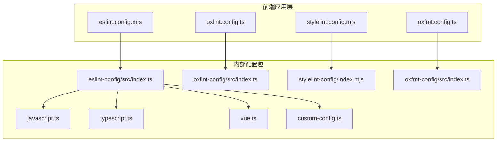
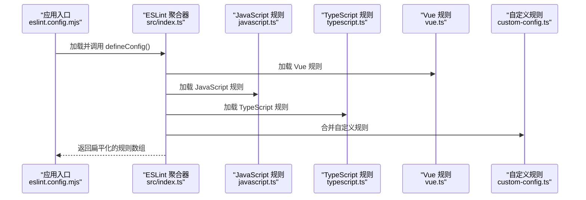
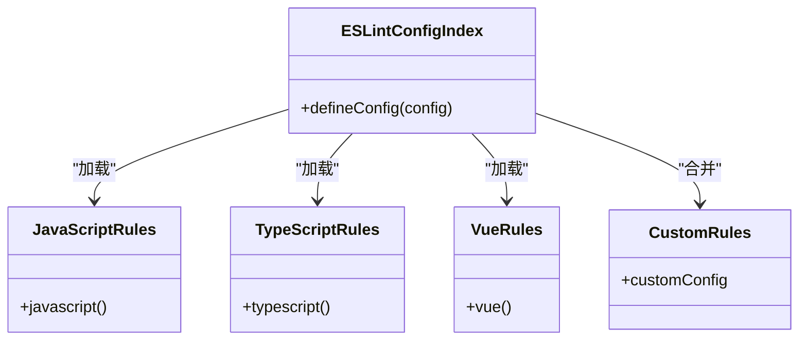
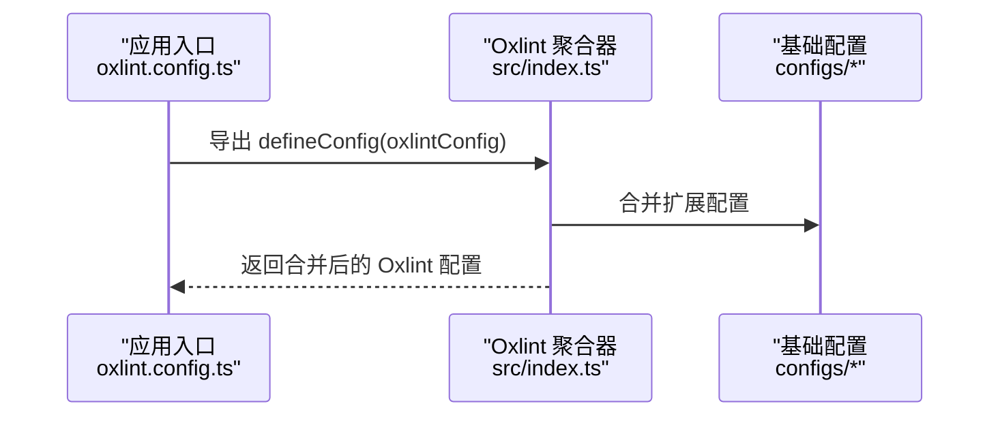
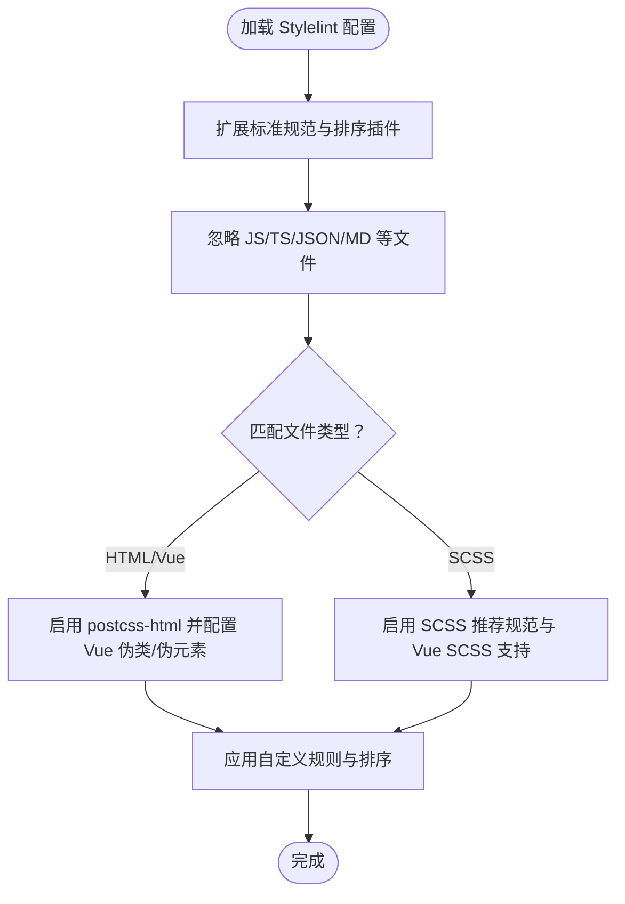
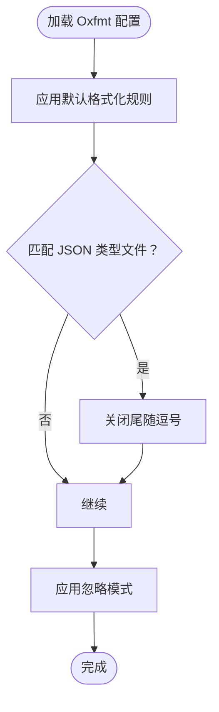
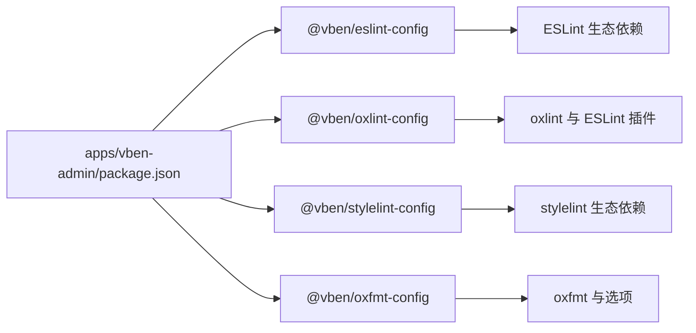

# 代码质量工具

<cite>
**本文引用的文件**
- [apps/vben-admin/eslint.config.mjs](file://apps/vben-admin/eslint.config.mjs)
- [apps/vben-admin/oxlint.config.ts](file://apps/vben-admin/oxlint.config.ts)
- [apps/vben-admin/stylelint.config.mjs](file://apps/vben-admin/stylelint.config.mjs)
- [apps/vben-admin/oxfmt.config.ts](file://apps/vben-admin/oxfmt.config.ts)
- [apps/vben-admin/internal/lint-configs/eslint-config/src/index.ts](file://apps/vben-admin/internal/lint-configs/eslint-config/src/index.ts)
- [apps/vben-admin/internal/lint-configs/eslint-config/src/configs/javascript.ts](file://apps/vben-admin/internal/lint-configs/eslint-config/src/configs/javascript.ts)
- [apps/vben-admin/internal/lint-configs/eslint-config/src/configs/typescript.ts](file://apps/vben-admin/internal/lint-configs/eslint-config/src/configs/typescript.ts)
- [apps/vben-admin/internal/lint-configs/eslint-config/src/configs/vue.ts](file://apps/vben-admin/internal/lint-configs/eslint-config/src/configs/vue.ts)
- [apps/vben-admin/internal/lint-configs/eslint-config/src/custom-config.ts](file://apps/vben-admin/internal/lint-configs/eslint-config/src/custom-config.ts)
- [apps/vben-admin/internal/lint-configs/oxlint-config/src/index.ts](file://apps/vben-admin/internal/lint-configs/oxlint-config/src/index.ts)
- [apps/vben-admin/internal/lint-configs/stylelint-config/index.mjs](file://apps/vben-admin/internal/lint-configs/stylelint-config/index.mjs)
- [apps/vben-admin/internal/lint-configs/oxfmt-config/src/index.ts](file://apps/vben-admin/internal/lint-configs/oxfmt-config/src/index.ts)
- [apps/vben-admin/package.json](file://apps/vben-admin/package.json)
- [apps/vben-admin/internal/lint-configs/eslint-config/package.json](file://apps/vben-admin/internal/lint-configs/eslint-config/package.json)
- [apps/vben-admin/internal/lint-configs/oxlint-config/package.json](file://apps/vben-admin/internal/lint-configs/oxlint-config/package.json)
- [apps/vben-admin/internal/lint-configs/stylelint-config/package.json](file://apps/vben-admin/internal/lint-configs/stylelint-config/package.json)
</cite>

## 目录
1. [简介](#简介)
2. [项目结构](#项目结构)
3. [核心组件](#核心组件)
4. [架构总览](#架构总览)
5. [详细组件分析](#详细组件分析)
6. [依赖关系分析](#依赖关系分析)
7. [性能考量](#性能考量)
8. [故障排查指南](#故障排查指南)
9. [结论](#结论)
10. [附录](#附录)

## 简介
本文件系统性梳理并说明本仓库中代码质量工具的配置与使用，覆盖以下方面：
- ESLint 配置：JavaScript、TypeScript、Vue 文件的规则与自定义规则
- Oxlint 作为 ESLint 替代工具的配置与使用，包括性能优势与规则差异
- Stylelint 样式文件的代码规范配置
- 代码格式化工具 Prettier 与 oxfmt 的配置与 IDE 集成
- 自定义规则与团队协作规范制定
- CI/CD 中的代码质量检查与自动化流程

## 项目结构
本项目的代码质量工具主要集中在前端应用层（apps/vben-admin）以及内部 lint 配置包（internal/lint-configs）。核心入口与配置如下：
- ESLint 入口：apps/vben-admin/eslint.config.mjs
- Oxlint 入口：apps/vben-admin/oxlint.config.ts
- Stylelint 入口：apps/vben-admin/stylelint.config.mjs
- Oxfmt 入口：apps/vben-admin/oxfmt.config.ts
- 内部 ESLint 配置聚合：internal/lint-configs/eslint-config/src/index.ts
- 各类规则子配置：javascript.ts、typescript.ts、vue.ts
- 自定义规则：custom-config.ts
- 内部 Oxlint 配置聚合：internal/lint-configs/oxlint-config/src/index.ts
- Stylelint 配置：internal/lint-configs/stylelint-config/index.mjs
- Oxfmt 配置：internal/lint-configs/oxfmt-config/src/index.ts
- 工具链脚本与依赖：apps/vben-admin/package.json 及各配置包的 package.json

图表来源
- [apps/vben-admin/eslint.config.mjs:1-4](file://apps/vben-admin/eslint.config.mjs#L1-L4)
- [apps/vben-admin/oxlint.config.ts:1-6](file://apps/vben-admin/oxlint.config.ts#L1-L6)
- [apps/vben-admin/stylelint.config.mjs:1-5](file://apps/vben-admin/stylelint.config.mjs#L1-L5)
- [apps/vben-admin/oxfmt.config.ts:1-27](file://apps/vben-admin/oxfmt.config.ts#L1-L27)
- [apps/vben-admin/internal/lint-configs/eslint-config/src/index.ts:1-47](file://apps/vben-admin/internal/lint-configs/eslint-config/src/index.ts#L1-L47)
- [apps/vben-admin/internal/lint-configs/eslint-config/src/configs/javascript.ts:1-183](file://apps/vben-admin/internal/lint-configs/eslint-config/src/configs/javascript.ts#L1-L183)
- [apps/vben-admin/internal/lint-configs/eslint-config/src/configs/typescript.ts:1-59](file://apps/vben-admin/internal/lint-configs/eslint-config/src/configs/typescript.ts#L1-L59)
- [apps/vben-admin/internal/lint-configs/eslint-config/src/configs/vue.ts:1-152](file://apps/vben-admin/internal/lint-configs/eslint-config/src/configs/vue.ts#L1-L152)
- [apps/vben-admin/internal/lint-configs/eslint-config/src/custom-config.ts:1-155](file://apps/vben-admin/internal/lint-configs/eslint-config/src/custom-config.ts#L1-L155)
- [apps/vben-admin/internal/lint-configs/oxlint-config/src/index.ts:1-22](file://apps/vben-admin/internal/lint-configs/oxlint-config/src/index.ts#L1-L22)
- [apps/vben-admin/internal/lint-configs/stylelint-config/index.mjs:1-149](file://apps/vben-admin/internal/lint-configs/stylelint-config/index.mjs#L1-L149)
- [apps/vben-admin/internal/lint-configs/oxfmt-config/src/index.ts:1-40](file://apps/vben-admin/internal/lint-configs/oxfmt-config/src/index.ts#L1-L40)

章节来源
- [apps/vben-admin/eslint.config.mjs:1-4](file://apps/vben-admin/eslint.config.mjs#L1-L4)
- [apps/vben-admin/oxlint.config.ts:1-6](file://apps/vben-admin/oxlint.config.ts#L1-L6)
- [apps/vben-admin/stylelint.config.mjs:1-5](file://apps/vben-admin/stylelint.config.mjs#L1-L5)
- [apps/vben-admin/oxfmt.config.ts:1-27](file://apps/vben-admin/oxfmt.config.ts#L1-L27)
- [apps/vben-admin/internal/lint-configs/eslint-config/src/index.ts:1-47](file://apps/vben-admin/internal/lint-configs/eslint-config/src/index.ts#L1-L47)
- [apps/vben-admin/internal/lint-configs/oxlint-config/src/index.ts:1-22](file://apps/vben-admin/internal/lint-configs/oxlint-config/src/index.ts#L1-L22)
- [apps/vben-admin/internal/lint-configs/stylelint-config/index.mjs:1-149](file://apps/vben-admin/internal/lint-configs/stylelint-config/index.mjs#L1-L149)
- [apps/vben-admin/internal/lint-configs/oxfmt-config/src/index.ts:1-40](file://apps/vben-admin/internal/lint-configs/oxfmt-config/src/index.ts#L1-L40)

## 核心组件
- ESLint 配置聚合器：负责按顺序加载 JavaScript、TypeScript、Vue、JSON/YAML/Node/Perfectionist/Unicorn/PNPM 等规则，并合并自定义规则与用户传入的额外配置。
- Oxlint 配置聚合器：以 oxlint 官方配置为基础，支持扩展与合并，最终导出可执行的配置对象。
- Stylelint 配置：基于标准规范与 SCSS/Vue 支持，针对伪类/伪元素与特定 at-rule 进行定制。
- Oxfmt 配置：统一的格式化规则，支持对 JSON 系列文件的特殊处理与忽略模式。

章节来源
- [apps/vben-admin/internal/lint-configs/eslint-config/src/index.ts:25-44](file://apps/vben-admin/internal/lint-configs/eslint-config/src/index.ts#L25-L44)
- [apps/vben-admin/internal/lint-configs/oxlint-config/src/index.ts:11-17](file://apps/vben-admin/internal/lint-configs/oxlint-config/src/index.ts#L11-L17)
- [apps/vben-admin/internal/lint-configs/stylelint-config/index.mjs:1-149](file://apps/vben-admin/internal/lint-configs/stylelint-config/index.mjs#L1-L149)
- [apps/vben-admin/internal/lint-configs/oxfmt-config/src/index.ts:5-36](file://apps/vben-admin/internal/lint-configs/oxfmt-config/src/index.ts#L5-L36)

## 架构总览
下图展示了从应用入口到具体规则模块的调用链路与职责分工：

图表来源
- [apps/vben-admin/eslint.config.mjs:1-4](file://apps/vben-admin/eslint.config.mjs#L1-L4)
- [apps/vben-admin/internal/lint-configs/eslint-config/src/index.ts:25-44](file://apps/vben-admin/internal/lint-configs/eslint-config/src/index.ts#L25-L44)
- [apps/vben-admin/internal/lint-configs/eslint-config/src/configs/javascript.ts:67-183](file://apps/vben-admin/internal/lint-configs/eslint-config/src/configs/javascript.ts#L67-L183)
- [apps/vben-admin/internal/lint-configs/eslint-config/src/configs/typescript.ts:13-59](file://apps/vben-admin/internal/lint-configs/eslint-config/src/configs/typescript.ts#L13-L59)
- [apps/vben-admin/internal/lint-configs/eslint-config/src/configs/vue.ts:5-152](file://apps/vben-admin/internal/lint-configs/eslint-config/src/configs/vue.ts#L5-L152)
- [apps/vben-admin/internal/lint-configs/eslint-config/src/custom-config.ts:1-155](file://apps/vben-admin/internal/lint-configs/eslint-config/src/custom-config.ts#L1-L155)

## 详细组件分析

### ESLint 配置与规则体系
- 配置聚合逻辑
  - 按顺序加载 vue、javascript、ignores、typescript、jsonc、node、perfectionist、unicorn、yaml、pnpm，并追加自定义规则与用户传入配置，最后扁平化返回。
- JavaScript 规则要点
  - 基于官方推荐规则集，剔除被 Oxlint 覆盖的规则，避免重复检查。
  - 关键规则示例：点号访问、关键字间距、八进制限制、受限属性与语法、未使用变量检测等。
- TypeScript 规则要点
  - 使用严格配置集，剔除被 Oxlint 覆盖的规则；关闭部分类型边界规则以减少噪音。
  - 解析器与项目引用配置，支持 Vue 单文件解析。
- Vue 规则要点
  - 继承官方“essential/strongly-recommended/recommended”规则集，补充模板属性命名、块顺序、事件命名、宏顺序、空格与运算符等约束。
- 自定义规则
  - 针对不同包路径设置差异化规则，如禁止导入特定内部包、限制 @vben 包的跨域引入、禁用 console 的场景等。

图表来源
- [apps/vben-admin/internal/lint-configs/eslint-config/src/index.ts:25-44](file://apps/vben-admin/internal/lint-configs/eslint-config/src/index.ts#L25-L44)
- [apps/vben-admin/internal/lint-configs/eslint-config/src/configs/javascript.ts:67-183](file://apps/vben-admin/internal/lint-configs/eslint-config/src/configs/javascript.ts#L67-L183)
- [apps/vben-admin/internal/lint-configs/eslint-config/src/configs/typescript.ts:13-59](file://apps/vben-admin/internal/lint-configs/eslint-config/src/configs/typescript.ts#L13-L59)
- [apps/vben-admin/internal/lint-configs/eslint-config/src/configs/vue.ts:5-152](file://apps/vben-admin/internal/lint-configs/eslint-config/src/configs/vue.ts#L5-L152)
- [apps/vben-admin/internal/lint-configs/eslint-config/src/custom-config.ts:1-155](file://apps/vben-admin/internal/lint-configs/eslint-config/src/custom-config.ts#L1-L155)

章节来源
- [apps/vben-admin/internal/lint-configs/eslint-config/src/index.ts:25-44](file://apps/vben-admin/internal/lint-configs/eslint-config/src/index.ts#L25-L44)
- [apps/vben-admin/internal/lint-configs/eslint-config/src/configs/javascript.ts:67-183](file://apps/vben-admin/internal/lint-configs/eslint-config/src/configs/javascript.ts#L67-L183)
- [apps/vben-admin/internal/lint-configs/eslint-config/src/configs/typescript.ts:13-59](file://apps/vben-admin/internal/lint-configs/eslint-config/src/configs/typescript.ts#L13-L59)
- [apps/vben-admin/internal/lint-configs/eslint-config/src/configs/vue.ts:5-152](file://apps/vben-admin/internal/lint-configs/eslint-config/src/configs/vue.ts#L5-L152)
- [apps/vben-admin/internal/lint-configs/eslint-config/src/custom-config.ts:1-155](file://apps/vben-admin/internal/lint-configs/eslint-config/src/custom-config.ts#L1-L155)

### Oxlint 配置与替代策略
- 配置入口
  - 通过 @vben/oxlint-config 提供的基础配置，结合 defineConfig 合并扩展项，输出最终 oxlint 配置。
- 规则覆盖与差异
  - 在 ESLint 的 javascript.ts 与 typescript.ts 中明确标注被 Oxlint 覆盖的规则集合，确保两类工具不重复检查同一问题，提升效率。
- 性能优势
  - Oxlint 为 Rust 实现的高性能 linter，适合大型仓库与 CI 场景，显著缩短检查时间。

图表来源
- [apps/vben-admin/oxlint.config.ts:1-6](file://apps/vben-admin/oxlint.config.ts#L1-L6)
- [apps/vben-admin/internal/lint-configs/oxlint-config/src/index.ts:11-17](file://apps/vben-admin/internal/lint-configs/oxlint-config/src/index.ts#L11-L17)

章节来源
- [apps/vben-admin/oxlint.config.ts:1-6](file://apps/vben-admin/oxlint.config.ts#L1-L6)
- [apps/vben-admin/internal/lint-configs/oxlint-config/src/index.ts:11-17](file://apps/vben-admin/internal/lint-configs/oxlint-config/src/index.ts#L11-L17)
- [apps/vben-admin/internal/lint-configs/eslint-config/src/configs/javascript.ts:7-65](file://apps/vben-admin/internal/lint-configs/eslint-config/src/configs/javascript.ts#L7-L65)
- [apps/vben-admin/internal/lint-configs/eslint-config/src/configs/typescript.ts:5-11](file://apps/vben-admin/internal/lint-configs/eslint-config/src/configs/typescript.ts#L5-L11)

### Stylelint 配置
- 扩展标准规范与排序插件，忽略 JS/TS/JSON/Markdown 等非样式文件。
- 针对 HTML/Vue 模板启用 postcss-html，支持全局/深度选择器等 Vue 特定伪类/伪元素。
- 针对 SCSS 文件启用推荐 SCSS 规范与 Vue SCSS 支持。
- 自定义规则覆盖：忽略若干在工程中不适用或易误报的规则；统一属性顺序与空行策略；SCSS at-rule 白名单；BEM 风格选择器正则等。

图表来源
- [apps/vben-admin/internal/lint-configs/stylelint-config/index.mjs:1-149](file://apps/vben-admin/internal/lint-configs/stylelint-config/index.mjs#L1-L149)

章节来源
- [apps/vben-admin/internal/lint-configs/stylelint-config/index.mjs:1-149](file://apps/vben-admin/internal/lint-configs/stylelint-config/index.mjs#L1-L149)

### Oxfmt 格式化配置
- 默认规则：最大行长、段落换行策略、分号、单引号、包管理文件排序开关、尾随逗号策略等。
- 对 JSON/JSON5/JSONC/VSCode Workspace 等文件进行特殊处理，关闭尾随逗号以避免解析问题。
- 支持忽略模式，便于排除构建产物、锁文件、覆盖率报告、公共资源等目录与文件。

图表来源
- [apps/vben-admin/internal/lint-configs/oxfmt-config/src/index.ts:5-36](file://apps/vben-admin/internal/lint-configs/oxfmt-config/src/index.ts#L5-L36)
- [apps/vben-admin/oxfmt.config.ts:1-27](file://apps/vben-admin/oxfmt.config.ts#L1-L27)

章节来源
- [apps/vben-admin/internal/lint-configs/oxfmt-config/src/index.ts:5-36](file://apps/vben-admin/internal/lint-configs/oxfmt-config/src/index.ts#L5-L36)
- [apps/vben-admin/oxfmt.config.ts:1-27](file://apps/vben-admin/oxfmt.config.ts#L1-L27)

### Prettier 与 IDE 集成
- 本仓库未直接提供 Prettier 配置文件，但已内置 oxfmt 作为统一格式化工具。建议在本地 IDE 中：
  - 安装对应语言格式化扩展（如 Vue/TypeScript/SCSS 等）
  - 将 oxfmt 作为默认格式化程序，或通过编辑器钩子在保存时自动格式化
  - 若团队仍需使用 Prettier，可在各自项目中添加 .prettierrc 并与 oxfmt 规则保持一致
- 与 ESLint/Stylelint 的协同
  - 优先使用 ESLint 与 Stylelint 进行规则检查，Oxfmt 用于格式化统一风格，避免双重格式化冲突

[本节为通用实践说明，不直接分析具体文件，故无章节来源]

## 依赖关系分析
- 应用层依赖
  - apps/vben-admin/package.json 声明了 @vben/eslint-config、@vben/oxlint-config、@vben/stylelint-config、@vben/oxfmt-config 等工作区依赖，并提供 lint/format 等脚本。
- 配置包依赖
  - ESLint 配置包依赖各类 ESLint 插件与解析器，涵盖 Vue、TypeScript、Node、YAML、JSON、Perfectionist、Unicorn、PNPM 等。
  - Oxlint 配置包依赖 oxlint 与若干 ESLint 插件，用于规则映射与扩展。
  - Stylelint 配置包依赖标准规范与排序插件，以及 postcss-* 生态以支持 HTML/Vue/SCSS。
  - Oxfmt 配置包依赖 oxfmt 与相关选项。

图表来源
- [apps/vben-admin/package.json:54-97](file://apps/vben-admin/package.json#L54-L97)
- [apps/vben-admin/internal/lint-configs/eslint-config/package.json:29-46](file://apps/vben-admin/internal/lint-configs/eslint-config/package.json#L29-L46)
- [apps/vben-admin/internal/lint-configs/oxlint-config/package.json:29-35](file://apps/vben-admin/internal/lint-configs/oxlint-config/package.json#L29-L35)
- [apps/vben-admin/internal/lint-configs/stylelint-config/package.json:25-41](file://apps/vben-admin/internal/lint-configs/stylelint-config/package.json#L25-L41)
- [apps/vben-admin/internal/lint-configs/oxfmt-config/src/index.ts:1-40](file://apps/vben-admin/internal/lint-configs/oxfmt-config/src/index.ts#L1-L40)

章节来源
- [apps/vben-admin/package.json:54-97](file://apps/vben-admin/package.json#L54-L97)
- [apps/vben-admin/internal/lint-configs/eslint-config/package.json:29-46](file://apps/vben-admin/internal/lint-configs/eslint-config/package.json#L29-L46)
- [apps/vben-admin/internal/lint-configs/oxlint-config/package.json:29-35](file://apps/vben-admin/internal/lint-configs/oxlint-config/package.json#L29-L35)
- [apps/vben-admin/internal/lint-configs/stylelint-config/package.json:25-41](file://apps/vben-admin/internal/lint-configs/stylelint-config/package.json#L25-L41)
- [apps/vben-admin/internal/lint-configs/oxfmt-config/src/index.ts:1-40](file://apps/vben-admin/internal/lint-configs/oxfmt-config/src/index.ts#L1-L40)

## 性能考量
- 采用 Oxlint 替代部分 ESLint 规则，减少重复检查，显著降低 CI 时间成本。
- 通过规则覆盖集合剔除重复规则，避免 ESLint 与 Oxlint 的冲突与冗余开销。
- Oxfmt 作为单一格式化工具，统一风格并简化工具链复杂度。

[本节为通用性能讨论，不直接分析具体文件，故无章节来源]

## 故障排查指南
- 规则冲突
  - 若出现 ESLint 与 Oxlint 报错重复或相互矛盾，确认 javascript.ts 与 typescript.ts 中的覆盖规则集合是否正确生效。
- 规则未生效
  - 检查自定义规则范围与文件匹配是否正确，尤其是 packages/@core 等包的导入限制。
- 格式化异常
  - 对于 JSON/JSON5/JSONC/VSCode Workspace 等文件，确认 oxfmt 的 overrides 是否覆盖到目标文件类型。
- 忽略模式无效
  - 检查 oxfmt.config.ts 的 ignorePatterns 是否包含目标目录或文件，必要时在本地项目中追加更精确的忽略规则。

章节来源
- [apps/vben-admin/internal/lint-configs/eslint-config/src/configs/javascript.ts:7-65](file://apps/vben-admin/internal/lint-configs/eslint-config/src/configs/javascript.ts#L7-L65)
- [apps/vben-admin/internal/lint-configs/eslint-config/src/configs/typescript.ts:5-11](file://apps/vben-admin/internal/lint-configs/eslint-config/src/configs/typescript.ts#L5-L11)
- [apps/vben-admin/internal/lint-configs/eslint-config/src/custom-config.ts:1-155](file://apps/vben-admin/internal/lint-configs/eslint-config/src/custom-config.ts#L1-L155)
- [apps/vben-admin/internal/lint-configs/oxfmt-config/src/index.ts:12-28](file://apps/vben-admin/internal/lint-configs/oxfmt-config/src/index.ts#L12-L28)
- [apps/vben-admin/oxfmt.config.ts:4-25](file://apps/vben-admin/oxfmt.config.ts#L4-L25)

## 结论
本仓库通过内部配置包实现了高度可复用且可扩展的代码质量体系：ESLint 负责多语言规则检查，Oxlint 作为高性能替代与补充，Stylelint 保障样式一致性，Oxfmt 统一格式化风格。配合自定义规则与团队规范，能够在保证质量的同时提升开发与 CI 效率。

[本节为总结性内容，不直接分析具体文件，故无章节来源]

## 附录

### CI/CD 集成与自动化流程建议
- 在 CI 中并行执行：
  - ESLint/Oxlint：检查语法与风格问题
  - Stylelint：检查样式规范
  - 类型检查与单元测试：确保逻辑正确性
- 保存阶段可触发格式化（oxfmt），避免提交格式漂移
- 使用缓存策略加速安装与构建，减少 CI 时间

[本节为通用流程建议，不直接分析具体文件，故无章节来源]