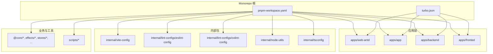
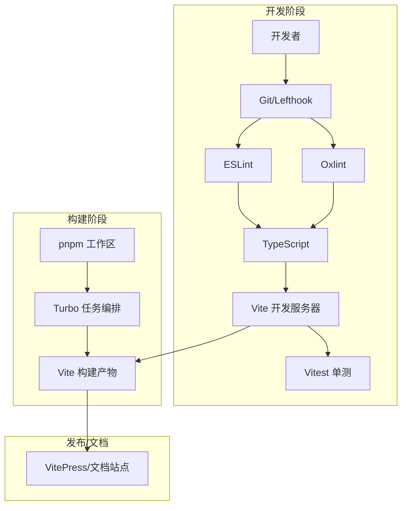
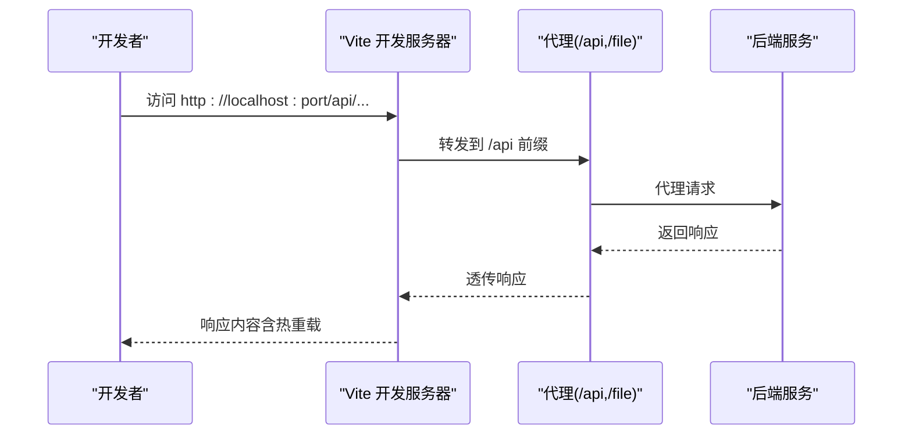
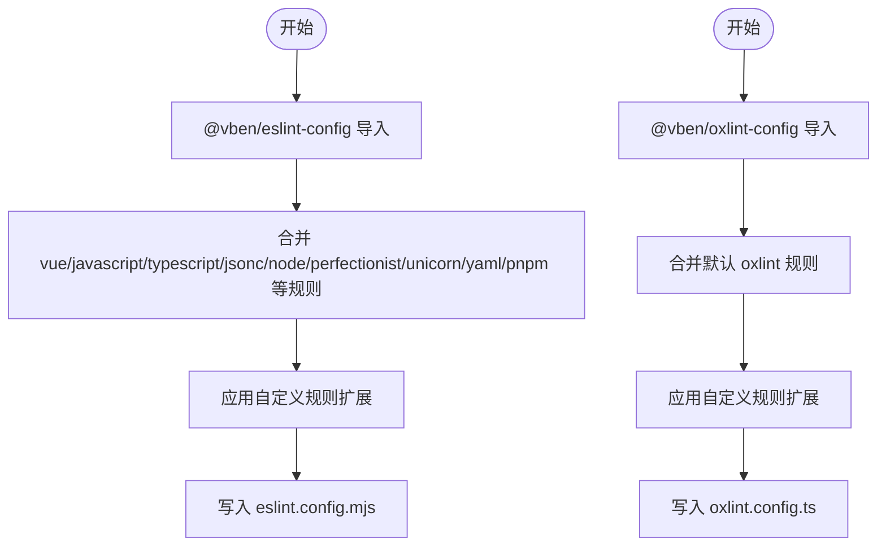
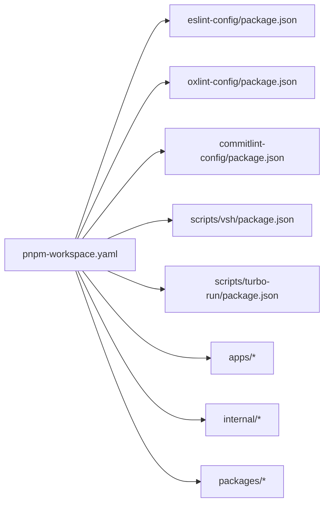

# 开发工具

<cite>
**本文引用的文件**
- [turbo.json](file://apps/vben-admin/turbo.json)
- [pnpm-workspace.yaml](file://apps/vben-admin/pnpm-workspace.yaml)
- [eslint.config.mjs](file://apps/vben-admin/eslint.config.mjs)
- [oxlint.config.ts](file://apps/vben-admin/oxlint.config.ts)
- [vitest.config.ts](file://apps/vben-admin/vitest.config.ts)
- [vite.config.ts](file://apps/vben-admin/apps/web-antd/vite.config.ts)
- [index.ts](file://apps/vben-admin/internal/lint-configs/eslint-config/src/index.ts)
- [index.ts](file://apps/vben-admin/internal/lint-configs/oxlint-config/src/index.ts)
- [package.json](file://apps/vben-admin/internal/lint-configs/eslint-config/package.json)
- [package.json](file://apps/vben-admin/internal/lint-configs/oxlint-config/package.json)
- [package.json](file://apps/vben-admin/internal/lint-configs/commitlint-config/package.json)
- [package.json](file://apps/vben-admin/scripts/vsh/package.json)
- [package.json](file://apps/vben-admin/scripts/turbo-run/package.json)
- [lefthook.yml](file://apps/vben-admin/lefthook.yml)
- [README.md](file://apps/vben-admin/README.md)
- [README.md](file://apps/vben-admin/apps/web-antd/README.md)
- [README.md](file://apps/vben-admin/internal/lint-configs/eslint-config/README.md)
- [README.md](file://apps/vben-admin/internal/lint-configs/oxlint-config/README.md)
- [README.md](file://apps/vben-admin/internal/lint-configs/commitlint-config/README.md)
- [README.md](file://apps/vben-admin/scripts/vsh/README.md)
- [README.md](file://apps/vben-admin/scripts/turbo-run/README.md)
- [README.md](file://README.md)
</cite>

## 目录
1. [简介](#简介)
2. [项目结构](#项目结构)
3. [核心组件](#核心组件)
4. [架构总览](#架构总览)
5. [详细组件分析](#详细组件分析)
6. [依赖分析](#依赖分析)
7. [性能考虑](#性能考虑)
8. [故障排查指南](#故障排查指南)
9. [结论](#结论)
10. [附录](#附录)

## 简介
本文件面向开发团队与贡献者，系统性梳理本项目的开发工具链与工程化实践，覆盖以下方面：
- Turbo Monorepo 构建工具的配置与使用
- Vite 构建工具的配置（开发服务器、代理、构建优化、热重载）
- ESLint 与 Oxlint 代码质量工具的配置与规则定制
- TypeScript 编译与类型检查策略
- 测试框架 Vitest 的配置与单元测试编写
- 调试技巧（浏览器、Node.js、移动端）
- 代码格式化工具 Prettier 与 oxfmt 的配置
- Git 工作流、提交规范与分支管理
- IDE 配置建议与插件推荐
- 提升开发效率的工具与自动化脚本

## 项目结构
本项目采用 pnpm workspaces + Turbo 的 Monorepo 架构，统一管理前端应用、内部工具包与脚本。关键目录与职责如下：
- apps：多应用入口（如 web-antd 前端应用）
- internal：内部可复用能力（vite-config、lint-configs、node-utils、tailwind-config、tsconfig）
- packages：业务与通用库（如 @core、effects、stores 等）
- scripts：自研工具脚本（如 vsh、turbo-run）
- 根级配置：turbo.json、pnpm-workspace.yaml、各类工具配置文件

图表来源
- [pnpm-workspace.yaml:1-221](file://apps/vben-admin/pnpm-workspace.yaml#L1-L221)
- [turbo.json:1-49](file://apps/vben-admin/turbo.json#L1-L49)

章节来源
- [pnpm-workspace.yaml:1-221](file://apps/vben-admin/pnpm-workspace.yaml#L1-L221)
- [turbo.json:1-49](file://apps/vben-admin/turbo.json#L1-L49)

## 核心组件
- 构建与缓存：Turbo（任务编排、缓存、增量构建）
- 包管理：pnpm（workspaces、hoist、catalog）
- 代码质量：ESLint（扁平配置）、Oxlint（高性能规则集）
- 类型检查：TypeScript（多 tsconfig 分层）
- 构建工具：Vite（开发服务器、代理、插件生态）
- 测试：Vitest（DOM 环境、JSX 支持、排除策略）
- 文档与协作：Lefthook（Git hooks）、Commitlint（提交规范）

章节来源
- [turbo.json:1-49](file://apps/vben-admin/turbo.json#L1-L49)
- [pnpm-workspace.yaml:1-221](file://apps/vben-admin/pnpm-workspace.yaml#L1-L221)
- [eslint.config.mjs:1-4](file://apps/vben-admin/eslint.config.mjs#L1-L4)
- [oxlint.config.ts:1-6](file://apps/vben-admin/oxlint.config.ts#L1-L6)
- [vitest.config.ts:1-29](file://apps/vben-admin/vitest.config.ts#L1-L29)
- [vite.config.ts:1-24](file://apps/vben-admin/apps/web-antd/vite.config.ts#L1-L24)

## 架构总览
下图展示开发工具链在 Monorepo 中的交互关系与职责边界。

图表来源
- [pnpm-workspace.yaml:1-221](file://apps/vben-admin/pnpm-workspace.yaml#L1-L221)
- [turbo.json:1-49](file://apps/vben-admin/turbo.json#L1-L49)
- [eslint.config.mjs:1-4](file://apps/vben-admin/eslint.config.mjs#L1-L4)
- [oxlint.config.ts:1-6](file://apps/vben-admin/oxlint.config.ts#L1-L6)
- [vitest.config.ts:1-29](file://apps/vben-admin/vitest.config.ts#L1-L29)
- [vite.config.ts:1-24](file://apps/vben-admin/apps/web-antd/vite.config.ts#L1-L24)

## 详细组件分析

### Turbo Monorepo 构建工具
- 全局依赖与环境：通过 globalDependencies 统一纳入锁文件、tsconfig、内部工具包等变更影响范围；globalEnv 暴露 NODE_ENV。
- 任务定义：
  - build：按拓扑顺序依赖上游构建，输出 dist、zip、文档产物。
  - preview/build:analyze：预览与可视化分析。
  - dev：禁用缓存、持久化任务，适合本地开发。
  - typecheck：仅类型检查，无输出。
  - 特定子任务：如 @vben/backend-mock#build 输出 Nitro/PWA 相关目录。
- 使用建议：
  - 在多应用场景下，优先使用 turbo run <task> --filter <app> 进行定向构建。
  - 利用缓存与增量构建加速迭代。

章节来源
- [turbo.json:1-49](file://apps/vben-admin/turbo.json#L1-L49)

### Vite 构建工具
- 应用配置示例（web-antd）：
  - 开发服务器：启用代理，支持 /api 与 /file 前缀转发至后端服务，开启 WebSocket。
  - 插件：基于 @vben/vite-config 的统一配置入口。
- 热重载与开发体验：
  - Vite 默认热更新已开箱即用；结合插件生态（如 PWA、DevTools）进一步增强。
- 构建优化：
  - 建议结合压缩、可视化与按需导入插件（参考内部 vite-config 插件集合）。
- 代理设置最佳实践：
  - 明确路径前缀与目标地址，避免冲突；对静态资源与 API 请求分别配置。

图表来源
- [vite.config.ts:1-24](file://apps/vben-admin/apps/web-antd/vite.config.ts#L1-L24)

章节来源
- [vite.config.ts:1-24](file://apps/vben-admin/apps/web-antd/vite.config.ts#L1-L24)

### ESLint 与 Oxlint 代码质量工具
- ESLint 配置：
  - 采用扁平配置（flat config），由 @vben/eslint-config 导出统一规则集。
  - 内部 eslint-config 将 vue、javascript、typescript、jsonc、node、perfectionist、unicorn、yaml、pnpm 等规则模块组合，并支持自定义扩展。
- Oxlint 配置：
  - 以 oxlint-config 包为基础，合并默认规则与扩展配置，导出 defineConfig。
- 规则定制：
  - 可在内部 eslint-config 的 custom-config 或 oxlint-config 的 configs 中追加或覆盖规则。
  - 建议在团队内统一规则风格，减少分歧。

图表来源
- [eslint.config.mjs:1-4](file://apps/vben-admin/eslint.config.mjs#L1-L4)
- [index.ts:25-44](file://apps/vben-admin/internal/lint-configs/eslint-config/src/index.ts#L25-L44)
- [oxlint.config.ts:1-6](file://apps/vben-admin/oxlint.config.ts#L1-L6)
- [index.ts:11-17](file://apps/vben-admin/internal/lint-configs/oxlint-config/src/index.ts#L11-L17)

章节来源
- [eslint.config.mjs:1-4](file://apps/vben-admin/eslint.config.mjs#L1-L4)
- [index.ts:1-47](file://apps/vben-admin/internal/lint-configs/eslint-config/src/index.ts#L1-L47)
- [oxlint.config.ts:1-6](file://apps/vben-admin/oxlint.config.ts#L1-L6)
- [index.ts:1-22](file://apps/vben-admin/internal/lint-configs/oxlint-config/src/index.ts#L1-L22)

### TypeScript 编译与类型检查策略
- 多套 tsconfig 分层：
  - web-app.json、web.json、node.json、library.json、base.json 等，分别面向不同场景（Web 应用、Node、库等）。
  - 通过 internal/tsconfig 提供统一基线与继承关系，确保各应用与内部包的一致性。
- 类型检查建议：
  - 在 CI 中执行全量类型检查；本地开发可结合编辑器实时提示。
  - 对于大型 monorepo，建议拆分任务，配合 Turbo 的 typecheck 任务使用。

章节来源
- [pnpm-workspace.yaml:1-221](file://apps/vben-admin/pnpm-workspace.yaml#L1-L221)
- [README.md](file://apps/vben-admin/internal/tsconfig/README.md)

### Vitest 测试框架
- 配置要点：
  - 启用 @vitejs/plugin-vue 与 @vitejs/plugin-vue-jsx。
  - 使用 happy-dom 作为测试 DOM 环境，兼容新版安全策略（允许禁用脚本加载视为成功）。
  - 排除规则覆盖 e2e、dist、node_modules、样式与配置文件等目录。
- 单元测试编写建议：
  - 遵循“行为驱动”的命名与组织方式；优先测试核心逻辑与边界条件。
  - 结合 mock 与快照，保持测试稳定与可维护。

章节来源
- [vitest.config.ts:1-29](file://apps/vben-admin/vitest.config.ts#L1-L29)

### 调试工具与技巧
- 浏览器调试：
  - 使用 Vite DevTools 插件（已在内部配置中体现）进行组件与状态调试。
- Node.js 调试：
  - 在后端应用（如 backend）中，结合 VS Code 的 Node 调试配置进行断点调试。
- 移动端调试：
  - 使用 Vite 的本地网络访问与代理，结合浏览器远程调试或真机调试工具。
- 建议：
  - 在本地开发时开启最小化日志，定位问题时逐步缩小范围。

章节来源
- [vite.config.ts:1-24](file://apps/vben-admin/apps/web-antd/vite.config.ts#L1-L24)
- [README.md](file://apps/vben-admin/apps/web-antd/README.md)

### 代码格式化：Prettier 与 oxfmt
- Prettier：作为社区主流格式化工具，建议在项目根目录提供配置文件，统一缩进、引号、尾逗号等风格。
- oxfmt：与 Oxlint 协同，用于格式化与规则一致性。可在工作流中集成，保证提交前格式统一。
- 实践建议：
  - 在 Lefthook 中配置 pre-commit 钩子，自动运行 oxfmt 与 Prettier。
  - 团队统一风格，避免混用不同格式化工具导致的冲突。

章节来源
- [pnpm-workspace.yaml:14-27](file://apps/vben-admin/pnpm-workspace.yaml#L14-L27)
- [README.md](file://apps/vben-admin/internal/lint-configs/oxlint-config/README.md)

### Git 工作流、提交规范与分支管理
- 提交规范：
  - 采用 commitlint 与 conventional 规范，确保提交信息可读且可触发自动化流程。
- 分支管理：
  - 建议采用 Git Flow 或 GitHub Flow，主分支受保护，功能从 develop 或 main 拉取，合并后清理。
- 工具链：
  - Lefthook：在 pre-commit/pre-push 阶段执行 lint、format、test 等检查。
  - Changesets：用于版本发布与变更日志生成（见内部 packages 与脚本）。

章节来源
- [pnpm-workspace.yaml:14-27](file://apps/vben-admin/pnpm-workspace.yaml#L14-L27)
- [lefthook.yml](file://apps/vben-admin/lefthook.yml)
- [README.md](file://apps/vben-admin/internal/lint-configs/commitlint-config/README.md)

### IDE 配置与插件推荐
- VS Code 插件建议：
  - Vue 官方插件、TypeScript Vue 插件、ESLint、Prettier、Tailwind CSS、GitLens。
  - 配置工作区设置（如 editor.formatOnSave、editor.codeActionsOnSave）以提升开发效率。
- 项目工作区：
  - 使用 vben-admin.code-workspace 统一打开多应用与内部包，便于跨项目导航。

章节来源
- [README.md](file://apps/vben-admin/README.md)

### 开发效率提升：工具与自动化脚本
- 自研脚本：
  - vsh：提供循环依赖检测、依赖检查、代码工作区生成、发布前校验等功能。
  - turbo-run：封装 turbo 执行逻辑，简化命令行调用。
- 使用建议：
  - 在本地开发与 CI 中统一调用这些脚本，减少重复劳动。
  - 结合 Lefthook 钩子自动执行常用检查。

章节来源
- [README.md](file://apps/vben-admin/scripts/vsh/README.md)
- [README.md](file://apps/vben-admin/scripts/turbo-run/README.md)
- [package.json](file://apps/vben-admin/scripts/vsh/package.json)
- [package.json](file://apps/vben-admin/scripts/turbo-run/package.json)

## 依赖分析
- 包管理与版本治理：
  - pnpm workspaces 统一管理内部包与外部依赖；publicHoistPattern 将常用工具提升至顶层，减少安装体积。
  - catalog 统一声明依赖版本，避免版本漂移。
- 内部包依赖：
  - vite-config、lint-configs、node-utils 等内部包被多个应用复用，形成稳定的基础设施层。
- 外部依赖：
  - Vue、Vite、TypeScript、ESLint、Oxlint、Vitest、Turbo 等为核心工具链。

图表来源
- [pnpm-workspace.yaml:1-221](file://apps/vben-admin/pnpm-workspace.yaml#L1-L221)
- [package.json](file://apps/vben-admin/internal/lint-configs/eslint-config/package.json)
- [package.json](file://apps/vben-admin/internal/lint-configs/oxlint-config/package.json)
- [package.json](file://apps/vben-admin/internal/lint-configs/commitlint-config/package.json)
- [package.json](file://apps/vben-admin/scripts/vsh/package.json)
- [package.json](file://apps/vben-admin/scripts/turbo-run/package.json)

章节来源
- [pnpm-workspace.yaml:1-221](file://apps/vben-admin/pnpm-workspace.yaml#L1-L221)

## 性能考虑
- Turbo 增量构建与缓存：
  - 合理划分任务与输出目录，避免不必要的重建。
- Vite 构建优化：
  - 按需导入、动态导入、压缩与可视化分析，结合 CDN 与缓存策略。
- 类型检查与 Lint：
  - 在 CI 中并行执行，本地开发可按需关闭部分严格规则以提升速度。

## 故障排查指南
- Vite 代理不生效：
  - 检查代理前缀与目标地址是否匹配；确认后端服务已启动。
- Vitest DOM 环境报错：
  - 确认 happy-dom 设置中的脚本加载策略；必要时调整 handleDisabledFileLoadingAsSuccess。
- ESLint/Oxlint 规则冲突：
  - 在内部配置中显式覆盖冲突规则；统一团队规则风格。
- Turbo 缓存异常：
  - 清理 .turbo 缓存目录，重新执行任务；检查 globalDependencies 是否遗漏关键文件。

章节来源
- [vite.config.ts:1-24](file://apps/vben-admin/apps/web-antd/vite.config.ts#L1-L24)
- [vitest.config.ts:1-29](file://apps/vben-admin/vitest.config.ts#L1-L29)
- [index.ts:25-44](file://apps/vben-admin/internal/lint-configs/eslint-config/src/index.ts#L25-L44)
- [index.ts:11-17](file://apps/vben-admin/internal/lint-configs/oxlint-config/src/index.ts#L11-L17)

## 结论
本项目的开发工具链以 pnpm + Turbo 为骨架，围绕 Vite、ESLint、Oxlint、TypeScript、Vitest 构建了高一致性的工程化体系。通过内部 lint-configs、vite-config、node-utils 等包实现复用与标准化，辅以 Lefthook、Commitlint 与自研脚本，形成从开发到发布的完整闭环。建议团队持续完善规则与脚本，保持工具链的演进与稳定性。

## 附录
- 快速上手清单：
  - 安装 pnpm 并启用 pnpm workspaces。
  - 使用 turbo run dev 驱动本地开发。
  - 在提交前运行 Lefthook 钩子（lint/format/test）。
  - 使用 Vitest 编写与维护单元测试。
  - 如需格式化，统一使用 oxfmt 与 Prettier。