# 构建工具

<cite>
**本文引用的文件**
- [apps/backend/package.json](file://apps/backend/package.json)
- [apps/backend/nest-cli.json](file://apps/backend/nest-cli.json)
- [apps/fronted/package.json](file://apps/fronted/package.json)
- [apps/fronted/vite.config.ts](file://apps/fronted/vite.config.ts)
- [apps/app/package.json](file://apps/app/package.json)
- [apps/app/vite.config.ts](file://apps/app/vite.config.ts)
- [apps/vben-admin/apps/web-antd/package.json](file://apps/vben-admin/apps/web-antd/package.json)
- [apps/vben-admin/apps/web-antd/vite.config.ts](file://apps/vben-admin/apps/web-antd/vite.config.ts)
- [apps/vben-admin/turbo.json](file://apps/vben-admin/turbo.json)
- [apps/vben-admin/internal/vite-config/src/index.ts](file://apps/vben-admin/internal/vite-config/src/index.ts)
- [apps/vben-admin/internal/vite-config/src/config/application.ts](file://apps/vben-admin/internal/vite-config/src/config/application.ts)
- [apps/vben-admin/internal/vite-config/src/config/common.ts](file://apps/vben-admin/internal/vite-config/src/config/common.ts)
- [apps/vben-admin/internal/vite-config/src/config/library.ts](file://apps/vben-admin/internal/vite-config/src/config/library.ts)
- [apps/vben-admin/internal/vite-config/src/plugins/index.ts](file://apps/vben-admin/internal/vite-config/src/plugins/index.ts)
- [apps/vben-admin/scripts/deploy/Dockerfile](file://apps/vben-admin/scripts/deploy/Dockerfile)
- [apps/vben-admin/scripts/deploy/build-local-docker-image.sh](file://apps/vben-admin/scripts/deploy/build-local-docker-image.sh)
</cite>

## 目录
1. [简介](#简介)
2. [项目结构](#项目结构)
3. [核心组件](#核心组件)
4. [架构总览](#架构总览)
5. [详细组件分析](#详细组件分析)
6. [依赖分析](#依赖分析)
7. [性能考虑](#性能考虑)
8. [故障排查指南](#故障排查指南)
9. [结论](#结论)
10. [附录](#附录)

## 简介
本文件系统性梳理本仓库的构建工具与配置，覆盖以下方面：
- Turbo Monorepo 构建工具的任务依赖、缓存与并行执行策略
- Vite 在不同应用（后端 API、前端管理后台、移动端应用、Vben Admin 框架）中的差异化配置
- 开发服务器启动、热重载与代理设置
- 构建优化（代码分割、Tree Shaking、压缩、资源优化）
- 生产环境最佳实践与性能优化建议
- 构建脚本使用方法与自定义构建流程配置

## 项目结构
本仓库采用多应用混合架构：
- 后端 NestJS 应用：负责 API 服务与业务逻辑
- 前端管理后台：基于 Vue 3 的 Web 应用
- 移动端应用：基于 uni-app 的多端统一工程
- Vben Admin 框架：提供可复用的前端基础设施与构建配置

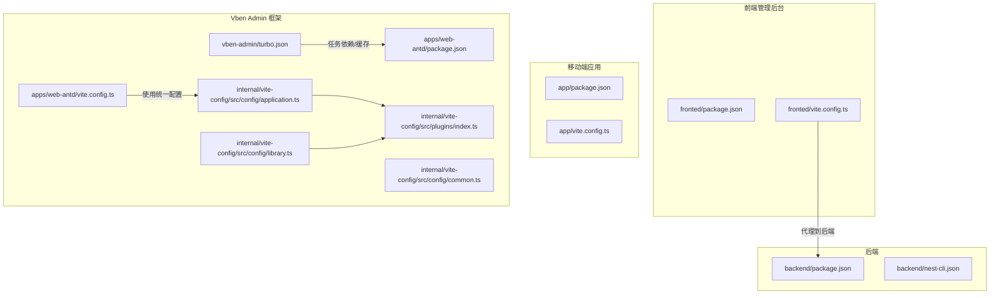

图表来源
- [apps/backend/package.json:1-50](file://apps/backend/package.json#L1-L50)
- [apps/backend/nest-cli.json:1-21](file://apps/backend/nest-cli.json#L1-L21)
- [apps/fronted/package.json:1-34](file://apps/fronted/package.json#L1-L34)
- [apps/fronted/vite.config.ts:1-28](file://apps/fronted/vite.config.ts#L1-L28)
- [apps/app/package.json:1-72](file://apps/app/package.json#L1-L72)
- [apps/app/vite.config.ts:1-8](file://apps/app/vite.config.ts#L1-L8)
- [apps/vben-admin/apps/web-antd/package.json:1-52](file://apps/vben-admin/apps/web-antd/package.json#L1-L52)
- [apps/vben-admin/apps/web-antd/vite.config.ts:1-24](file://apps/vben-admin/apps/web-antd/vite.config.ts#L1-L24)
- [apps/vben-admin/turbo.json:1-49](file://apps/vben-admin/turbo.json#L1-L49)
- [apps/vben-admin/internal/vite-config/src/config/application.ts:1-124](file://apps/vben-admin/internal/vite-config/src/config/application.ts#L1-L124)
- [apps/vben-admin/internal/vite-config/src/config/library.ts:1-60](file://apps/vben-admin/internal/vite-config/src/config/library.ts#L1-L60)
- [apps/vben-admin/internal/vite-config/src/config/common.ts:1-14](file://apps/vben-admin/internal/vite-config/src/config/common.ts#L1-L14)
- [apps/vben-admin/internal/vite-config/src/plugins/index.ts:1-262](file://apps/vben-admin/internal/vite-config/src/plugins/index.ts#L1-L262)

章节来源
- [apps/backend/package.json:1-50](file://apps/backend/package.json#L1-L50)
- [apps/fronted/package.json:1-34](file://apps/fronted/package.json#L1-L34)
- [apps/app/package.json:1-72](file://apps/app/package.json#L1-L72)
- [apps/vben-admin/apps/web-antd/package.json:1-52](file://apps/vben-admin/apps/web-antd/package.json#L1-L52)

## 核心组件
- Turbo Monorepo 构建器：通过任务图控制依赖顺序、缓存与输出目录，支持并行构建
- Vite 应用配置：统一入口加载插件与通用配置，按应用类型定制构建参数
- NestJS 后端：基于 CLI 的编译与运行，配合 tsconfig 构建配置
- 移动端 uni-app：基于 Vite 插件的多端编译
- Docker 发布：分阶段构建与 Nginx 部署

章节来源
- [apps/vben-admin/turbo.json:1-49](file://apps/vben-admin/turbo.json#L1-L49)
- [apps/vben-admin/internal/vite-config/src/config/application.ts:1-124](file://apps/vben-admin/internal/vite-config/src/config/application.ts#L1-L124)
- [apps/backend/nest-cli.json:1-21](file://apps/backend/nest-cli.json#L1-L21)
- [apps/app/vite.config.ts:1-8](file://apps/app/vite.config.ts#L1-L8)
- [apps/vben-admin/scripts/deploy/Dockerfile:1-39](file://apps/vben-admin/scripts/deploy/Dockerfile#L1-L39)

## 架构总览
下图展示从任务调度到各应用构建与部署的整体流程。

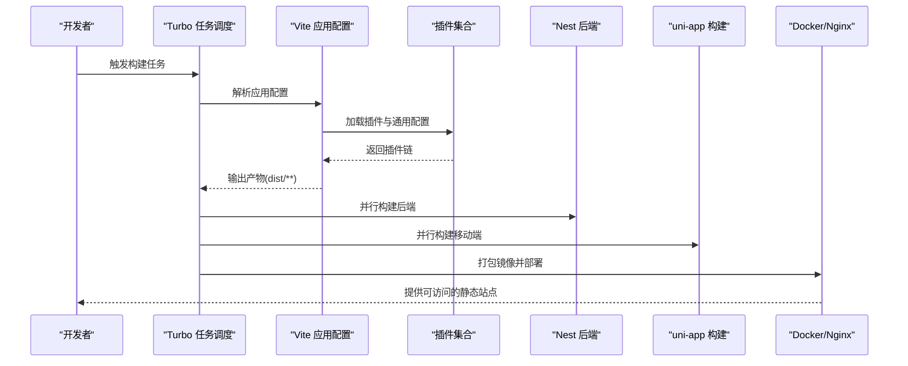

图表来源
- [apps/vben-admin/turbo.json:15-47](file://apps/vben-admin/turbo.json#L15-L47)
- [apps/vben-admin/internal/vite-config/src/config/application.ts:17-98](file://apps/vben-admin/internal/vite-config/src/config/application.ts#L17-L98)
- [apps/vben-admin/internal/vite-config/src/plugins/index.ts:1-262](file://apps/vben-admin/internal/vite-config/src/plugins/index.ts#L1-L262)
- [apps/vben-admin/scripts/deploy/Dockerfile:18-38](file://apps/vben-admin/scripts/deploy/Dockerfile#L18-L38)

## 详细组件分析

### Turbo Monorepo 构建配置
- 全局依赖与环境：监控锁文件、环境变量与内部工具源码变更，确保缓存一致性
- 任务定义与依赖：
  - build 任务依赖上游应用产出（^build），并声明输出目录，便于增量构建与缓存命中
  - preview/build:analyze 任务同样依赖上游，输出 dist/** 以支持预览与可视化分析
  - 特定子任务如后端 mock 的构建输出独立于常规 build
  - dev 任务不缓存且持久化，适合本地开发
- 缓存与并行：
  - 通过输出目录与全局依赖实现跨包缓存
  - 未声明 dependsOn 的任务可并行执行，提升整体吞吐

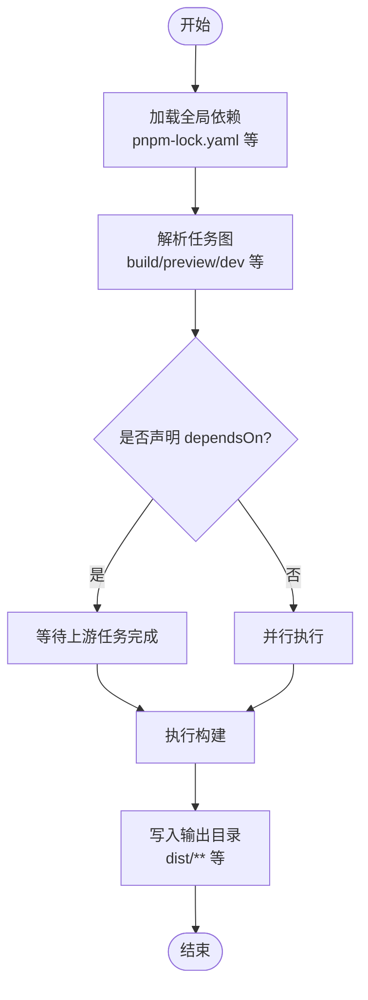

图表来源
- [apps/vben-admin/turbo.json:3-47](file://apps/vben-admin/turbo.json#L3-L47)

章节来源
- [apps/vben-admin/turbo.json:1-49](file://apps/vben-admin/turbo.json#L1-L49)

### Vite 在不同应用中的配置差异

#### 后端 API（NestJS）
- 脚本与编译：
  - 使用 Nest CLI 进行编译与运行，开发模式支持监听重启
  - 编译选项中启用手动重启、删除输出目录、关闭 webpack、指定 tsconfig 构建路径
- 适用场景：Node.js 后端，无需浏览器侧打包

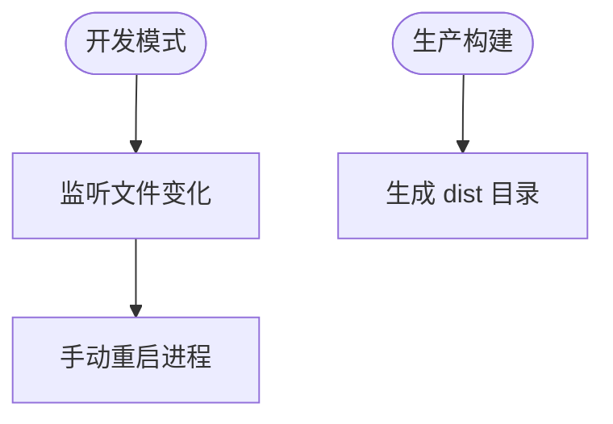

图表来源
- [apps/backend/nest-cli.json:11-19](file://apps/backend/nest-cli.json#L11-L19)
- [apps/backend/package.json:6-11](file://apps/backend/package.json#L6-L11)

章节来源
- [apps/backend/package.json:1-50](file://apps/backend/package.json#L1-L50)
- [apps/backend/nest-cli.json:1-21](file://apps/backend/nest-cli.json#L1-L21)

#### 前端管理后台（Vue 3 + Vite）
- 基础配置要点：
  - 别名映射至 src 目录
  - 开发服务器端口与代理规则，将 /api 与 /file 请求转发至本地后端
- 适用场景：Web 管理后台，需要与后端联调

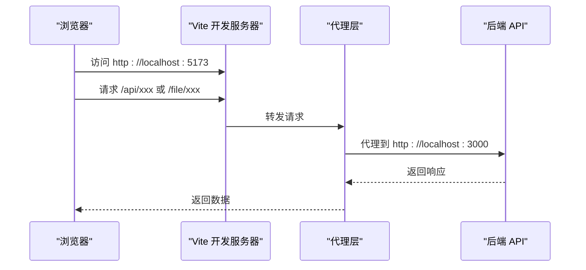

图表来源
- [apps/fronted/vite.config.ts:14-26](file://apps/fronted/vite.config.ts#L14-L26)

章节来源
- [apps/fronted/package.json:1-34](file://apps/fronted/package.json#L1-L34)
- [apps/fronted/vite.config.ts:1-28](file://apps/fronted/vite.config.ts#L1-L28)

#### 移动端应用（uni-app + Vite）
- 构建脚本：
  - 支持多平台开发与构建命令，涵盖 H5、小程序、快应用等
- Vite 配置：
  - 仅启用 uni 插件，交由插件处理多端编译细节

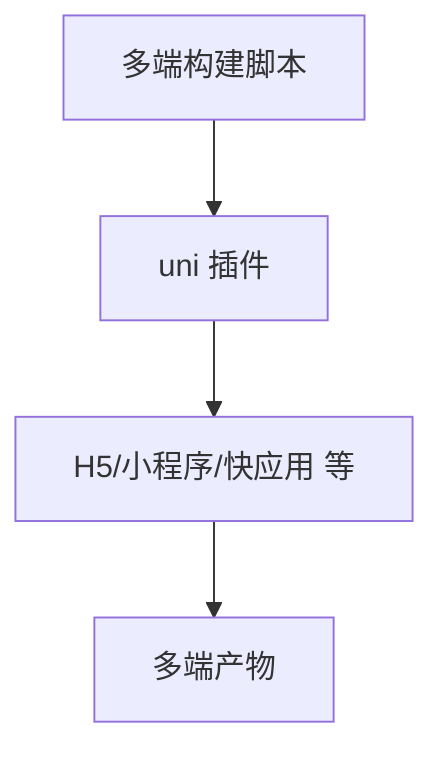

图表来源
- [apps/app/package.json:4-38](file://apps/app/package.json#L4-L38)
- [apps/app/vite.config.ts:5-7](file://apps/app/vite.config.ts#L5-L7)

章节来源
- [apps/app/package.json:1-72](file://apps/app/package.json#L1-L72)
- [apps/app/vite.config.ts:1-8](file://apps/app/vite.config.ts#L1-L8)

#### Vben Admin 框架（统一 Vite 配置）
- 统一入口：
  - 通过 @vben/vite-config 导出的 defineConfig 加载插件与通用配置
- 插件体系：
  - 条件加载：根据 isBuild、devtools、compress、pwa 等开关动态启用插件
  - 内置插件：Vue、Vue JSX、Tailwind、I18n、PWA、压缩、可视化分析等
- 应用与库两种配置：
  - 应用配置：面向 Web 应用，含构建目标、资源命名、最小化、PWA、代理等
  - 库配置：面向库打包，外部化依赖、生成 ES 模块产物
- 通用配置：
  - 构建警告阈值、是否生成 sourcemap、是否报告压缩体积等

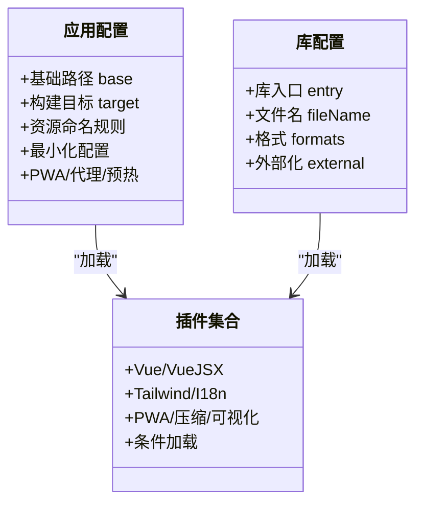

图表来源
- [apps/vben-admin/internal/vite-config/src/config/application.ts:58-98](file://apps/vben-admin/internal/vite-config/src/config/application.ts#L58-L98)
- [apps/vben-admin/internal/vite-config/src/config/library.ts:36-56](file://apps/vben-admin/internal/vite-config/src/config/library.ts#L36-L56)
- [apps/vben-admin/internal/vite-config/src/plugins/index.ts:95-229](file://apps/vben-admin/internal/vite-config/src/plugins/index.ts#L95-L229)

章节来源
- [apps/vben-admin/apps/web-antd/package.json:18-24](file://apps/vben-admin/apps/web-antd/package.json#L18-L24)
- [apps/vben-admin/apps/web-antd/vite.config.ts:1-24](file://apps/vben-admin/apps/web-antd/vite.config.ts#L1-L24)
- [apps/vben-admin/internal/vite-config/src/index.ts:1-6](file://apps/vben-admin/internal/vite-config/src/index.ts#L1-L6)
- [apps/vben-admin/internal/vite-config/src/config/application.ts:1-124](file://apps/vben-admin/internal/vite-config/src/config/application.ts#L1-L124)
- [apps/vben-admin/internal/vite-config/src/config/library.ts:1-60](file://apps/vben-admin/internal/vite-config/src/config/library.ts#L1-L60)
- [apps/vben-admin/internal/vite-config/src/config/common.ts:1-14](file://apps/vben-admin/internal/vite-config/src/config/common.ts#L1-L14)
- [apps/vben-admin/internal/vite-config/src/plugins/index.ts:1-262](file://apps/vben-admin/internal/vite-config/src/plugins/index.ts#L1-L262)

### 开发服务器、热重载与代理
- 前端管理后台：
  - 开发服务器端口固定，代理 /api 与 /file 到后端
- Vben Admin：
  - 服务器 host 设置为可被外部访问
  - 预热客户端文件，加速首次启动
  - 代理支持 WebSocket（ws: true）

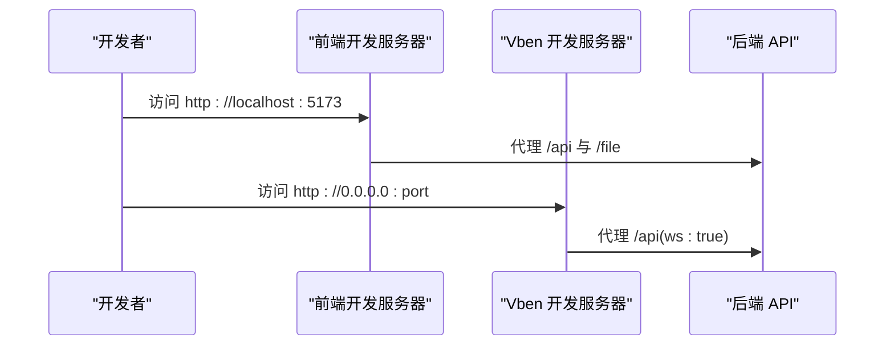

图表来源
- [apps/fronted/vite.config.ts:14-26](file://apps/fronted/vite.config.ts#L14-L26)
- [apps/vben-admin/apps/web-antd/vite.config.ts:7-21](file://apps/vben-admin/apps/web-antd/vite.config.ts#L7-L21)
- [apps/vben-admin/internal/vite-config/src/config/application.ts:79-90](file://apps/vben-admin/internal/vite-config/src/config/application.ts#L79-L90)

章节来源
- [apps/fronted/vite.config.ts:1-28](file://apps/fronted/vite.config.ts#L1-L28)
- [apps/vben-admin/apps/web-antd/vite.config.ts:1-24](file://apps/vben-admin/apps/web-antd/vite.config.ts#L1-L24)
- [apps/vben-admin/internal/vite-config/src/config/application.ts:79-90](file://apps/vben-admin/internal/vite-config/src/config/application.ts#L79-L90)

### 构建优化策略
- 代码分割与资源组织：
  - 自定义资源命名规则，区分入口、分块与静态资源
- Tree Shaking：
  - 使用 ES 模块与最小化配置，移除未使用代码
- 压缩与体积分析：
  - 可选 brotli/gzip 压缩；生产构建时可开启可视化分析
- PWA 与缓存：
  - PWA 插件可按需启用，结合浏览器缓存策略
- 预热与首屏体验：
  - Vben Admin 开启预热，减少首次访问延迟

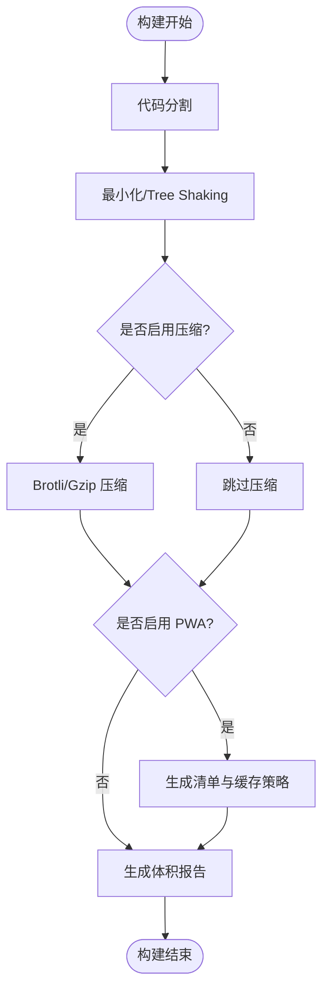

图表来源
- [apps/vben-admin/internal/vite-config/src/config/application.ts:60-76](file://apps/vben-admin/internal/vite-config/src/config/application.ts#L60-L76)
- [apps/vben-admin/internal/vite-config/src/plugins/index.ts:186-201](file://apps/vben-admin/internal/vite-config/src/plugins/index.ts#L186-L201)
- [apps/vben-admin/internal/vite-config/src/plugins/index.ts:80-88](file://apps/vben-admin/internal/vite-config/src/plugins/index.ts#L80-L88)

章节来源
- [apps/vben-admin/internal/vite-config/src/config/application.ts:1-124](file://apps/vben-admin/internal/vite-config/src/config/application.ts#L1-L124)
- [apps/vben-admin/internal/vite-config/src/plugins/index.ts:1-262](file://apps/vben-admin/internal/vite-config/src/plugins/index.ts#L1-L262)

### 生产环境构建最佳实践
- 产物目录与缓存：
  - 明确声明输出目录，利用 Turbo 的输出缓存避免重复构建
- 分阶段 Docker 构建：
  - 使用 Node 基础镜像安装依赖并构建，再复制到 Nginx 镜像提供静态服务
  - 设置内存上限与 CI 环境变量，稳定大项目构建
- 代理与域名：
  - 生产代理应指向实际后端域名或内网地址，避免硬编码 localhost
- 体积与性能：
  - 启用压缩与可视化分析，持续监控体积增长
  - 合理拆分第三方库，结合懒加载与按需引入

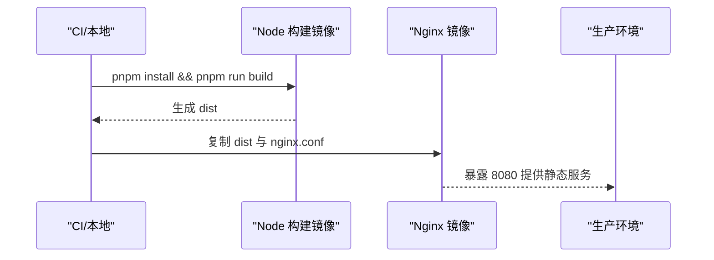

图表来源
- [apps/vben-admin/scripts/deploy/Dockerfile:18-38](file://apps/vben-admin/scripts/deploy/Dockerfile#L18-L38)

章节来源
- [apps/vben-admin/scripts/deploy/Dockerfile:1-39](file://apps/vben-admin/scripts/deploy/Dockerfile#L1-L39)
- [apps/vben-admin/scripts/deploy/build-local-docker-image.sh:1-56](file://apps/vben-admin/scripts/deploy/build-local-docker-image.sh#L1-L56)

### 构建脚本使用与自定义流程
- 后端（NestJS）：
  - 开发：监听重启
  - 生产：直接运行已编译产物
- 前端（Vue 3 + Vite）：
  - 开发：启动 Vite
  - 构建：先类型检查再打包
  - 预览：本地预览打包结果
- 移动端（uni-app）：
  - 多平台开发与构建命令，按平台选择
- Vben Admin：
  - 开发/构建/分析模式通过 --mode 控制
  - 通过 @vben/vite-config 统一扩展插件与配置

章节来源
- [apps/backend/package.json:6-11](file://apps/backend/package.json#L6-L11)
- [apps/fronted/package.json:6-10](file://apps/fronted/package.json#L6-L10)
- [apps/app/package.json:4-38](file://apps/app/package.json#L4-L38)
- [apps/vben-admin/apps/web-antd/package.json:18-24](file://apps/vben-admin/apps/web-antd/package.json#L18-L24)

## 依赖分析
- 组件耦合：
  - Vben Admin 的应用配置与插件集合高度内聚，通过 defineConfig 动态组合
  - 前端代理依赖后端服务端口，需保持一致
- 外部依赖：
  - Vite 插件生态丰富，按需启用可降低构建复杂度
  - Docker 阶段化构建减少镜像体积

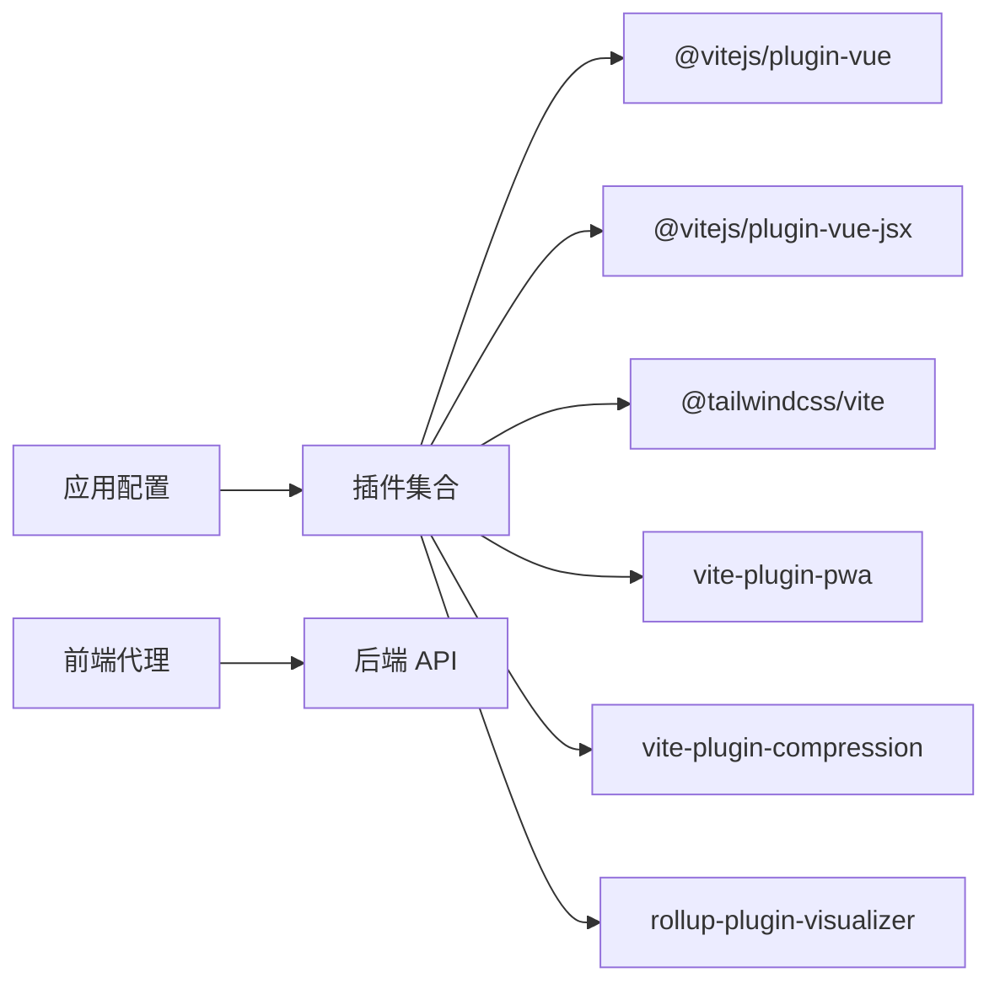

图表来源
- [apps/vben-admin/internal/vite-config/src/plugins/index.ts:95-229](file://apps/vben-admin/internal/vite-config/src/plugins/index.ts#L95-L229)
- [apps/fronted/vite.config.ts:16-25](file://apps/fronted/vite.config.ts#L16-L25)

章节来源
- [apps/vben-admin/internal/vite-config/src/plugins/index.ts:1-262](file://apps/vben-admin/internal/vite-config/src/plugins/index.ts#L1-L262)
- [apps/fronted/vite.config.ts:1-28](file://apps/fronted/vite.config.ts#L1-L28)

## 性能考虑
- 并行与缓存：利用 Turbo 的任务图与输出缓存，减少重复工作
- 构建体积：启用压缩与可视化分析，识别大体积模块
- 预热与首屏：Vben Admin 的预热配置可显著改善开发体验
- 依赖外部化：库配置将依赖标记为 external，减小产物体积

## 故障排查指南
- 代理无效或 404：
  - 检查前端代理目标与后端端口是否一致
  - 确认代理路径前缀匹配
- 构建失败或内存不足：
  - 在 Docker 构建中设置内存上限与 CI 环境变量
  - 优先使用 pnpm 并启用缓存挂载
- 插件冲突：
  - 逐步禁用条件插件，定位冲突来源
- 首屏慢：
  - 启用预热与代码分割，分析可视化报告

章节来源
- [apps/fronted/vite.config.ts:14-26](file://apps/fronted/vite.config.ts#L14-L26)
- [apps/vben-admin/scripts/deploy/Dockerfile:6-8](file://apps/vben-admin/scripts/deploy/Dockerfile#L6-L8)
- [apps/vben-admin/internal/vite-config/src/plugins/index.ts:37-46](file://apps/vben-admin/internal/vite-config/src/plugins/index.ts#L37-L46)

## 结论
本仓库通过 Turbo 实现多应用的高效并行构建与缓存，借助 Vite 的灵活插件体系与统一配置，满足后端、Web 前端、移动端与框架级应用的差异化需求。结合 Docker 分阶段构建与代理、压缩、PWA 等优化手段，可在保证开发效率的同时获得稳定的生产体验。

## 附录
- 关键配置文件速览
  - 后端：package.json、nest-cli.json
  - 前端：package.json、vite.config.ts
  - 移动端：package.json、vite.config.ts
  - Vben Admin：apps/web-antd/package.json、apps/web-antd/vite.config.ts、turbo.json、internal/vite-config 下的配置与插件入口
- 最佳实践清单
  - 明确任务依赖与输出目录
  - 启用压缩与体积分析
  - 使用预热与外部化依赖
  - 分阶段 Docker 构建与缓存