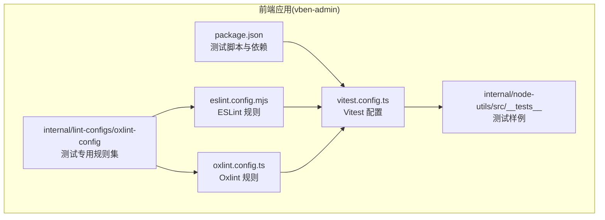
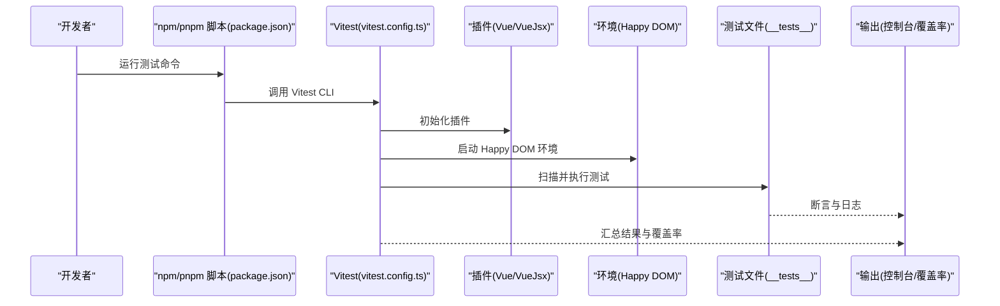
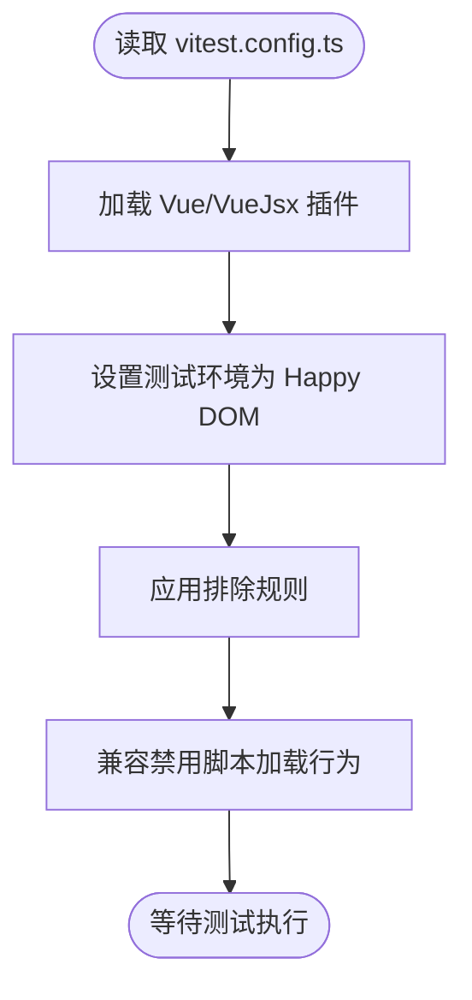
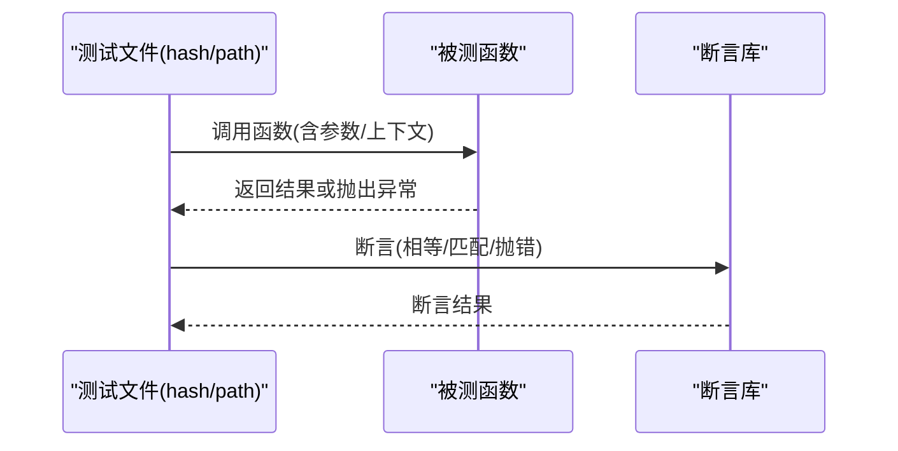
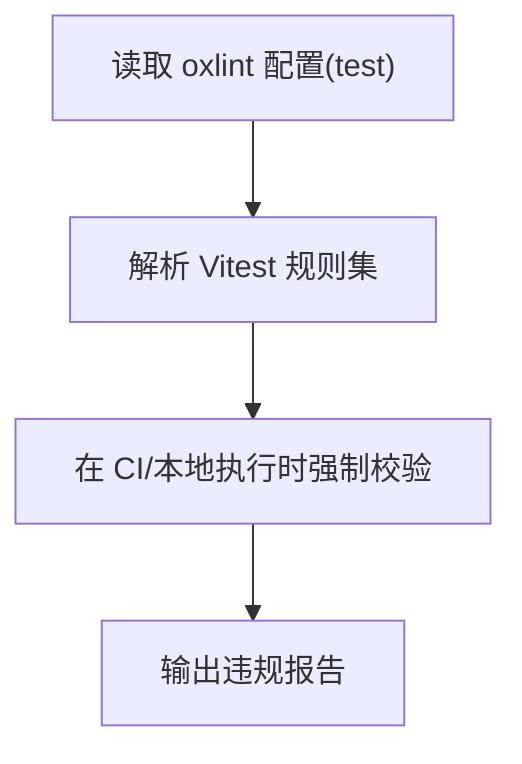
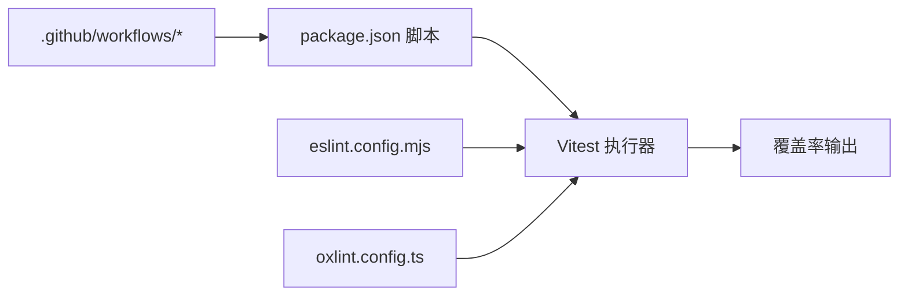

# 测试框架

<cite>
**本文引用的文件**
- [vitest.config.ts](file://apps/vben-admin/vitest.config.ts)
- [test.ts](file://apps/vben-admin/internal/lint-configs/oxlint-config/src/configs/test.ts)
- [hash.test.ts](file://apps/vben-admin/internal/node-utils/src/__tests__/hash.test.ts)
- [path.test.ts](file://apps/vben-admin/internal/node-utils/src/__tests__/path.test.ts)
- [package.json](file://apps/vben-admin/package.json)
- [eslint.config.mjs](file://apps/vben-admin/eslint.config.mjs)
- [oxlint.config.ts](file://apps/vben-admin/oxlint.config.ts)
- [.github/workflows](file://apps/vben-admin/.github/workflows)
</cite>

## 目录
1. [简介](#简介)
2. [项目结构](#项目结构)
3. [核心组件](#核心组件)
4. [架构总览](#架构总览)
5. [详细组件分析](#详细组件分析)
6. [依赖分析](#依赖分析)
7. [性能考虑](#性能考虑)
8. [故障排查指南](#故障排查指南)
9. [结论](#结论)
10. [附录](#附录)

## 简介
本文件系统性梳理并说明本仓库中基于 Vitest 的测试框架配置与使用方法，覆盖以下方面：
- 测试环境设置（Happy DOM）、排除规则与插件配置
- 单元测试编写方法（组件测试、函数测试、异步测试）
- 测试工具函数与 Mock 对象的使用建议
- 集成测试与端到端测试的配置思路与实施路径
- 测试覆盖率分析与持续集成中的测试自动化配置
- 测试最佳实践与常见场景示例

说明：当前仓库在前端应用层以 Vitest 为核心配置进行单元测试；后端 Nest 应用未发现 Vitest 配置文件，但存在 Jest 生态相关依赖，可作为参考。

## 项目结构
围绕测试相关的关键位置如下：
- 前端 Vitest 核心配置位于 apps/vben-admin/vitest.config.ts
- 测试规范与 ESLint/Oxlint 规则位于 internal/lint-configs/oxlint-config
- 测试样例位于 internal/node-utils/src/__tests__ 下
- 包管理与脚本位于 apps/vben-admin/package.json
- Lint 配置位于 apps/vben-admin/eslint.config.mjs 与 apps/vben-admin/oxlint.config.ts
- 持续集成工作流位于 apps/vben-admin/.github/workflows

**图表来源**
- [vitest.config.ts:1-29](file://apps/vben-admin/vitest.config.ts#L1-L29)
- [package.json](file://apps/vben-admin/package.json)
- [eslint.config.mjs](file://apps/vben-admin/eslint.config.mjs)
- [oxlint.config.ts](file://apps/vben-admin/oxlint.config.ts)
- [test.ts:1-24](file://apps/vben-admin/internal/lint-configs/oxlint-config/src/configs/test.ts#L1-L24)
- [hash.test.ts](file://apps/vben-admin/internal/node-utils/src/__tests__/hash.test.ts)
- [path.test.ts](file://apps/vben-admin/internal/node-utils/src/__tests__/path.test.ts)

**章节来源**
- [vitest.config.ts:1-29](file://apps/vben-admin/vitest.config.ts#L1-L29)
- [package.json](file://apps/vben-admin/package.json)

## 核心组件
- Vitest 配置中心：定义测试环境、插件、排除规则等
- 测试样例：函数与工具类的单元测试示例
- Lint 规则：针对 Vitest 的 ESLint/Oxlint 规则，约束测试风格与最佳实践
- 覆盖率与 CI：通过包管理脚本与 GitHub Actions 实现自动化

**章节来源**
- [vitest.config.ts:5-28](file://apps/vben-admin/vitest.config.ts#L5-L28)
- [test.ts:1-24](file://apps/vben-admin/internal/lint-configs/oxlint-config/src/configs/test.ts#L1-L24)
- [hash.test.ts](file://apps/vben-admin/internal/node-utils/src/__tests__/hash.test.ts)
- [path.test.ts](file://apps/vben-admin/internal/node-utils/src/__tests__/path.test.ts)

## 架构总览
下图展示测试运行时的核心流程：Vitest 启动 → 加载配置 → 解析插件 → 执行测试 → 输出结果与覆盖率。

**图表来源**
- [vitest.config.ts:5-28](file://apps/vben-admin/vitest.config.ts#L5-L28)
- [package.json](file://apps/vben-admin/package.json)

## 详细组件分析

### Vitest 配置组件分析
- 插件体系：启用 Vue 与 VueJsx 支持，便于组件测试
- 测试环境：使用 Happy DOM，提升无头浏览器测试性能
- 排除规则：屏蔽 e2e、dist、IDE 缓存、node_modules、部分配置文件等
- 安全兼容：对禁用脚本加载行为进行兼容处理，确保测试稳定性

**图表来源**
- [vitest.config.ts:5-28](file://apps/vben-admin/vitest.config.ts#L5-L28)

**章节来源**
- [vitest.config.ts:5-28](file://apps/vben-admin/vitest.config.ts#L5-L28)

### 测试样例组件分析
- 函数测试样例：hash.test.ts 与 path.test.ts 展示了基础断言与工具函数验证方式
- 建议模式：每个被测函数对应一个独立测试文件，命名与被测模块保持一致
- 异步测试：可结合 Promise 或 async/await 编写异步逻辑验证

**图表来源**
- [hash.test.ts](file://apps/vben-admin/internal/node-utils/src/__tests__/hash.test.ts)
- [path.test.ts](file://apps/vben-admin/internal/node-utils/src/__tests__/path.test.ts)

**章节来源**
- [hash.test.ts](file://apps/vben-admin/internal/node-utils/src/__tests__/hash.test.ts)
- [path.test.ts](file://apps/vben-admin/internal/node-utils/src/__tests__/path.test.ts)

### Lint 规则组件分析
- 测试专用规则：集中于 internal/lint-configs/oxlint-config，包含 Vitest 相关规则
- 关键规则要点：
  - 统一测试命名(it/withinDescribe)
  - 禁止聚焦测试(focused tests)
  - 禁止相同标题(identical title)
  - 禁止导入 Node 测试(node test)
  - 禁止钩子顺序不当(hoisted APIs)
  - 要求钩子顺序(prefer hooks in order)
  - 要求小写标题(lowercase title)
- 与 ESLint/Oxlint 配置文件协同生效

**图表来源**
- [test.ts:1-24](file://apps/vben-admin/internal/lint-configs/oxlint-config/src/configs/test.ts#L1-L24)
- [eslint.config.mjs](file://apps/vben-admin/eslint.config.mjs)
- [oxlint.config.ts](file://apps/vben-admin/oxlint.config.ts)

**章节来源**
- [test.ts:1-24](file://apps/vben-admin/internal/lint-configs/oxlint-config/src/configs/test.ts#L1-L24)
- [eslint.config.mjs](file://apps/vben-admin/eslint.config.mjs)
- [oxlint.config.ts](file://apps/vben-admin/oxlint.config.ts)

## 依赖分析
- 包管理脚本：通过 package.json 中的 scripts 字段统一触发测试任务
- Lint 集成：ESLint 与 Oxlint 配置文件共同约束测试代码质量
- 工作流：GitHub Actions 在 CI 中执行测试与覆盖率统计

**图表来源**
- [package.json](file://apps/vben-admin/package.json)
- [eslint.config.mjs](file://apps/vben-admin/eslint.config.mjs)
- [oxlint.config.ts](file://apps/vben-admin/oxlint.config.ts)
- [.github/workflows](file://apps/vben-admin/.github/workflows)

**章节来源**
- [package.json](file://apps/vben-admin/package.json)
- [.github/workflows](file://apps/vben-admin/.github/workflows)

## 性能考虑
- 使用 Happy DOM 作为测试环境，避免真实浏览器启动开销
- 通过排除规则减少扫描范围，提升启动速度
- 将大型测试拆分为独立文件，配合并行执行策略优化整体耗时
- 控制断言粒度，避免过度深拷贝与重复计算

## 故障排查指南
- 禁用脚本加载导致失败：配置已兼容将禁用文件加载视为成功，若仍报错，检查环境设置是否正确
- 排除规则误伤：确认测试文件未被排除列表命中
- Lint 规则冲突：根据 oxlint/ESLint 报错逐条修正，遵循统一的测试命名与组织规范
- CI 失败：检查工作流中测试命令与覆盖率阈值设置

**章节来源**
- [vitest.config.ts:8-17](file://apps/vben-admin/vitest.config.ts#L8-L17)
- [test.ts:7-21](file://apps/vben-admin/internal/lint-configs/oxlint-config/src/configs/test.ts#L7-L21)

## 结论
本仓库以 Vitest 为核心，结合 Happy DOM 环境与完善的 Lint 规则，构建了高效、可维护的前端单元测试体系。通过清晰的配置、规范的测试样例与 CI 自动化，能够稳定支撑日常开发与质量保障需求。后续可在现有基础上扩展集成测试与端到端测试方案，并完善覆盖率策略与报告。

## 附录

### 单元测试编写方法
- 函数测试：为每个导出函数编写独立测试，覆盖正常路径、边界条件与异常分支
- 组件测试：利用 Vue 插件能力渲染组件，断言渲染结果与交互行为
- 异步测试：使用 Promise/async 语法，确保异步逻辑被正确等待与断言

**章节来源**
- [hash.test.ts](file://apps/vben-admin/internal/node-utils/src/__tests__/hash.test.ts)
- [path.test.ts](file://apps/vben-admin/internal/node-utils/src/__tests__/path.test.ts)
- [vitest.config.ts:5-6](file://apps/vben-admin/vitest.config.ts#L5-L6)

### 测试工具函数与 Mock 对象
- 工具函数：在 __tests__ 目录下按功能模块组织，便于复用与维护
- Mock 对象：对副作用（如网络请求、文件系统）进行隔离，使用占位实现替换真实依赖
- 断言方法：优先使用明确的断言语义，避免模糊判断

**章节来源**
- [hash.test.ts](file://apps/vben-admin/internal/node-utils/src/__tests__/hash.test.ts)
- [path.test.ts](file://apps/vben-admin/internal/node-utils/src/__tests__/path.test.ts)

### 集成测试与端到端测试
- 集成测试：在现有 Vitest 配置基础上，新增 e2e 目录与相应环境配置，避免与单元测试冲突
- 端到端测试：引入专门的 E2E 框架（如 Playwright/Cypress），在 CI 中单独执行并产出报告
- 当前仓库未发现 e2e 配置文件，建议参考排除规则与环境设置进行扩展

**章节来源**
- [vitest.config.ts:18-26](file://apps/vben-admin/vitest.config.ts#L18-L26)

### 测试覆盖率分析与持续集成
- 覆盖率：通过 Vitest 的覆盖率选项生成报告，结合 CI 阈值限制保证质量
- 自动化：在 GitHub Actions 中添加测试与覆盖率步骤，失败即阻断合并
- 建议：将覆盖率报告上传至第三方平台（如 Codecov），便于追踪趋势

**章节来源**
- [package.json](file://apps/vben-admin/package.json)
- [.github/workflows](file://apps/vben-admin/.github/workflows)

### 测试最佳实践
- 命名统一：使用 it/withinDescribe 统一测试命名
- 禁止聚焦测试：避免提交带聚焦标记的测试
- 禁止相同标题：确保每组测试描述唯一
- 禁止导入 Node 测试：仅在 Node 环境测试中使用 Node 特定 API
- 钩子顺序：按要求放置 beforeEach/afterEach 等钩子
- 标题大小写：使用小写标题，提升可读性

**章节来源**
- [test.ts:7-21](file://apps/vben-admin/internal/lint-configs/oxlint-config/src/configs/test.ts#L7-L21)