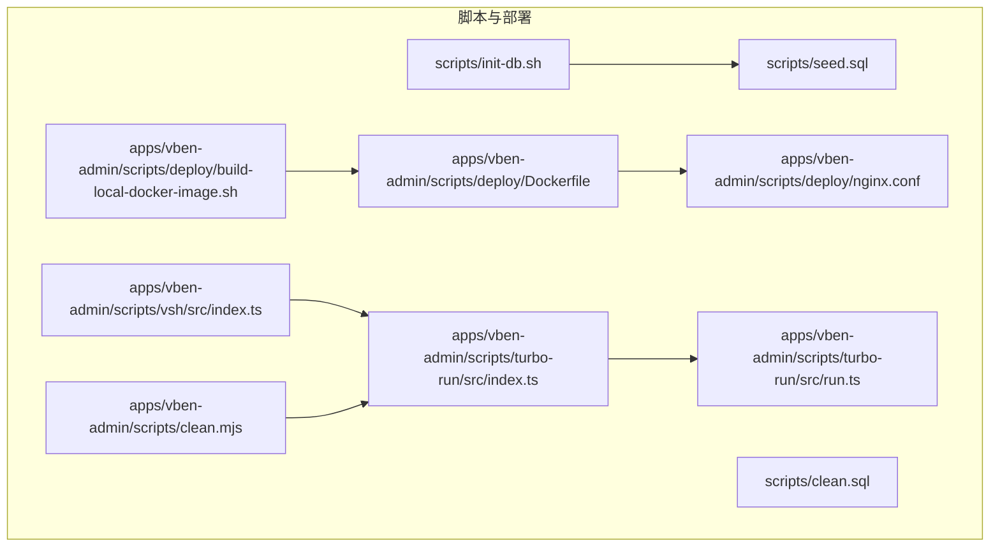
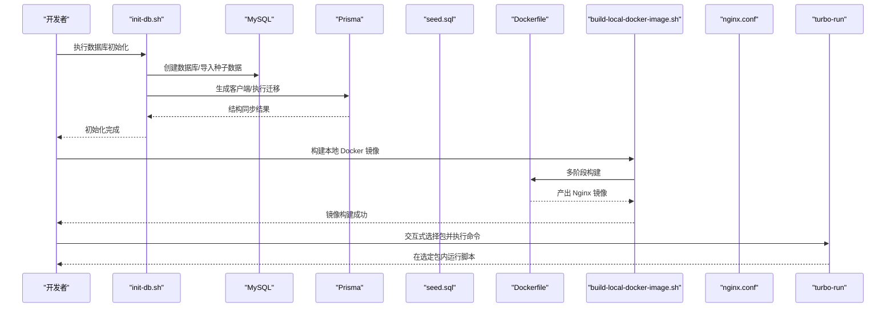
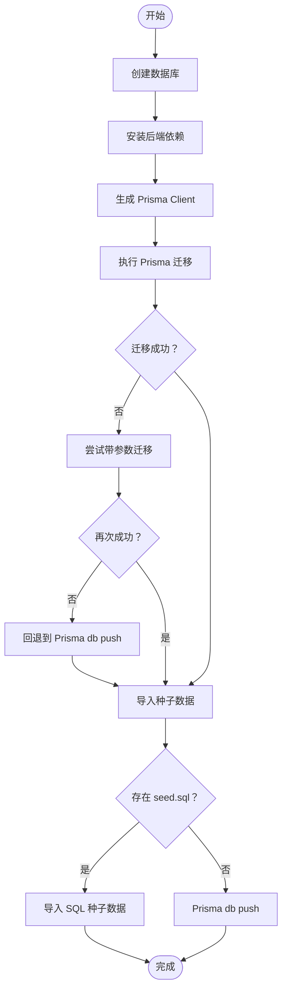
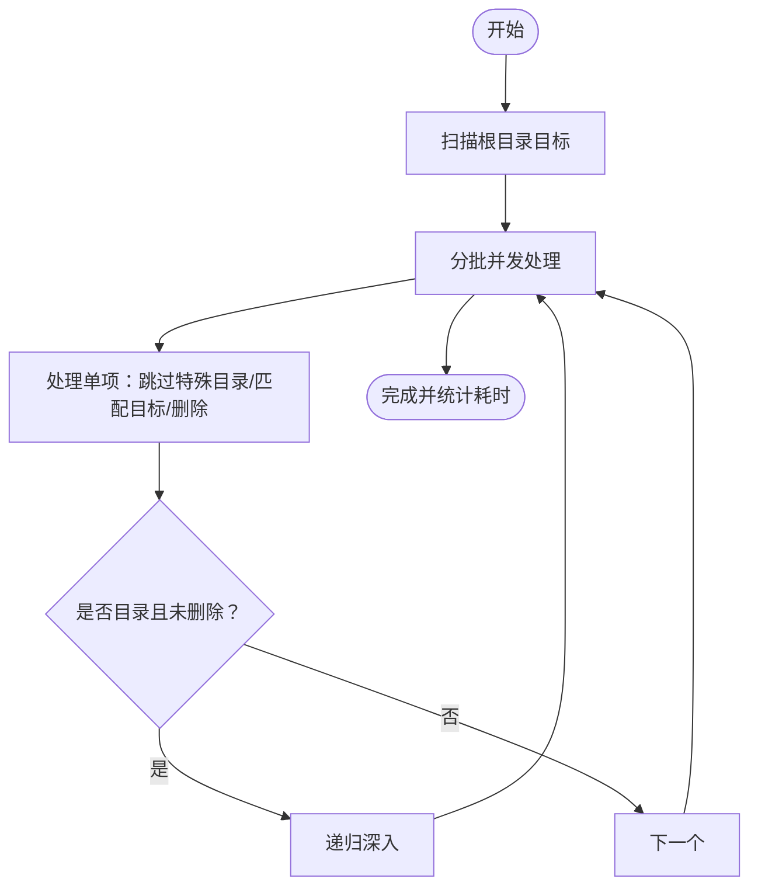
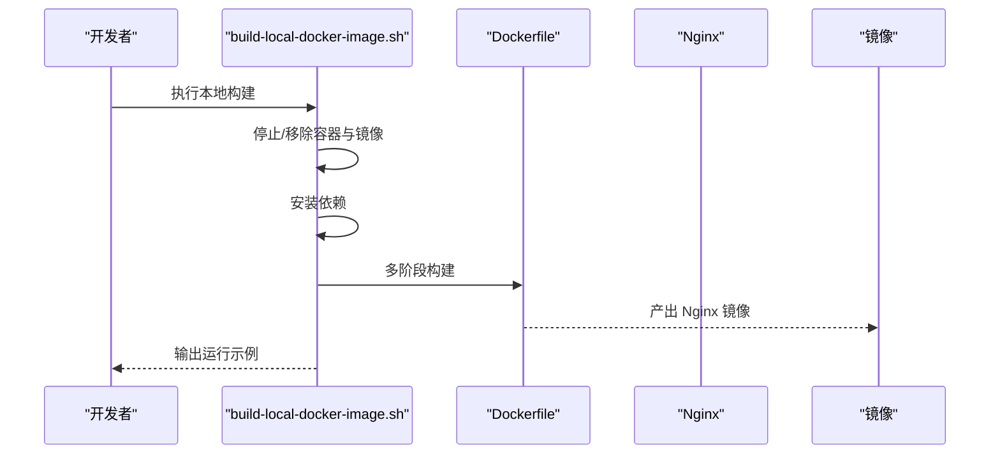
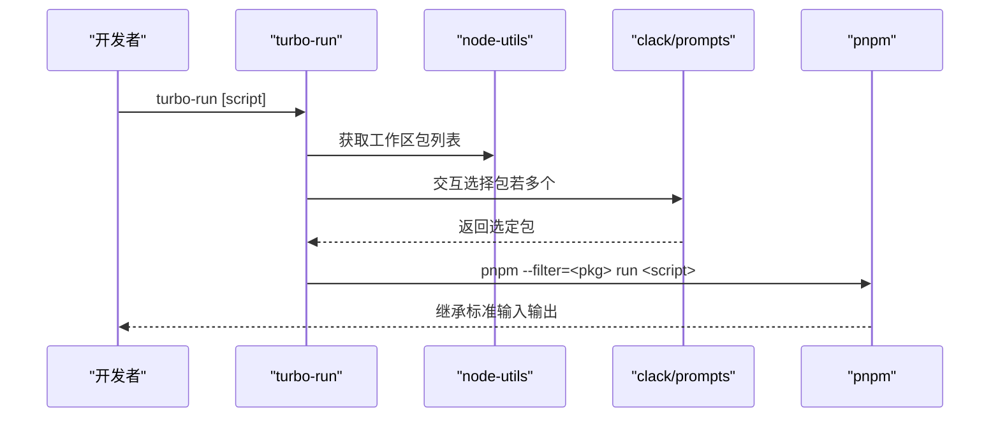
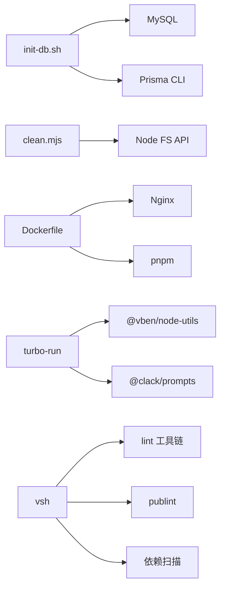

# 自动化脚本

<cite>
**本文引用的文件**
- [scripts/init-db.sh](file://scripts/init-db.sh)
- [scripts/seed.sql](file://scripts/seed.sql)
- [scripts/clean.sql](file://scripts/clean.sql)
- [scripts/README.md](file://scripts/README.md)
- [apps/vben-admin/scripts/clean.mjs](file://apps/vben-admin/scripts/clean.mjs)
- [apps/vben-admin/scripts/deploy/Dockerfile](file://apps/vben-admin/scripts/deploy/Dockerfile)
- [apps/vben-admin/scripts/deploy/build-local-docker-image.sh](file://apps/vben-admin/scripts/deploy/build-local-docker-image.sh)
- [apps/vben-admin/scripts/deploy/nginx.conf](file://apps/vben-admin/scripts/deploy/nginx.conf)
- [apps/vben-admin/scripts/turbo-run/src/index.ts](file://apps/vben-admin/scripts/turbo-run/src/index.ts)
- [apps/vben-admin/scripts/turbo-run/src/run.ts](file://apps/vben-admin/scripts/turbo-run/src/run.ts)
- [apps/vben-admin/scripts/turbo-run/package.json](file://apps/vben-admin/scripts/turbo-run/package.json)
- [apps/vben-admin/scripts/vsh/src/index.ts](file://apps/vben-admin/scripts/vsh/src/index.ts)
- [apps/vben-admin/scripts/vsh/package.json](file://apps/vben-admin/scripts/vsh/package.json)
- [apps/vben-admin/scripts/vsh/README.md](file://apps/vben-admin/scripts/vsh/README.md)
- [README.md](file://README.md)
</cite>

## 目录
1. [简介](#简介)
2. [项目结构](#项目结构)
3. [核心组件](#核心组件)
4. [架构总览](#架构总览)
5. [详细组件分析](#详细组件分析)
6. [依赖关系分析](#依赖关系分析)
7. [性能考量](#性能考量)
8. [故障排查指南](#故障排查指南)
9. [结论](#结论)
10. [附录](#附录)

## 简介
本文件面向自动化脚本的使用者与开发者，系统性说明以下内容：
- 数据库初始化脚本的使用方法：数据库创建、表结构初始化、种子数据导入
- 清理脚本的作用与使用场景：开发环境清理、测试数据重置
- Docker 部署脚本的配置与使用：镜像构建与容器部署
- Turbo 构建脚本的使用：批量构建与增量构建
- 自定义自动化脚本的开发指南：Shell 脚本与 Node.js 脚本的编写与最佳实践
- CI/CD 流水线中的自动化脚本集成与任务调度配置建议

## 项目结构
围绕自动化脚本的关键目录与文件如下：
- 数据库初始化与种子数据：scripts 目录
- 前端/全栈清理脚本：apps/vben-admin/scripts/clean.mjs
- Docker 部署：apps/vben-admin/scripts/deploy/Dockerfile、build-local-docker-image.sh、nginx.conf
- Turbo 构建工具：apps/vben-admin/scripts/turbo-run
- VSH 开发辅助工具：apps/vben-admin/scripts/vsh

**图示来源**
- [scripts/init-db.sh:1-85](file://scripts/init-db.sh#L1-L85)
- [scripts/seed.sql:1-186](file://scripts/seed.sql#L1-L186)
- [apps/vben-admin/scripts/clean.mjs:1-142](file://apps/vben-admin/scripts/clean.mjs#L1-L142)
- [apps/vben-admin/scripts/deploy/Dockerfile:1-39](file://apps/vben-admin/scripts/deploy/Dockerfile#L1-L39)
- [apps/vben-admin/scripts/deploy/build-local-docker-image.sh:1-56](file://apps/vben-admin/scripts/deploy/build-local-docker-image.sh#L1-L56)
- [apps/vben-admin/scripts/deploy/nginx.conf](file://apps/vben-admin/scripts/deploy/nginx.conf)
- [apps/vben-admin/scripts/turbo-run/src/index.ts:1-24](file://apps/vben-admin/scripts/turbo-run/src/index.ts#L1-L24)
- [apps/vben-admin/scripts/turbo-run/src/run.ts:1-68](file://apps/vben-admin/scripts/turbo-run/src/run.ts#L1-L68)
- [apps/vben-admin/scripts/vsh/src/index.ts:1-78](file://apps/vben-admin/scripts/vsh/src/index.ts#L1-L78)

**章节来源**
- [README.md:26-69](file://README.md#L26-L69)
- [scripts/README.md:1-59](file://scripts/README.md#L1-L59)

## 核心组件
- 数据库初始化脚本：一键创建数据库、安装依赖、生成 Prisma Client、执行迁移、导入种子数据或回退到 Prisma db push
- 清理脚本：并发安全地清理 node_modules、dist、.turbo 等目录，支持可选删除锁文件
- Docker 部署脚本：多阶段构建（Node 构建 + Nginx 运行时），本地镜像构建与运行示例
- Turbo 构建脚本：交互式选择包并执行指定脚本命令，支持批量与增量构建
- VSH 工具：提供依赖检查、循环依赖扫描、工作区管理等开发辅助命令

**章节来源**
- [scripts/init-db.sh:1-85](file://scripts/init-db.sh#L1-L85)
- [apps/vben-admin/scripts/clean.mjs:1-142](file://apps/vben-admin/scripts/clean.mjs#L1-L142)
- [apps/vben-admin/scripts/deploy/Dockerfile:1-39](file://apps/vben-admin/scripts/deploy/Dockerfile#L1-L39)
- [apps/vben-admin/scripts/deploy/build-local-docker-image.sh:1-56](file://apps/vben-admin/scripts/deploy/build-local-docker-image.sh#L1-L56)
- [apps/vben-admin/scripts/turbo-run/src/index.ts:1-24](file://apps/vben-admin/scripts/turbo-run/src/index.ts#L1-L24)
- [apps/vben-admin/scripts/turbo-run/src/run.ts:1-68](file://apps/vben-admin/scripts/turbo-run/src/run.ts#L1-L68)
- [apps/vben-admin/scripts/vsh/src/index.ts:1-78](file://apps/vben-admin/scripts/vsh/src/index.ts#L1-L78)

## 架构总览
下图展示了数据库初始化、Docker 构建与 Turbo 运行的整体流程与组件关系。

**图示来源**
- [scripts/init-db.sh:23-85](file://scripts/init-db.sh#L23-L85)
- [scripts/seed.sql:1-186](file://scripts/seed.sql#L1-L186)
- [apps/vben-admin/scripts/deploy/build-local-docker-image.sh:19-56](file://apps/vben-admin/scripts/deploy/build-local-docker-image.sh#L19-L56)
- [apps/vben-admin/scripts/deploy/Dockerfile:1-39](file://apps/vben-admin/scripts/deploy/Dockerfile#L1-L39)
- [apps/vben-admin/scripts/deploy/nginx.conf](file://apps/vben-admin/scripts/deploy/nginx.conf)
- [apps/vben-admin/scripts/turbo-run/src/index.ts:7-23](file://apps/vben-admin/scripts/turbo-run/src/index.ts#L7-L23)
- [apps/vben-admin/scripts/turbo-run/src/run.ts:9-52](file://apps/vben-admin/scripts/turbo-run/src/run.ts#L9-L52)

## 详细组件分析

### 数据库初始化脚本（init-db.sh）
- 功能概述
  - 创建数据库（支持自定义主机、端口、用户、密码、库名）
  - 安装后端依赖（在后端应用目录执行）
  - 生成 Prisma Client
  - 执行 Prisma 迁移（若失败则尝试带参数的迁移）
  - 导入种子数据（优先使用 SQL 文件；若不存在则回退到 Prisma db push）

- 关键步骤与流程
  - 步骤一：创建数据库并设置字符集
  - 步骤二：安装后端依赖
  - 步骤三：生成 Prisma Client
  - 步骤四：执行迁移（失败时尝试带参数的迁移）
  - 步骤五：导入种子数据（SQL 或 Prisma db push）

**图示来源**
- [scripts/init-db.sh:23-85](file://scripts/init-db.sh#L23-L85)

**章节来源**
- [scripts/init-db.sh:1-85](file://scripts/init-db.sh#L1-L85)
- [scripts/README.md:8-28](file://scripts/README.md#L8-L28)

### 清理脚本（clean.mjs）
- 功能概述
  - 并发安全地清理 node_modules、dist、.turbo、dist.zip 等目标
  - 可选删除 pnpm 锁文件
  - 递归遍历，限制最大递归深度，避免误删与性能问题
  - 统计耗时并输出结果

- 关键设计点
  - 使用 withFileTypes 一次性获取文件类型，减少系统调用
  - 分批并发处理，控制并发上限
  - 错误处理：ENOENT、EPERM/EACCES 等场景分别处理
  - 递归深度限制与警告

**图示来源**
- [apps/vben-admin/scripts/clean.mjs:60-107](file://apps/vben-admin/scripts/clean.mjs#L60-L107)

**章节来源**
- [apps/vben-admin/scripts/clean.mjs:1-142](file://apps/vben-admin/scripts/clean.mjs#L1-L142)

### Docker 部署脚本（Dockerfile 与构建脚本）
- Dockerfile 多阶段构建
  - 构建阶段：Node 22 slim，安装 pnpm，安装依赖并构建（排除文档应用）
  - 运行阶段：Nginx stable-alpine，复制构建产物与 Nginx 配置，暴露 8080

- 本地镜像构建脚本
  - 停止并移除现有容器与镜像
  - 安装依赖
  - 构建镜像并输出运行示例命令

**图示来源**
- [apps/vben-admin/scripts/deploy/build-local-docker-image.sh:19-56](file://apps/vben-admin/scripts/deploy/build-local-docker-image.sh#L19-L56)
- [apps/vben-admin/scripts/deploy/Dockerfile:1-39](file://apps/vben-admin/scripts/deploy/Dockerfile#L1-L39)
- [apps/vben-admin/scripts/deploy/nginx.conf](file://apps/vben-admin/scripts/deploy/nginx.conf)

**章节来源**
- [apps/vben-admin/scripts/deploy/Dockerfile:1-39](file://apps/vben-admin/scripts/deploy/Dockerfile#L1-L39)
- [apps/vben-admin/scripts/deploy/build-local-docker-image.sh:1-56](file://apps/vben-admin/scripts/deploy/build-local-docker-image.sh#L1-L56)

### Turbo 构建脚本（turbo-run）
- 功能概述
  - 交互式选择需要执行命令的包
  - 仅列出包含该命令的包
  - 在选定包内执行 pnpm --filter=<package> run <command>

- 命令行入口与执行流程
  - 解析命令行参数
  - 获取工作区包列表
  - 交互选择包
  - 执行命令并将标准输入输出继承给子进程

**图示来源**
- [apps/vben-admin/scripts/turbo-run/src/index.ts:7-23](file://apps/vben-admin/scripts/turbo-run/src/index.ts#L7-L23)
- [apps/vben-admin/scripts/turbo-run/src/run.ts:9-52](file://apps/vben-admin/scripts/turbo-run/src/run.ts#L9-L52)

**章节来源**
- [apps/vben-admin/scripts/turbo-run/src/index.ts:1-24](file://apps/vben-admin/scripts/turbo-run/src/index.ts#L1-L24)
- [apps/vben-admin/scripts/turbo-run/src/run.ts:1-68](file://apps/vben-admin/scripts/turbo-run/src/run.ts#L1-L68)
- [apps/vben-admin/scripts/turbo-run/package.json:1-30](file://apps/vben-admin/scripts/turbo-run/package.json#L1-L30)

### VSH 工具（开发辅助）
- 功能概述
  - 提供 lint、publint、工作区管理、循环依赖检查、依赖检查等命令
  - 基于 CAC CLI，支持帮助、版本、未知命令提示

- 命令注册与错误处理
  - 注册多个子命令
  - 解析参数并运行匹配命令
  - 未知命令时输出可用命令列表

**章节来源**
- [apps/vben-admin/scripts/vsh/src/index.ts:1-78](file://apps/vben-admin/scripts/vsh/src/index.ts#L1-L78)
- [apps/vben-admin/scripts/vsh/package.json:1-32](file://apps/vben-admin/scripts/vsh/package.json#L1-L32)
- [apps/vben-admin/scripts/vsh/README.md:1-57](file://apps/vben-admin/scripts/vsh/README.md#L1-L57)

## 依赖关系分析
- init-db.sh 依赖 MySQL 与 Prisma CLI，以及后端应用目录的 npm 依赖
- clean.mjs 依赖 Node.js 文件系统 API，无外部依赖
- Dockerfile 依赖 pnpm、Node、Nginx，构建产物为 Nginx 镜像
- turbo-run 依赖 @vben/node-utils、@clack/prompts、cac
- vsh 依赖 @vben/node-utils、cac、circular-dependency-scanner、knip、publint

**图示来源**
- [scripts/init-db.sh:23-85](file://scripts/init-db.sh#L23-L85)
- [apps/vben-admin/scripts/clean.mjs:1-142](file://apps/vben-admin/scripts/clean.mjs#L1-L142)
- [apps/vben-admin/scripts/deploy/Dockerfile:1-39](file://apps/vben-admin/scripts/deploy/Dockerfile#L1-L39)
- [apps/vben-admin/scripts/turbo-run/package.json:24-28](file://apps/vben-admin/scripts/turbo-run/package.json#L24-L28)
- [apps/vben-admin/scripts/vsh/package.json:24-31](file://apps/vben-admin/scripts/vsh/package.json#L24-L31)

**章节来源**
- [apps/vben-admin/scripts/turbo-run/package.json:1-30](file://apps/vben-admin/scripts/turbo-run/package.json#L1-L30)
- [apps/vben-admin/scripts/vsh/package.json:1-32](file://apps/vben-admin/scripts/vsh/package.json#L1-L32)

## 性能考量
- 清理脚本
  - 使用 withFileTypes 一次性获取文件类型，降低系统调用次数
  - 分批并发处理，控制并发上限，避免资源争用
  - 递归深度限制，防止深层目录导致的性能问题
- Docker 构建
  - 多阶段构建减少最终镜像体积
  - pnpm 缓存挂载提升依赖安装速度
  - 构建时排除文档应用，缩短构建时间
- Turbo 运行
  - 仅列出包含目标命令的包，减少交互成本
  - 继承标准输入输出，便于调试与日志查看

[本节为通用性能建议，不直接分析具体文件]

## 故障排查指南
- 数据库初始化失败
  - 检查 MySQL 连接参数（主机、端口、用户、密码）
  - 若迁移失败，尝试带参数迁移或回退到 Prisma db push
  - 确认后端依赖安装成功
- 清理脚本权限问题
  - 遇到 EACCES/EPERM 时检查目录权限
  - 确保脚本对目标目录具有读写权限
- Docker 构建失败
  - 检查 pnpm 缓存与网络连通性
  - 确认 Docker 环境可用
- Turbo 运行无包可选
  - 确认目标命令在至少一个包中存在
  - 检查工作区包列表是否正确解析

**章节来源**
- [scripts/init-db.sh:23-85](file://scripts/init-db.sh#L23-L85)
- [apps/vben-admin/scripts/clean.mjs:38-52](file://apps/vben-admin/scripts/clean.mjs#L38-L52)
- [apps/vben-admin/scripts/deploy/build-local-docker-image.sh:19-56](file://apps/vben-admin/scripts/deploy/build-local-docker-image.sh#L19-L56)
- [apps/vben-admin/scripts/turbo-run/src/run.ts:21-52](file://apps/vben-admin/scripts/turbo-run/src/run.ts#L21-L52)

## 结论
本项目提供了覆盖数据库初始化、清理、Docker 部署、构建与开发辅助的完整自动化脚本体系。通过合理使用这些脚本，可以显著提升开发效率与部署一致性。建议在 CI/CD 中结合这些脚本实现标准化的流水线任务。

[本节为总结性内容，不直接分析具体文件]

## 附录

### 数据库初始化与种子数据
- 初始化脚本支持通过环境变量自定义数据库连接参数
- 种子数据包含部门、岗位、角色、用户、菜单、字典、配置、公告、租户等完整初始数据
- SQL 文件与 Prisma 迁移两种方式均可完成初始化

**章节来源**
- [scripts/README.md:16-28](file://scripts/README.md#L16-L28)
- [scripts/seed.sql:1-186](file://scripts/seed.sql#L1-L186)
- [scripts/clean.sql:1-86](file://scripts/clean.sql#L1-L86)

### Docker 部署与本地运行
- 多阶段构建：Node 构建 + Nginx 运行时
- 本地镜像构建脚本提供一键停止、移除、安装依赖与构建镜像的流程
- 运行示例命令可在构建成功后直接使用

**章节来源**
- [apps/vben-admin/scripts/deploy/Dockerfile:1-39](file://apps/vben-admin/scripts/deploy/Dockerfile#L1-L39)
- [apps/vben-admin/scripts/deploy/build-local-docker-image.sh:19-56](file://apps/vben-admin/scripts/deploy/build-local-docker-image.sh#L19-L56)

### Turbo 构建与交互式运行
- 通过命令行交互选择需要执行命令的包
- 在选定包内执行 pnpm 脚本，支持批量与增量构建场景

**章节来源**
- [apps/vben-admin/scripts/turbo-run/src/index.ts:7-23](file://apps/vben-admin/scripts/turbo-run/src/index.ts#L7-L23)
- [apps/vben-admin/scripts/turbo-run/src/run.ts:9-52](file://apps/vben-admin/scripts/turbo-run/src/run.ts#L9-L52)

### VSH 工具命令参考
- lint：运行项目代码规范检查
- publint：检查包发布配置
- check-circular：扫描循环依赖
- check-dep：检查未使用依赖
- code-workspace：管理 VS Code 工作区设置

**章节来源**
- [apps/vben-admin/scripts/vsh/README.md:52-57](file://apps/vben-admin/scripts/vsh/README.md#L52-L57)