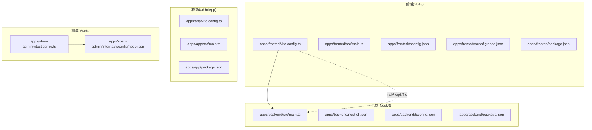
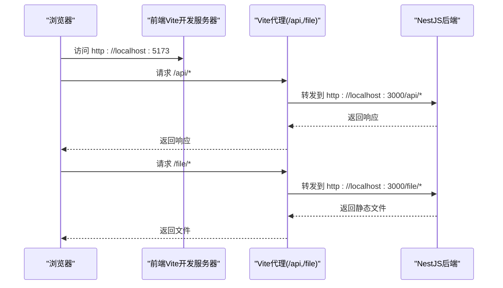
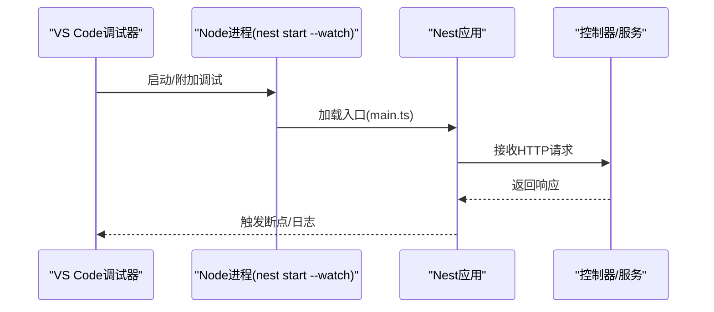
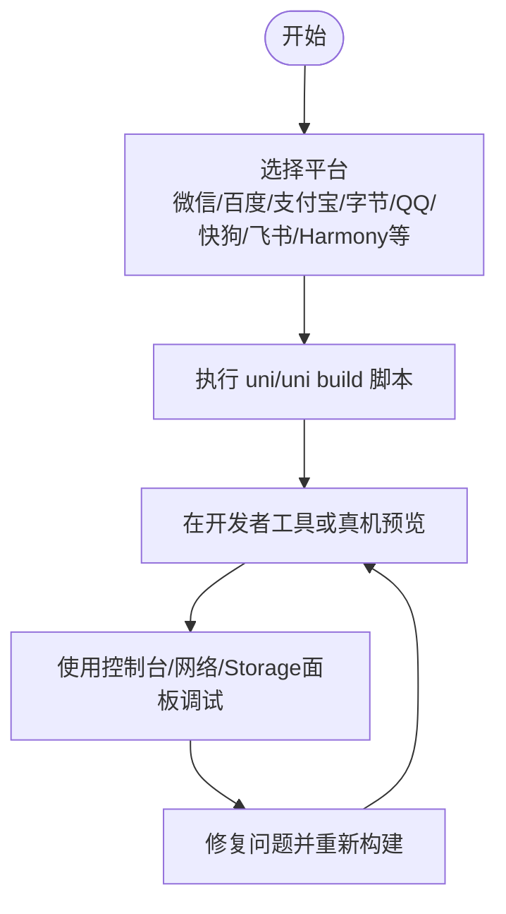
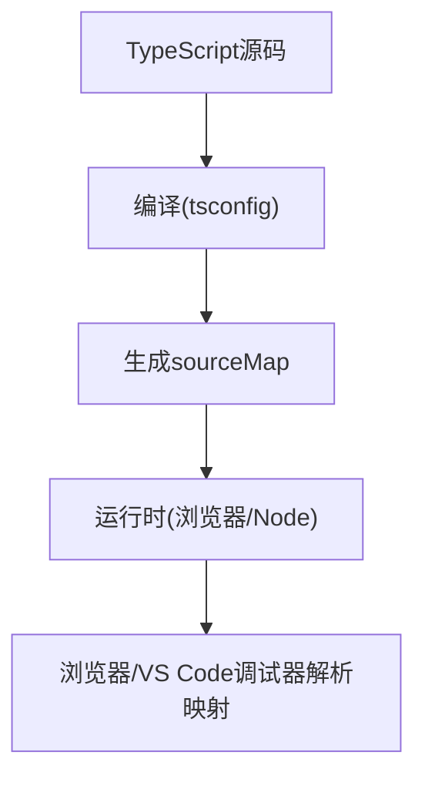
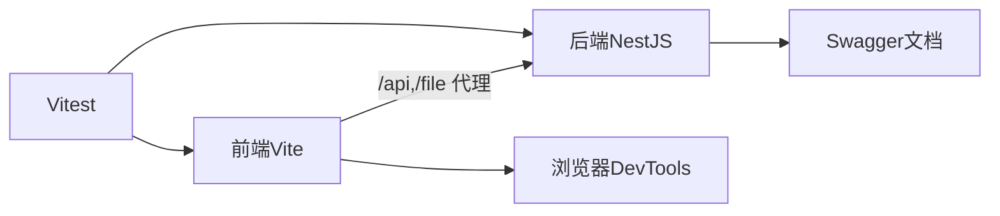

# 调试工具

<cite>
**本文引用的文件**
- [apps/backend/src/main.ts](file://apps/backend/src/main.ts)
- [apps/backend/nest-cli.json](file://apps/backend/nest-cli.json)
- [apps/backend/tsconfig.json](file://apps/backend/tsconfig.json)
- [apps/backend/tsconfig.build.json](file://apps/backend/tsconfig.build.json)
- [apps/backend/package.json](file://apps/backend/package.json)
- [apps/fronted/vite.config.ts](file://apps/fronted/vite.config.ts)
- [apps/fronted/src/main.ts](file://apps/fronted/src/main.ts)
- [apps/fronted/package.json](file://apps/fronted/package.json)
- [apps/fronted/tsconfig.json](file://apps/fronted/tsconfig.json)
- [apps/fronted/tsconfig.node.json](file://apps/fronted/tsconfig.node.json)
- [apps/app/vite.config.ts](file://apps/app/vite.config.ts)
- [apps/app/src/main.ts](file://apps/app/src/main.ts)
- [apps/app/package.json](file://apps/app/package.json)
- [apps/vben-admin/vitest.config.ts](file://apps/vben-admin/vitest.config.ts)
- [apps/vben-admin/internal/tsconfig/node.json](file://apps/vben-admin/internal/tsconfig/node.json)
- [apps/vben-admin/.browserslistrc](file://apps/vben-admin/.browserslistrc)
</cite>

## 目录
1. [简介](#简介)
2. [项目结构](#项目结构)
3. [核心组件](#核心组件)
4. [架构总览](#架构总览)
5. [详细组件分析](#详细组件分析)
6. [依赖分析](#依赖分析)
7. [性能考虑](#性能考虑)
8. [故障排查指南](#故障排查指南)
9. [结论](#结论)
10. [附录](#附录)

## 简介
本文件面向开发者与测试工程师，系统化梳理本仓库中多端（Web 前端、Node.js 后端、UniApp 移动/H5）的调试工具使用与配置方法，覆盖以下主题：
- 浏览器开发者工具：网络请求调试、DOM 检查、性能分析
- Node.js 应用调试：VS Code 调试器设置、断点调试、远程调试
- 移动端应用调试：微信开发者工具、HBuilder 调试、真机调试
- Vue DevTools：组件检查、状态管理、性能分析
- TypeScript 调试配置与源码映射
- 常见调试场景与问题排查：内存泄漏检测、性能瓶颈分析、错误追踪

## 项目结构
本仓库采用多应用结构，包含后端 NestJS 应用、前端 Vue3 应用、以及基于 Vite 的 UniApp 应用。各应用均配有独立的构建与开发配置，便于分别进行调试。

图表来源
- [apps/backend/src/main.ts:1-48](file://apps/backend/src/main.ts#L1-L48)
- [apps/backend/nest-cli.json:1-21](file://apps/backend/nest-cli.json#L1-L21)
- [apps/backend/tsconfig.json:1-20](file://apps/backend/tsconfig.json#L1-L20)
- [apps/backend/package.json:1-50](file://apps/backend/package.json#L1-L50)
- [apps/fronted/vite.config.ts:1-28](file://apps/fronted/vite.config.ts#L1-L28)
- [apps/fronted/src/main.ts:1-27](file://apps/fronted/src/main.ts#L1-L27)
- [apps/fronted/tsconfig.json:1-7](file://apps/fronted/tsconfig.json#L1-L7)
- [apps/fronted/tsconfig.node.json:1-24](file://apps/fronted/tsconfig.node.json#L1-L24)
- [apps/fronted/package.json:1-34](file://apps/fronted/package.json#L1-L34)
- [apps/app/vite.config.ts:1-8](file://apps/app/vite.config.ts#L1-L8)
- [apps/app/src/main.ts:1-9](file://apps/app/src/main.ts#L1-L9)
- [apps/app/package.json:1-72](file://apps/app/package.json#L1-L72)
- [apps/vben-admin/vitest.config.ts:1-29](file://apps/vben-admin/vitest.config.ts#L1-L29)
- [apps/vben-admin/internal/tsconfig/node.json:1-12](file://apps/vben-admin/internal/tsconfig/node.json#L1-L12)

章节来源
- [apps/backend/src/main.ts:1-48](file://apps/backend/src/main.ts#L1-L48)
- [apps/fronted/vite.config.ts:1-28](file://apps/fronted/vite.config.ts#L1-L28)
- [apps/app/vite.config.ts:1-8](file://apps/app/vite.config.ts#L1-L8)

## 核心组件
- 后端服务启动与路由前缀、跨域、静态资源、Swagger 文档等在入口文件集中初始化，便于统一调试与验证。
- 前端通过 Vite 提供本地开发服务器与代理，便于联调后端接口。
- 移动端基于 UniApp/Vite 插件，支持多平台开发与调试。
- 测试使用 Vitest 配置，便于在无浏览器环境下进行单元测试与 DOM 行为模拟。

章节来源
- [apps/backend/src/main.ts:8-46](file://apps/backend/src/main.ts#L8-L46)
- [apps/fronted/vite.config.ts:14-26](file://apps/fronted/vite.config.ts#L14-L26)
- [apps/app/vite.config.ts:5-7](file://apps/app/vite.config.ts#L5-L7)
- [apps/vben-admin/vitest.config.ts:5-28](file://apps/vben-admin/vitest.config.ts#L5-L28)

## 架构总览
下图展示浏览器端、后端服务与代理之间的交互关系，以及调试时的关键端口与路径：

图表来源
- [apps/fronted/vite.config.ts:14-26](file://apps/fronted/vite.config.ts#L14-L26)
- [apps/backend/src/main.ts:37-40](file://apps/backend/src/main.ts#L37-L40)

章节来源
- [apps/fronted/vite.config.ts:14-26](file://apps/fronted/vite.config.ts#L14-L26)
- [apps/backend/src/main.ts:37-46](file://apps/backend/src/main.ts#L37-L46)

## 详细组件分析

### 浏览器开发者工具调试
- 网络请求调试
  - 使用浏览器 Network 面板观察 /api 与 /file 代理转发情况，确认请求头、状态码、响应体与耗时。
  - 关注跨域头与鉴权头（如 Bearer Token），确保代理与后端配置一致。
- DOM 检查
  - 使用 Elements 面板检查组件渲染树、样式与事件绑定；结合 Vue DevTools 进行组件层级与状态检查。
- 性能分析
  - 使用 Performance 面板录制交互流程，定位主线程阻塞、重绘与回流热点。
  - 结合 Lighthouse 进行可访问性、SEO 与最佳实践评估。

章节来源
- [apps/fronted/vite.config.ts:16-24](file://apps/fronted/vite.config.ts#L16-L24)
- [apps/backend/src/main.ts:11-12](file://apps/backend/src/main.ts#L11-L12)

### Node.js 应用调试（后端）
- 开发模式与自动重启
  - 使用 Nest CLI 的 watch 模式启动后端，便于修改即热更新。
- VS Code 调试器设置建议
  - 在 launch.json 中添加 Node 启动配置，指向后端入口文件与 ts-node 支持（若需要直接运行 TS）。
  - 设置断点于控制器、服务与拦截器中，观察请求生命周期与数据流。
- 远程调试
  - 通过 Node 参数启用调试端口，连接外部 IDE 或浏览器 DevTools 进行远程诊断。
- Swagger 文档
  - 启动后访问内置文档页面，辅助接口调试与参数校验问题定位。

图表来源
- [apps/backend/src/main.ts:8-46](file://apps/backend/src/main.ts#L8-L46)
- [apps/backend/package.json:9-10](file://apps/backend/package.json#L9-L10)
- [apps/backend/nest-cli.json:11-19](file://apps/backend/nest-cli.json#L11-L19)

章节来源
- [apps/backend/src/main.ts:8-46](file://apps/backend/src/main.ts#L8-L46)
- [apps/backend/package.json:9-10](file://apps/backend/package.json#L9-L10)
- [apps/backend/nest-cli.json:11-19](file://apps/backend/nest-cli.json#L11-L19)

### 移动端应用调试（UniApp）
- 微信开发者工具
  - 选择对应小程序平台（如微信小程序），使用构建脚本生成目标平台产物并导入工具进行真机预览与调试。
- HBuilder 调试
  - 使用 HBuilder 打开项目，选择运行目标平台，利用其内置的调试面板查看控制台与网络请求。
- 真机调试
  - 通过 UniApp CLI 或 HBuilder 的“真机运行”功能，连接手机进行实时调试与日志输出。
- 多平台脚本
  - 项目提供多平台 dev/build 脚本，便于一键切换平台进行调试。

图表来源
- [apps/app/package.json:4-37](file://apps/app/package.json#L4-L37)

章节来源
- [apps/app/package.json:4-37](file://apps/app/package.json#L4-L37)
- [apps/app/vite.config.ts:5-7](file://apps/app/vite.config.ts#L5-L7)

### Vue DevTools 使用
- 安装与启用
  - 在浏览器扩展商店安装 Vue DevTools，确保在开发环境中启用。
- 组件检查
  - 使用组件面板查看组件树、Props、Slots 与渲染次数，定位异常子组件。
- 状态管理
  - 结合 Pinia/全局状态，查看 Store 状态变更与 Actions 调用轨迹。
- 性能分析
  - 利用 Profiler 面板记录组件渲染性能，识别长列表、重复渲染与不必要更新。

章节来源
- [apps/fronted/src/main.ts:12-26](file://apps/fronted/src/main.ts#L12-L26)

### TypeScript 调试配置与源码映射
- 后端 TypeScript
  - 启用 sourceMap 以支持断点与堆栈追踪；构建配置排除测试与 node_modules。
- 前端 TypeScript
  - 使用复合配置拆分应用与 Node 工具链类型；Bundler 模式提升类型安全。
- 测试环境
  - Vitest 使用 happy-dom 环境，禁用脚本加载安全策略以兼容测试行为。

图表来源
- [apps/backend/tsconfig.json:12](file://apps/backend/tsconfig.json#L12)
- [apps/backend/tsconfig.build.json:2-4](file://apps/backend/tsconfig.build.json#L2-L4)
- [apps/fronted/tsconfig.json:3-6](file://apps/fronted/tsconfig.json#L3-L6)
- [apps/fronted/tsconfig.node.json:10-15](file://apps/fronted/tsconfig.node.json#L10-L15)
- [apps/vben-admin/vitest.config.ts:8-17](file://apps/vben-admin/vitest.config.ts#L8-L17)

章节来源
- [apps/backend/tsconfig.json:12](file://apps/backend/tsconfig.json#L12)
- [apps/backend/tsconfig.build.json:2-4](file://apps/backend/tsconfig.build.json#L2-L4)
- [apps/fronted/tsconfig.json:3-6](file://apps/fronted/tsconfig.json#L3-L6)
- [apps/fronted/tsconfig.node.json:10-15](file://apps/fronted/tsconfig.node.json#L10-L15)
- [apps/vben-admin/vitest.config.ts:8-17](file://apps/vben-admin/vitest.config.ts#L8-L17)

## 依赖分析
- 前端开发服务器与代理
  - Vite 代理将 /api 与 /file 请求转发至后端地址，便于前后端联调。
- 后端服务
  - NestJS 提供全局前缀、跨域、静态资源与 Swagger 文档，统一对外接口形态。
- 测试与类型配置
  - Vitest 与复合 tsconfig 配置保障开发与测试环境的一致性。

图表来源
- [apps/fronted/vite.config.ts:16-24](file://apps/fronted/vite.config.ts#L16-L24)
- [apps/backend/src/main.ts:14-40](file://apps/backend/src/main.ts#L14-L40)
- [apps/vben-admin/vitest.config.ts:5-28](file://apps/vben-admin/vitest.config.ts#L5-L28)

章节来源
- [apps/fronted/vite.config.ts:16-24](file://apps/fronted/vite.config.ts#L16-L24)
- [apps/backend/src/main.ts:14-40](file://apps/backend/src/main.ts#L14-L40)
- [apps/vben-admin/vitest.config.ts:5-28](file://apps/vben-admin/vitest.config.ts#L5-L28)

## 性能考虑
- 前端性能
  - 使用浏览器 Performance 面板录制交互，关注主线程耗时、重绘与大对象渲染。
  - 利用 Lighthouse 进行可访问性与最佳实践评估。
- 后端性能
  - 关注路由前缀与中间件处理时间，避免不必要的序列化与 I/O。
  - 使用 Swagger 快速验证接口参数与返回结构，减少无效请求。
- 移动端性能
  - 不同平台渲染差异较大，优先在目标平台工具中进行真机调试与性能采样。

## 故障排查指南
- 内存泄漏检测
  - 浏览器 Memory 面板定期截图与堆快照对比，定位未释放的对象引用。
  - 关注事件监听器、定时器与闭包持有。
- 性能瓶颈分析
  - 使用 Performance 面板录制关键操作，结合火焰图定位热点函数。
  - 检查是否存在大量同步阻塞、重复渲染或不必要计算。
- 错误追踪
  - 控制台错误与 Promise Rejection 监听，结合 sourceMap 定位源文件与行列。
  - 后端使用全局异常过滤器与拦截器，统一记录与返回错误信息。
- 跨域与代理问题
  - 确认后端已启用跨域，代理目标地址与端口正确，Origin 与 Credentials 配置符合预期。

章节来源
- [apps/backend/src/main.ts:11-12](file://apps/backend/src/main.ts#L11-L12)
- [apps/fronted/vite.config.ts:16-24](file://apps/fronted/vite.config.ts#L16-L24)

## 结论
本项目提供了完善的多端调试基础设施：前端 Vite 代理与 DevTools、后端 NestJS 与 Swagger、移动端 UniApp 多平台脚本与工具链，以及 Vitest 测试环境。按本文档步骤配置与使用，可高效完成网络、DOM、性能与状态等多维度调试任务，并建立标准化的问题排查流程。

## 附录
- 浏览器与 Node 调试快捷键与常用面板
  - F8/回车：继续；F10/Step Over；F11/Step Into；Shift+F11/Step Out
  - Console：日志与表达式求值；Sources：断点与调用栈；Network：请求与响应；Performance：性能录制；Memory：内存快照
- 常用命令参考
  - 后端：开发启动、构建、生产运行
  - 前端：开发、构建、预览
  - 移动端：多平台开发与构建脚本

章节来源
- [apps/backend/package.json:6-10](file://apps/backend/package.json#L6-L10)
- [apps/fronted/package.json:6-9](file://apps/fronted/package.json#L6-L9)
- [apps/app/package.json:4-37](file://apps/app/package.json#L4-L37)