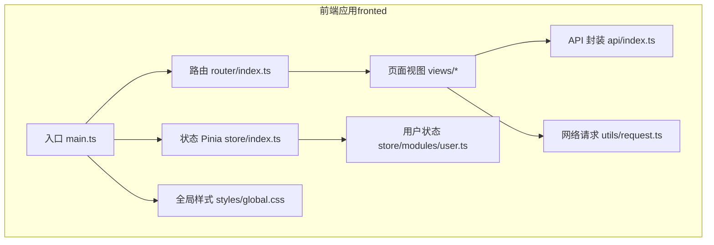
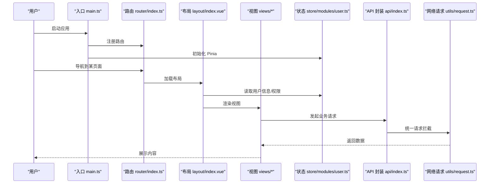
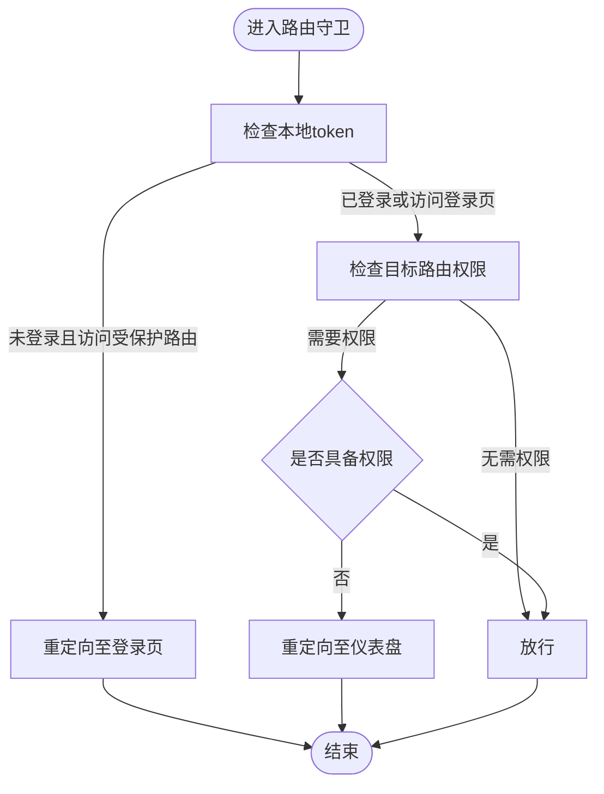
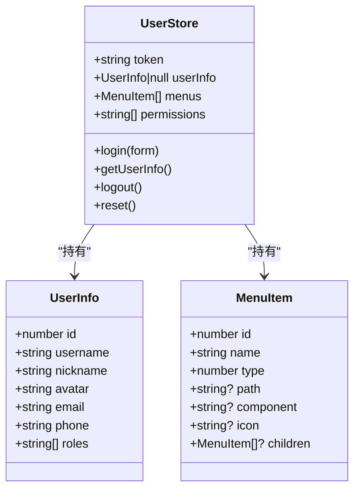
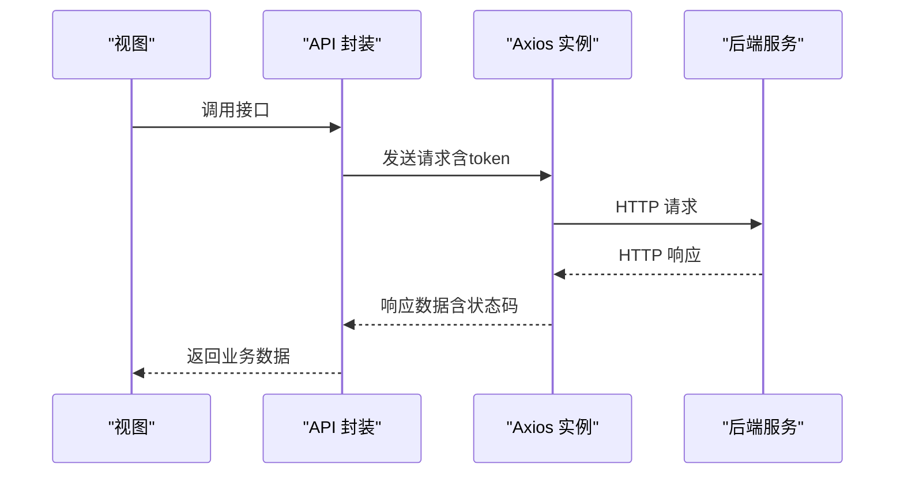
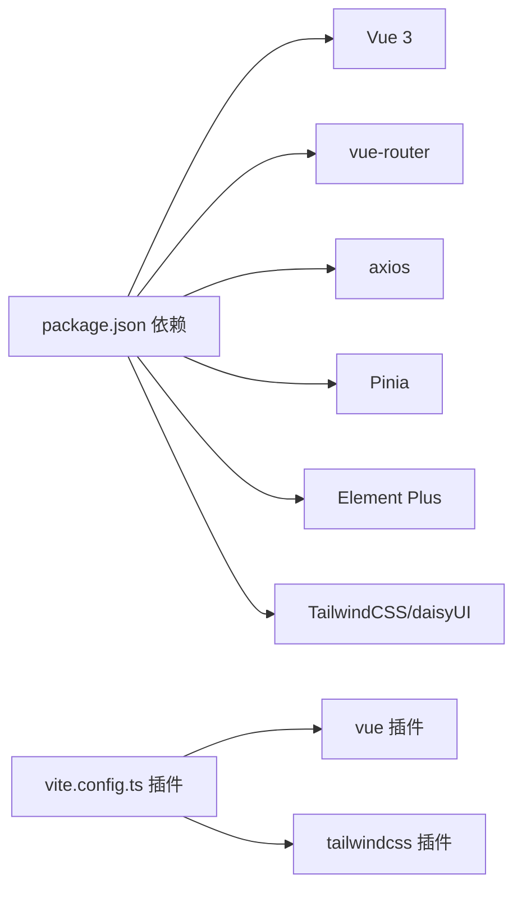

# 前端性能优化

<cite>
**本文引用的文件**
- [apps/fronted/vite.config.ts](file://apps/fronted/vite.config.ts)
- [apps/fronted/package.json](file://apps/fronted/package.json)
- [apps/fronted/src/router/index.ts](file://apps/fronted/src/router/index.ts)
- [apps/fronted/src/store/index.ts](file://apps/fronted/src/store/index.ts)
- [apps/fronted/src/main.ts](file://apps/fronted/src/main.ts)
- [apps/fronted/src/store/modules/user.ts](file://apps/fronted/src/store/modules/user.ts)
- [apps/fronted/src/utils/request.ts](file://apps/fronted/src/utils/request.ts)
- [apps/fronted/src/components/layout/index.vue](file://apps/fronted/src/components/layout/index.vue)
- [apps/fronted/src/views/dashboard/index.vue](file://apps/fronted/src/views/dashboard/index.vue)
- [apps/fronted/src/styles/global.css](file://apps/fronted/src/styles/global.css)
- [apps/fronted/src/api/index.ts](file://apps/fronted/src/api/index.ts)
- [apps/vben-admin/internal/vite-config/src/plugins/index.ts](file://apps/vben-admin/internal/vite-config/src/plugins/index.ts)
- [apps/vben-admin/internal/vite-config/src/plugins/importmap.ts](file://apps/vben-admin/internal/vite-config/src/plugins/importmap.ts)
- [apps/vben-admin/internal/vite-config/src/typing.ts](file://apps/vben-admin/internal/vite-config/src/typing.ts)
</cite>

## 目录
1. [引言](#引言)
2. [项目结构](#项目结构)
3. [核心组件](#核心组件)
4. [架构总览](#架构总览)
5. [详细组件分析](#详细组件分析)
6. [依赖分析](#依赖分析)
7. [性能考虑](#性能考虑)
8. [故障排查指南](#故障排查指南)
9. [结论](#结论)
10. [附录](#附录)

## 引言
本指南面向Vue 3前端应用，系统梳理性能优化策略与最佳实践，覆盖组件与路由懒加载、代码分割与Tree Shaking、资源优化（图片、字体、CSS/JS）、网络请求优化（缓存、合并、防抖节流、CDN）、移动端优化（包体积、首屏、渲染）、状态管理优化（持久化与响应式数据）、以及性能监控工具（Lighthouse、Web Vitals、DevTools）的使用方法。文档结合仓库现有实现进行分析，并给出可落地的改进建议与参考路径。

## 项目结构
该仓库包含多个应用，前端侧主要关注apps/fronted（基于Vite + Vue 3 + Pinia + Element Plus）与apps/vben-admin（更完整的工程化方案）。前端应用采用模块化组织：页面视图、路由、状态管理、API封装、样式与工具函数等分层清晰，便于实施性能优化。

图表来源
- [apps/fronted/src/main.ts:1-27](file://apps/fronted/src/main.ts#L1-L27)
- [apps/fronted/src/router/index.ts:1-160](file://apps/fronted/src/router/index.ts#L1-L160)
- [apps/fronted/src/store/index.ts:1-5](file://apps/fronted/src/store/index.ts#L1-L5)
- [apps/fronted/src/store/modules/user.ts:1-75](file://apps/fronted/src/store/modules/user.ts#L1-L75)
- [apps/fronted/src/styles/global.css:1-297](file://apps/fronted/src/styles/global.css#L1-L297)
- [apps/fronted/src/api/index.ts:1-155](file://apps/fronted/src/api/index.ts#L1-L155)
- [apps/fronted/src/utils/request.ts:1-51](file://apps/fronted/src/utils/request.ts#L1-L51)

章节来源
- [apps/fronted/src/main.ts:1-27](file://apps/fronted/src/main.ts#L1-L27)
- [apps/fronted/src/router/index.ts:1-160](file://apps/fronted/src/router/index.ts#L1-L160)
- [apps/fronted/src/store/index.ts:1-5](file://apps/fronted/src/store/index.ts#L1-L5)
- [apps/fronted/src/store/modules/user.ts:1-75](file://apps/fronted/src/store/modules/user.ts#L1-L75)
- [apps/fronted/src/styles/global.css:1-297](file://apps/fronted/src/styles/global.css#L1-L297)
- [apps/fronted/src/api/index.ts:1-155](file://apps/fronted/src/api/index.ts#L1-L155)
- [apps/fronted/src/utils/request.ts:1-51](file://apps/fronted/src/utils/request.ts#L1-L51)

## 核心组件
- 应用入口与注册：在入口中完成Pinia、路由、国际化、UI库注册与主题初始化，确保全局依赖一次性挂载，减少重复初始化成本。
- 路由与导航守卫：采用动态导入组件实现路由懒加载；导航守卫中按需拉取用户信息与权限，避免非必要渲染。
- 状态管理：Pinia Store负责token、用户信息、菜单与权限持久化，建议结合浏览器存储策略与响应式数据最小化更新。
- 网络请求：统一Axios实例，集中处理鉴权头、错误拦截与401跳转，便于后续引入缓存与重试策略。
- 视图与布局：布局组件提供移动端抽屉与桌面端侧边栏，配合主题切换与国际化，注意在大数据列表场景下启用虚拟滚动或分页。

章节来源
- [apps/fronted/src/main.ts:1-27](file://apps/fronted/src/main.ts#L1-L27)
- [apps/fronted/src/router/index.ts:1-160](file://apps/fronted/src/router/index.ts#L1-L160)
- [apps/fronted/src/store/modules/user.ts:1-75](file://apps/fronted/src/store/modules/user.ts#L1-L75)
- [apps/fronted/src/utils/request.ts:1-51](file://apps/fronted/src/utils/request.ts#L1-L51)
- [apps/fronted/src/components/layout/index.vue:1-234](file://apps/fronted/src/components/layout/index.vue#L1-L234)

## 架构总览
下图展示从入口到页面渲染的关键链路，以及与状态、网络、样式的关系。

图表来源
- [apps/fronted/src/main.ts:1-27](file://apps/fronted/src/main.ts#L1-L27)
- [apps/fronted/src/router/index.ts:1-160](file://apps/fronted/src/router/index.ts#L1-L160)
- [apps/fronted/src/components/layout/index.vue:1-234](file://apps/fronted/src/components/layout/index.vue#L1-L234)
- [apps/fronted/src/store/modules/user.ts:1-75](file://apps/fronted/src/store/modules/user.ts#L1-L75)
- [apps/fronted/src/api/index.ts:1-155](file://apps/fronted/src/api/index.ts#L1-L155)
- [apps/fronted/src/utils/request.ts:1-51](file://apps/fronted/src/utils/request.ts#L1-L51)

## 详细组件分析

### 路由懒加载与导航守卫
- 路由懒加载：通过动态导入实现按需加载组件，降低首屏包体与初始渲染压力。
- 导航守卫：登录态校验、权限校验与首次用户信息拉取，避免无谓的渲染与请求。
- 优化建议：对权限不足或未登录的重定向路径进行缓存判断，减少重复计算；对大型菜单/路由树进行分块加载。

图表来源
- [apps/fronted/src/router/index.ts:130-157](file://apps/fronted/src/router/index.ts#L130-L157)

章节来源
- [apps/fronted/src/router/index.ts:1-160](file://apps/fronted/src/router/index.ts#L1-L160)

### 状态管理与持久化
- 用户状态：token、用户信息、菜单与权限均持久化于Pinia Store，结合localStorage实现刷新后恢复。
- 响应式数据优化：仅在必要字段变更时触发更新，避免大对象全量替换；对权限数组与菜单树进行浅比较。
- 持久化策略：建议区分“会话级”（内存）与“长期级”（localStorage）数据，减少不必要序列化开销。

图表来源
- [apps/fronted/src/store/modules/user.ts:1-75](file://apps/fronted/src/store/modules/user.ts#L1-L75)

章节来源
- [apps/fronted/src/store/modules/user.ts:1-75](file://apps/fronted/src/store/modules/user.ts#L1-L75)

### 网络请求与缓存
- 统一请求：Axios实例集中设置基础URL、超时与默认头，请求拦截器自动附加Authorization，响应拦截器统一错误处理与401跳转。
- 缓存策略：可在响应拦截器中根据业务场景加入ETag/Last-Modified缓存判断，或在API层对静态数据进行本地缓存。
- 请求合并与去重：对高频查询（如搜索、分页）使用请求去重与合并策略，避免重复网络往返。

图表来源
- [apps/fronted/src/api/index.ts:1-155](file://apps/fronted/src/api/index.ts#L1-L155)
- [apps/fronted/src/utils/request.ts:1-51](file://apps/fronted/src/utils/request.ts#L1-L51)

章节来源
- [apps/fronted/src/api/index.ts:1-155](file://apps/fronted/src/api/index.ts#L1-L155)
- [apps/fronted/src/utils/request.ts:1-51](file://apps/fronted/src/utils/request.ts#L1-L51)

### 视图与布局渲染优化
- 布局组件：提供移动端抽屉与桌面端侧边栏，配合主题切换与国际化；注意在大数据表格与菜单中启用虚拟滚动或分页。
- 仪表盘视图：使用Promise.all并发请求多个统计接口，缩短首屏等待时间；对空数据与加载状态提供骨架屏占位。

章节来源
- [apps/fronted/src/components/layout/index.vue:1-234](file://apps/fronted/src/components/layout/index.vue#L1-L234)
- [apps/fronted/src/views/dashboard/index.vue:156-189](file://apps/fronted/src/views/dashboard/index.vue#L156-L189)

### 样式与主题
- 全局样式：Tailwind v4 + daisyUI主题体系，提供过渡动画与滚动条美化；针对高对比度与减少运动偏好提供降级策略。
- 主题切换：通过data-theme属性实现主题切换，注意过渡动画与颜色变量的性能影响。

章节来源
- [apps/fronted/src/styles/global.css:1-297](file://apps/fronted/src/styles/global.css#L1-L297)

## 依赖分析
- 构建与开发：Vite提供快速冷启动与热更新；别名@指向src，简化路径书写。
- 运行时依赖：Vue 3、Pinia、Element Plus、axios、vue-router、vue-i18n等。
- 工程化优化：vben-admin提供了丰富的Vite插件集合，包括压缩（gzip/brotli）、HTML优化、ImportMap、PWA等，可作为扩展参考。

图表来源
- [apps/fronted/package.json:1-34](file://apps/fronted/package.json#L1-L34)
- [apps/fronted/vite.config.ts:1-28](file://apps/fronted/vite.config.ts#L1-L28)

章节来源
- [apps/fronted/package.json:1-34](file://apps/fronted/package.json#L1-L34)
- [apps/fronted/vite.config.ts:1-28](file://apps/fronted/vite.config.ts#L1-L28)

## 性能考虑

### 组件与路由懒加载
- 路由级懒加载：已在路由中对视图组件使用动态导入，建议对大型页面（如报表、图表）进一步拆分。
- 组件级懒加载：对非首屏使用的重型组件（如图表库）采用动态导入与Suspense占位。
- 代码分割：利用Vite的动态导入自动分包，避免单文件过大；对第三方库进行外部化与CDN加速。

章节来源
- [apps/fronted/src/router/index.ts:1-160](file://apps/fronted/src/router/index.ts#L1-L160)

### Tree Shaking 与按需引入
- 按需引入UI组件与图标，避免全量引入导致的包体膨胀。
- 对国际化、主题切换等模块采用按需加载，减少首屏依赖。

章节来源
- [apps/fronted/src/main.ts:1-27](file://apps/fronted/src/main.ts#L1-L27)

### 资源优化
- 图片：采用现代格式（WebP/AVIF），按设备像素比选择尺寸，使用懒加载与占位图。
- 字体：预加载关键字体，使用字体子集化与可变字体；避免阻塞渲染的字体加载。
- CSS：移除未使用类，缩小动画时长，避免深层嵌套；将关键CSS内联，其余CSS异步加载。
- JavaScript：启用压缩与分包，对第三方库进行CDN与版本锁定。

章节来源
- [apps/fronted/src/styles/global.css:1-297](file://apps/fronted/src/styles/global.css#L1-L297)

### 网络请求优化
- HTTP缓存：合理设置Cache-Control与ETag，对静态资源与接口数据进行缓存。
- 请求合并：对多接口聚合场景使用Promise.all；对高频请求进行去重与节流。
- 防抖节流：对搜索、筛选、窗口resize等事件进行节流/防抖。
- CDN加速：将静态资源与常用第三方库托管至CDN，缩短首字节时间。

章节来源
- [apps/fronted/src/utils/request.ts:1-51](file://apps/fronted/src/utils/request.ts#L1-L51)

### 移动端优化
- 包体积控制：拆分页面与功能模块，延迟加载非关键资源。
- 首屏优化：关键渲染路径最小化，骨架屏与占位图优先；路由懒加载与组件懒加载配合使用。
- 渲染性能：避免长任务阻塞主线程，使用requestAnimationFrame与Web Workers；对列表渲染启用虚拟滚动。

章节来源
- [apps/fronted/src/components/layout/index.vue:1-234](file://apps/fronted/src/components/layout/index.vue#L1-L234)

### 状态管理优化
- 持久化：对token与用户信息进行持久化，避免重复登录与拉取。
- 响应式数据：使用细粒度状态与计算属性，减少不必要的响应式追踪；对大数组采用分页与增量更新。

章节来源
- [apps/fronted/src/store/modules/user.ts:1-75](file://apps/fronted/src/store/modules/user.ts#L1-L75)

### 性能监控与分析
- Lighthouse：定期运行审计，关注性能、可访问性、SEO与最佳实践指标。
- Web Vitals：监控CLS、FID、LCP、INP等核心指标，建立阈值告警。
- Chrome DevTools：使用Performance面板定位长任务与重排重绘，Memory面板检测内存泄漏。

章节来源
- [apps/fronted/src/main.ts:1-27](file://apps/fronted/src/main.ts#L1-L27)

## 故障排查指南
- 登录态异常：检查localStorage中的token是否存在与过期；确认导航守卫逻辑与401处理。
- 权限不足：核对用户权限数组与路由meta.perm匹配；确认getUserInfo调用时机。
- 请求失败：查看响应拦截器中的错误提示与状态码；检查基础URL与代理配置。
- 样式异常：确认Tailwind与daisyUI版本兼容；检查主题切换与动画时长。

章节来源
- [apps/fronted/src/router/index.ts:130-157](file://apps/fronted/src/router/index.ts#L130-L157)
- [apps/fronted/src/utils/request.ts:1-51](file://apps/fronted/src/utils/request.ts#L1-L51)
- [apps/fronted/src/store/modules/user.ts:1-75](file://apps/fronted/src/store/modules/user.ts#L1-L75)

## 结论
通过路由与组件懒加载、代码分割与Tree Shaking、资源与网络优化、移动端专项优化、状态管理与持久化、以及完善的性能监控体系，Vue 3应用可以在保证功能完整性的同时显著提升用户体验与性能表现。建议结合vben-admin的工程化插件能力，逐步引入压缩、ImportMap与PWA等优化手段，持续迭代性能基线。

## 附录

### Vite 插件与压缩配置参考
- 压缩插件：支持gzip与brotli，按需开启以平衡构建时间与传输体积。
- ImportMap：在生产环境注入importmap，优化模块解析与缓存命中。
- PWA：可选的PWA配置，用于离线缓存与应用壳体验。

章节来源
- [apps/vben-admin/internal/vite-config/src/plugins/index.ts:160-211](file://apps/vben-admin/internal/vite-config/src/plugins/index.ts#L160-L211)
- [apps/vben-admin/internal/vite-config/src/plugins/importmap.ts:39-203](file://apps/vben-admin/internal/vite-config/src/plugins/importmap.ts#L39-L203)
- [apps/vben-admin/internal/vite-config/src/typing.ts:189-250](file://apps/vben-admin/internal/vite-config/src/typing.ts#L189-L250)