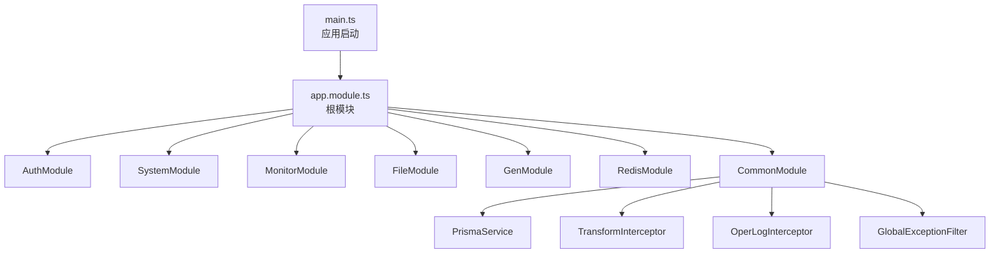
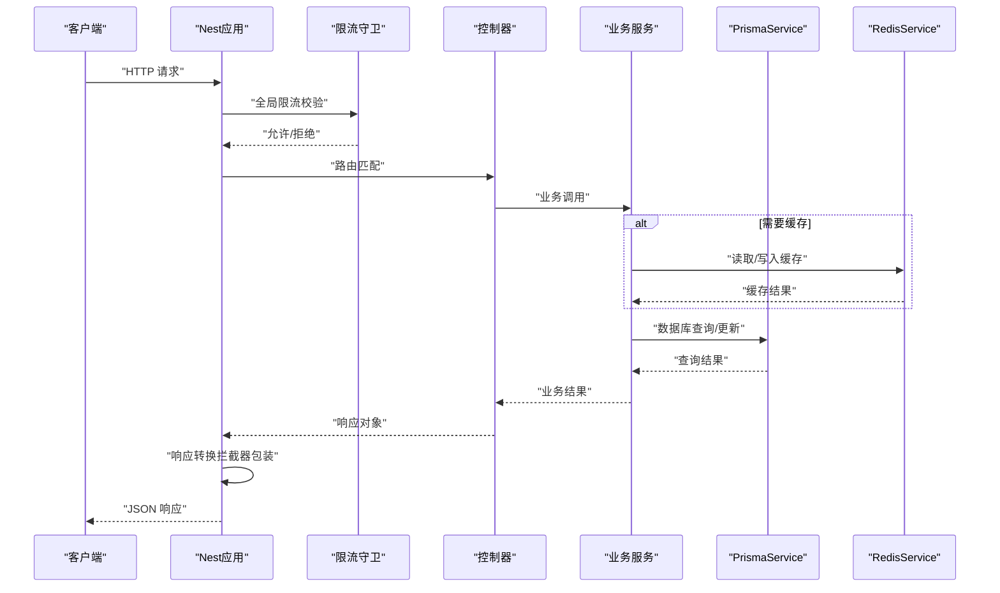
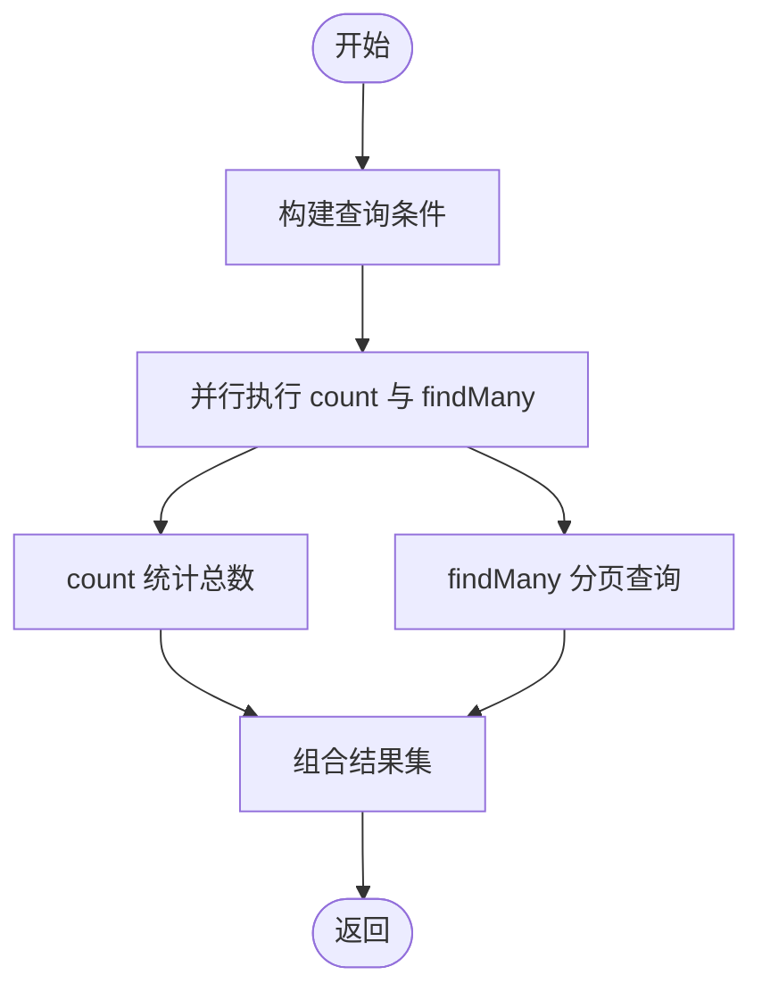
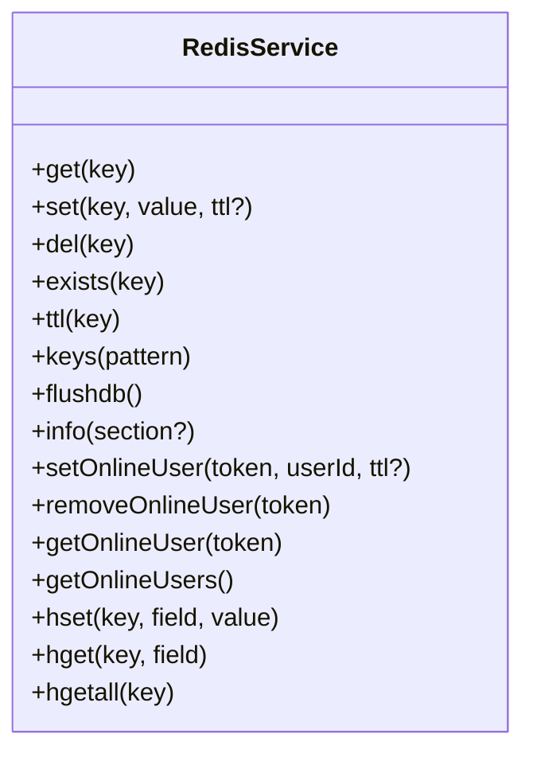
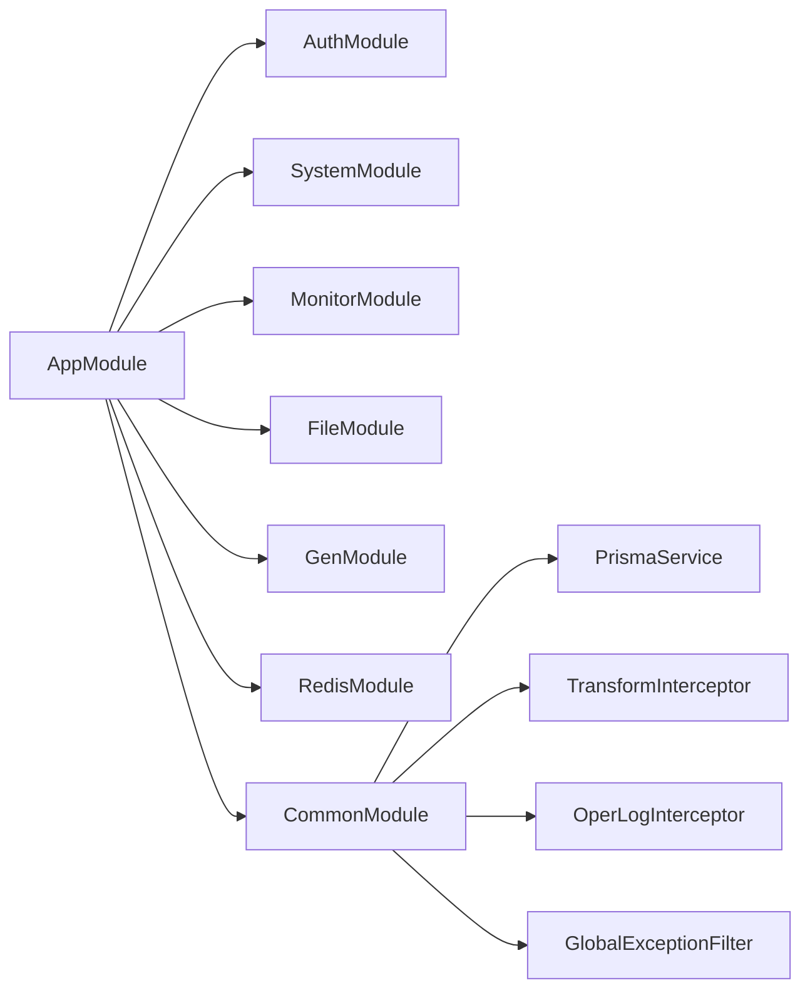

# 后端性能调优

<cite>
**本文引用的文件**
- [apps/backend/src/app.module.ts](file://apps/backend/src/app.module.ts)
- [apps/backend/src/main.ts](file://apps/backend/src/main.ts)
- [apps/backend/prisma/schema.prisma](file://apps/backend/prisma/schema.prisma)
- [apps/backend/src/common/prisma.service.ts](file://apps/backend/src/common/prisma.service.ts)
- [apps/backend/src/cache/redis.service.ts](file://apps/backend/src/cache/redis.service.ts)
- [apps/backend/src/common/transform.interceptor.ts](file://apps/backend/src/common/transform.interceptor.ts)
- [apps/backend/src/common/oper-log.interceptor.ts](file://apps/backend/src/common/oper-log.interceptor.ts)
- [apps/backend/src/common/exception.filter.ts](file://apps/backend/src/common/exception.filter.ts)
- [apps/backend/src/config/env.config.ts](file://apps/backend/src/config/env.config.ts)
- [apps/backend/package.json](file://apps/backend/package.json)
- [apps/backend/src/modules/system/user/user.service.ts](file://apps/backend/src/modules/system/user/user.service.ts)
- [apps/backend/src/modules/system/user/user.controller.ts](file://apps/backend/src/modules/system/user/user.controller.ts)
- [apps/backend/src/modules/monitor/monitor.module.ts](file://apps/backend/src/modules/monitor/monitor.module.ts)
</cite>

## 目录
1. [简介](#简介)
2. [项目结构](#项目结构)
3. [核心组件](#核心组件)
4. [架构总览](#架构总览)
5. [详细组件分析](#详细组件分析)
6. [依赖关系分析](#依赖关系分析)
7. [性能考虑](#性能考虑)
8. [故障排查指南](#故障排查指南)
9. [结论](#结论)
10. [附录](#附录)

## 简介
本指南面向NestJS后端服务的性能调优实践，结合仓库中的实际代码与配置，系统讲解以下主题：依赖注入与模块加载优化、中间件与拦截器性能调优、数据库查询优化（含Prisma）、索引设计策略、连接池配置、缓存策略（Redis）、API响应优化（分页、批量、序列化）、并发处理（异步、定时任务）、性能监控与日志分析，以及可落地的配置示例与性能测试方法。

## 项目结构
后端位于 apps/backend，采用NestJS标准目录结构，按功能模块划分，核心入口为应用模块与主进程启动文件；数据库ORM使用Prisma，缓存使用Redis；全局拦截器负责统一响应包装与操作日志记录；定时任务模块通过Schedule集成。

图表来源
- [apps/backend/src/main.ts:1-48](file://apps/backend/src/main.ts#L1-L48)
- [apps/backend/src/app.module.ts:1-59](file://apps/backend/src/app.module.ts#L1-L59)

章节来源
- [apps/backend/src/main.ts:1-48](file://apps/backend/src/main.ts#L1-L48)
- [apps/backend/src/app.module.ts:1-59](file://apps/backend/src/app.module.ts#L1-L59)

## 核心组件
- 应用入口与全局配置：设置CORS、全局前缀、全局验证管道、Swagger文档、静态资源服务等。
- 全局守卫与过滤器：限流守卫、异常过滤器、响应转换拦截器、操作日志拦截器。
- 数据访问层：PrismaService封装连接生命周期与日志级别。
- 缓存层：RedisService封装连接、键值与哈希操作、在线用户管理等。
- 配置中心：环境变量集中注册，便于在运行时读取。

章节来源
- [apps/backend/src/main.ts:1-48](file://apps/backend/src/main.ts#L1-L48)
- [apps/backend/src/app.module.ts:1-59](file://apps/backend/src/app.module.ts#L1-L59)
- [apps/backend/src/common/prisma.service.ts:1-22](file://apps/backend/src/common/prisma.service.ts#L1-L22)
- [apps/backend/src/cache/redis.service.ts:1-128](file://apps/backend/src/cache/redis.service.ts#L1-L128)
- [apps/backend/src/common/transform.interceptor.ts:1-29](file://apps/backend/src/common/transform.interceptor.ts#L1-L29)
- [apps/backend/src/common/oper-log.interceptor.ts:1-111](file://apps/backend/src/common/oper-log.interceptor.ts#L1-L111)
- [apps/backend/src/common/exception.filter.ts:1-37](file://apps/backend/src/common/exception.filter.ts#L1-L37)
- [apps/backend/src/config/env.config.ts:1-47](file://apps/backend/src/config/env.config.ts#L1-L47)

## 架构总览
下图展示请求从进入应用到返回的关键路径，以及与数据库、缓存的交互。

图表来源
- [apps/backend/src/app.module.ts:18-56](file://apps/backend/src/app.module.ts#L18-L56)
- [apps/backend/src/common/transform.interceptor.ts:11-29](file://apps/backend/src/common/transform.interceptor.ts#L11-L29)
- [apps/backend/src/common/oper-log.interceptor.ts:15-28](file://apps/backend/src/common/oper-log.interceptor.ts#L15-L28)
- [apps/backend/src/common/prisma.service.ts:8-22](file://apps/backend/src/common/prisma.service.ts#L8-L22)
- [apps/backend/src/cache/redis.service.ts:29-68](file://apps/backend/src/cache/redis.service.ts#L29-L68)

## 详细组件分析

### 依赖注入与模块加载优化
- 将全局守卫、过滤器、拦截器注册为单例，减少重复实例化开销。
- 按功能拆分模块，避免一次性加载过多模块导致启动时间过长；MonitorModule聚合监控子模块，保持清晰边界。
- 使用ConfigModule集中读取环境变量，避免在各处分散读取带来的重复解析成本。

优化建议
- 对于高频模块（如AuthModule、SystemModule），确保其内部服务无阻塞初始化逻辑。
- 将非必要模块延迟加载或按需导入，缩短冷启动时间。
- 控制全局拦截器数量与复杂度，避免对每个请求都进行昂贵计算。

章节来源
- [apps/backend/src/app.module.ts:18-56](file://apps/backend/src/app.module.ts#L18-L56)
- [apps/backend/src/modules/monitor/monitor.module.ts:1-11](file://apps/backend/src/modules/monitor/monitor.module.ts#L1-L11)
- [apps/backend/src/config/env.config.ts:1-47](file://apps/backend/src/config/env.config.ts#L1-L47)

### 中间件与拦截器性能调优
- 响应转换拦截器：统一包装响应，避免在控制器中重复构造结构，减少样板代码与序列化开销。
- 操作日志拦截器：仅对写操作与特定URL进行记录，降低日志写入频率；对敏感字段脱敏，避免大对象序列化。
- 异常过滤器：捕获未处理异常并返回统一格式，避免错误传播造成额外开销。

优化建议
- 在操作日志拦截器中限制日志体大小，避免超大数据量写入数据库。
- 对频繁调用的只读接口关闭操作日志，或增加白名单控制。
- 将日志写入异步化（例如队列），避免阻塞主请求链路。

章节来源
- [apps/backend/src/common/transform.interceptor.ts:11-29](file://apps/backend/src/common/transform.interceptor.ts#L11-L29)
- [apps/backend/src/common/oper-log.interceptor.ts:15-70](file://apps/backend/src/common/oper-log.interceptor.ts#L15-L70)
- [apps/backend/src/common/oper-log.interceptor.ts:81-111](file://apps/backend/src/common/oper-log.interceptor.ts#L81-L111)
- [apps/backend/src/common/exception.filter.ts:12-37](file://apps/backend/src/common/exception.filter.ts#L12-L37)

### 数据库查询优化（Prisma）
- 连接生命周期：在服务初始化时建立连接，在销毁时断开，避免频繁连接/断开。
- 查询模式：使用Promise.all并行统计与分页查询，减少往返次数。
- 关系预加载：仅include所需关联，避免N+1查询。
- 索引设计：根据schema中已定义的索引（如用户名、部门ID、菜单排序、字典项排序等）进行查询优化。

图表来源
- [apps/backend/src/common/prisma.service.ts:14-21](file://apps/backend/src/common/prisma.service.ts#L14-L21)
- [apps/backend/src/modules/system/user/user.service.ts:27-46](file://apps/backend/src/modules/system/user/user.service.ts#L27-L46)

章节来源
- [apps/backend/src/common/prisma.service.ts:1-22](file://apps/backend/src/common/prisma.service.ts#L1-L22)
- [apps/backend/src/modules/system/user/user.service.ts:18-46](file://apps/backend/src/modules/system/user/user.service.ts#L18-L46)
- [apps/backend/prisma/schema.prisma:36-38](file://apps/backend/prisma/schema.prisma#L36-L38)
- [apps/backend/prisma/schema.prisma:113-116](file://apps/backend/prisma/schema.prisma#L113-L116)
- [apps/backend/prisma/schema.prisma:147-150](file://apps/backend/prisma/schema.prisma#L147-L150)

### 索引设计策略
- 用户表：对username、deptId建立索引，支持登录名与部门筛选。
- 菜单表：对parentId、sort、perms建立索引，优化树形结构与权限查询。
- 字典数据：对dictTypeId、sort、value建立索引，提升字典检索效率。
- 文件表：对storage、objectKey、uploaderId、createTime、isDelete建立索引，支撑文件检索与归档。
- 登录日志与操作日志：对username、ip、createTime等建立索引，便于审计与分析。

章节来源
- [apps/backend/prisma/schema.prisma:36-38](file://apps/backend/prisma/schema.prisma#L36-L38)
- [apps/backend/prisma/schema.prisma:73-75](file://apps/backend/prisma/schema.prisma#L73-L75)
- [apps/backend/prisma/schema.prisma:113-116](file://apps/backend/prisma/schema.prisma#L113-L116)
- [apps/backend/prisma/schema.prisma:147-150](file://apps/backend/prisma/schema.prisma#L147-L150)
- [apps/backend/prisma/schema.prisma:202-207](file://apps/backend/prisma/schema.prisma#L202-L207)
- [apps/backend/prisma/schema.prisma:226-229](file://apps/backend/prisma/schema.prisma#L226-L229)
- [apps/backend/prisma/schema.prisma:251-254](file://apps/backend/prisma/schema.prisma#L251-L254)

### 连接池配置
- Prisma客户端默认连接池行为由底层驱动决定；可通过环境变量或Prisma Client选项调整连接池大小、超时等参数（具体参数以Prisma官方文档为准）。
- 建议在生产环境中根据QPS与数据库承载能力评估连接池上限，避免过度连接导致数据库压力过大。

章节来源
- [apps/backend/src/common/prisma.service.ts:8-12](file://apps/backend/src/common/prisma.service.ts#L8-L12)
- [apps/backend/package.json:16-42](file://apps/backend/package.json#L16-L42)

### 缓存策略优化（Redis）
- 连接管理：集中配置host/port/password/db，监听连接事件与错误事件，保证连接健康。
- 键值与哈希：提供通用的get/set/del/existence/ttl/keys/flushdb等操作，以及hset/hget/hgetall等结构化缓存。
- 在线用户：维护在线用户集合与令牌映射，支持按令牌查询用户ID与批量获取在线列表。
- TTL策略：为会话类数据设置合理TTL，避免长期占用内存；对热点数据设置短TTL以保证一致性。

图表来源
- [apps/backend/src/cache/redis.service.ts:1-128](file://apps/backend/src/cache/redis.service.ts#L1-L128)

章节来源
- [apps/backend/src/cache/redis.service.ts:1-128](file://apps/backend/src/cache/redis.service.ts#L1-L128)
- [apps/backend/src/config/env.config.ts:28-33](file://apps/backend/src/config/env.config.ts#L28-L33)

### API响应优化（分页、批量、序列化）
- 分页查询：在服务层并行统计与查询，减少一次往返；控制器统一接收分页参数，避免重复逻辑。
- 批量操作：在业务层合并多次写入为事务或批量提交，减少网络与锁竞争。
- 序列化优化：统一通过响应拦截器包装，避免在控制器中重复构造结构；对大对象进行截断或延迟序列化。

章节来源
- [apps/backend/src/modules/system/user/user.controller.ts:26-31](file://apps/backend/src/modules/system/user/user.controller.ts#L26-L31)
- [apps/backend/src/modules/system/user/user.service.ts:27-46](file://apps/backend/src/modules/system/user/user.service.ts#L27-L46)
- [apps/backend/src/common/transform.interceptor.ts:11-29](file://apps/backend/src/common/transform.interceptor.ts#L11-L29)

### 并发处理优化（异步、定时任务、负载均衡）
- 异步处理：使用Promise.all并行查询、拦截器中异步写日志，避免阻塞主流程。
- 定时任务：通过ScheduleModule启用定时任务模块，用于周期性清理、统计等后台任务。
- 负载均衡：通过容器编排与反向代理实现多实例部署与流量分发，提高吞吐与可用性。

章节来源
- [apps/backend/src/app.module.ts:30-30](file://apps/backend/src/app.module.ts#L30-L30)
- [apps/backend/src/common/oper-log.interceptor.ts:19-27](file://apps/backend/src/common/oper-log.interceptor.ts#L19-L27)

## 依赖关系分析
- 应用模块聚合多个功能模块，形成清晰的层次结构。
- 业务服务依赖PrismaService与RedisService，实现数据持久化与缓存。
- 全局拦截器与过滤器贯穿所有请求，需关注其性能影响。

图表来源
- [apps/backend/src/app.module.ts:18-56](file://apps/backend/src/app.module.ts#L18-L56)

章节来源
- [apps/backend/src/app.module.ts:18-56](file://apps/backend/src/app.module.ts#L18-L56)

## 性能考虑
- 启动与热身：减少模块初始化耗时，使用懒加载与按需导入；在容器启动后进行健康检查与预热。
- 数据库：遵循索引策略，避免全表扫描；使用连接池上限与超时配置；对热点数据进行缓存。
- 缓存：合理设置TTL与淘汰策略；对高并发场景使用分布式缓存；定期清理无效键。
- 接口：统一响应结构，避免重复序列化；对大响应进行压缩或分页；对只读接口开启缓存。
- 日志：异步写日志，限制日志体积；对敏感信息脱敏；区分日志级别与输出目标。
- 监控：埋点关键路径耗时与错误率；结合APM工具观察端到端性能；建立告警阈值。

## 故障排查指南
- 数据库连接问题：检查PrismaService连接日志与错误事件，确认数据库地址、账号与网络连通性。
- Redis连接问题：检查RedisService连接事件与错误事件，确认主机、端口、密码与数据库号。
- 操作日志异常：确认日志表结构与字段长度，避免超长内容导致插入失败；对异常进行降级处理。
- 全局异常：异常过滤器会捕获未处理异常并返回统一格式，便于前端与监控系统识别。

章节来源
- [apps/backend/src/common/prisma.service.ts:14-21](file://apps/backend/src/common/prisma.service.ts#L14-L21)
- [apps/backend/src/cache/redis.service.ts:16-23](file://apps/backend/src/cache/redis.service.ts#L16-L23)
- [apps/backend/src/common/oper-log.interceptor.ts:57-61](file://apps/backend/src/common/oper-log.interceptor.ts#L57-L61)
- [apps/backend/src/common/exception.filter.ts:16-36](file://apps/backend/src/common/exception.filter.ts#L16-L36)

## 结论
通过合理的模块拆分、全局拦截器与过滤器、Prisma查询优化与索引设计、Redis缓存策略、分页与批量处理、异步与定时任务，以及完善的监控与日志体系，可以显著提升NestJS后端服务的性能与稳定性。建议在生产环境中持续观测关键指标，迭代优化配置与策略。

## 附录

### 配置示例（基于现有配置）
- 应用端口与环境：通过环境变量读取，便于容器化部署。
- 数据库连接：通过Prisma Schema中的datasource配置，使用环境变量DATABASE_URL。
- Redis连接：通过env.config中redis配置项读取主机、端口、密码与数据库号。
- JWT与文件存储：通过env.config中app配置项读取密钥、过期时间与文件存储参数。

章节来源
- [apps/backend/src/config/env.config.ts:3-26](file://apps/backend/src/config/env.config.ts#L3-L26)
- [apps/backend/src/config/env.config.ts:28-33](file://apps/backend/src/config/env.config.ts#L28-L33)
- [apps/backend/prisma/schema.prisma:5-8](file://apps/backend/prisma/schema.prisma#L5-L8)

### 性能测试方法
- 基准测试：使用压测工具对关键接口（如用户列表、登录）进行并发与吞吐测试，记录P95/P99延迟与错误率。
- 数据库压测：针对高频查询建立索引前后对比测试，评估查询计划与执行时间变化。
- 缓存命中率：统计缓存命中/未命中比例，调整TTL与淘汰策略以提升命中率。
- 日志与APM：接入APM工具（如探针或云监控），采集端到端链路耗时、错误与慢查询，定位瓶颈。