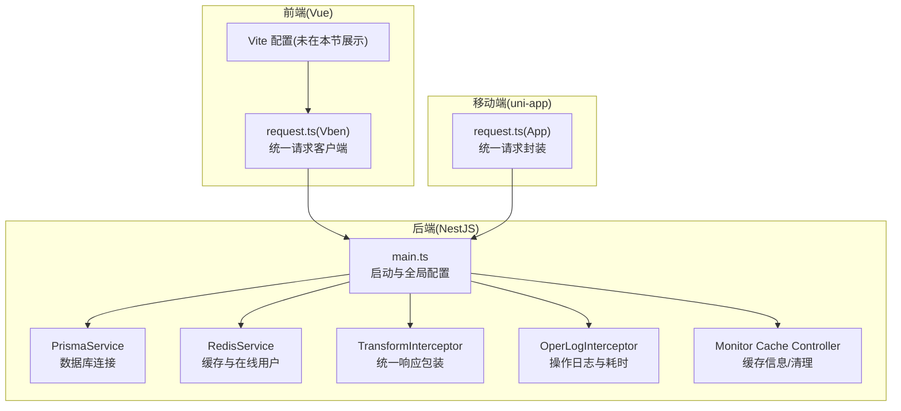
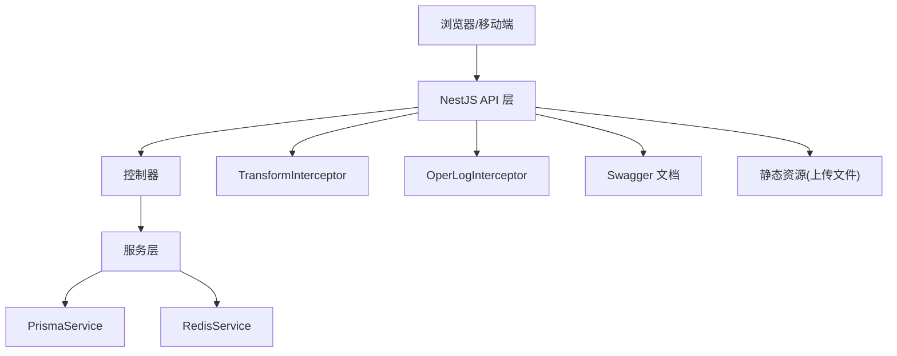
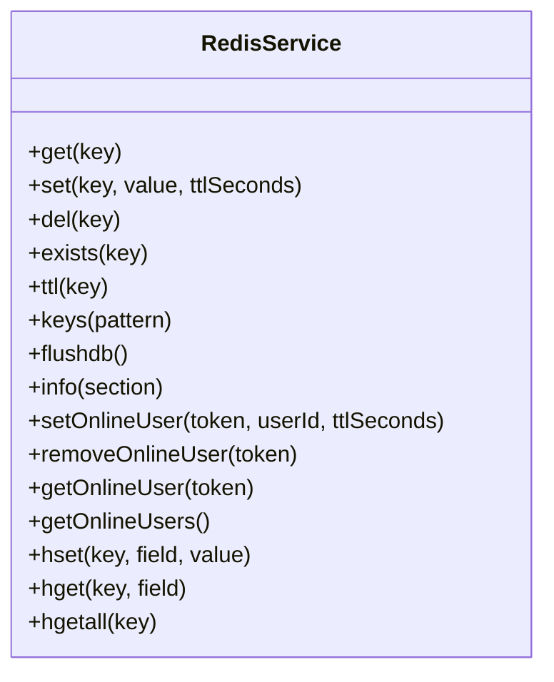
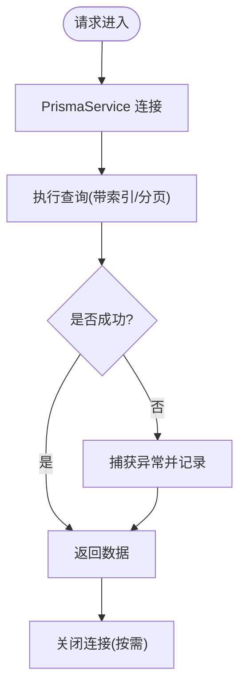
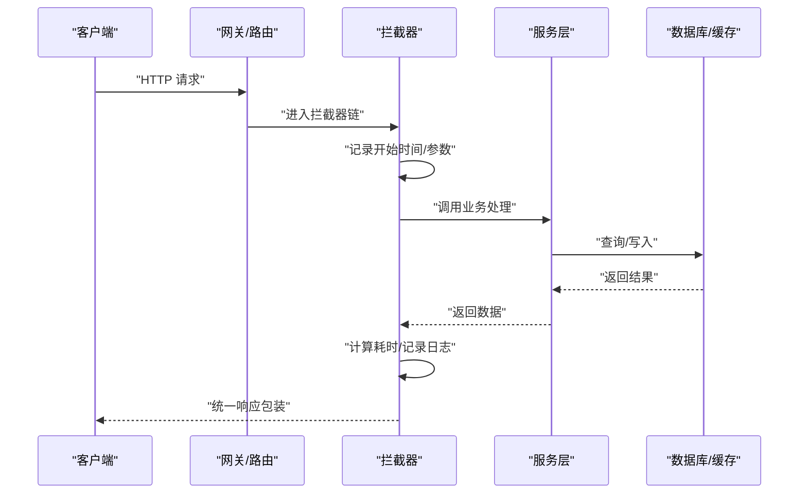
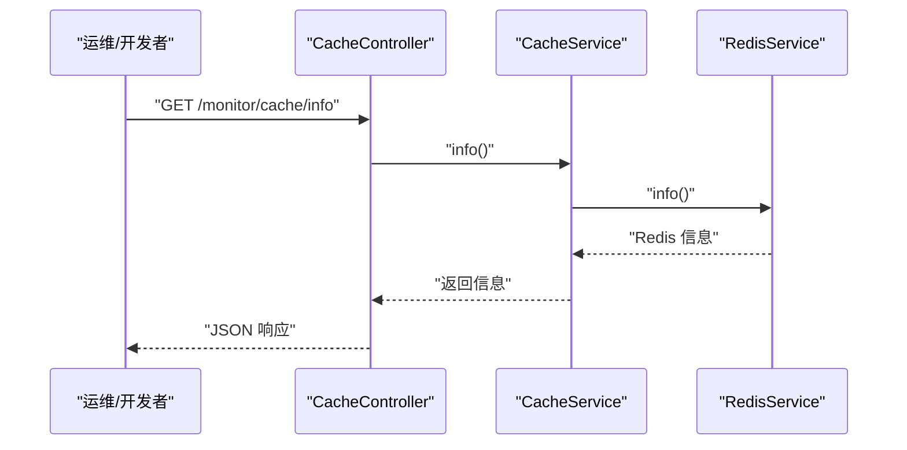
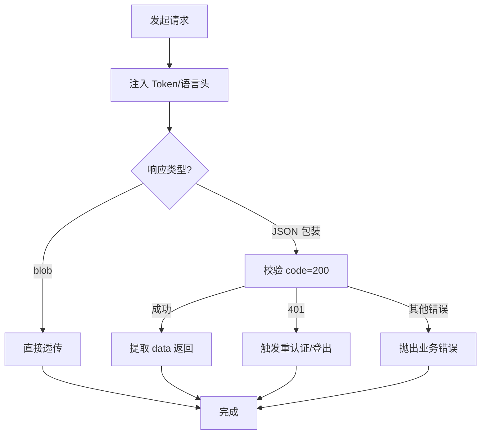
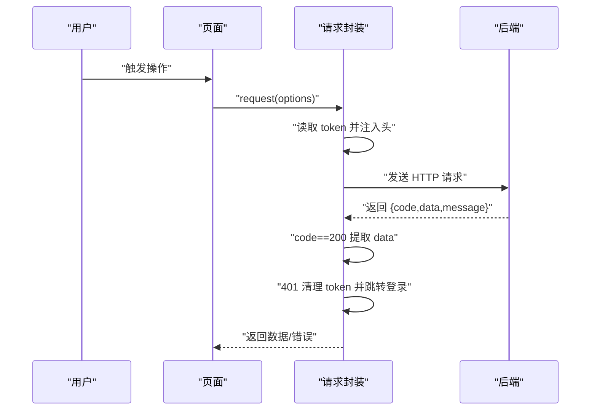
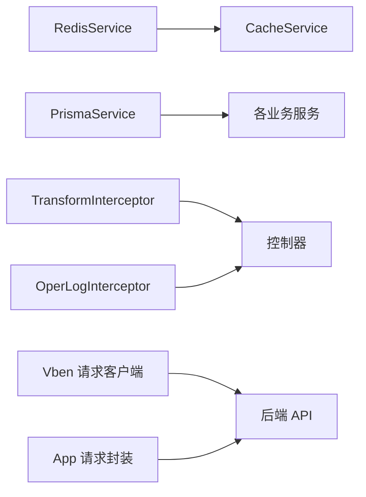

# 性能优化

<cite>
**本文引用的文件**
- [apps/backend/src/cache/redis.service.ts](file://apps/backend/src/cache/redis.service.ts)
- [apps/backend/src/cache/redis.module.ts](file://apps/backend/src/cache/redis.module.ts)
- [apps/backend/src/common/prisma.service.ts](file://apps/backend/src/common/prisma.service.ts)
- [apps/backend/src/modules/monitor/cache/cache.service.ts](file://apps/backend/src/modules/monitor/cache/cache.service.ts)
- [apps/backend/src/modules/monitor/cache/cache.controller.ts](file://apps/backend/src/modules/monitor/cache/cache.controller.ts)
- [apps/backend/src/common/transform.interceptor.ts](file://apps/backend/src/common/transform.interceptor.ts)
- [apps/backend/src/common/oper-log.interceptor.ts](file://apps/backend/src/common/oper-log.interceptor.ts)
- [apps/backend/src/main.ts](file://apps/backend/src/main.ts)
- [apps/backend/nest-cli.json](file://apps/backend/nest-cli.json)
- [apps/fronted/src/utils/request.ts](file://apps/fronted/src/utils/request.ts)
- [apps/app/src/utils/request.ts](file://apps/app/src/utils/request.ts)
- [apps/vben-admin/apps/web-antd/src/api/request.ts](file://apps/vben-admin/apps/web-antd/src/api/request.ts)
</cite>

## 目录
1. [简介](#简介)
2. [项目结构](#项目结构)
3. [核心组件](#核心组件)
4. [架构总览](#架构总览)
5. [详细组件分析](#详细组件分析)
6. [依赖关系分析](#依赖关系分析)
7. [性能考量](#性能考量)
8. [故障排查指南](#故障排查指南)
9. [结论](#结论)
10. [附录](#附录)

## 简介
本指南围绕该代码库的性能优化实践展开，覆盖前端（Vue 应用与 Vben Admin）、后端（NestJS + Prisma + Redis）以及移动端（uni-app）的性能优化策略。内容包括懒加载与组件缓存、资源压缩与 CDN 加速、数据库查询与索引优化、连接池与缓存策略、Redis 热点数据与穿透防护、API 响应优化（分页、批量、压缩）、移动端包体积与网络优化、监控指标采集与分析、性能测试与基准测试方法，以及常见瓶颈识别与解决方案。

## 项目结构
该项目采用前后端分离与多应用并存的组织方式：
- 后端（NestJS）：统一入口、全局中间件与拦截器、模块化功能（系统、监控、文件、生成等），集成 Prisma 作为 ORM，Redis 用于缓存与在线用户管理。
- 前端（Vben Admin）：基于 Vite 的现代化 Vue 3 应用，统一请求客户端与拦截器，支持国际化与主题切换。
- 移动端（uni-app）：跨平台小程序/APP，内置请求封装与鉴权逻辑。
- 监控与运维：通过操作日志拦截器记录耗时与错误，提供缓存监控接口。

图表来源
- [apps/backend/src/main.ts:1-48](file://apps/backend/src/main.ts#L1-L48)
- [apps/backend/src/common/prisma.service.ts:1-22](file://apps/backend/src/common/prisma.service.ts#L1-L22)
- [apps/backend/src/cache/redis.service.ts:1-128](file://apps/backend/src/cache/redis.service.ts#L1-L128)
- [apps/backend/src/common/transform.interceptor.ts:1-29](file://apps/backend/src/common/transform.interceptor.ts#L1-L29)
- [apps/backend/src/common/oper-log.interceptor.ts:1-111](file://apps/backend/src/common/oper-log.interceptor.ts#L1-L111)
- [apps/backend/src/modules/monitor/cache/cache.controller.ts:1-50](file://apps/backend/src/modules/monitor/cache/cache.controller.ts#L1-L50)
- [apps/vben-admin/apps/web-antd/src/api/request.ts:1-139](file://apps/vben-admin/apps/web-antd/src/api/request.ts#L1-L139)
- [apps/app/src/utils/request.ts:1-57](file://apps/app/src/utils/request.ts#L1-L57)

章节来源
- [apps/backend/src/main.ts:1-48](file://apps/backend/src/main.ts#L1-L48)
- [apps/backend/nest-cli.json:1-21](file://apps/backend/nest-cli.json#L1-L21)

## 核心组件
- Redis 缓存服务：提供键值、哈希、集合等常用操作，并内置在线用户管理辅助方法，便于会话与在线人数统计。
- 数据库服务：Prisma 客户端封装，统一连接生命周期与日志级别。
- 统一响应拦截器：自动将控制器返回包装为统一响应结构，减少重复逻辑。
- 操作日志拦截器：记录请求耗时、状态、参数与错误，便于性能分析与问题定位。
- 缓存监控控制器：提供缓存信息、键查询、删除与清空能力，支撑运维与调试。
- 前端请求客户端：统一封装请求头、鉴权、错误处理与响应解包，适配后端约定格式。
- 移动端请求封装：跨平台请求工具，统一鉴权与错误提示。

章节来源
- [apps/backend/src/cache/redis.service.ts:1-128](file://apps/backend/src/cache/redis.service.ts#L1-L128)
- [apps/backend/src/common/prisma.service.ts:1-22](file://apps/backend/src/common/prisma.service.ts#L1-L22)
- [apps/backend/src/common/transform.interceptor.ts:1-29](file://apps/backend/src/common/transform.interceptor.ts#L1-L29)
- [apps/backend/src/common/oper-log.interceptor.ts:1-111](file://apps/backend/src/common/oper-log.interceptor.ts#L1-L111)
- [apps/backend/src/modules/monitor/cache/cache.controller.ts:1-50](file://apps/backend/src/modules/monitor/cache/cache.controller.ts#L1-L50)
- [apps/vben-admin/apps/web-antd/src/api/request.ts:1-139](file://apps/vben-admin/apps/web-antd/src/api/request.ts#L1-L139)
- [apps/app/src/utils/request.ts:1-57](file://apps/app/src/utils/request.ts#L1-L57)

## 架构总览
后端以 NestJS 为核心，通过模块化组织业务功能；前端与移动端分别通过各自的请求客户端访问后端 API；Redis 提供高性能缓存与在线用户管理；Prisma 负责数据库连接与事务；拦截器统一处理响应与日志；Swagger 提供接口文档。

图表来源
- [apps/backend/src/main.ts:1-48](file://apps/backend/src/main.ts#L1-L48)
- [apps/backend/src/common/prisma.service.ts:1-22](file://apps/backend/src/common/prisma.service.ts#L1-L22)
- [apps/backend/src/cache/redis.service.ts:1-128](file://apps/backend/src/cache/redis.service.ts#L1-L128)
- [apps/backend/src/common/transform.interceptor.ts:1-29](file://apps/backend/src/common/transform.interceptor.ts#L1-L29)
- [apps/backend/src/common/oper-log.interceptor.ts:1-111](file://apps/backend/src/common/oper-log.interceptor.ts#L1-L111)

## 详细组件分析

### Redis 缓存服务
- 功能要点
  - 基础操作：get/set/del/exists/ttl/keys/flushdb/info。
  - 在线用户管理：基于集合与键值的在线用户跟踪。
  - 哈希操作：hset/hget/hgetall，支持序列化存储复杂对象。
- 性能建议
  - TTL 策略：对热点数据设置合理过期时间，避免内存膨胀。
  - 键命名规范：使用命名空间（如 online:user:、cache:）便于维护与清理。
  - 批量操作：对高频键使用 pipeline 或 mset/mget 减少 RTT。
  - 内存优化：定期分析 info 输出，关注 maxmemory、used_memory、evicted_keys 等指标。
- 安全与可观测性
  - 使用独立的只读实例或只读账号进行监控。
  - 结合缓存监控控制器进行运维操作。

图表来源
- [apps/backend/src/cache/redis.service.ts:1-128](file://apps/backend/src/cache/redis.service.ts#L1-L128)

章节来源
- [apps/backend/src/cache/redis.service.ts:1-128](file://apps/backend/src/cache/redis.service.ts#L1-L128)
- [apps/backend/src/cache/redis.module.ts:1-9](file://apps/backend/src/cache/redis.module.ts#L1-L9)

### 数据库与连接池（Prisma）
- 连接管理
  - 在模块初始化时建立连接，在销毁时断开，确保生命周期可控。
  - 日志级别仅记录 error/warn，避免生产环境冗余日志影响性能。
- 查询优化建议
  - 使用 select/where 精准投影字段，避免 N+1 查询。
  - 为高频查询字段建立合适索引，结合 EXPLAIN 分析执行计划。
  - 对大结果集使用分页查询，限制单次返回数量。
  - 合理使用事务边界，避免长时间持有锁。
- 连接池配置
  - 根据并发请求数与数据库承载能力调整连接池大小。
  - 开启 keep-alive 与健康检查，降低连接抖动。

图表来源
- [apps/backend/src/common/prisma.service.ts:1-22](file://apps/backend/src/common/prisma.service.ts#L1-L22)

章节来源
- [apps/backend/src/common/prisma.service.ts:1-22](file://apps/backend/src/common/prisma.service.ts#L1-L22)

### 统一响应与操作日志拦截器
- 统一响应拦截器
  - 将控制器返回自动包装为统一结构，减少前端重复处理。
- 操作日志拦截器
  - 记录请求耗时、状态、IP、参数与错误，支持按条件过滤与脱敏。
  - 通过 Prisma 写入操作日志表，不影响主流程（异常捕获不中断业务）。

图表来源
- [apps/backend/src/common/transform.interceptor.ts:1-29](file://apps/backend/src/common/transform.interceptor.ts#L1-L29)
- [apps/backend/src/common/oper-log.interceptor.ts:1-111](file://apps/backend/src/common/oper-log.interceptor.ts#L1-L111)

章节来源
- [apps/backend/src/common/transform.interceptor.ts:1-29](file://apps/backend/src/common/transform.interceptor.ts#L1-L29)
- [apps/backend/src/common/oper-log.interceptor.ts:1-111](file://apps/backend/src/common/oper-log.interceptor.ts#L1-L111)

### 缓存监控控制器
- 能力概览
  - 获取 Redis 信息、列出键、按键取值、清空缓存、删除指定键。
- 运维价值
  - 快速诊断缓存命中率、键分布与内存占用。
  - 支持灰度发布前后的缓存清理与验证。

图表来源
- [apps/backend/src/modules/monitor/cache/cache.controller.ts:1-50](file://apps/backend/src/modules/monitor/cache/cache.controller.ts#L1-L50)
- [apps/backend/src/modules/monitor/cache/cache.service.ts:1-29](file://apps/backend/src/modules/monitor/cache/cache.service.ts#L1-L29)
- [apps/backend/src/cache/redis.service.ts:1-128](file://apps/backend/src/cache/redis.service.ts#L1-L128)

章节来源
- [apps/backend/src/modules/monitor/cache/cache.controller.ts:1-50](file://apps/backend/src/modules/monitor/cache/cache.controller.ts#L1-L50)
- [apps/backend/src/modules/monitor/cache/cache.service.ts:1-29](file://apps/backend/src/modules/monitor/cache/cache.service.ts#L1-L29)

### 前端请求客户端（Vben Admin）
- 统一请求客户端
  - 注入 Authorization Bearer Token 与语言头。
  - 自动解析后端约定响应结构，处理 401 重认证与通用错误提示。
  - 支持 blob 类型响应与基础客户端复用。
- 性能优化建议
  - 懒加载页面与组件，减少首屏 JS 体积。
  - 使用图片懒加载与骨架屏，改善感知性能。
  - 启用 gzip/br 压缩与 CDN，缩短传输时间。
  - 合理分页与虚拟滚动，避免一次性渲染大量列表。
  - 使用缓存策略（内存/IndexedDB）缓存静态配置与用户偏好。

图表来源
- [apps/vben-admin/apps/web-antd/src/api/request.ts:1-139](file://apps/vben-admin/apps/web-antd/src/api/request.ts#L1-L139)

章节来源
- [apps/vben-admin/apps/web-antd/src/api/request.ts:1-139](file://apps/vben-admin/apps/web-antd/src/api/request.ts#L1-L139)

### 移动端请求封装（uni-app）
- 特点
  - 统一鉴权头注入与错误提示。
  - 401 时主动清理本地 token 并跳转登录。
- 性能建议
  - 控制请求并发，合并频繁小请求。
  - 使用本地缓存与差量更新，减少网络往返。
  - 图片与静态资源走 CDN，启用压缩与缓存头。

图表来源
- [apps/app/src/utils/request.ts:1-57](file://apps/app/src/utils/request.ts#L1-L57)

章节来源
- [apps/app/src/utils/request.ts:1-57](file://apps/app/src/utils/request.ts#L1-L57)

## 依赖关系分析
- 后端模块耦合
  - Redis 与 Prisma 作为基础设施被各业务模块复用。
  - 拦截器贯穿请求生命周期，保证统一行为。
  - 监控模块依赖 Redis 与 Prisma，提供运维能力。
- 前端与移动端
  - 均依赖后端提供的统一 API 协议，减少协议差异带来的额外开销。

图表来源
- [apps/backend/src/cache/redis.service.ts:1-128](file://apps/backend/src/cache/redis.service.ts#L1-L128)
- [apps/backend/src/common/prisma.service.ts:1-22](file://apps/backend/src/common/prisma.service.ts#L1-L22)
- [apps/backend/src/common/transform.interceptor.ts:1-29](file://apps/backend/src/common/transform.interceptor.ts#L1-L29)
- [apps/backend/src/common/oper-log.interceptor.ts:1-111](file://apps/backend/src/common/oper-log.interceptor.ts#L1-L111)
- [apps/vben-admin/apps/web-antd/src/api/request.ts:1-139](file://apps/vben-admin/apps/web-antd/src/api/request.ts#L1-L139)
- [apps/app/src/utils/request.ts:1-57](file://apps/app/src/utils/request.ts#L1-L57)

## 性能考量

### 前端性能优化策略
- 懒加载与组件缓存
  - 路由级懒加载与动态导入，减少首屏包体。
  - 利用 keep-alive 缓存非敏感页面，避免重复渲染。
- 资源压缩与 CDN 加速
  - 启用 gzip/br 压缩，开启长期缓存与 ETag。
  - 静态资源与第三方库走 CDN，降低主站负载。
- 网络请求优化
  - 合并请求、批处理与分页加载，避免一次性拉取过多数据。
  - 使用请求去重与幂等策略，防止重复提交。
- 渲染性能提升
  - 列表虚拟化、图片懒加载、骨架屏与占位符。
  - 避免强制同步布局与长任务阻塞主线程。

### 后端性能调优方法
- 数据库查询优化
  - 使用精准投影与必要字段查询，避免 SELECT *。
  - 为高频查询字段建立复合索引，定期分析慢查询。
  - 使用分页与游标分页，限制单次返回量。
- 连接池配置
  - 根据 QPS 与数据库承载能力设置连接池大小。
  - 启用连接复用与健康检查，降低连接抖动。
- 缓存策略
  - 热点数据使用 Redis 缓存，设置合理 TTL。
  - 使用多级缓存（本地缓存 + Redis）降低延迟。
  - 对缓存失效采用“延迟双删”或异步更新，保证一致性。

### Redis 使用场景与优化
- 热点数据缓存
  - 用户会话、菜单配置、字典项、权限数据等高频读取。
- 缓存穿透防护
  - 对空值设置短 TTL，或使用布隆过滤器预筛。
- 缓存更新策略
  - 先更新数据库再删除缓存，或使用消息队列异步更新。
- 监控与运维
  - 定期查看 info 输出，关注内存、命中率、过期键与连接数。

### API 响应优化技术
- 分页查询
  - 使用 limit/offset 或基于游标的分页，避免全量返回。
- 批量操作
  - 合并多次请求为一次批量请求，减少 RTT。
- 数据压缩
  - 启用 gzip/br 压缩，对大文本字段考虑压缩存储。

### 移动端性能优化
- 包体积控制
  - Tree-shaking、按需引入与摇树优化，剔除未使用代码。
- 网络请求优化
  - 合并请求、差量更新与本地缓存，减少网络往返。
- 渲染性能提升
  - 图片压缩与懒加载、骨架屏、避免过度绘制。

### 监控指标与分析
- 关键指标
  - 响应时间（P50/P90/P99）、吞吐量（QPS）、错误率、缓存命中率、数据库连接数与慢查询数。
- 采集与分析
  - 操作日志拦截器已记录耗时与错误，可扩展埋点上报。
  - 结合缓存监控控制器输出 Redis 指标，形成闭环。

### 性能测试与基准测试
- 工具建议
  - 前端：Lighthouse、WebPageTest、Chrome DevTools Performance。
  - 后端：wrk、ab、JMeter、k6。
  - 移动端：Android Profiler、Xcode Instruments。
- 基准方法
  - 固定场景与数据规模，对比优化前后的指标变化。
  - 关注冷热启动、首屏渲染、交互流畅度与后台任务耗时。

## 故障排查指南
- 常见问题
  - 缓存未命中：检查键名、TTL 与过期策略，确认热点数据是否正确写入。
  - 数据库慢查询：使用 EXPLAIN 分析执行计划，补充缺失索引。
  - 请求超时：检查网络延迟、并发与后端线程池配置。
  - 401 频繁：确认鉴权头注入与 Token 生命周期。
- 快速定位
  - 查看操作日志拦截器记录的耗时与错误详情。
  - 使用缓存监控控制器列出键与信息，核对缓存状态。
  - 检查 Prisma 日志级别与连接状态。

章节来源
- [apps/backend/src/common/oper-log.interceptor.ts:1-111](file://apps/backend/src/common/oper-log.interceptor.ts#L1-L111)
- [apps/backend/src/modules/monitor/cache/cache.controller.ts:1-50](file://apps/backend/src/modules/monitor/cache/cache.controller.ts#L1-L50)
- [apps/backend/src/common/prisma.service.ts:1-22](file://apps/backend/src/common/prisma.service.ts#L1-L22)

## 结论
通过合理的前端懒加载与缓存、资源压缩与 CDN、后端数据库与缓存优化、统一拦截器与监控体系，以及移动端的包体积与网络优化，可以显著提升整体性能与用户体验。建议持续监控关键指标，定期进行性能回归测试，形成闭环优化机制。

## 附录
- 启动与部署
  - 后端通过 main.ts 启动，启用 CORS、全局前缀与 Swagger 文档。
  - 静态资源目录映射到 /file/ 前缀，便于文件访问。
- 配置参考
  - Nest CLI 配置中未启用 Webpack，保持原生构建与更快迭代速度。

章节来源
- [apps/backend/src/main.ts:1-48](file://apps/backend/src/main.ts#L1-L48)
- [apps/backend/nest-cli.json:1-21](file://apps/backend/nest-cli.json#L1-L21)