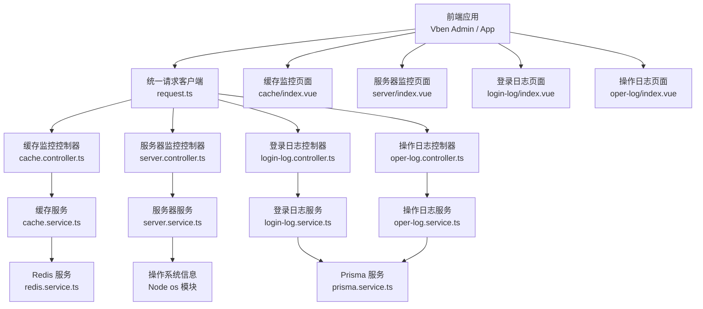
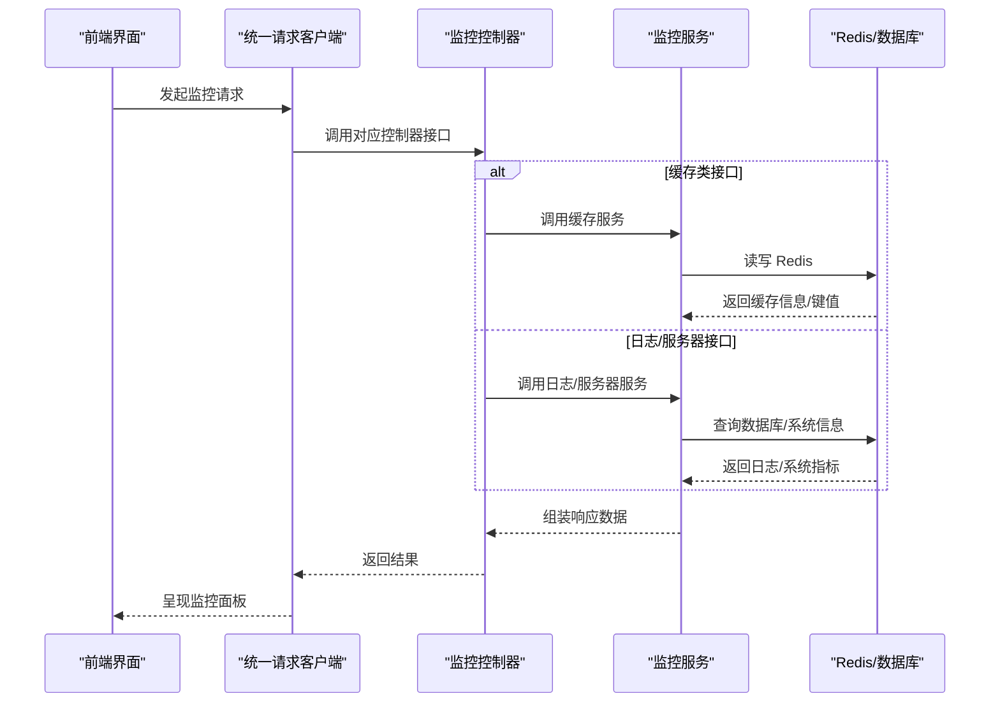
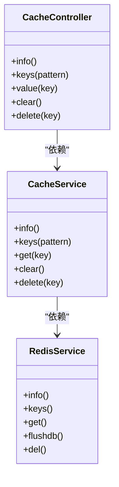
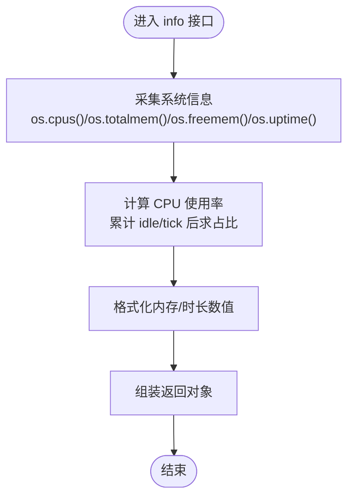
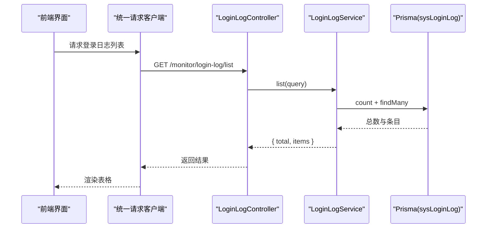
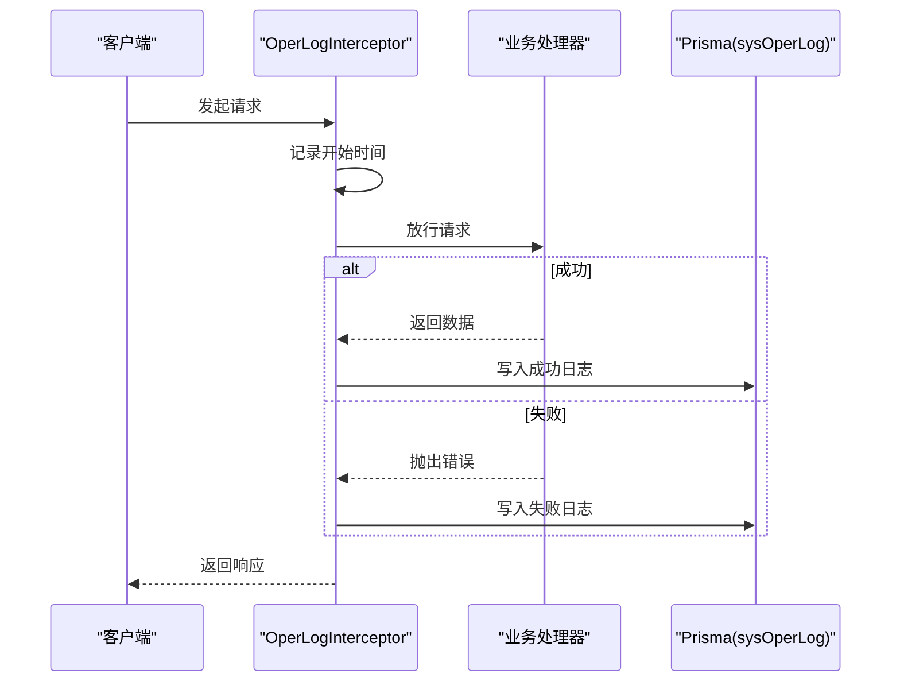
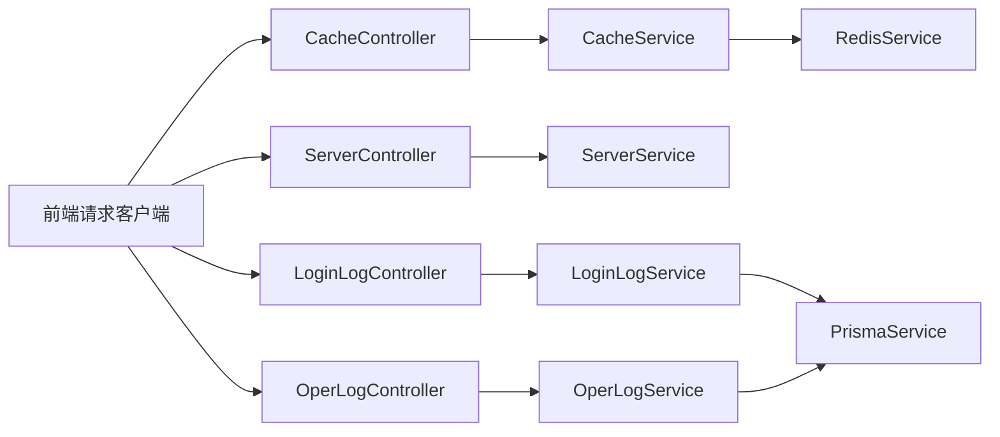

# 性能监控与指标

<cite>
**本文引用的文件**
- [apps/backend/src/modules/monitor/cache/cache.controller.ts](file://apps/backend/src/modules/monitor/cache/cache.controller.ts)
- [apps/backend/src/modules/monitor/cache/cache.service.ts](file://apps/backend/src/modules/monitor/cache/cache.service.ts)
- [apps/backend/src/modules/monitor/server/server.controller.ts](file://apps/backend/src/modules/monitor/server/server.controller.ts)
- [apps/backend/src/modules/monitor/server/server.service.ts](file://apps/backend/src/modules/monitor/server/server.service.ts)
- [apps/backend/src/modules/monitor/login-log/login-log.controller.ts](file://apps/backend/src/modules/monitor/login-log/login-log.controller.ts)
- [apps/backend/src/modules/monitor/login-log/login-log.service.ts](file://apps/backend/src/modules/monitor/login-log/login-log.service.ts)
- [apps/backend/src/modules/monitor/oper-log/oper-log.controller.ts](file://apps/backend/src/modules/monitor/oper-log/oper-log.controller.ts)
- [apps/backend/src/modules/monitor/oper-log/oper-log.service.ts](file://apps/backend/src/modules/monitor/oper-log/oper-log.service.ts)
- [apps/backend/src/common/oper-log.interceptor.ts](file://apps/backend/src/common/oper-log.interceptor.ts)
- [apps/backend/src/cache/redis.service.ts](file://apps/backend/src/cache/redis.service.ts)
- [apps/vben-admin/apps/web-antd/src/api/monitor/cache.ts](file://apps/vben-admin/apps/web-antd/src/api/monitor/cache.ts)
- [apps/vben-admin/apps/web-antd/src/api/monitor/server.ts](file://apps/vben-admin/apps/web-antd/src/api/monitor/server.ts)
- [apps/vben-admin/apps/web-antd/src/api/monitor/login-log.ts](file://apps/vben-admin/apps/web-antd/src/api/monitor/login-log.ts)
- [apps/vben-admin/apps/web-antd/src/api/monitor/oper-log.ts](file://apps/vben-admin/apps/web-antd/src/api/monitor/oper-log.ts)
- [apps/app/src/utils/request.ts](file://apps/app/src/utils/request.ts)
</cite>

## 目录
1. [引言](#引言)
2. [项目结构](#项目结构)
3. [核心组件](#核心组件)
4. [架构总览](#架构总览)
5. [详细组件分析](#详细组件分析)
6. [依赖关系分析](#依赖关系分析)
7. [性能考量](#性能考量)
8. [故障排查指南](#故障排查指南)
9. [结论](#结论)
10. [附录](#附录)

## 引言
本指南围绕本项目的性能监控与指标体系，系统性地介绍如何采集与分析关键性能指标（响应时间、吞吐量、错误率、资源使用率），结合内置的缓存监控、服务器状态监控、登录与操作日志监控等模块，给出可落地的监控实践建议。文档同时覆盖日志分析思路（聚合、异常检测、趋势分析）、实时监控系统的搭建（告警、仪表板、报告）以及性能基准测试与问题诊断流程，并提供可直接参考的配置与使用路径。

## 项目结构
本项目在后端采用 NestJS 模块化设计，监控相关能力集中在 monitor 子模块中；前端通过统一的 API 客户端调用后端监控接口，形成“前端展示—后端采集—数据库存储”的闭环。

图表来源
- [apps/backend/src/modules/monitor/cache/cache.controller.ts:1-50](file://apps/backend/src/modules/monitor/cache/cache.controller.ts#L1-L50)
- [apps/backend/src/modules/monitor/server/server.controller.ts:1-70](file://apps/backend/src/modules/monitor/server/server.controller.ts#L1-L70)
- [apps/backend/src/modules/monitor/login-log/login-log.controller.ts:1-45](file://apps/backend/src/modules/monitor/login-log/login-log.controller.ts#L1-L45)
- [apps/backend/src/modules/monitor/oper-log/oper-log.controller.ts:1-35](file://apps/backend/src/modules/monitor/oper-log/oper-log.controller.ts#L1-L35)
- [apps/backend/src/modules/monitor/cache/cache.service.ts:1-29](file://apps/backend/src/modules/monitor/cache/cache.service.ts#L1-L29)
- [apps/backend/src/modules/monitor/server/server.service.ts:1-4](file://apps/backend/src/modules/monitor/server/server.service.ts#L1-L4)
- [apps/backend/src/modules/monitor/login-log/login-log.service.ts:1-31](file://apps/backend/src/modules/monitor/login-log/login-log.service.ts#L1-L31)
- [apps/backend/src/modules/monitor/oper-log/oper-log.service.ts:1-33](file://apps/backend/src/modules/monitor/oper-log/oper-log.service.ts#L1-L33)
- [apps/backend/src/cache/redis.service.ts:1-128](file://apps/backend/src/cache/redis.service.ts#L1-L128)
- [apps/vben-admin/apps/web-antd/src/api/monitor/cache.ts:1-35](file://apps/vben-admin/apps/web-antd/src/api/monitor/cache.ts#L1-L35)
- [apps/vben-admin/apps/web-antd/src/api/monitor/server.ts:1-33](file://apps/vben-admin/apps/web-antd/src/api/monitor/server.ts#L1-L33)
- [apps/vben-admin/apps/web-antd/src/api/monitor/login-log.ts:1-37](file://apps/vben-admin/apps/web-antd/src/api/monitor/login-log.ts#L1-L37)
- [apps/vben-admin/apps/web-antd/src/api/monitor/oper-log.ts:1-40](file://apps/vben-admin/apps/web-antd/src/api/monitor/oper-log.ts#L1-L40)
- [apps/app/src/utils/request.ts:1-57](file://apps/app/src/utils/request.ts#L1-L57)

章节来源
- [apps/backend/src/modules/monitor/cache/cache.controller.ts:1-50](file://apps/backend/src/modules/monitor/cache/cache.controller.ts#L1-L50)
- [apps/backend/src/modules/monitor/server/server.controller.ts:1-70](file://apps/backend/src/modules/monitor/server/server.controller.ts#L1-L70)
- [apps/backend/src/modules/monitor/login-log/login-log.controller.ts:1-45](file://apps/backend/src/modules/monitor/login-log/login-log.controller.ts#L1-L45)
- [apps/backend/src/modules/monitor/oper-log/oper-log.controller.ts:1-35](file://apps/backend/src/modules/monitor/oper-log/oper-log.controller.ts#L1-L35)
- [apps/vben-admin/apps/web-antd/src/api/monitor/cache.ts:1-35](file://apps/vben-admin/apps/web-antd/src/api/monitor/cache.ts#L1-L35)
- [apps/vben-admin/apps/web-antd/src/api/monitor/server.ts:1-33](file://apps/vben-admin/apps/web-antd/src/api/monitor/server.ts#L1-L33)
- [apps/vben-admin/apps/web-antd/src/api/monitor/login-log.ts:1-37](file://apps/vben-admin/apps/web-antd/src/api/monitor/login-log.ts#L1-L37)
- [apps/vben-admin/apps/web-antd/src/api/monitor/oper-log.ts:1-40](file://apps/vben-admin/apps/web-antd/src/api/monitor/oper-log.ts#L1-L40)
- [apps/app/src/utils/request.ts:1-57](file://apps/app/src/utils/request.ts#L1-L57)

## 核心组件
- 缓存监控：提供 Redis 连接信息、键空间扫描、键值读取、清空与删除等能力，支持运维快速诊断缓存状态与容量。
- 服务器监控：采集 CPU 使用率、内存占用、系统运行时长等基础资源指标，便于评估节点健康度。
- 登录日志监控：记录用户登录行为（含 IP、浏览器、操作系统、状态等），支持分页查询与清理。
- 操作日志监控：通过拦截器自动记录请求耗时、请求参数、响应结果或错误信息，支撑性能与问题追踪。
- 统一请求客户端：为前端提供一致的请求封装，自动注入鉴权头、处理鉴权失效与错误提示。

章节来源
- [apps/backend/src/modules/monitor/cache/cache.controller.ts:1-50](file://apps/backend/src/modules/monitor/cache/cache.controller.ts#L1-L50)
- [apps/backend/src/modules/monitor/server/server.controller.ts:1-70](file://apps/backend/src/modules/monitor/server/server.controller.ts#L1-L70)
- [apps/backend/src/modules/monitor/login-log/login-log.controller.ts:1-45](file://apps/backend/src/modules/monitor/login-log/login-log.controller.ts#L1-L45)
- [apps/backend/src/modules/monitor/oper-log/oper-log.controller.ts:1-35](file://apps/backend/src/modules/monitor/oper-log/oper-log.controller.ts#L1-L35)
- [apps/backend/src/common/oper-log.interceptor.ts:1-111](file://apps/backend/src/common/oper-log.interceptor.ts#L1-L111)
- [apps/app/src/utils/request.ts:1-57](file://apps/app/src/utils/request.ts#L1-L57)

## 架构总览
下图展示了从前端到后端监控接口，再到数据存储的整体链路，以及关键的性能指标采集点。

图表来源
- [apps/backend/src/modules/monitor/cache/cache.controller.ts:1-50](file://apps/backend/src/modules/monitor/cache/cache.controller.ts#L1-L50)
- [apps/backend/src/modules/monitor/cache/cache.service.ts:1-29](file://apps/backend/src/modules/monitor/cache/cache.service.ts#L1-L29)
- [apps/backend/src/modules/monitor/server/server.controller.ts:1-70](file://apps/backend/src/modules/monitor/server/server.controller.ts#L1-L70)
- [apps/backend/src/modules/monitor/login-log/login-log.controller.ts:1-45](file://apps/backend/src/modules/monitor/login-log/login-log.controller.ts#L1-L45)
- [apps/backend/src/modules/monitor/oper-log/oper-log.controller.ts:1-35](file://apps/backend/src/modules/monitor/oper-log/oper-log.controller.ts#L1-L35)
- [apps/backend/src/cache/redis.service.ts:1-128](file://apps/backend/src/cache/redis.service.ts#L1-L128)

## 详细组件分析

### 缓存监控组件
- 控制器职责：提供缓存信息查询、键列表检索、键值读取、清空与删除等接口。
- 服务实现：基于 Redis 服务封装，提供 info、keys、get、flushdb、del 等常用操作。
- 前端对接：通过统一 API 客户端发起请求，渲染缓存面板与操作按钮。

图表来源
- [apps/backend/src/modules/monitor/cache/cache.controller.ts:1-50](file://apps/backend/src/modules/monitor/cache/cache.controller.ts#L1-L50)
- [apps/backend/src/modules/monitor/cache/cache.service.ts:1-29](file://apps/backend/src/modules/monitor/cache/cache.service.ts#L1-L29)
- [apps/backend/src/cache/redis.service.ts:1-128](file://apps/backend/src/cache/redis.service.ts#L1-L128)

章节来源
- [apps/backend/src/modules/monitor/cache/cache.controller.ts:1-50](file://apps/backend/src/modules/monitor/cache/cache.controller.ts#L1-L50)
- [apps/backend/src/modules/monitor/cache/cache.service.ts:1-29](file://apps/backend/src/modules/monitor/cache/cache.service.ts#L1-L29)
- [apps/backend/src/cache/redis.service.ts:1-128](file://apps/backend/src/cache/redis.service.ts#L1-L128)
- [apps/vben-admin/apps/web-antd/src/api/monitor/cache.ts:1-35](file://apps/vben-admin/apps/web-antd/src/api/monitor/cache.ts#L1-L35)

### 服务器监控组件
- 控制器职责：采集系统信息（平台、架构、主机名、CPU 核数、CPU 使用率、内存总量/已用/空闲/占比、运行时长等）。
- 计算逻辑：通过 Node.js os 模块计算 CPU 使用率与内存占比，并格式化字节与运行时长。
- 前端对接：以统一 API 客户端拉取服务器指标，用于可视化展示。

图表来源
- [apps/backend/src/modules/monitor/server/server.controller.ts:1-70](file://apps/backend/src/modules/monitor/server/server.controller.ts#L1-L70)

章节来源
- [apps/backend/src/modules/monitor/server/server.controller.ts:1-70](file://apps/backend/src/modules/monitor/server/server.controller.ts#L1-L70)
- [apps/vben-admin/apps/web-antd/src/api/monitor/server.ts:1-33](file://apps/vben-admin/apps/web-antd/src/api/monitor/server.ts#L1-L33)

### 登录日志监控组件
- 控制器职责：提供登录日志列表查询、详情查询、批量清理等接口。
- 服务实现：基于 Prisma 对 sysLoginLog 表进行分页查询与清理。
- 前端对接：通过统一 API 客户端获取登录日志数据，支持按用户名、状态、时间范围筛选。

图表来源
- [apps/backend/src/modules/monitor/login-log/login-log.controller.ts:1-45](file://apps/backend/src/modules/monitor/login-log/login-log.controller.ts#L1-L45)
- [apps/backend/src/modules/monitor/login-log/login-log.service.ts:1-31](file://apps/backend/src/modules/monitor/login-log/login-log.service.ts#L1-L31)

章节来源
- [apps/backend/src/modules/monitor/login-log/login-log.controller.ts:1-45](file://apps/backend/src/modules/monitor/login-log/login-log.controller.ts#L1-L45)
- [apps/backend/src/modules/monitor/login-log/login-log.service.ts:1-31](file://apps/backend/src/modules/monitor/login-log/login-log.service.ts#L1-L31)
- [apps/vben-admin/apps/web-antd/src/api/monitor/login-log.ts:1-37](file://apps/vben-admin/apps/web-antd/src/api/monitor/login-log.ts#L1-L37)

### 操作日志监控组件
- 拦截器职责：在请求进入与退出时记录耗时、请求/响应信息、错误信息、IP、模块等，自动过滤敏感字段与特定路由。
- 服务实现：提供分页查询、详情查询、批量清理等能力，基于 Prisma 对 sysOperLog 表进行操作。
- 前端对接：通过统一 API 客户端获取操作日志数据，支持按模块、状态、时间范围筛选。

图表来源
- [apps/backend/src/common/oper-log.interceptor.ts:1-111](file://apps/backend/src/common/oper-log.interceptor.ts#L1-L111)
- [apps/backend/src/modules/monitor/oper-log/oper-log.controller.ts:1-35](file://apps/backend/src/modules/monitor/oper-log/oper-log.controller.ts#L1-L35)
- [apps/backend/src/modules/monitor/oper-log/oper-log.service.ts:1-33](file://apps/backend/src/modules/monitor/oper-log/oper-log.service.ts#L1-L33)

章节来源
- [apps/backend/src/common/oper-log.interceptor.ts:1-111](file://apps/backend/src/common/oper-log.interceptor.ts#L1-L111)
- [apps/backend/src/modules/monitor/oper-log/oper-log.controller.ts:1-35](file://apps/backend/src/modules/monitor/oper-log/oper-log.controller.ts#L1-L35)
- [apps/backend/src/modules/monitor/oper-log/oper-log.service.ts:1-33](file://apps/backend/src/modules/monitor/oper-log/oper-log.service.ts#L1-L33)
- [apps/vben-admin/apps/web-antd/src/api/monitor/oper-log.ts:1-40](file://apps/vben-admin/apps/web-antd/src/api/monitor/oper-log.ts#L1-L40)

### 前端请求与权限集成
- 统一请求客户端：自动注入 Authorization 头、处理鉴权失效跳转、网络错误提示。
- 与监控接口协作：前端通过各模块 API 文件调用后端监控接口，完成数据拉取与操作执行。

章节来源
- [apps/app/src/utils/request.ts:1-57](file://apps/app/src/utils/request.ts#L1-L57)
- [apps/vben-admin/apps/web-antd/src/api/monitor/cache.ts:1-35](file://apps/vben-admin/apps/web-antd/src/api/monitor/cache.ts#L1-L35)
- [apps/vben-admin/apps/web-antd/src/api/monitor/server.ts:1-33](file://apps/vben-admin/apps/web-antd/src/api/monitor/server.ts#L1-L33)
- [apps/vben-admin/apps/web-antd/src/api/monitor/login-log.ts:1-37](file://apps/vben-admin/apps/web-antd/src/api/monitor/login-log.ts#L1-L37)
- [apps/vben-admin/apps/web-antd/src/api/monitor/oper-log.ts:1-40](file://apps/vben-admin/apps/web-antd/src/api/monitor/oper-log.ts#L1-L40)

## 依赖关系分析
- 控制器依赖对应服务，服务再依赖底层数据源（Redis 或数据库）。
- 拦截器横切所有请求，对日志写入无侵入，且具备敏感信息脱敏与大小限制。
- 前端通过统一 API 客户端与后端交互，确保鉴权与错误处理一致性。

图表来源
- [apps/backend/src/modules/monitor/cache/cache.controller.ts:1-50](file://apps/backend/src/modules/monitor/cache/cache.controller.ts#L1-L50)
- [apps/backend/src/modules/monitor/cache/cache.service.ts:1-29](file://apps/backend/src/modules/monitor/cache/cache.service.ts#L1-L29)
- [apps/backend/src/modules/monitor/server/server.controller.ts:1-70](file://apps/backend/src/modules/monitor/server/server.controller.ts#L1-L70)
- [apps/backend/src/modules/monitor/server/server.service.ts:1-4](file://apps/backend/src/modules/monitor/server/server.service.ts#L1-L4)
- [apps/backend/src/modules/monitor/login-log/login-log.controller.ts:1-45](file://apps/backend/src/modules/monitor/login-log/login-log.controller.ts#L1-L45)
- [apps/backend/src/modules/monitor/login-log/login-log.service.ts:1-31](file://apps/backend/src/modules/monitor/login-log/login-log.service.ts#L1-L31)
- [apps/backend/src/modules/monitor/oper-log/oper-log.controller.ts:1-35](file://apps/backend/src/modules/monitor/oper-log/oper-log.controller.ts#L1-L35)
- [apps/backend/src/modules/monitor/oper-log/oper-log.service.ts:1-33](file://apps/backend/src/modules/monitor/oper-log/oper-log.service.ts#L1-L33)
- [apps/backend/src/cache/redis.service.ts:1-128](file://apps/backend/src/cache/redis.service.ts#L1-L128)
- [apps/app/src/utils/request.ts:1-57](file://apps/app/src/utils/request.ts#L1-L57)

## 性能考量
- 指标采集粒度
  - 响应时间：由拦截器记录请求耗时，可用于接口级 P50/P90/P99 分布统计。
  - 吞吐量：可通过日志表的请求频率与时间段统计得出 QPS。
  - 错误率：基于操作日志中的状态字段与登录日志中的状态字段进行聚合。
  - 资源使用率：服务器监控提供 CPU/内存使用率，缓存监控提供连接数、命中率等。
- 数据存储与查询
  - 日志表采用分页查询与条件过滤，建议在高频查询字段上建立索引（如创建时间、状态、用户名）。
  - Redis 作为缓存层，注意键空间扫描与大键删除的潜在阻塞风险，建议异步或限频执行。
- 前端展示
  - 将耗时与指标以折线图、柱状图、卡片组件呈现，支持时间维度切换与阈值告警联动。
- 可扩展方向
  - 引入 APM 工具（如 OpenTelemetry、Sentry）进行更细粒度的链路追踪与错误采样。
  - 集成日志分析平台（如 ELK/Fluentd/Loki）进行日志聚合、异常检测与趋势分析。
  - 搭建实时监控看板（如 Grafana）与告警通道（如 Webhook/邮件/IM）。

## 故障排查指南
- 快速定位
  - 查看操作日志：定位异常请求的耗时、参数、错误信息与调用链上下文。
  - 查看登录日志：确认鉴权失败、异常登录尝试与地理信息。
  - 查看缓存状态：确认键空间增长、连接数异常、命中率下降。
- 根因分析
  - 若 CPU/内存持续升高：检查是否存在热点接口或未释放的资源。
  - 若错误率上升：聚焦最近变更的接口与第三方依赖。
  - 若缓存抖动：排查键过期策略、大键与热键分布。
- 解决方案
  - 优化慢查询与热点数据，引入多级缓存与预热。
  - 对外依赖增加熔断与降级策略，设置超时与重试上限。
  - 对日志与指标设置阈值告警，配合自动化扩缩容与回滚机制。

章节来源
- [apps/backend/src/common/oper-log.interceptor.ts:1-111](file://apps/backend/src/common/oper-log.interceptor.ts#L1-L111)
- [apps/backend/src/modules/monitor/login-log/login-log.service.ts:1-31](file://apps/backend/src/modules/monitor/login-log/login-log.service.ts#L1-L31)
- [apps/backend/src/modules/monitor/cache/cache.service.ts:1-29](file://apps/backend/src/modules/monitor/cache/cache.service.ts#L1-L29)

## 结论
本项目已具备完善的监控基础：缓存与服务器状态可观测、登录与操作日志可追溯。在此基础上，建议进一步引入 APM 与日志分析平台，完善实时告警与可视化看板，并通过基准测试与容量规划持续优化系统性能与稳定性。

## 附录
- 监控配置与使用路径参考
  - 缓存监控：控制器与服务分别位于 [apps/backend/src/modules/monitor/cache/cache.controller.ts:1-50](file://apps/backend/src/modules/monitor/cache/cache.controller.ts#L1-L50)、[apps/backend/src/modules/monitor/cache/cache.service.ts:1-29](file://apps/backend/src/modules/monitor/cache/cache.service.ts#L1-L29)，前端 API 定义位于 [apps/vben-admin/apps/web-antd/src/api/monitor/cache.ts:1-35](file://apps/vben-admin/apps/web-antd/src/api/monitor/cache.ts#L1-L35)。
  - 服务器监控：控制器与服务分别位于 [apps/backend/src/modules/monitor/server/server.controller.ts:1-70](file://apps/backend/src/modules/monitor/server/server.controller.ts#L1-L70)、[apps/backend/src/modules/monitor/server/server.service.ts:1-4](file://apps/backend/src/modules/monitor/server/server.service.ts#L1-L4)，前端 API 定义位于 [apps/vben-admin/apps/web-antd/src/api/monitor/server.ts:1-33](file://apps/vben-admin/apps/web-antd/src/api/monitor/server.ts#L1-L33)。
  - 登录日志监控：控制器与服务分别位于 [apps/backend/src/modules/monitor/login-log/login-log.controller.ts:1-45](file://apps/backend/src/modules/monitor/login-log/login-log.controller.ts#L1-L45)、[apps/backend/src/modules/monitor/login-log/login-log.service.ts:1-31](file://apps/backend/src/modules/monitor/login-log/login-log.service.ts#L1-L31)，前端 API 定义位于 [apps/vben-admin/apps/web-antd/src/api/monitor/login-log.ts:1-37](file://apps/vben-admin/apps/web-antd/src/api/monitor/login-log.ts#L1-L37)。
  - 操作日志监控：拦截器与服务分别位于 [apps/backend/src/common/oper-log.interceptor.ts:1-111](file://apps/backend/src/common/oper-log.interceptor.ts#L1-L111)、[apps/backend/src/modules/monitor/oper-log/oper-log.controller.ts:1-35](file://apps/backend/src/modules/monitor/oper-log/oper-log.controller.ts#L1-L35)、[apps/backend/src/modules/monitor/oper-log/oper-log.service.ts:1-33](file://apps/backend/src/modules/monitor/oper-log/oper-log.service.ts#L1-L33)，前端 API 定义位于 [apps/vben-admin/apps/web-antd/src/api/monitor/oper-log.ts:1-40](file://apps/vben-admin/apps/web-antd/src/api/monitor/oper-log.ts#L1-L40)。
  - 统一请求客户端：位于 [apps/app/src/utils/request.ts:1-57](file://apps/app/src/utils/request.ts#L1-L57)。