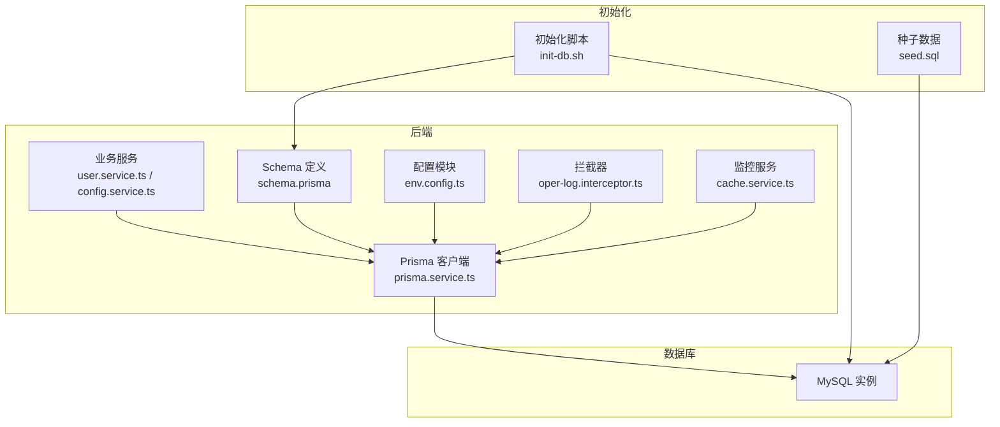
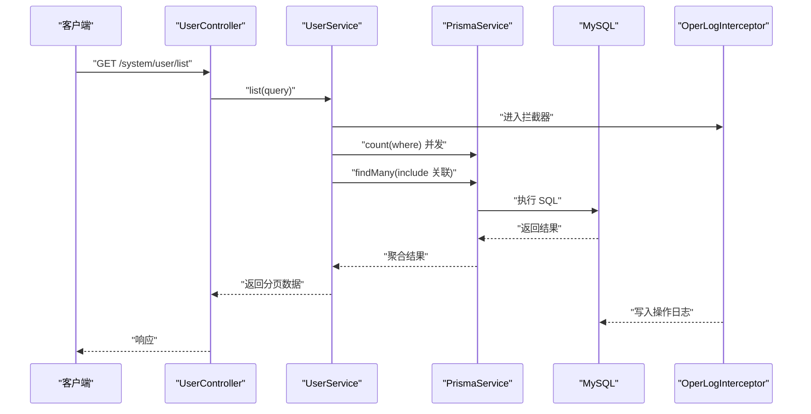
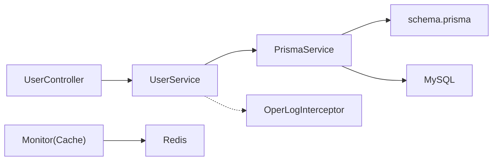

# 数据库性能优化

<cite>
**本文引用的文件**
- [schema.prisma](file://apps/backend/prisma/schema.prisma)
- [prisma.service.ts](file://apps/backend/src/common/prisma.service.ts)
- [env.config.ts](file://apps/backend/src/config/env.config.ts)
- [init-db.sh](file://scripts/init-db.sh)
- [seed.sql](file://scripts/seed.sql)
- [user.service.ts](file://apps/backend/src/modules/system/user/user.service.ts)
- [user.controller.ts](file://apps/backend/src/modules/system/user/user.controller.ts)
- [config.service.ts](file://apps/backend/src/modules/system/config/config.service.ts)
- [cache.service.ts](file://apps/backend/src/modules/monitor/cache/cache.service.ts)
- [oper-log.interceptor.ts](file://apps/backend/src/common/oper-log.interceptor.ts)
</cite>

## 目录
1. [简介](#简介)
2. [项目结构](#项目结构)
3. [核心组件](#核心组件)
4. [架构总览](#架构总览)
5. [详细组件分析](#详细组件分析)
6. [依赖分析](#依赖分析)
7. [性能考量](#性能考量)
8. [故障排查指南](#故障排查指南)
9. [结论](#结论)
10. [附录](#附录)

## 简介
本指南围绕数据库性能优化展开，结合项目中使用的 Prisma ORM 与 MySQL 数据库，系统性地给出查询优化、关系预加载、事务处理、索引设计、执行计划分析、慢查询日志、连接池配置、数据模型优化、备份恢复策略以及监控工具使用等建议。同时提供可落地的最佳实践与参考路径，帮助在实际生产环境中稳定提升数据库性能。

## 项目结构
项目采用前后端分离架构，后端基于 NestJS + Prisma + MySQL，数据库结构由 Prisma Schema 描述，环境变量集中于配置模块，初始化流程通过脚本完成。

**图表来源**
- [prisma.service.ts:1-22](file://apps/backend/src/common/prisma.service.ts#L1-L22)
- [schema.prisma:1-347](file://apps/backend/prisma/schema.prisma#L1-L347)
- [env.config.ts:24-26](file://apps/backend/src/config/env.config.ts#L24-L26)
- [user.service.ts:1-144](file://apps/backend/src/modules/system/user/user.service.ts#L1-L144)
- [config.service.ts:1-56](file://apps/backend/src/modules/system/config/config.service.ts#L1-L56)
- [cache.service.ts:1-29](file://apps/backend/src/modules/monitor/cache/cache.service.ts#L1-L29)
- [oper-log.interceptor.ts:1-35](file://apps/backend/src/common/oper-log.interceptor.ts#L1-L35)
- [init-db.sh:1-85](file://scripts/init-db.sh#L1-L85)
- [seed.sql:1-186](file://scripts/seed.sql#L1-L186)

**章节来源**
- [prisma.service.ts:1-22](file://apps/backend/src/common/prisma.service.ts#L1-L22)
- [schema.prisma:1-347](file://apps/backend/prisma/schema.prisma#L1-L347)
- [env.config.ts:24-26](file://apps/backend/src/config/env.config.ts#L24-L26)
- [init-db.sh:1-85](file://scripts/init-db.sh#L1-L85)
- [seed.sql:1-186](file://scripts/seed.sql#L1-L186)

## 核心组件
- Prisma 客户端与日志级别：通过 PrismaService 统一初始化客户端，并配置错误与警告日志级别，便于定位问题。
- Schema 索引与关系：Schema 中为高频查询字段建立复合索引，如用户表的用户名、部门 ID；菜单表的父级、排序、权限；字典表的类型、值、排序等。
- 业务层查询模式：用户列表查询采用并发计数与分页查询，配合 include 预加载关联部门与角色，减少 N+1 查询风险。
- 配置与缓存：系统配置写入数据库后同步到 Redis，降低数据库压力；监控模块提供缓存信息查询能力。
- 操作日志拦截：统一记录请求耗时、方法、URL、用户等信息，辅助慢查询定位与性能分析。

**章节来源**
- [prisma.service.ts:8-12](file://apps/backend/src/common/prisma.service.ts#L8-L12)
- [schema.prisma:36-38](file://apps/backend/prisma/schema.prisma#L36-L38)
- [user.service.ts:27-36](file://apps/backend/src/modules/system/user/user.service.ts#L27-L36)
- [config.service.ts:41-54](file://apps/backend/src/modules/system/config/config.service.ts#L41-L54)
- [cache.service.ts:8-10](file://apps/backend/src/modules/monitor/cache/cache.service.ts#L8-L10)
- [oper-log.interceptor.ts:15-28](file://apps/backend/src/common/oper-log.interceptor.ts#L15-L28)

## 架构总览
下图展示从控制器到服务、ORM、数据库与监控的整体调用链路与数据流。

**图表来源**
- [user.controller.ts:26-31](file://apps/backend/src/modules/system/user/user.controller.ts#L26-L31)
- [user.service.ts:18-46](file://apps/backend/src/modules/system/user/user.service.ts#L18-L46)
- [prisma.service.ts:1-22](file://apps/backend/src/common/prisma.service.ts#L1-L22)
- [oper-log.interceptor.ts:15-28](file://apps/backend/src/common/oper-log.interceptor.ts#L15-L28)

## 详细组件分析

### Prisma ORM 性能优化
- 查询优化
  - 使用并发计数与分页查询，避免一次性加载大量数据，降低内存与网络压力。
  - 在 where 条件中优先使用高选择性的字段，结合已建立的索引。
  - 对于频繁条件组合，考虑在 Schema 中补充复合索引以覆盖查询模式。
- 关系预加载
  - 使用 include 预加载关联数据，减少 N+1 查询。
  - 对于可选关联，注意 include 的代价，必要时按需加载。
- 事务处理优化
  - 将多步更新封装在单个事务中，保证一致性与原子性。
  - 控制事务范围，避免长时间持有锁导致阻塞。
- 日志与诊断
  - 启用错误与警告日志级别，结合操作日志拦截器记录耗时与异常，快速定位慢查询。

**章节来源**
- [user.service.ts:27-36](file://apps/backend/src/modules/system/user/user.service.ts#L27-L36)
- [prisma.service.ts:8-12](file://apps/backend/src/common/prisma.service.ts#L8-L12)
- [oper-log.interceptor.ts:15-28](file://apps/backend/src/common/oper-log.interceptor.ts#L15-L28)

### MySQL 数据库优化
- 索引设计
  - 用户名、部门 ID、菜单父级、排序、权限、字典类型、值、排序等字段均建立索引，覆盖常见查询场景。
  - 复合索引应遵循“最左前缀原则”，优先放置区分度高的列。
- 查询执行计划分析
  - 使用 EXPLAIN 分析复杂查询的执行路径，关注全表扫描、回表次数与临时表使用。
  - 避免在 WHERE 子句中对索引列进行函数运算或隐式转换。
- 慢查询日志分析
  - 开启慢查询日志，设定阈值，定期分析热点 SQL。
  - 结合业务日志与数据库日志交叉比对，定位性能瓶颈。

**章节来源**
- [schema.prisma:36-38](file://apps/backend/prisma/schema.prisma#L36-L38)
- [schema.prisma:113-116](file://apps/backend/prisma/schema.prisma#L113-L116)
- [schema.prisma:147-150](file://apps/backend/prisma/schema.prisma#L147-L150)
- [schema.prisma:226-229](file://apps/backend/prisma/schema.prisma#L226-L229)
- [schema.prisma:251-254](file://apps/backend/prisma/schema.prisma#L251-L254)

### 数据模型优化
- 表结构设计
  - 使用合适的数据类型，避免过度使用 TEXT，优先使用 VARCHAR 并限定长度。
  - 对于枚举类状态字段，使用 INT 并配合字典表或注释，提高可读性与扩展性。
- 字段类型选择
  - 时间戳统一使用 DATETIME，确保时区与精度一致。
  - JSON 类型用于灵活字段，但需控制层级与大小，避免影响索引效率。
- 约束优化
  - 明确主键、唯一键与外键约束，保持参照完整性。
  - 对频繁更新的列尽量避免强约束带来的额外校验成本。

**章节来源**
- [schema.prisma:13-38](file://apps/backend/prisma/schema.prisma#L13-L38)
- [schema.prisma:93-116](file://apps/backend/prisma/schema.prisma#L93-L116)
- [schema.prisma:133-150](file://apps/backend/prisma/schema.prisma#L133-L150)

### 数据备份与恢复优化
- 增量备份
  - 基于二进制日志进行增量备份，缩短 RPO。
- 压缩策略
  - 备份文件启用压缩，降低存储与传输成本。
- 恢复测试
  - 定期进行恢复演练，验证备份可用性与恢复时间目标。

**章节来源**
- [init-db.sh:24-31](file://scripts/init-db.sh#L24-L31)
- [seed.sql:1-186](file://scripts/seed.sql#L1-L186)

### 数据库连接池优化
- 连接数配置
  - 根据 QPS 与并发请求数设置最大连接数，避免连接池耗尽。
- 连接复用
  - 合理设置连接生命周期与空闲回收策略，减少频繁创建销毁。
- 超时设置
  - 设置合理的连接超时、命令超时与查询超时，防止线程池阻塞。

**章节来源**
- [prisma.service.ts:8-12](file://apps/backend/src/common/prisma.service.ts#L8-L12)
- [env.config.ts:24-26](file://apps/backend/src/config/env.config.ts#L24-L26)

### 数据库监控与运维
- 性能监控
  - 结合数据库性能视图与慢查询日志，持续跟踪热点表与慢 SQL。
- 锁等待分析
  - 识别长事务与锁冲突，优化事务粒度与加锁顺序。
- 资源使用率监控
  - 监控 CPU、内存、磁盘 IO 与连接数，提前预警容量与性能风险。

**章节来源**
- [cache.service.ts:8-10](file://apps/backend/src/modules/monitor/cache/cache.service.ts#L8-L10)
- [oper-log.interceptor.ts:15-28](file://apps/backend/src/common/oper-log.interceptor.ts#L15-L28)

## 依赖分析
下图展示业务服务与 ORM、数据库之间的依赖关系。

**图表来源**
- [user.controller.ts:24-25](file://apps/backend/src/modules/system/user/user.controller.ts#L24-L25)
- [user.service.ts:12-16](file://apps/backend/src/modules/system/user/user.service.ts#L12-L16)
- [prisma.service.ts:1-22](file://apps/backend/src/common/prisma.service.ts#L1-L22)
- [schema.prisma:1-347](file://apps/backend/prisma/schema.prisma#L1-L347)
- [oper-log.interceptor.ts:1-35](file://apps/backend/src/common/oper-log.interceptor.ts#L1-L35)
- [cache.service.ts:1-29](file://apps/backend/src/modules/monitor/cache/cache.service.ts#L1-L29)

**章节来源**
- [user.controller.ts:24-25](file://apps/backend/src/modules/system/user/user.controller.ts#L24-L25)
- [user.service.ts:12-16](file://apps/backend/src/modules/system/user/user.service.ts#L12-L16)
- [prisma.service.ts:1-22](file://apps/backend/src/common/prisma.service.ts#L1-L22)
- [schema.prisma:1-347](file://apps/backend/prisma/schema.prisma#L1-L347)
- [oper-log.interceptor.ts:1-35](file://apps/backend/src/common/oper-log.interceptor.ts#L1-L35)
- [cache.service.ts:1-29](file://apps/backend/src/modules/monitor/cache/cache.service.ts#L1-L29)

## 性能考量
- 查询层面
  - 使用并发计数与分页，避免一次性加载过多数据。
  - 利用已有的索引字段进行过滤，必要时补充复合索引。
- 写入层面
  - 将多步更新放入事务，减少锁竞争与回滚成本。
  - 控制批量写入批次大小，避免长事务占用资源。
- 缓存协同
  - 将热点配置写入 Redis，降低数据库压力；监控缓存命中率与延迟。
- 日志与观测
  - 启用 Prisma 错误/警告日志，结合操作日志拦截器记录耗时，形成闭环。

**章节来源**
- [user.service.ts:27-36](file://apps/backend/src/modules/system/user/user.service.ts#L27-L36)
- [config.service.ts:41-54](file://apps/backend/src/modules/system/config/config.service.ts#L41-L54)
- [prisma.service.ts:8-12](file://apps/backend/src/common/prisma.service.ts#L8-L12)
- [oper-log.interceptor.ts:15-28](file://apps/backend/src/common/oper-log.interceptor.ts#L15-L28)

## 故障排查指南
- 慢查询定位
  - 通过操作日志拦截器记录的耗时与请求上下文，结合数据库慢查询日志进行交叉分析。
- 连接问题
  - 检查 Prisma 客户端日志级别与数据库连接字符串，确认连接池配置合理。
- 数据不一致
  - 核对事务边界与外键约束，避免并发写入导致的数据异常。

**章节来源**
- [oper-log.interceptor.ts:15-28](file://apps/backend/src/common/oper-log.interceptor.ts#L15-L28)
- [prisma.service.ts:8-12](file://apps/backend/src/common/prisma.service.ts#L8-L12)
- [schema.prisma:31-32](file://apps/backend/prisma/schema.prisma#L31-L32)

## 结论
通过合理的索引设计、查询优化、关系预加载、事务处理与连接池配置，结合日志与监控体系，可在保证功能正确性的前提下显著提升数据库性能与稳定性。建议在上线前完成索引与查询路径的评估，在运行期持续观察慢查询与资源使用情况，并根据业务增长动态调整配置。

## 附录
- 初始化与种子数据
  - 使用初始化脚本创建数据库、生成 Prisma 客户端并执行迁移，随后导入种子数据。
- 配置与环境
  - 数据库连接字符串通过环境变量注入，便于在不同环境间切换。

**章节来源**
- [init-db.sh:24-31](file://scripts/init-db.sh#L24-L31)
- [init-db.sh:45-51](file://scripts/init-db.sh#L45-L51)
- [init-db.sh:71-79](file://scripts/init-db.sh#L71-L79)
- [env.config.ts:24-26](file://apps/backend/src/config/env.config.ts#L24-L26)
- [seed.sql:1-186](file://scripts/seed.sql#L1-L186)