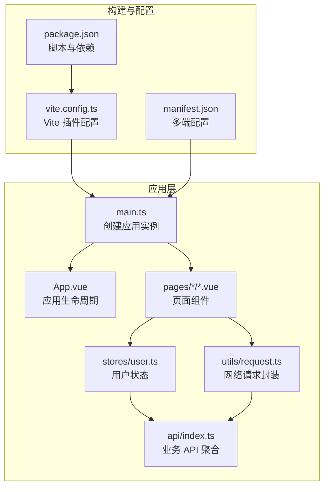
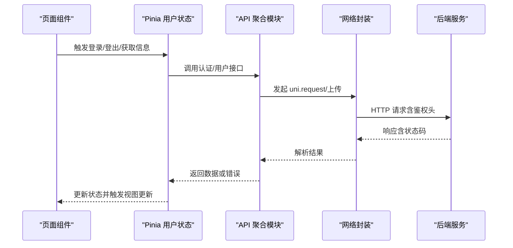
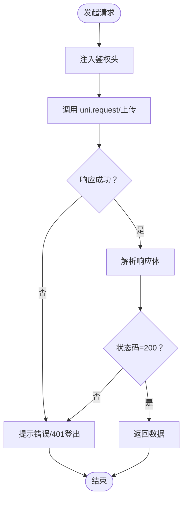
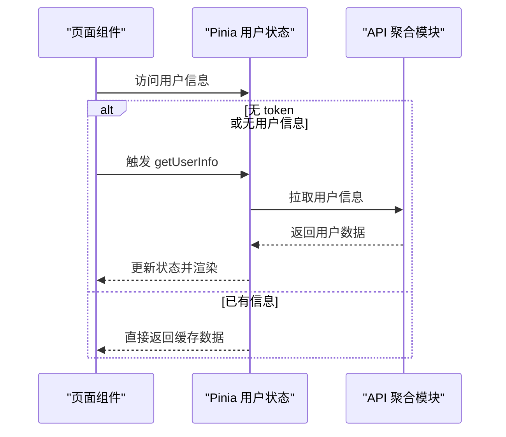
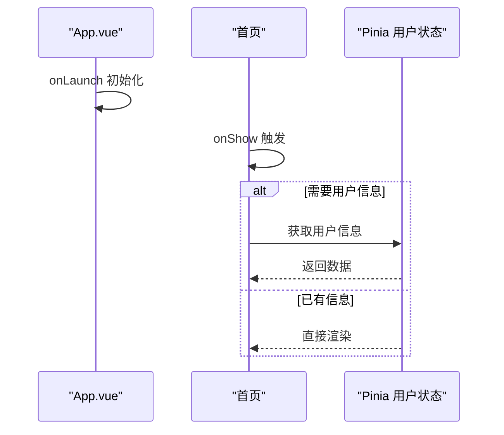
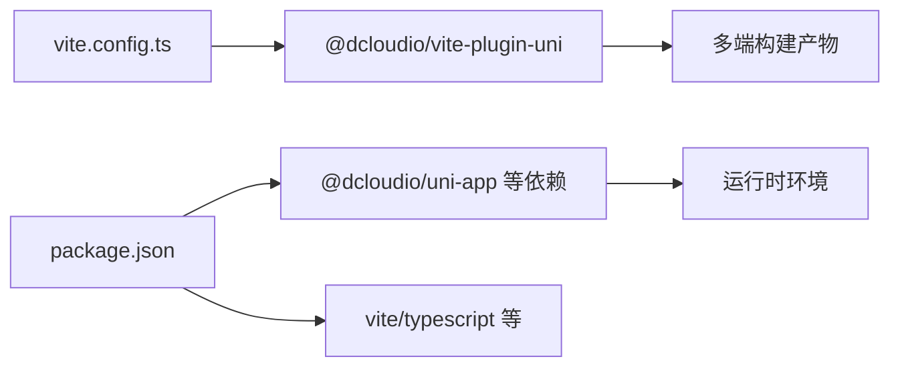

# 移动端性能优化

<cite>
**本文引用的文件**
- [apps/app/vite.config.ts](file://apps/app/vite.config.ts)
- [apps/app/package.json](file://apps/app/package.json)
- [apps/app/src/manifest.json](file://apps/app/src/manifest.json)
- [apps/app/src/main.ts](file://apps/app/src/main.ts)
- [apps/app/src/App.vue](file://apps/app/src/App.vue)
- [apps/app/src/utils/request.ts](file://apps/app/src/utils/request.ts)
- [apps/app/src/api/index.ts](file://apps/app/src/api/index.ts)
- [apps/app/src/stores/user.ts](file://apps/app/src/stores/user.ts)
- [apps/app/src/pages/index/index.vue](file://apps/app/src/pages/index/index.vue)
- [apps/app/src/pages/login/index.vue](file://apps/app/src/pages/login/index.vue)
- [apps/app/src/pages/center/index.vue](file://apps/app/src/pages/center/index.vue)
</cite>

## 目录
1. [简介](#简介)
2. [项目结构](#项目结构)
3. [核心组件](#核心组件)
4. [架构总览](#架构总览)
5. [详细组件分析](#详细组件分析)
6. [依赖分析](#依赖分析)
7. [性能考量](#性能考量)
8. [故障排查指南](#故障排查指南)
9. [结论](#结论)
10. [附录](#附录)

## 简介
本指南面向基于 UniApp/Vite 的移动端应用，系统梳理包体积控制、资源压缩与代码分割、网络请求优化（合并、缓存、离线）、渲染性能优化（懒加载、虚拟列表、动画）、启动性能优化（启动时间、首屏、预加载）、内存管理（泄漏检测、对象池、GC）以及移动端特有优化（WebView 性能、原生能力调用、跨平台兼容）。文档结合仓库现有实现进行分析，并提供可落地的优化建议与测试方法。

## 项目结构
该仓库包含多个应用与后端服务，移动端应用位于 apps/app，采用 Vite + @dcloudio/vite-plugin-uni 进行构建，支持多端（小程序、快应用、App 平台等）。核心入口与运行时在 main.ts 中创建应用实例；页面路由通过 pages.json 配置；网络层封装在 utils/request.ts；状态管理使用 Pinia store；API 调用集中在 api/index.ts。

**图表来源**
- [apps/app/src/main.ts:1-9](file://apps/app/src/main.ts#L1-L9)
- [apps/app/src/App.vue:1-14](file://apps/app/src/App.vue#L1-L14)
- [apps/app/src/stores/user.ts:1-61](file://apps/app/src/stores/user.ts#L1-L61)
- [apps/app/src/utils/request.ts:1-57](file://apps/app/src/utils/request.ts#L1-L57)
- [apps/app/src/api/index.ts:1-37](file://apps/app/src/api/index.ts#L1-L37)
- [apps/app/vite.config.ts:1-8](file://apps/app/vite.config.ts#L1-L8)
- [apps/app/package.json:1-72](file://apps/app/package.json#L1-L72)
- [apps/app/src/manifest.json:1-73](file://apps/app/src/manifest.json#L1-L73)

**章节来源**
- [apps/app/src/main.ts:1-9](file://apps/app/src/main.ts#L1-L9)
- [apps/app/src/App.vue:1-14](file://apps/app/src/App.vue#L1-L14)
- [apps/app/src/stores/user.ts:1-61](file://apps/app/src/stores/user.ts#L1-L61)
- [apps/app/src/utils/request.ts:1-57](file://apps/app/src/utils/request.ts#L1-L57)
- [apps/app/src/api/index.ts:1-37](file://apps/app/src/api/index.ts#L1-L37)
- [apps/app/vite.config.ts:1-8](file://apps/app/vite.config.ts#L1-L8)
- [apps/app/package.json:1-72](file://apps/app/package.json#L1-L72)
- [apps/app/src/manifest.json:1-73](file://apps/app/src/manifest.json#L1-L73)

## 核心组件
- 应用入口与生命周期：在 main.ts 创建 SSR 应用实例；App.vue 处理应用生命周期事件，便于做启动阶段的初始化与埋点。
- 网络层封装：request.ts 统一封装 uni.request/uni.uploadFile，统一鉴权头、错误提示与状态码处理。
- API 聚合：api/index.ts 将认证、用户等接口集中导出，便于按需引入与后续缓存策略设计。
- 状态管理：stores/user.ts 使用 Pinia 管理用户登录态与用户信息，支持登录、登出与信息拉取。
- 页面组件：index/index.vue、login/index.vue、center/index.vue 展示了基础交互与导航流程，为后续性能优化提供场景。

**章节来源**
- [apps/app/src/main.ts:1-9](file://apps/app/src/main.ts#L1-L9)
- [apps/app/src/App.vue:1-14](file://apps/app/src/App.vue#L1-L14)
- [apps/app/src/utils/request.ts:1-57](file://apps/app/src/utils/request.ts#L1-L57)
- [apps/app/src/api/index.ts:1-37](file://apps/app/src/api/index.ts#L1-L37)
- [apps/app/src/stores/user.ts:1-61](file://apps/app/src/stores/user.ts#L1-L61)
- [apps/app/src/pages/index/index.vue:1-158](file://apps/app/src/pages/index/index.vue#L1-L158)
- [apps/app/src/pages/login/index.vue:1-162](file://apps/app/src/pages/login/index.vue#L1-L162)
- [apps/app/src/pages/center/index.vue:1-168](file://apps/app/src/pages/center/index.vue#L1-L168)

## 架构总览
下图展示从页面到网络层再到后端的整体调用链路，以及状态管理在其中的作用位置。

**图表来源**
- [apps/app/src/pages/index/index.vue:32-43](file://apps/app/src/pages/index/index.vue#L32-L43)
- [apps/app/src/pages/login/index.vue:25-71](file://apps/app/src/pages/login/index.vue#L25-L71)
- [apps/app/src/pages/center/index.vue:33-78](file://apps/app/src/pages/center/index.vue#L33-L78)
- [apps/app/src/stores/user.ts:30-60](file://apps/app/src/stores/user.ts#L30-L60)
- [apps/app/src/api/index.ts:5-17](file://apps/app/src/api/index.ts#L5-L17)
- [apps/app/src/utils/request.ts:10-45](file://apps/app/src/utils/request.ts#L10-L45)

## 详细组件分析

### 组件 A 分析：网络请求与缓存策略
- 当前实现要点
  - 统一鉴权头：在请求前从本地存储读取 token 并注入 Authorization。
  - 错误处理：对非 200 状态码统一提示并处理 401 自动登出。
  - 上传流程：封装 uni.uploadFile，解析返回体并校验状态码。
- 优化建议
  - 请求合并：对短时间内多次相同 GET 请求进行合并，避免重复网络开销。
  - 缓存策略：针对只读数据（如用户信息、静态字典），增加本地缓存与过期控制。
  - 离线处理：在网络异常时提供兜底数据与重试机制，提升弱网体验。
  - 预加载：在页面 onShow 之前预取关键数据，减少首屏等待。

**图表来源**
- [apps/app/src/utils/request.ts:10-45](file://apps/app/src/utils/request.ts#L10-L45)
- [apps/app/src/api/index.ts:17-36](file://apps/app/src/api/index.ts#L17-L36)

**章节来源**
- [apps/app/src/utils/request.ts:1-57](file://apps/app/src/utils/request.ts#L1-L57)
- [apps/app/src/api/index.ts:1-37](file://apps/app/src/api/index.ts#L1-L37)

### 组件 B 分析：状态管理与懒加载
- 当前实现要点
  - 登录流程：store 在登录后写入 token 并拉取用户信息。
  - 页面联动：首页与个人中心在 onShow 时检查 token 并补全用户信息。
- 优化建议
  - 组件懒加载：对非首屏组件采用动态 import 实现按需加载。
  - 虚拟列表：长列表场景使用虚拟滚动减少 DOM 数量。
  - 动画优化：避免在动画过程中触发布局抖动，使用 transform/opacity。

**图表来源**
- [apps/app/src/pages/index/index.vue:32-43](file://apps/app/src/pages/index/index.vue#L32-L43)
- [apps/app/src/pages/center/index.vue:33-45](file://apps/app/src/pages/center/index.vue#L33-L45)
- [apps/app/src/stores/user.ts:39-49](file://apps/app/src/stores/user.ts#L39-L49)

**章节来源**
- [apps/app/src/stores/user.ts:1-61](file://apps/app/src/stores/user.ts#L1-L61)
- [apps/app/src/pages/index/index.vue:32-43](file://apps/app/src/pages/index/index.vue#L32-L43)
- [apps/app/src/pages/center/index.vue:33-45](file://apps/app/src/pages/center/index.vue#L33-L45)

### 组件 C 分析：启动与首屏优化
- 当前实现要点
  - App.vue 注册 onLaunch/onShow/onHide 生命周期，适合插入初始化逻辑。
  - 首页在 onShow 时拉取用户信息，避免白屏等待。
- 优化建议
  - 启动时间：移除启动阶段阻塞操作，延迟非关键初始化。
  - 首屏加载：将首屏关键资源内联，其他资源异步加载。
  - 预加载策略：在进入首页前预取必要数据，减少交互延迟。

**图表来源**
- [apps/app/src/App.vue:1-14](file://apps/app/src/App.vue#L1-L14)
- [apps/app/src/pages/index/index.vue:32-43](file://apps/app/src/pages/index/index.vue#L32-L43)
- [apps/app/src/stores/user.ts:39-49](file://apps/app/src/stores/user.ts#L39-L49)

**章节来源**
- [apps/app/src/App.vue:1-14](file://apps/app/src/App.vue#L1-L14)
- [apps/app/src/pages/index/index.vue:32-43](file://apps/app/src/pages/index/index.vue#L32-L43)

### 组件 D 分析：内存管理与对象池
- 当前实现要点
  - 登录态持久化：使用本地存储保存 token，退出时清理。
  - 图片上传：选择图片后上传，完成后释放临时路径。
- 优化建议
  - 内存泄漏检测：避免在组件销毁后仍持有定时器/订阅/闭包引用。
  - 对象池：对频繁创建/销毁的对象（如动画帧、粒子）使用对象池复用。
  - 垃圾回收优化：及时解绑事件监听，避免闭包持有大对象。

**章节来源**
- [apps/app/src/stores/user.ts:51-59](file://apps/app/src/stores/user.ts#L51-L59)
- [apps/app/src/pages/center/index.vue:47-62](file://apps/app/src/pages/center/index.vue#L47-L62)

### 组件 E 分析：移动端特有优化
- WebView 性能：合理设置 manifest 中的编译与模块配置，避免不必要的权限与模块导致包体增大。
- 原生能力调用：优先使用 uni.request/uni.uploadFile 等统一封装，减少跨平台差异带来的性能损耗。
- 跨平台兼容：在 manifest 中针对不同平台（如微信小程序、App）配置差异化参数，确保在各平台表现一致。

**章节来源**
- [apps/app/src/manifest.json:1-73](file://apps/app/src/manifest.json#L1-L73)

## 依赖分析
- 构建工具链：Vite + @dcloudio/vite-plugin-uni，支持多端构建与热更新。
- 运行时依赖：@dcloudio/uni-app 及各端适配包，保证在多端的一致行为。
- 开发依赖：vite、typescript、vue-tsc 等，提供类型检查与构建支持。

**图表来源**
- [apps/app/vite.config.ts:1-8](file://apps/app/vite.config.ts#L1-L8)
- [apps/app/package.json:39-71](file://apps/app/package.json#L39-L71)

**章节来源**
- [apps/app/vite.config.ts:1-8](file://apps/app/vite.config.ts#L1-L8)
- [apps/app/package.json:1-72](file://apps/app/package.json#L1-L72)

## 性能考量
- 包体积控制
  - 使用多端构建脚本，按需打包目标平台，避免冗余模块。
  - 在 manifest 中精简权限与模块，减少安装包大小。
- 资源压缩与代码分割
  - 利用 Vite 的 Tree-shaking 与动态 import 实现按需加载。
  - 将第三方库与业务代码分离，减少首屏 JS 体积。
- 渲染性能
  - 避免在 onShow/onLaunch 中执行耗时任务，将非关键初始化延迟。
  - 长列表使用虚拟滚动，减少节点数量。
  - 动画使用 transform/opacity，避免触发布局与重绘。
- 启动性能
  - 首屏关键资源内联，非关键资源异步加载。
  - 预取关键数据，缩短首次交互等待。
- 内存管理
  - 及时清理定时器、事件监听与闭包引用。
  - 对高频对象使用对象池复用。
- 移动端特性
  - 在 manifest 中针对平台优化 WebView 行为与权限声明。
  - 使用统一封装的原生能力，减少平台差异带来的性能问题。

[本节为通用指导，不直接分析具体文件]

## 故障排查指南
- 网络错误与鉴权
  - 若出现 401，确认 token 是否正确写入与清除，以及页面跳转逻辑是否生效。
  - 对于上传失败，检查返回体解析与状态码判断。
- 页面白屏或卡顿
  - 检查 onShow 中是否存在同步阻塞操作，必要时改为异步并分片执行。
  - 对长列表使用虚拟滚动，减少一次性渲染的节点数。
- 启动慢
  - 在 App.vue 的 onLaunch 中避免执行耗时任务，将初始化逻辑延迟到页面级。
- 内存占用高
  - 检查是否存在未清理的定时器/事件监听，确认组件销毁时的清理逻辑。

**章节来源**
- [apps/app/src/utils/request.ts:10-45](file://apps/app/src/utils/request.ts#L10-L45)
- [apps/app/src/stores/user.ts:51-59](file://apps/app/src/stores/user.ts#L51-L59)
- [apps/app/src/App.vue:1-14](file://apps/app/src/App.vue#L1-L14)

## 结论
通过对仓库现有实现的分析，可以围绕网络层封装、状态管理、页面生命周期与构建配置四个维度开展移动端性能优化。建议优先实施请求合并与缓存、组件懒加载与虚拟列表、启动阶段延迟初始化与首屏资源内联、以及内存泄漏与对象池治理等策略，并结合多端 manifest 配置与统一封装的原生能力，持续监控与迭代性能指标。

[本节为总结，不直接分析具体文件]

## 附录
- 优化案例与测试方法
  - 包体积：对比开启/关闭 Tree-shaking 与按需导入的产物大小，关注各平台差异。
  - 首屏加载：测量从 onLaunch 到首屏渲染完成的时间，记录关键指标（FCP/LCP/TTFB）。
  - 网络请求：统计请求次数、合并率与缓存命中率，评估离线兜底效果。
  - 渲染性能：使用帧率监控工具观察动画与滚动过程中的掉帧情况。
  - 内存：通过内存快照对比优化前后的堆内存占用，定位泄漏点。

[本节为通用指导，不直接分析具体文件]