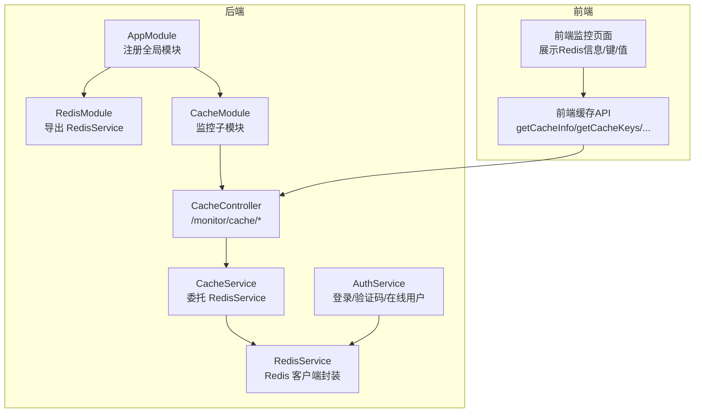
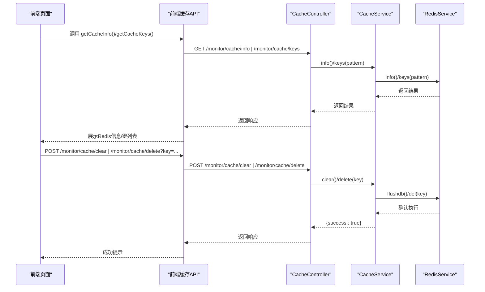
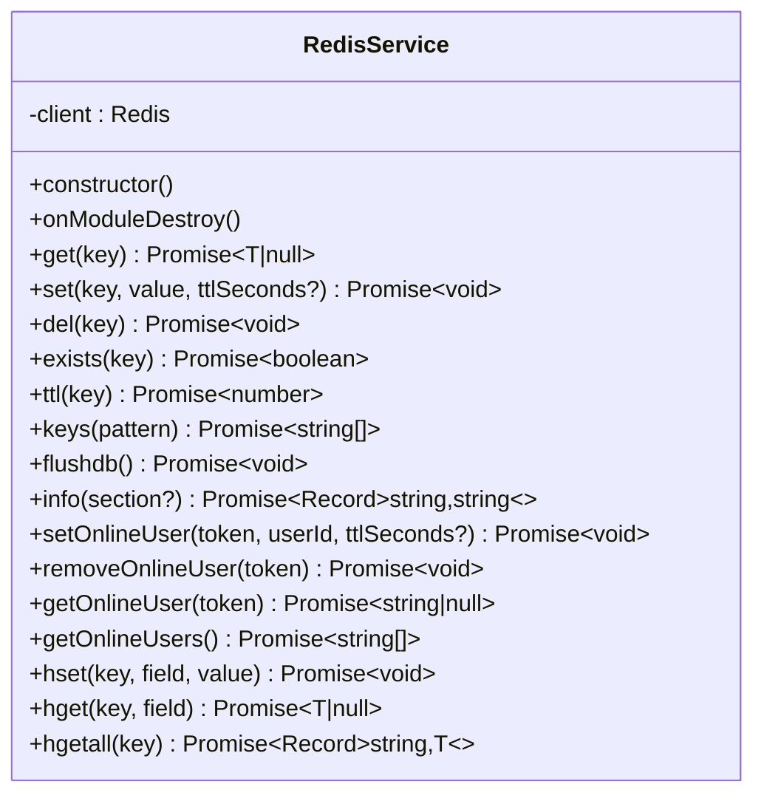
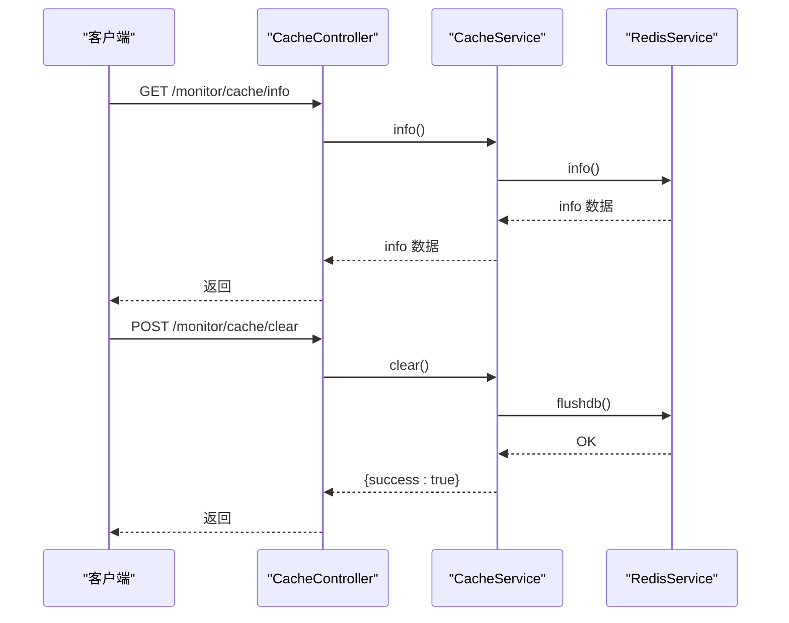
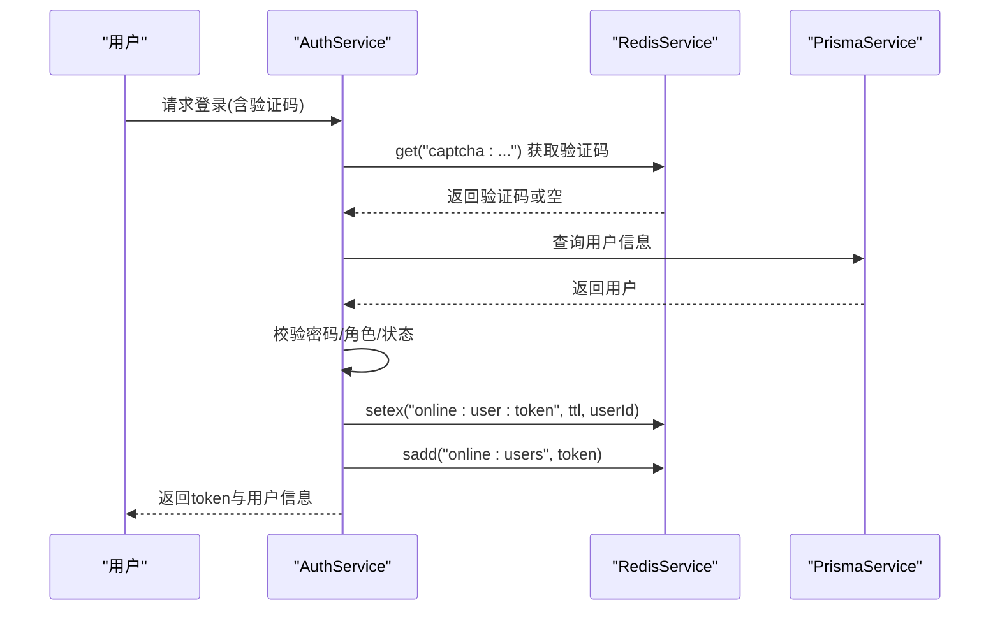
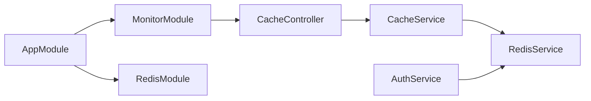

# 缓存策略优化

<cite>
**本文引用的文件**
- [apps/backend/src/cache/redis.module.ts](file://apps/backend/src/cache/redis.module.ts)
- [apps/backend/src/cache/redis.service.ts](file://apps/backend/src/cache/redis.service.ts)
- [apps/backend/src/config/env.config.ts](file://apps/backend/src/config/env.config.ts)
- [apps/backend/src/app.module.ts](file://apps/backend/src/app.module.ts)
- [apps/backend/src/modules/monitor/cache/cache.module.ts](file://apps/backend/src/modules/monitor/cache/cache.module.ts)
- [apps/backend/src/modules/monitor/cache/cache.controller.ts](file://apps/backend/src/modules/monitor/cache/cache.controller.ts)
- [apps/backend/src/modules/monitor/cache/cache.service.ts](file://apps/backend/src/modules/monitor/cache/cache.service.ts)
- [apps/backend/src/auth/auth.service.ts](file://apps/backend/src/auth/auth.service.ts)
- [apps/vben-admin/apps/web-antd/src/api/monitor/cache.ts](file://apps/vben-admin/apps/web-antd/src/api/monitor/cache.ts)
- [apps/vben-admin/apps/web-antd/src/views/monitor/cache/index.vue](file://apps/vben-admin/apps/web-antd/src/views/monitor/cache/index.vue)
</cite>

## 目录
1. [引言](#引言)
2. [项目结构](#项目结构)
3. [核心组件](#核心组件)
4. [架构总览](#架构总览)
5. [详细组件分析](#详细组件分析)
6. [依赖关系分析](#依赖关系分析)
7. [性能考量](#性能考量)
8. [故障排查指南](#故障排查指南)
9. [结论](#结论)
10. [附录](#附录)

## 引言
本指南围绕本仓库中的 Redis 缓存实现，系统性地给出缓存策略优化方案：覆盖热点数据缓存、缓存穿透与雪崩防护、缓存更新策略（Cache-Aside、Write-Through、Write-Behind）、缓存一致性（失效策略、分布式锁、版本控制）、多级缓存（本地缓存/分布式缓存/CDN 协同）、性能监控（命中率、内存、指标分析）、故障处理（降级、故障转移、数据恢复），并提供可落地的配置示例与最佳实践。

## 项目结构
后端采用 NestJS 模块化组织，缓存相关能力集中在 cache 子模块；监控模块提供缓存信息、键查询与清理等运维接口；前端通过 API 组件调用后端监控接口进行可视化管理。

图表来源
- [apps/backend/src/app.module.ts:18-59](file://apps/backend/src/app.module.ts#L18-L59)
- [apps/backend/src/cache/redis.module.ts:1-9](file://apps/backend/src/cache/redis.module.ts#L1-L9)
- [apps/backend/src/cache/redis.service.ts:1-128](file://apps/backend/src/cache/redis.service.ts#L1-L128)
- [apps/backend/src/modules/monitor/cache/cache.module.ts:1-10](file://apps/backend/src/modules/monitor/cache/cache.module.ts#L1-L10)
- [apps/backend/src/modules/monitor/cache/cache.controller.ts:1-50](file://apps/backend/src/modules/monitor/cache/cache.controller.ts#L1-L50)
- [apps/backend/src/modules/monitor/cache/cache.service.ts:1-29](file://apps/backend/src/modules/monitor/cache/cache.service.ts#L1-L29)
- [apps/backend/src/auth/auth.service.ts:20-294](file://apps/backend/src/auth/auth.service.ts#L20-L294)
- [apps/vben-admin/apps/web-antd/src/api/monitor/cache.ts:1-35](file://apps/vben-admin/apps/web-antd/src/api/monitor/cache.ts#L1-L35)
- [apps/vben-admin/apps/web-antd/src/views/monitor/cache/index.vue:1-114](file://apps/vben-admin/apps/web-antd/src/views/monitor/cache/index.vue#L1-L114)

章节来源
- [apps/backend/src/app.module.ts:18-59](file://apps/backend/src/app.module.ts#L18-L59)
- [apps/backend/src/cache/redis.module.ts:1-9](file://apps/backend/src/cache/redis.module.ts#L1-L9)
- [apps/backend/src/cache/redis.service.ts:1-128](file://apps/backend/src/cache/redis.service.ts#L1-L128)
- [apps/backend/src/modules/monitor/cache/cache.module.ts:1-10](file://apps/backend/src/modules/monitor/cache/cache.module.ts#L1-L10)
- [apps/backend/src/modules/monitor/cache/cache.controller.ts:1-50](file://apps/backend/src/modules/monitor/cache/cache.controller.ts#L1-L50)
- [apps/backend/src/modules/monitor/cache/cache.service.ts:1-29](file://apps/backend/src/modules/monitor/cache/cache.service.ts#L1-L29)
- [apps/backend/src/auth/auth.service.ts:20-294](file://apps/backend/src/auth/auth.service.ts#L20-L294)
- [apps/vben-admin/apps/web-antd/src/api/monitor/cache.ts:1-35](file://apps/vben-admin/apps/web-antd/src/api/monitor/cache.ts#L1-L35)
- [apps/vben-admin/apps/web-antd/src/views/monitor/cache/index.vue:1-114](file://apps/vben-admin/apps/web-antd/src/views/monitor/cache/index.vue#L1-L114)

## 核心组件
- RedisModule：全局导出 RedisService，供全系统注入使用。
- RedisService：对 ioredis 的轻量封装，提供基础 CRUD、哈希读写、在线用户集合管理、info/keys/ttl 等运维能力。
- CacheModule/CacheController/CacheService：提供 /monitor/cache/info、/monitor/cache/keys、/monitor/cache/value、/monitor/cache/clear、/monitor/cache/delete 等接口，用于运维侧查看与清理缓存。
- AuthService：在登录、验证码、登出等流程中使用 Redis 进行在线用户与临时验证码存储。
- 前端缓存 API 与页面：通过接口获取 Redis 信息、键列表、键值，并支持一键清空与按键删除。

章节来源
- [apps/backend/src/cache/redis.module.ts:1-9](file://apps/backend/src/cache/redis.module.ts#L1-L9)
- [apps/backend/src/cache/redis.service.ts:1-128](file://apps/backend/src/cache/redis.service.ts#L1-L128)
- [apps/backend/src/modules/monitor/cache/cache.controller.ts:1-50](file://apps/backend/src/modules/monitor/cache/cache.controller.ts#L1-L50)
- [apps/backend/src/modules/monitor/cache/cache.service.ts:1-29](file://apps/backend/src/modules/monitor/cache/cache.service.ts#L1-L29)
- [apps/backend/src/modules/monitor/cache/cache.module.ts:1-10](file://apps/backend/src/modules/monitor/cache/cache.module.ts#L1-L10)
- [apps/backend/src/auth/auth.service.ts:20-294](file://apps/backend/src/auth/auth.service.ts#L20-L294)
- [apps/vben-admin/apps/web-antd/src/api/monitor/cache.ts:1-35](file://apps/vben-admin/apps/web-antd/src/api/monitor/cache.ts#L1-L35)
- [apps/vben-admin/apps/web-antd/src/views/monitor/cache/index.vue:1-114](file://apps/vben-admin/apps/web-antd/src/views/monitor/cache/index.vue#L1-L114)

## 架构总览
下图展示了从请求到缓存的典型路径，以及关键的监控与运维接口：

图表来源
- [apps/backend/src/modules/monitor/cache/cache.controller.ts:1-50](file://apps/backend/src/modules/monitor/cache/cache.controller.ts#L1-L50)
- [apps/backend/src/modules/monitor/cache/cache.service.ts:1-29](file://apps/backend/src/modules/monitor/cache/cache.service.ts#L1-L29)
- [apps/backend/src/cache/redis.service.ts:1-128](file://apps/backend/src/cache/redis.service.ts#L1-L128)
- [apps/vben-admin/apps/web-antd/src/api/monitor/cache.ts:1-35](file://apps/vben-admin/apps/web-antd/src/api/monitor/cache.ts#L1-L35)

## 详细组件分析

### RedisService 设计与职责
- 连接与生命周期：构造函数建立 Redis 连接，模块销毁时退出，事件监听连接状态与错误。
- 基础操作：get/set/del/exists/ttl/keys/flushdb/info。
- 在线用户管理：基于字符串键与集合维护在线会话与令牌集合。
- 哈希辅助：hset/hget/hgetall，统一 JSON 序列化/反序列化。
- 配置来源：通过环境变量注入主机、端口、密码、数据库号。

图表来源
- [apps/backend/src/cache/redis.service.ts:1-128](file://apps/backend/src/cache/redis.service.ts#L1-L128)

章节来源
- [apps/backend/src/cache/redis.service.ts:1-128](file://apps/backend/src/cache/redis.service.ts#L1-L128)
- [apps/backend/src/config/env.config.ts:28-33](file://apps/backend/src/config/env.config.ts#L28-L33)

### CacheController/CacheService：运维接口
- 提供 info/keys/value/clear/delete 接口，权限受 JWT 与权限守卫保护。
- CacheService 将具体操作委托给 RedisService，便于扩展与测试。

图表来源
- [apps/backend/src/modules/monitor/cache/cache.controller.ts:1-50](file://apps/backend/src/modules/monitor/cache/cache.controller.ts#L1-L50)
- [apps/backend/src/modules/monitor/cache/cache.service.ts:1-29](file://apps/backend/src/modules/monitor/cache/cache.service.ts#L1-L29)
- [apps/backend/src/cache/redis.service.ts:1-128](file://apps/backend/src/cache/redis.service.ts#L1-L128)

章节来源
- [apps/backend/src/modules/monitor/cache/cache.controller.ts:1-50](file://apps/backend/src/modules/monitor/cache/cache.controller.ts#L1-L50)
- [apps/backend/src/modules/monitor/cache/cache.service.ts:1-29](file://apps/backend/src/modules/monitor/cache/cache.service.ts#L1-L29)
- [apps/backend/src/cache/redis.service.ts:1-128](file://apps/backend/src/cache/redis.service.ts#L1-L128)

### 登录与验证码流程中的缓存使用
- 验证码：生成图形验证码文本，以带过期时间的键保存至 Redis，校验成功后立即删除。
- 在线用户：登录成功后将 token 映射到用户 ID 并加入在线集合，登出时移除。
- 用户信息/菜单等敏感数据不直接缓存，避免缓存穿透风险。

图表来源
- [apps/backend/src/auth/auth.service.ts:29-89](file://apps/backend/src/auth/auth.service.ts#L29-L89)
- [apps/backend/src/cache/redis.service.ts:83-99](file://apps/backend/src/cache/redis.service.ts#L83-L99)

章节来源
- [apps/backend/src/auth/auth.service.ts:29-89](file://apps/backend/src/auth/auth.service.ts#L29-L89)
- [apps/backend/src/cache/redis.service.ts:83-99](file://apps/backend/src/cache/redis.service.ts#L83-L99)

### 前端缓存监控界面
- 加载 Redis 信息与键列表，支持查看键值详情、按键删除、一键清空。
- 通过统一的缓存 API 访问后端 /monitor/cache/* 接口。

章节来源
- [apps/vben-admin/apps/web-antd/src/views/monitor/cache/index.vue:1-114](file://apps/vben-admin/apps/web-antd/src/views/monitor/cache/index.vue#L1-L114)
- [apps/vben-admin/apps/web-antd/src/api/monitor/cache.ts:1-35](file://apps/vben-admin/apps/web-antd/src/api/monitor/cache.ts#L1-L35)

## 依赖关系分析
- AppModule 导入 ConfigModule、RedisModule、MonitorModule 等，形成全局配置与缓存能力。
- MonitorModule 内部导入 CacheModule，暴露监控接口。
- CacheController 依赖 CacheService，CacheService 依赖 RedisService。
- AuthService 注入 RedisService 用于在线用户与验证码。

图表来源
- [apps/backend/src/app.module.ts:18-59](file://apps/backend/src/app.module.ts#L18-L59)
- [apps/backend/src/modules/monitor/cache/cache.module.ts:1-10](file://apps/backend/src/modules/monitor/cache/cache.module.ts#L1-L10)
- [apps/backend/src/modules/monitor/cache/cache.controller.ts:1-50](file://apps/backend/src/modules/monitor/cache/cache.controller.ts#L1-L50)
- [apps/backend/src/modules/monitor/cache/cache.service.ts:1-29](file://apps/backend/src/modules/monitor/cache/cache.service.ts#L1-L29)
- [apps/backend/src/cache/redis.module.ts:1-9](file://apps/backend/src/cache/redis.module.ts#L1-L9)
- [apps/backend/src/auth/auth.service.ts:20-294](file://apps/backend/src/auth/auth.service.ts#L20-L294)

章节来源
- [apps/backend/src/app.module.ts:18-59](file://apps/backend/src/app.module.ts#L18-L59)
- [apps/backend/src/modules/monitor/cache/cache.module.ts:1-10](file://apps/backend/src/modules/monitor/cache/cache.module.ts#L1-L10)
- [apps/backend/src/modules/monitor/cache/cache.controller.ts:1-50](file://apps/backend/src/modules/monitor/cache/cache.controller.ts#L1-L50)
- [apps/backend/src/modules/monitor/cache/cache.service.ts:1-29](file://apps/backend/src/modules/monitor/cache/cache.service.ts#L1-L29)
- [apps/backend/src/cache/redis.module.ts:1-9](file://apps/backend/src/cache/redis.module.ts#L1-L9)
- [apps/backend/src/auth/auth.service.ts:20-294](file://apps/backend/src/auth/auth.service.ts#L20-L294)

## 性能考量
- 命中率统计：通过 Redis INFO 中 keyspace_hits 与 keyspace_misses 字段计算命中率，结合前端页面展示。
- 内存使用监控：关注 used_memory_human、maxmemory 等指标，结合业务峰值流量设定合理 TTL。
- 过期策略：为验证码、在线会话设置短 TTL，避免长期占用内存。
- 批量操作：批量删除键时优先使用 KEYS/PATTERN 后批量 DEL，减少网络往返。
- 连接池与并发：生产环境建议启用连接池与超时重试，避免阻塞主线程。
- 热点键治理：对热点键增加副本或分片，必要时引入本地缓存（如 LRU）降低延迟。

## 故障排查指南
- 连接失败：检查 REDIS_HOST/REDIS_PORT/REDIS_PASSWORD/REDIS_DB 环境变量是否正确；查看 RedisService 的连接事件日志。
- 权限不足：/monitor/cache/* 接口受 JWT 与权限守卫保护，确认 token 有效且具备 monitor:cache:list 权限。
- 清理误伤：使用 keys/pattern 精准定位键后再执行 delete；清空前先备份或评估影响。
- 在线用户异常：核对 online:user:* 与 online:users 集合是否一致，登出后应移除对应键与成员。
- 命中率低：检查是否存在大量 miss 场景（冷数据、TTL 设置不当、键空间过大），优化缓存预热与淘汰策略。

章节来源
- [apps/backend/src/cache/redis.service.ts:16-23](file://apps/backend/src/cache/redis.service.ts#L16-L23)
- [apps/backend/src/modules/monitor/cache/cache.controller.ts:13-18](file://apps/backend/src/modules/monitor/cache/cache.controller.ts#L13-L18)
- [apps/backend/src/modules/monitor/cache/cache.controller.ts:34-48](file://apps/backend/src/modules/monitor/cache/cache.controller.ts#L34-L48)
- [apps/backend/src/cache/redis.service.ts:83-99](file://apps/backend/src/cache/redis.service.ts#L83-L99)

## 结论
本项目以 Redis 为核心构建了基础缓存能力，并通过监控模块提供了可视化的运维手段。结合登录/验证码/在线用户等场景，体现了缓存的实用价值。后续可在现有基础上进一步完善：引入本地缓存、多级缓存、缓存更新策略与一致性保障机制、更细粒度的性能指标采集与告警，以及针对热点数据的预热与隔离策略。

## 附录

### 缓存使用场景与配置优化
- 热点数据缓存：对高频读取的数据（如字典、配置项、菜单树）设置合理 TTL，并在写入时同步更新缓存。
- 缓存穿透防护：对空值也设置短 TTL；对不存在的键进行布隆过滤或缓存空对象。
- 缓存雪崩预防：为 TTL 墇加随机抖动；热点键增加副本或只读副本；在低峰期提前预热。
- 缓存更新策略
  - Cache-Aside：读取时未命中则从 DB 加载并回填缓存；写入时先更新 DB 再删除缓存。
  - Write-Through：写入时同时更新缓存与 DB，适合强一致场景。
  - Write-Behind：写入时仅更新缓存，异步批量落盘，适合高吞吐写入。
- 缓存一致性
  - 失效策略：写操作后主动删除缓存键，读操作再加载。
  - 分布式锁：对同一键的并发写入加锁，避免脏写。
  - 版本控制：为缓存值附加版本号，读取时比较版本，不一致则回源刷新。
- 多级缓存架构
  - 本地缓存（进程内）：降低跨进程/跨节点访问延迟。
  - 分布式缓存（Redis）：共享与持久化，支持集群与高可用。
  - CDN 缓存：静态资源与热点响应内容缓存于边缘节点。
- 性能监控
  - 命中率：keyspace_hits/(keyspace_hits+keyspace_misses)。
  - 内存：used_memory_human/maxmemory。
  - QPS/延迟：INFO total_commands_processed 与慢查询日志。
- 故障处理
  - 降级：缓存不可用时直连 DB 或返回默认值。
  - 故障转移：Redis 主从切换后自动重连与重试。
  - 数据恢复：定期备份 RDB/AOF，必要时回放或重建缓存。

### 具体配置示例（基于现有实现）
- Redis 连接参数（来自环境配置）
  - REDIS_HOST/REDIS_PORT/REDIS_PASSWORD/REDIS_DB
- TTL 设置建议
  - 验证码：短期 TTL（例如 120 秒）
  - 在线会话：根据业务设置（如 24 小时）
- 键命名规范
  - 在线用户：online:user:{token}
  - 在线集合：online:users
  - 验证码：captcha:{timestamp}
- 运维接口
  - 获取 Redis 信息：GET /monitor/cache/info
  - 列出键：GET /monitor/cache/keys?pattern=*
  - 查看键值：GET /monitor/cache/value?key=...
  - 清空缓存：POST /monitor/cache/clear
  - 删除键：POST /monitor/cache/delete?key=...

章节来源
- [apps/backend/src/config/env.config.ts:28-33](file://apps/backend/src/config/env.config.ts#L28-L33)
- [apps/backend/src/auth/auth.service.ts:109-128](file://apps/backend/src/auth/auth.service.ts#L109-L128)
- [apps/backend/src/cache/redis.service.ts:83-99](file://apps/backend/src/cache/redis.service.ts#L83-L99)
- [apps/backend/src/modules/monitor/cache/cache.controller.ts:13-48](file://apps/backend/src/modules/monitor/cache/cache.controller.ts#L13-L48)
- [apps/vben-admin/apps/web-antd/src/api/monitor/cache.ts:16-34](file://apps/vben-admin/apps/web-antd/src/api/monitor/cache.ts#L16-L34)