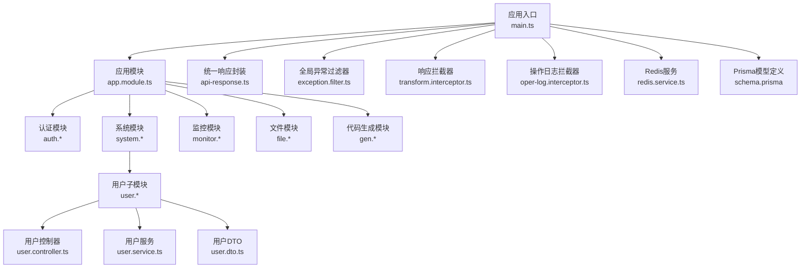
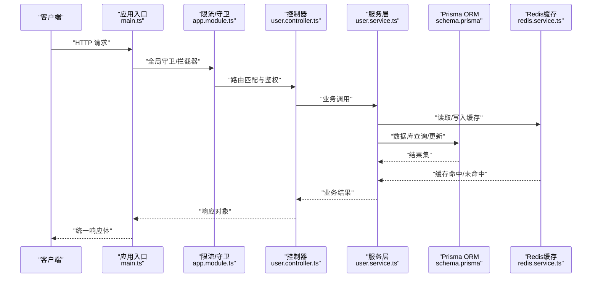
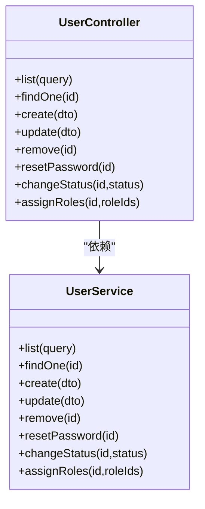
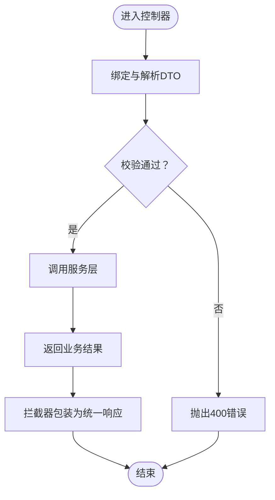
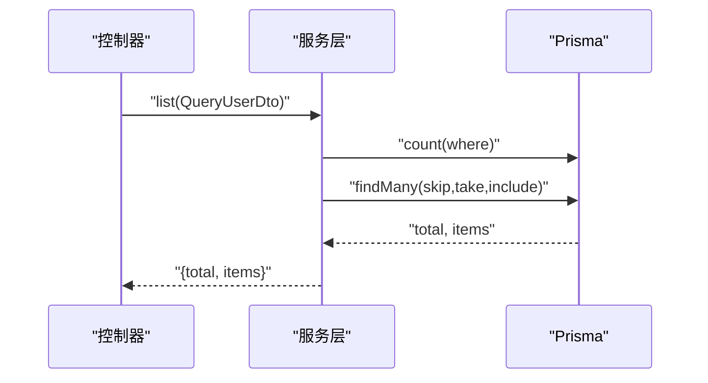
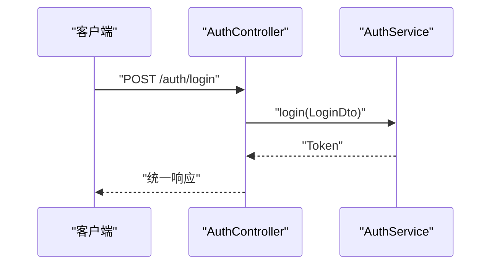
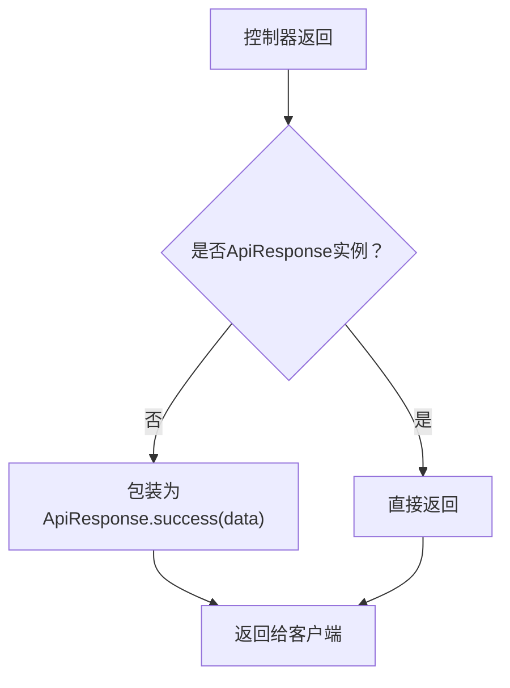
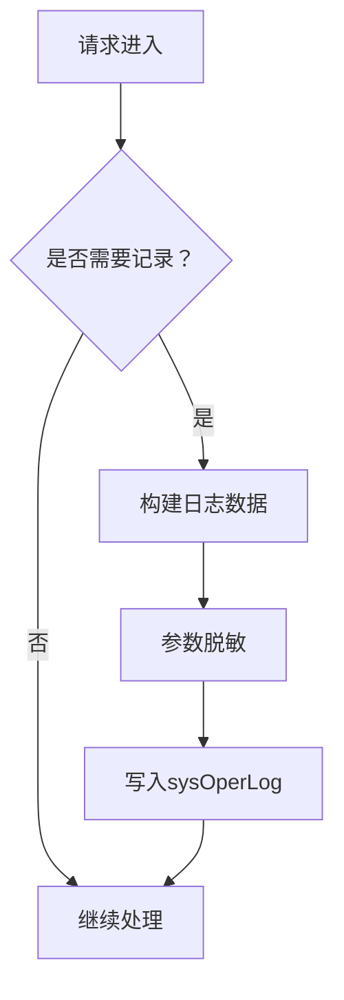
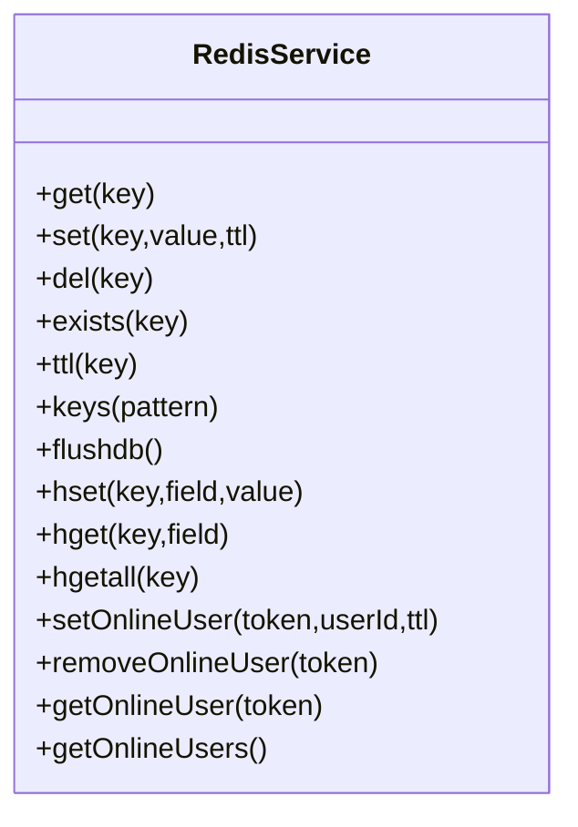
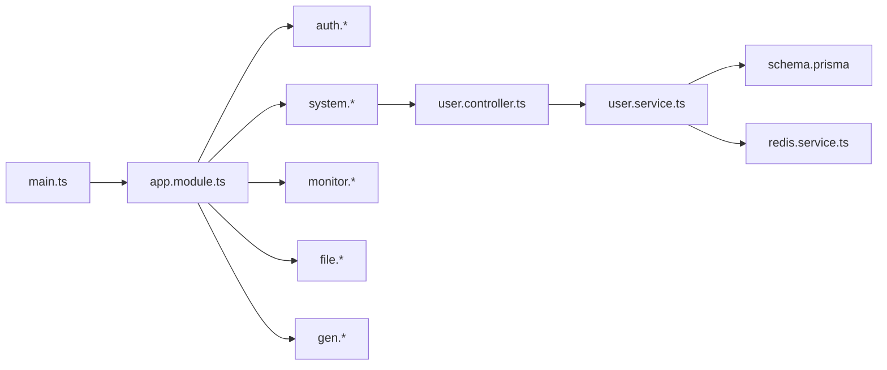

# API扩展

<cite>
**本文引用的文件**
- [apps/backend/src/main.ts](file://apps/backend/src/main.ts)
- [apps/backend/src/app.module.ts](file://apps/backend/src/app.module.ts)
- [apps/backend/src/common/api-response.ts](file://apps/backend/src/common/api-response.ts)
- [apps/backend/src/common/exception.filter.ts](file://apps/backend/src/common/exception.filter.ts)
- [apps/backend/src/common/transform.interceptor.ts](file://apps/backend/src/common/transform.interceptor.ts)
- [apps/backend/src/common/oper-log.interceptor.ts](file://apps/backend/src/common/oper-log.interceptor.ts)
- [apps/backend/src/auth/auth.controller.ts](file://apps/backend/src/auth/auth.controller.ts)
- [apps/backend/src/auth/guards.ts](file://apps/backend/src/auth/guards.ts)
- [apps/backend/src/modules/system/system.module.ts](file://apps/backend/src/modules/system/system.module.ts)
- [apps/backend/src/modules/system/user/user.controller.ts](file://apps/backend/src/modules/system/user/user.controller.ts)
- [apps/backend/src/modules/system/user/user.service.ts](file://apps/backend/src/modules/system/user/user.service.ts)
- [apps/backend/src/modules/system/user/dto/user.dto.ts](file://apps/backend/src/modules/system/user/dto/user.dto.ts)
- [apps/backend/src/cache/redis.service.ts](file://apps/backend/src/cache/redis.service.ts)
- [apps/backend/prisma/schema.prisma](file://apps/backend/prisma/schema.prisma)
</cite>

## 目录
1. [简介](#简介)
2. [项目结构](#项目结构)
3. [核心组件](#核心组件)
4. [架构总览](#架构总览)
5. [详细组件分析](#详细组件分析)
6. [依赖关系分析](#依赖关系分析)
7. [性能考虑](#性能考虑)
8. [故障排查指南](#故障排查指南)
9. [结论](#结论)
10. [附录](#附录)

## 简介
本指南面向需要在现有NestJS后端框架上进行API扩展与演进的开发者，系统讲解RESTful设计原则、新增接口开发流程、既有接口修改策略（版本控制、向后兼容、弃用策略）、API文档生成（Swagger集成）、安全增强（输入校验、SQL注入防护、XSS防护）、性能优化（缓存、分页、批量操作）以及从需求到上线的完整扩展示例。

## 项目结构
后端采用NestJS模块化架构，全局启用跨域、统一前缀、全局校验管道、Swagger文档、静态文件服务、限流守卫、全局异常过滤器与响应拦截器。系统模块按业务域拆分，认证、监控、文件、代码生成等模块独立管理；用户管理模块位于系统模块下，体现清晰的领域划分。

图表来源
- [apps/backend/src/main.ts:1-48](file://apps/backend/src/main.ts#L1-L48)
- [apps/backend/src/app.module.ts:1-59](file://apps/backend/src/app.module.ts#L1-L59)
- [apps/backend/src/modules/system/system.module.ts:1-23](file://apps/backend/src/modules/system/system.module.ts#L1-L23)
- [apps/backend/src/modules/system/user/user.controller.ts:1-89](file://apps/backend/src/modules/system/user/user.controller.ts#L1-L89)
- [apps/backend/src/modules/system/user/user.service.ts:1-144](file://apps/backend/src/modules/system/user/user.service.ts#L1-L144)
- [apps/backend/src/modules/system/user/dto/user.dto.ts:1-131](file://apps/backend/src/modules/system/user/dto/user.dto.ts#L1-L131)
- [apps/backend/src/common/api-response.ts:1-35](file://apps/backend/src/common/api-response.ts#L1-L35)
- [apps/backend/src/common/exception.filter.ts:1-37](file://apps/backend/src/common/exception.filter.ts#L1-L37)
- [apps/backend/src/common/transform.interceptor.ts:1-29](file://apps/backend/src/common/transform.interceptor.ts#L1-L29)
- [apps/backend/src/common/oper-log.interceptor.ts:1-111](file://apps/backend/src/common/oper-log.interceptor.ts#L1-L111)
- [apps/backend/src/cache/redis.service.ts:1-128](file://apps/backend/src/cache/redis.service.ts#L1-L128)
- [apps/backend/prisma/schema.prisma:1-347](file://apps/backend/prisma/schema.prisma#L1-L347)

章节来源
- [apps/backend/src/main.ts:1-48](file://apps/backend/src/main.ts#L1-L48)
- [apps/backend/src/app.module.ts:1-59](file://apps/backend/src/app.module.ts#L1-L59)

## 核心组件
- 统一响应封装：提供标准响应结构与常用状态构造方法，确保前后端契约一致。
- 全局异常过滤器：捕获未处理异常，统一返回错误响应。
- 响应拦截器：自动包装控制器返回值为统一响应结构。
- 操作日志拦截器：记录请求/响应、参数脱敏、耗时与错误信息，便于审计与排障。
- 认证与权限守卫：基于JWT与权限点的访问控制。
- 数据访问层：基于Prisma ORM，支持复杂查询、分页与关联加载。
- 缓存层：基于Redis，提供键值、哈希、集合与在线用户管理能力。

章节来源
- [apps/backend/src/common/api-response.ts:1-35](file://apps/backend/src/common/api-response.ts#L1-L35)
- [apps/backend/src/common/exception.filter.ts:1-37](file://apps/backend/src/common/exception.filter.ts#L1-L37)
- [apps/backend/src/common/transform.interceptor.ts:1-29](file://apps/backend/src/common/transform.interceptor.ts#L1-L29)
- [apps/backend/src/common/oper-log.interceptor.ts:1-111](file://apps/backend/src/common/oper-log.interceptor.ts#L1-L111)
- [apps/backend/src/auth/guards.ts:1-51](file://apps/backend/src/auth/guards.ts#L1-L51)
- [apps/backend/src/modules/system/user/user.service.ts:1-144](file://apps/backend/src/modules/system/user/user.service.ts#L1-L144)
- [apps/backend/src/cache/redis.service.ts:1-128](file://apps/backend/src/cache/redis.service.ts#L1-L128)
- [apps/backend/prisma/schema.prisma:1-347](file://apps/backend/prisma/schema.prisma#L1-L347)

## 架构总览
下图展示了从客户端到控制器、服务层、数据库与缓存的整体调用链路，以及全局中间件对请求的统一处理。

图表来源
- [apps/backend/src/main.ts:1-48](file://apps/backend/src/main.ts#L1-L48)
- [apps/backend/src/app.module.ts:1-59](file://apps/backend/src/app.module.ts#L1-L59)
- [apps/backend/src/modules/system/user/user.controller.ts:1-89](file://apps/backend/src/modules/system/user/user.controller.ts#L1-L89)
- [apps/backend/src/modules/system/user/user.service.ts:1-144](file://apps/backend/src/modules/system/user/user.service.ts#L1-L144)
- [apps/backend/src/cache/redis.service.ts:1-128](file://apps/backend/src/cache/redis.service.ts#L1-L128)
- [apps/backend/prisma/schema.prisma:1-347](file://apps/backend/prisma/schema.prisma#L1-L347)

## 详细组件分析

### 控制器与路由设计
- 资源命名：遵循REST风格，使用名词复数形式；如“system/user”表示用户资源。
- HTTP方法：GET/POST/PUT/DELETE对应列表、创建、更新、删除；路径参数用于唯一标识资源。
- 权限控制：通过装饰器组合JWT与权限守卫，结合RequirePermission声明所需权限点。
- 文档注解：使用@ApiTags与@ApiOperation标注模块与接口摘要，配合Swagger自动生成文档。

图表来源
- [apps/backend/src/modules/system/user/user.controller.ts:1-89](file://apps/backend/src/modules/system/user/user.controller.ts#L1-L89)
- [apps/backend/src/modules/system/user/user.service.ts:1-144](file://apps/backend/src/modules/system/user/user.service.ts#L1-L144)

章节来源
- [apps/backend/src/modules/system/user/user.controller.ts:1-89](file://apps/backend/src/modules/system/user/user.controller.ts#L1-L89)
- [apps/backend/src/auth/guards.ts:1-51](file://apps/backend/src/auth/guards.ts#L1-L51)

### DTO验证与分页
- DTO字段约束：使用class-validator与class-transformer进行类型转换与校验，示例覆盖字符串、可选、整数、最小值等。
- 分页参数：QueryUserDto包含page与limit字段，并设置最小值约束，避免无效分页。
- 自动转换：ValidationPipe开启transform，自动将字符串转为数字并剔除非白名单字段。

图表来源
- [apps/backend/src/modules/system/user/dto/user.dto.ts:1-131](file://apps/backend/src/modules/system/user/dto/user.dto.ts#L1-L131)
- [apps/backend/src/main.ts:17-24](file://apps/backend/src/main.ts#L17-L24)

章节来源
- [apps/backend/src/modules/system/user/dto/user.dto.ts:1-131](file://apps/backend/src/modules/system/user/dto/user.dto.ts#L1-L131)
- [apps/backend/src/main.ts:17-24](file://apps/backend/src/main.ts#L17-L24)

### 服务层与数据访问
- 查询优化：使用Promise.all并发统计总数与分页数据，减少往返。
- 关联加载：查询时包含部门与角色信息，同时屏蔽敏感字段。
- 更新逻辑：密码变更时进行哈希处理；空值清理避免冗余字段写入。
- 删除策略：软删除标记isDelete与deleteTime，保留审计痕迹。

图表来源
- [apps/backend/src/modules/system/user/user.service.ts:18-46](file://apps/backend/src/modules/system/user/user.service.ts#L18-L46)
- [apps/backend/prisma/schema.prisma:13-38](file://apps/backend/prisma/schema.prisma#L13-L38)

章节来源
- [apps/backend/src/modules/system/user/user.service.ts:1-144](file://apps/backend/src/modules/system/user/user.service.ts#L1-L144)
- [apps/backend/prisma/schema.prisma:1-347](file://apps/backend/prisma/schema.prisma#L1-L347)

### 认证与权限
- 公开接口：@Public装饰器允许匿名访问，常用于登录、注册、验证码等场景。
- JWT鉴权：@UseGuards(JwtAuthGuard)保护受控接口。
- 权限守卫：RequirePermission声明所需权限点，细粒度控制资源访问。

图表来源
- [apps/backend/src/auth/auth.controller.ts:1-87](file://apps/backend/src/auth/auth.controller.ts#L1-L87)
- [apps/backend/src/auth/guards.ts:1-51](file://apps/backend/src/auth/guards.ts#L1-L51)

章节来源
- [apps/backend/src/auth/auth.controller.ts:1-87](file://apps/backend/src/auth/auth.controller.ts#L1-L87)
- [apps/backend/src/auth/guards.ts:1-51](file://apps/backend/src/auth/guards.ts#L1-L51)

### 统一响应与异常处理
- 统一响应：ApiResponse提供success/error/unauthorized/forbidden等静态方法，保证前后端一致性。
- 异常过滤：捕获HttpException与未知错误，统一映射为标准响应体。
- 响应拦截：拦截器自动包装控制器返回值，避免重复封装。

图表来源
- [apps/backend/src/common/api-response.ts:1-35](file://apps/backend/src/common/api-response.ts#L1-L35)
- [apps/backend/src/common/transform.interceptor.ts:1-29](file://apps/backend/src/common/transform.interceptor.ts#L1-L29)
- [apps/backend/src/common/exception.filter.ts:1-37](file://apps/backend/src/common/exception.filter.ts#L1-L37)

章节来源
- [apps/backend/src/common/api-response.ts:1-35](file://apps/backend/src/common/api-response.ts#L1-L35)
- [apps/backend/src/common/transform.interceptor.ts:1-29](file://apps/backend/src/common/transform.interceptor.ts#L1-L29)
- [apps/backend/src/common/exception.filter.ts:1-37](file://apps/backend/src/common/exception.filter.ts#L1-L37)

### 操作日志与审计
- 记录内容：用户、模块、方法、URL、请求参数（含脱敏）、响应结果、状态、错误信息、耗时、IP等。
- 脱敏策略：对包含password/token/authorization/captcha等关键词的字段进行掩码。
- 过滤规则：GET请求与特定监控接口不记录，避免噪音。

图表来源
- [apps/backend/src/common/oper-log.interceptor.ts:1-111](file://apps/backend/src/common/oper-log.interceptor.ts#L1-L111)
- [apps/backend/prisma/schema.prisma:232-254](file://apps/backend/prisma/schema.prisma#L232-L254)

章节来源
- [apps/backend/src/common/oper-log.interceptor.ts:1-111](file://apps/backend/src/common/oper-log.interceptor.ts#L1-L111)
- [apps/backend/prisma/schema.prisma:232-254](file://apps/backend/prisma/schema.prisma#L232-L254)

### 缓存策略
- 键值存储：支持字符串或JSON序列化，带TTL过期。
- 在线用户：以token为键维护用户ID，同时维护在线集合，便于广播与统计。
- 哈希存储：支持字段级读写，适合结构化数据缓存。

图表来源
- [apps/backend/src/cache/redis.service.ts:1-128](file://apps/backend/src/cache/redis.service.ts#L1-L128)

章节来源
- [apps/backend/src/cache/redis.service.ts:1-128](file://apps/backend/src/cache/redis.service.ts#L1-L128)

## 依赖关系分析
- 应用入口负责全局配置与文档生成；应用模块集中导入各功能模块并注册全局守卫/过滤器/拦截器。
- 控制器依赖服务层，服务层依赖Prisma与Redis；权限守卫贯穿控制器层，形成清晰的横切关注点。
- 模块化组织降低耦合，便于扩展新的业务域与接口。

图表来源
- [apps/backend/src/main.ts:1-48](file://apps/backend/src/main.ts#L1-L48)
- [apps/backend/src/app.module.ts:1-59](file://apps/backend/src/app.module.ts#L1-L59)
- [apps/backend/src/modules/system/system.module.ts:1-23](file://apps/backend/src/modules/system/system.module.ts#L1-L23)
- [apps/backend/src/modules/system/user/user.controller.ts:1-89](file://apps/backend/src/modules/system/user/user.controller.ts#L1-L89)
- [apps/backend/src/modules/system/user/user.service.ts:1-144](file://apps/backend/src/modules/system/user/user.service.ts#L1-L144)
- [apps/backend/src/cache/redis.service.ts:1-128](file://apps/backend/src/cache/redis.service.ts#L1-L128)
- [apps/backend/prisma/schema.prisma:1-347](file://apps/backend/prisma/schema.prisma#L1-L347)

章节来源
- [apps/backend/src/app.module.ts:1-59](file://apps/backend/src/app.module.ts#L1-L59)
- [apps/backend/src/modules/system/system.module.ts:1-23](file://apps/backend/src/modules/system/system.module.ts#L1-L23)

## 性能考虑
- 缓存优先：热点数据与计算结果使用Redis缓存，合理设置TTL；对在线用户与配置类数据建立专用键空间。
- 分页查询：服务层使用count与limit结合，避免一次性拉取大量数据；索引覆盖常见查询条件。
- 批量操作：在服务层聚合数据库事务，减少网络往返；对批量更新/删除使用原子操作。
- 响应拦截：统一包装减少重复逻辑，提升一致性与可维护性。
- 限流与安全：全局限流守卫防止突发流量；JWT与权限守卫降低越权风险。

## 故障排查指南
- 统一错误响应：异常过滤器将所有未处理异常标准化输出，便于前端统一提示。
- 操作日志：通过sysOperLog记录请求详情与错误信息，结合脱敏后的参数定位问题。
- 参数校验：ValidationPipe开启transform与白名单，确保入参类型正确且字段安全。
- 数据库索引：根据查询条件在Prisma模型中建立索引，避免慢查询。

章节来源
- [apps/backend/src/common/exception.filter.ts:1-37](file://apps/backend/src/common/exception.filter.ts#L1-L37)
- [apps/backend/src/common/oper-log.interceptor.ts:1-111](file://apps/backend/src/common/oper-log.interceptor.ts#L1-L111)
- [apps/backend/src/main.ts:17-24](file://apps/backend/src/main.ts#L17-L24)
- [apps/backend/prisma/schema.prisma:13-38](file://apps/backend/prisma/schema.prisma#L13-L38)

## 结论
本项目以模块化与中间件为核心，提供了完善的API扩展基础：统一响应、异常处理、权限控制、日志审计、缓存与ORM。按照本文的REST设计原则与开发流程，可在保持向后兼容的前提下高效扩展新接口，并通过版本控制与弃用策略平滑演进。

## 附录

### 新增接口开发流程（从需求到上线）
- 需求分析：明确资源、动作、权限点与数据模型。
- 路由定义：选择合适模块与路径，使用HTTP方法与路径参数表达资源语义。
- DTO设计：定义输入/查询/输出DTO，添加校验规则与示例。
- 控制器实现：编写路由处理器，组合JWT与权限守卫，调用服务层。
- 服务层实现：完成业务逻辑、数据访问与缓存策略，注意异常与边界条件。
- 响应与文档：使用统一响应封装与Swagger注解，确保接口文档同步更新。
- 测试与发布：单元测试+集成测试，灰度发布，观察日志与指标。

### 版本控制、向后兼容与弃用策略
- 版本控制：在统一前缀下引入版本号，如“/api/v1”，新接口走新版本，旧接口保持稳定。
- 向后兼容：新增字段采用可选，避免破坏现有客户端；变更字段需提供迁移脚本与兼容逻辑。
- 弃用策略：旧接口保留一定窗口期，期间返回弃用警告头或提示信息，引导客户端迁移。

### API文档生成（Swagger集成）
- 配置：在应用入口初始化Swagger，设置标题、描述、版本与认证方式。
- 注解：在控制器与方法上添加@ApiTags与@ApiOperation，DTO使用@ApiProperty补充示例。
- 访问：启动后可通过/doc.html或/api-docs查看交互式文档。

章节来源
- [apps/backend/src/main.ts:26-35](file://apps/backend/src/main.ts#L26-L35)

### 安全增强（输入验证、SQL注入防护、XSS防护）
- 输入验证：使用class-validator与ValidationPipe，严格限制字段类型与范围。
- SQL注入防护：使用ORM（Prisma）与参数化查询，避免原生SQL拼接。
- XSS防护：服务端渲染与输出编码（如适用），前端对用户输入进行必要转义与白名单校验。

### 性能优化（缓存、分页、批量）
- 缓存：热点数据与计算结果缓存，合理TTL；在线用户与字典类数据建立专用键空间。
- 分页：count与limit分离，索引覆盖查询条件，避免深分页。
- 批量：合并事务、减少往返，批量写入时注意幂等与回滚策略。

### 完整扩展示例（概念性流程）
- 需求：新增“部门管理员”角色与相关接口。
- 设计：定义角色权限点、DTO字段、控制器路由与服务层逻辑。
- 实现：在系统模块下新增子模块，控制器组合权限守卫，服务层调用Prisma与Redis。
- 文档：补充Swagger注解，生成并维护接口文档。
- 发布：灰度验证，观察操作日志与性能指标，逐步全量上线。