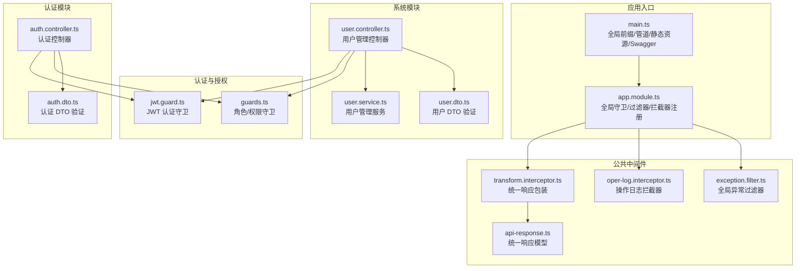
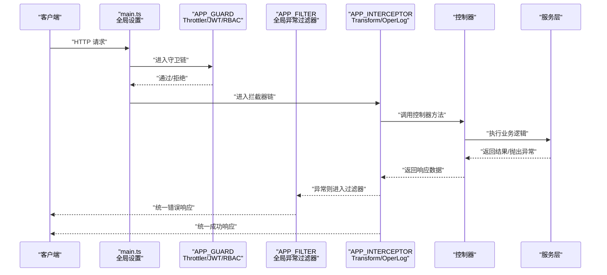
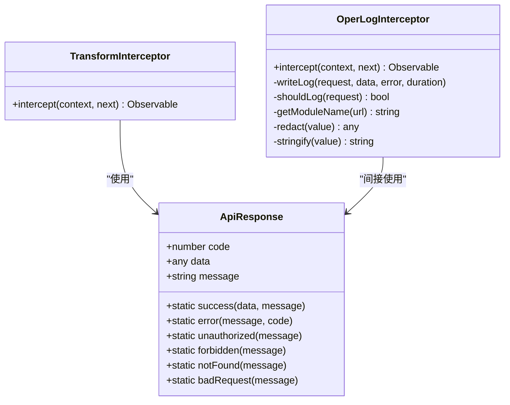
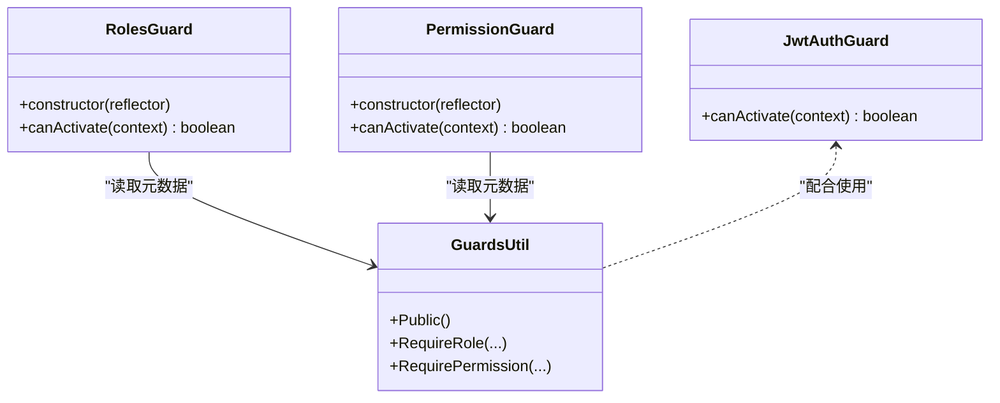
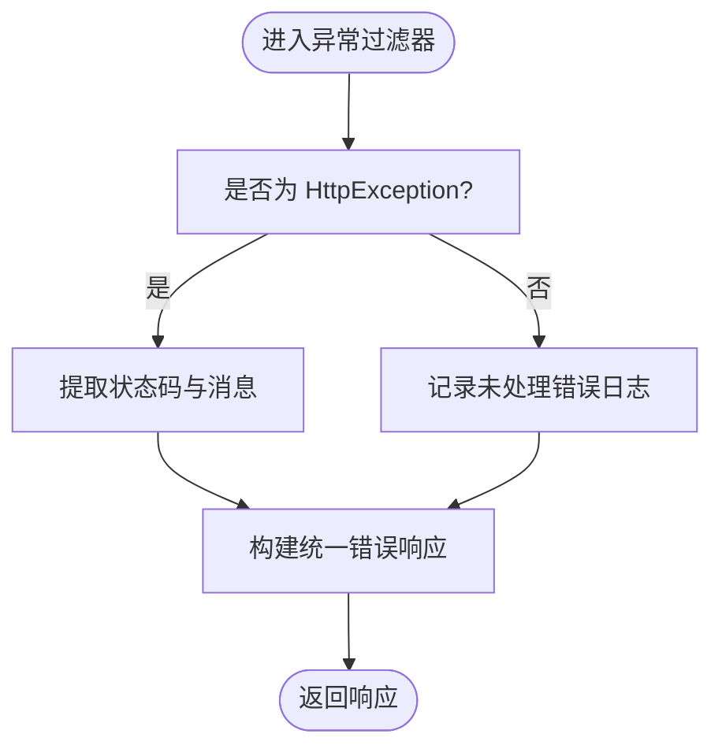
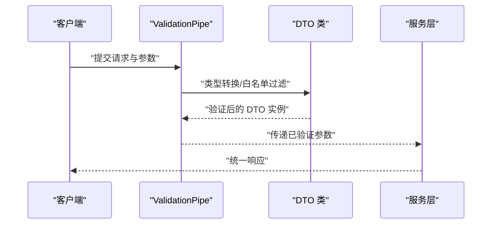
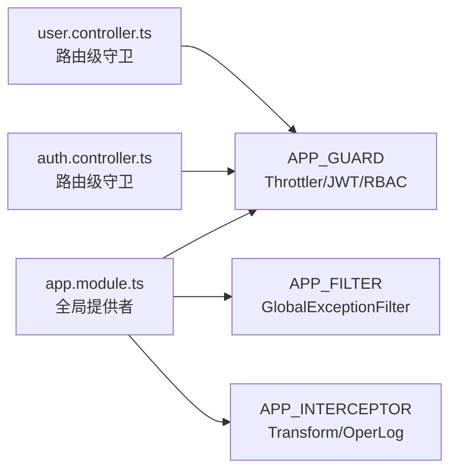
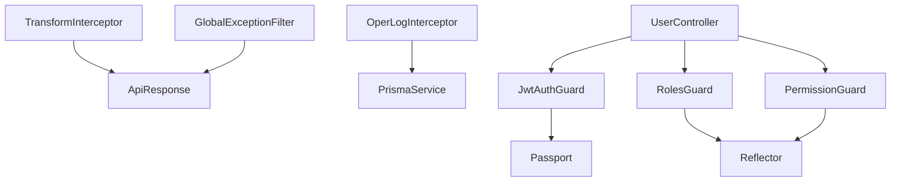

# 中间件开发

<cite>
**本文引用的文件**
- [apps/backend/src/common/oper-log.interceptor.ts](file://apps/backend/src/common/oper-log.interceptor.ts)
- [apps/backend/src/common/transform.interceptor.ts](file://apps/backend/src/common/transform.interceptor.ts)
- [apps/backend/src/common/exception.filter.ts](file://apps/backend/src/common/exception.filter.ts)
- [apps/backend/src/auth/guards.ts](file://apps/backend/src/auth/guards.ts)
- [apps/backend/src/auth/jwt.guard.ts](file://apps/backend/src/auth/jwt.guard.ts)
- [apps/backend/src/common/api-response.ts](file://apps/backend/src/common/api-response.ts)
- [apps/backend/src/app.module.ts](file://apps/backend/src/app.module.ts)
- [apps/backend/src/main.ts](file://apps/backend/src/main.ts)
- [apps/backend/src/modules/system/user/user.controller.ts](file://apps/backend/src/modules/system/user/user.controller.ts)
- [apps/backend/src/modules/system/user/user.service.ts](file://apps/backend/src/modules/system/user/user.service.ts)
- [apps/backend/src/auth/auth.controller.ts](file://apps/backend/src/auth/auth.controller.ts)
- [apps/backend/src/modules/system/user/dto/user.dto.ts](file://apps/backend/src/modules/system/user/dto/user.dto.ts)
- [apps/backend/src/auth/dto/auth.dto.ts](file://apps/backend/src/auth/dto/auth.dto.ts)
- [apps/backend/src/common/common.module.ts](file://apps/backend/src/common/common.module.ts)
</cite>

## 目录
1. [简介](#简介)
2. [项目结构](#项目结构)
3. [核心组件](#核心组件)
4. [架构总览](#架构总览)
5. [详细组件分析](#详细组件分析)
6. [依赖分析](#依赖分析)
7. [性能考虑](#性能考虑)
8. [故障排查指南](#故障排查指南)
9. [结论](#结论)
10. [附录：完整开发示例](#附录完整开发示例)

## 简介
本指南面向需要在 NestJS 应用中开发与使用中间件（拦截器、守卫、过滤器）的工程师，结合仓库中的实际实现，系统讲解以下内容：
- 拦截器：请求拦截、响应转换、异常处理
- 守卫：认证守卫、授权守卫、自定义业务守卫
- 过滤器：全局异常处理、自定义错误响应、日志记录
- 管道：数据验证、类型转换、参数处理
- 注册与配置：全局注册、模块级注册、路由级注册
- 最佳实践：性能优化、错误处理、调试技巧
- 完整示例：从需求分析到代码实现的全流程

## 项目结构
后端采用 NestJS 标准分层与功能模块化组织，中间件相关代码主要分布在以下位置：
- 公共中间件：拦截器、过滤器、统一响应模型
- 认证与授权：守卫、JWT 守卫、控制器
- 系统模块：用户管理控制器与服务，演示守卫与 DTO 验证
- 应用入口：全局注册拦截器、过滤器、守卫、管道与静态资源



图表来源
- [apps/backend/src/main.ts:1-48](file://apps/backend/src/main.ts#L1-L48)
- [apps/backend/src/app.module.ts:1-59](file://apps/backend/src/app.module.ts#L1-L59)
- [apps/backend/src/common/transform.interceptor.ts:1-29](file://apps/backend/src/common/transform.interceptor.ts#L1-L29)
- [apps/backend/src/common/oper-log.interceptor.ts:1-111](file://apps/backend/src/common/oper-log.interceptor.ts#L1-L111)
- [apps/backend/src/common/exception.filter.ts:1-37](file://apps/backend/src/common/exception.filter.ts#L1-L37)
- [apps/backend/src/common/api-response.ts:1-35](file://apps/backend/src/common/api-response.ts#L1-L35)
- [apps/backend/src/auth/jwt.guard.ts:1-5](file://apps/backend/src/auth/jwt.guard.ts#L1-L5)
- [apps/backend/src/auth/guards.ts:1-51](file://apps/backend/src/auth/guards.ts#L1-L51)
- [apps/backend/src/modules/system/user/user.controller.ts:1-89](file://apps/backend/src/modules/system/user/user.controller.ts#L1-L89)
- [apps/backend/src/modules/system/user/user.service.ts:1-144](file://apps/backend/src/modules/system/user/user.service.ts#L1-L144)
- [apps/backend/src/modules/system/user/dto/user.dto.ts:1-131](file://apps/backend/src/modules/system/user/dto/user.dto.ts#L1-L131)
- [apps/backend/src/auth/auth.controller.ts:1-87](file://apps/backend/src/auth/auth.controller.ts#L1-L87)
- [apps/backend/src/auth/dto/auth.dto.ts:1-91](file://apps/backend/src/auth/dto/auth.dto.ts#L1-L91)

章节来源
- [apps/backend/src/main.ts:1-48](file://apps/backend/src/main.ts#L1-L48)
- [apps/backend/src/app.module.ts:1-59](file://apps/backend/src/app.module.ts#L1-L59)

## 核心组件
本项目的核心中间件组件如下：
- 统一响应拦截器：将控制器返回值包装为统一响应格式
- 操作日志拦截器：记录请求/响应、错误、耗时、IP 等信息
- 全局异常过滤器：捕获未处理异常，输出统一错误响应并记录日志
- 统一响应模型：定义 code、data、message 的标准结构
- 角色/权限守卫：基于元数据的角色与权限校验
- JWT 认证守卫：基于 Passport 的 JWT 认证
- 全局管道：开启自动类型转换、白名单与非白名单禁止

章节来源
- [apps/backend/src/common/transform.interceptor.ts:1-29](file://apps/backend/src/common/transform.interceptor.ts#L1-L29)
- [apps/backend/src/common/oper-log.interceptor.ts:1-111](file://apps/backend/src/common/oper-log.interceptor.ts#L1-L111)
- [apps/backend/src/common/exception.filter.ts:1-37](file://apps/backend/src/common/exception.filter.ts#L1-L37)
- [apps/backend/src/common/api-response.ts:1-35](file://apps/backend/src/common/api-response.ts#L1-L35)
- [apps/backend/src/auth/guards.ts:1-51](file://apps/backend/src/auth/guards.ts#L1-L51)
- [apps/backend/src/auth/jwt.guard.ts:1-5](file://apps/backend/src/auth/jwt.guard.ts#L1-L5)
- [apps/backend/src/main.ts:17-24](file://apps/backend/src/main.ts#L17-L24)

## 架构总览
下图展示了请求在应用中的流转路径，以及中间件在其中的位置与职责。



图表来源
- [apps/backend/src/main.ts:17-24](file://apps/backend/src/main.ts#L17-L24)
- [apps/backend/src/app.module.ts:39-56](file://apps/backend/src/app.module.ts#L39-L56)
- [apps/backend/src/common/transform.interceptor.ts:15-28](file://apps/backend/src/common/transform.interceptor.ts#L15-L28)
- [apps/backend/src/common/oper-log.interceptor.ts:15-28](file://apps/backend/src/common/oper-log.interceptor.ts#L15-L28)
- [apps/backend/src/common/exception.filter.ts:16-36](file://apps/backend/src/common/exception.filter.ts#L16-L36)

## 详细组件分析

### 拦截器：请求拦截、响应转换与异常处理
- 响应转换拦截器：对控制器返回值进行统一包装；若已是统一响应对象则直接透传
- 操作日志拦截器：在请求进入后记录开始时间；在成功时写入成功日志，在异常时写入错误日志并重新抛出异常；支持敏感字段脱敏与超长字段截断；支持按规则过滤不记录的日志
- 统一响应模型：提供 success/error/unauthorized/forbidden/notFound/badRequest 等静态方法，便于构造一致的响应体



图表来源
- [apps/backend/src/common/transform.interceptor.ts:11-29](file://apps/backend/src/common/transform.interceptor.ts#L11-L29)
- [apps/backend/src/common/oper-log.interceptor.ts:12-111](file://apps/backend/src/common/oper-log.interceptor.ts#L12-L111)
- [apps/backend/src/common/api-response.ts:1-35](file://apps/backend/src/common/api-response.ts#L1-L35)

章节来源
- [apps/backend/src/common/transform.interceptor.ts:11-29](file://apps/backend/src/common/transform.interceptor.ts#L11-L29)
- [apps/backend/src/common/oper-log.interceptor.ts:12-111](file://apps/backend/src/common/oper-log.interceptor.ts#L12-L111)
- [apps/backend/src/common/api-response.ts:1-35](file://apps/backend/src/common/api-response.ts#L1-L35)

### 守卫：认证守卫、授权守卫与自定义业务守卫
- JWT 认证守卫：基于 Passport 的 JWT 守卫，用于保护需要登录的路由
- 角色守卫：读取控制器/类上的角色元数据，校验当前用户是否包含所需角色
- 权限守卫：读取控制器/类上的权限元数据，校验当前用户是否具备所有必需权限
- 公共接口注解：通过装饰器标记接口为“无需登录”，绕过认证守卫



图表来源
- [apps/backend/src/auth/jwt.guard.ts:1-5](file://apps/backend/src/auth/jwt.guard.ts#L1-L5)
- [apps/backend/src/auth/guards.ts:19-51](file://apps/backend/src/auth/guards.ts#L19-L51)

章节来源
- [apps/backend/src/auth/jwt.guard.ts:1-5](file://apps/backend/src/auth/jwt.guard.ts#L1-L5)
- [apps/backend/src/auth/guards.ts:1-51](file://apps/backend/src/auth/guards.ts#L1-L51)

### 过滤器：全局异常处理、自定义错误响应与日志记录
- 全局异常过滤器：捕获所有未处理异常；对 HttpException 提取状态码与消息；对 Error 输出内部服务器错误并记录日志；最终以统一响应模型返回错误信息



图表来源
- [apps/backend/src/common/exception.filter.ts:16-36](file://apps/backend/src/common/exception.filter.ts#L16-L36)
- [apps/backend/src/common/api-response.ts:16-34](file://apps/backend/src/common/api-response.ts#L16-L34)

章节来源
- [apps/backend/src/common/exception.filter.ts:1-37](file://apps/backend/src/common/exception.filter.ts#L1-L37)
- [apps/backend/src/common/api-response.ts:1-35](file://apps/backend/src/common/api-response.ts#L1-L35)

### 管道：数据验证、类型转换与参数处理
- 全局 ValidationPipe：开启 transform、whitelist、forbidNonWhitelisted；自动将查询/路径/主体参数转换为 DTO 类型，并移除非白名单字段
- DTO 验证：用户与认证模块广泛使用 class-validator 与 class-transformer 对输入进行约束与类型转换



图表来源
- [apps/backend/src/main.ts:17-24](file://apps/backend/src/main.ts#L17-L24)
- [apps/backend/src/modules/system/user/dto/user.dto.ts:106-130](file://apps/backend/src/modules/system/user/dto/user.dto.ts#L106-L130)
- [apps/backend/src/auth/dto/auth.dto.ts:43-63](file://apps/backend/src/auth/dto/auth.dto.ts#L43-L63)

章节来源
- [apps/backend/src/main.ts:17-24](file://apps/backend/src/main.ts#L17-L24)
- [apps/backend/src/modules/system/user/dto/user.dto.ts:1-131](file://apps/backend/src/modules/system/user/dto/user.dto.ts#L1-L131)
- [apps/backend/src/auth/dto/auth.dto.ts:1-91](file://apps/backend/src/auth/dto/auth.dto.ts#L1-L91)

### 注册与配置：全局、模块级与路由级
- 全局注册：在应用模块中通过 APP_GUARD、APP_FILTER、APP_INTERCEPTOR 提供者注册守卫、过滤器与拦截器
- 模块级注册：CommonModule 导出 PrismaService，供其他模块使用
- 路由级注册：控制器上使用 @UseGuards、@UseInterceptors、@UseFilters 等装饰器对特定路由生效



图表来源
- [apps/backend/src/app.module.ts:39-56](file://apps/backend/src/app.module.ts#L39-L56)
- [apps/backend/src/common/common.module.ts:1-9](file://apps/backend/src/common/common.module.ts#L1-L9)
- [apps/backend/src/modules/system/user/user.controller.ts:20-22](file://apps/backend/src/modules/system/user/user.controller.ts#L20-L22)
- [apps/backend/src/auth/auth.controller.ts:13-19](file://apps/backend/src/auth/auth.controller.ts#L13-L19)

章节来源
- [apps/backend/src/app.module.ts:1-59](file://apps/backend/src/app.module.ts#L1-L59)
- [apps/backend/src/common/common.module.ts:1-9](file://apps/backend/src/common/common.module.ts#L1-L9)
- [apps/backend/src/modules/system/user/user.controller.ts:1-89](file://apps/backend/src/modules/system/user/user.controller.ts#L1-L89)
- [apps/backend/src/auth/auth.controller.ts:1-87](file://apps/backend/src/auth/auth.controller.ts#L1-L87)

## 依赖分析
- 拦截器依赖 PrismaService 进行日志持久化，但写入日志失败不应影响主业务流程
- 过滤器依赖统一响应模型，确保错误输出一致性
- 守卫依赖 Reflector 读取元数据，依赖用户上下文进行校验
- 控制器依赖守卫与 DTO 验证，服务层负责业务逻辑与数据访问



图表来源
- [apps/backend/src/common/transform.interceptor.ts:11-29](file://apps/backend/src/common/transform.interceptor.ts#L11-L29)
- [apps/backend/src/common/oper-log.interceptor.ts:13-13](file://apps/backend/src/common/oper-log.interceptor.ts#L13-L13)
- [apps/backend/src/common/exception.filter.ts:14-14](file://apps/backend/src/common/exception.filter.ts#L14-L14)
- [apps/backend/src/auth/jwt.guard.ts:2-2](file://apps/backend/src/auth/jwt.guard.ts#L2-L2)
- [apps/backend/src/auth/guards.ts:21-21](file://apps/backend/src/auth/guards.ts#L21-L21)
- [apps/backend/src/auth/guards.ts:38-38](file://apps/backend/src/auth/guards.ts#L38-L38)
- [apps/backend/src/modules/system/user/user.controller.ts:17-18](file://apps/backend/src/modules/system/user/user.controller.ts#L17-L18)

章节来源
- [apps/backend/src/common/oper-log.interceptor.ts:12-111](file://apps/backend/src/common/oper-log.interceptor.ts#L12-L111)
- [apps/backend/src/common/exception.filter.ts:1-37](file://apps/backend/src/common/exception.filter.ts#L1-L37)
- [apps/backend/src/auth/guards.ts:1-51](file://apps/backend/src/auth/guards.ts#L1-L51)
- [apps/backend/src/modules/system/user/user.controller.ts:1-89](file://apps/backend/src/modules/system/user/user.controller.ts#L1-L89)

## 性能考虑
- 拦截器与过滤器应避免阻塞主线程：日志写入建议异步或降级处理，确保不影响请求响应
- 敏感字段脱敏与 JSON 截断：减少日志体积与泄露风险
- 全局管道开启 transform 会带来一定开销，建议仅在必要时启用并保持 DTO 设计清晰
- 操作日志拦截器对 GET 请求默认不记录，可降低日志量与数据库压力

## 故障排查指南
- 统一响应格式不符：检查拦截器是否正确包裹返回值，确认控制器未手动返回非统一响应
- 异常未被捕获：确认全局过滤器已注册，且未被局部过滤器覆盖
- 守卫未生效：检查控制器是否正确使用守卫装饰器，元数据是否正确设置
- 日志未写入：检查 OperLogInterceptor 的过滤条件与 PrismaService 可用性
- DTO 参数异常：确认 ValidationPipe 已全局启用，DTO 字段注解是否正确

章节来源
- [apps/backend/src/common/transform.interceptor.ts:15-28](file://apps/backend/src/common/transform.interceptor.ts#L15-L28)
- [apps/backend/src/common/exception.filter.ts:16-36](file://apps/backend/src/common/exception.filter.ts#L16-L36)
- [apps/backend/src/auth/guards.ts:23-33](file://apps/backend/src/auth/guards.ts#L23-L33)
- [apps/backend/src/common/oper-log.interceptor.ts:30-61](file://apps/backend/src/common/oper-log.interceptor.ts#L30-L61)
- [apps/backend/src/main.ts:17-24](file://apps/backend/src/main.ts#L17-L24)

## 结论
本项目通过全局与路由级中间件的组合，实现了统一响应、操作日志、异常处理、认证授权与数据验证等横切关注点。遵循本文档的开发规范与最佳实践，可在保证性能与可观测性的前提下，快速扩展新的中间件能力。

## 附录：完整开发示例
以下示例展示从需求到实现的全流程，涵盖拦截器、守卫、过滤器与管道的协同工作。

- 需求分析
  - 所有响应需统一为 { code, data, message } 格式
  - 写入操作日志，包含用户、URL、方法、请求参数、响应结果、错误信息、耗时、IP
  - 未处理异常统一返回错误响应并记录日志
  - 用户管理接口需登录与权限校验
  - 输入参数需自动类型转换与白名单过滤

- 实现步骤
  - 在应用模块中注册全局拦截器、过滤器与守卫
    - [apps/backend/src/app.module.ts:39-56](file://apps/backend/src/app.module.ts#L39-L56)
  - 编写统一响应拦截器与操作日志拦截器
    - [apps/backend/src/common/transform.interceptor.ts:11-29](file://apps/backend/src/common/transform.interceptor.ts#L11-L29)
    - [apps/backend/src/common/oper-log.interceptor.ts:12-111](file://apps/backend/src/common/oper-log.interceptor.ts#L12-L111)
  - 编写全局异常过滤器与统一响应模型
    - [apps/backend/src/common/exception.filter.ts:16-36](file://apps/backend/src/common/exception.filter.ts#L16-L36)
    - [apps/backend/src/common/api-response.ts:12-34](file://apps/backend/src/common/api-response.ts#L12-L34)
  - 编写 JWT 认证守卫与角色/权限守卫
    - [apps/backend/src/auth/jwt.guard.ts:1-5](file://apps/backend/src/auth/jwt.guard.ts#L1-L5)
    - [apps/backend/src/auth/guards.ts:19-51](file://apps/backend/src/auth/guards.ts#L19-L51)
  - 在控制器中使用守卫与 DTO 验证
    - [apps/backend/src/modules/system/user/user.controller.ts:20-22](file://apps/backend/src/modules/system/user/user.controller.ts#L20-L22)
    - [apps/backend/src/modules/system/user/dto/user.dto.ts:94-130](file://apps/backend/src/modules/system/user/dto/user.dto.ts#L94-L130)
  - 启用全局 ValidationPipe
    - [apps/backend/src/main.ts:17-24](file://apps/backend/src/main.ts#L17-L24)

- 关键流程示意
  - 控制器调用顺序与异常传播
    ```mermaid
sequenceDiagram
participant C as "客户端"
participant CTRL as "UserController"
participant SVC as "UserService"
participant INT as "拦截器链"
participant FIL as "全局过滤器"
C->>CTRL : "POST /system/user"
CTRL->>INT : "进入拦截器"
INT->>CTRL : "调用控制器"
CTRL->>SVC : "执行业务"
SVC-->>CTRL : "返回/抛出异常"
CTRL-->>INT : "返回响应"
INT-->>FIL : "异常则进入过滤器"
FIL-->>C : "统一错误响应"
INT-->>C : "统一成功响应"
```

图表来源
- [apps/backend/src/modules/system/user/user.controller.ts:40-51](file://apps/backend/src/modules/system/user/user.controller.ts#L40-L51)
- [apps/backend/src/modules/system/user/user.service.ts:57-78](file://apps/backend/src/modules/system/user/user.service.ts#L57-L78)
- [apps/backend/src/common/transform.interceptor.ts:15-28](file://apps/backend/src/common/transform.interceptor.ts#L15-L28)
- [apps/backend/src/common/exception.filter.ts:16-36](file://apps/backend/src/common/exception.filter.ts#L16-L36)