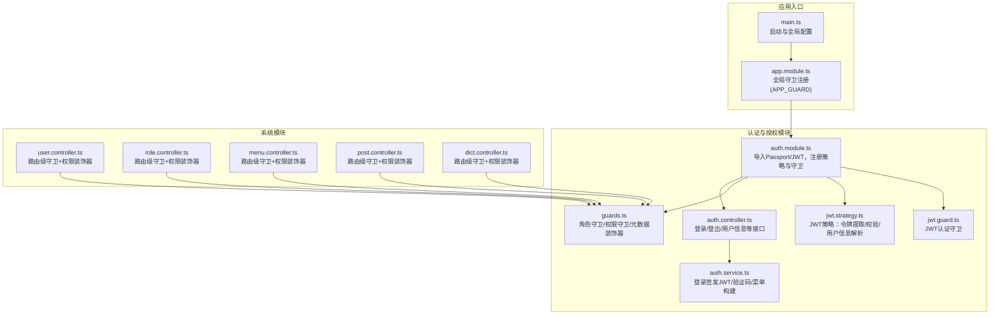
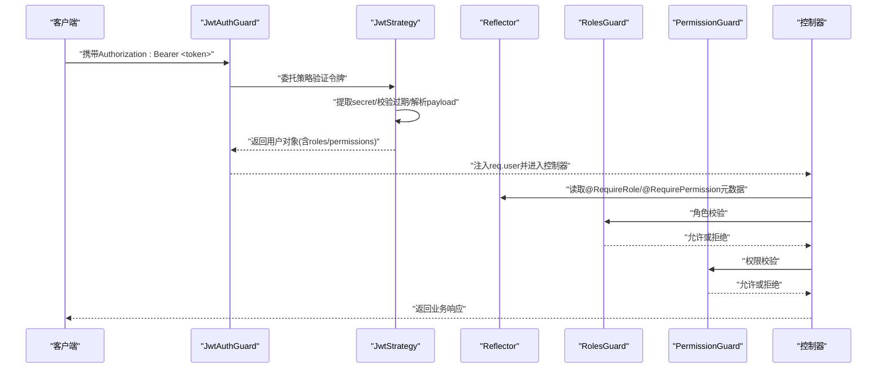
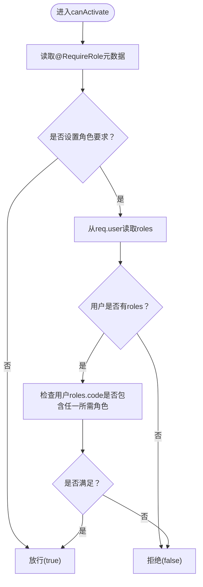
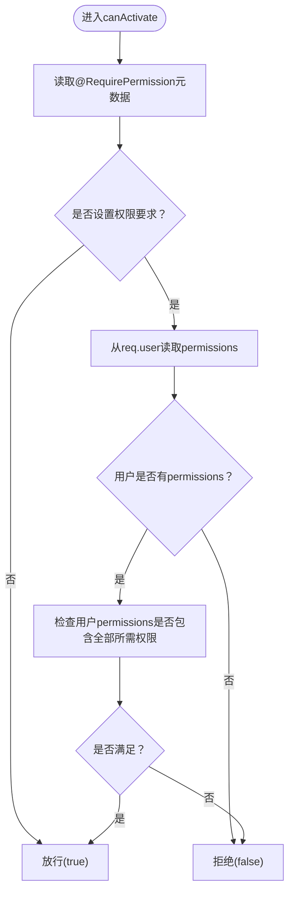
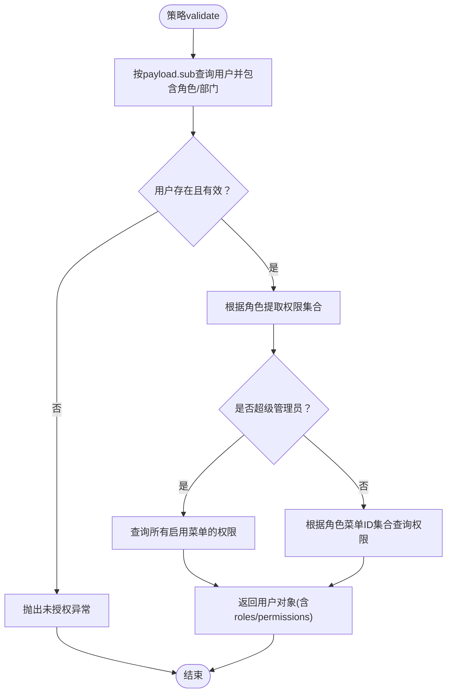
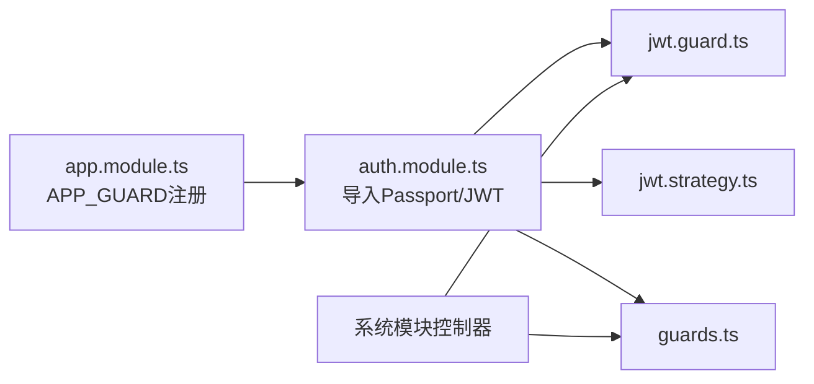

# 守卫开发

<cite>
**本文引用的文件**
- [apps/backend/src/auth/guards.ts](file://apps/backend/src/auth/guards.ts)
- [apps/backend/src/auth/jwt.guard.ts](file://apps/backend/src/auth/jwt.guard.ts)
- [apps/backend/src/auth/jwt.strategy.ts](file://apps/backend/src/auth/jwt.strategy.ts)
- [apps/backend/src/auth/auth.controller.ts](file://apps/backend/src/auth/auth.controller.ts)
- [apps/backend/src/auth/auth.service.ts](file://apps/backend/src/auth/auth.service.ts)
- [apps/backend/src/auth/auth.module.ts](file://apps/backend/src/auth/auth.module.ts)
- [apps/backend/src/modules/system/user/user.controller.ts](file://apps/backend/src/modules/system/user/user.controller.ts)
- [apps/backend/src/modules/system/role/role.controller.ts](file://apps/backend/src/modules/system/role/role.controller.ts)
- [apps/backend/src/modules/system/menu/menu.controller.ts](file://apps/backend/src/modules/system/menu/menu.controller.ts)
- [apps/backend/src/modules/system/post/post.controller.ts](file://apps/backend/src/modules/system/post/post.controller.ts)
- [apps/backend/src/modules/system/dict/dict.controller.ts](file://apps/backend/src/modules/system/dict/dict.controller.ts)
- [apps/backend/src/app.module.ts](file://apps/backend/src/app.module.ts)
- [apps/backend/src/main.ts](file://apps/backend/src/main.ts)
</cite>

## 目录
1. [引言](#引言)
2. [项目结构](#项目结构)
3. [核心组件](#核心组件)
4. [架构总览](#架构总览)
5. [详细组件分析](#详细组件分析)
6. [依赖关系分析](#依赖关系分析)
7. [性能考虑](#性能考虑)
8. [故障排查指南](#故障排查指南)
9. [结论](#结论)
10. [附录](#附录)

## 引言
本指南面向需要在 NestJS 中实现“认证、授权与自定义业务守卫”的开发者，结合仓库中已有的 JWT 守卫、角色与权限守卫、以及 RBAC 权限控制的实际实现，系统讲解守卫的工作原理、注册与配置方式、最佳实践与完整示例路径。读者无需具备深厚的后端背景，也能通过循序渐进的章节与图示理解并落地实现。

## 项目结构
本项目采用多模块分层组织，认证与授权相关的核心位于 backend 应用的 auth 模块，并在多个系统模块（如 system/user、system/role 等）中广泛复用守卫进行权限控制。全局守卫通过 APP_GUARD 注册，统一生效于整个应用。

图表来源
- [apps/backend/src/main.ts:1-48](file://apps/backend/src/main.ts#L1-L48)
- [apps/backend/src/app.module.ts:18-58](file://apps/backend/src/app.module.ts#L18-L58)
- [apps/backend/src/auth/auth.module.ts:11-28](file://apps/backend/src/auth/auth.module.ts#L11-L28)
- [apps/backend/src/auth/jwt.guard.ts:1-5](file://apps/backend/src/auth/jwt.guard.ts#L1-L5)
- [apps/backend/src/auth/jwt.strategy.ts:1-78](file://apps/backend/src/auth/jwt.strategy.ts#L1-L78)
- [apps/backend/src/auth/guards.ts:19-51](file://apps/backend/src/auth/guards.ts#L19-L51)
- [apps/backend/src/auth/auth.controller.ts:1-87](file://apps/backend/src/auth/auth.controller.ts#L1-L87)
- [apps/backend/src/auth/auth.service.ts:1-294](file://apps/backend/src/auth/auth.service.ts#L1-L294)
- [apps/backend/src/modules/system/user/user.controller.ts:1-89](file://apps/backend/src/modules/system/user/user.controller.ts#L1-L89)
- [apps/backend/src/modules/system/role/role.controller.ts:1-80](file://apps/backend/src/modules/system/role/role.controller.ts#L1-L80)
- [apps/backend/src/modules/system/menu/menu.controller.ts:1-67](file://apps/backend/src/modules/system/menu/menu.controller.ts#L1-L67)
- [apps/backend/src/modules/system/post/post.controller.ts:1-50](file://apps/backend/src/modules/system/post/post.controller.ts#L1-L50)
- [apps/backend/src/modules/system/dict/dict.controller.ts:1-81](file://apps/backend/src/modules/system/dict/dict.controller.ts#L1-L81)

章节来源
- [apps/backend/src/main.ts:1-48](file://apps/backend/src/main.ts#L1-L48)
- [apps/backend/src/app.module.ts:18-58](file://apps/backend/src/app.module.ts#L18-L58)

## 核心组件
- 认证守卫（JWT）
  - 作用：基于 Passport 的 jwt 策略完成请求认证，将用户信息注入到请求对象。
  - 实现位置：[apps/backend/src/auth/jwt.guard.ts:1-5](file://apps/backend/src/auth/jwt.guard.ts#L1-L5)
- 角色守卫（RBAC 角色）
  - 作用：校验用户是否包含所需角色集合；未设置角色要求时默认放行。
  - 实现位置：[apps/backend/src/auth/guards.ts:19-34](file://apps/backend/src/auth/guards.ts#L19-L34)
- 权限守卫（RBAC 权限）
  - 作用：校验用户是否拥有全部所需权限；未设置权限要求时默认放行。
  - 实现位置：[apps/backend/src/auth/guards.ts:36-51](file://apps/backend/src/auth/guards.ts#L36-L51)
- 元数据装饰器
  - Public：声明接口为公开，绕过认证守卫。
  - RequireRole：声明所需角色集合。
  - RequirePermission：声明所需权限集合。
  - 实现位置：[apps/backend/src/auth/guards.ts:10-17](file://apps/backend/src/auth/guards.ts#L10-L17)
- JWT 策略（令牌验证与用户信息解析）
  - 作用：从请求头提取 JWT，校验过期，查询用户并返回包含角色与权限的用户对象。
  - 实现位置：[apps/backend/src/auth/jwt.strategy.ts:1-78](file://apps/backend/src/auth/jwt.strategy.ts#L1-L78)
- 登录与用户信息服务
  - 作用：登录签发 JWT、构建菜单树、在线用户管理等。
  - 实现位置：[apps/backend/src/auth/auth.controller.ts:1-87](file://apps/backend/src/auth/auth.controller.ts#L1-L87), [apps/backend/src/auth/auth.service.ts:1-294](file://apps/backend/src/auth/auth.service.ts#L1-L294)

章节来源
- [apps/backend/src/auth/guards.ts:10-51](file://apps/backend/src/auth/guards.ts#L10-L51)
- [apps/backend/src/auth/jwt.guard.ts:1-5](file://apps/backend/src/auth/jwt.guard.ts#L1-L5)
- [apps/backend/src/auth/jwt.strategy.ts:1-78](file://apps/backend/src/auth/jwt.strategy.ts#L1-L78)
- [apps/backend/src/auth/auth.controller.ts:1-87](file://apps/backend/src/auth/auth.controller.ts#L1-L87)
- [apps/backend/src/auth/auth.service.ts:1-294](file://apps/backend/src/auth/auth.service.ts#L1-L294)

## 架构总览
下图展示了从客户端发起请求到服务端完成认证与权限校验的整体流程，包括 JWT 策略、认证守卫、权限守卫与控制器之间的交互。

图表来源
- [apps/backend/src/auth/jwt.guard.ts:1-5](file://apps/backend/src/auth/jwt.guard.ts#L1-L5)
- [apps/backend/src/auth/jwt.strategy.ts:20-43](file://apps/backend/src/auth/jwt.strategy.ts#L20-L43)
- [apps/backend/src/auth/guards.ts:23-33](file://apps/backend/src/auth/guards.ts#L23-L33)
- [apps/backend/src/auth/guards.ts:40-49](file://apps/backend/src/auth/guards.ts#L40-L49)
- [apps/backend/src/auth/auth.controller.ts:44-58](file://apps/backend/src/auth/auth.controller.ts#L44-L58)

## 详细组件分析

### 认证守卫（JWT）
- 工作原理
  - 基于 @nestjs/passport 的 AuthGuard('jwt')，实际由 JwtStrategy 负责令牌解析与用户信息注入。
  - 请求到达时，JwtAuthGuard 将认证职责委托给策略；策略成功后将用户对象挂载到 req.user。
- 关键点
  - 令牌来源：请求头 Authorization: Bearer <token>
  - 过期策略：ignoreExpiration=false，严格校验过期
  - 用户信息：roles、permissions 等由策略统一注入
- 使用场景
  - 所有需要登录态保护的接口均可使用该守卫

章节来源
- [apps/backend/src/auth/jwt.guard.ts:1-5](file://apps/backend/src/auth/jwt.guard.ts#L1-L5)
- [apps/backend/src/auth/jwt.strategy.ts:13-18](file://apps/backend/src/auth/jwt.strategy.ts#L13-L18)
- [apps/backend/src/auth/auth.controller.ts:44-58](file://apps/backend/src/auth/auth.controller.ts#L44-L58)

### 角色守卫（RBAC 角色）
- 工作原理
  - 通过 Reflector 读取方法/类上的 RequireRole 元数据，若未设置则默认放行。
  - 对比 req.user.roles.code 是否包含任一所需角色。
- 复杂度
  - 时间复杂度：O(n)，n 为用户角色数量
  - 空间复杂度：O(1)
- 注意事项
  - 若用户无 roles 字段或为空，直接拒绝
  - 未设置角色要求时默认放行

图表来源
- [apps/backend/src/auth/guards.ts:23-33](file://apps/backend/src/auth/guards.ts#L23-L33)

章节来源
- [apps/backend/src/auth/guards.ts:19-34](file://apps/backend/src/auth/guards.ts#L19-L34)

### 权限守卫（RBAC 权限）
- 工作原理
  - 通过 Reflector 读取 RequirePermission 元数据，未设置则默认放行。
  - 对比 req.user.permissions 是否包含全部所需权限。
- 复杂度
  - 时间复杂度：O(m)，m 为所需权限数量
  - 空间复杂度：O(1)
- 注意事项
  - 用户必须包含所有所需权限才可通过
  - 未设置权限要求时默认放行

图表来源
- [apps/backend/src/auth/guards.ts:40-49](file://apps/backend/src/auth/guards.ts#L40-L49)

章节来源
- [apps/backend/src/auth/guards.ts:36-51](file://apps/backend/src/auth/guards.ts#L36-L51)

### JWT 策略（令牌验证、用户信息解析与权限提取）
- 令牌提取与校验
  - 从 Authorization 头部提取 Bearer 令牌
  - 使用配置的 secret 或默认密钥校验签名，且严格校验过期
- 用户信息解析
  - 查询用户并包含角色与部门信息
  - 校验用户状态与删除标记，不合法则抛出未授权异常
- 权限提取
  - 超级管理员：查询所有启用菜单的权限字符串集合
  - 普通用户：根据角色绑定的菜单ID集合，查询对应权限字符串集合
- 返回结构
  - 包含用户基础字段与 roles、permissions 数组，供守卫与控制器使用

图表来源
- [apps/backend/src/auth/jwt.strategy.ts:20-43](file://apps/backend/src/auth/jwt.strategy.ts#L20-L43)
- [apps/backend/src/auth/jwt.strategy.ts:45-76](file://apps/backend/src/auth/jwt.strategy.ts#L45-L76)

章节来源
- [apps/backend/src/auth/jwt.strategy.ts:1-78](file://apps/backend/src/auth/jwt.strategy.ts#L1-L78)

### 控制器中的守卫使用（路由级与方法级）
- 路由级守卫
  - 在控制器上使用 @UseGuards(JwtAuthGuard, PermissionGuard)，对该控制器下所有路由生效
  - 示例：用户、角色、菜单、岗位、字典等系统模块控制器均采用此模式
- 方法级守卫
  - 在具体方法上使用 RequirePermission 装饰器，声明该方法所需的权限标识
  - 示例：用户列表、新增、编辑、删除、重置密码、分配角色等方法均标注了相应权限
- 公开接口
  - 使用 @Public() 装饰器，使登录接口（如登录、注册、验证码）无需认证

章节来源
- [apps/backend/src/modules/system/user/user.controller.ts:22-87](file://apps/backend/src/modules/system/user/user.controller.ts#L22-L87)
- [apps/backend/src/modules/system/role/role.controller.ts:13-78](file://apps/backend/src/modules/system/role/role.controller.ts#L13-L78)
- [apps/backend/src/modules/system/menu/menu.controller.ts:13-65](file://apps/backend/src/modules/system/menu/menu.controller.ts#L13-L65)
- [apps/backend/src/modules/system/post/post.controller.ts:10-48](file://apps/backend/src/modules/system/post/post.controller.ts#L10-L48)
- [apps/backend/src/modules/system/dict/dict.controller.ts:10-79](file://apps/backend/src/modules/system/dict/dict.controller.ts#L10-L79)
- [apps/backend/src/auth/auth.controller.ts:13-42](file://apps/backend/src/auth/auth.controller.ts#L13-L42)

### 登录与用户信息（JWT 签发与菜单构建）
- 登录流程
  - 验证图形验证码
  - 校验用户名与密码
  - 签发 JWT 并记录在线用户
- 用户信息与菜单
  - 构建用户可访问的菜单树（支持超级管理员与普通用户两种路径）
  - 返回用户信息、权限集合与菜单树

章节来源
- [apps/backend/src/auth/auth.service.ts:29-89](file://apps/backend/src/auth/auth.service.ts#L29-L89)
- [apps/backend/src/auth/auth.service.ts:135-187](file://apps/backend/src/auth/auth.service.ts#L135-L187)

## 依赖关系分析
- 模块依赖
  - AppModule 通过 APP_GUARD 注册全局守卫（当前为 ThrottlerGuard），但认证与权限守卫在 AuthModule 中独立注册并生效于各控制器。
  - AuthModule 导入 PassportModule 与 JwtModule，并注册 JwtStrategy、JwtAuthGuard、RolesGuard、PermissionGuard。
- 组件耦合
  - 控制器仅依赖守卫与装饰器，不直接依赖策略细节，降低耦合。
  - 策略与守卫通过 Nest 反射与上下文解耦，便于扩展。

图表来源
- [apps/backend/src/app.module.ts:39-55](file://apps/backend/src/app.module.ts#L39-L55)
- [apps/backend/src/auth/auth.module.ts:11-28](file://apps/backend/src/auth/auth.module.ts#L11-L28)

章节来源
- [apps/backend/src/app.module.ts:18-58](file://apps/backend/src/app.module.ts#L18-L58)
- [apps/backend/src/auth/auth.module.ts:11-28](file://apps/backend/src/auth/auth.module.ts#L11-L28)

## 性能考虑
- 令牌校验成本
  - JWT 策略每次请求都会执行一次数据库查询以解析用户与权限，建议配合缓存（如 Redis）存储用户与权限快照，减少数据库压力。
- 权限计算
  - 权限守卫对用户权限数组进行全量包含判断，建议在策略阶段就完成权限聚合，避免控制器重复计算。
- 角色匹配
  - 角色守卫使用 some 判断，建议在策略阶段将角色编码扁平化，提升匹配效率。
- 全局守卫冲突
  - 当前全局仅注册了限流守卫，认证与权限守卫按需在模块与控制器中使用，避免全局守卫带来的额外开销。

## 故障排查指南
- 401 未授权
  - 可能原因：缺少 Authorization 头、令牌无效或过期、用户被禁用或删除
  - 排查路径：[apps/backend/src/auth/jwt.strategy.ts:26-28](file://apps/backend/src/auth/jwt.strategy.ts#L26-L28)
- 403 权限不足
  - 可能原因：用户未包含所需角色或权限
  - 排查路径：[apps/backend/src/auth/guards.ts:30-32](file://apps/backend/src/auth/guards.ts#L30-L32), [apps/backend/src/auth/guards.ts:47-49](file://apps/backend/src/auth/guards.ts#L47-L49)
- 登录失败
  - 可能原因：验证码错误、用户名不存在、密码错误、账户被禁用
  - 排查路径：[apps/backend/src/auth/auth.service.ts:30-60](file://apps/backend/src/auth/auth.service.ts#L30-L60)
- 公开接口仍需认证
  - 可能原因：忘记添加 @Public() 装饰器
  - 排查路径：[apps/backend/src/auth/auth.controller.ts:13-26](file://apps/backend/src/auth/auth.controller.ts#L13-L26)

章节来源
- [apps/backend/src/auth/jwt.strategy.ts:26-28](file://apps/backend/src/auth/jwt.strategy.ts#L26-L28)
- [apps/backend/src/auth/guards.ts:30-32](file://apps/backend/src/auth/guards.ts#L30-L32)
- [apps/backend/src/auth/guards.ts:47-49](file://apps/backend/src/auth/guards.ts#L47-L49)
- [apps/backend/src/auth/auth.service.ts:30-60](file://apps/backend/src/auth/auth.service.ts#L30-L60)
- [apps/backend/src/auth/auth.controller.ts:13-26](file://apps/backend/src/auth/auth.controller.ts#L13-L26)

## 结论
本项目通过 JwtAuthGuard、JwtStrategy、RolesGuard、PermissionGuard 与元数据装饰器，实现了完善的认证与 RBAC 权限控制体系。守卫以最小侵入的方式嵌入控制器，既保证了安全性，又保持了良好的可维护性。建议在生产环境中进一步引入缓存与审计日志，持续优化性能与可观测性。

## 附录

### 守卫注册与配置方法
- 全局守卫
  - 通过 APP_GUARD 提供者注册，适用于全站限流等通用场景
  - 参考：[apps/backend/src/app.module.ts:39-55](file://apps/backend/src/app.module.ts#L39-L55)
- 模块级守卫
  - 在 AuthModule 中注册认证与权限相关守卫，供各控制器复用
  - 参考：[apps/backend/src/auth/auth.module.ts:26](file://apps/backend/src/auth/auth.module.ts#L26)
- 路由级守卫
  - 在控制器上使用 @UseGuards(JwtAuthGuard, PermissionGuard)
  - 参考：[apps/backend/src/modules/system/user/user.controller.ts:22](file://apps/backend/src/modules/system/user/user.controller.ts#L22)
- 方法级守卫
  - 使用 RequirePermission 装饰器声明所需权限
  - 参考：[apps/backend/src/modules/system/user/user.controller.ts:27](file://apps/backend/src/modules/system/user/user.controller.ts#L27)

章节来源
- [apps/backend/src/app.module.ts:39-55](file://apps/backend/src/app.module.ts#L39-L55)
- [apps/backend/src/auth/auth.module.ts:26](file://apps/backend/src/auth/auth.module.ts#L26)
- [apps/backend/src/modules/system/user/user.controller.ts:22-27](file://apps/backend/src/modules/system/user/user.controller.ts#L22-L27)

### 完整示例路径（从需求到实现）
- 需求：用户管理模块的“新增用户”功能需要“system:user:add”权限
  - 步骤：
    1) 在控制器类上启用 JwtAuthGuard 与 PermissionGuard（路由级）
    2) 在新增方法上使用 RequirePermission('system:user:add')
    3) 确保登录用户具备该权限（策略会自动注入 req.user.permissions）
  - 参考：
    - 路由级守卫：[apps/backend/src/modules/system/user/user.controller.ts:22](file://apps/backend/src/modules/system/user/user.controller.ts#L22)
    - 方法级权限：[apps/backend/src/modules/system/user/user.controller.ts:41](file://apps/backend/src/modules/system/user/user.controller.ts#L41)
    - 权限守卫逻辑：[apps/backend/src/auth/guards.ts:40-49](file://apps/backend/src/auth/guards.ts#L40-L49)

章节来源
- [apps/backend/src/modules/system/user/user.controller.ts:22-41](file://apps/backend/src/modules/system/user/user.controller.ts#L22-L41)
- [apps/backend/src/auth/guards.ts:40-49](file://apps/backend/src/auth/guards.ts#L40-L49)