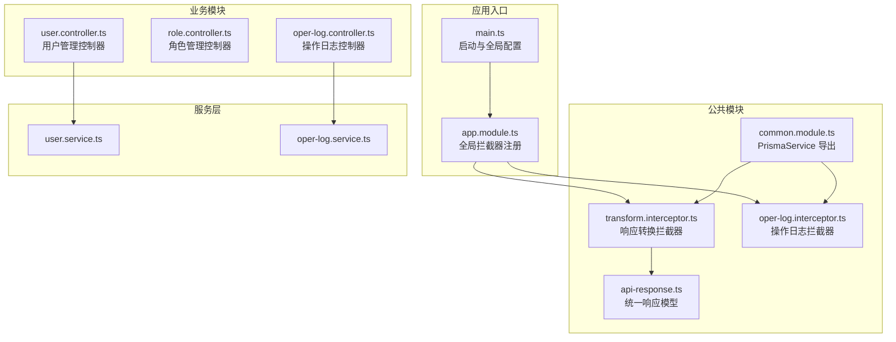
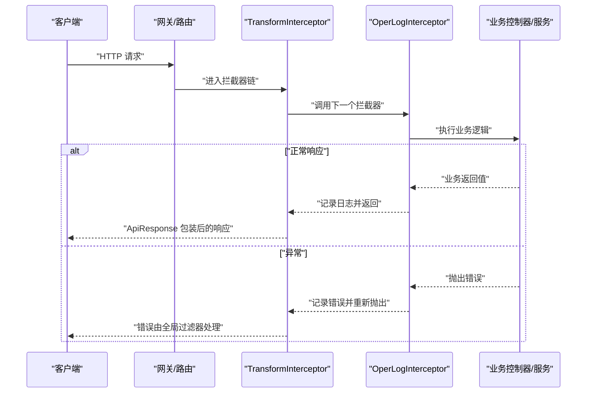
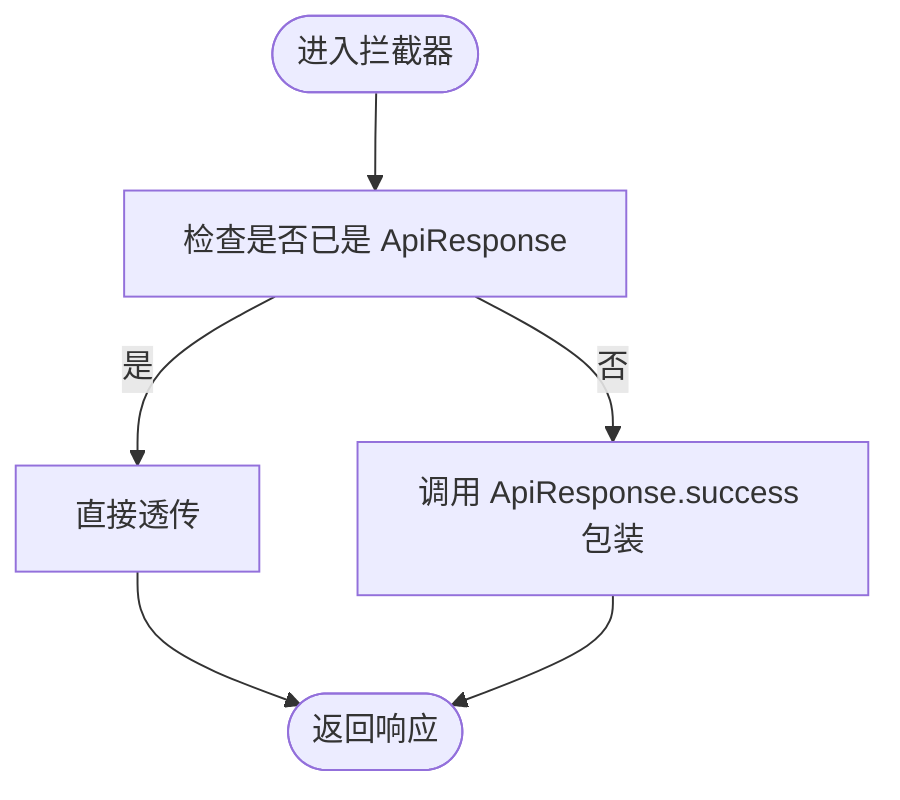
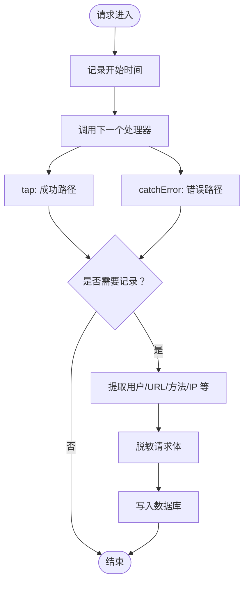
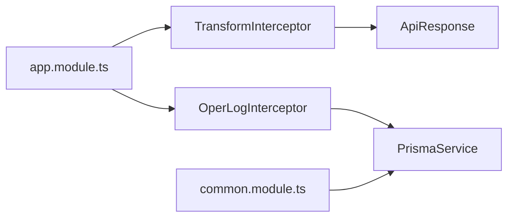

# 拦截器开发

<cite>
**本文引用的文件**
- [apps/backend/src/common/oper-log.interceptor.ts](file://apps/backend/src/common/oper-log.interceptor.ts)
- [apps/backend/src/common/transform.interceptor.ts](file://apps/backend/src/common/transform.interceptor.ts)
- [apps/backend/src/common/api-response.ts](file://apps/backend/src/common/api-response.ts)
- [apps/backend/src/app.module.ts](file://apps/backend/src/app.module.ts)
- [apps/backend/src/common/common.module.ts](file://apps/backend/src/common/common.module.ts)
- [apps/backend/src/modules/system/user/user.controller.ts](file://apps/backend/src/modules/system/user/user.controller.ts)
- [apps/backend/src/modules/system/role/role.controller.ts](file://apps/backend/src/modules/system/role/role.controller.ts)
- [apps/backend/src/modules/monitor/oper-log/oper-log.controller.ts](file://apps/backend/src/modules/monitor/oper-log/oper-log.controller.ts)
- [apps/backend/src/modules/system/user/user.service.ts](file://apps/backend/src/modules/system/user/user.service.ts)
- [apps/backend/src/modules/monitor/oper-log/oper-log.service.ts](file://apps/backend/src/modules/monitor/oper-log/oper-log.service.ts)
- [apps/backend/src/main.ts](file://apps/backend/src/main.ts)
</cite>

## 目录
1. [简介](#简介)
2. [项目结构](#项目结构)
3. [核心组件](#核心组件)
4. [架构总览](#架构总览)
5. [详细组件分析](#详细组件分析)
6. [依赖关系分析](#依赖关系分析)
7. [性能考量](#性能考量)
8. [故障排查指南](#故障排查指南)
9. [结论](#结论)
10. [附录：拦截器开发示例流程](#附录拦截器开发示例流程)

## 简介
本指南围绕 NestJS 拦截器在本项目中的实现与应用展开，重点覆盖以下主题：
- 拦截器工作原理与生命周期（请求进入、响应转换、异常处理）
- 操作日志拦截器 OperLogInterceptor 的完整实现：请求参数提取、响应数据处理、错误捕获与日志记录
- 响应转换拦截器 TransformInterceptor 的开发：统一返回格式、数据类型转换与标准化
- 拦截器的注册与配置：全局注册、模块级注册、路由级注册
- 最佳实践：性能优化、错误处理、调试技巧
- 完整示例：从需求分析到代码实现的全流程

## 项目结构
本项目后端采用 NestJS 架构，拦截器位于公共模块中，并通过全局提供者注入到应用中；系统模块与监控模块分别提供业务控制器与操作日志查询控制器。

图表来源
- [apps/backend/src/main.ts:1-48](file://apps/backend/src/main.ts#L1-L48)
- [apps/backend/src/app.module.ts:1-59](file://apps/backend/src/app.module.ts#L1-L59)
- [apps/backend/src/common/transform.interceptor.ts:1-29](file://apps/backend/src/common/transform.interceptor.ts#L1-L29)
- [apps/backend/src/common/oper-log.interceptor.ts:1-111](file://apps/backend/src/common/oper-log.interceptor.ts#L1-L111)
- [apps/backend/src/common/api-response.ts:1-35](file://apps/backend/src/common/api-response.ts#L1-L35)
- [apps/backend/src/common/common.module.ts:1-9](file://apps/backend/src/common/common.module.ts#L1-L9)
- [apps/backend/src/modules/system/user/user.controller.ts:1-89](file://apps/backend/src/modules/system/user/user.controller.ts#L1-L89)
- [apps/backend/src/modules/system/role/role.controller.ts:1-80](file://apps/backend/src/modules/system/role/role.controller.ts#L1-L80)
- [apps/backend/src/modules/monitor/oper-log/oper-log.controller.ts:1-35](file://apps/backend/src/modules/monitor/oper-log/oper-log.controller.ts#L1-L35)

章节来源
- [apps/backend/src/main.ts:1-48](file://apps/backend/src/main.ts#L1-L48)
- [apps/backend/src/app.module.ts:1-59](file://apps/backend/src/app.module.ts#L1-L59)

## 核心组件
- 响应转换拦截器 TransformInterceptor：将控制器返回值包装为统一 ApiResponse 结构，避免重复样板代码。
- 操作日志拦截器 OperLogInterceptor：在请求处理前后收集上下文信息，记录操作日志并统计耗时，同时对敏感字段进行脱敏。
- 统一响应模型 ApiResponse：定义标准的 code/data/message 字段，便于前端统一处理。
- 全局注册：在 AppModule 中通过 APP_INTERCEPTOR 提供者将拦截器注册为全局生效。

章节来源
- [apps/backend/src/common/transform.interceptor.ts:1-29](file://apps/backend/src/common/transform.interceptor.ts#L1-L29)
- [apps/backend/src/common/oper-log.interceptor.ts:1-111](file://apps/backend/src/common/oper-log.interceptor.ts#L1-L111)
- [apps/backend/src/common/api-response.ts:1-35](file://apps/backend/src/common/api-response.ts#L1-L35)
- [apps/backend/src/app.module.ts:48-55](file://apps/backend/src/app.module.ts#L48-L55)

## 架构总览
拦截器在请求生命周期中的位置如下：
- 请求进入：先经过 TransformInterceptor（负责响应包装），再经过 OperLogInterceptor（负责日志与耗时）。
- 异常发生：OperLogInterceptor 捕获错误并记录，随后将错误向上抛出，交由全局异常过滤器处理。
- 响应返回：TransformInterceptor 将业务返回值封装为 ApiResponse。

图表来源
- [apps/backend/src/common/transform.interceptor.ts:15-28](file://apps/backend/src/common/transform.interceptor.ts#L15-L28)
- [apps/backend/src/common/oper-log.interceptor.ts:15-28](file://apps/backend/src/common/oper-log.interceptor.ts#L15-L28)
- [apps/backend/src/common/api-response.ts:12-18](file://apps/backend/src/common/api-response.ts#L12-L18)

## 详细组件分析

### 响应转换拦截器 TransformInterceptor
- 职责：将控制器返回值统一包装为 ApiResponse，若已为 ApiResponse 则透传，避免重复包装。
- 关键点：
  - 使用 RxJS 的 map 操作符对响应流进行转换。
  - 对于未显式返回 ApiResponse 的控制器，自动以成功状态返回。
- 适用场景：所有需要统一响应格式的接口。

图表来源
- [apps/backend/src/common/transform.interceptor.ts:15-28](file://apps/backend/src/common/transform.interceptor.ts#L15-L28)
- [apps/backend/src/common/api-response.ts:12-14](file://apps/backend/src/common/api-response.ts#L12-L14)

章节来源
- [apps/backend/src/common/transform.interceptor.ts:1-29](file://apps/backend/src/common/transform.interceptor.ts#L1-L29)
- [apps/backend/src/common/api-response.ts:1-35](file://apps/backend/src/common/api-response.ts#L1-L35)

### 操作日志拦截器 OperLogInterceptor
- 职责：在请求处理完成后记录操作日志，包含用户、URL、方法、请求参数、响应结果或错误信息、耗时、IP 等。
- 生命周期：
  - 请求进入：记录开始时间。
  - 正常响应：记录响应数据与耗时。
  - 异常：记录错误信息与耗时，并重新抛出。
- 过滤策略：仅对非 GET 且存在登录用户的请求记录；排除特定监控接口。
- 参数提取与脱敏：对 params/query/body 合并记录，并对包含敏感关键词的字段进行脱敏。
- 日志持久化：通过 PrismaService 写入数据库，失败不中断业务。

图表来源
- [apps/backend/src/common/oper-log.interceptor.ts:15-28](file://apps/backend/src/common/oper-log.interceptor.ts#L15-L28)
- [apps/backend/src/common/oper-log.interceptor.ts:30-61](file://apps/backend/src/common/oper-log.interceptor.ts#L30-L61)
- [apps/backend/src/common/oper-log.interceptor.ts:63-70](file://apps/backend/src/common/oper-log.interceptor.ts#L63-L70)
- [apps/backend/src/common/oper-log.interceptor.ts:81-99](file://apps/backend/src/common/oper-log.interceptor.ts#L81-L99)
- [apps/backend/src/common/oper-log.interceptor.ts:101-109](file://apps/backend/src/common/oper-log.interceptor.ts#L101-L109)

章节来源
- [apps/backend/src/common/oper-log.interceptor.ts:1-111](file://apps/backend/src/common/oper-log.interceptor.ts#L1-L111)

### 统一响应模型 ApiResponse
- 字段：code、data、message。
- 工具方法：success/error/unauthorized/forbidden/notFound/badRequest 等静态方法，便于快速构造标准响应。
- 与拦截器配合：TransformInterceptor 在拦截器链末端将任意返回值包装为 ApiResponse。

章节来源
- [apps/backend/src/common/api-response.ts:1-35](file://apps/backend/src/common/api-response.ts#L1-L35)

### 控制器与拦截器交互示例
- 用户管理控制器：包含列表、详情、新增、更新、删除等接口，均受全局拦截器影响。
- 角色管理控制器：同上。
- 操作日志控制器：用于查询与清理操作日志，其内部业务逻辑同样被拦截器记录。

章节来源
- [apps/backend/src/modules/system/user/user.controller.ts:1-89](file://apps/backend/src/modules/system/user/user.controller.ts#L1-L89)
- [apps/backend/src/modules/system/role/role.controller.ts:1-80](file://apps/backend/src/modules/system/role/role.controller.ts#L1-L80)
- [apps/backend/src/modules/monitor/oper-log/oper-log.controller.ts:1-35](file://apps/backend/src/modules/monitor/oper-log/oper-log.controller.ts#L1-L35)

## 依赖关系分析
- AppModule 通过 APP_INTERCEPTOR 提供者注册 TransformInterceptor 与 OperLogInterceptor，二者按注册顺序组成拦截器链。
- 两个拦截器均依赖 PrismaService（通过 CommonModule 导出）进行日志持久化。
- 控制器与服务之间无直接依赖拦截器，拦截器对业务透明。

图表来源
- [apps/backend/src/app.module.ts:48-55](file://apps/backend/src/app.module.ts#L48-L55)
- [apps/backend/src/common/common.module.ts:1-9](file://apps/backend/src/common/common.module.ts#L1-L9)
- [apps/backend/src/common/transform.interceptor.ts:1-29](file://apps/backend/src/common/transform.interceptor.ts#L1-L29)
- [apps/backend/src/common/oper-log.interceptor.ts:1-111](file://apps/backend/src/common/oper-log.interceptor.ts#L1-L111)
- [apps/backend/src/common/api-response.ts:1-35](file://apps/backend/src/common/api-response.ts#L1-L35)

章节来源
- [apps/backend/src/app.module.ts:1-59](file://apps/backend/src/app.module.ts#L1-L59)
- [apps/backend/src/common/common.module.ts:1-9](file://apps/backend/src/common/common.module.ts#L1-L9)

## 性能考量
- 拦截器链顺序：TransformInterceptor 在前，OperLogInterceptor 在后，确保响应包装后再记录日志，避免重复包装。
- 日志写入异步化：OperLogInterceptor 写库使用异步调用并在 catch 中静默处理，防止日志失败影响主业务。
- 参数大小限制：对 JSON 序列化结果进行长度截断，避免超长日志占用过多存储与网络带宽。
- 敏感字段脱敏：对密码、token、authorization、验证码等字段进行脱敏，降低安全风险。
- 过滤策略：排除 GET 请求与特定监控接口，减少无效日志写入。

章节来源
- [apps/backend/src/common/oper-log.interceptor.ts:30-61](file://apps/backend/src/common/oper-log.interceptor.ts#L30-L61)
- [apps/backend/src/common/oper-log.interceptor.ts:63-70](file://apps/backend/src/common/oper-log.interceptor.ts#L63-L70)
- [apps/backend/src/common/oper-log.interceptor.ts:81-99](file://apps/backend/src/common/oper-log.interceptor.ts#L81-L99)
- [apps/backend/src/common/oper-log.interceptor.ts:101-109](file://apps/backend/src/common/oper-log.interceptor.ts#L101-L109)

## 故障排查指南
- 拦截器未生效
  - 检查是否正确通过 APP_INTERCEPTOR 注册为全局拦截器。
  - 确认拦截器类是否声明为 Injectable 并可被 DI 容器解析。
- 日志未记录
  - 检查 shouldLog 过滤条件（GET 请求、未登录用户、特定 URL）。
  - 确认 PrismaService 可用且数据库连接正常。
- 响应格式异常
  - 若控制器已返回 ApiResponse，确认 TransformInterceptor 是否正确透传。
  - 检查业务返回值是否为 undefined 或循环引用导致序列化失败。
- 性能问题
  - 关注日志参数过大与频繁写库，必要时调整过滤策略或启用批量写入。
  - 避免在拦截器中执行阻塞操作。

章节来源
- [apps/backend/src/app.module.ts:48-55](file://apps/backend/src/app.module.ts#L48-L55)
- [apps/backend/src/common/oper-log.interceptor.ts:63-70](file://apps/backend/src/common/oper-log.interceptor.ts#L63-L70)
- [apps/backend/src/common/transform.interceptor.ts:15-28](file://apps/backend/src/common/transform.interceptor.ts#L15-L28)

## 结论
本项目通过全局拦截器实现了“统一响应格式”和“操作日志记录”的横切关注点，既保证了接口一致性，又提供了完善的审计能力。OperLogInterceptor 在不影响业务的前提下完成日志记录与异常上报，TransformInterceptor 则确保所有响应遵循统一规范。建议在新功能开发中遵循现有拦截器模式，保持一致的开发体验与运维效率。

## 附录：拦截器开发示例流程
- 需求分析
  - 明确拦截目标：如统一响应、操作日志、权限校验、限流等。
  - 确定拦截时机：请求进入、响应返回、异常发生。
- 设计拦截器
  - 实现 NestInterceptor 接口，定义 intercept 方法。
  - 使用 RxJS 操作符处理请求/响应流（tap/map/catchError）。
  - 抽象通用逻辑（如日志脱敏、参数提取、异常映射）。
- 编写工具类
  - 如 ApiResponse，提供静态方法统一构造响应。
- 注册拦截器
  - 全局注册：在 AppModule 的 APP_INTERCEPTOR 中提供。
  - 模块级注册：在对应模块的 providers 中提供。
  - 路由级注册：使用 @UseInterceptors 装饰器在控制器或方法级别启用。
- 测试与验证
  - 单元测试：验证响应包装、异常捕获、日志字段完整性。
  - 集成测试：模拟真实请求，验证拦截器链顺序与行为。
- 上线与监控
  - 观察日志量与性能指标，根据需要调整过滤策略与脱敏规则。
  - 对拦截器异常进行告警与回滚策略设计。