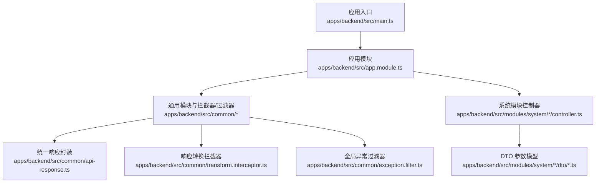
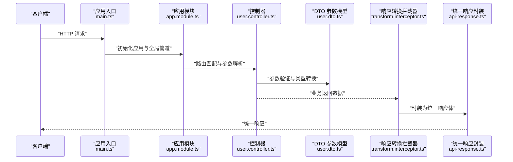
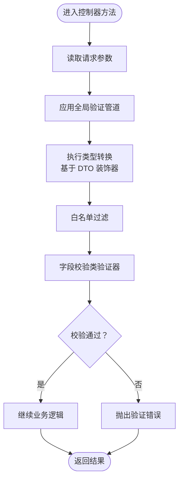
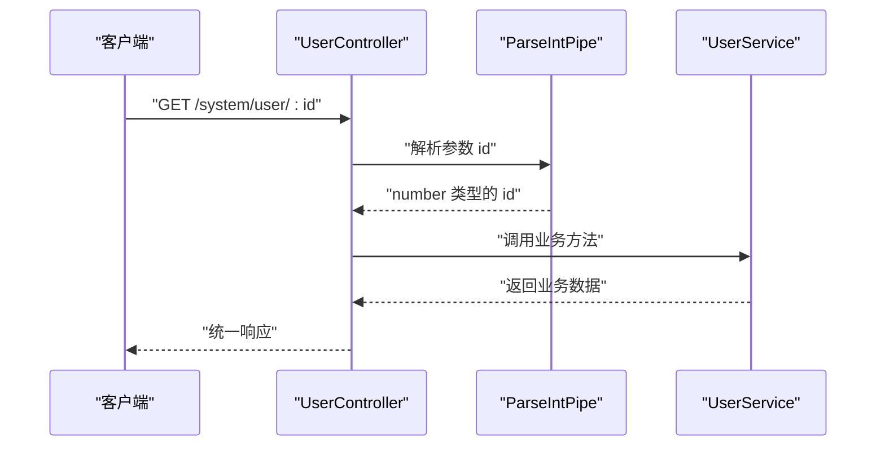
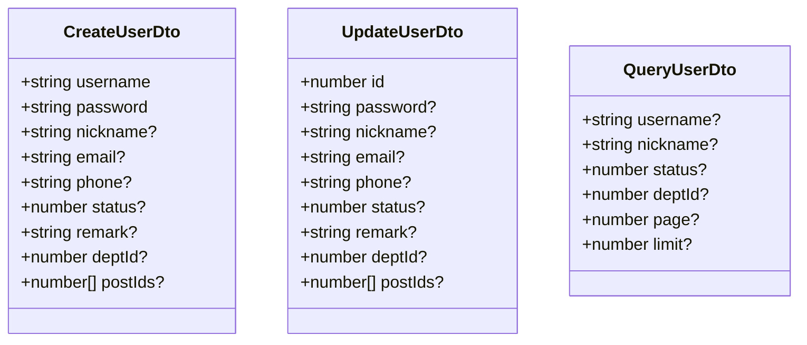
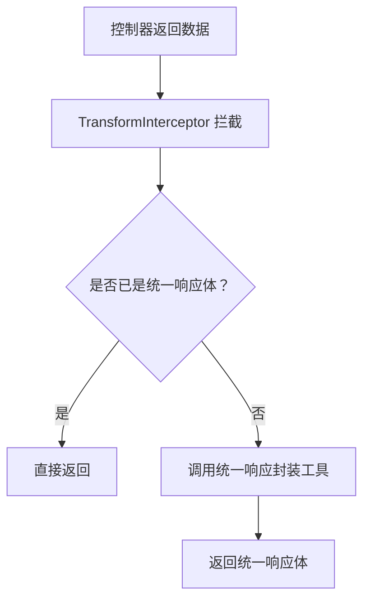
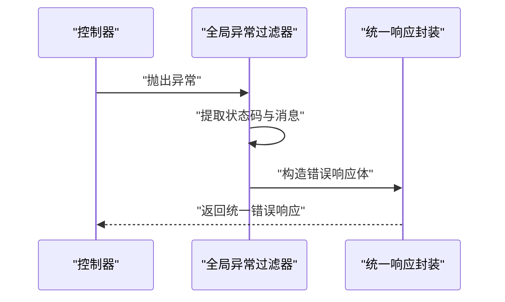
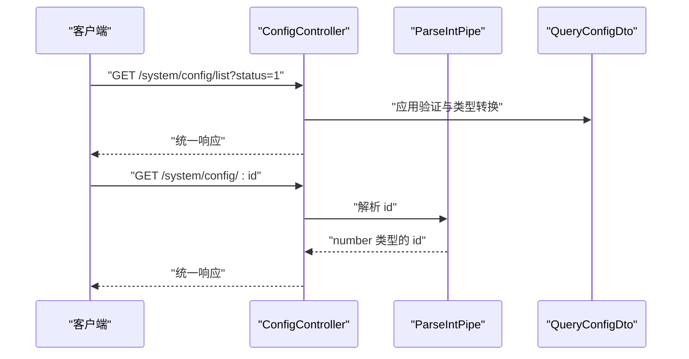
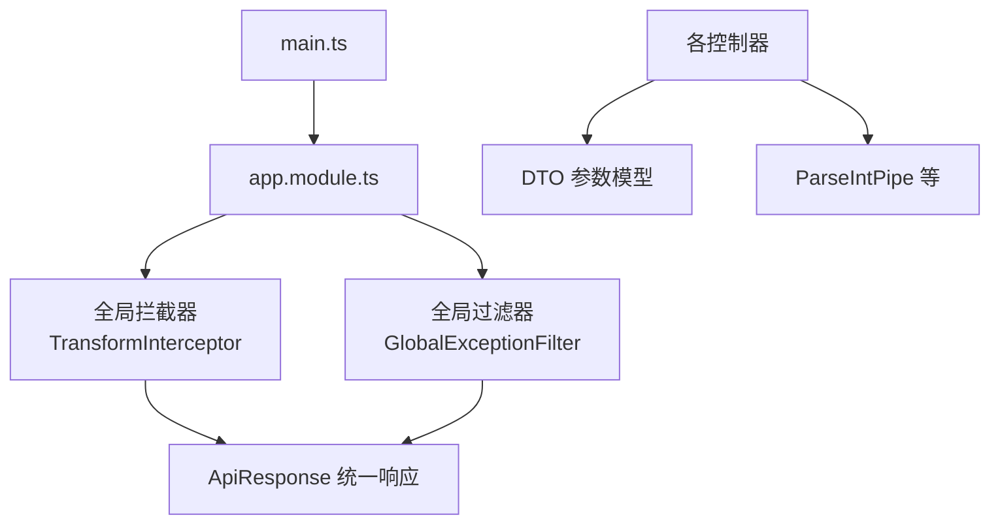

# 管道开发

<cite>
**本文引用的文件**
- [apps/backend/src/main.ts](file://apps/backend/src/main.ts)
- [apps/backend/src/app.module.ts](file://apps/backend/src/app.module.ts)
- [apps/backend/src/common/api-response.ts](file://apps/backend/src/common/api-response.ts)
- [apps/backend/src/common/transform.interceptor.ts](file://apps/backend/src/common/transform.interceptor.ts)
- [apps/backend/src/common/exception.filter.ts](file://apps/backend/src/common/exception.filter.ts)
- [apps/backend/src/modules/system/user/user.controller.ts](file://apps/backend/src/modules/system/user/user.controller.ts)
- [apps/backend/src/modules/system/user/dto/user.dto.ts](file://apps/backend/src/modules/system/user/dto/user.dto.ts)
- [apps/backend/src/modules/system/config/config.controller.ts](file://apps/backend/src/modules/system/config/config.controller.ts)
- [apps/backend/src/modules/system/config/dto/config.dto.ts](file://apps/backend/src/modules/system/config/dto/config.dto.ts)
</cite>

## 目录
1. [简介](#简介)
2. [项目结构](#项目结构)
3. [核心组件](#核心组件)
4. [架构总览](#架构总览)
5. [详细组件分析](#详细组件分析)
6. [依赖关系分析](#依赖关系分析)
7. [性能考量](#性能考量)
8. [故障排查指南](#故障排查指南)
9. [结论](#结论)
10. [附录](#附录)

## 简介
本指南围绕 NestJS 管道（Pipes）在本项目中的工作原理与实践展开，重点覆盖以下方面：
- 参数验证：基于类验证器与内置解析管道的参数校验策略
- 类型转换：通过装饰器与解析管道实现请求参数到业务模型的类型转换
- 数据净化：白名单过滤、非白名单禁止等策略
- API 响应统一：拦截器将业务返回统一封装为统一响应体
- 自定义管道与装饰器：参数管道、管道装饰器与管道链的使用方式
- 注册与配置：全局管道、模块级与路由级管道的注册方法
- 最佳实践：性能优化、错误处理与调试技巧
- 完整示例：从输入参数验证到输出数据格式化的全流程实现

## 项目结构
本项目后端采用 NestJS 架构，核心入口位于应用模块与主引导文件中；通用能力（如统一响应封装、异常过滤、操作日志）通过拦截器与过滤器实现；系统模块下的控制器与 DTO 展示了参数验证与类型转换的实际用法。

**图表来源**
- [apps/backend/src/main.ts:1-48](file://apps/backend/src/main.ts#L1-L48)
- [apps/backend/src/app.module.ts:1-59](file://apps/backend/src/app.module.ts#L1-L59)
- [apps/backend/src/common/api-response.ts:1-35](file://apps/backend/src/common/api-response.ts#L1-L35)
- [apps/backend/src/common/transform.interceptor.ts:1-29](file://apps/backend/src/common/transform.interceptor.ts#L1-L29)
- [apps/backend/src/common/exception.filter.ts:1-37](file://apps/backend/src/common/exception.filter.ts#L1-L37)

**章节来源**
- [apps/backend/src/main.ts:1-48](file://apps/backend/src/main.ts#L1-L48)
- [apps/backend/src/app.module.ts:1-59](file://apps/backend/src/app.module.ts#L1-L59)

## 核心组件
- 全局验证管道：在应用启动时启用，负责参数验证、类型转换与白名单过滤
- 统一响应拦截器：将控制器返回的数据包装为统一响应体
- 全局异常过滤器：捕获未处理异常并统一返回错误响应
- DTO 参数模型：结合类验证器与类型转换装饰器，定义输入参数的约束与类型
- 控制器与路由参数管道：在路由层对路径与查询参数进行解析

这些组件共同构成了本项目的“输入验证—类型转换—统一响应—异常处理”闭环。

**章节来源**
- [apps/backend/src/main.ts:17-24](file://apps/backend/src/main.ts#L17-L24)
- [apps/backend/src/common/transform.interceptor.ts:11-29](file://apps/backend/src/common/transform.interceptor.ts#L11-L29)
- [apps/backend/src/common/exception.filter.ts:12-37](file://apps/backend/src/common/exception.filter.ts#L12-L37)
- [apps/backend/src/common/api-response.ts:1-35](file://apps/backend/src/common/api-response.ts#L1-L35)
- [apps/backend/src/modules/system/user/user.controller.ts:1-89](file://apps/backend/src/modules/system/user/user.controller.ts#L1-L89)

## 架构总览
下图展示了从客户端请求到统一响应返回的关键流程，以及管道与拦截器/过滤器的协作关系：

**图表来源**
- [apps/backend/src/main.ts:17-24](file://apps/backend/src/main.ts#L17-L24)
- [apps/backend/src/app.module.ts:39-56](file://apps/backend/src/app.module.ts#L39-L56)
- [apps/backend/src/modules/system/user/user.controller.ts:26-31](file://apps/backend/src/modules/system/user/user.controller.ts#L26-L31)
- [apps/backend/src/modules/system/user/dto/user.dto.ts:94-130](file://apps/backend/src/modules/system/user/dto/user.dto.ts#L94-L130)
- [apps/backend/src/common/transform.interceptor.ts:15-28](file://apps/backend/src/common/transform.interceptor.ts#L15-L28)
- [apps/backend/src/common/api-response.ts:12-18](file://apps/backend/src/common/api-response.ts#L12-L18)

## 详细组件分析

### 全局验证管道与类型转换
- 启用位置：应用入口文件中设置全局验证管道，开启 transform、whitelist、forbidNonWhitelisted 等选项
- 作用范围：对所有控制器的入参进行统一验证与类型转换
- 类型转换实现：在 DTO 中使用类型转换装饰器，使字符串等原始类型自动转为数字、布尔等目标类型

**图表来源**
- [apps/backend/src/main.ts:17-24](file://apps/backend/src/main.ts#L17-L24)
- [apps/backend/src/modules/system/user/dto/user.dto.ts:106-130](file://apps/backend/src/modules/system/user/dto/user.dto.ts#L106-L130)

**章节来源**
- [apps/backend/src/main.ts:17-24](file://apps/backend/src/main.ts#L17-L24)
- [apps/backend/src/modules/system/user/dto/user.dto.ts:1-131](file://apps/backend/src/modules/system/user/dto/user.dto.ts#L1-L131)

### 路由级参数管道（ParseIntPipe）
- 在控制器方法参数上显式声明解析管道，确保路径或查询参数被正确解析为目标类型
- 示例：对用户 ID 进行整数解析，避免后续业务逻辑因类型不一致导致问题

**图表来源**
- [apps/backend/src/modules/system/user/user.controller.ts:33-38](file://apps/backend/src/modules/system/user/user.controller.ts#L33-L38)
- [apps/backend/src/modules/system/user/user.controller.ts:54-60](file://apps/backend/src/modules/system/user/user.controller.ts#L54-L60)

**章节来源**
- [apps/backend/src/modules/system/user/user.controller.ts:1-89](file://apps/backend/src/modules/system/user/user.controller.ts#L1-L89)

### DTO 参数模型与验证规则
- 字段约束：使用类验证器装饰器定义必填、可选、最小值、类型等约束
- 类型转换：使用类型转换装饰器将字符串等原始类型转换为期望的数值类型
- 查询参数示例：分页参数的类型转换与最小值校验

**图表来源**
- [apps/backend/src/modules/system/user/dto/user.dto.ts:5-47](file://apps/backend/src/modules/system/user/dto/user.dto.ts#L5-L47)
- [apps/backend/src/modules/system/user/dto/user.dto.ts:49-92](file://apps/backend/src/modules/system/user/dto/user.dto.ts#L49-L92)
- [apps/backend/src/modules/system/user/dto/user.dto.ts:94-130](file://apps/backend/src/modules/system/user/dto/user.dto.ts#L94-L130)

**章节来源**
- [apps/backend/src/modules/system/user/dto/user.dto.ts:1-131](file://apps/backend/src/modules/system/user/dto/user.dto.ts#L1-L131)

### 统一响应封装与拦截器
- 统一响应体：提供成功与多种错误状态的静态构造方法
- 响应拦截器：将控制器返回数据包装为统一响应体；若已为统一响应体则直接透传
- 模块注册：在应用模块中通过全局提供者注册拦截器

**图表来源**
- [apps/backend/src/common/transform.interceptor.ts:15-28](file://apps/backend/src/common/transform.interceptor.ts#L15-L28)
- [apps/backend/src/common/api-response.ts:12-18](file://apps/backend/src/common/api-response.ts#L12-L18)

**章节来源**
- [apps/backend/src/common/transform.interceptor.ts:1-29](file://apps/backend/src/common/transform.interceptor.ts#L1-L29)
- [apps/backend/src/common/api-response.ts:1-35](file://apps/backend/src/common/api-response.ts#L1-L35)
- [apps/backend/src/app.module.ts:48-55](file://apps/backend/src/app.module.ts#L48-L55)

### 全局异常过滤器
- 捕获未处理异常与 HTTP 异常，提取状态码与消息
- 将异常统一转换为统一响应体返回给客户端
- 对未捕获错误记录日志以便排查

**图表来源**
- [apps/backend/src/common/exception.filter.ts:16-36](file://apps/backend/src/common/exception.filter.ts#L16-L36)
- [apps/backend/src/common/api-response.ts:16-18](file://apps/backend/src/common/api-response.ts#L16-L18)

**章节来源**
- [apps/backend/src/common/exception.filter.ts:1-37](file://apps/backend/src/common/exception.filter.ts#L1-L37)

### 配置模块示例（验证与解析）
- 查询参数同样使用类型转换装饰器与类验证器
- 路由参数使用解析管道保证类型安全

**图表来源**
- [apps/backend/src/modules/system/config/config.controller.ts:14-19](file://apps/backend/src/modules/system/config/config.controller.ts#L14-L19)
- [apps/backend/src/modules/system/config/config.controller.ts:28-33](file://apps/backend/src/modules/system/config/config.controller.ts#L28-L33)
- [apps/backend/src/modules/system/config/dto/config.dto.ts:23-27](file://apps/backend/src/modules/system/config/dto/config.dto.ts#L23-L27)

**章节来源**
- [apps/backend/src/modules/system/config/config.controller.ts:1-63](file://apps/backend/src/modules/system/config/config.controller.ts#L1-L63)
- [apps/backend/src/modules/system/config/dto/config.dto.ts:1-28](file://apps/backend/src/modules/system/config/dto/config.dto.ts#L1-L28)

## 依赖关系分析
- 应用入口负责全局管道与文档服务的初始化
- 应用模块集中注册全局守卫、过滤器与拦截器
- 控制器通过装饰器与 DTO 实现参数验证与类型转换
- 统一响应封装贯穿于拦截器与过滤器，形成一致的对外接口风格

**图表来源**
- [apps/backend/src/main.ts:17-24](file://apps/backend/src/main.ts#L17-L24)
- [apps/backend/src/app.module.ts:39-56](file://apps/backend/src/app.module.ts#L39-L56)
- [apps/backend/src/common/transform.interceptor.ts:11-29](file://apps/backend/src/common/transform.interceptor.ts#L11-L29)
- [apps/backend/src/common/exception.filter.ts:12-37](file://apps/backend/src/common/exception.filter.ts#L12-L37)
- [apps/backend/src/common/api-response.ts:1-35](file://apps/backend/src/common/api-response.ts#L1-L35)

**章节来源**
- [apps/backend/src/main.ts:1-48](file://apps/backend/src/main.ts#L1-L48)
- [apps/backend/src/app.module.ts:1-59](file://apps/backend/src/app.module.ts#L1-L59)

## 性能考量
- 合理使用全局验证管道：开启 transform 可减少手动类型转换代码，但会增加处理开销，建议仅在必要时启用
- 白名单与非白名单策略：whitelist 与 forbidNonWhitelisted 可有效降低无效字段带来的处理成本
- 拦截器与过滤器顺序：统一响应与异常处理应尽量靠近下游，避免重复封装
- DTO 设计：将复杂校验逻辑集中在 DTO，控制器保持简洁，有利于缓存与复用

## 故障排查指南
- 参数类型错误：检查 DTO 的类型转换装饰器与路由参数管道是否匹配
- 验证失败：确认类验证器装饰器配置与请求体/查询参数是否一致
- 响应格式异常：确认拦截器是否生效，以及控制器是否直接返回统一响应体
- 未捕获异常：查看全局异常过滤器日志，定位具体错误来源

**章节来源**
- [apps/backend/src/common/exception.filter.ts:16-36](file://apps/backend/src/common/exception.filter.ts#L16-L36)
- [apps/backend/src/common/transform.interceptor.ts:20-26](file://apps/backend/src/common/transform.interceptor.ts#L20-L26)

## 结论
本项目通过全局验证管道、DTO 参数模型、路由参数管道、统一响应拦截器与全局异常过滤器，构建了完整的“输入验证—类型转换—统一响应—异常处理”体系。遵循本文档的实践建议，可在保证安全性与一致性的同时提升开发效率与可维护性。

## 附录
- 完整示例流程（从输入到输出）
  1) 客户端发送请求，携带查询参数与请求体
  2) 全局验证管道对请求参数进行验证与类型转换
  3) 路由参数管道对路径参数进行解析
  4) 控制器方法接收已验证与转换后的参数
  5) 业务完成后，响应拦截器将结果封装为统一响应体
  6) 若发生异常，全局异常过滤器统一捕获并返回错误响应