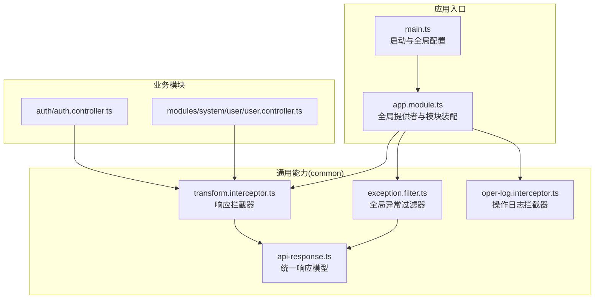
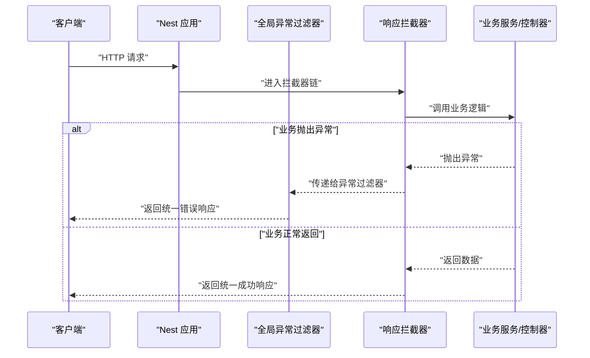
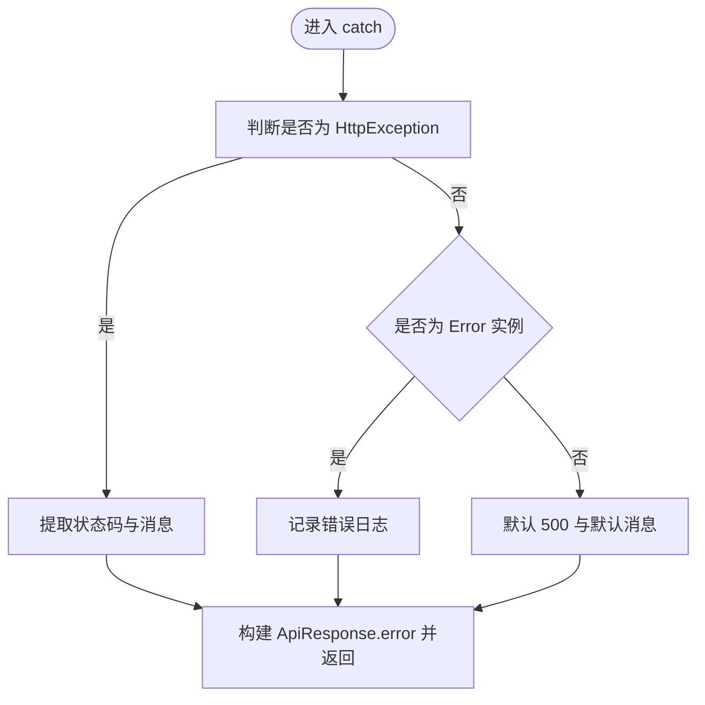
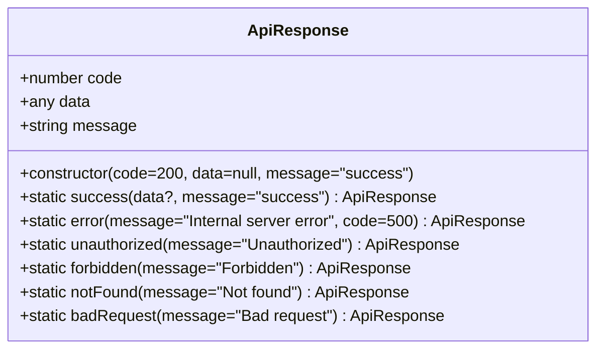
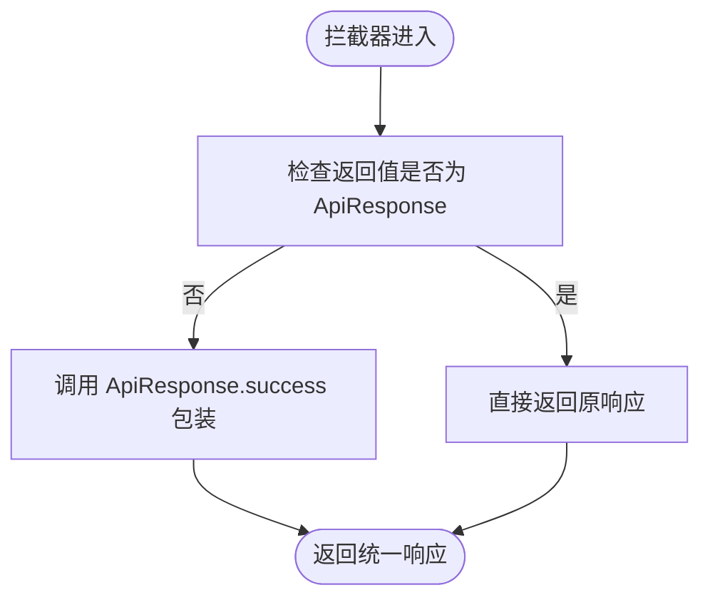
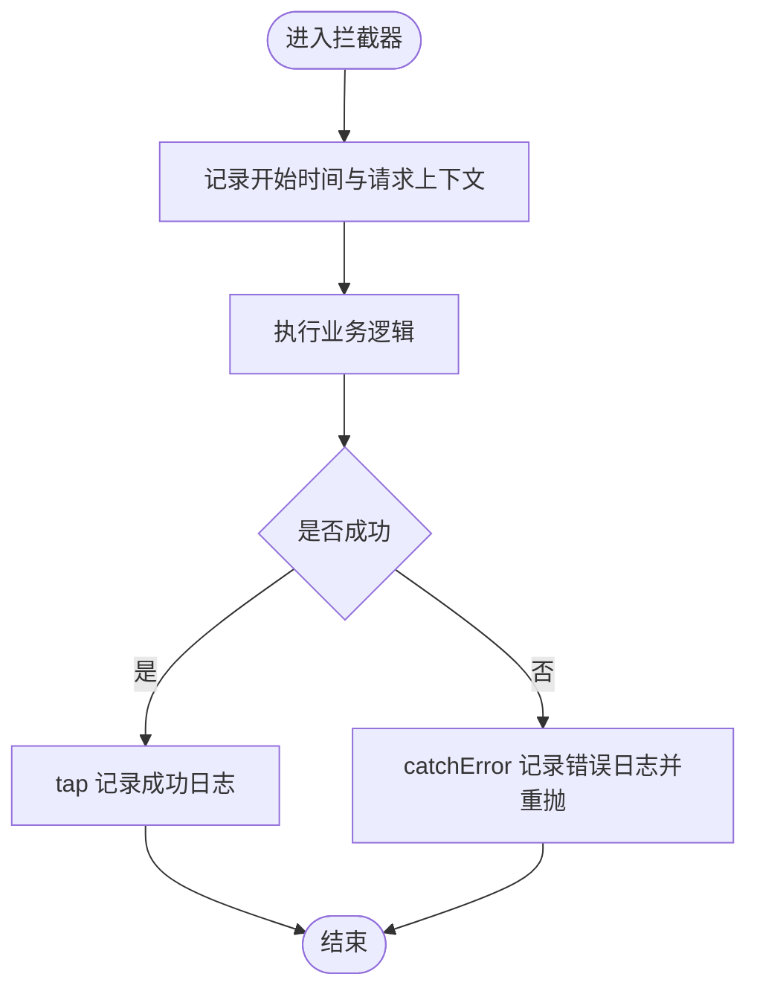
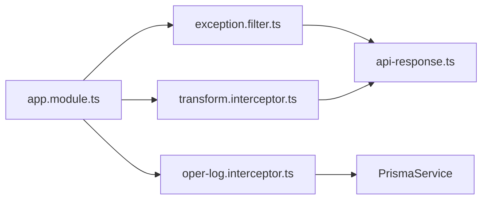

# 过滤器开发

<cite>
**本文引用的文件**
- [apps/backend/src/common/exception.filter.ts](file://apps/backend/src/common/exception.filter.ts)
- [apps/backend/src/common/api-response.ts](file://apps/backend/src/common/api-response.ts)
- [apps/backend/src/app.module.ts](file://apps/backend/src/app.module.ts)
- [apps/backend/src/main.ts](file://apps/backend/src/main.ts)
- [apps/backend/src/common/transform.interceptor.ts](file://apps/backend/src/common/transform.interceptor.ts)
- [apps/backend/src/common/oper-log.interceptor.ts](file://apps/backend/src/common/oper-log.interceptor.ts)
- [apps/backend/src/modules/system/user/user.controller.ts](file://apps/backend/src/modules/system/user/user.controller.ts)
- [apps/backend/src/auth/auth.controller.ts](file://apps/backend/src/auth/auth.controller.ts)
</cite>

## 目录
1. [简介](#简介)
2. [项目结构](#项目结构)
3. [核心组件](#核心组件)
4. [架构总览](#架构总览)
5. [详细组件分析](#详细组件分析)
6. [依赖关系分析](#依赖关系分析)
7. [性能考量](#性能考量)
8. [故障排查指南](#故障排查指南)
9. [结论](#结论)
10. [附录](#附录)

## 简介
本指南面向需要在 NestJS 中开发与集成“过滤器（异常过滤器）”与“统一响应封装”的开发者。内容覆盖：
- 全局异常过滤器与统一响应模型的设计与实现
- 异常类型识别、错误信息格式化与响应状态码设置
- 响应拦截器如何将业务返回自动包装为统一格式
- 操作日志拦截器如何在异常与正常流程中记录审计信息
- 过滤器与拦截器的注册与配置方式
- 最佳实践：错误分类、日志记录与调试技巧
- 完整示例：从错误处理到响应格式化的全流程

## 项目结构
后端采用 NestJS 架构，异常过滤器与统一响应位于公共模块 common 下；应用通过全局注册的方式启用异常过滤器、验证管道与拦截器。

图表来源
- [apps/backend/src/main.ts:1-48](file://apps/backend/src/main.ts#L1-L48)
- [apps/backend/src/app.module.ts:1-59](file://apps/backend/src/app.module.ts#L1-L59)
- [apps/backend/src/common/exception.filter.ts:1-37](file://apps/backend/src/common/exception.filter.ts#L1-L37)
- [apps/backend/src/common/api-response.ts:1-35](file://apps/backend/src/common/api-response.ts#L1-L35)
- [apps/backend/src/common/transform.interceptor.ts:1-29](file://apps/backend/src/common/transform.interceptor.ts#L1-L29)
- [apps/backend/src/common/oper-log.interceptor.ts:1-111](file://apps/backend/src/common/oper-log.interceptor.ts#L1-L111)
- [apps/backend/src/modules/system/user/user.controller.ts:1-89](file://apps/backend/src/modules/system/user/user.controller.ts#L1-L89)
- [apps/backend/src/auth/auth.controller.ts:1-87](file://apps/backend/src/auth/auth.controller.ts#L1-L87)

章节来源
- [apps/backend/src/main.ts:1-48](file://apps/backend/src/main.ts#L1-L48)
- [apps/backend/src/app.module.ts:1-59](file://apps/backend/src/app.module.ts#L1-L59)

## 核心组件
- 全局异常过滤器：捕获未处理异常，识别 HTTP 异常与普通错误，统一输出 ApiResponse 错误格式，并记录日志。
- 统一响应模型：提供 success/error/unauthorized/forbidden/notFound/badRequest 等静态方法，形成前后端一致的响应契约。
- 响应拦截器：将业务返回值自动包装为 ApiResponse.success(data)，避免重复样板代码。
- 操作日志拦截器：在请求生命周期内记录用户、URL、参数、耗时、状态与错误信息，不影响主流程。

章节来源
- [apps/backend/src/common/exception.filter.ts:12-37](file://apps/backend/src/common/exception.filter.ts#L12-L37)
- [apps/backend/src/common/api-response.ts:1-35](file://apps/backend/src/common/api-response.ts#L1-L35)
- [apps/backend/src/common/transform.interceptor.ts:11-29](file://apps/backend/src/common/transform.interceptor.ts#L11-L29)
- [apps/backend/src/common/oper-log.interceptor.ts:11-111](file://apps/backend/src/common/oper-log.interceptor.ts#L11-L111)

## 架构总览
下图展示了请求从进入应用到最终返回的完整路径，以及异常过滤器与响应拦截器的介入点。

图表来源
- [apps/backend/src/common/exception.filter.ts:16-36](file://apps/backend/src/common/exception.filter.ts#L16-L36)
- [apps/backend/src/common/transform.interceptor.ts:15-28](file://apps/backend/src/common/transform.interceptor.ts#L15-L28)
- [apps/backend/src/common/api-response.ts:12-18](file://apps/backend/src/common/api-response.ts#L12-L18)

## 详细组件分析

### 全局异常过滤器（ExceptionFilter）
职责与行为：
- 识别异常类型：优先处理 HttpException，提取状态码与消息；对普通 Error 记录日志并返回 500。
- 统一错误响应：通过 ApiResponse.error 输出统一格式。
- 日志记录：对未处理异常记录错误堆栈以便排查。

图表来源
- [apps/backend/src/common/exception.filter.ts:16-36](file://apps/backend/src/common/exception.filter.ts#L16-L36)
- [apps/backend/src/common/api-response.ts:16-18](file://apps/backend/src/common/api-response.ts#L16-L18)

章节来源
- [apps/backend/src/common/exception.filter.ts:12-37](file://apps/backend/src/common/exception.filter.ts#L12-L37)

### 统一响应模型（ApiResponse）
职责与行为：
- 成功响应：ApiResponse.success(data, message) 返回 code=200 的统一结构。
- 错误响应：提供 error、unauthorized、forbidden、notFound、badRequest 等静态方法，便于按场景返回标准 code。
- 构造函数：支持自定义 code/data/message，默认成功。

图表来源
- [apps/backend/src/common/api-response.ts:1-35](file://apps/backend/src/common/api-response.ts#L1-L35)

章节来源
- [apps/backend/src/common/api-response.ts:1-35](file://apps/backend/src/common/api-response.ts#L1-L35)

### 响应拦截器（NestInterceptor）
职责与行为：
- 将业务返回值包装为 ApiResponse.success(data)。
- 若返回值本身已是 ApiResponse，则直接透传，避免重复包装。
- 通过全局注册生效，确保所有控制器返回统一格式。

图表来源
- [apps/backend/src/common/transform.interceptor.ts:15-28](file://apps/backend/src/common/transform.interceptor.ts#L15-L28)
- [apps/backend/src/common/api-response.ts:12-14](file://apps/backend/src/common/api-response.ts#L12-L14)

章节来源
- [apps/backend/src/common/transform.interceptor.ts:11-29](file://apps/backend/src/common/transform.interceptor.ts#L11-L29)

### 操作日志拦截器（OperLogInterceptor）
职责与行为：
- 在请求进入与异常发生时记录操作日志，包含用户、URL、方法、参数、响应结果、状态、错误信息、耗时与 IP。
- 对敏感字段进行脱敏（如密码、token、authorization、验证码等）。
- 仅对特定路径与非 GET 方法记录，避免噪音。
- 写入数据库失败不中断主流程。

图表来源
- [apps/backend/src/common/oper-log.interceptor.ts:15-28](file://apps/backend/src/common/oper-log.interceptor.ts#L15-L28)
- [apps/backend/src/common/oper-log.interceptor.ts:30-61](file://apps/backend/src/common/oper-log.interceptor.ts#L30-L61)

章节来源
- [apps/backend/src/common/oper-log.interceptor.ts:11-111](file://apps/backend/src/common/oper-log.interceptor.ts#L11-L111)

### 控制器与统一响应的协作
- 控制器返回任意数据，响应拦截器会将其包装为 ApiResponse.success(data)。
- 当控制器内部抛出异常或业务逻辑触发错误，全局异常过滤器捕获并返回 ApiResponse.error(...)。
- 示例：用户管理控制器与认证控制器均遵循该模式，无需手动包装响应。

章节来源
- [apps/backend/src/modules/system/user/user.controller.ts:26-87](file://apps/backend/src/modules/system/user/user.controller.ts#L26-L87)
- [apps/backend/src/auth/auth.controller.ts:13-86](file://apps/backend/src/auth/auth.controller.ts#L13-L86)

## 依赖关系分析
- 全局注册：在 app.module.ts 中通过 APP_FILTER、APP_INTERCEPTOR 提供者注册全局异常过滤器与拦截器。
- 启动配置：main.ts 设置全局前缀、CORS、Swagger 文档与静态资源。
- 组件耦合：异常过滤器依赖 ApiResponse；响应拦截器依赖 ApiResponse；操作日志拦截器依赖 PrismaService。

图表来源
- [apps/backend/src/app.module.ts:39-56](file://apps/backend/src/app.module.ts#L39-L56)
- [apps/backend/src/common/exception.filter.ts:10](file://apps/backend/src/common/exception.filter.ts#L10)
- [apps/backend/src/common/transform.interceptor.ts:9](file://apps/backend/src/common/transform.interceptor.ts#L9)
- [apps/backend/src/common/oper-log.interceptor.ts:9](file://apps/backend/src/common/oper-log.interceptor.ts#L9)

章节来源
- [apps/backend/src/app.module.ts:1-59](file://apps/backend/src/app.module.ts#L1-L59)
- [apps/backend/src/main.ts:1-48](file://apps/backend/src/main.ts#L1-L48)

## 性能考量
- 拦截器链路开销：响应拦截器与操作日志拦截器均为轻量处理，通常对性能影响可忽略。
- 日志写入：操作日志写库失败不会中断请求，但建议关注数据库写入延迟与索引设计。
- 异常过滤器：仅在异常发生时触发，正常路径无额外开销。
- 建议：对高频接口开启缓存、合理设置限流策略，避免异常风暴。

## 故障排查指南
- 未生效的全局异常过滤器
  - 检查 app.module.ts 是否正确提供 APP_FILTER。
  - 确认 main.ts 已创建 Nest 应用实例。
- 响应未被统一包装
  - 确认响应拦截器已通过 APP_INTERCEPTOR 全局注册。
  - 避免在控制器中直接返回 ApiResponse 实例（虽然允许，但可能造成重复包装）。
- 操作日志缺失
  - 检查 shouldLog 条件：GET 请求、特定监控路径会被排除。
  - 确认用户上下文存在且 PrismaService 可用。
- 调试技巧
  - 在异常过滤器中增加更详细的上下文日志（如请求 ID、用户 ID）。
  - 使用 Swagger 测试接口，观察统一响应结构。
  - 对敏感字段进行脱敏确认（密码、token 等）。

章节来源
- [apps/backend/src/app.module.ts:39-56](file://apps/backend/src/app.module.ts#L39-L56)
- [apps/backend/src/common/oper-log.interceptor.ts:63-70](file://apps/backend/src/common/oper-log.interceptor.ts#L63-L70)

## 结论
通过全局异常过滤器与统一响应模型，结合响应拦截器与操作日志拦截器，本项目实现了：
- 明确的错误处理与统一的错误响应格式
- 自动化的成功响应包装，减少样板代码
- 可观测的操作日志与安全的敏感信息脱敏
- 易于扩展与维护的过滤器体系

## 附录

### 注册与配置方法
- 全局异常过滤器注册：在 app.module.ts 的 providers 中通过 APP_FILTER 提供全局异常过滤器。
- 全局响应拦截器注册：通过 APP_INTERCEPTOR 提供 TransformInterceptor。
- 全局操作日志拦截器注册：通过 APP_INTERCEPTOR 提供 OperLogInterceptor。
- 全局验证管道：在 main.ts 中使用 ValidationPipe，开启转换与白名单校验。

章节来源
- [apps/backend/src/app.module.ts:39-56](file://apps/backend/src/app.module.ts#L39-L56)
- [apps/backend/src/main.ts:17-24](file://apps/backend/src/main.ts#L17-L24)

### 开发最佳实践
- 错误分类：优先使用 HttpException 并指定明确的状态码与消息，便于前端统一处理。
- 统一响应：业务层只关心数据，拦截器负责包装；异常层负责格式化错误。
- 日志记录：在异常过滤器与操作日志拦截器中分别记录上下文信息，便于定位问题。
- 调试技巧：利用 Swagger 快速验证统一响应；对敏感字段进行脱敏；对高频接口做缓存与限流。

### 完整示例（从错误处理到响应格式化）
- 步骤 1：控制器返回数据或抛出异常
- 步骤 2：响应拦截器将返回值包装为 ApiResponse.success(...)
- 步骤 3：若发生异常，全局异常过滤器捕获并返回 ApiResponse.error(...)
- 步骤 4：操作日志拦截器记录请求与响应信息（含错误）

章节来源
- [apps/backend/src/modules/system/user/user.controller.ts:26-87](file://apps/backend/src/modules/system/user/user.controller.ts#L26-L87)
- [apps/backend/src/common/transform.interceptor.ts:15-28](file://apps/backend/src/common/transform.interceptor.ts#L15-L28)
- [apps/backend/src/common/exception.filter.ts:16-36](file://apps/backend/src/common/exception.filter.ts#L16-L36)
- [apps/backend/src/common/oper-log.interceptor.ts:15-28](file://apps/backend/src/common/oper-log.interceptor.ts#L15-L28)