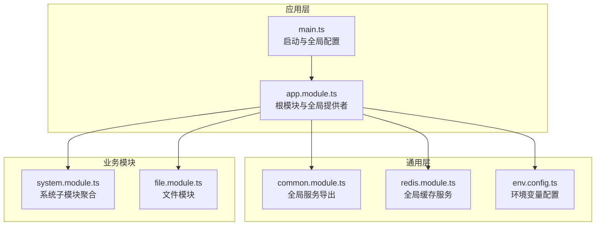
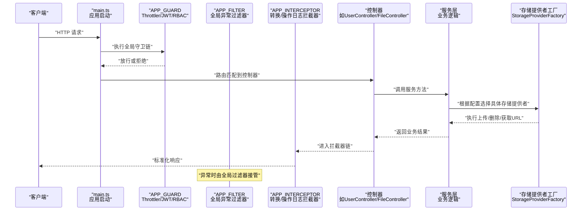
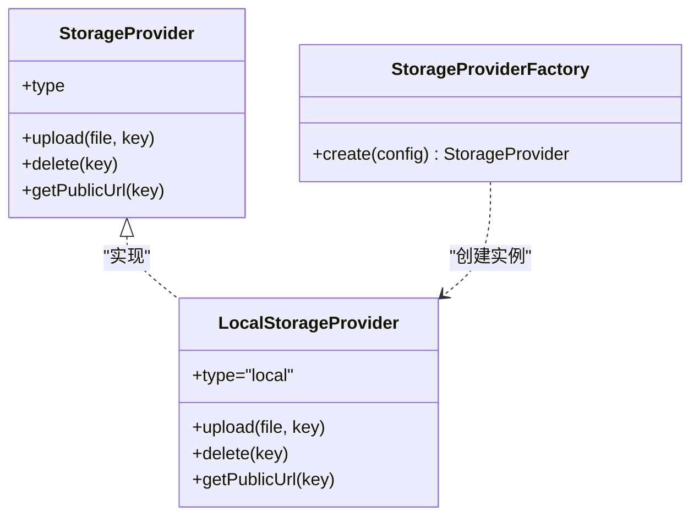
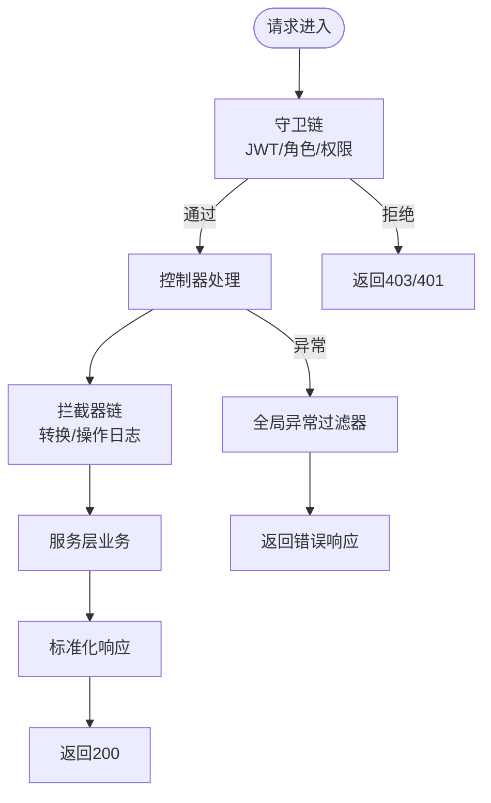
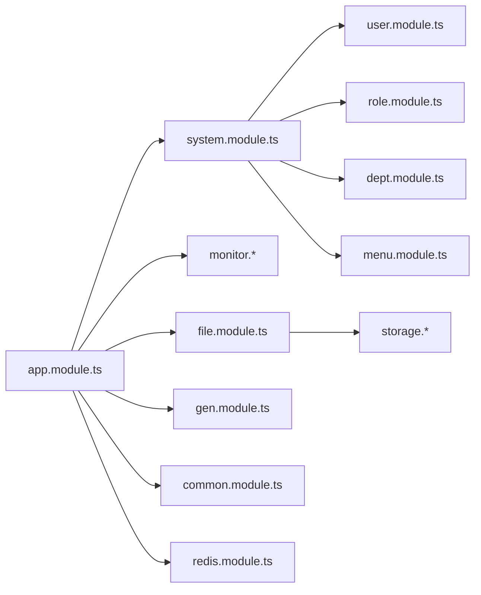

# 扩展开发

<cite>
**本文引用的文件**
- [apps/backend/src/app.module.ts](file://apps/backend/src/app.module.ts)
- [apps/backend/src/main.ts](file://apps/backend/src/main.ts)
- [apps/backend/src/common/common.module.ts](file://apps/backend/src/common/common.module.ts)
- [apps/backend/src/cache/redis.module.ts](file://apps/backend/src/cache/redis.module.ts)
- [apps/backend/src/config/env.config.ts](file://apps/backend/src/config/env.config.ts)
- [apps/backend/src/modules/file/file.module.ts](file://apps/backend/src/modules/file/file.module.ts)
- [apps/backend/src/modules/file/file.controller.ts](file://apps/backend/src/modules/file/file.controller.ts)
- [apps/backend/src/modules/file/storage/storage-provider.factory.ts](file://apps/backend/src/modules/file/storage/storage-provider.factory.ts)
- [apps/backend/src/modules/file/storage/storage.types.ts](file://apps/backend/src/modules/file/storage/storage.types.ts)
- [apps/backend/src/modules/file/storage/local.provider.ts](file://apps/backend/src/modules/file/storage/local.provider.ts)
- [apps/backend/src/auth/guards.ts](file://apps/backend/src/auth/guards.ts)
- [apps/backend/src/common/exception.filter.ts](file://apps/backend/src/common/exception.filter.ts)
- [apps/backend/src/common/transform.interceptor.ts](file://apps/backend/src/common/transform.interceptor.ts)
- [apps/backend/src/modules/system/system.module.ts](file://apps/backend/src/modules/system/system.module.ts)
- [apps/backend/src/modules/system/user/user.controller.ts](file://apps/backend/src/modules/system/user/user.controller.ts)
</cite>

## 目录
1. 引言
2. 项目结构
3. 核心组件
4. 架构总览
5. 详细组件分析
6. 依赖分析
7. 性能考虑
8. 故障排查指南
9. 结论
10. 附录

## 引言
本指南面向希望在现有架构基础上进行扩展开发的工程师，系统讲解如何新增功能模块、配置依赖注入与路由注册、实现插件化的文件存储提供者、开发自定义中间件（守卫/过滤器/拦截器）、对接第三方服务（如OAuth、消息队列、搜索引擎），以及编写可复用的自定义组件与API扩展。文档同时提供测试与质量保障建议，帮助你在保持系统一致性的同时高效迭代。

## 项目结构
后端采用NestJS单体架构，核心入口为应用模块，全局注册配置、守卫、过滤器与拦截器，并通过模块化组织业务域（如系统管理、监控、文件、代码生成等）。前端包含多套UI方案（uni-app、vben-admin等），但扩展开发主要围绕后端模块与通用基础设施展开。

图表来源
- [apps/backend/src/main.ts:1-48](file://apps/backend/src/main.ts#L1-L48)
- [apps/backend/src/app.module.ts:1-59](file://apps/backend/src/app.module.ts#L1-L59)
- [apps/backend/src/common/common.module.ts:1-9](file://apps/backend/src/common/common.module.ts#L1-L9)
- [apps/backend/src/cache/redis.module.ts:1-9](file://apps/backend/src/cache/redis.module.ts#L1-L9)
- [apps/backend/src/config/env.config.ts:1-47](file://apps/backend/src/config/env.config.ts#L1-L47)
- [apps/backend/src/modules/system/system.module.ts:1-23](file://apps/backend/src/modules/system/system.module.ts#L1-L23)
- [apps/backend/src/modules/file/file.module.ts:1-10](file://apps/backend/src/modules/file/file.module.ts#L1-L10)

章节来源
- [apps/backend/src/app.module.ts:18-58](file://apps/backend/src/app.module.ts#L18-L58)
- [apps/backend/src/main.ts:8-46](file://apps/backend/src/main.ts#L8-L46)

## 核心组件
- 应用模块：集中导入各业务模块与通用模块，注册全局守卫、过滤器、拦截器，统一对外暴露服务。
- 全局异常过滤器：统一捕获未处理异常，返回标准化响应。
- 全局数据转换拦截器：统一包装响应体为标准格式。
- 配置模块：集中加载环境变量，支持应用、数据库、Redis、邮件、微信等配置分组。
- 文件模块：提供文件上传、列表、删除、预览等功能，支持多种云存储或本地存储的插件化提供者。
- 守卫：基于元数据的角色与权限守卫，配合JWT守卫实现细粒度访问控制。

章节来源
- [apps/backend/src/app.module.ts:39-56](file://apps/backend/src/app.module.ts#L39-L56)
- [apps/backend/src/common/exception.filter.ts:12-37](file://apps/backend/src/common/exception.filter.ts#L12-L37)
- [apps/backend/src/common/transform.interceptor.ts:11-29](file://apps/backend/src/common/transform.interceptor.ts#L11-L29)
- [apps/backend/src/config/env.config.ts:3-47](file://apps/backend/src/config/env.config.ts#L3-L47)
- [apps/backend/src/modules/file/file.module.ts:1-10](file://apps/backend/src/modules/file/file.module.ts#L1-L10)
- [apps/backend/src/auth/guards.ts:19-51](file://apps/backend/src/auth/guards.ts#L19-L51)

## 架构总览
下图展示从请求进入至响应返回的关键路径，包括路由、守卫、控制器、服务与存储提供者的交互关系。

图表来源
- [apps/backend/src/main.ts:8-46](file://apps/backend/src/main.ts#L8-L46)
- [apps/backend/src/app.module.ts:39-56](file://apps/backend/src/app.module.ts#L39-L56)
- [apps/backend/src/modules/system/user/user.controller.ts:20-89](file://apps/backend/src/modules/system/user/user.controller.ts#L20-L89)
- [apps/backend/src/modules/file/file.controller.ts:32-100](file://apps/backend/src/modules/file/file.controller.ts#L32-L100)
- [apps/backend/src/modules/file/storage/storage-provider.factory.ts:8-25](file://apps/backend/src/modules/file/storage/storage-provider.factory.ts#L8-L25)

## 详细组件分析

### 模块创建规范与路由注册
- 新增模块步骤
  - 在对应业务目录创建模块文件与控制器/服务/DTO等文件。
  - 在模块中声明控制器与提供者，并按需导出服务供其他模块使用。
  - 在根模块或父级聚合模块中引入该模块。
- 路由注册
  - 控制器通过装饰器声明路由前缀与方法，例如用户模块的控制器使用“system/user”作为前缀。
  - 全局前缀在应用启动时设置为“api”，所有路由自动带上该前缀。
- 访问控制
  - 使用守卫装饰器对控制器或方法进行保护，结合权限元数据实现细粒度授权。
- 示例参考
  - 用户模块控制器与系统模块聚合：[apps/backend/src/modules/system/user/user.controller.ts:20-89](file://apps/backend/src/modules/system/user/user.controller.ts#L20-L89)，[apps/backend/src/modules/system/system.module.ts:11-23](file://apps/backend/src/modules/system/system.module.ts#L11-L23)。
  - 文件模块控制器与模块定义：[apps/backend/src/modules/file/file.controller.ts:32-100](file://apps/backend/src/modules/file/file.controller.ts#L32-L100)，[apps/backend/src/modules/file/file.module.ts:1-10](file://apps/backend/src/modules/file/file.module.ts#L1-L10)。
  - 应用启动设置全局前缀与Swagger：[apps/backend/src/main.ts:14-35](file://apps/backend/src/main.ts#L14-L35)。

章节来源
- [apps/backend/src/modules/system/user/user.controller.ts:20-89](file://apps/backend/src/modules/system/user/user.controller.ts#L20-L89)
- [apps/backend/src/modules/system/system.module.ts:11-23](file://apps/backend/src/modules/system/system.module.ts#L11-L23)
- [apps/backend/src/modules/file/file.controller.ts:32-100](file://apps/backend/src/modules/file/file.controller.ts#L32-L100)
- [apps/backend/src/modules/file/file.module.ts:1-10](file://apps/backend/src/modules/file/file.module.ts#L1-L10)
- [apps/backend/src/main.ts:14-35](file://apps/backend/src/main.ts#L14-L35)

### 依赖注入配置与全局提供者
- 全局守卫/过滤器/拦截器
  - 在根模块的providers中以“provide + useClass”的形式注册，作用于整个应用。
  - 包含限流守卫、全局异常过滤器、数据转换拦截器与操作日志拦截器。
- 全局服务
  - 通过全局模块导出服务，确保跨模块可用，如数据库服务与Redis服务。
- 环境配置
  - 使用ConfigModule加载多组配置，如应用、数据库、Redis、邮件、微信等。
- 参考
  - 根模块提供者注册：[apps/backend/src/app.module.ts:39-56](file://apps/backend/src/app.module.ts#L39-L56)。
  - 全局数据库服务导出：[apps/backend/src/common/common.module.ts:4-9](file://apps/backend/src/common/common.module.ts#L4-L9)。
  - 全局Redis服务导出：[apps/backend/src/cache/redis.module.ts:4-9](file://apps/backend/src/cache/redis.module.ts#L4-L9)。
  - 环境配置分组：[apps/backend/src/config/env.config.ts:3-47](file://apps/backend/src/config/env.config.ts#L3-L47)。

章节来源
- [apps/backend/src/app.module.ts:39-56](file://apps/backend/src/app.module.ts#L39-L56)
- [apps/backend/src/common/common.module.ts:4-9](file://apps/backend/src/common/common.module.ts#L4-L9)
- [apps/backend/src/cache/redis.module.ts:4-9](file://apps/backend/src/cache/redis.module.ts#L4-L9)
- [apps/backend/src/config/env.config.ts:3-47](file://apps/backend/src/config/env.config.ts#L3-L47)

### 插件系统：文件存储提供者的扩展机制
- 存储类型与接口
  - 定义统一的存储提供者接口与配置类型，确保不同云厂商或本地存储具备一致行为。
- 工厂模式
  - 通过工厂根据配置动态选择具体提供者，便于扩展新存储提供商。
- 已有实现
  - 本地存储提供者示例展示了上传、删除、生成公开URL等能力。
- 新存储提供商集成步骤
  - 实现统一接口；在工厂中注册新类型分支；在配置中新增相关键值；在控制器或服务中读取配置并调用工厂创建实例。
- 参考
  - 存储类型与接口：[apps/backend/src/modules/file/storage/storage.types.ts:3-43](file://apps/backend/src/modules/file/storage/storage.types.ts#L3-L43)。
  - 工厂选择逻辑：[apps/backend/src/modules/file/storage/storage-provider.factory.ts:8-25](file://apps/backend/src/modules/file/storage/storage-provider.factory.ts#L8-L25)。
  - 本地存储实现：[apps/backend/src/modules/file/storage/local.provider.ts:6-46](file://apps/backend/src/modules/file/storage/local.provider.ts#L6-L46)。

图表来源
- [apps/backend/src/modules/file/storage/storage.types.ts:33-43](file://apps/backend/src/modules/file/storage/storage.types.ts#L33-L43)
- [apps/backend/src/modules/file/storage/local.provider.ts:6-46](file://apps/backend/src/modules/file/storage/local.provider.ts#L6-L46)
- [apps/backend/src/modules/file/storage/storage-provider.factory.ts:8-25](file://apps/backend/src/modules/file/storage/storage-provider.factory.ts#L8-L25)

章节来源
- [apps/backend/src/modules/file/storage/storage.types.ts:3-43](file://apps/backend/src/modules/file/storage/storage.types.ts#L3-L43)
- [apps/backend/src/modules/file/storage/storage-provider.factory.ts:8-25](file://apps/backend/src/modules/file/storage/storage-provider.factory.ts#L8-L25)
- [apps/backend/src/modules/file/storage/local.provider.ts:6-46](file://apps/backend/src/modules/file/storage/local.provider.ts#L6-L46)

### 自定义中间件：守卫、过滤器、拦截器
- 守卫
  - 角色与权限守卫通过反射读取元数据，结合JWT上下文判断是否放行。
- 过滤器
  - 全局异常过滤器统一捕获错误并返回标准化响应。
- 拦截器
  - 数据转换拦截器将业务返回值包装为统一格式；操作日志拦截器用于记录操作日志。
- 注册方式
  - 在根模块以全局提供者注册，或在控制器/方法上局部使用装饰器。
- 参考
  - 守卫实现与元数据：[apps/backend/src/auth/guards.ts:19-51](file://apps/backend/src/auth/guards.ts#L19-L51)。
  - 全局异常过滤器：[apps/backend/src/common/exception.filter.ts:12-37](file://apps/backend/src/common/exception.filter.ts#L12-L37)。
  - 数据转换拦截器：[apps/backend/src/common/transform.interceptor.ts:11-29](file://apps/backend/src/common/transform.interceptor.ts#L11-L29)。
  - 根模块全局提供者：[apps/backend/src/app.module.ts:39-56](file://apps/backend/src/app.module.ts#L39-L56)。

图表来源
- [apps/backend/src/auth/guards.ts:19-51](file://apps/backend/src/auth/guards.ts#L19-L51)
- [apps/backend/src/common/exception.filter.ts:12-37](file://apps/backend/src/common/exception.filter.ts#L12-L37)
- [apps/backend/src/common/transform.interceptor.ts:11-29](file://apps/backend/src/common/transform.interceptor.ts#L11-L29)
- [apps/backend/src/app.module.ts:39-56](file://apps/backend/src/app.module.ts#L39-L56)

章节来源
- [apps/backend/src/auth/guards.ts:19-51](file://apps/backend/src/auth/guards.ts#L19-L51)
- [apps/backend/src/common/exception.filter.ts:12-37](file://apps/backend/src/common/exception.filter.ts#L12-L37)
- [apps/backend/src/common/transform.interceptor.ts:11-29](file://apps/backend/src/common/transform.interceptor.ts#L11-L29)
- [apps/backend/src/app.module.ts:39-56](file://apps/backend/src/app.module.ts#L39-L56)

### 第三方服务集成方法
- OAuth认证
  - 建议在鉴权模块中新增策略与控制器，使用策略装饰器与守卫实现登录/登出流程，并在全局配置中新增相关键值。
- 消息队列
  - 可在通用模块中封装队列服务，通过配置模块加载连接参数，在业务模块中以依赖注入方式使用。
- 搜索引擎
  - 在业务模块中新增服务，封装搜索SDK，统一异常与日志处理，避免污染控制器。
- 邮件服务
  - 可参考现有邮件配置分组，新增邮件服务模块并在需要处注入使用。
- 微信服务
  - 可参考微信配置分组，新增微信服务模块与控制器，实现公众号/小程序相关能力。
- 参考
  - 配置分组示例：[apps/backend/src/config/env.config.ts:35-46](file://apps/backend/src/config/env.config.ts#L35-L46)。

章节来源
- [apps/backend/src/config/env.config.ts:35-46](file://apps/backend/src/config/env.config.ts#L35-L46)

### 自定义组件开发规范与最佳实践
- 组件职责单一：每个组件专注于特定领域，避免过度耦合。
- 依赖注入：优先通过构造函数注入服务，便于测试与替换。
- 配置驱动：敏感信息与可变参数通过配置模块集中管理。
- 错误处理：统一在过滤器与拦截器中处理，保证响应一致性。
- 文档与注释：为公共接口添加Swagger注解，提升可维护性。
- 参考
  - 全局异常过滤器与拦截器：[apps/backend/src/common/exception.filter.ts:12-37](file://apps/backend/src/common/exception.filter.ts#L12-L37)，[apps/backend/src/common/transform.interceptor.ts:11-29](file://apps/backend/src/common/transform.interceptor.ts#L11-L29)。

章节来源
- [apps/backend/src/common/exception.filter.ts:12-37](file://apps/backend/src/common/exception.filter.ts#L12-L37)
- [apps/backend/src/common/transform.interceptor.ts:11-29](file://apps/backend/src/common/transform.interceptor.ts#L11-L29)

### API扩展：新增接口与修改现有接口
- 新增接口
  - 在目标模块中新增控制器方法，使用Swagger注解描述接口，配合守卫与DTO校验。
  - 在根模块或聚合模块中注册新模块，确保路由生效。
- 修改现有接口
  - 保持URL与语义稳定，通过DTO版本化或查询参数兼容旧版本。
  - 在过滤器与拦截器中保留原有响应格式，避免破坏客户端适配。
- 参考
  - 用户模块控制器示例：[apps/backend/src/modules/system/user/user.controller.ts:20-89](file://apps/backend/src/modules/system/user/user.controller.ts#L20-L89)。
  - 文件模块控制器示例：[apps/backend/src/modules/file/file.controller.ts:32-100](file://apps/backend/src/modules/file/file.controller.ts#L32-L100)。

章节来源
- [apps/backend/src/modules/system/user/user.controller.ts:20-89](file://apps/backend/src/modules/system/user/user.controller.ts#L20-L89)
- [apps/backend/src/modules/file/file.controller.ts:32-100](file://apps/backend/src/modules/file/file.controller.ts#L32-L100)

### 配置扩展：新增配置项与修改现有配置
- 新增配置项
  - 在配置模块中新增分组与键值，使用registerAs注册，确保默认值与类型安全。
  - 在控制器或服务中通过ConfigService读取配置，避免硬编码。
- 修改现有配置
  - 保持键名向后兼容，新增别名键并在未来版本移除旧键。
- 参考
  - 环境配置分组与默认值：[apps/backend/src/config/env.config.ts:3-47](file://apps/backend/src/config/env.config.ts#L3-L47)。

章节来源
- [apps/backend/src/config/env.config.ts:3-47](file://apps/backend/src/config/env.config.ts#L3-L47)

## 依赖分析
- 模块间依赖
  - 根模块聚合系统、监控、文件、代码生成等模块；系统模块进一步聚合用户、角色、菜单等子模块。
  - 文件模块依赖通用模块提供的数据库服务与Redis模块提供的缓存服务。
- 全局依赖
  - 全局守卫、过滤器、拦截器贯穿所有控制器；全局模块导出的服务在任意模块均可注入。
- 外部依赖
  - Swagger用于接口文档；Multer用于文件上传；Prisma用于数据库访问；Redis用于缓存。

图表来源
- [apps/backend/src/app.module.ts:18-58](file://apps/backend/src/app.module.ts#L18-L58)
- [apps/backend/src/modules/system/system.module.ts:11-23](file://apps/backend/src/modules/system/system.module.ts#L11-L23)
- [apps/backend/src/modules/file/file.module.ts:1-10](file://apps/backend/src/modules/file/file.module.ts#L1-L10)
- [apps/backend/src/common/common.module.ts:4-9](file://apps/backend/src/common/common.module.ts#L4-L9)
- [apps/backend/src/cache/redis.module.ts:4-9](file://apps/backend/src/cache/redis.module.ts#L4-L9)

章节来源
- [apps/backend/src/app.module.ts:18-58](file://apps/backend/src/app.module.ts#L18-L58)
- [apps/backend/src/modules/system/system.module.ts:11-23](file://apps/backend/src/modules/system/system.module.ts#L11-L23)
- [apps/backend/src/modules/file/file.module.ts:1-10](file://apps/backend/src/modules/file/file.module.ts#L1-L10)
- [apps/backend/src/common/common.module.ts:4-9](file://apps/backend/src/common/common.module.ts#L4-L9)
- [apps/backend/src/cache/redis.module.ts:4-9](file://apps/backend/src/cache/redis.module.ts#L4-L9)

## 性能考虑
- 限流与并发
  - 使用全局限流守卫控制请求频率，避免突发流量冲击。
- 缓存策略
  - 利用Redis模块提供的缓存服务，对热点数据与计算结果进行缓存。
- 文件上传
  - 合理设置上传大小限制与存储位置，避免磁盘空间与IO瓶颈。
- 日志与监控
  - 操作日志拦截器可用于审计与性能分析，建议结合外部监控系统。

## 故障排查指南
- 接口返回错误
  - 检查全局异常过滤器是否正确捕获并返回标准化错误信息。
- 响应格式异常
  - 确认拦截器链是否被正确应用，避免业务返回值未被包装。
- 权限拒绝
  - 检查守卫元数据与用户权限集合，确认角色与权限是否匹配。
- 存储异常
  - 检查存储提供者配置与工厂选择逻辑，确认当前使用的存储类型与参数。
- 参考
  - 全局异常过滤器：[apps/backend/src/common/exception.filter.ts:12-37](file://apps/backend/src/common/exception.filter.ts#L12-L37)。
  - 数据转换拦截器：[apps/backend/src/common/transform.interceptor.ts:11-29](file://apps/backend/src/common/transform.interceptor.ts#L11-L29)。
  - 守卫实现：[apps/backend/src/auth/guards.ts:19-51](file://apps/backend/src/auth/guards.ts#L19-L51)。
  - 存储工厂与提供者：[apps/backend/src/modules/file/storage/storage-provider.factory.ts:8-25](file://apps/backend/src/modules/file/storage/storage-provider.factory.ts#L8-L25)，[apps/backend/src/modules/file/storage/local.provider.ts:6-46](file://apps/backend/src/modules/file/storage/local.provider.ts#L6-L46)。

章节来源
- [apps/backend/src/common/exception.filter.ts:12-37](file://apps/backend/src/common/exception.filter.ts#L12-L37)
- [apps/backend/src/common/transform.interceptor.ts:11-29](file://apps/backend/src/common/transform.interceptor.ts#L11-L29)
- [apps/backend/src/auth/guards.ts:19-51](file://apps/backend/src/auth/guards.ts#L19-L51)
- [apps/backend/src/modules/file/storage/storage-provider.factory.ts:8-25](file://apps/backend/src/modules/file/storage/storage-provider.factory.ts#L8-L25)
- [apps/backend/src/modules/file/storage/local.provider.ts:6-46](file://apps/backend/src/modules/file/storage/local.provider.ts#L6-L46)

## 结论
通过模块化、依赖注入与插件化设计，本项目提供了清晰的扩展路径。遵循本文的模块创建规范、路由与守卫/过滤器/拦截器注册流程、配置扩展机制与第三方服务集成方法，即可在不破坏现有架构的前提下快速迭代新功能。建议在每次扩展后完善测试与文档，确保系统的稳定性与可维护性。

## 附录
- 快速检查清单
  - 是否在根模块或聚合模块中注册了新模块？
  - 是否为新接口添加了Swagger注解与必要的守卫/DTO校验？
  - 是否在配置模块中新增了必要键值并设置了合理默认值？
  - 是否实现了统一的异常处理与响应包装？
  - 是否为新存储提供者实现了接口并在工厂中注册？