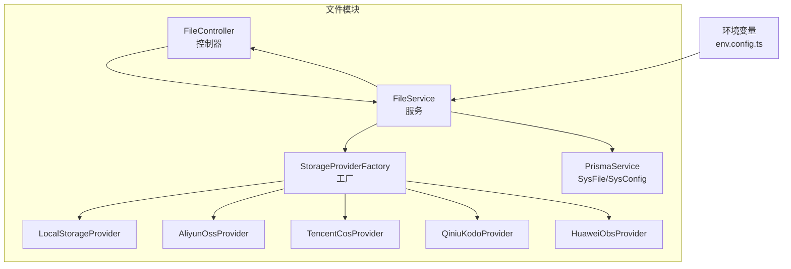
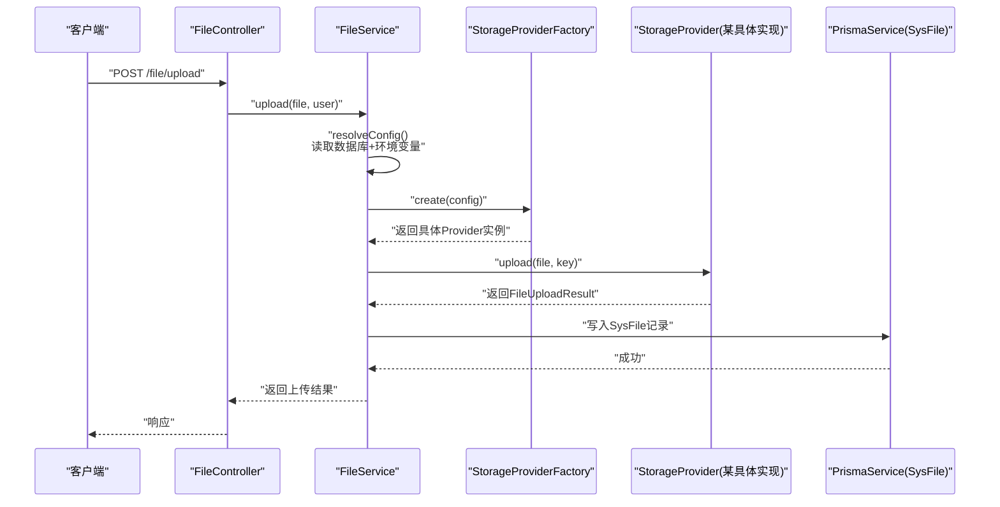
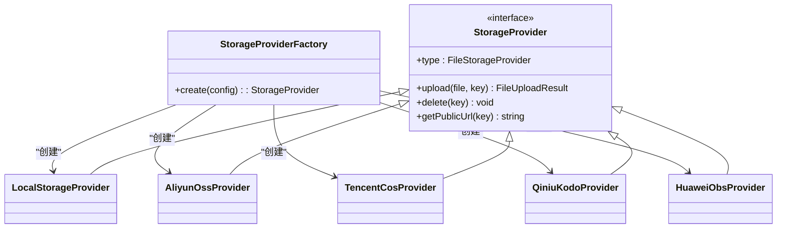
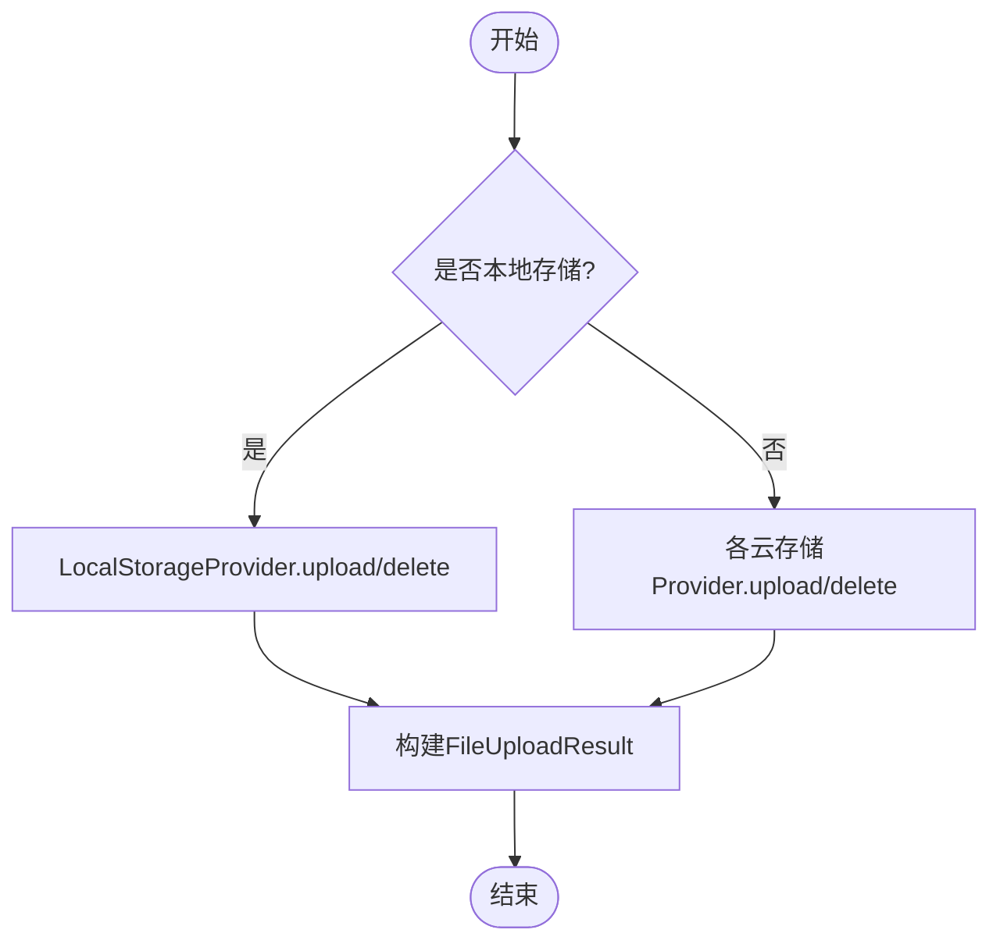
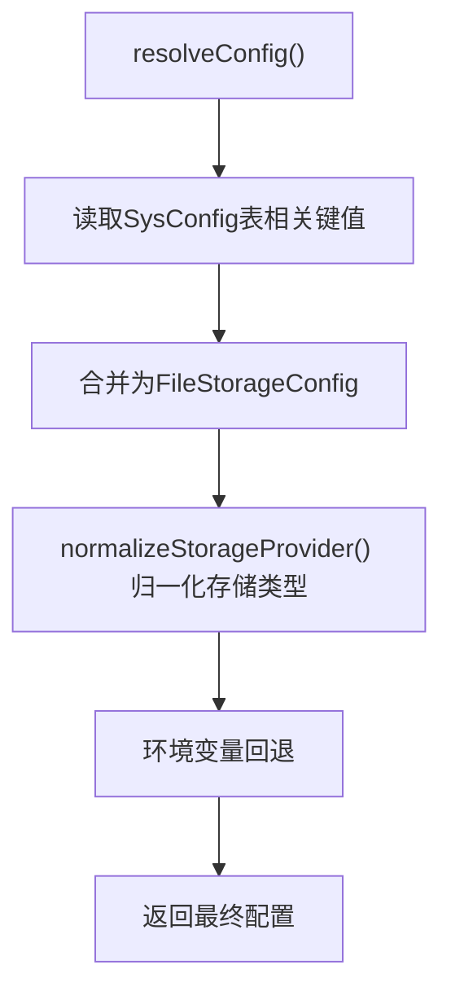
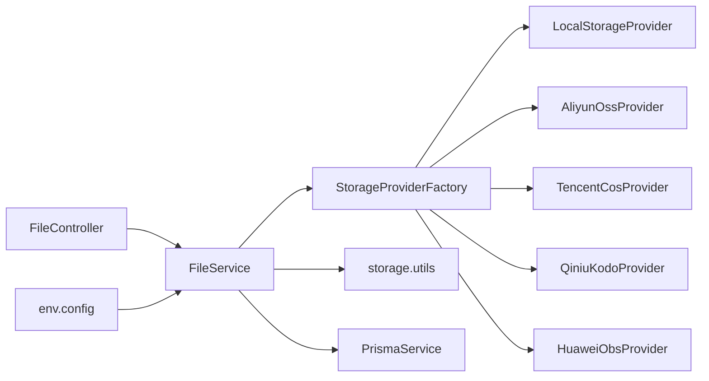

# 插件系统

<cite>
**本文引用的文件**
- [apps/backend/src/modules/file/storage/storage-provider.factory.ts](file://apps/backend/src/modules/file/storage/storage-provider.factory.ts)
- [apps/backend/src/modules/file/storage/storage.types.ts](file://apps/backend/src/modules/file/storage/storage.types.ts)
- [apps/backend/src/modules/file/storage/storage.utils.ts](file://apps/backend/src/modules/file/storage/storage.utils.ts)
- [apps/backend/src/modules/file/storage/local.provider.ts](file://apps/backend/src/modules/file/storage/local.provider.ts)
- [apps/backend/src/modules/file/storage/aliyun-oss.provider.ts](file://apps/backend/src/modules/file/storage/aliyun-oss.provider.ts)
- [apps/backend/src/modules/file/storage/huawei-obs.provider.ts](file://apps/backend/src/modules/file/storage/huawei-obs.provider.ts)
- [apps/backend/src/modules/file/storage/qiniu-kodo.provider.ts](file://apps/backend/src/modules/file/storage/qiniu-kodo.provider.ts)
- [apps/backend/src/modules/file/storage/tencent-cos.provider.ts](file://apps/backend/src/modules/file/storage/tencent-cos.provider.ts)
- [apps/backend/src/modules/file/file.service.ts](file://apps/backend/src/modules/file/file.service.ts)
- [apps/backend/src/modules/file/file.controller.ts](file://apps/backend/src/modules/file/file.controller.ts)
- [apps/backend/src/modules/file/file.module.ts](file://apps/backend/src/modules/file/file.module.ts)
- [apps/backend/src/config/env.config.ts](file://apps/backend/src/config/env.config.ts)
- [apps/backend/prisma/schema.prisma](file://apps/backend/prisma/schema.prisma)
</cite>

## 目录
1. [简介](#简介)
2. [项目结构](#项目结构)
3. [核心组件](#核心组件)
4. [架构总览](#架构总览)
5. [详细组件分析](#详细组件分析)
6. [依赖关系分析](#依赖关系分析)
7. [性能考虑](#性能考虑)
8. [故障排查指南](#故障排查指南)
9. [结论](#结论)
10. [附录：插件开发完整示例](#附录插件开发完整示例)

## 简介
本文件系统性梳理并文档化了后端“文件存储插件系统”的架构与实现，涵盖：
- 工厂模式的插件注册与运行时动态加载
- 存储提供者接口的统一抽象与实现
- 配置管理（数据库持久化配置 + 环境变量回退）
- 生命周期管理（初始化、运行时状态监控、优雅关闭）
- 新存储提供商的开发流程与最佳实践
- 完整的插件开发示例（从接口设计到具体实现）

该系统以“可插拔”为目标，通过统一的接口与工厂，支持本地存储与多家云存储（阿里云 OSS、腾讯 COS、七牛 Kodo、华为 OBS）的无缝切换。

## 项目结构
文件存储子系统位于后端应用中，采用按功能域划分的模块化组织：
- 控制器层：对外暴露文件上传、下载、列表、删除等接口
- 服务层：负责业务逻辑、配置解析、调用存储插件
- 插件层：以工厂模式管理多种存储提供者实现
- 配置层：数据库配置 + 环境变量回退
- 数据模型：使用 Prisma 的 SysFile/SysConfig 模型持久化文件元数据与系统配置

图表来源
- [apps/backend/src/modules/file/file.controller.ts:1-100](file://apps/backend/src/modules/file/file.controller.ts#L1-L100)
- [apps/backend/src/modules/file/file.service.ts:1-310](file://apps/backend/src/modules/file/file.service.ts#L1-L310)
- [apps/backend/src/modules/file/storage/storage-provider.factory.ts:1-25](file://apps/backend/src/modules/file/storage/storage-provider.factory.ts#L1-L25)
- [apps/backend/src/config/env.config.ts:1-47](file://apps/backend/src/config/env.config.ts#L1-L47)
- [apps/backend/prisma/schema.prisma:152-207](file://apps/backend/prisma/schema.prisma#L152-L207)

章节来源
- [apps/backend/src/modules/file/file.module.ts:1-10](file://apps/backend/src/modules/file/file.module.ts#L1-L10)
- [apps/backend/src/modules/file/file.controller.ts:1-100](file://apps/backend/src/modules/file/file.controller.ts#L1-L100)
- [apps/backend/src/modules/file/file.service.ts:1-310](file://apps/backend/src/modules/file/file.service.ts#L1-L310)

## 核心组件
- 存储提供者接口与类型定义：统一的上传、删除、获取公开 URL 的能力，以及配置结构体
- 工厂类：根据配置选择具体提供者实例
- 多种提供者实现：本地文件系统与多家云存储 SDK 封装
- 工具函数：随机命名、对象键生成、URL 构建、配置校验与规范化
- 服务与控制器：封装业务流程、配置持久化与环境变量回退、文件预览与删除

章节来源
- [apps/backend/src/modules/file/storage/storage.types.ts:1-43](file://apps/backend/src/modules/file/storage/storage.types.ts#L1-L43)
- [apps/backend/src/modules/file/storage/storage-provider.factory.ts:1-25](file://apps/backend/src/modules/file/storage/storage-provider.factory.ts#L1-L25)
- [apps/backend/src/modules/file/storage/storage.utils.ts:1-62](file://apps/backend/src/modules/file/storage/storage.utils.ts#L1-L62)
- [apps/backend/src/modules/file/file.service.ts:1-310](file://apps/backend/src/modules/file/file.service.ts#L1-L310)
- [apps/backend/src/modules/file/file.controller.ts:1-100](file://apps/backend/src/modules/file/file.controller.ts#L1-L100)

## 架构总览
整体流程：客户端请求 -> 控制器接收 -> 服务解析配置 -> 工厂创建提供者 -> 调用具体实现 -> 写入数据库元数据 -> 返回结果。

图表来源
- [apps/backend/src/modules/file/file.controller.ts:77-91](file://apps/backend/src/modules/file/file.controller.ts#L77-L91)
- [apps/backend/src/modules/file/file.service.ts:150-209](file://apps/backend/src/modules/file/file.service.ts#L150-L209)
- [apps/backend/src/modules/file/storage/storage-provider.factory.ts:8-24](file://apps/backend/src/modules/file/storage/storage-provider.factory.ts#L8-L24)

## 详细组件分析

### 工厂模式与插件注册
- 工厂类根据配置中的存储类型字段，返回对应的具体提供者实例
- 默认回退为本地存储，便于离线或最小化部署
- 新增提供者时仅需在工厂中新增分支与导入类即可

图表来源
- [apps/backend/src/modules/file/storage/storage-provider.factory.ts:8-24](file://apps/backend/src/modules/file/storage/storage-provider.factory.ts#L8-L24)
- [apps/backend/src/modules/file/storage/storage.types.ts:33-38](file://apps/backend/src/modules/file/storage/storage.types.ts#L33-L38)
- [apps/backend/src/modules/file/storage/local.provider.ts:6-45](file://apps/backend/src/modules/file/storage/local.provider.ts#L6-L45)
- [apps/backend/src/modules/file/storage/aliyun-oss.provider.ts:6-51](file://apps/backend/src/modules/file/storage/aliyun-oss.provider.ts#L6-L51)
- [apps/backend/src/modules/file/storage/tencent-cos.provider.ts:7-74](file://apps/backend/src/modules/file/storage/tencent-cos.provider.ts#L7-L74)
- [apps/backend/src/modules/file/storage/qiniu-kodo.provider.ts:7-68](file://apps/backend/src/modules/file/storage/qiniu-kodo.provider.ts#L7-L68)
- [apps/backend/src/modules/file/storage/huawei-obs.provider.ts:8-93](file://apps/backend/src/modules/file/storage/huawei-obs.provider.ts#L8-L93)

章节来源
- [apps/backend/src/modules/file/storage/storage-provider.factory.ts:1-25](file://apps/backend/src/modules/file/storage/storage-provider.factory.ts#L1-L25)

### 存储提供者接口与实现
- 统一接口包含：类型标识、上传、删除、获取公开 URL
- 本地提供者：基于文件系统写入与删除，路径解析防止越界
- 云存储提供者：封装各自 SDK，统一返回结构；对公共 URL 进行构建与回退

图表来源
- [apps/backend/src/modules/file/storage/storage.types.ts:33-38](file://apps/backend/src/modules/file/storage/storage.types.ts#L33-L38)
- [apps/backend/src/modules/file/storage/local.provider.ts:11-44](file://apps/backend/src/modules/file/storage/local.provider.ts#L11-L44)
- [apps/backend/src/modules/file/storage/aliyun-oss.provider.ts:13-49](file://apps/backend/src/modules/file/storage/aliyun-oss.provider.ts#L13-L49)
- [apps/backend/src/modules/file/storage/tencent-cos.provider.ts:14-72](file://apps/backend/src/modules/file/storage/tencent-cos.provider.ts#L14-L72)
- [apps/backend/src/modules/file/storage/qiniu-kodo.provider.ts:14-55](file://apps/backend/src/modules/file/storage/qiniu-kodo.provider.ts#L14-L55)
- [apps/backend/src/modules/file/storage/huawei-obs.provider.ts:18-91](file://apps/backend/src/modules/file/storage/huawei-obs.provider.ts#L18-L91)

章节来源
- [apps/backend/src/modules/file/storage/storage.types.ts:1-43](file://apps/backend/src/modules/file/storage/storage.types.ts#L1-L43)
- [apps/backend/src/modules/file/storage/local.provider.ts:1-46](file://apps/backend/src/modules/file/storage/local.provider.ts#L1-L46)
- [apps/backend/src/modules/file/storage/aliyun-oss.provider.ts:1-51](file://apps/backend/src/modules/file/storage/aliyun-oss.provider.ts#L1-L51)
- [apps/backend/src/modules/file/storage/tencent-cos.provider.ts:1-74](file://apps/backend/src/modules/file/storage/tencent-cos.provider.ts#L1-L74)
- [apps/backend/src/modules/file/storage/qiniu-kodo.provider.ts:1-68](file://apps/backend/src/modules/file/storage/qiniu-kodo.provider.ts#L1-L68)
- [apps/backend/src/modules/file/storage/huawei-obs.provider.ts:1-93](file://apps/backend/src/modules/file/storage/huawei-obs.provider.ts#L1-L93)

### 配置管理与环境变量回退
- 配置来源优先级：数据库配置项 -> 环境变量 -> 默认值
- 支持多云厂商的兼容字段名（如 ossRegion、fileCloudRegion），服务层进行归一化
- 环境变量集中于 app 配置模块，便于前端/后端统一读取

图表来源
- [apps/backend/src/modules/file/file.service.ts:211-257](file://apps/backend/src/modules/file/file.service.ts#L211-L257)
- [apps/backend/src/modules/file/storage/storage.utils.ts:48-61](file://apps/backend/src/modules/file/storage/storage.utils.ts#L48-L61)
- [apps/backend/src/config/env.config.ts:1-47](file://apps/backend/src/config/env.config.ts#L1-L47)

章节来源
- [apps/backend/src/modules/file/file.service.ts:45-98](file://apps/backend/src/modules/file/file.service.ts#L45-L98)
- [apps/backend/src/modules/file/file.service.ts:211-257](file://apps/backend/src/modules/file/file.service.ts#L211-L257)
- [apps/backend/src/config/env.config.ts:1-47](file://apps/backend/src/config/env.config.ts#L1-L47)

### 生命周期管理
- 初始化：应用启动时加载配置，控制器/服务按需创建提供者实例
- 运行时：上传/删除/预览均通过工厂创建的提供者执行
- 优雅关闭：当前实现未显式注册进程退出钩子；可在应用生命周期钩子中扩展资源清理（建议）

章节来源
- [apps/backend/src/modules/file/file.controller.ts:1-100](file://apps/backend/src/modules/file/file.controller.ts#L1-L100)
- [apps/backend/src/modules/file/file.service.ts:1-310](file://apps/backend/src/modules/file/file.service.ts#L1-L310)

### 错误处理与安全
- 输入校验：文件大小限制、图片扩展名校验、路径越界检查
- 异常抛出：使用统一异常类型，便于上层拦截器处理
- 安全防护：本地文件预览时进行路径解析与越界判断

章节来源
- [apps/backend/src/modules/file/file.service.ts:150-185](file://apps/backend/src/modules/file/file.service.ts#L150-L185)
- [apps/backend/src/modules/file/storage/local.provider.ts:39-44](file://apps/backend/src/modules/file/storage/local.provider.ts#L39-L44)

## 依赖关系分析
- 控制器依赖服务；服务依赖工厂与 Prisma；工厂依赖各提供者实现
- 提供者实现依赖各自云 SDK 与通用工具函数
- 配置解析依赖数据库与环境变量

图表来源
- [apps/backend/src/modules/file/file.controller.ts:1-100](file://apps/backend/src/modules/file/file.controller.ts#L1-L100)
- [apps/backend/src/modules/file/file.service.ts:1-310](file://apps/backend/src/modules/file/file.service.ts#L1-L310)
- [apps/backend/src/modules/file/storage/storage-provider.factory.ts:1-25](file://apps/backend/src/modules/file/storage/storage-provider.factory.ts#L1-L25)
- [apps/backend/src/modules/file/storage/storage.utils.ts:1-62](file://apps/backend/src/modules/file/storage/storage.utils.ts#L1-L62)
- [apps/backend/src/config/env.config.ts:1-47](file://apps/backend/src/config/env.config.ts#L1-L47)

章节来源
- [apps/backend/src/modules/file/file.module.ts:1-10](file://apps/backend/src/modules/file/file.module.ts#L1-L10)
- [apps/backend/src/modules/file/file.service.ts:1-310](file://apps/backend/src/modules/file/file.service.ts#L1-L310)

## 性能考虑
- 本地存储：直接写入内存缓冲到磁盘，适合小规模部署；注意磁盘 IO 与并发控制
- 云存储：SDK 通常内置连接池与重试策略；建议合理设置并发与超时
- 公共 URL：优先使用自定义域名，减少跳转与跨域问题
- 预览：非本地存储时直接重定向至对象存储地址，避免额外拷贝

章节来源
- [apps/backend/src/modules/file/storage/aliyun-oss.provider.ts:13-38](file://apps/backend/src/modules/file/storage/aliyun-oss.provider.ts#L13-L38)
- [apps/backend/src/modules/file/storage/tencent-cos.provider.ts:14-51](file://apps/backend/src/modules/file/storage/tencent-cos.provider.ts#L14-L51)
- [apps/backend/src/modules/file/file.service.ts:168-185](file://apps/backend/src/modules/file/file.service.ts#L168-L185)

## 故障排查指南
- 无法上传/删除
  - 检查配置项是否正确写入数据库，或环境变量是否生效
  - 校验云存储 AK/SK、区域、Bucket、Endpoint 是否一致
- 预览失败
  - 非本地存储时确认公开 URL 可达；本地存储时检查文件是否存在且未越界
- 删除异常但元数据仍保留
  - 服务层已捕获删除异常，确保元数据删除不受影响

章节来源
- [apps/backend/src/modules/file/file.service.ts:129-148](file://apps/backend/src/modules/file/file.service.ts#L129-L148)
- [apps/backend/src/modules/file/file.service.ts:211-257](file://apps/backend/src/modules/file/file.service.ts#L211-L257)

## 结论
该文件存储插件系统以清晰的接口抽象、工厂化的动态加载与完善的配置回退机制，实现了对本地与多家云存储的统一接入。通过模块化设计与可扩展的提供者接口，开发者可以快速添加新的存储后端，并在不改动上层逻辑的前提下完成部署切换。

## 附录：插件开发完整示例
以下为新增一个“新存储提供商”的完整步骤与要点，帮助你从接口设计到具体实现：

- 步骤一：定义提供者类型
  - 在类型定义中增加新的枚举值，确保与工厂分支一致
  - 参考：[apps/backend/src/modules/file/storage/storage.types.ts:3-8](file://apps/backend/src/modules/file/storage/storage.types.ts#L3-L8)

- 步骤二：实现提供者类
  - 实现统一接口：类型标识、上传、删除、获取公开 URL
  - 参考现有实现：本地与云存储 Provider 的方法签名与行为
  - 参考：[apps/backend/src/modules/file/storage/storage.types.ts:33-38](file://apps/backend/src/modules/file/storage/storage.types.ts#L33-L38)
  - 参考：[apps/backend/src/modules/file/storage/local.provider.ts:6-45](file://apps/backend/src/modules/file/storage/local.provider.ts#L6-L45)
  - 参考：[apps/backend/src/modules/file/storage/aliyun-oss.provider.ts:6-51](file://apps/backend/src/modules/file/storage/aliyun-oss.provider.ts#L6-L51)

- 步骤三：在工厂中注册
  - 在工厂类中新增分支，返回你的新提供者实例
  - 参考：[apps/backend/src/modules/file/storage/storage-provider.factory.ts:8-24](file://apps/backend/src/modules/file/storage/storage-provider.factory.ts#L8-L24)

- 步骤四：配置参数定义与校验
  - 在配置结构体中补充必要字段（如 endpoint、bucket、region 等）
  - 使用工具函数进行配置校验与 URL 构建
  - 参考：[apps/backend/src/modules/file/storage/storage.types.ts:10-23](file://apps/backend/src/modules/file/storage/storage.types.ts#L10-L23)
  - 参考：[apps/backend/src/modules/file/storage/storage.utils.ts:42-46](file://apps/backend/src/modules/file/storage/storage.utils.ts#L42-L46)
  - 参考：[apps/backend/src/modules/file/storage/storage.utils.ts:35-40](file://apps/backend/src/modules/file/storage/storage.utils.ts#L35-L40)

- 步骤五：服务层集成与测试
  - 在服务层 resolveConfig 中加入新字段的读取与回退
  - 编写单元测试覆盖上传、删除、URL 生成与异常场景
  - 参考：[apps/backend/src/modules/file/file.service.ts:211-257](file://apps/backend/src/modules/file/file.service.ts#L211-L257)

- 步骤六：数据库配置与前端交互
  - 在数据库中新增配置项键值，或在服务层映射到现有键
  - 前端通过配置接口读取/更新新字段
  - 参考：[apps/backend/prisma/schema.prisma:152-165](file://apps/backend/prisma/schema.prisma#L152-L165)
  - 参考：[apps/backend/src/modules/file/file.controller.ts:39-51](file://apps/backend/src/modules/file/file.controller.ts#L39-L51)

- 步骤七：安全与性能
  - 严格校验输入与路径，避免越界
  - 合理设置并发与超时，优化网络请求
  - 参考：[apps/backend/src/modules/file/storage/local.provider.ts:39-44](file://apps/backend/src/modules/file/storage/local.provider.ts#L39-L44)