# DTO设计规范

<cite>
**本文档引用的文件**
- [apps/backend/src/auth/dto/auth.dto.ts](file://apps/backend/src/auth/dto/auth.dto.ts)
- [apps/backend/src/modules/system/user/dto/user.dto.ts](file://apps/backend/src/modules/system/user/dto/user.dto.ts)
- [apps/backend/src/modules/system/role/dto/role.dto.ts](file://apps/backend/src/modules/system/role/dto/role.dto.ts)
- [apps/backend/src/modules/system/dept/dto/dept.dto.ts](file://apps/backend/src/modules/system/dept/dto/dept.dto.ts)
- [apps/backend/src/modules/system/menu/dto/menu.dto.ts](file://apps/backend/src/modules/system/menu/dto/menu.dto.ts)
- [apps/backend/src/modules/system/config/dto/config.dto.ts](file://apps/backend/src/modules/system/config/dto/config.dto.ts)
- [apps/backend/src/modules/system/dict/dto/dict.dto.ts](file://apps/backend/src/modules/system/dict/dto/dict.dto.ts)
- [apps/backend/src/modules/system/post/dto/post.dto.ts](file://apps/backend/src/modules/system/post/dto/post.dto.ts)
- [apps/backend/src/modules/system/notice/dto/notice.dto.ts](file://apps/backend/src/modules/system/notice/dto/notice.dto.ts)
- [apps/backend/src/auth/auth.controller.ts](file://apps/backend/src/auth/auth.controller.ts)
- [apps/backend/src/common/transform.interceptor.ts](file://apps/backend/src/common/transform.interceptor.ts)
- [apps/backend/src/common/exception.filter.ts](file://apps/backend/src/common/exception.filter.ts)
- [apps/backend/src/common/api-response.ts](file://apps/backend/src/common/api-response.ts)
- [apps/backend/src/app.module.ts](file://apps/backend/src/app.module.ts)
- [apps/backend/package.json](file://apps/backend/package.json)
</cite>

## 目录
1. [引言](#引言)
2. [项目结构](#项目结构)
3. [核心组件](#核心组件)
4. [架构总览](#架构总览)
5. [详细组件分析](#详细组件分析)
6. [依赖分析](#依赖分析)
7. [性能考虑](#性能考虑)
8. [故障排除指南](#故障排除指南)
9. [结论](#结论)
10. [附录](#附录)

## 引言
本指南系统阐述本项目中DTO（数据传输对象）的设计规范与最佳实践，覆盖输入验证、输出格式化、数据转换、TypeScript类型系统应用、验证装饰器使用、DTO继承与组合模式、DTO与数据库实体映射关系，以及命名规范、分组策略与错误处理机制。文档以系统模块中的具体DTO实现为依据，展示从请求进入、参数校验、数据转换到统一响应的完整流程。

## 项目结构
后端采用NestJS架构，DTO集中位于各业务模块的dto目录下，控制器通过装饰器绑定DTO进行参数解析与校验，全局拦截器负责统一响应包装，全局异常过滤器负责错误标准化输出。

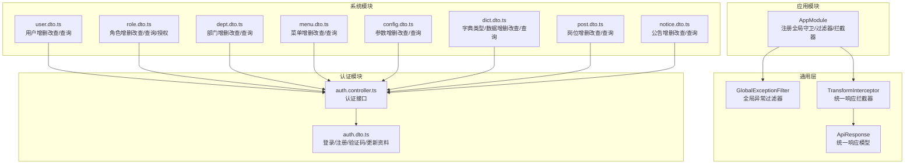

**图表来源**
- [apps/backend/src/app.module.ts:18-58](file://apps/backend/src/app.module.ts#L18-L58)
- [apps/backend/src/common/transform.interceptor.ts:11-29](file://apps/backend/src/common/transform.interceptor.ts#L11-L29)
- [apps/backend/src/common/exception.filter.ts:12-37](file://apps/backend/src/common/exception.filter.ts#L12-L37)
- [apps/backend/src/common/api-response.ts:1-35](file://apps/backend/src/common/api-response.ts#L1-L35)
- [apps/backend/src/auth/auth.controller.ts:1-42](file://apps/backend/src/auth/auth.controller.ts#L1-L42)
- [apps/backend/src/auth/dto/auth.dto.ts:1-91](file://apps/backend/src/auth/dto/auth.dto.ts#L1-L91)
- [apps/backend/src/modules/system/user/dto/user.dto.ts:1-131](file://apps/backend/src/modules/system/user/dto/user.dto.ts#L1-L131)
- [apps/backend/src/modules/system/role/dto/role.dto.ts:1-38](file://apps/backend/src/modules/system/role/dto/role.dto.ts#L1-L38)
- [apps/backend/src/modules/system/dept/dto/dept.dto.ts:1-27](file://apps/backend/src/modules/system/dept/dto/dept.dto.ts#L1-L27)
- [apps/backend/src/modules/system/menu/dto/menu.dto.ts:1-41](file://apps/backend/src/modules/system/menu/dto/menu.dto.ts#L1-L41)
- [apps/backend/src/modules/system/config/dto/config.dto.ts:1-28](file://apps/backend/src/modules/system/config/dto/config.dto.ts#L1-L28)
- [apps/backend/src/modules/system/dict/dto/dict.dto.ts:1-42](file://apps/backend/src/modules/system/dict/dto/dict.dto.ts#L1-L42)
- [apps/backend/src/modules/system/post/dto/post.dto.ts:1-28](file://apps/backend/src/modules/system/post/dto/post.dto.ts#L1-L28)
- [apps/backend/src/modules/system/notice/dto/notice.dto.ts:1-29](file://apps/backend/src/modules/system/notice/dto/notice.dto.ts#L1-L29)

**章节来源**
- [apps/backend/src/app.module.ts:18-58](file://apps/backend/src/app.module.ts#L18-L58)
- [apps/backend/src/common/transform.interceptor.ts:11-29](file://apps/backend/src/common/transform.interceptor.ts#L11-L29)
- [apps/backend/src/common/exception.filter.ts:12-37](file://apps/backend/src/common/exception.filter.ts#L12-L37)
- [apps/backend/src/common/api-response.ts:1-35](file://apps/backend/src/common/api-response.ts#L1-L35)

## 核心组件
- DTO：用于请求入参与出参的数据结构定义，配合class-validator进行参数校验，class-transformer进行类型转换。
- 控制器：通过@Body/@Query/@Param等装饰器绑定DTO，自动完成参数解析与校验。
- 全局拦截器：TransformInterceptor将控制器返回值统一包装为ApiResponse格式。
- 全局异常过滤器：GlobalExceptionFilter捕获异常并统一返回错误响应。
- 响应模型：ApiResponse提供成功/失败/鉴权/权限/资源不存在/请求错误等标准响应结构。

**章节来源**
- [apps/backend/src/auth/auth.controller.ts:1-42](file://apps/backend/src/auth/auth.controller.ts#L1-L42)
- [apps/backend/src/common/transform.interceptor.ts:11-29](file://apps/backend/src/common/transform.interceptor.ts#L11-L29)
- [apps/backend/src/common/exception.filter.ts:12-37](file://apps/backend/src/common/exception.filter.ts#L12-L37)
- [apps/backend/src/common/api-response.ts:1-35](file://apps/backend/src/common/api-response.ts#L1-L35)

## 架构总览
以下序列图展示了典型请求从进入控制器到返回统一响应的完整流程，涵盖参数校验、数据转换与统一响应包装。

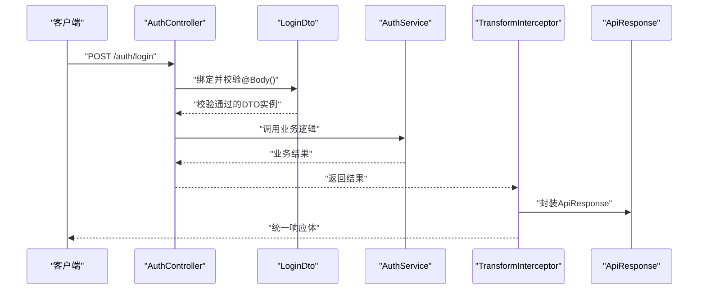

**图表来源**
- [apps/backend/src/auth/auth.controller.ts:13-19](file://apps/backend/src/auth/auth.controller.ts#L13-L19)
- [apps/backend/src/auth/dto/auth.dto.ts:43-63](file://apps/backend/src/auth/dto/auth.dto.ts#L43-L63)
- [apps/backend/src/common/transform.interceptor.ts:15-28](file://apps/backend/src/common/transform.interceptor.ts#L15-L28)
- [apps/backend/src/common/api-response.ts:12-18](file://apps/backend/src/common/api-response.ts#L12-L18)

## 详细组件分析

### 认证模块DTO设计
- 登录DTO：包含用户名、密码、验证码键与文本，均使用字符串非空校验；验证码键与文本用于二次校验。
- 注册DTO：用户名与密码必填，密码最小长度约束；昵称可选。
- 更新资料DTO：昵称、邮箱、手机号、头像、备注均为可选字符串。
- 更新密码DTO：旧密码必填，新密码最小长度约束。
- 验证码DTO：键与文本必填。

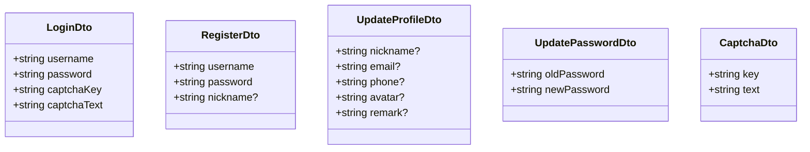

**图表来源**
- [apps/backend/src/auth/dto/auth.dto.ts:4-91](file://apps/backend/src/auth/dto/auth.dto.ts#L4-L91)

**章节来源**
- [apps/backend/src/auth/dto/auth.dto.ts:1-91](file://apps/backend/src/auth/dto/auth.dto.ts#L1-L91)
- [apps/backend/src/auth/auth.controller.ts:13-42](file://apps/backend/src/auth/auth.controller.ts#L13-L42)

### 系统模块DTO设计（用户）
- 创建用户DTO：用户名、密码必填；昵称、邮箱、手机号、状态、备注、部门ID、岗位ID数组可选。
- 更新用户DTO：ID必填；其他字段与创建类似但允许部分更新。
- 查询用户DTO：支持用户名、昵称模糊匹配；状态、部门ID整数过滤；分页参数page、limit最小值为1，并通过Type进行字符串到数字的转换。

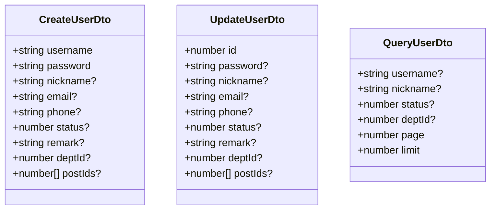

**图表来源**
- [apps/backend/src/modules/system/user/dto/user.dto.ts:5-131](file://apps/backend/src/modules/system/user/dto/user.dto.ts#L5-L131)

**章节来源**
- [apps/backend/src/modules/system/user/dto/user.dto.ts:1-131](file://apps/backend/src/modules/system/user/dto/user.dto.ts#L1-L131)

### 角色模块DTO设计
- 创建角色DTO：名称、编码必填；数据范围可选。
- 更新角色DTO：ID必填；名称、数据范围可选；状态通过Type转换为数字。
- 查询角色DTO：名称、编码、状态可选；分页参数page、limit最小值为1。
- 授权DTO：菜单ID数组必填，部门ID数组可选。

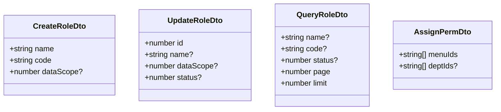

**图表来源**
- [apps/backend/src/modules/system/role/dto/role.dto.ts:5-38](file://apps/backend/src/modules/system/role/dto/role.dto.ts#L5-L38)

**章节来源**
- [apps/backend/src/modules/system/role/dto/role.dto.ts:1-38](file://apps/backend/src/modules/system/role/dto/role.dto.ts#L1-L38)

### 部门模块DTO设计
- 创建部门DTO：名称必填；父级ID、排序、状态、负责人ID可选。
- 更新部门DTO：ID必填；其他字段可选。
- 查询部门DTO：名称可选；状态通过Type转换为数字。

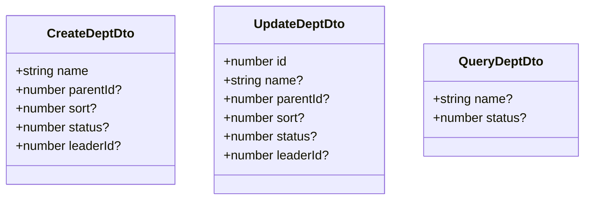

**图表来源**
- [apps/backend/src/modules/system/dept/dto/dept.dto.ts:5-27](file://apps/backend/src/modules/system/dept/dto/dept.dto.ts#L5-L27)

**章节来源**
- [apps/backend/src/modules/system/dept/dto/dept.dto.ts:1-27](file://apps/backend/src/modules/system/dept/dto/dept.dto.ts#L1-L27)

### 菜单模块DTO设计
- 创建菜单DTO：名称必填；类型、父级ID、路径、组件、图标、排序、权限标识、状态、外链、缓存、显示等可选。
- 更新菜单DTO：ID必填；其他字段可选。
- 查询菜单DTO：名称、类型、状态可选。

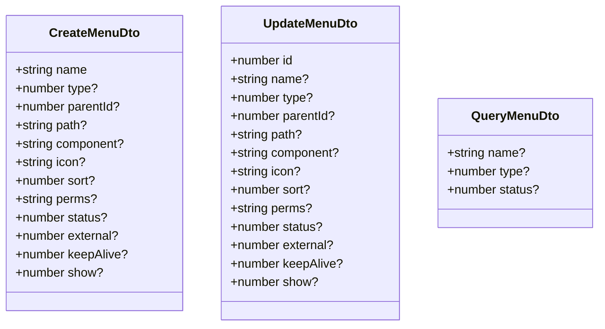

**图表来源**
- [apps/backend/src/modules/system/menu/dto/menu.dto.ts:5-41](file://apps/backend/src/modules/system/menu/dto/menu.dto.ts#L5-L41)

**章节来源**
- [apps/backend/src/modules/system/menu/dto/menu.dto.ts:1-41](file://apps/backend/src/modules/system/menu/dto/menu.dto.ts#L1-L41)

### 参数配置模块DTO设计
- 创建配置DTO：名称、键、值必填；类型、备注、状态可选。
- 更新配置DTO：ID必填；其他字段可选。
- 查询配置DTO：名称、键、状态可选。

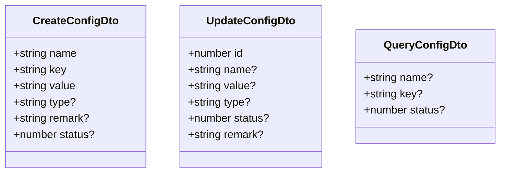

**图表来源**
- [apps/backend/src/modules/system/config/dto/config.dto.ts:5-28](file://apps/backend/src/modules/system/config/dto/config.dto.ts#L5-L28)

**章节来源**
- [apps/backend/src/modules/system/config/dto/config.dto.ts:1-28](file://apps/backend/src/modules/system/config/dto/config.dto.ts#L1-L28)

### 字典模块DTO设计
- 字典类型：创建/更新支持名称、编码、状态、备注；查询支持名称、编码、状态。
- 字典数据：创建/更新支持字典类型ID、标签、值、排序、状态、备注。

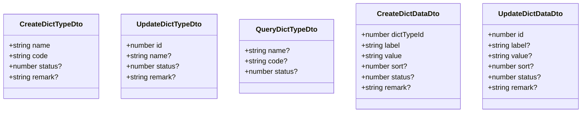

**图表来源**
- [apps/backend/src/modules/system/dict/dto/dict.dto.ts:5-42](file://apps/backend/src/modules/system/dict/dto/dict.dto.ts#L5-L42)

**章节来源**
- [apps/backend/src/modules/system/dict/dto/dict.dto.ts:1-42](file://apps/backend/src/modules/system/dict/dto/dict.dto.ts#L1-L42)

### 岗位模块DTO设计
- 创建岗位DTO：名称、编码必填；排序、状态、备注可选。
- 更新岗位DTO：ID必填；其他字段可选。
- 查询岗位DTO：名称、编码、状态可选；分页参数page、limit最小值为1。

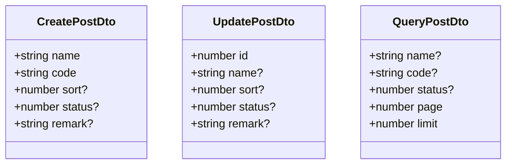

**图表来源**
- [apps/backend/src/modules/system/post/dto/post.dto.ts:5-28](file://apps/backend/src/modules/system/post/dto/post.dto.ts#L5-L28)

**章节来源**
- [apps/backend/src/modules/system/post/dto/post.dto.ts:1-28](file://apps/backend/src/modules/system/post/dto/post.dto.ts#L1-L28)

### 公告模块DTO设计
- 创建公告DTO：标题、内容必填；类型、状态、发布时间可选。
- 更新公告DTO：ID必填；其他字段可选。
- 查询公告DTO：标题、类型、状态可选；分页参数page、limit最小值为1。

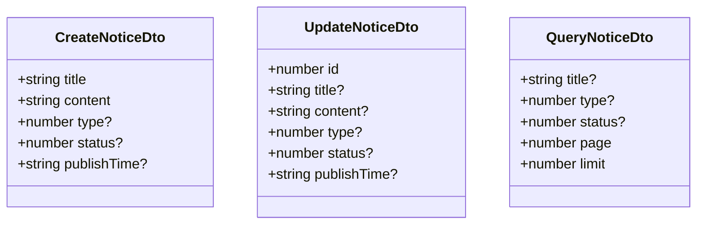

**图表来源**
- [apps/backend/src/modules/system/notice/dto/notice.dto.ts:5-29](file://apps/backend/src/modules/system/notice/dto/notice.dto.ts#L5-L29)

**章节来源**
- [apps/backend/src/modules/system/notice/dto/notice.dto.ts:1-29](file://apps/backend/src/modules/system/notice/dto/notice.dto.ts#L1-L29)

### DTO与数据库实体映射关系
- 映射策略：DTO主要用于API边界的数据交换，不直接暴露数据库实体细节；服务层负责DTO与实体之间的转换。
- 字段映射：DTO字段通常与数据库表字段一一对应或按需裁剪；对于枚举、布尔值、日期时间等类型，通过class-transformer的Type装饰器进行转换。
- 关系处理：一对多/多对多关系在DTO中常用ID集合表示，避免深层嵌套导致的复杂性；服务层再进行关联查询与组装。

[本节为概念性说明，不直接分析具体文件]

### DTO继承与组合模式
- 继承模式：通过PartialType实现“部分更新”DTO，复用创建DTO的字段定义，仅保留可选字段。
- 组合模式：将多个DTO按功能分组（如创建/更新/查询），并在控制器中按需绑定，提升可维护性与可读性。
- 版本兼容：新增字段建议保持向后兼容，使用可选字段与默认值，避免破坏既有客户端行为。

[本节为概念性说明，不直接分析具体文件]

### TypeScript类型系统应用
- 接口定义：使用class-validator装饰器声明字段约束；使用class-transformer的Type进行类型转换。
- 泛型使用：拦截器TransformInterceptor使用泛型T保证响应数据类型的正确性。
- 类型约束：通过装饰器链路确保运行时类型安全与数据一致性。

**章节来源**
- [apps/backend/src/modules/system/user/dto/user.dto.ts:1-4](file://apps/backend/src/modules/system/user/dto/user.dto.ts#L1-L4)
- [apps/backend/src/common/transform.interceptor.ts:12-13](file://apps/backend/src/common/transform.interceptor.ts#L12-L13)

### 验证装饰器使用方法
- 内置验证器：IsString、IsNotEmpty、IsOptional、IsInt、Min、IsDateString等。
- 自定义验证器：可通过实现ValidationArguments与自定义函数扩展；本项目未直接展示，但具备扩展能力。
- 条件验证：通过ValidationOptions或自定义装饰器实现条件校验（如仅在特定条件下生效）。

**章节来源**
- [apps/backend/src/auth/dto/auth.dto.ts:1-91](file://apps/backend/src/auth/dto/auth.dto.ts#L1-L91)
- [apps/backend/src/modules/system/user/dto/user.dto.ts:1-131](file://apps/backend/src/modules/system/user/dto/user.dto.ts#L1-L131)
- [apps/backend/src/modules/system/role/dto/role.dto.ts:1-38](file://apps/backend/src/modules/system/role/dto/role.dto.ts#L1-L38)
- [apps/backend/src/modules/system/dept/dto/dept.dto.ts:1-27](file://apps/backend/src/modules/system/dept/dto/dept.dto.ts#L1-L27)
- [apps/backend/src/modules/system/menu/dto/menu.dto.ts:1-41](file://apps/backend/src/modules/system/menu/dto/menu.dto.ts#L1-L41)
- [apps/backend/src/modules/system/config/dto/config.dto.ts:1-28](file://apps/backend/src/modules/system/config/dto/config.dto.ts#L1-L28)
- [apps/backend/src/modules/system/dict/dto/dict.dto.ts:1-42](file://apps/backend/src/modules/system/dict/dto/dict.dto.ts#L1-L42)
- [apps/backend/src/modules/system/post/dto/post.dto.ts:1-28](file://apps/backend/src/modules/system/post/dto/post.dto.ts#L1-L28)
- [apps/backend/src/modules/system/notice/dto/notice.dto.ts:1-29](file://apps/backend/src/modules/system/notice/dto/notice.dto.ts#L1-L29)

### 数据转换流程
- 输入转换：class-transformer的Type装饰器将字符串参数转换为数字类型，确保后续校验与业务逻辑的类型一致性。
- 输出转换：TransformInterceptor将控制器返回值统一包装为ApiResponse，保证对外输出格式一致。

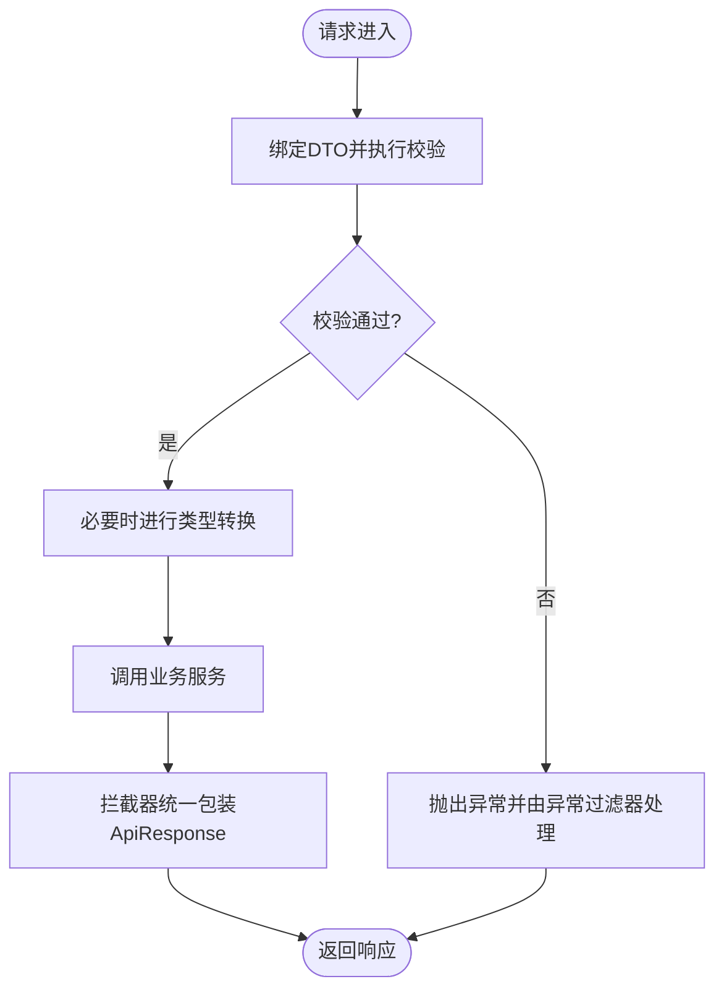

**图表来源**
- [apps/backend/src/common/transform.interceptor.ts:15-28](file://apps/backend/src/common/transform.interceptor.ts#L15-L28)
- [apps/backend/src/common/exception.filter.ts:16-36](file://apps/backend/src/common/exception.filter.ts#L16-L36)
- [apps/backend/src/common/api-response.ts:12-18](file://apps/backend/src/common/api-response.ts#L12-L18)

## 依赖分析
- 核心依赖：class-validator、class-transformer、@nestjs/swagger、@prisma/client。
- 模块依赖：各业务模块的DTO独立于控制器，控制器仅依赖对应DTO；全局拦截器与异常过滤器被AppModule统一注册。

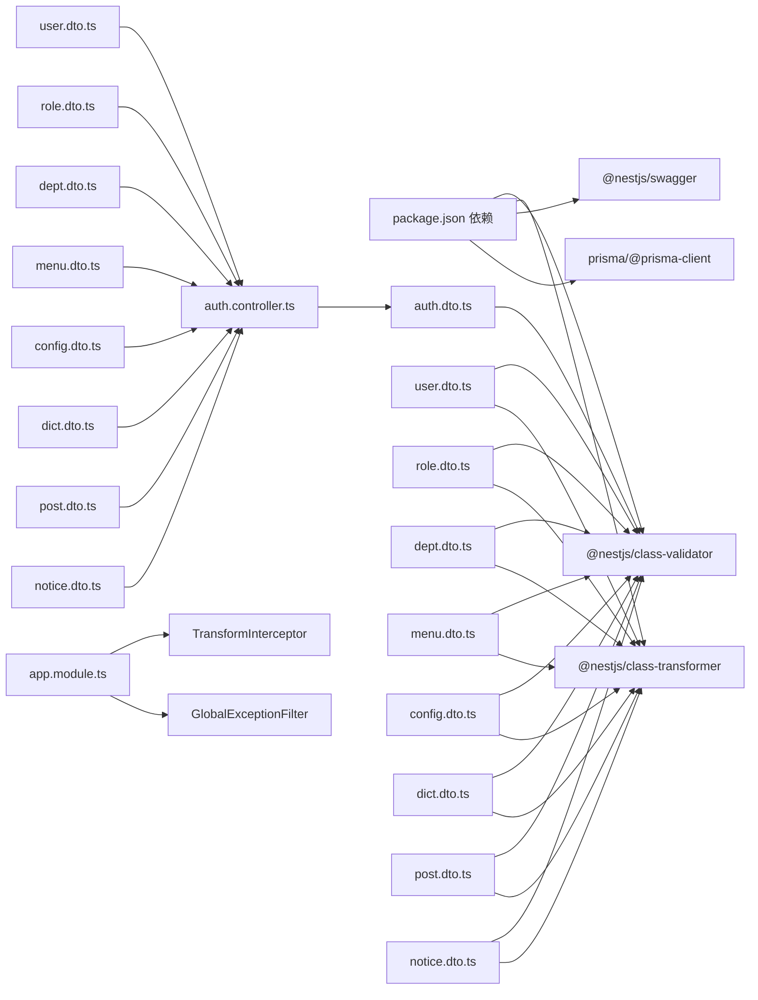

**图表来源**
- [apps/backend/package.json:16-41](file://apps/backend/package.json#L16-L41)
- [apps/backend/src/auth/dto/auth.dto.ts:1-91](file://apps/backend/src/auth/dto/auth.dto.ts#L1-L91)
- [apps/backend/src/modules/system/user/dto/user.dto.ts:1-131](file://apps/backend/src/modules/system/user/dto/user.dto.ts#L1-L131)
- [apps/backend/src/modules/system/role/dto/role.dto.ts:1-38](file://apps/backend/src/modules/system/role/dto/role.dto.ts#L1-L38)
- [apps/backend/src/modules/system/dept/dto/dept.dto.ts:1-27](file://apps/backend/src/modules/system/dept/dto/dept.dto.ts#L1-L27)
- [apps/backend/src/modules/system/menu/dto/menu.dto.ts:1-41](file://apps/backend/src/modules/system/menu/dto/menu.dto.ts#L1-L41)
- [apps/backend/src/modules/system/config/dto/config.dto.ts:1-28](file://apps/backend/src/modules/system/config/dto/config.dto.ts#L1-L28)
- [apps/backend/src/modules/system/dict/dto/dict.dto.ts:1-42](file://apps/backend/src/modules/system/dict/dto/dict.dto.ts#L1-L42)
- [apps/backend/src/modules/system/post/dto/post.dto.ts:1-28](file://apps/backend/src/modules/system/post/dto/post.dto.ts#L1-L28)
- [apps/backend/src/modules/system/notice/dto/notice.dto.ts:1-29](file://apps/backend/src/modules/system/notice/dto/notice.dto.ts#L1-L29)
- [apps/backend/src/auth/auth.controller.ts:1-42](file://apps/backend/src/auth/auth.controller.ts#L1-L42)
- [apps/backend/src/app.module.ts:18-58](file://apps/backend/src/app.module.ts#L18-L58)

**章节来源**
- [apps/backend/package.json:16-41](file://apps/backend/package.json#L16-L41)
- [apps/backend/src/app.module.ts:18-58](file://apps/backend/src/app.module.ts#L18-L58)

## 性能考虑
- DTO层级控制：避免在DTO中进行复杂计算或深度嵌套，减少序列化与反序列化开销。
- 类型转换优化：合理使用Type装饰器，仅在必要时进行字符串到数字的转换，避免重复转换。
- 统一响应：通过拦截器统一包装响应，减少控制器中的重复逻辑，提升一致性与可维护性。

[本节为一般性指导，不直接分析具体文件]

## 故障排除指南
- 参数校验失败：检查DTO上的装饰器是否正确配置；确认请求体与DTO字段命名一致。
- 类型转换异常：确认Type装饰器的转换目标类型与实际传入值相容。
- 响应格式不一致：确认TransformInterceptor已注册且未被覆盖。
- 异常未被捕获：检查GlobalExceptionFilter是否正确注册并处理了HttpException。

**章节来源**
- [apps/backend/src/common/transform.interceptor.ts:15-28](file://apps/backend/src/common/transform.interceptor.ts#L15-L28)
- [apps/backend/src/common/exception.filter.ts:16-36](file://apps/backend/src/common/exception.filter.ts#L16-L36)
- [apps/backend/src/common/api-response.ts:16-34](file://apps/backend/src/common/api-response.ts#L16-L34)

## 结论
本项目通过严谨的DTO设计与装饰器驱动的验证体系，实现了输入参数的强约束与输出响应的统一格式。结合class-transformer的类型转换与全局拦截器/异常过滤器，形成了清晰、可维护、可扩展的数据传输层。建议在后续迭代中持续遵循本文规范，保持DTO命名一致性、分组清晰与版本兼容性。

## 附录
- 命名规范：DTO类名使用名词短语+Dto后缀；字段使用驼峰命名；可选字段以?标记。
- 分组策略：按业务域划分DTO目录，同一业务下的创建/更新/查询DTO集中管理。
- 错误处理：统一使用ApiResponse与GlobalExceptionFilter，确保错误信息标准化与可追踪性。

[本节为一般性指导，不直接分析具体文件]