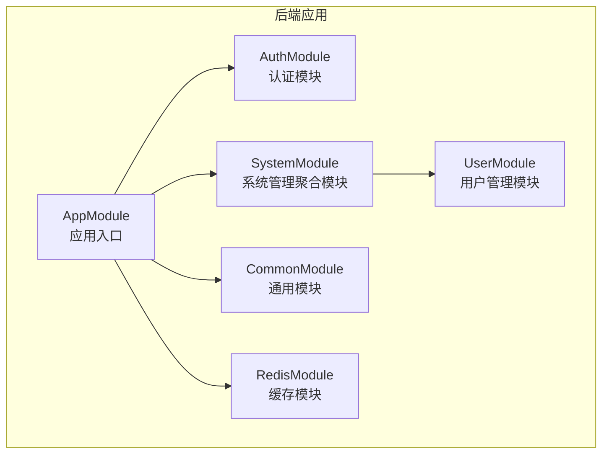
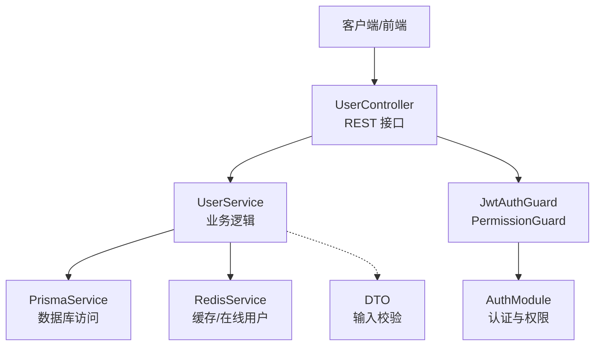
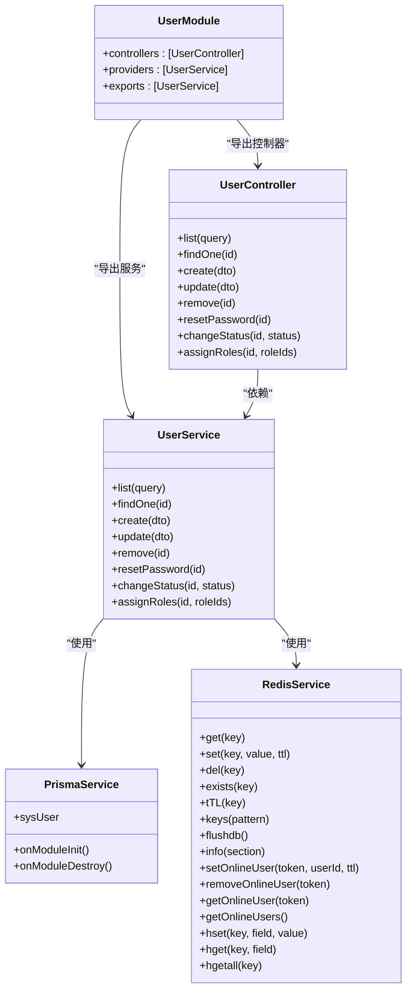
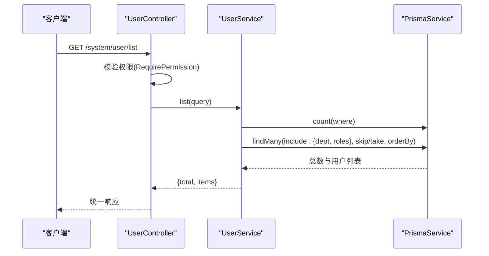
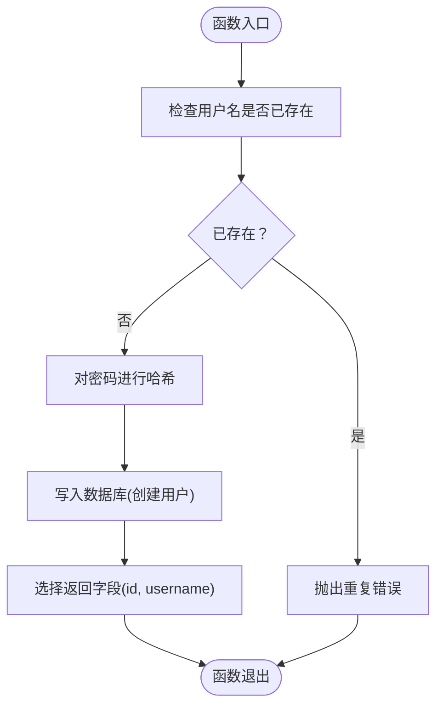
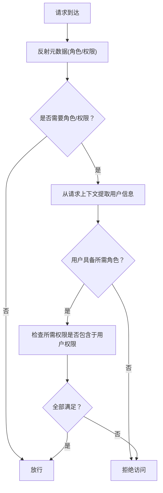
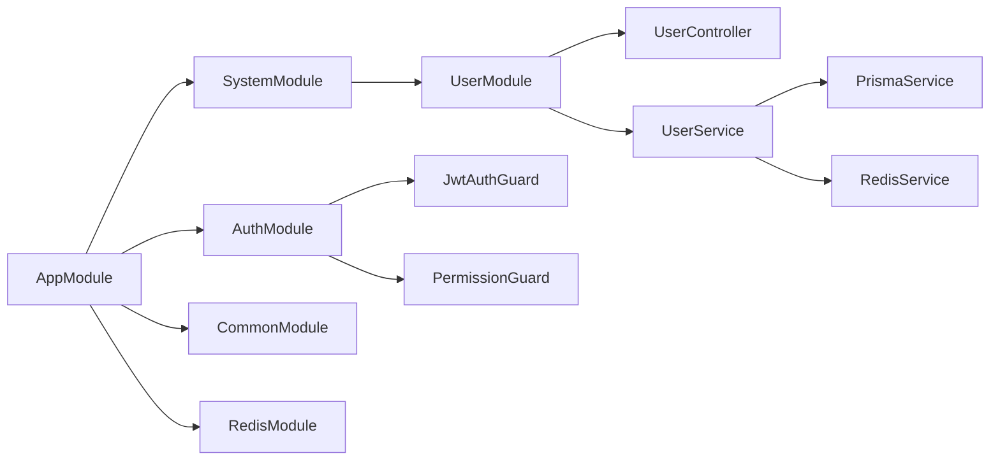

# 完整模块开发示例

<cite>
**本文档引用的文件**
- [apps/backend/src/modules/system/user/user.module.ts](file://apps/backend/src/modules/system/user/user.module.ts)
- [apps/backend/src/modules/system/user/user.controller.ts](file://apps/backend/src/modules/system/user/user.controller.ts)
- [apps/backend/src/modules/system/user/user.service.ts](file://apps/backend/src/modules/system/user/user.service.ts)
- [apps/backend/src/modules/system/user/dto/user.dto.ts](file://apps/backend/src/modules/system/user/dto/user.dto.ts)
- [apps/backend/src/modules/system/system.module.ts](file://apps/backend/src/modules/system/system.module.ts)
- [apps/backend/src/auth/auth.module.ts](file://apps/backend/src/auth/auth.module.ts)
- [apps/backend/src/auth/guards.ts](file://apps/backend/src/auth/guards.ts)
- [apps/backend/src/common/common.module.ts](file://apps/backend/src/common/common.module.ts)
- [apps/backend/src/common/prisma.service.ts](file://apps/backend/src/common/prisma.service.ts)
- [apps/backend/src/cache/redis.module.ts](file://apps/backend/src/cache/redis.module.ts)
- [apps/backend/src/cache/redis.service.ts](file://apps/backend/src/cache/redis.service.ts)
- [apps/backend/src/app.module.ts](file://apps/backend/src/app.module.ts)
- [apps/backend/package.json](file://apps/backend/package.json)
- [README.md](file://README.md)
</cite>

## 目录
1. [引言](#引言)
2. [项目结构](#项目结构)
3. [核心组件](#核心组件)
4. [架构总览](#架构总览)
5. [详细组件分析](#详细组件分析)
6. [依赖关系分析](#依赖关系分析)
7. [性能考量](#性能考量)
8. [故障排查指南](#故障排查指南)
9. [结论](#结论)
10. [附录](#附录)

## 引言
本指南围绕用户管理模块的完整开发流程展开，从需求分析、设计规划、代码实现到测试验证，覆盖模块的全生命周期（开发、测试、部署、维护）。结合项目中现有的用户管理模块，展示如何创建一个功能完整、结构清晰、易于维护的 NestJS 模块。同时介绍工具链、版本管理策略、检查清单以及安全与性能最佳实践。

## 项目结构
该项目采用多应用目录组织，后端 API、Web 管理后台、移动端应用同仓维护。后端采用模块化架构，系统管理模块（system module）包含用户、角色、部门、菜单、岗位、字典、参数、通知公告等子模块；认证模块提供 JWT 认证与权限守卫；通用模块提供 Prisma 服务；缓存模块提供 Redis 服务。

**图表来源**
- [apps/backend/src/app.module.ts:18-38](file://apps/backend/src/app.module.ts#L18-L38)
- [apps/backend/src/modules/system/system.module.ts:11-21](file://apps/backend/src/modules/system/system.module.ts#L11-L21)
- [apps/backend/src/modules/system/user/user.module.ts:5-9](file://apps/backend/src/modules/system/user/user.module.ts#L5-L9)

**章节来源**
- [README.md:26-68](file://README.md#L26-L68)
- [apps/backend/src/app.module.ts:18-38](file://apps/backend/src/app.module.ts#L18-L38)
- [apps/backend/src/modules/system/system.module.ts:11-21](file://apps/backend/src/modules/system/system.module.ts#L11-L21)

## 核心组件
- 用户控制器（UserController）：提供用户列表查询、详情获取、创建、更新、删除、重置密码、变更状态、分配角色等接口，配合权限守卫进行访问控制。
- 用户服务（UserService）：封装用户业务逻辑，包括分页查询、唯一性校验、密码加密、软删除、角色分配等。
- DTO（数据传输对象）：定义创建、更新、查询用户的输入参数与约束。
- 认证与权限守卫：JWT 守卫用于鉴权，权限守卫用于细粒度的按钮级权限控制。
- 通用服务：PrismaService 提供数据库连接与生命周期管理；RedisService 提供缓存与在线用户管理能力。
- 模块聚合：SystemModule 聚合多个系统子模块；AppModule 组装各功能模块。

**章节来源**
- [apps/backend/src/modules/system/user/user.controller.ts:20-88](file://apps/backend/src/modules/system/user/user.controller.ts#L20-L88)
- [apps/backend/src/modules/system/user/user.service.ts:11-144](file://apps/backend/src/modules/system/user/user.service.ts#L11-L144)
- [apps/backend/src/modules/system/user/dto/user.dto.ts:5-131](file://apps/backend/src/modules/system/user/dto/user.dto.ts#L5-L131)
- [apps/backend/src/auth/guards.ts:19-51](file://apps/backend/src/auth/guards.ts#L19-L51)
- [apps/backend/src/common/prisma.service.ts:4-22](file://apps/backend/src/common/prisma.service.ts#L4-L22)
- [apps/backend/src/cache/redis.service.ts:4-128](file://apps/backend/src/cache/redis.service.ts#L4-L128)
- [apps/backend/src/modules/system/system.module.ts:11-21](file://apps/backend/src/modules/system/system.module.ts#L11-L21)

## 架构总览
用户管理模块在系统管理模块之下，通过控制器暴露 REST 接口，服务层负责业务处理与数据持久化，DTO 负责输入校验，认证与权限守卫保障接口安全，通用模块提供数据库与缓存基础设施。

**图表来源**
- [apps/backend/src/modules/system/user/user.controller.ts:20-88](file://apps/backend/src/modules/system/user/user.controller.ts#L20-L88)
- [apps/backend/src/modules/system/user/user.service.ts:11-144](file://apps/backend/src/modules/system/user/user.service.ts#L11-L144)
- [apps/backend/src/common/prisma.service.ts:4-22](file://apps/backend/src/common/prisma.service.ts#L4-L22)
- [apps/backend/src/cache/redis.service.ts:4-128](file://apps/backend/src/cache/redis.service.ts#L4-L128)
- [apps/backend/src/auth/guards.ts:19-51](file://apps/backend/src/auth/guards.ts#L19-L51)
- [apps/backend/src/auth/auth.module.ts:11-28](file://apps/backend/src/auth/auth.module.ts#L11-L28)

## 详细组件分析

### 用户模块类图
用户模块的核心类与职责如下：

**图表来源**
- [apps/backend/src/modules/system/user/user.module.ts:5-9](file://apps/backend/src/modules/system/user/user.module.ts#L5-L9)
- [apps/backend/src/modules/system/user/user.controller.ts:23-88](file://apps/backend/src/modules/system/user/user.controller.ts#L23-L88)
- [apps/backend/src/modules/system/user/user.service.ts:13-144](file://apps/backend/src/modules/system/user/user.service.ts#L13-L144)
- [apps/backend/src/common/prisma.service.ts:4-22](file://apps/backend/src/common/prisma.service.ts#L4-L22)
- [apps/backend/src/cache/redis.service.ts:4-128](file://apps/backend/src/cache/redis.service.ts#L4-L128)

**章节来源**
- [apps/backend/src/modules/system/user/user.module.ts:1-10](file://apps/backend/src/modules/system/user/user.module.ts#L1-L10)
- [apps/backend/src/modules/system/user/user.controller.ts:1-89](file://apps/backend/src/modules/system/user/user.controller.ts#L1-L89)
- [apps/backend/src/modules/system/user/user.service.ts:1-144](file://apps/backend/src/modules/system/user/user.service.ts#L1-L144)

### 用户管理接口序列图
以“获取用户列表”为例，展示请求从控制器到服务再到数据库的调用链路。

**图表来源**
- [apps/backend/src/modules/system/user/user.controller.ts:26-31](file://apps/backend/src/modules/system/user/user.controller.ts#L26-L31)
- [apps/backend/src/modules/system/user/user.service.ts:18-46](file://apps/backend/src/modules/system/user/user.service.ts#L18-L46)
- [apps/backend/src/common/prisma.service.ts:4-22](file://apps/backend/src/common/prisma.service.ts#L4-L22)

**章节来源**
- [apps/backend/src/modules/system/user/user.controller.ts:26-31](file://apps/backend/src/modules/system/user/user.controller.ts#L26-L31)
- [apps/backend/src/modules/system/user/user.service.ts:18-46](file://apps/backend/src/modules/system/user/user.service.ts#L18-L46)

### 用户创建流程（含密码加密与唯一性校验）

**图表来源**
- [apps/backend/src/modules/system/user/user.service.ts:57-78](file://apps/backend/src/modules/system/user/user.service.ts#L57-L78)
- [apps/backend/src/modules/system/user/dto/user.dto.ts:5-47](file://apps/backend/src/modules/system/user/dto/user.dto.ts#L5-L47)

**章节来源**
- [apps/backend/src/modules/system/user/user.service.ts:57-78](file://apps/backend/src/modules/system/user/user.service.ts#L57-L78)
- [apps/backend/src/modules/system/user/dto/user.dto.ts:5-47](file://apps/backend/src/modules/system/user/dto/user.dto.ts#L5-L47)

### 权限守卫工作流

**图表来源**
- [apps/backend/src/auth/guards.ts:19-51](file://apps/backend/src/auth/guards.ts#L19-L51)

**章节来源**
- [apps/backend/src/auth/guards.ts:19-51](file://apps/backend/src/auth/guards.ts#L19-L51)

## 依赖关系分析
- 模块依赖：AppModule 依赖 AuthModule、SystemModule、CommonModule、RedisModule；SystemModule 依赖 UserModule 等子模块。
- 控制器依赖：UserController 依赖 UserService；服务层依赖 PrismaService 与 RedisService。
- 认证与权限：JwtAuthGuard 与 PermissionGuard 通过装饰器标注在控制器上，形成统一的安全网关。
- 通用能力：CommonModule 与 RedisModule 使用 @Global() 导出，便于跨模块注入。

**图表来源**
- [apps/backend/src/app.module.ts:18-38](file://apps/backend/src/app.module.ts#L18-L38)
- [apps/backend/src/modules/system/system.module.ts:11-21](file://apps/backend/src/modules/system/system.module.ts#L11-L21)
- [apps/backend/src/modules/system/user/user.module.ts:5-9](file://apps/backend/src/modules/system/user/user.module.ts#L5-L9)
- [apps/backend/src/auth/auth.module.ts:11-28](file://apps/backend/src/auth/auth.module.ts#L11-L28)

**章节来源**
- [apps/backend/src/app.module.ts:18-38](file://apps/backend/src/app.module.ts#L18-L38)
- [apps/backend/src/modules/system/system.module.ts:11-21](file://apps/backend/src/modules/system/system.module.ts#L11-L21)
- [apps/backend/src/modules/system/user/user.module.ts:5-9](file://apps/backend/src/modules/system/user/user.module.ts#L5-L9)
- [apps/backend/src/auth/auth.module.ts:11-28](file://apps/backend/src/auth/auth.module.ts#L11-L28)

## 性能考量
- 数据库查询优化：分页查询使用 skip/take 并按主键倒序排序，避免全表扫描；条件查询通过 where 构建精确过滤。
- 缓存策略：Redis 用于在线用户管理与键空间操作，可减少频繁查询数据库的压力；提供 info 与 keys 等运维辅助能力。
- 密码处理：使用 bcryptjs 对密码进行哈希，降低明文泄露风险；哈希成本参数可按硬件能力调整。
- 并发与事务：PrismaService 继承 PrismaClient，支持连接池与生命周期管理；复杂业务建议使用事务包裹。
- 接口限流：全局启用 Throttler，限制请求频率，防止滥用。

**章节来源**
- [apps/backend/src/modules/system/user/user.service.ts:18-46](file://apps/backend/src/modules/system/user/user.service.ts#L18-L46)
- [apps/backend/src/cache/redis.service.ts:83-99](file://apps/backend/src/cache/redis.service.ts#L83-L99)
- [apps/backend/src/common/prisma.service.ts:4-22](file://apps/backend/src/common/prisma.service.ts#L4-L22)
- [apps/backend/package.json:24-29](file://apps/backend/package.json#L24-L29)

## 故障排查指南
- 数据库连接失败：检查 PrismaService 的日志输出与 onModuleInit 生命周期钩子，确认连接参数与数据库状态。
- Redis 连接异常：查看 RedisService 的连接事件回调，确认主机、端口、密码、数据库号配置正确。
- 权限拒绝：确认控制器方法上的 RequirePermission 标注与用户权限集合匹配；检查用户角色与权限数据是否正确下发。
- 密码重置异常：确认默认密码生成逻辑与哈希流程；检查数据库更新是否成功。
- 分页查询结果为空：核对查询 DTO 的分页参数与数据库 where 条件，确保索引与排序字段合理。

**章节来源**
- [apps/backend/src/common/prisma.service.ts:14-21](file://apps/backend/src/common/prisma.service.ts#L14-L21)
- [apps/backend/src/cache/redis.service.ts:16-23](file://apps/backend/src/cache/redis.service.ts#L16-L23)
- [apps/backend/src/auth/guards.ts:36-51](file://apps/backend/src/auth/guards.ts#L36-L51)
- [apps/backend/src/modules/system/user/user.service.ts:117-125](file://apps/backend/src/modules/system/user/user.service.ts#L117-L125)

## 结论
通过用户管理模块的完整示例，可以看到一个标准的 NestJS 模块应包含：清晰的模块边界、职责分离的控制器与服务、严格的输入校验、完善的权限控制、稳定的数据库与缓存集成。遵循本文档的开发流程与最佳实践，可以高效地交付高质量、可维护的模块。

## 附录

### 需求分析与设计规划
- 明确用户管理的业务范围：增删改查、重置密码、变更状态、角色分配、分页查询、软删除。
- 设计接口与权限：为每个接口定义权限标识（如 system:user:list、system:user:add 等）。
- 数据模型与 DTO：确定用户表字段与输入输出约束，使用 class-validator 保证数据一致性。
- 安全策略：JWT 鉴权 + 按钮级权限守卫，确保最小权限原则。

### 代码实现步骤
- 创建模块文件：module/controller/service/dto。
- 在模块中导出服务，供其他模块使用。
- 在控制器中添加路由与守卫，调用服务方法。
- 在服务中实现业务逻辑，使用 Prisma 进行数据持久化，使用 Redis 进行缓存。
- 编写 DTO 并在控制器中使用 Pipe 进行参数校验。

### 测试验证清单
- 单元测试：覆盖服务方法（创建、更新、删除、分页查询、重置密码、变更状态、分配角色）。
- 集成测试：模拟控制器调用，验证权限守卫与 DTO 校验。
- 端到端测试：使用 Swagger 或 Postman 验证接口行为与响应格式。
- 安全测试：验证权限不足时的拒绝行为与 JWT 有效性。

### 版本管理与发布
- Git 分支策略：采用 Git Flow，feature 分支 -> develop 合并 -> release 分支 -> main 合并并打标签。
- 版本发布：语义化版本（SemVer），变更日志记录重大改动与破坏性变更。
- 向后兼容：尽量不破坏现有接口；新增字段使用可选属性，提供迁移脚本。

### 工具链与 IDE 配置
- 代码生成器：使用 Nest CLI 与 Schematics 快速生成模块骨架。
- IDE 插件：TypeScript TSServer、ESLint、Prettier、EditorConfig、GitLens。
- 调试工具：VS Code 调试配置、Nest DevTools、Swagger UI。
- 代码质量：ESLint、Prettier、Commitlint、Husky/Lefthook。

### 模块开发检查清单
- 代码质量：命名规范、注释完整、单一职责、无魔法数字。
- 性能指标：查询优化、缓存命中率、连接池配置、请求耗时。
- 安全考虑：输入校验、权限控制、密码哈希、敏感信息脱敏、CORS 与 CSRF 防护。
- 可维护性：模块解耦、错误处理、日志记录、监控埋点、文档同步。