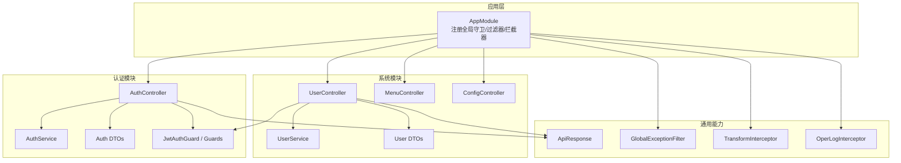
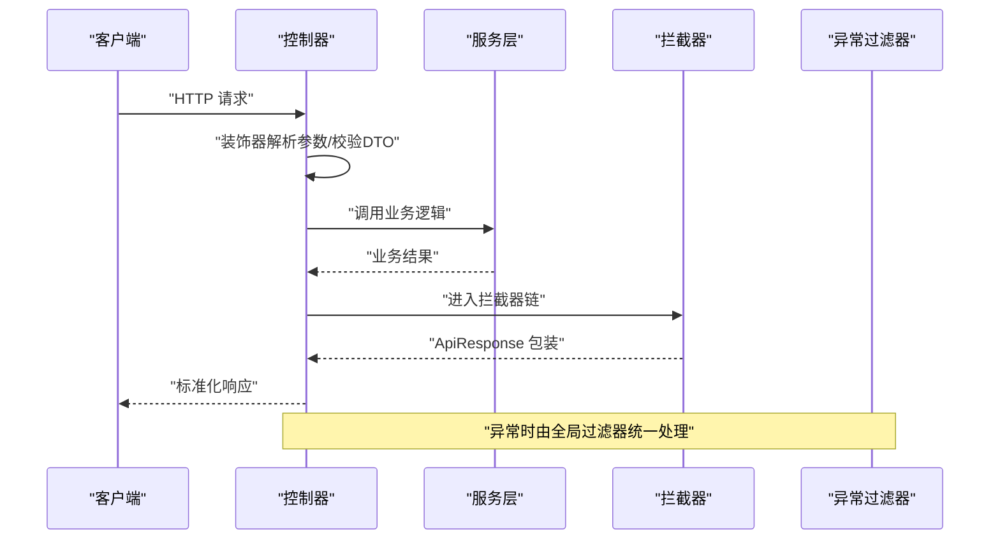
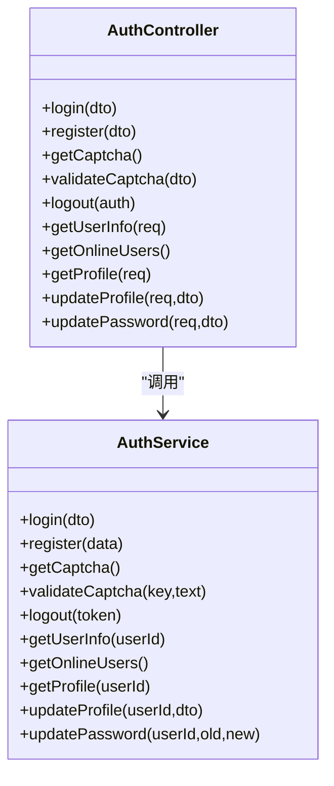
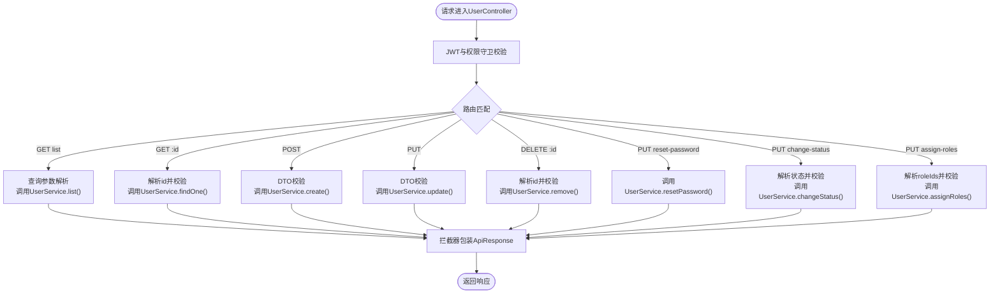
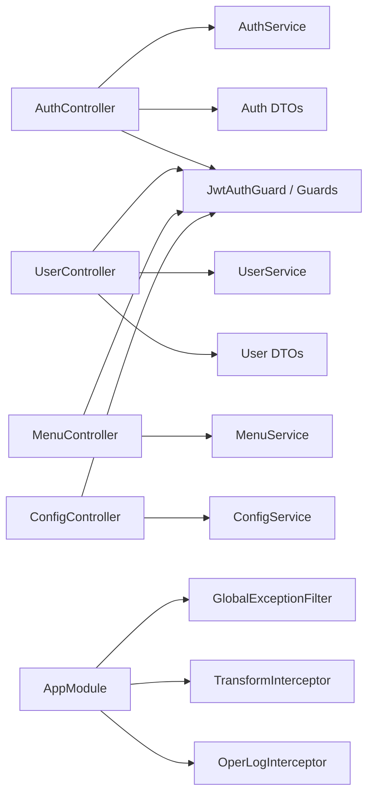

# 控制器开发

<cite>
**本文引用的文件**
- [apps/backend/src/auth/auth.controller.ts](file://apps/backend/src/auth/auth.controller.ts)
- [apps/backend/src/auth/auth.service.ts](file://apps/backend/src/auth/auth.service.ts)
- [apps/backend/src/auth/dto/auth.dto.ts](file://apps/backend/src/auth/dto/auth.dto.ts)
- [apps/backend/src/auth/guards.ts](file://apps/backend/src/auth/guards.ts)
- [apps/backend/src/auth/jwt.guard.ts](file://apps/backend/src/auth/jwt.guard.ts)
- [apps/backend/src/modules/system/user/user.controller.ts](file://apps/backend/src/modules/system/user/user.controller.ts)
- [apps/backend/src/modules/system/user/user.service.ts](file://apps/backend/src/modules/system/user/user.service.ts)
- [apps/backend/src/modules/system/user/dto/user.dto.ts](file://apps/backend/src/modules/system/user/dto/user.dto.ts)
- [apps/backend/src/modules/system/menu/menu.controller.ts](file://apps/backend/src/modules/system/menu/menu.controller.ts)
- [apps/backend/src/modules/system/config/config.controller.ts](file://apps/backend/src/modules/system/config/config.controller.ts)
- [apps/backend/src/common/api-response.ts](file://apps/backend/src/common/api-response.ts)
- [apps/backend/src/common/exception.filter.ts](file://apps/backend/src/common/exception.filter.ts)
- [apps/backend/src/common/transform.interceptor.ts](file://apps/backend/src/common/transform.interceptor.ts)
- [apps/backend/src/common/oper-log.interceptor.ts](file://apps/backend/src/common/oper-log.interceptor.ts)
- [apps/backend/src/app.module.ts](file://apps/backend/src/app.module.ts)
</cite>

## 目录
1. [引言](#引言)
2. [项目结构](#项目结构)
3. [核心组件](#核心组件)
4. [架构总览](#架构总览)
5. [详细组件分析](#详细组件分析)
6. [依赖关系分析](#依赖关系分析)
7. [性能考虑](#性能考虑)
8. [故障排查指南](#故障排查指南)
9. [结论](#结论)
10. [附录](#附录)

## 引言
本指南面向NestJS后端开发者，系统讲解控制器（Controller）的架构设计与开发模式，涵盖HTTP方法映射、路由参数处理、请求体解析、请求验证、业务逻辑调用、响应格式化、装饰器使用、异常处理、拦截器与守卫、以及测试策略与最佳实践。文档以系统模块中的实际控制器为蓝本，展示从认证到用户管理等完整RESTful API开发流程。

## 项目结构
后端采用多模块分层架构，控制器位于各自功能模块下，通过服务层调用数据库与外部能力，统一由应用模块注册全局守卫、过滤器与拦截器，确保一致的安全性、日志与响应格式。

图示来源
- [apps/backend/src/app.module.ts:18-58](file://apps/backend/src/app.module.ts#L18-L58)
- [apps/backend/src/auth/auth.controller.ts:9-87](file://apps/backend/src/auth/auth.controller.ts#L9-L87)
- [apps/backend/src/modules/system/user/user.controller.ts:21-89](file://apps/backend/src/modules/system/user/user.controller.ts#L21-L89)
- [apps/backend/src/common/api-response.ts:1-35](file://apps/backend/src/common/api-response.ts#L1-L35)
- [apps/backend/src/common/exception.filter.ts:12-37](file://apps/backend/src/common/exception.filter.ts#L12-L37)
- [apps/backend/src/common/transform.interceptor.ts:11-29](file://apps/backend/src/common/transform.interceptor.ts#L11-L29)
- [apps/backend/src/common/oper-log.interceptor.ts:11-111](file://apps/backend/src/common/oper-log.interceptor.ts#L11-L111)

章节来源
- [apps/backend/src/app.module.ts:18-58](file://apps/backend/src/app.module.ts#L18-L58)

## 核心组件
- 控制器：负责HTTP路由映射、参数提取、调用服务层并返回标准化响应。
- 服务层：封装业务逻辑，处理数据访问与领域规则。
- DTO：使用class-validator进行请求体与查询参数的自动校验与转换。
- 守卫与装饰器：控制访问权限与公开接口标记。
- 拦截器：统一响应包装、操作日志记录。
- 全局异常过滤器：统一错误响应格式。

章节来源
- [apps/backend/src/auth/auth.controller.ts:9-87](file://apps/backend/src/auth/auth.controller.ts#L9-L87)
- [apps/backend/src/modules/system/user/user.controller.ts:21-89](file://apps/backend/src/modules/system/user/user.controller.ts#L21-L89)
- [apps/backend/src/auth/auth.service.ts:20-294](file://apps/backend/src/auth/auth.service.ts#L20-L294)
- [apps/backend/src/modules/system/user/user.service.ts:11-144](file://apps/backend/src/modules/system/user/user.service.ts#L11-L144)
- [apps/backend/src/auth/dto/auth.dto.ts:1-91](file://apps/backend/src/auth/dto/auth.dto.ts#L1-L91)
- [apps/backend/src/modules/system/user/dto/user.dto.ts:1-131](file://apps/backend/src/modules/system/user/dto/user.dto.ts#L1-L131)
- [apps/backend/src/auth/guards.ts:19-51](file://apps/backend/src/auth/guards.ts#L19-L51)
- [apps/backend/src/auth/jwt.guard.ts:1-5](file://apps/backend/src/auth/jwt.guard.ts#L1-L5)
- [apps/backend/src/common/api-response.ts:1-35](file://apps/backend/src/common/api-response.ts#L1-L35)
- [apps/backend/src/common/exception.filter.ts:12-37](file://apps/backend/src/common/exception.filter.ts#L12-L37)
- [apps/backend/src/common/transform.interceptor.ts:11-29](file://apps/backend/src/common/transform.interceptor.ts#L11-L29)
- [apps/backend/src/common/oper-log.interceptor.ts:11-111](file://apps/backend/src/common/oper-log.interceptor.ts#L11-L111)

## 架构总览
控制器作为入口，接收HTTP请求，利用装饰器完成参数解析与校验；随后调用服务层执行业务逻辑；最终通过拦截器统一包装响应；异常在全局过滤器中统一处理；操作日志由拦截器记录。

图示来源
- [apps/backend/src/auth/auth.controller.ts:13-87](file://apps/backend/src/auth/auth.controller.ts#L13-L87)
- [apps/backend/src/auth/auth.service.ts:29-89](file://apps/backend/src/auth/auth.service.ts#L29-L89)
- [apps/backend/src/common/transform.interceptor.ts:15-28](file://apps/backend/src/common/transform.interceptor.ts#L15-L28)
- [apps/backend/src/common/exception.filter.ts:16-36](file://apps/backend/src/common/exception.filter.ts#L16-L36)

## 详细组件分析

### 认证控制器（AuthController）
职责划分
- 登录、注册、验证码生成与校验、登出、当前用户信息与资料查询、更新资料与密码。
- 使用公共装饰器标注无需鉴权的端点，其余端点通过JWT守卫与权限守卫保护。
- 参数装饰器用于提取请求体、查询参数、路径参数与头部信息；HTTP状态码装饰器用于强制返回码。

请求验证与响应格式化
- DTO类提供字段约束与Swagger注解，配合class-validator自动校验。
- 响应统一使用ApiResponse包装，拦截器会将非ApiResponse对象自动包装为成功响应。

异常处理
- 业务异常抛出标准异常类型，交由全局异常过滤器统一转为错误响应。

图示来源
- [apps/backend/src/auth/auth.controller.ts:10-87](file://apps/backend/src/auth/auth.controller.ts#L10-L87)
- [apps/backend/src/auth/auth.service.ts:20-294](file://apps/backend/src/auth/auth.service.ts#L20-L294)

章节来源
- [apps/backend/src/auth/auth.controller.ts:9-87](file://apps/backend/src/auth/auth.controller.ts#L9-L87)
- [apps/backend/src/auth/auth.service.ts:20-294](file://apps/backend/src/auth/auth.service.ts#L20-L294)
- [apps/backend/src/auth/dto/auth.dto.ts:1-91](file://apps/backend/src/auth/dto/auth.dto.ts#L1-L91)
- [apps/backend/src/auth/guards.ts:19-51](file://apps/backend/src/auth/guards.ts#L19-L51)
- [apps/backend/src/auth/jwt.guard.ts:1-5](file://apps/backend/src/auth/jwt.guard.ts#L1-L5)
- [apps/backend/src/common/api-response.ts:1-35](file://apps/backend/src/common/api-response.ts#L1-L35)
- [apps/backend/src/common/transform.interceptor.ts:11-29](file://apps/backend/src/common/transform.interceptor.ts#L11-L29)
- [apps/backend/src/common/exception.filter.ts:12-37](file://apps/backend/src/common/exception.filter.ts#L12-L37)

### 系统-用户控制器（UserController）
职责划分
- 用户列表、详情、创建、更新、删除、重置密码、修改状态、分配角色。
- 使用JWT与权限守卫，配合RequirePermission装饰器细化权限控制。
- 查询参数使用ParseIntPipe进行强类型转换，保证安全与一致性。

请求验证与响应格式化
- 查询DTO包含分页与筛选条件，使用class-transformer与class-validator进行转换与校验。
- 响应统一由拦截器包装为ApiResponse。

图示来源
- [apps/backend/src/modules/system/user/user.controller.ts:21-89](file://apps/backend/src/modules/system/user/user.controller.ts#L21-L89)
- [apps/backend/src/modules/system/user/user.service.ts:11-144](file://apps/backend/src/modules/system/user/user.service.ts#L11-L144)
- [apps/backend/src/modules/system/user/dto/user.dto.ts:94-131](file://apps/backend/src/modules/system/user/dto/user.dto.ts#L94-L131)

章节来源
- [apps/backend/src/modules/system/user/user.controller.ts:21-89](file://apps/backend/src/modules/system/user/user.controller.ts#L21-L89)
- [apps/backend/src/modules/system/user/user.service.ts:11-144](file://apps/backend/src/modules/system/user/user.service.ts#L11-L144)
- [apps/backend/src/modules/system/user/dto/user.dto.ts:1-131](file://apps/backend/src/modules/system/user/dto/user.dto.ts#L1-L131)

### 菜单与参数控制器（MenuController、ConfigController）
职责划分
- 菜单管理：列表、树形结构、按用户构建路由、CRUD。
- 参数管理：列表、按键查询、CRUD、刷新缓存。

权限控制
- 同样采用JWT与权限守卫，RequirePermission细化到每个端点。

章节来源
- [apps/backend/src/modules/system/menu/menu.controller.ts:11-67](file://apps/backend/src/modules/system/menu/menu.controller.ts#L11-L67)
- [apps/backend/src/modules/system/config/config.controller.ts:8-63](file://apps/backend/src/modules/system/config/config.controller.ts#L8-L63)

## 依赖关系分析
- 控制器依赖服务层与DTO，不直接操作数据库。
- 守卫与装饰器在控制器层面声明式启用，减少重复逻辑。
- 全局注册的拦截器与过滤器贯穿所有控制器，保证一致性。
- JWT守卫基于Passport，权限守卫基于Reflector读取元数据。

图示来源
- [apps/backend/src/auth/auth.controller.ts:9-87](file://apps/backend/src/auth/auth.controller.ts#L9-L87)
- [apps/backend/src/modules/system/user/user.controller.ts:21-89](file://apps/backend/src/modules/system/user/user.controller.ts#L21-L89)
- [apps/backend/src/auth/guards.ts:19-51](file://apps/backend/src/auth/guards.ts#L19-L51)
- [apps/backend/src/auth/jwt.guard.ts:1-5](file://apps/backend/src/auth/jwt.guard.ts#L1-L5)
- [apps/backend/src/app.module.ts:39-56](file://apps/backend/src/app.module.ts#L39-L56)

章节来源
- [apps/backend/src/auth/guards.ts:19-51](file://apps/backend/src/auth/guards.ts#L19-L51)
- [apps/backend/src/auth/jwt.guard.ts:1-5](file://apps/backend/src/auth/jwt.guard.ts#L1-L5)
- [apps/backend/src/app.module.ts:39-56](file://apps/backend/src/app.module.ts#L39-L56)

## 性能考虑
- 批量查询使用Promise并发计数与分页，避免N+1查询。
- 操作日志拦截器对敏感字段脱敏与长度限制，降低存储与传输开销。
- 全局拦截器仅做轻量包装，避免在控制器内重复处理响应。
- 验证失败尽早返回，减少后续处理成本。

## 故障排查指南
常见问题与定位
- 响应未被统一包装：检查是否正确注册了TransformInterceptor。
- 错误未被全局捕获：确认GlobalExceptionFilter已注册为APP_FILTER。
- 权限不足或未登录：核对JWT守卫与RequirePermission装饰器是否正确设置。
- 操作日志缺失：检查OperLogInterceptor的过滤条件与PrismaService可用性。

章节来源
- [apps/backend/src/common/transform.interceptor.ts:11-29](file://apps/backend/src/common/transform.interceptor.ts#L11-L29)
- [apps/backend/src/common/exception.filter.ts:12-37](file://apps/backend/src/common/exception.filter.ts#L12-L37)
- [apps/backend/src/common/oper-log.interceptor.ts:11-111](file://apps/backend/src/common/oper-log.interceptor.ts#L11-L111)
- [apps/backend/src/app.module.ts:39-56](file://apps/backend/src/app.module.ts#L39-L56)

## 结论
通过明确的职责划分、严格的参数校验、统一的响应与异常处理、以及可插拔的守卫与拦截器，系统实现了高内聚、低耦合且易于维护的控制器层。遵循本文的开发模式与最佳实践，可在保证安全性与可扩展性的前提下快速迭代RESTful API。

## 附录

### 装饰器与参数解析要点
- 路由装饰器：Get/Post/Put/Delete/Param/Query/Body/Headers/HttpCode。
- 参数装饰器：Req/Res/Next/Param/Query/Body/Headers/Session/Cookies/Host/Ip。
- 管道装饰器：ParseIntPipe/ParseBoolPipe/ParseFloatPipe/ValidationPipe（需在控制器或全局注册）。
- 守卫装饰器：UseGuards/JwtAuthGuard/RequirePermission/RequireRole/Public。

章节来源
- [apps/backend/src/auth/auth.controller.ts:1-87](file://apps/backend/src/auth/auth.controller.ts#L1-L87)
- [apps/backend/src/modules/system/user/user.controller.ts:1-89](file://apps/backend/src/modules/system/user/user.controller.ts#L1-L89)
- [apps/backend/src/auth/guards.ts:10-17](file://apps/backend/src/auth/guards.ts#L10-L17)
- [apps/backend/src/auth/jwt.guard.ts:1-5](file://apps/backend/src/auth/jwt.guard.ts#L1-L5)

### 测试策略建议
- 单元测试：针对控制器的装饰器行为与服务调用边界，使用Nest的Test工具构造上下文。
- 集成测试：启动AppModule，注入Mock服务，验证拦截器、过滤器与守卫的协作。
- 端到端测试：使用supertest发起真实HTTP请求，覆盖完整请求链路与错误场景。

### 最佳实践清单
- 将业务逻辑全部下沉至服务层，控制器只做编排。
- 使用DTO进行输入校验，保持接口契约清晰。
- 统一使用ApiResponse与拦截器，避免手写重复响应。
- 明确区分公开接口与受保护接口，谨慎使用Public装饰器。
- 对敏感字段在日志与响应中进行脱敏处理。
- 在高频接口上启用节流与缓存，提升稳定性与性能。