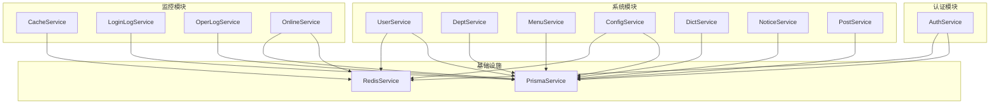
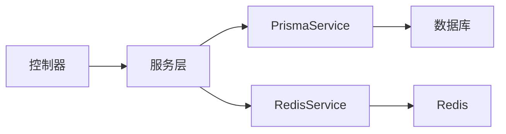
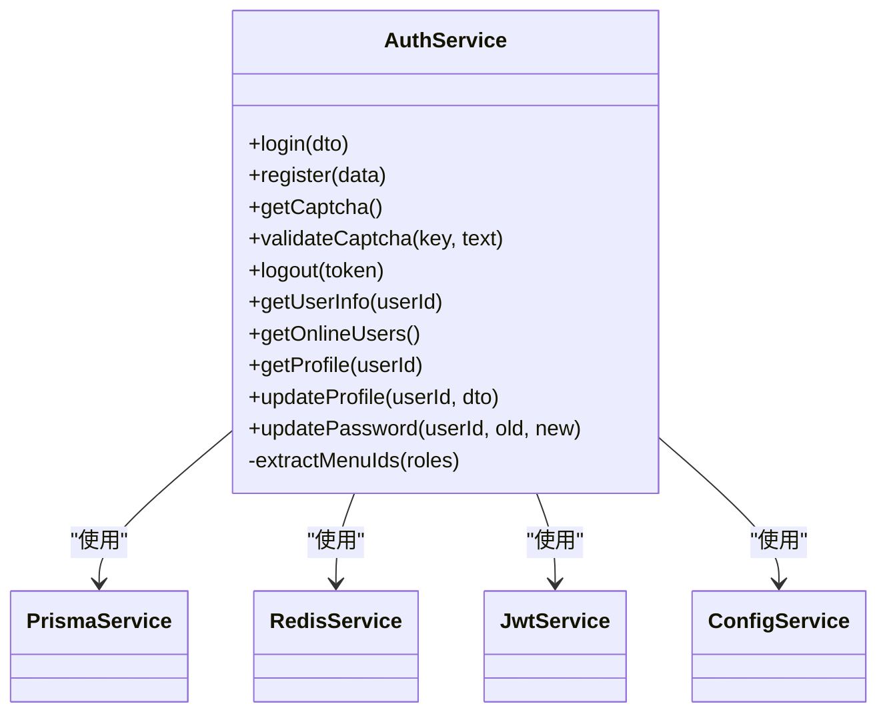
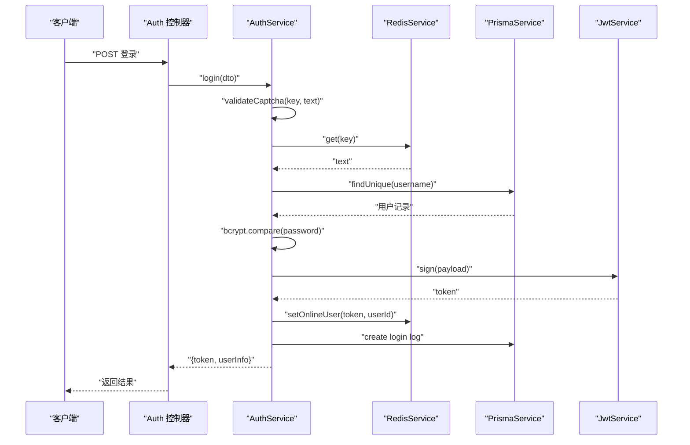
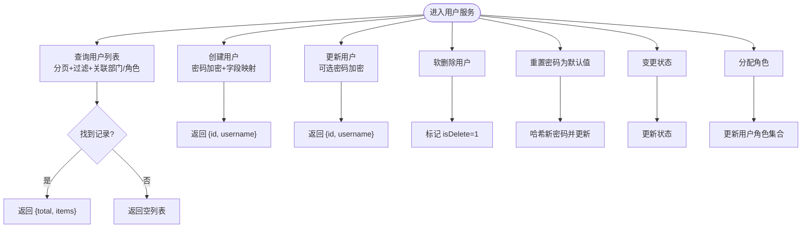
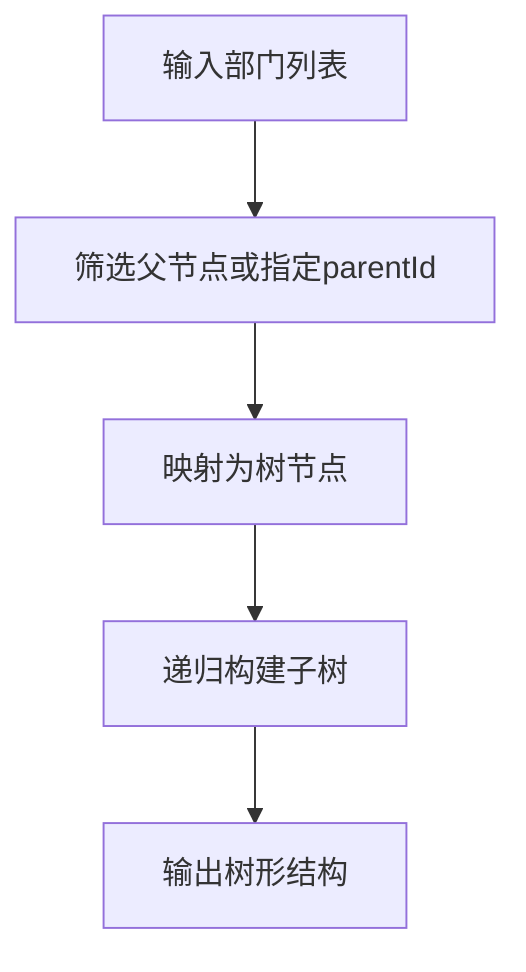
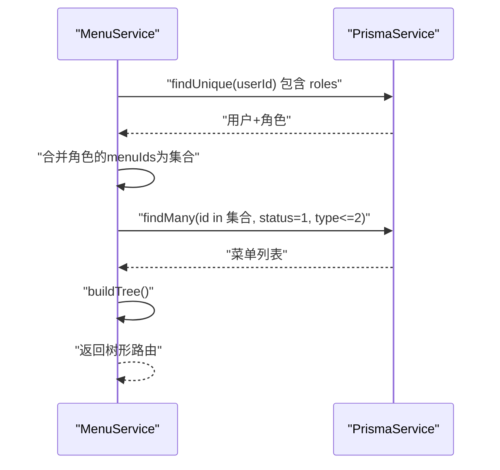
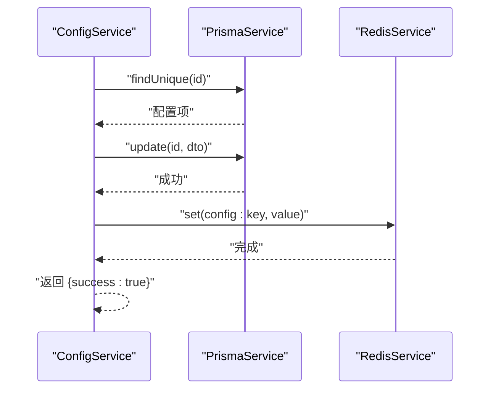
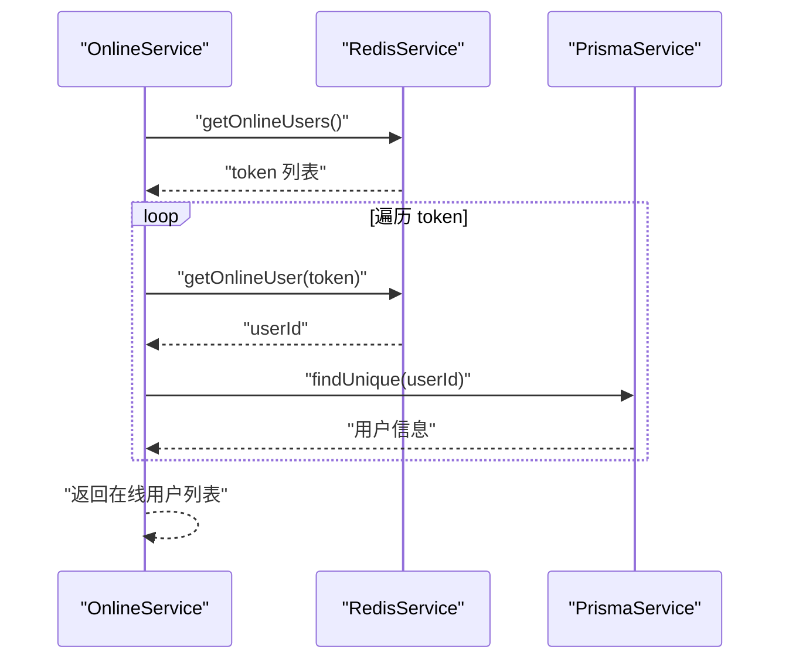
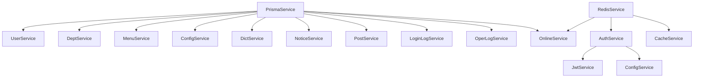

# 服务层实现

<cite>
**本文引用的文件**
- [apps/backend/src/auth/auth.service.ts](file://apps/backend/src/auth/auth.service.ts)
- [apps/backend/src/common/prisma.service.ts](file://apps/backend/src/common/prisma.service.ts)
- [apps/backend/src/cache/redis.service.ts](file://apps/backend/src/cache/redis.service.ts)
- [apps/backend/src/modules/system/user/user.service.ts](file://apps/backend/src/modules/system/user/user.service.ts)
- [apps/backend/src/modules/system/dept/dept.service.ts](file://apps/backend/src/modules/system/dept/dept.service.ts)
- [apps/backend/src/modules/system/menu/menu.service.ts](file://apps/backend/src/modules/system/menu/menu.service.ts)
- [apps/backend/src/modules/system/config/config.service.ts](file://apps/backend/src/modules/system/config/config.service.ts)
- [apps/backend/src/modules/system/dict/dict.service.ts](file://apps/backend/src/modules/system/dict/dict.service.ts)
- [apps/backend/src/modules/system/notice/notice.service.ts](file://apps/backend/src/modules/system/notice/notice.service.ts)
- [apps/backend/src/modules/system/post/post.service.ts](file://apps/backend/src/modules/system/post/post.service.ts)
- [apps/backend/src/modules/monitor/cache/cache.service.ts](file://apps/backend/src/modules/monitor/cache/cache.service.ts)
- [apps/backend/src/modules/monitor/login-log/login-log.service.ts](file://apps/backend/src/modules/monitor/login-log/login-log.service.ts)
- [apps/backend/src/modules/monitor/oper-log/oper-log.service.ts](file://apps/backend/src/modules/monitor/oper-log/oper-log.service.ts)
- [apps/backend/src/modules/monitor/online/online.service.ts](file://apps/backend/src/modules/monitor/online/online.service.ts)
</cite>

## 目录
1. [引言](#引言)
2. [项目结构](#项目结构)
3. [核心组件](#核心组件)
4. [架构总览](#架构总览)
5. [详细组件分析](#详细组件分析)
6. [依赖关系分析](#依赖关系分析)
7. [性能考虑](#性能考虑)
8. [故障排查指南](#故障排查指南)
9. [结论](#结论)
10. [附录](#附录)

## 引言
本指南聚焦于 NestJS 服务层的设计与实现，结合系统中已有的服务实现，系统讲解以下主题：
- 业务逻辑封装：如何在服务层组织业务规则与数据处理
- 数据访问层交互：Prisma 客户端的使用与连接生命周期
- 事务管理：当前实现中的事务边界与一致性策略
- 依赖注入：构造函数注入、属性注入与可选注入的应用
- 职责划分：业务规则、数据验证、外部服务调用的边界
- 生命周期管理：单例模式、作用域与内存优化
- 异常处理：业务异常、系统异常与错误传播策略
- 最佳实践：代码组织、性能优化与可测试性设计

## 项目结构
后端采用模块化组织，服务层位于 modules/system 与 modules/monitor 下，公共基础设施位于 common 与 cache。整体结构清晰，遵循“按功能域分模块”的组织方式。

图表来源
- [apps/backend/src/auth/auth.service.ts:20-294](file://apps/backend/src/auth/auth.service.ts#L20-L294)
- [apps/backend/src/modules/system/user/user.service.ts:11-144](file://apps/backend/src/modules/system/user/user.service.ts#L11-L144)
- [apps/backend/src/modules/system/dept/dept.service.ts:5-73](file://apps/backend/src/modules/system/dept/dept.service.ts#L5-L73)
- [apps/backend/src/modules/system/menu/menu.service.ts:5-95](file://apps/backend/src/modules/system/menu/menu.service.ts#L5-L95)
- [apps/backend/src/modules/system/config/config.service.ts:6-56](file://apps/backend/src/modules/system/config/config.service.ts#L6-L56)
- [apps/backend/src/modules/system/dict/dict.service.ts:5-59](file://apps/backend/src/modules/system/dict/dict.service.ts#L5-L59)
- [apps/backend/src/modules/system/notice/notice.service.ts:5-44](file://apps/backend/src/modules/system/notice/notice.service.ts#L5-L44)
- [apps/backend/src/modules/system/post/post.service.ts:5-44](file://apps/backend/src/modules/system/post/post.service.ts#L5-L44)
- [apps/backend/src/modules/monitor/cache/cache.service.ts:4-29](file://apps/backend/src/modules/monitor/cache/cache.service.ts#L4-L29)
- [apps/backend/src/modules/monitor/login-log/login-log.service.ts:4-31](file://apps/backend/src/modules/monitor/login-log/login-log.service.ts#L4-L31)
- [apps/backend/src/modules/monitor/oper-log/oper-log.service.ts:4-33](file://apps/backend/src/modules/monitor/oper-log/oper-log.service.ts#L4-L33)
- [apps/backend/src/modules/monitor/online/online.service.ts:5-31](file://apps/backend/src/modules/monitor/online/online.service.ts#L5-L31)
- [apps/backend/src/common/prisma.service.ts:4-22](file://apps/backend/src/common/prisma.service.ts#L4-L22)
- [apps/backend/src/cache/redis.service.ts:4-128](file://apps/backend/src/cache/redis.service.ts#L4-L128)

章节来源
- [apps/backend/src/auth/auth.service.ts:20-294](file://apps/backend/src/auth/auth.service.ts#L20-L294)
- [apps/backend/src/common/prisma.service.ts:4-22](file://apps/backend/src/common/prisma.service.ts#L4-L22)
- [apps/backend/src/cache/redis.service.ts:4-128](file://apps/backend/src/cache/redis.service.ts#L4-L128)

## 核心组件
本节梳理服务层的关键组件及其职责：
- 认证服务（AuthService）：登录、注册、验证码校验、登出、用户信息与菜单权限构建、密码更新等
- 系统用户服务（UserService）：用户列表、详情、创建、更新、删除、重置密码、状态变更、角色分配
- 部门服务（DeptService）：部门树形查询、新增、更新、删除
- 菜单服务（MenuService）：菜单树形查询、路由构建、新增、更新、删除
- 参数配置服务（ConfigService）：配置项 CRUD，并同步到 Redis 缓存
- 字典服务（DictService）：字典类型与数据 CRUD
- 公告服务（NoticeService）：公告分页与 CRUD
- 岗位服务（PostService）：岗位分页与 CRUD
- 监控服务：缓存监控（CacheService）、登录日志（LoginLogService）、操作日志（OperLogService）、在线用户（OnlineService）

章节来源
- [apps/backend/src/auth/auth.service.ts:29-292](file://apps/backend/src/auth/auth.service.ts#L29-L292)
- [apps/backend/src/modules/system/user/user.service.ts:18-143](file://apps/backend/src/modules/system/user/user.service.ts#L18-L143)
- [apps/backend/src/modules/system/dept/dept.service.ts:9-71](file://apps/backend/src/modules/system/dept/dept.service.ts#L9-L71)
- [apps/backend/src/modules/system/menu/menu.service.ts:9-93](file://apps/backend/src/modules/system/menu/menu.service.ts#L9-L93)
- [apps/backend/src/modules/system/config/config.service.ts:10-55](file://apps/backend/src/modules/system/config/config.service.ts#L10-L55)
- [apps/backend/src/modules/system/dict/dict.service.ts:9-58](file://apps/backend/src/modules/system/dict/dict.service.ts#L9-L58)
- [apps/backend/src/modules/system/notice/notice.service.ts:9-43](file://apps/backend/src/modules/system/notice/notice.service.ts#L9-L43)
- [apps/backend/src/modules/system/post/post.service.ts:9-43](file://apps/backend/src/modules/system/post/post.service.ts#L9-L43)
- [apps/backend/src/modules/monitor/cache/cache.service.ts:8-28](file://apps/backend/src/modules/monitor/cache/cache.service.ts#L8-L28)
- [apps/backend/src/modules/monitor/login-log/login-log.service.ts:8-30](file://apps/backend/src/modules/monitor/login-log/login-log.service.ts#L8-L30)
- [apps/backend/src/modules/monitor/oper-log/oper-log.service.ts:8-32](file://apps/backend/src/modules/monitor/oper-log/oper-log.service.ts#L8-L32)
- [apps/backend/src/modules/monitor/online/online.service.ts:9-30](file://apps/backend/src/modules/monitor/online/online.service.ts#L9-L30)

## 架构总览
服务层围绕“领域服务 + 数据访问 + 外部集成”三层进行职责分离：
- 领域服务：封装业务规则与流程编排（如 AuthService）
- 数据访问：统一通过 PrismaService 进行数据库交互
- 外部集成：RedisService 提供缓存与会话管理能力
- 控制器：仅负责请求参数解析与响应包装，不包含业务逻辑

图表来源
- [apps/backend/src/auth/auth.service.ts:22-27](file://apps/backend/src/auth/auth.service.ts#L22-L27)
- [apps/backend/src/common/prisma.service.ts:4-22](file://apps/backend/src/common/prisma.service.ts#L4-L22)
- [apps/backend/src/cache/redis.service.ts:4-27](file://apps/backend/src/cache/redis.service.ts#L4-L27)

## 详细组件分析

### 认证服务（AuthService）
AuthService 是典型的“业务编排型服务”，负责登录、注册、验证码、JWT 签发、在线用户维护与菜单权限构建等。

图表来源
- [apps/backend/src/auth/auth.service.ts:20-294](file://apps/backend/src/auth/auth.service.ts#L20-L294)
- [apps/backend/src/common/prisma.service.ts:4-22](file://apps/backend/src/common/prisma.service.ts#L4-L22)
- [apps/backend/src/cache/redis.service.ts:4-128](file://apps/backend/src/cache/redis.service.ts#L4-L128)

图表来源
- [apps/backend/src/auth/auth.service.ts:29-89](file://apps/backend/src/auth/auth.service.ts#L29-L89)
- [apps/backend/src/cache/redis.service.ts:83-99](file://apps/backend/src/cache/redis.service.ts#L83-L99)
- [apps/backend/src/common/prisma.service.ts:14-21](file://apps/backend/src/common/prisma.service.ts#L14-L21)

章节来源
- [apps/backend/src/auth/auth.service.ts:29-292](file://apps/backend/src/auth/auth.service.ts#L29-L292)

### 用户服务（UserService）
UserService 实现用户全量 CRUD 与状态变更、角色分配等业务逻辑，统一通过 PrismaService 访问数据库。

图表来源
- [apps/backend/src/modules/system/user/user.service.ts:18-143](file://apps/backend/src/modules/system/user/user.service.ts#L18-L143)

章节来源
- [apps/backend/src/modules/system/user/user.service.ts:18-143](file://apps/backend/src/modules/system/user/user.service.ts#L18-L143)

### 部门服务（DeptService）
DeptService 提供部门树形结构构建与标准 CRUD 操作，内部通过递归构建树形结构。

图表来源
- [apps/backend/src/modules/system/dept/dept.service.ts:29-37](file://apps/backend/src/modules/system/dept/dept.service.ts#L29-L37)

章节来源
- [apps/backend/src/modules/system/dept/dept.service.ts:9-71](file://apps/backend/src/modules/system/dept/dept.service.ts#L9-L71)

### 菜单服务（MenuService）
MenuService 支持菜单树形结构与基于用户角色的路由构建，核心在于聚合用户所有角色的菜单 ID 并过滤有效菜单。

图表来源
- [apps/backend/src/modules/system/menu/menu.service.ts:34-55](file://apps/backend/src/modules/system/menu/menu.service.ts#L34-L55)

章节来源
- [apps/backend/src/modules/system/menu/menu.service.ts:9-93](file://apps/backend/src/modules/system/menu/menu.service.ts#L9-L93)

### 配置服务（ConfigService）
ConfigService 在更新配置时同步刷新 Redis 缓存键值，确保读取一致性。

图表来源
- [apps/backend/src/modules/system/config/config.service.ts:37-42](file://apps/backend/src/modules/system/config/config.service.ts#L37-L42)

章节来源
- [apps/backend/src/modules/system/config/config.service.ts:10-55](file://apps/backend/src/modules/system/config/config.service.ts#L10-L55)

### 在线用户服务（OnlineService）
OnlineService 结合 Redis 的在线集合与 Prisma 的用户表，实现在线用户列表与强制下线。

图表来源
- [apps/backend/src/modules/monitor/online/online.service.ts:9-25](file://apps/backend/src/modules/monitor/online/online.service.ts#L9-L25)

章节来源
- [apps/backend/src/modules/monitor/online/online.service.ts:9-30](file://apps/backend/src/modules/monitor/online/online.service.ts#L9-L30)

## 依赖关系分析
- 单例与共享：PrismaService 与 RedisService 均为单例，贯穿各业务服务
- 服务耦合：业务服务均依赖 PrismaService；部分监控与配置服务依赖 RedisService
- 外部依赖：AuthService 依赖 JwtService 与 ConfigService，用于签发令牌与读取配置
- 可能的循环依赖：当前未发现直接循环依赖，但需避免在@Injectable()装饰器外层引入相互依赖的类

图表来源
- [apps/backend/src/auth/auth.service.ts:22-27](file://apps/backend/src/auth/auth.service.ts#L22-L27)
- [apps/backend/src/common/prisma.service.ts:4-22](file://apps/backend/src/common/prisma.service.ts#L4-L22)
- [apps/backend/src/cache/redis.service.ts:4-128](file://apps/backend/src/cache/redis.service.ts#L4-L128)
- [apps/backend/src/modules/system/config/config.service.ts:8-8](file://apps/backend/src/modules/system/config/config.service.ts#L8-L8)

章节来源
- [apps/backend/src/auth/auth.service.ts:22-27](file://apps/backend/src/auth/auth.service.ts#L22-L27)
- [apps/backend/src/common/prisma.service.ts:4-22](file://apps/backend/src/common/prisma.service.ts#L4-L22)
- [apps/backend/src/cache/redis.service.ts:4-128](file://apps/backend/src/cache/redis.service.ts#L4-L128)

## 性能考虑
- 批量查询与并发：用户列表与公告列表使用 Promise.all 并发统计与查询，减少往返时间
- 分页与排序：统一使用 skip/take 与 orderBy，避免一次性加载大结果集
- 缓存利用：验证码、在线用户、配置项等使用 Redis 缓存，降低数据库压力
- 密码哈希成本：bcrypt 使用固定成本，建议在配置层统一管理成本参数
- 日志与监控：PrismaService 配置了错误与警告日志级别，便于定位性能瓶颈

章节来源
- [apps/backend/src/modules/system/user/user.service.ts:27-36](file://apps/backend/src/modules/system/user/user.service.ts#L27-L36)
- [apps/backend/src/modules/system/notice/notice.service.ts:15-19](file://apps/backend/src/modules/system/notice/notice.service.ts#L15-L19)
- [apps/backend/src/common/prisma.service.ts:8-12](file://apps/backend/src/common/prisma.service.ts#L8-L12)

## 故障排查指南
- 数据库连接问题：检查 PrismaService 的 onModuleInit/onModuleDestroy 生命周期钩子是否正确执行
- Redis 连接问题：确认环境变量与连接事件回调，关注 error 事件日志
- 业务异常抛出：服务层广泛使用 BadRequestException、UnauthorizedException、NotFoundException 等，便于前端统一处理
- 错误传播：控制器捕获异常后由全局异常过滤器统一转换为 ApiResponse 格式

章节来源
- [apps/backend/src/common/prisma.service.ts:14-21](file://apps/backend/src/common/prisma.service.ts#L14-L21)
- [apps/backend/src/cache/redis.service.ts:16-22](file://apps/backend/src/cache/redis.service.ts#L16-L22)
- [apps/backend/src/auth/auth.service.ts:31-59](file://apps/backend/src/auth/auth.service.ts#L31-L59)
- [apps/backend/src/modules/system/user/user.service.ts:58-61](file://apps/backend/src/modules/system/user/user.service.ts#L58-L61)

## 结论
该服务层实现了清晰的职责划分与良好的依赖注入实践，通过 Prisma 与 Redis 统一数据访问与缓存，配合控制器进行参数与响应标准化，形成高内聚、低耦合的服务架构。建议在后续迭代中进一步完善事务边界、统一异常处理与埋点监控，以提升可观测性与一致性保障。

## 附录

### 依赖注入最佳实践
- 构造函数注入：优先使用构造函数注入以获得不可变依赖与更好的可测试性
- 属性注入：仅用于可选依赖或运行时可变配置
- 可选注入：谨慎使用，确保在缺失依赖时有明确降级策略

章节来源
- [apps/backend/src/auth/auth.service.ts:22-27](file://apps/backend/src/auth/auth.service.ts#L22-L27)
- [apps/backend/src/modules/system/config/config.service.ts:8-8](file://apps/backend/src/modules/system/config/config.service.ts#L8-L8)

### 事务管理现状与建议
- 现状：当前服务层未显式使用 Prisma 事务 API，多数操作为单表写入或简单查询
- 建议：对于跨表写入、批量更新、幂等写入等场景，引入 Prisma 事务以保证一致性；在 AuthService 中的登录流程可考虑将“生成 token + 在线用户登记 + 登录日志”放入同一事务

章节来源
- [apps/backend/src/auth/auth.service.ts:62-74](file://apps/backend/src/auth/auth.service.ts#L62-L74)
- [apps/backend/src/modules/system/user/user.service.ts:102-106](file://apps/backend/src/modules/system/user/user.service.ts#L102-L106)

### 生命周期与内存优化
- 单例模式：PrismaService 与 RedisService 为单例，减少重复初始化开销
- 连接管理：PrismaService 在 onModuleInit/connect 与 onModuleDestroy/disconnect 间建立/断开连接
- 内存优化：避免在服务中缓存大对象；使用流式处理与分页；及时释放 Redis 过期键

章节来源
- [apps/backend/src/common/prisma.service.ts:14-21](file://apps/backend/src/common/prisma.service.ts#L14-L21)
- [apps/backend/src/cache/redis.service.ts:25-27](file://apps/backend/src/cache/redis.service.ts#L25-L27)

### 异常处理策略
- 业务异常：用户名已存在、旧密码错误、用户不存在等使用 BadRequestException/UnauthorizedException/NotFoundException
- 系统异常：数据库连接失败、Redis 连接异常等由基础设施层抛出并由全局过滤器统一处理
- 错误传播：控制器捕获异常并转换为 ApiResponse，保持接口一致性

章节来源
- [apps/backend/src/auth/auth.service.ts:91-107](file://apps/backend/src/auth/auth.service.ts#L91-L107)
- [apps/backend/src/modules/system/user/user.service.ts:58-86](file://apps/backend/src/modules/system/user/user.service.ts#L58-L86)