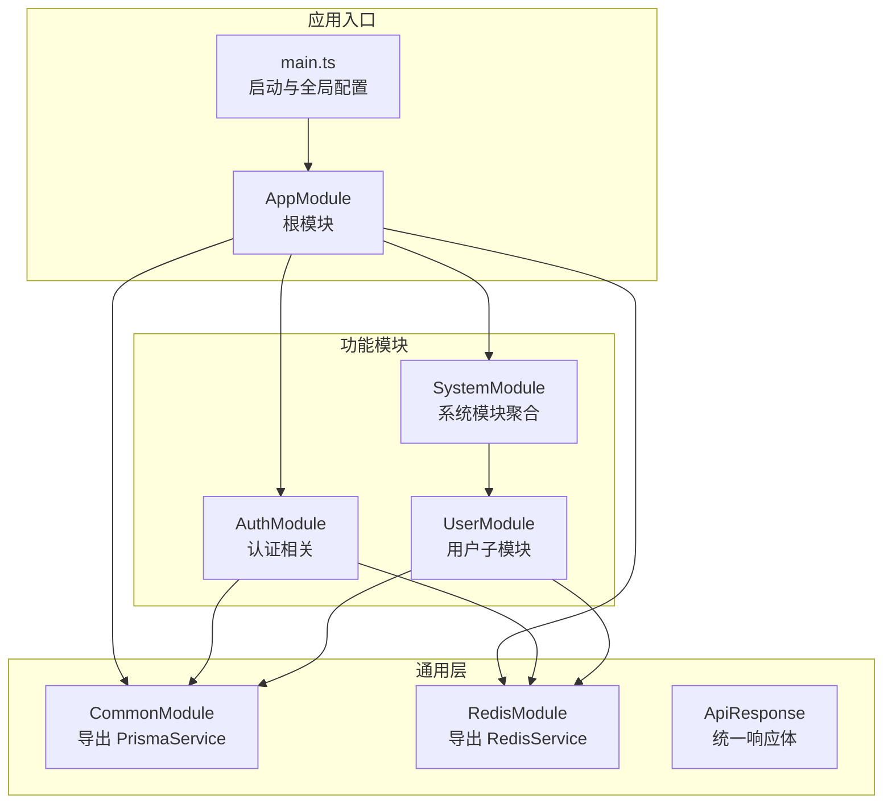
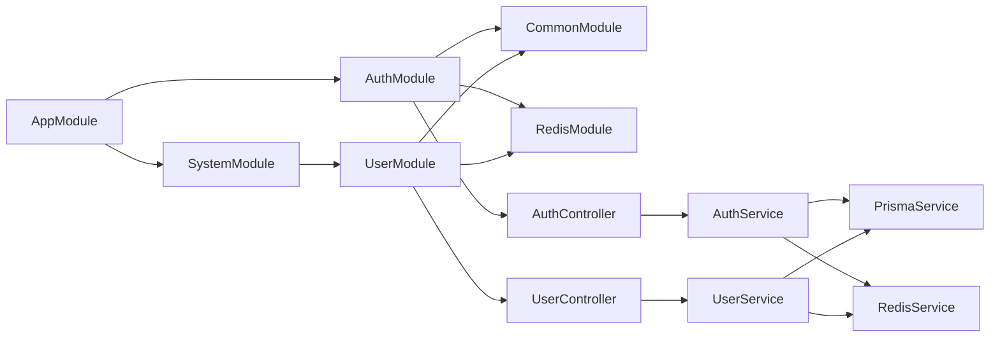
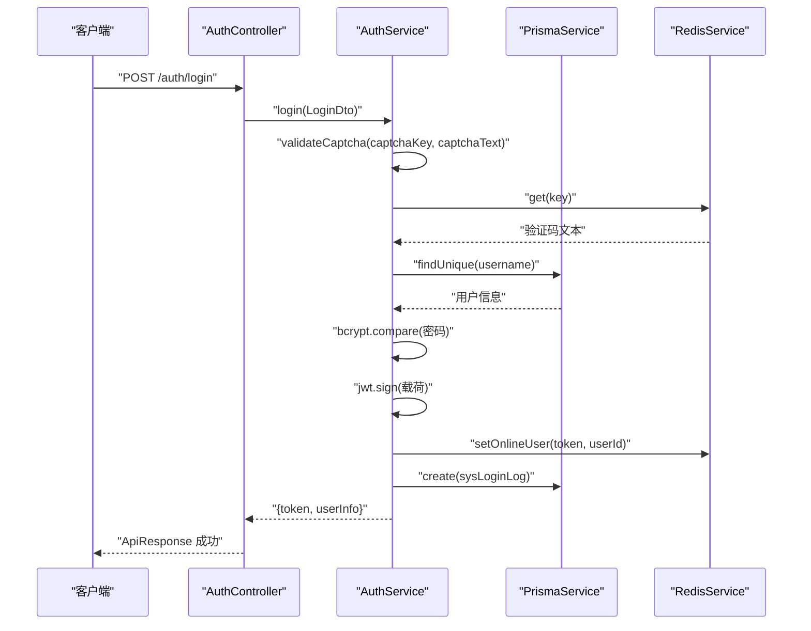
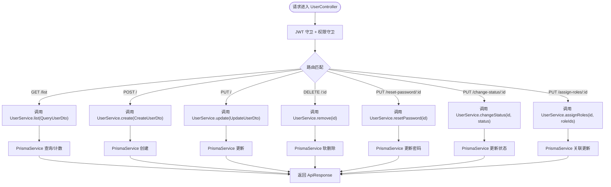
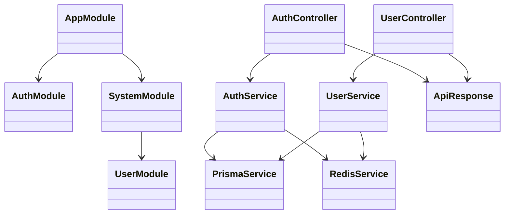

# 模块开发

<cite>
**本文引用的文件**
- [apps/backend/src/app.module.ts](file://apps/backend/src/app.module.ts)
- [apps/backend/src/main.ts](file://apps/backend/src/main.ts)
- [apps/backend/src/auth/auth.module.ts](file://apps/backend/src/auth/auth.module.ts)
- [apps/backend/src/auth/auth.controller.ts](file://apps/backend/src/auth/auth.controller.ts)
- [apps/backend/src/auth/auth.service.ts](file://apps/backend/src/auth/auth.service.ts)
- [apps/backend/src/auth/dto/auth.dto.ts](file://apps/backend/src/auth/dto/auth.dto.ts)
- [apps/backend/src/modules/system/system.module.ts](file://apps/backend/src/modules/system/system.module.ts)
- [apps/backend/src/modules/system/user/user.module.ts](file://apps/backend/src/modules/system/user/user.module.ts)
- [apps/backend/src/modules/system/user/user.controller.ts](file://apps/backend/src/modules/system/user/user.controller.ts)
- [apps/backend/src/modules/system/user/user.service.ts](file://apps/backend/src/modules/system/user/user.service.ts)
- [apps/backend/src/modules/system/user/dto/user.dto.ts](file://apps/backend/src/modules/system/user/dto/user.dto.ts)
- [apps/backend/src/common/api-response.ts](file://apps/backend/src/common/api-response.ts)
- [apps/backend/src/common/common.module.ts](file://apps/backend/src/common/common.module.ts)
- [apps/backend/src/cache/redis.module.ts](file://apps/backend/src/cache/redis.module.ts)
- [apps/backend/src/cache/redis.service.ts](file://apps/backend/src/cache/redis.service.ts)
</cite>

## 目录
1. [引言](#引言)
2. [项目结构](#项目结构)
3. [核心组件](#核心组件)
4. [架构总览](#架构总览)
5. [详细组件分析](#详细组件分析)
6. [依赖分析](#依赖分析)
7. [性能考虑](#性能考虑)
8. [故障排查指南](#故障排查指南)
9. [结论](#结论)
10. [附录：完整模块开发示例流程](#附录完整模块开发示例流程)

## 引言
本指南面向在 NestJS 架构下进行模块开发的工程师，系统讲解如何从零构建一个功能模块，涵盖模块基本结构、依赖注入与模块间依赖管理、DTO 设计规范（含验证规则、数据类型与错误处理）、控制器开发（HTTP 映射、参数处理、响应格式化与异常处理）、服务层实现（业务封装、事务与数据访问交互）、以及模块注册与导入最佳实践（循环依赖规避与加载顺序）。文末提供从需求分析到代码实现的完整示例流程，帮助读者快速上手。

## 项目结构
后端采用多模块分层组织，根模块负责全局配置与模块聚合；认证模块提供登录、注册、验证码、用户信息等能力；系统模块聚合多个子域模块（用户、角色、菜单、字典等）；通用模块提供全局服务（如数据库与缓存），缓存模块提供 Redis 能力；统一响应体与拦截器/过滤器贯穿全局。

图表来源
- [apps/backend/src/app.module.ts:18-58](file://apps/backend/src/app.module.ts#L18-L58)
- [apps/backend/src/main.ts:8-46](file://apps/backend/src/main.ts#L8-L46)
- [apps/backend/src/common/common.module.ts:4-8](file://apps/backend/src/common/common.module.ts#L4-L8)
- [apps/backend/src/cache/redis.module.ts:4-8](file://apps/backend/src/cache/redis.module.ts#L4-L8)
- [apps/backend/src/modules/system/system.module.ts:11-22](file://apps/backend/src/modules/system/system.module.ts#L11-L22)

章节来源
- [apps/backend/src/app.module.ts:18-58](file://apps/backend/src/app.module.ts#L18-L58)
- [apps/backend/src/main.ts:8-46](file://apps/backend/src/main.ts#L8-L46)

## 核心组件
- 根模块与全局配置
  - 全局启用 CORS、统一前缀、全局校验管道、Swagger 文档、静态资源服务等。
  - 注册认证、系统、监控、文件、代码生成等模块，并通过全局守卫/过滤器/拦截器统一行为。
- 通用模块与服务
  - 全局导出 PrismaService，供各模块直接注入使用。
  - 全局导出 RedisService，提供在线用户、键值缓存等能力。
- 统一响应体
  - ApiResponse 提供标准响应结构与常用状态码构造方法，便于控制器返回一致格式。

章节来源
- [apps/backend/src/main.ts:8-46](file://apps/backend/src/main.ts#L8-L46)
- [apps/backend/src/app.module.ts:18-58](file://apps/backend/src/app.module.ts#L18-L58)
- [apps/backend/src/common/common.module.ts:4-8](file://apps/backend/src/common/common.module.ts#L4-L8)
- [apps/backend/src/cache/redis.module.ts:4-8](file://apps/backend/src/cache/redis.module.ts#L4-L8)
- [apps/backend/src/common/api-response.ts:12-34](file://apps/backend/src/common/api-response.ts#L12-L34)

## 架构总览
下图展示模块间依赖关系与职责边界：根模块聚合各功能模块；认证模块依赖通用与缓存模块；系统模块聚合用户等子模块；控制器仅依赖服务，服务依赖通用数据访问与缓存服务。

图表来源
- [apps/backend/src/app.module.ts:31-37](file://apps/backend/src/app.module.ts#L31-L37)
- [apps/backend/src/auth/auth.module.ts:11-28](file://apps/backend/src/auth/auth.module.ts#L11-L28)
- [apps/backend/src/modules/system/system.module.ts:11-22](file://apps/backend/src/modules/system/system.module.ts#L11-L22)
- [apps/backend/src/modules/system/user/user.module.ts:5-9](file://apps/backend/src/modules/system/user/user.module.ts#L5-L9)

## 详细组件分析

### 认证模块（Auth）
- 模块结构
  - 导入 Passport/JWT、异步配置 JWT 秘钥与过期时间；导出认证服务与守卫。
- 控制器
  - 提供登录、注册、验证码、登出、用户信息、在线用户、个人资料、修改密码等接口。
  - 使用 Swagger 注解与守卫控制权限。
- 服务
  - 登录：校验验证码、查询用户、密码比对、签发 JWT、记录登录日志、维护在线用户。
  - 注册：用户名去重、密码加密、创建用户。
  - 验证码：生成 SVG 图形验证码并写入 Redis，设置过期时间。
  - 登出：移除在线用户。
  - 用户信息：按角色权限构建菜单树，返回用户、权限与菜单。
  - 个人资料与密码更新：安全更新用户字段与密码哈希。

图表来源
- [apps/backend/src/auth/auth.controller.ts:13-51](file://apps/backend/src/auth/auth.controller.ts#L13-L51)
- [apps/backend/src/auth/auth.service.ts:29-89](file://apps/backend/src/auth/auth.service.ts#L29-L89)
- [apps/backend/src/cache/redis.service.ts:83-99](file://apps/backend/src/cache/redis.service.ts#L83-L99)

章节来源
- [apps/backend/src/auth/auth.module.ts:11-28](file://apps/backend/src/auth/auth.module.ts#L11-L28)
- [apps/backend/src/auth/auth.controller.ts:13-87](file://apps/backend/src/auth/auth.controller.ts#L13-L87)
- [apps/backend/src/auth/auth.service.ts:29-89](file://apps/backend/src/auth/auth.service.ts#L29-L89)
- [apps/backend/src/auth/dto/auth.dto.ts:43-63](file://apps/backend/src/auth/dto/auth.dto.ts#L43-L63)

### 系统模块（System）与用户子模块（User）
- 模块结构
  - SystemModule 聚合用户、角色、部门、菜单、岗位、字典、配置、公告等模块。
  - UserModule 仅包含控制器与服务，导出服务供其他模块复用。
- 控制器
  - 提供用户列表、详情、新增、更新、删除、重置密码、变更状态、分配角色等接口。
  - 使用 JWT 守卫与权限守卫，结合 @RequirePermission 实现细粒度权限控制。
- 服务
  - 列表：支持多条件查询、分页、关联查询部门与角色。
  - 新增/更新：用户名唯一性校验、可选密码加密、JSON 字段序列化。
  - 删除：软删除标记与删除时间。
  - 重置密码、变更状态、分配角色：原子性更新。

图表来源
- [apps/backend/src/modules/system/user/user.controller.ts:26-87](file://apps/backend/src/modules/system/user/user.controller.ts#L26-L87)
- [apps/backend/src/modules/system/user/user.service.ts:18-143](file://apps/backend/src/modules/system/user/user.service.ts#L18-L143)
- [apps/backend/src/modules/system/user/dto/user.dto.ts:5-130](file://apps/backend/src/modules/system/user/dto/user.dto.ts#L5-L130)

章节来源
- [apps/backend/src/modules/system/system.module.ts:11-22](file://apps/backend/src/modules/system/system.module.ts#L11-L22)
- [apps/backend/src/modules/system/user/user.module.ts:5-9](file://apps/backend/src/modules/system/user/user.module.ts#L5-L9)
- [apps/backend/src/modules/system/user/user.controller.ts:26-87](file://apps/backend/src/modules/system/user/user.controller.ts#L26-L87)
- [apps/backend/src/modules/system/user/user.service.ts:18-143](file://apps/backend/src/modules/system/user/user.service.ts#L18-L143)
- [apps/backend/src/modules/system/user/dto/user.dto.ts:5-130](file://apps/backend/src/modules/system/user/dto/user.dto.ts#L5-L130)

### DTO 设计规范
- 基本原则
  - 使用 class-validator 进行字段级校验（非空、最小长度、整数、范围等）。
  - 使用 Swagger 的 ApiProperty 提供示例与描述，提升接口文档质量。
  - 对可选字段使用 @IsOptional，避免必填导致的前端传参负担。
  - 数值型查询参数使用 @Type(() => Number) 与 @Min 等约束，确保类型转换与边界检查。
- 错误处理
  - 控制器与服务中抛出对应异常（如 400、401、404、500），由全局过滤器统一转换为 ApiResponse 格式。
- 示例要点
  - 登录 DTO：用户名/密码非空，验证码键与文本非空。
  - 注册 DTO：用户名非空，密码最小长度，昵称可选。
  - 用户查询 DTO：分页参数最小值校验，数值参数自动转换为 number。
  - 用户更新 DTO：id 必填，其余字段可选，密码可选时按需加密。

章节来源
- [apps/backend/src/auth/dto/auth.dto.ts:43-91](file://apps/backend/src/auth/dto/auth.dto.ts#L43-L91)
- [apps/backend/src/modules/system/user/dto/user.dto.ts:5-130](file://apps/backend/src/modules/system/user/dto/user.dto.ts#L5-L130)
- [apps/backend/src/common/api-response.ts:12-34](file://apps/backend/src/common/api-response.ts#L12-L34)

### 控制器开发方法
- HTTP 方法映射
  - 使用 @Get/@Post/@Put/@Delete 等装饰器映射 RESTful 路径。
- 参数处理
  - 路径参数：@Param(name, Pipe) 如 ParseIntPipe。
  - 查询参数：@Query(QueryDto) 自动校验与转换。
  - 请求体：@Body(Dto) 自动校验。
- 响应格式化
  - 返回值统一包装为 ApiResponse，或直接返回简单对象由拦截器处理。
- 异常处理
  - 服务层抛出异常，全局过滤器捕获并转换为标准响应。

章节来源
- [apps/backend/src/auth/auth.controller.ts:13-87](file://apps/backend/src/auth/auth.controller.ts#L13-L87)
- [apps/backend/src/modules/system/user/user.controller.ts:26-87](file://apps/backend/src/modules/system/user/user.controller.ts#L26-L87)
- [apps/backend/src/common/api-response.ts:12-34](file://apps/backend/src/common/api-response.ts#L12-L34)

### 服务层实现模式
- 业务封装
  - 将复杂业务逻辑封装在服务中，控制器仅做参数解析与委派。
- 数据访问
  - 通过 PrismaService 执行数据库操作，支持关联查询、分页、条件组合。
- 缓存交互
  - 使用 RedisService 进行验证码、在线用户等缓存读写。
- 错误与幂等
  - 对重复性操作（如用户名唯一性）进行前置校验，保证幂等与一致性。

章节来源
- [apps/backend/src/auth/auth.service.ts:29-89](file://apps/backend/src/auth/auth.service.ts#L29-L89)
- [apps/backend/src/modules/system/user/user.service.ts:18-143](file://apps/backend/src/modules/system/user/user.service.ts#L18-L143)
- [apps/backend/src/cache/redis.service.ts:83-99](file://apps/backend/src/cache/redis.service.ts#L83-L99)

## 依赖分析
- 模块耦合
  - 认证模块与系统模块之间无直接循环依赖，通过根模块聚合。
  - 子模块（如 UserModule）仅暴露服务，不反向依赖控制器，降低耦合。
- 外部依赖
  - Prisma 作为 ORM，统一数据访问；ioredis 提供高性能缓存。
- 接口契约
  - 服务对外暴露稳定方法签名，控制器通过依赖注入调用，便于测试与替换。

图表来源
- [apps/backend/src/app.module.ts:31-37](file://apps/backend/src/app.module.ts#L31-L37)
- [apps/backend/src/modules/system/system.module.ts:11-22](file://apps/backend/src/modules/system/system.module.ts#L11-L22)
- [apps/backend/src/modules/system/user/user.module.ts:5-9](file://apps/backend/src/modules/system/user/user.module.ts#L5-L9)
- [apps/backend/src/auth/auth.controller.ts:13-87](file://apps/backend/src/auth/auth.controller.ts#L13-L87)
- [apps/backend/src/modules/system/user/user.controller.ts:26-87](file://apps/backend/src/modules/system/user/user.controller.ts#L26-L87)
- [apps/backend/src/auth/auth.service.ts:22-27](file://apps/backend/src/auth/auth.service.ts#L22-L27)
- [apps/backend/src/modules/system/user/user.service.ts:13-16](file://apps/backend/src/modules/system/user/user.service.ts#L13-L16)

## 性能考虑
- 查询优化
  - 列表查询使用 Promise.all 并行统计与分页查询，减少往返次数。
  - 合理使用 include 关联查询，避免 N+1 查询。
- 缓存策略
  - 验证码与在线用户使用 TTL，降低数据库压力。
  - Redis 提供集合操作维护在线用户集合，便于批量查询。
- 序列化与体积
  - 避免返回敏感字段（如密码），必要时在 DTO 或服务层剔除。
  - 对大对象使用选择性字段返回，减少网络传输。

## 故障排查指南
- 常见问题
  - 验证失败：确认 DTO 字段注解与示例是否正确，检查全局 ValidationPipe 配置。
  - 401/403：检查 JWT 令牌、守卫配置与权限标识是否匹配。
  - Redis 连接失败：核对环境变量与连接参数，查看日志输出。
  - 分页异常：确认查询 DTO 中分页参数最小值与类型转换。
- 定位手段
  - 使用 Swagger 测试接口，观察返回结构与状态码。
  - 查看全局异常过滤器与拦截器日志，定位异常来源。
  - 在服务层增加必要日志，记录关键路径输入与输出。

章节来源
- [apps/backend/src/main.ts:18-24](file://apps/backend/src/main.ts#L18-L24)
- [apps/backend/src/cache/redis.service.ts:16-22](file://apps/backend/src/cache/redis.service.ts#L16-L22)

## 结论
本指南基于真实项目提炼了 NestJS 模块开发的关键实践：以根模块为中心进行模块聚合，通过通用模块提供跨模块共享能力；以 DTO 为契约统一输入输出，配合全局校验与过滤器保障一致性；以服务封装业务逻辑，控制器专注路由与参数；通过模块间清晰的依赖边界与导出/导入策略，避免循环依赖并保持可维护性。遵循上述规范，可高效完成从需求到实现的模块交付。

## 附录：完整模块开发示例流程
- 需求分析
  - 明确功能边界与接口清单，确定是否需要新增实体、权限点与缓存策略。
- 创建模块骨架
  - 在系统模块下新建目录，生成 controller、service、module 文件。
  - 在系统模块中注册新模块。
- 设计 DTO
  - 定义 Create/Update/Query DTO，添加 class-validator 与 Swagger 注解。
- 实现服务
  - 注入 PrismaService 与 RedisService，实现 CRUD 与业务逻辑。
  - 对外抛出明确异常，交由全局过滤器处理。
- 实现控制器
  - 添加路由与守卫，绑定 DTO，返回 ApiResponse。
- 注册与测试
  - 在根模块聚合模块，启动服务，使用 Swagger 测试接口。
- 最佳实践回顾
  - 避免循环依赖，合理导出服务，保持控制器薄化，服务内聚业务。

章节来源
- [apps/backend/src/modules/system/system.module.ts:11-22](file://apps/backend/src/modules/system/system.module.ts#L11-L22)
- [apps/backend/src/modules/system/user/user.module.ts:5-9](file://apps/backend/src/modules/system/user/user.module.ts#L5-L9)
- [apps/backend/src/modules/system/user/dto/user.dto.ts:5-130](file://apps/backend/src/modules/system/user/dto/user.dto.ts#L5-L130)
- [apps/backend/src/modules/system/user/user.service.ts:18-143](file://apps/backend/src/modules/system/user/user.service.ts#L18-L143)
- [apps/backend/src/modules/system/user/user.controller.ts:26-87](file://apps/backend/src/modules/system/user/user.controller.ts#L26-L87)
- [apps/backend/src/common/api-response.ts:12-34](file://apps/backend/src/common/api-response.ts#L12-L34)