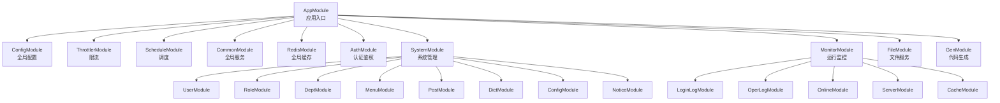
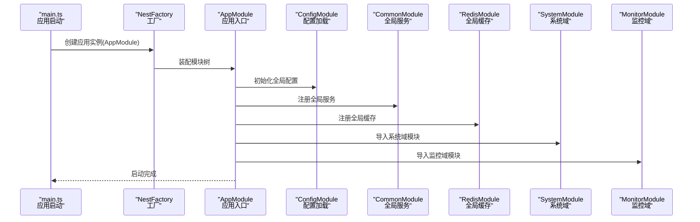
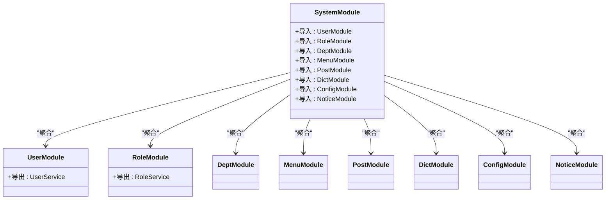
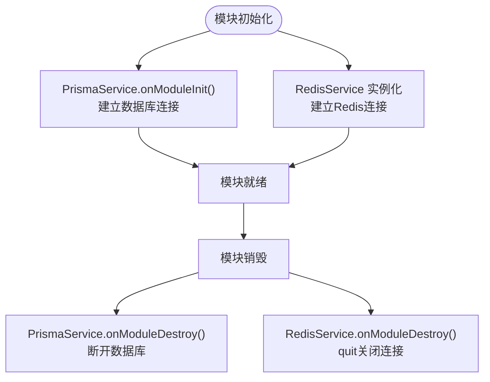
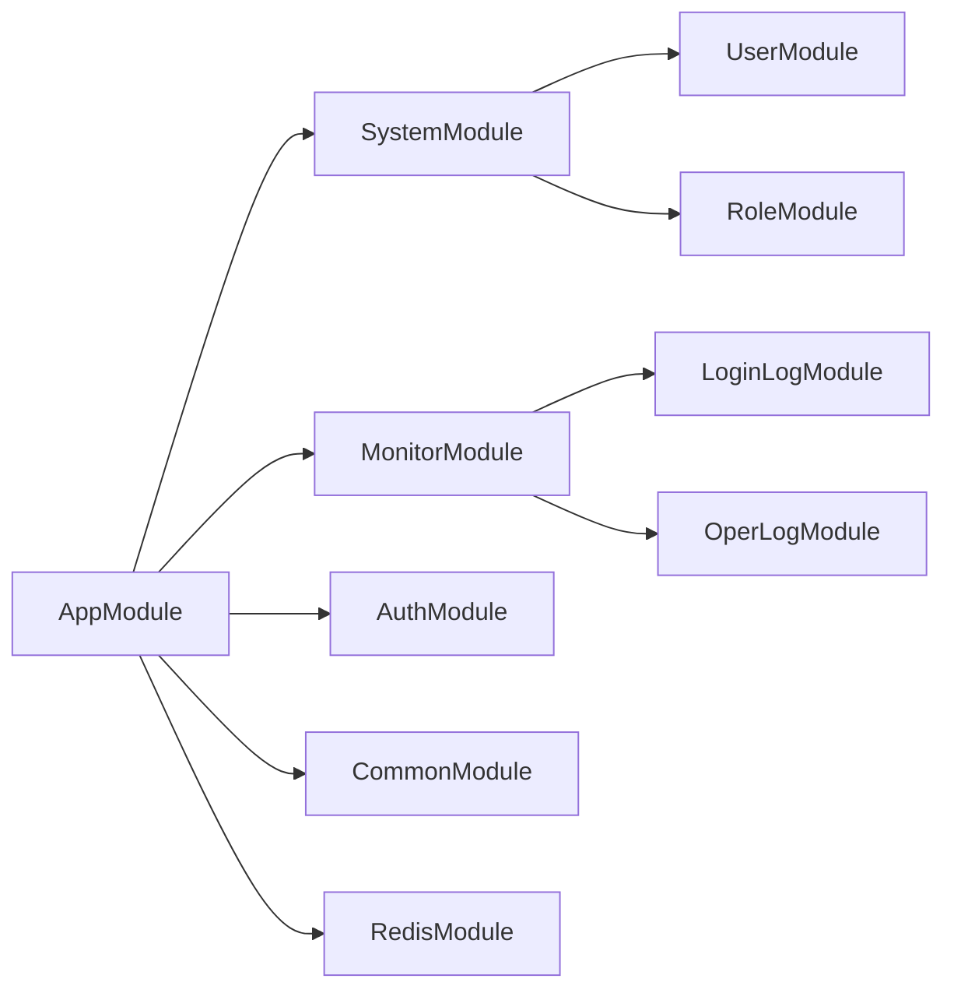

# 模块注册与导入

<cite>
**本文引用的文件**
- [apps/backend/src/app.module.ts](file://apps/backend/src/app.module.ts)
- [apps/backend/src/main.ts](file://apps/backend/src/main.ts)
- [apps/backend/src/common/common.module.ts](file://apps/backend/src/common/common.module.ts)
- [apps/backend/src/cache/redis.module.ts](file://apps/backend/src/cache/redis.module.ts)
- [apps/backend/src/auth/auth.module.ts](file://apps/backend/src/auth/auth.module.ts)
- [apps/backend/src/modules/system/system.module.ts](file://apps/backend/src/modules/system/system.module.ts)
- [apps/backend/src/modules/system/user/user.module.ts](file://apps/backend/src/modules/system/user/user.module.ts)
- [apps/backend/src/modules/system/role/role.module.ts](file://apps/backend/src/modules/system/role/role.module.ts)
- [apps/backend/src/modules/monitor/monitor.module.ts](file://apps/backend/src/modules/monitor/monitor.module.ts)
- [apps/backend/src/modules/file/file.module.ts](file://apps/backend/src/modules/file/file.module.ts)
- [apps/backend/src/modules/gen/gen.module.ts](file://apps/backend/src/modules/gen/gen.module.ts)
- [apps/backend/src/common/prisma.service.ts](file://apps/backend/src/common/prisma.service.ts)
- [apps/backend/src/cache/redis.service.ts](file://apps/backend/src/cache/redis.service.ts)
- [apps/backend/src/config/env.config.ts](file://apps/backend/src/config/env.config.ts)
</cite>

## 目录
1. [引言](#引言)
2. [项目结构](#项目结构)
3. [核心组件](#核心组件)
4. [架构总览](#架构总览)
5. [详细组件分析](#详细组件分析)
6. [依赖分析](#依赖分析)
7. [性能考虑](#性能考虑)
8. [故障排查指南](#故障排查指南)
9. [结论](#结论)
10. [附录](#附录)

## 引言
本指南围绕 NestJS 模块的注册与导入机制展开，结合实际项目中的模块化组织方式，系统讲解模块导入语法、导出配置、依赖解析、生命周期管理、模块间通信、配置管理、测试策略与最佳实践，并以 SystemModule 为典型案例，演示如何在复杂业务场景中组织与管理模块依赖。

## 项目结构
后端采用单体应用结构，入口模块负责聚合各功能域模块；通用能力通过全局模块提供，认证、缓存、系统管理、监控、文件与代码生成等模块按领域拆分，形成清晰的层次化模块树。

图表来源
- [apps/backend/src/app.module.ts:18-38](file://apps/backend/src/app.module.ts#L18-L38)
- [apps/backend/src/modules/system/system.module.ts:11-21](file://apps/backend/src/modules/system/system.module.ts#L11-L21)
- [apps/backend/src/modules/monitor/monitor.module.ts:8-10](file://apps/backend/src/modules/monitor/monitor.module.ts#L8-L10)

章节来源
- [apps/backend/src/app.module.ts:18-38](file://apps/backend/src/app.module.ts#L18-L38)
- [apps/backend/src/main.ts:8-46](file://apps/backend/src/main.ts#L8-L46)

## 核心组件
- 应用入口模块：集中注册全局配置、限流、调度、通用模块、认证模块、系统模块、监控模块、文件模块与代码生成模块，并通过全局提供者注入守卫、过滤器与拦截器。
- 全局模块：CommonModule（数据库连接服务）与 RedisModule（Redis 客户端服务），通过 @Global() 与 exports 导出，使任意模块可直接注入使用。
- 认证模块：基于 JWT 的鉴权体系，通过 ConfigModule 注入配置，动态设置密钥与过期时间。
- 系统模块：聚合用户、角色、部门、菜单、岗位、字典、参数配置、通知公告等子模块，体现“领域内聚”的模块拆分思想。
- 监控模块：聚合登录日志、操作日志、在线用户、服务器信息与缓存监控等子模块，便于统一管理与扩展。

章节来源
- [apps/backend/src/app.module.ts:18-58](file://apps/backend/src/app.module.ts#L18-L58)
- [apps/backend/src/common/common.module.ts:4-8](file://apps/backend/src/common/common.module.ts#L4-L8)
- [apps/backend/src/cache/redis.module.ts:4-8](file://apps/backend/src/cache/redis.module.ts#L4-L8)
- [apps/backend/src/auth/auth.module.ts:11-28](file://apps/backend/src/auth/auth.module.ts#L11-L28)
- [apps/backend/src/modules/system/system.module.ts:11-22](file://apps/backend/src/modules/system/system.module.ts#L11-L22)
- [apps/backend/src/modules/monitor/monitor.module.ts:8-10](file://apps/backend/src/modules/monitor/monitor.module.ts#L8-L10)

## 架构总览
下图展示了从应用启动到模块装配的关键流程，以及模块之间的依赖关系与导出边界。

图表来源
- [apps/backend/src/main.ts:8-46](file://apps/backend/src/main.ts#L8-L46)
- [apps/backend/src/app.module.ts:18-38](file://apps/backend/src/app.module.ts#L18-L38)

## 详细组件分析

### AppModule：应用入口与全局装配
- 导入策略：通过 imports 集中声明所有子模块，确保依赖解析与初始化顺序可控。
- 全局提供者：通过 APP_GUARD、APP_FILTER、APP_INTERCEPTOR 注入限流守卫、全局异常过滤器与数据转换/操作日志拦截器。
- 配置加载：ConfigModule.forRoot 结合 env.config.ts 中的 registerAs，实现多段配置的集中管理与类型安全访问。

章节来源
- [apps/backend/src/app.module.ts:18-58](file://apps/backend/src/app.module.ts#L18-L58)
- [apps/backend/src/config/env.config.ts:1-47](file://apps/backend/src/config/env.config.ts#L1-L47)

### SystemModule：领域模块的聚合与导出
- 聚合模式：将用户、角色、部门、菜单、岗位、字典、参数配置、通知公告等子模块统一由 SystemModule 导入，便于上层模块按需引入。
- 导出边界：子模块通过 exports 将服务暴露给其他模块，SystemModule 作为聚合层，向上提供统一的系统域接口。

图表来源
- [apps/backend/src/modules/system/system.module.ts:11-22](file://apps/backend/src/modules/system/system.module.ts#L11-L22)
- [apps/backend/src/modules/system/user/user.module.ts:5-8](file://apps/backend/src/modules/system/user/user.module.ts#L5-L8)
- [apps/backend/src/modules/system/role/role.module.ts:5-8](file://apps/backend/src/modules/system/role/role.module.ts#L5-L8)

章节来源
- [apps/backend/src/modules/system/system.module.ts:11-22](file://apps/backend/src/modules/system/system.module.ts#L11-L22)

### AuthModule：动态配置与模块导出
- 动态配置：JwtModule 使用 registerAsync，通过 ConfigModule 与 ConfigService 获取 app.jwtSecret 与 app.jwtExpiresIn，实现配置驱动的鉴权参数。
- 导出能力：AuthService、JwtAuthGuard、RolesGuard、PermissionGuard 通过 exports 对外提供，供其他模块复用。

章节来源
- [apps/backend/src/auth/auth.module.ts:11-28](file://apps/backend/src/auth/auth.module.ts#L11-L28)
- [apps/backend/src/config/env.config.ts:3-22](file://apps/backend/src/config/env.config.ts#L3-L22)

### 全局模块：CommonModule 与 RedisModule
- CommonModule：通过 @Global() 与 exports 将 PrismaService 暴露为全局可用，避免重复导入。
- RedisModule：同样通过 @Global() 与 exports 暴露 RedisService，为其他模块提供缓存能力。

章节来源
- [apps/backend/src/common/common.module.ts:4-8](file://apps/backend/src/common/common.module.ts#L4-L8)
- [apps/backend/src/cache/redis.module.ts:4-8](file://apps/backend/src/cache/redis.module.ts#L4-L8)

### 生命周期与内存管理
- 数据库连接：PrismaService 在 onModuleInit 中建立连接，在 onModuleDestroy 中断开，确保模块销毁时资源释放。
- Redis 连接：RedisService 实现 OnModuleDestroy，在模块销毁时调用 quit 优雅关闭连接。
- 全局模块的生命周期：由于 @Global()，这些服务在应用启动时即被实例化并在进程生命周期内存在。

图表来源
- [apps/backend/src/common/prisma.service.ts:14-21](file://apps/backend/src/common/prisma.service.ts#L14-L21)
- [apps/backend/src/cache/redis.service.ts:25-27](file://apps/backend/src/cache/redis.service.ts#L25-L27)

章节来源
- [apps/backend/src/common/prisma.service.ts:14-21](file://apps/backend/src/common/prisma.service.ts#L14-L21)
- [apps/backend/src/cache/redis.service.ts:25-27](file://apps/backend/src/cache/redis.service.ts#L25-L27)

### 模块间通信：服务共享、事件传递与状态同步
- 服务共享：通过模块的 exports 将服务暴露给其他模块；例如 SystemModule 聚合多个子模块，子模块通过 exports 提供服务，上层模块仅需导入 SystemModule 即可使用。
- 事件传递：可通过全局事件总线或自定义事件发布/订阅机制实现跨模块通信（建议在具体模块中实现，此处不展开代码）。
- 状态同步：Redis 作为共享缓存，可用于跨模块的状态同步与会话管理（如在线用户集合）。

章节来源
- [apps/backend/src/modules/system/system.module.ts:11-22](file://apps/backend/src/modules/system/system.module.ts#L11-L22)
- [apps/backend/src/cache/redis.service.ts:83-99](file://apps/backend/src/cache/redis.service.ts#L83-L99)

### 配置管理：环境变量读取、验证与动态更新
- 环境变量读取：env.config.ts 使用 registerAs 将配置分段注册，支持 app、database、redis、mail、wechat 等配置段。
- 动态配置更新：JwtModule 通过 ConfigService 动态读取配置，实现密钥与过期时间的动态变更。
- 建议：对于需要热更新的配置，可在应用层增加配置刷新机制或通过外部配置中心拉取最新值。

章节来源
- [apps/backend/src/config/env.config.ts:1-47](file://apps/backend/src/config/env.config.ts#L1-L47)
- [apps/backend/src/auth/auth.module.ts:14-23](file://apps/backend/src/auth/auth.module.ts#L14-L23)

### 测试策略：隔离测试、集成测试与端到端测试
- 模块隔离测试：针对单一模块（如 UserModule、RoleModule）编写单元测试，模拟依赖并通过 Test.createTestingModule 组装最小测试单元。
- 集成测试：通过 Test.createTestingModule 或使用 @nestjs/testing 的 Test 工具，组合相关模块进行集成验证。
- 端到端测试：启动完整应用（AppModule），使用 supertest 发送 HTTP 请求，验证路由、鉴权与业务流程。

章节来源
- [apps/backend/src/modules/system/user/user.module.ts:5-8](file://apps/backend/src/modules/system/user/user.module.ts#L5-L8)
- [apps/backend/src/modules/system/role/role.module.ts:5-8](file://apps/backend/src/modules/system/role/role.module.ts#L5-L8)

## 依赖分析
- 模块耦合度：AppModule 作为根模块，对各子模块有强依赖；SystemModule 与 MonitorModule 作为功能域聚合模块，降低上层模块的导入复杂度。
- 导入链路：AppModule -> SystemModule/ MonitorModule -> 子模块；认证与缓存通过全局模块向全应用开放。
- 循环依赖：当前结构未见明显循环依赖迹象；若后续扩展，应避免模块间相互导入控制器与服务。

图表来源
- [apps/backend/src/app.module.ts:18-38](file://apps/backend/src/app.module.ts#L18-L38)
- [apps/backend/src/modules/system/system.module.ts:11-22](file://apps/backend/src/modules/system/system.module.ts#L11-L22)
- [apps/backend/src/modules/monitor/monitor.module.ts:8-10](file://apps/backend/src/modules/monitor/monitor.module.ts#L8-L10)

章节来源
- [apps/backend/src/app.module.ts:18-38](file://apps/backend/src/app.module.ts#L18-L38)

## 性能考虑
- 模块懒加载：对于非核心模块，可考虑延迟导入以缩短启动时间。
- 缓存策略：利用 RedisModule 提供的缓存能力，减少重复计算与数据库压力。
- 日志与监控：启用 Prisma 与 Redis 的连接日志，配合 MonitorModule 的指标收集，持续优化性能瓶颈。

## 故障排查指南
- 数据库连接失败：检查 PrismaService 的 onModuleInit 是否抛错，确认 DATABASE_URL 环境变量与网络连通性。
- Redis 连接异常：查看 RedisService 的连接事件回调，确认主机、端口、密码与数据库索引配置。
- 鉴权失败：核对 ConfigService 读取的 jwtSecret 与 jwtExpiresIn，确保与前端一致。
- 模块未生效：确认模块是否正确导出服务，以及上层模块是否导入该模块。

章节来源
- [apps/backend/src/common/prisma.service.ts:14-21](file://apps/backend/src/common/prisma.service.ts#L14-L21)
- [apps/backend/src/cache/redis.service.ts:8-27](file://apps/backend/src/cache/redis.service.ts#L8-L27)
- [apps/backend/src/auth/auth.module.ts:14-23](file://apps/backend/src/auth/auth.module.ts#L14-L23)

## 结论
通过 AppModule 的集中装配、SystemModule 的领域聚合、全局模块的服务共享与严格的生命周期管理，项目实现了高内聚、低耦合的模块化架构。遵循本文的导入策略、导出配置、依赖解析与最佳实践，可在复杂业务场景中稳定地组织与扩展模块依赖。

## 附录
- 启动流程要点：main.ts 中创建 Nest 应用实例，设置全局前缀、校验管道、Swagger 文档与静态资源，随后监听端口。
- 配置段落：app、database、redis、mail、wechat 等配置通过 ConfigModule 加载，供各模块按需读取。

章节来源
- [apps/backend/src/main.ts:8-46](file://apps/backend/src/main.ts#L8-L46)
- [apps/backend/src/config/env.config.ts:3-47](file://apps/backend/src/config/env.config.ts#L3-L47)