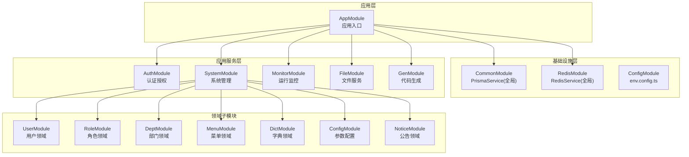
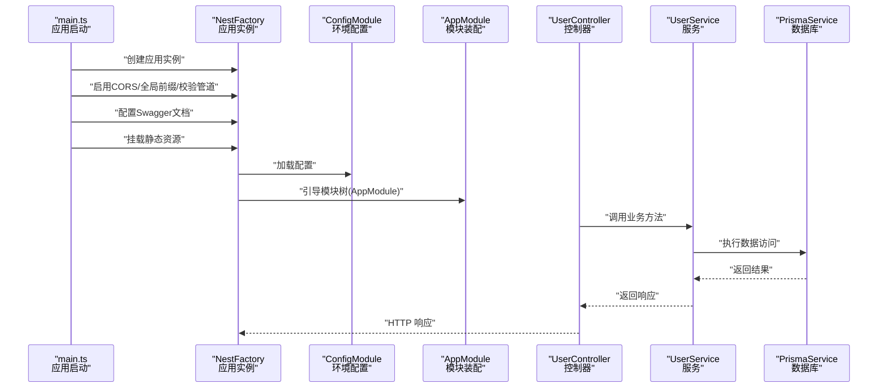
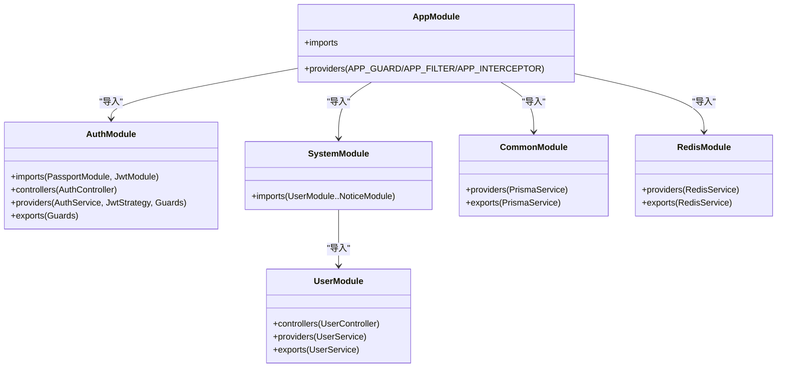
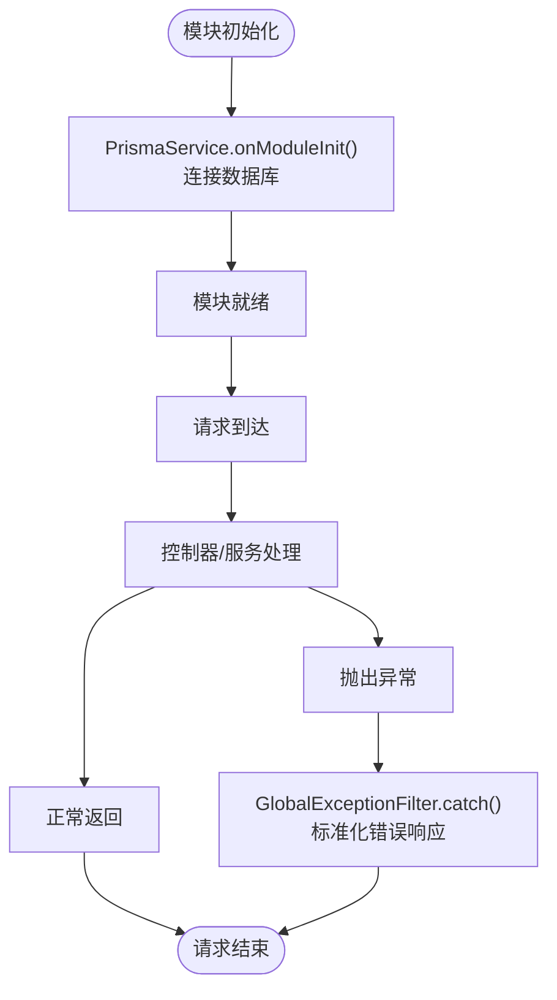
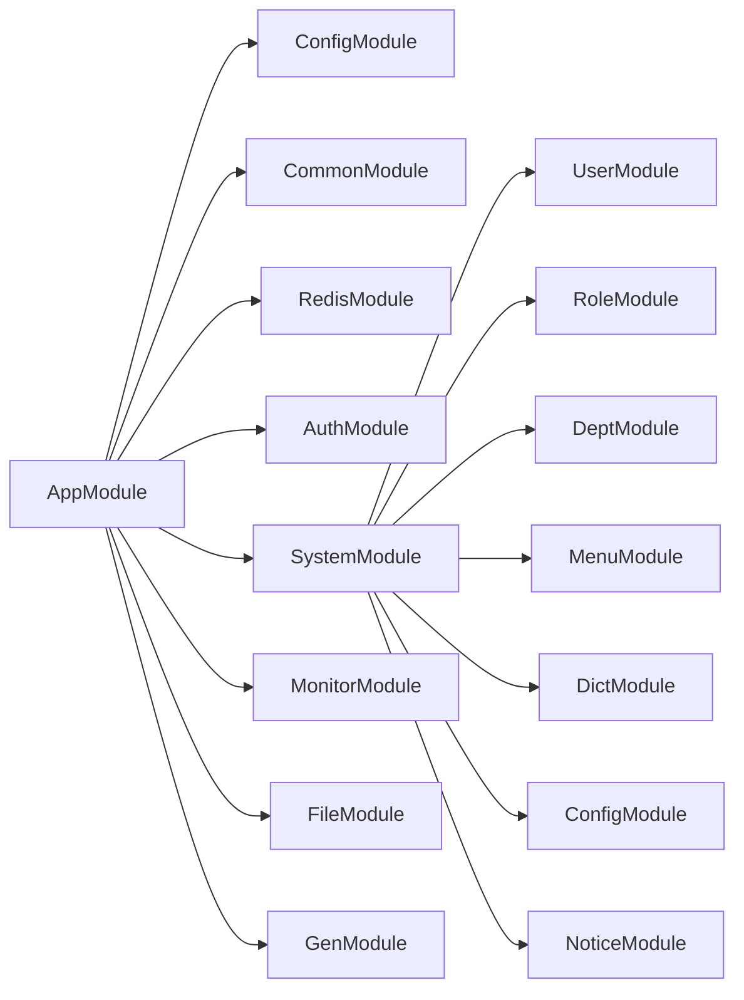
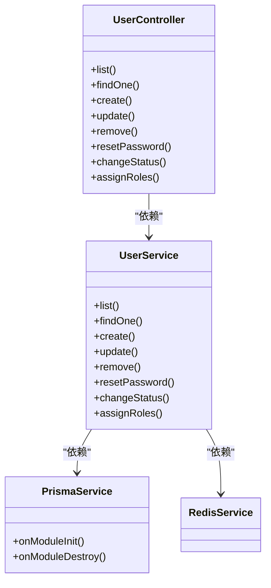
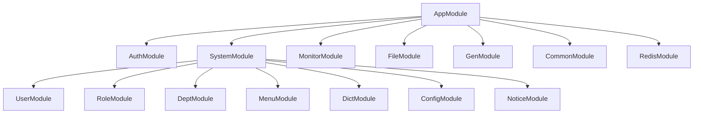

# 模块结构设计

<cite>
**本文引用的文件**
- [apps/backend/src/app.module.ts](file://apps/backend/src/app.module.ts)
- [apps/backend/src/main.ts](file://apps/backend/src/main.ts)
- [apps/backend/src/auth/auth.module.ts](file://apps/backend/src/auth/auth.module.ts)
- [apps/backend/src/common/common.module.ts](file://apps/backend/src/common/common.module.ts)
- [apps/backend/src/cache/redis.module.ts](file://apps/backend/src/cache/redis.module.ts)
- [apps/backend/src/modules/system/system.module.ts](file://apps/backend/src/modules/system/system.module.ts)
- [apps/backend/src/modules/monitor/monitor.module.ts](file://apps/backend/src/modules/monitor/monitor.module.ts)
- [apps/backend/src/modules/file/file.module.ts](file://apps/backend/src/modules/file/file.module.ts)
- [apps/backend/src/modules/gen/gen.module.ts](file://apps/backend/src/modules/gen/gen.module.ts)
- [apps/backend/src/config/env.config.ts](file://apps/backend/src/config/env.config.ts)
- [apps/backend/src/modules/system/user/user.module.ts](file://apps/backend/src/modules/system/user/user.module.ts)
- [apps/backend/src/modules/system/user/user.service.ts](file://apps/backend/src/modules/system/user/user.service.ts)
- [apps/backend/src/modules/system/user/user.controller.ts](file://apps/backend/src/modules/system/user/user.controller.ts)
- [apps/backend/src/common/prisma.service.ts](file://apps/backend/src/common/prisma.service.ts)
- [apps/backend/src/common/exception.filter.ts](file://apps/backend/src/common/exception.filter.ts)
</cite>

## 目录
1. [引言](#引言)
2. [项目结构](#项目结构)
3. [核心组件](#核心组件)
4. [架构总览](#架构总览)
5. [详细组件分析](#详细组件分析)
6. [依赖分析](#依赖分析)
7. [性能考虑](#性能考虑)
8. [故障排查指南](#故障排查指南)
9. [结论](#结论)
10. [附录](#附录)

## 引言
本指南围绕 NestJS 模块化架构，系统讲解模块的基本结构与组织方式、模块装饰器与导入导出机制、依赖注入配置、生命周期管理（初始化/销毁/错误处理）、模块间依赖关系（循环依赖检测与避免、加载顺序与依赖解析）、分层设计原则（领域/基础设施/应用）以及最佳实践（命名约定、文件组织、代码复用）。文档以现有系统模块为实际案例，帮助读者构建可扩展、可维护的模块结构。

## 项目结构
后端采用多模块单体架构，入口在应用模块中集中导入各功能域模块；通过全局模块提供通用服务（如数据库与缓存），并通过全局守卫、过滤器、拦截器统一治理横切关注点。系统按“认证授权、系统管理、监控、文件、代码生成”等维度拆分模块，形成清晰的领域边界与职责划分。

图表来源
- [apps/backend/src/app.module.ts:18-58](file://apps/backend/src/app.module.ts#L18-L58)
- [apps/backend/src/common/common.module.ts:4-9](file://apps/backend/src/common/common.module.ts#L4-L9)
- [apps/backend/src/cache/redis.module.ts:4-9](file://apps/backend/src/cache/redis.module.ts#L4-L9)
- [apps/backend/src/modules/system/system.module.ts:11-23](file://apps/backend/src/modules/system/system.module.ts#L11-L23)

章节来源
- [apps/backend/src/app.module.ts:18-58](file://apps/backend/src/app.module.ts#L18-L58)
- [apps/backend/src/main.ts:8-46](file://apps/backend/src/main.ts#L8-L46)

## 核心组件
- 应用模块（AppModule）
  - 负责全局配置：配置模块、限流模块、调度模块、静态资源等。
  - 注册全局守卫、过滤器、拦截器，统一处理鉴权、异常与响应格式。
  - 导入认证、系统、监控、文件、代码生成等业务模块。
- 全局模块（CommonModule、RedisModule）
  - 将数据库与缓存服务声明为全局，避免重复导入，便于跨模块共享。
- 认证模块（AuthModule）
  - 集成 Passport/JWT，提供策略、守卫与控制器，统一认证授权能力。
- 系统模块（SystemModule）
  - 聚合用户、角色、部门、菜单、字典、参数配置、公告等子模块，形成“系统管理”域。
- 监控模块（MonitorModule）
  - 聚合登录日志、操作日志、在线用户、服务器信息、缓存监控等子模块。
- 文件模块（FileModule）、代码生成模块（GenModule）
  - 提供文件上传与代码生成的控制器与服务，支持导出复用。

章节来源
- [apps/backend/src/app.module.ts:18-58](file://apps/backend/src/app.module.ts#L18-L58)
- [apps/backend/src/common/common.module.ts:4-9](file://apps/backend/src/common/common.module.ts#L4-L9)
- [apps/backend/src/cache/redis.module.ts:4-9](file://apps/backend/src/cache/redis.module.ts#L4-L9)
- [apps/backend/src/auth/auth.module.ts:11-29](file://apps/backend/src/auth/auth.module.ts#L11-L29)
- [apps/backend/src/modules/system/system.module.ts:11-23](file://apps/backend/src/modules/system/system.module.ts#L11-L23)
- [apps/backend/src/modules/monitor/monitor.module.ts:8-11](file://apps/backend/src/modules/monitor/monitor.module.ts#L8-L11)
- [apps/backend/src/modules/file/file.module.ts:5-10](file://apps/backend/src/modules/file/file.module.ts#L5-L10)
- [apps/backend/src/modules/gen/gen.module.ts:5-10](file://apps/backend/src/modules/gen/gen.module.ts#L5-L10)

## 架构总览
下图展示了从应用启动到请求处理的关键流程：主程序创建 Nest 应用工厂，注册全局中间件与文档，随后由 AppModule 组织各模块，最终由控制器与服务处理业务逻辑。

图表来源
- [apps/backend/src/main.ts:8-46](file://apps/backend/src/main.ts#L8-L46)
- [apps/backend/src/app.module.ts:18-58](file://apps/backend/src/app.module.ts#L18-L58)
- [apps/backend/src/modules/system/user/user.controller.ts:20-89](file://apps/backend/src/modules/system/user/user.controller.ts#L20-L89)
- [apps/backend/src/modules/system/user/user.service.ts:11-144](file://apps/backend/src/modules/system/user/user.service.ts#L11-L144)
- [apps/backend/src/common/prisma.service.ts:14-22](file://apps/backend/src/common/prisma.service.ts#L14-L22)

## 详细组件分析

### 模块装饰器与导入导出机制
- 模块装饰器用于声明模块的元数据，包括导入（imports）其他模块、声明（controllers/providers）控制器与服务、导出（exports）供其他模块使用的提供者。
- 导入导出遵循“显式依赖”原则：被导出的服务可在其他模块中直接注入，无需重复导入原模块。
- 全局模块（@Global）可将服务提升为全局可用，减少跨模块重复导入。

图表来源
- [apps/backend/src/app.module.ts:18-58](file://apps/backend/src/app.module.ts#L18-L58)
- [apps/backend/src/auth/auth.module.ts:11-29](file://apps/backend/src/auth/auth.module.ts#L11-L29)
- [apps/backend/src/modules/system/system.module.ts:11-23](file://apps/backend/src/modules/system/system.module.ts#L11-L23)
- [apps/backend/src/modules/system/user/user.module.ts:5-10](file://apps/backend/src/modules/system/user/user.module.ts#L5-L10)
- [apps/backend/src/common/common.module.ts:4-9](file://apps/backend/src/common/common.module.ts#L4-L9)
- [apps/backend/src/cache/redis.module.ts:4-9](file://apps/backend/src/cache/redis.module.ts#L4-L9)

章节来源
- [apps/backend/src/app.module.ts:18-58](file://apps/backend/src/app.module.ts#L18-L58)
- [apps/backend/src/auth/auth.module.ts:11-29](file://apps/backend/src/auth/auth.module.ts#L11-L29)
- [apps/backend/src/modules/system/system.module.ts:11-23](file://apps/backend/src/modules/system/system.module.ts#L11-L23)
- [apps/backend/src/modules/system/user/user.module.ts:5-10](file://apps/backend/src/modules/system/user/user.module.ts#L5-L10)
- [apps/backend/src/common/common.module.ts:4-9](file://apps/backend/src/common/common.module.ts#L4-L9)
- [apps/backend/src/cache/redis.module.ts:4-9](file://apps/backend/src/cache/redis.module.ts#L4-L9)

### 依赖注入与生命周期管理
- 生命周期钩子
  - onModuleInit：模块初始化时连接数据库，确保服务可用。
  - onModuleDestroy：模块销毁时断开数据库连接，释放资源。
- 全局异常过滤器
  - 统一捕获未处理异常，输出标准化响应，记录错误日志。
- 全局守卫/拦截器
  - 在 AppModule 中注册全局守卫（限流）、全局过滤器（异常）、全局拦截器（响应转换/操作日志），保证横切一致性。

图表来源
- [apps/backend/src/common/prisma.service.ts:14-22](file://apps/backend/src/common/prisma.service.ts#L14-L22)
- [apps/backend/src/common/exception.filter.ts:12-37](file://apps/backend/src/common/exception.filter.ts#L12-L37)
- [apps/backend/src/app.module.ts:39-56](file://apps/backend/src/app.module.ts#L39-L56)

章节来源
- [apps/backend/src/common/prisma.service.ts:14-22](file://apps/backend/src/common/prisma.service.ts#L14-L22)
- [apps/backend/src/common/exception.filter.ts:12-37](file://apps/backend/src/common/exception.filter.ts#L12-L37)
- [apps/backend/src/app.module.ts:39-56](file://apps/backend/src/app.module.ts#L39-L56)

### 模块间依赖关系与加载顺序
- 加载顺序
  - AppModule 作为根模块，先加载基础模块（ConfigModule、CommonModule、RedisModule），再加载业务模块（Auth、System、Monitor、File、Gen）。
  - 子模块内部按聚合关系导入：SystemModule 聚合用户/角色/部门/菜单/字典/参数/公告等子模块。
- 循环依赖检测与避免
  - 通过明确的导入导出边界避免双向依赖；若出现循环，优先拆分公共模块或引入 DTO/接口抽象，降低耦合。
  - 使用 exports 显式暴露所需提供者，避免在多个模块中重复定义。

图表来源
- [apps/backend/src/app.module.ts:18-58](file://apps/backend/src/app.module.ts#L18-L58)
- [apps/backend/src/modules/system/system.module.ts:11-23](file://apps/backend/src/modules/system/system.module.ts#L11-L23)

章节来源
- [apps/backend/src/app.module.ts:18-58](file://apps/backend/src/app.module.ts#L18-L58)
- [apps/backend/src/modules/system/system.module.ts:11-23](file://apps/backend/src/modules/system/system.module.ts#L11-L23)

### 分层设计原则
- 领域模块（Domain）
  - 以业务实体为中心，如用户、角色、部门、菜单、字典、参数、公告等，封装业务规则与数据访问。
- 基础设施模块（Infrastructure）
  - 数据库（PrismaService）、缓存（RedisService）、配置（ConfigModule）等，提供通用能力。
- 应用模块（Application）
  - 认证授权（AuthModule）、文件（FileModule）、代码生成（GenModule）、监控（MonitorModule）等，面向用例编排与横切关注点。

章节来源
- [apps/backend/src/modules/system/user/user.module.ts:5-10](file://apps/backend/src/modules/system/user/user.module.ts#L5-L10)
- [apps/backend/src/common/common.module.ts:4-9](file://apps/backend/src/common/common.module.ts#L4-L9)
- [apps/backend/src/cache/redis.module.ts:4-9](file://apps/backend/src/cache/redis.module.ts#L4-L9)
- [apps/backend/src/auth/auth.module.ts:11-29](file://apps/backend/src/auth/auth.module.ts#L11-L29)
- [apps/backend/src/modules/file/file.module.ts:5-10](file://apps/backend/src/modules/file/file.module.ts#L5-L10)
- [apps/backend/src/modules/gen/gen.module.ts:5-10](file://apps/backend/src/modules/gen/gen.module.ts#L5-L10)
- [apps/backend/src/modules/monitor/monitor.module.ts:8-11](file://apps/backend/src/modules/monitor/monitor.module.ts#L8-L11)

### 最佳实践
- 命名约定
  - 模块文件：xxx.module.ts；控制器：xxx.controller.ts；服务：xxx.service.ts；DTO：xxx.dto.ts。
  - 包装模块导出：仅导出必要的提供者，避免泄露内部实现。
- 文件组织
  - 按功能域划分目录，每个域包含 controller/service/dto/module；公共能力放入 common 或 infrastructure。
- 代码复用
  - 将通用服务（如 PrismaService、RedisService）声明为全局模块，跨模块共享。
  - 使用全局守卫/过滤器/拦截器统一治理横切关注点。
- 配置管理
  - 使用 ConfigModule 与 registerAs 组织环境变量，集中管理数据库、Redis、邮件、微信等配置。

章节来源
- [apps/backend/src/config/env.config.ts:3-47](file://apps/backend/src/config/env.config.ts#L3-L47)
- [apps/backend/src/common/common.module.ts:4-9](file://apps/backend/src/common/common.module.ts#L4-L9)
- [apps/backend/src/cache/redis.module.ts:4-9](file://apps/backend/src/cache/redis.module.ts#L4-L9)
- [apps/backend/src/app.module.ts:18-58](file://apps/backend/src/app.module.ts#L18-L58)

### 实际案例：用户模块（领域模块）
- 结构
  - 控制器负责路由与权限控制，服务封装业务逻辑与数据访问，DTO 定义输入输出模型。
- 关键点
  - 服务同时依赖 PrismaService 与 RedisService，体现基础设施模块的复用。
  - 控制器使用 JWT 与权限守卫，体现应用层对领域模块的编排。
- 可扩展性
  - 新增用户相关功能（如头像、角色分配）可直接在服务中扩展，保持控制器简洁。

图表来源
- [apps/backend/src/modules/system/user/user.controller.ts:20-89](file://apps/backend/src/modules/system/user/user.controller.ts#L20-L89)
- [apps/backend/src/modules/system/user/user.service.ts:11-144](file://apps/backend/src/modules/system/user/user.service.ts#L11-L144)
- [apps/backend/src/common/prisma.service.ts:14-22](file://apps/backend/src/common/prisma.service.ts#L14-L22)
- [apps/backend/src/cache/redis.module.ts:4-9](file://apps/backend/src/cache/redis.module.ts#L4-L9)

章节来源
- [apps/backend/src/modules/system/user/user.controller.ts:20-89](file://apps/backend/src/modules/system/user/user.controller.ts#L20-L89)
- [apps/backend/src/modules/system/user/user.service.ts:11-144](file://apps/backend/src/modules/system/user/user.service.ts#L11-L144)
- [apps/backend/src/common/prisma.service.ts:14-22](file://apps/backend/src/common/prisma.service.ts#L14-L22)
- [apps/backend/src/cache/redis.module.ts:4-9](file://apps/backend/src/cache/redis.module.ts#L4-L9)

## 依赖分析
- 模块内聚与耦合
  - SystemModule 内聚度高，将用户、角色、部门等子模块聚合，便于统一管理。
  - AppModule 作为高扇入模块，承担全局配置与横切关注点，需谨慎变更。
- 外部依赖
  - Prisma 用于 ORM，Redis 用于缓存，Passport/JWT 用于认证，Swagger 用于文档。
- 潜在风险
  - 若在 AppModule 过度集中全局配置，可能影响模块解耦；建议将特定配置下沉至对应模块。

图表来源
- [apps/backend/src/app.module.ts:18-58](file://apps/backend/src/app.module.ts#L18-L58)
- [apps/backend/src/modules/system/system.module.ts:11-23](file://apps/backend/src/modules/system/system.module.ts#L11-L23)

章节来源
- [apps/backend/src/app.module.ts:18-58](file://apps/backend/src/app.module.ts#L18-L58)
- [apps/backend/src/modules/system/system.module.ts:11-23](file://apps/backend/src/modules/system/system.module.ts#L11-L23)

## 性能考虑
- 数据库连接
  - 使用 PrismaService 的生命周期钩子确保连接与断开时机可控，避免连接泄漏。
- 缓存利用
  - 在服务层结合 RedisService 缓存热点数据，降低数据库压力。
- 全局管道与守卫
  - ValidationPipe 与 ThrottlerGuard 在请求早期进行校验与限流，减少无效请求进入业务层。
- 文档与静态资源
  - Swagger 文档与静态资源挂载在启动阶段完成，避免运行期额外开销。

章节来源
- [apps/backend/src/common/prisma.service.ts:14-22](file://apps/backend/src/common/prisma.service.ts#L14-L22)
- [apps/backend/src/app.module.ts:39-56](file://apps/backend/src/app.module.ts#L39-L56)
- [apps/backend/src/main.ts:8-46](file://apps/backend/src/main.ts#L8-L46)

## 故障排查指南
- 启动失败
  - 检查数据库连接是否成功（PrismaService.onModuleInit 日志）。
  - 确认环境变量配置正确（ConfigModule 加载）。
- 请求异常
  - 查看全局异常过滤器输出的标准化错误响应，定位具体异常类型与堆栈。
- 权限问题
  - 确认控制器已应用 JwtAuthGuard 与 PermissionGuard，检查权限标识是否正确。
- 模块导入问题
  - 若出现“无法解析提供者”，检查对应模块是否导出该提供者，或是否遗漏导入。

章节来源
- [apps/backend/src/common/prisma.service.ts:14-22](file://apps/backend/src/common/prisma.service.ts#L14-L22)
- [apps/backend/src/common/exception.filter.ts:12-37](file://apps/backend/src/common/exception.filter.ts#L12-L37)
- [apps/backend/src/modules/system/user/user.controller.ts:20-89](file://apps/backend/src/modules/system/user/user.controller.ts#L20-L89)
- [apps/backend/src/app.module.ts:18-58](file://apps/backend/src/app.module.ts#L18-L58)

## 结论
通过模块化设计，系统实现了清晰的分层与职责划分：领域模块聚焦业务、基础设施模块提供通用能力、应用模块编排横切关注点。配合全局模块、全局守卫/过滤器/拦截器与严格的导入导出机制，系统具备良好的可扩展性与可维护性。建议在后续演进中持续优化模块边界、减少循环依赖、沉淀通用能力，以支撑更大规模的业务发展。

## 附录
- 命名与文件组织建议
  - 模块：xxx.module.ts
  - 控制器：xxx.controller.ts
  - 服务：xxx.service.ts
  - DTO：xxx.dto.ts
  - 配置：env.config.ts
- 配置项参考
  - 应用：端口、环境、JWT 秘钥与过期时间、上传目录与大小限制、文件存储类型与云存储参数等。
- 守护与过滤器
  - 全局守卫：ThrottlerGuard（限流）
  - 全局过滤器：GlobalExceptionFilter（异常）
  - 全局拦截器：TransformInterceptor、OperLogInterceptor（响应转换与操作日志）

章节来源
- [apps/backend/src/config/env.config.ts:3-47](file://apps/backend/src/config/env.config.ts#L3-L47)
- [apps/backend/src/app.module.ts:39-56](file://apps/backend/src/app.module.ts#L39-L56)