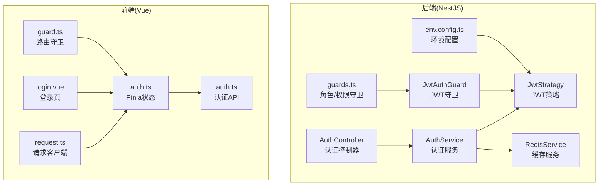
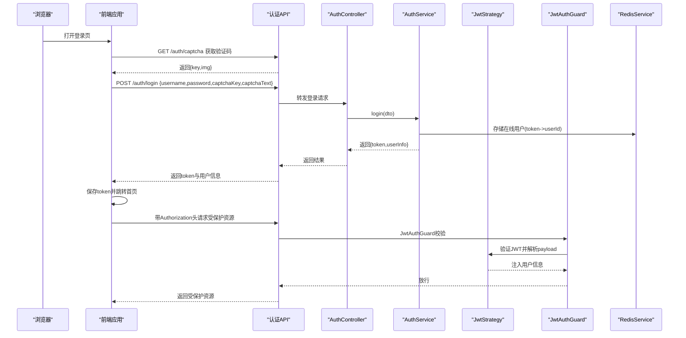
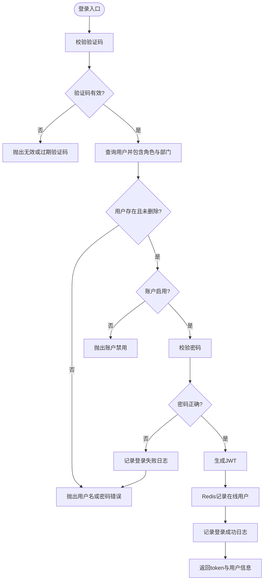
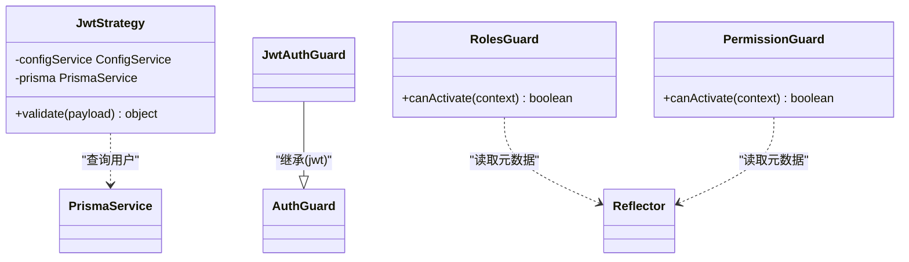
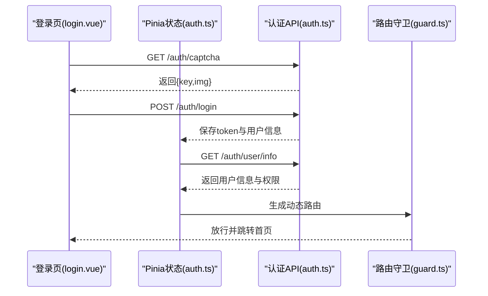
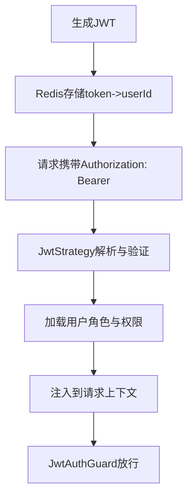
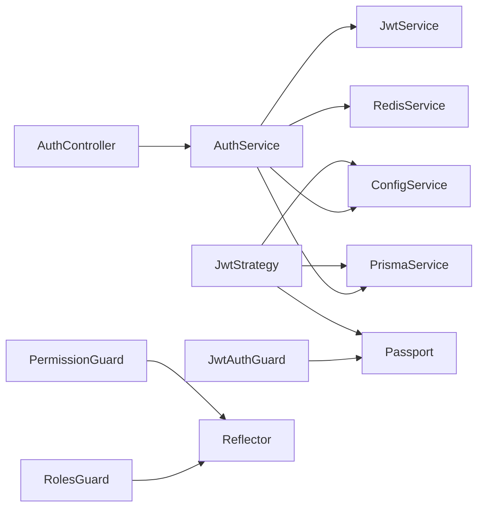

# OAuth认证集成

<cite>
**本文档引用的文件**
- [apps/backend/src/auth/auth.controller.ts](file://apps/backend/src/auth/auth.controller.ts)
- [apps/backend/src/auth/auth.service.ts](file://apps/backend/src/auth/auth.service.ts)
- [apps/backend/src/auth/guards.ts](file://apps/backend/src/auth/guards.ts)
- [apps/backend/src/auth/jwt.guard.ts](file://apps/backend/src/auth/jwt.guard.ts)
- [apps/backend/src/auth/jwt.strategy.ts](file://apps/backend/src/auth/jwt.strategy.ts)
- [apps/backend/src/auth/dto/auth.dto.ts](file://apps/backend/src/auth/dto/auth.dto.ts)
- [apps/backend/src/config/env.config.ts](file://apps/backend/src/config/env.config.ts)
- [apps/backend/src/cache/redis.service.ts](file://apps/backend/src/cache/redis.service.ts)
- [apps/vben-admin/apps/web-antd/src/api/core/auth.ts](file://apps/vben-admin/apps/web-antd/src/api/core/auth.ts)
- [apps/vben-admin/apps/web-antd/src/store/auth.ts](file://apps/vben-admin/apps/web-antd/src/store/auth.ts)
- [apps/vben-admin/apps/web-antd/src/router/guard.ts](file://apps/vben-admin/apps/web-antd/src/router/guard.ts)
- [apps/vben-admin/apps/web-antd/src/views/_core/authentication/login.vue](file://apps/vben-admin/apps/web-antd/src/views/_core/authentication/login.vue)
- [apps/vben-admin/apps/web-antd/src/router/routes/core.ts](file://apps/vben-admin/apps/web-antd/src/router/routes/core.ts)
- [apps/vben-admin/apps/web-antd/src/api/request.ts](file://apps/vben-admin/apps/web-antd/src/api/request.ts)
</cite>

## 目录
1. [简介](#简介)
2. [项目结构](#项目结构)
3. [核心组件](#核心组件)
4. [架构总览](#架构总览)
5. [详细组件分析](#详细组件分析)
6. [依赖关系分析](#依赖关系分析)
7. [性能考虑](#性能考虑)
8. [故障排除指南](#故障排除指南)
9. [结论](#结论)
10. [附录](#附录)

## 简介
本文件面向需要在NestJS + Vue前端体系中实现OAuth认证集成的开发者，系统性梳理项目现有的JWT认证能力与可扩展的OAuth集成路径。当前仓库实现了基于JWT的登录、登出、用户信息获取与权限校验，并通过前端路由守卫完成访问控制。文档将从协议原理、实现机制、JWT令牌管理、第三方OAuth接入建议、完整流程示例以及中间件使用等方面进行全面说明。

## 项目结构
后端采用NestJS模块化架构，认证相关的核心模块位于apps/backend/src/auth；前端认证逻辑位于apps/vben-admin/apps/web-antd/src，包含API封装、状态管理、路由守卫与登录页面。

**图表来源**
- [apps/backend/src/auth/auth.controller.ts:1-87](file://apps/backend/src/auth/auth.controller.ts#L1-L87)
- [apps/backend/src/auth/auth.service.ts:1-294](file://apps/backend/src/auth/auth.service.ts#L1-L294)
- [apps/backend/src/auth/jwt.strategy.ts:1-78](file://apps/backend/src/auth/jwt.strategy.ts#L1-L78)
- [apps/backend/src/auth/jwt.guard.ts:1-5](file://apps/backend/src/auth/jwt.guard.ts#L1-L5)
- [apps/backend/src/auth/guards.ts:1-51](file://apps/backend/src/auth/guards.ts#L1-L51)
- [apps/backend/src/config/env.config.ts:1-47](file://apps/backend/src/config/env.config.ts#L1-L47)
- [apps/backend/src/cache/redis.service.ts:1-128](file://apps/backend/src/cache/redis.service.ts#L1-L128)
- [apps/vben-admin/apps/web-antd/src/api/core/auth.ts:1-122](file://apps/vben-admin/apps/web-antd/src/api/core/auth.ts#L1-L122)
- [apps/vben-admin/apps/web-antd/src/store/auth.ts:1-137](file://apps/vben-admin/apps/web-antd/src/store/auth.ts#L1-L137)
- [apps/vben-admin/apps/web-antd/src/router/guard.ts:1-134](file://apps/vben-admin/apps/web-antd/src/router/guard.ts#L1-L134)
- [apps/vben-admin/apps/web-antd/src/views/_core/authentication/login.vue:1-131](file://apps/vben-admin/apps/web-antd/src/views/_core/authentication/login.vue#L1-L131)
- [apps/vben-admin/apps/web-antd/src/api/request.ts:1-139](file://apps/vben-admin/apps/web-antd/src/api/request.ts#L1-L139)

**章节来源**
- [apps/backend/src/auth/auth.controller.ts:1-87](file://apps/backend/src/auth/auth.controller.ts#L1-L87)
- [apps/backend/src/auth/auth.service.ts:1-294](file://apps/backend/src/auth/auth.service.ts#L1-L294)
- [apps/backend/src/auth/jwt.strategy.ts:1-78](file://apps/backend/src/auth/jwt.strategy.ts#L1-L78)
- [apps/backend/src/auth/guards.ts:1-51](file://apps/backend/src/auth/guards.ts#L1-L51)
- [apps/backend/src/config/env.config.ts:1-47](file://apps/backend/src/config/env.config.ts#L1-L47)
- [apps/backend/src/cache/redis.service.ts:1-128](file://apps/backend/src/cache/redis.service.ts#L1-L128)
- [apps/vben-admin/apps/web-antd/src/api/core/auth.ts:1-122](file://apps/vben-admin/apps/web-antd/src/api/core/auth.ts#L1-L122)
- [apps/vben-admin/apps/web-antd/src/store/auth.ts:1-137](file://apps/vben-admin/apps/web-antd/src/store/auth.ts#L1-L137)
- [apps/vben-admin/apps/web-antd/src/router/guard.ts:1-134](file://apps/vben-admin/apps/web-antd/src/router/guard.ts#L1-L134)
- [apps/vben-admin/apps/web-antd/src/views/_core/authentication/login.vue:1-131](file://apps/vben-admin/apps/web-antd/src/views/_core/authentication/login.vue#L1-L131)
- [apps/vben-admin/apps/web-antd/src/api/request.ts:1-139](file://apps/vben-admin/apps/web-antd/src/api/request.ts#L1-L139)

## 核心组件
- 后端认证控制器：提供登录、注册、验证码、登出、用户信息查询等接口。
- 认证服务：负责用户校验、JWT签发、验证码校验、在线用户管理、密码更新等。
- JWT策略与守卫：解析Authorization头中的Bearer Token，校验过期与有效性，并注入用户信息到请求上下文。
- 角色/权限守卫：基于元数据的角色与权限校验。
- 前端认证API与状态：封装后端接口、维护token与用户信息、路由守卫控制访问。
- Redis服务：提供在线用户集合、键值缓存与TTL管理。

**章节来源**
- [apps/backend/src/auth/auth.controller.ts:13-87](file://apps/backend/src/auth/auth.controller.ts#L13-L87)
- [apps/backend/src/auth/auth.service.ts:29-133](file://apps/backend/src/auth/auth.service.ts#L29-L133)
- [apps/backend/src/auth/jwt.strategy.ts:20-43](file://apps/backend/src/auth/jwt.strategy.ts#L20-L43)
- [apps/backend/src/auth/jwt.guard.ts:1-5](file://apps/backend/src/auth/jwt.guard.ts#L1-L5)
- [apps/backend/src/auth/guards.ts:19-51](file://apps/backend/src/auth/guards.ts#L19-L51)
- [apps/backend/src/cache/redis.service.ts:82-99](file://apps/backend/src/cache/redis.service.ts#L82-L99)
- [apps/vben-admin/apps/web-antd/src/api/core/auth.ts:68-121](file://apps/vben-admin/apps/web-antd/src/api/core/auth.ts#L68-L121)
- [apps/vben-admin/apps/web-antd/src/store/auth.ts:27-135](file://apps/vben-admin/apps/web-antd/src/store/auth.ts#L27-L135)

## 架构总览
下图展示从浏览器到后端的认证流程，包括登录、JWT签发、路由守卫与权限校验：

**图表来源**
- [apps/backend/src/auth/auth.controller.ts:13-51](file://apps/backend/src/auth/auth.controller.ts#L13-L51)
- [apps/backend/src/auth/auth.service.ts:29-89](file://apps/backend/src/auth/auth.service.ts#L29-L89)
- [apps/backend/src/auth/jwt.strategy.ts:20-43](file://apps/backend/src/auth/jwt.strategy.ts#L20-L43)
- [apps/backend/src/auth/jwt.guard.ts:1-5](file://apps/backend/src/auth/jwt.guard.ts#L1-L5)
- [apps/backend/src/cache/redis.service.ts:82-99](file://apps/backend/src/cache/redis.service.ts#L82-L99)
- [apps/vben-admin/apps/web-antd/src/api/core/auth.ts:68-91](file://apps/vben-admin/apps/web-antd/src/api/core/auth.ts#L68-L91)
- [apps/vben-admin/apps/web-antd/src/store/auth.ts:41-80](file://apps/vben-admin/apps/web-antd/src/store/auth.ts#L41-L80)

## 详细组件分析

### 后端认证控制器与服务
- 控制器提供登录、注册、验证码、登出、用户信息与个人资料等接口，均通过装饰器标注HTTP方法与Swagger注解。
- 认证服务实现登录校验（用户名、状态、密码）、验证码校验（Redis存储与TTL）、JWT签发、在线用户记录、用户信息聚合与权限树构建、密码更新等。
- 登录成功后，服务会将token与用户ID映射存入Redis，并记录登录日志；登出时移除在线用户映射。

**图表来源**
- [apps/backend/src/auth/auth.service.ts:29-89](file://apps/backend/src/auth/auth.service.ts#L29-L89)

**章节来源**
- [apps/backend/src/auth/auth.controller.ts:13-87](file://apps/backend/src/auth/auth.controller.ts#L13-L87)
- [apps/backend/src/auth/auth.service.ts:29-133](file://apps/backend/src/auth/auth.service.ts#L29-L133)

### JWT策略与守卫
- JwtStrategy从Authorization头解析Bearer Token，使用配置的密钥验证签名与过期时间，并从数据库加载用户角色与部门信息，最终将用户信息与权限注入到请求上下文。
- JwtAuthGuard继承自AuthGuard('jwt')，用于在路由上启用JWT认证。
- Guards模块提供角色守卫与权限守卫，支持通过元数据声明所需角色或权限。

**图表来源**
- [apps/backend/src/auth/jwt.strategy.ts:1-78](file://apps/backend/src/auth/jwt.strategy.ts#L1-L78)
- [apps/backend/src/auth/jwt.guard.ts:1-5](file://apps/backend/src/auth/jwt.guard.ts#L1-L5)
- [apps/backend/src/auth/guards.ts:19-51](file://apps/backend/src/auth/guards.ts#L19-L51)

**章节来源**
- [apps/backend/src/auth/jwt.strategy.ts:20-43](file://apps/backend/src/auth/jwt.strategy.ts#L20-L43)
- [apps/backend/src/auth/jwt.guard.ts:1-5](file://apps/backend/src/auth/jwt.guard.ts#L1-L5)
- [apps/backend/src/auth/guards.ts:19-51](file://apps/backend/src/auth/guards.ts#L19-L51)

### 前端认证API、状态与路由守卫
- 前端认证API封装了登录、验证码、登出、用户信息、个人资料等接口，统一返回类型定义。
- Pinia状态管理负责保存token、用户信息、权限码，登录成功后拉取用户信息并生成动态路由。
- 路由守卫在进入受保护路由前检查token与角色/权限，若未登录则跳转登录页并携带重定向地址。
- 登录页通过调用验证码接口渲染图形验证码，提交登录表单后触发认证流程。

**图表来源**
- [apps/vben-admin/apps/web-antd/src/views/_core/authentication/login.vue:33-59](file://apps/vben-admin/apps/web-antd/src/views/_core/authentication/login.vue#L33-L59)
- [apps/vben-admin/apps/web-antd/src/store/auth.ts:27-88](file://apps/vben-admin/apps/web-antd/src/store/auth.ts#L27-L88)
- [apps/vben-admin/apps/web-antd/src/api/core/auth.ts:68-91](file://apps/vben-admin/apps/web-antd/src/api/core/auth.ts#L68-L91)
- [apps/vben-admin/apps/web-antd/src/router/guard.ts:47-119](file://apps/vben-admin/apps/web-antd/src/router/guard.ts#L47-L119)

**章节来源**
- [apps/vben-admin/apps/web-antd/src/api/core/auth.ts:68-121](file://apps/vben-admin/apps/web-antd/src/api/core/auth.ts#L68-L121)
- [apps/vben-admin/apps/web-antd/src/store/auth.ts:27-135](file://apps/vben-admin/apps/web-antd/src/store/auth.ts#L27-L135)
- [apps/vben-admin/apps/web-antd/src/router/guard.ts:47-119](file://apps/vben-admin/apps/web-antd/src/router/guard.ts#L47-L119)
- [apps/vben-admin/apps/web-antd/src/views/_core/authentication/login.vue:33-59](file://apps/vben-admin/apps/web-antd/src/views/_core/authentication/login.vue#L33-L59)

### JWT令牌生成、验证与过期管理
- 令牌生成：登录成功后，服务使用JwtService对{sub: userId, username}载荷进行签名，得到JWT。
- 令牌验证：JwtStrategy从请求头解析Bearer Token，使用配置的secretOrKey与过期时间策略进行验证，并从数据库加载用户角色与权限。
- 过期时间：JWT过期时间由配置项控制，默认值来自环境变量。
- 在线用户：Redis以token为键，用户ID为值，配合集合记录在线用户，登出时移除映射。

**图表来源**
- [apps/backend/src/auth/auth.service.ts:62-64](file://apps/backend/src/auth/auth.service.ts#L62-L64)
- [apps/backend/src/auth/jwt.strategy.ts:13-17](file://apps/backend/src/auth/jwt.strategy.ts#L13-L17)
- [apps/backend/src/cache/redis.service.ts:82-99](file://apps/backend/src/cache/redis.service.ts#L82-L99)
- [apps/backend/src/config/env.config.ts:6-7](file://apps/backend/src/config/env.config.ts#L6-L7)

**章节来源**
- [apps/backend/src/auth/auth.service.ts:62-64](file://apps/backend/src/auth/auth.service.ts#L62-L64)
- [apps/backend/src/auth/jwt.strategy.ts:13-17](file://apps/backend/src/auth/jwt.strategy.ts#L13-L17)
- [apps/backend/src/cache/redis.service.ts:82-99](file://apps/backend/src/cache/redis.service.ts#L82-L99)
- [apps/backend/src/config/env.config.ts:6-7](file://apps/backend/src/config/env.config.ts#L6-L7)

### 第三方OAuth提供商集成指南
当前仓库未内置第三方OAuth（如Google、GitHub、微信）的现成实现。以下为可扩展的集成思路与步骤：
- Google/GitHub
  - 在各自平台申请OAuth应用，配置回调地址为后端的/oauth/callback。
  - 后端新增OAuth模块，包含授权码交换、用户信息获取、本地用户映射与JWT签发。
  - 前端提供“使用Google/GitHub登录”按钮，跳转至后端授权URL。
- 微信
  - 微信公众号/移动应用需分别配置授权回调域名。
  - 实现微信授权码交换与用户信息获取，注意微信的UnionID机制与多平台关联。
- 通用流程
  - 前端发起授权请求，后端重定向至第三方平台。
  - 用户授权后，第三方回调至后端，交换access_token并获取用户信息。
  - 将第三方用户信息与本地用户模型关联，签发JWT并返回给前端。
  - 前端保存token并建立会话，路由守卫生效。

[本节为概念性指导，不直接分析具体文件，故无章节来源]

### OAuth中间件与权限控制
- 后端中间件
  - JwtAuthGuard：在路由层启用JWT认证。
  - RolesGuard/PermissionGuard：基于元数据的角色与权限校验。
- 前端中间件
  - 路由守卫：在进入受保护路由前检查token与权限，动态生成菜单与路由。
  - 请求拦截器：自动为请求头添加Authorization: Bearer token。
- 异常处理
  - 前端统一拦截401并触发重新认证流程（登出或弹窗提示）。
  - 后端JWT策略在用户不存在、被禁用或令牌无效时抛出未授权异常。

**章节来源**
- [apps/backend/src/auth/jwt.guard.ts:1-5](file://apps/backend/src/auth/jwt.guard.ts#L1-L5)
- [apps/backend/src/auth/guards.ts:19-51](file://apps/backend/src/auth/guards.ts#L19-L51)
- [apps/vben-admin/apps/web-antd/src/router/guard.ts:47-119](file://apps/vben-admin/apps/web-antd/src/router/guard.ts#L47-L119)
- [apps/vben-admin/apps/web-antd/src/api/request.ts:102-120](file://apps/vben-admin/apps/web-antd/src/api/request.ts#L102-L120)

## 依赖关系分析
后端认证模块内部依赖关系如下：

**图表来源**
- [apps/backend/src/auth/auth.controller.ts:1-11](file://apps/backend/src/auth/auth.controller.ts#L1-L11)
- [apps/backend/src/auth/auth.service.ts:22-27](file://apps/backend/src/auth/auth.service.ts#L22-L27)
- [apps/backend/src/auth/jwt.guard.ts:1-5](file://apps/backend/src/auth/jwt.guard.ts#L1-L5)
- [apps/backend/src/auth/jwt.strategy.ts:8-18](file://apps/backend/src/auth/jwt.strategy.ts#L8-L18)
- [apps/backend/src/auth/guards.ts:19-34](file://apps/backend/src/auth/guards.ts#L19-L34)

**章节来源**
- [apps/backend/src/auth/auth.controller.ts:1-11](file://apps/backend/src/auth/auth.controller.ts#L1-L11)
- [apps/backend/src/auth/auth.service.ts:22-27](file://apps/backend/src/auth/auth.service.ts#L22-L27)
- [apps/backend/src/auth/jwt.strategy.ts:8-18](file://apps/backend/src/auth/jwt.strategy.ts#L8-L18)
- [apps/backend/src/auth/guards.ts:19-34](file://apps/backend/src/auth/guards.ts#L19-L34)

## 性能考虑
- Redis在线用户管理：使用集合与键值存储在线用户，支持快速查询与批量清理。
- JWT验证：使用内存中的密钥进行签名验证，避免频繁网络请求。
- 前端请求拦截：统一注入Authorization头，减少重复代码。
- 验证码缓存：验证码文本短期存储于Redis，降低数据库压力。

[本节提供一般性建议，不直接分析具体文件，故无章节来源]

## 故障排除指南
- 登录失败
  - 检查用户名是否存在、账户是否启用、密码是否正确。
  - 验证验证码是否有效且未过期。
- 401未授权
  - 确认请求头是否包含正确的Authorization: Bearer token。
  - 检查JWT是否过期或密钥配置是否正确。
- 路由无法访问
  - 确认已登录且具备相应角色/权限。
  - 检查动态路由是否已生成。
- Redis连接问题
  - 检查Redis主机、端口、密码与数据库配置。

**章节来源**
- [apps/backend/src/auth/auth.service.ts:29-89](file://apps/backend/src/auth/auth.service.ts#L29-L89)
- [apps/backend/src/auth/jwt.strategy.ts:20-28](file://apps/backend/src/auth/jwt.strategy.ts#L20-L28)
- [apps/backend/src/cache/redis.service.ts:8-23](file://apps/backend/src/cache/redis.service.ts#L8-L23)
- [apps/vben-admin/apps/web-antd/src/router/guard.ts:65-86](file://apps/vben-admin/apps/web-antd/src/router/guard.ts#L65-L86)

## 结论
本项目已实现基于JWT的完整认证与授权闭环：后端通过控制器与服务完成登录、验证码、用户信息与在线用户管理；JWT策略与守卫确保请求安全；前端通过状态管理与路由守卫实现访问控制与用户体验优化。对于OAuth第三方登录，可在现有架构基础上扩展新的授权模块与前端入口，保持一致的认证与权限控制体验。

## 附录
- 环境变量关键项
  - JWT密钥与过期时间：用于JWT签名与有效期控制。
  - Redis连接参数：用于在线用户与缓存管理。
  - 文件存储配置：用于附件上传与CDN配置（与认证无直接关系）。

**章节来源**
- [apps/backend/src/config/env.config.ts:6-21](file://apps/backend/src/config/env.config.ts#L6-L21)
- [apps/backend/src/cache/redis.service.ts:8-23](file://apps/backend/src/cache/redis.service.ts#L8-L23)