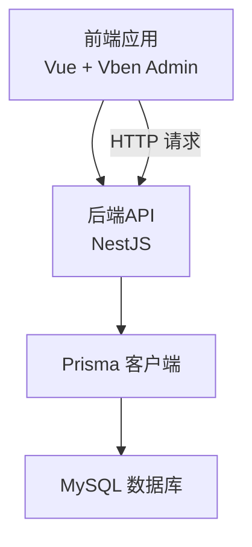
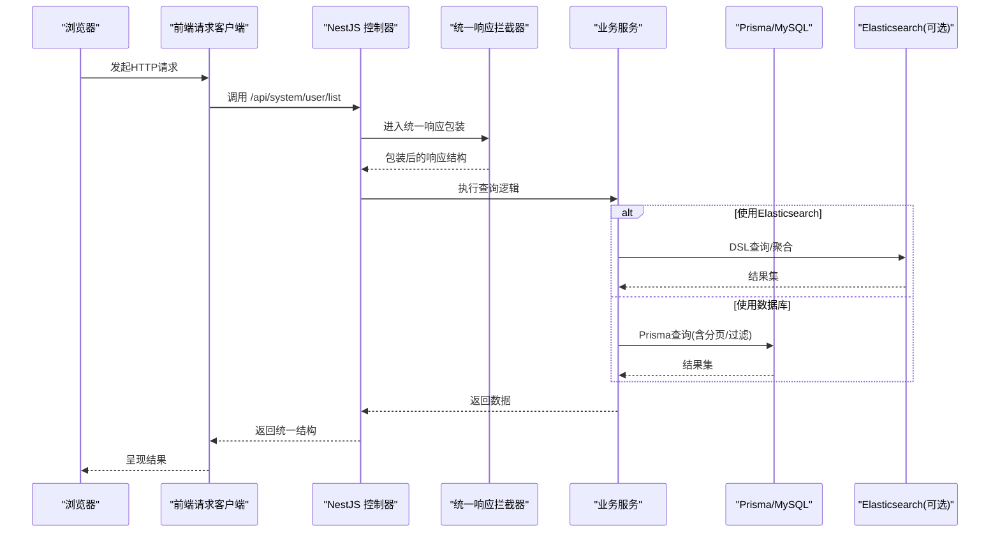
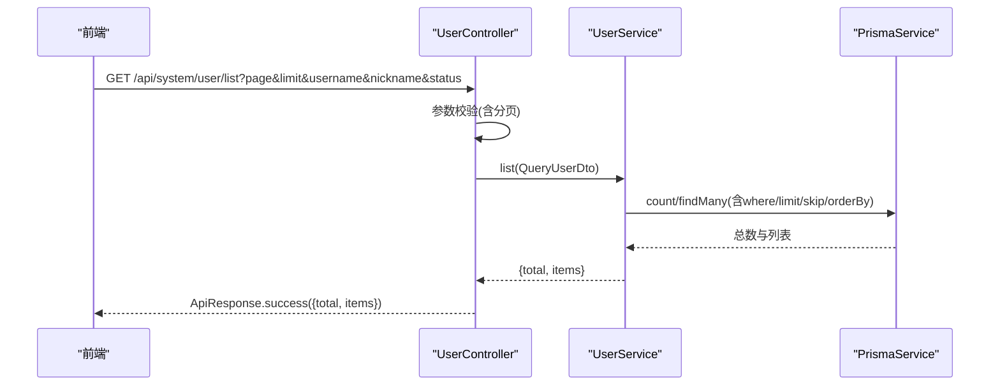
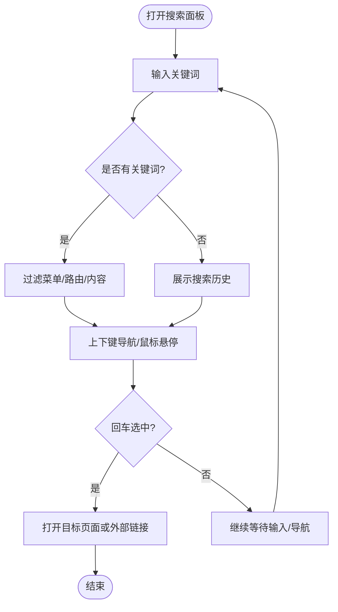
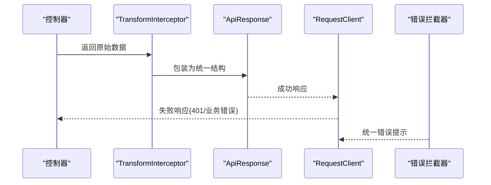

# 搜索引擎集成

<cite>
**本文引用的文件**
- [apps/backend/src/main.ts](file://apps/backend/src/main.ts)
- [apps/backend/src/common/api-response.ts](file://apps/backend/src/common/api-response.ts)
- [apps/backend/src/common/transform.interceptor.ts](file://apps/backend/src/common/transform.interceptor.ts)
- [apps/backend/src/common/prisma.service.ts](file://apps/backend/src/common/prisma.service.ts)
- [apps/backend/prisma/schema.prisma](file://apps/backend/prisma/schema.prisma)
- [apps/backend/src/modules/system/user/user.controller.ts](file://apps/backend/src/modules/system/user/user.controller.ts)
- [apps/backend/src/modules/system/user/dto/user.dto.ts](file://apps/backend/src/modules/system/user/dto/user.dto.ts)
- [apps/backend/src/modules/system/post/post.service.ts](file://apps/backend/src/modules/system/post/post.service.ts)
- [apps/vben-admin/apps/web-antd/src/api/system/user.ts](file://apps/vben-admin/apps/web-antd/src/api/system/user.ts)
- [apps/vben-admin/apps/web-antd/src/api/request.ts](file://apps/vben-admin/apps/web-antd/src/api/request.ts)
- [apps/vben-admin/packages/effects/layouts/src/widgets/global-search/global-search.vue](file://apps/vben-admin/packages/effects/layouts/src/widgets/global-search/global-search.vue)
- [apps/vben-admin/packages/effects/layouts/src/widgets/global-search/search-panel.vue](file://apps/vben-admin/packages/effects/layouts/src/widgets/global-search/search-panel.vue)
</cite>

## 目录
1. [简介](#简介)
2. [项目结构](#项目结构)
3. [核心组件](#核心组件)
4. [架构总览](#架构总览)
5. [详细组件分析](#详细组件分析)
6. [依赖关系分析](#依赖关系分析)
7. [性能考虑](#性能考虑)
8. [故障排查指南](#故障排查指南)
9. [结论](#结论)
10. [附录](#附录)

## 简介
本文件面向“搜索引擎集成”的专业技术文档，结合仓库现有代码，系统化梳理后端API、前端交互与数据库层的协作方式，并基于此提出可落地的搜索引擎集成方案。当前仓库以MySQL + Prisma + NestJS + Vue前端为主，未直接包含Elasticsearch集成代码；因此本文件将以“如何在此架构上集成Elasticsearch”为主线，给出索引创建、文档映射、查询DSL、全文检索优化、性能优化、API设计、监控与运维建议。

## 项目结构
- 后端采用NestJS，全局启用Swagger文档、统一响应包装、全局校验管道与静态资源服务。
- 数据层使用Prisma，通过schema定义模型与索引，支持分页查询。
- 前端采用Vue生态，统一请求客户端封装，具备拦截器与错误处理能力。
- 提供全局搜索面板组件，展示键盘导航与历史记录能力，可作为后续搜索引擎UI的参考。

图表来源
- [apps/backend/src/main.ts:1-48](file://apps/backend/src/main.ts#L1-L48)
- [apps/backend/src/common/prisma.service.ts:1-22](file://apps/backend/src/common/prisma.service.ts#L1-L22)
- [apps/backend/prisma/schema.prisma:1-347](file://apps/backend/prisma/schema.prisma#L1-L347)

章节来源
- [apps/backend/src/main.ts:1-48](file://apps/backend/src/main.ts#L1-L48)
- [apps/backend/src/common/prisma.service.ts:1-22](file://apps/backend/src/common/prisma.service.ts#L1-L22)
- [apps/backend/prisma/schema.prisma:1-347](file://apps/backend/prisma/schema.prisma#L1-L347)

## 核心组件
- 统一响应包装：后端通过拦截器将任意返回体包装为统一结构，便于前端消费与错误处理。
- 全局校验管道：开启白名单与转换，确保DTO参数安全与类型正确。
- Swagger文档：自动生成接口文档，便于联调与测试。
- 前端请求客户端：封装默认响应拦截器、鉴权拦截器与错误提示，统一处理401、业务错误等场景。

章节来源
- [apps/backend/src/common/api-response.ts:1-35](file://apps/backend/src/common/api-response.ts#L1-L35)
- [apps/backend/src/common/transform.interceptor.ts:1-29](file://apps/backend/src/common/transform.interceptor.ts#L1-L29)
- [apps/backend/src/main.ts:17-35](file://apps/backend/src/main.ts#L17-L35)
- [apps/vben-admin/apps/web-antd/src/api/request.ts:92-138](file://apps/vben-admin/apps/web-antd/src/api/request.ts#L92-L138)

## 架构总览
下图展示了从浏览器到数据库的典型请求链路，以及可扩展的搜索引擎集成点（以虚线框标识）。

图表来源
- [apps/backend/src/modules/system/user/user.controller.ts:26-31](file://apps/backend/src/modules/system/user/user.controller.ts#L26-L31)
- [apps/backend/src/common/transform.interceptor.ts:15-28](file://apps/backend/src/common/transform.interceptor.ts#L15-L28)
- [apps/backend/src/modules/system/post/post.service.ts:9-20](file://apps/backend/src/modules/system/post/post.service.ts#L9-L20)
- [apps/vben-admin/apps/web-antd/src/api/system/user.ts:27-29](file://apps/vben-admin/apps/web-antd/src/api/system/user.ts#L27-L29)

## 详细组件分析

### 1) 用户列表接口与DTO参数校验
- 控制器提供用户列表查询接口，使用JWT与权限守卫。
- DTO对分页参数进行最小值约束与类型转换，保证查询健壮性。
- 业务服务根据条件构造查询条件并执行分页查询。

图表来源
- [apps/backend/src/modules/system/user/user.controller.ts:26-31](file://apps/backend/src/modules/system/user/user.controller.ts#L26-L31)
- [apps/backend/src/modules/system/user/dto/user.dto.ts:94-130](file://apps/backend/src/modules/system/user/dto/user.dto.ts#L94-L130)
- [apps/backend/src/modules/system/post/post.service.ts:9-20](file://apps/backend/src/modules/system/post/post.service.ts#L9-L20)

章节来源
- [apps/backend/src/modules/system/user/user.controller.ts:26-31](file://apps/backend/src/modules/system/user/user.controller.ts#L26-L31)
- [apps/backend/src/modules/system/user/dto/user.dto.ts:94-130](file://apps/backend/src/modules/system/user/dto/user.dto.ts#L94-L130)
- [apps/backend/src/modules/system/post/post.service.ts:9-20](file://apps/backend/src/modules/system/post/post.service.ts#L9-L20)

### 2) 前端搜索面板与键盘导航
- 全局搜索组件提供快捷键打开、输入框聚焦、键盘上下导航、回车选择等功能。
- 搜索面板支持历史记录与正则匹配逻辑（用于本地模拟搜索），可作为搜索引擎UI交互的参考。

图表来源
- [apps/vben-admin/packages/effects/layouts/src/widgets/global-search/global-search.vue:54-96](file://apps/vben-admin/packages/effects/layouts/src/widgets/global-search/global-search.vue#L54-L96)
- [apps/vben-admin/packages/effects/layouts/src/widgets/global-search/search-panel.vue:97-157](file://apps/vben-admin/packages/effects/layouts/src/widgets/global-search/search-panel.vue#L97-L157)

章节来源
- [apps/vben-admin/packages/effects/layouts/src/widgets/global-search/global-search.vue:54-96](file://apps/vben-admin/packages/effects/layouts/src/widgets/global-search/global-search.vue#L54-L96)
- [apps/vben-admin/packages/effects/layouts/src/widgets/global-search/search-panel.vue:97-157](file://apps/vben-admin/packages/effects/layouts/src/widgets/global-search/search-panel.vue#L97-L157)

### 3) 统一响应与错误处理
- 后端拦截器将控制器返回体统一包装为统一结构，便于前端一致处理。
- 前端请求客户端内置响应拦截器与鉴权拦截器，统一处理401与业务错误消息。

图表来源
- [apps/backend/src/common/transform.interceptor.ts:15-28](file://apps/backend/src/common/transform.interceptor.ts#L15-L28)
- [apps/backend/src/common/api-response.ts:12-35](file://apps/backend/src/common/api-response.ts#L12-L35)
- [apps/vben-admin/apps/web-antd/src/api/request.ts:92-138](file://apps/vben-admin/apps/web-antd/src/api/request.ts#L92-L138)

章节来源
- [apps/backend/src/common/transform.interceptor.ts:15-28](file://apps/backend/src/common/transform.interceptor.ts#L15-L28)
- [apps/backend/src/common/api-response.ts:12-35](file://apps/backend/src/common/api-response.ts#L12-L35)
- [apps/vben-admin/apps/web-antd/src/api/request.ts:92-138](file://apps/vben-admin/apps/web-antd/src/api/request.ts#L92-L138)

## 依赖关系分析
- 控制器依赖服务层，服务层依赖Prisma进行数据库操作。
- 前端通过API模块调用后端接口，请求客户端负责拦截与错误处理。
- Swagger文档由主入口统一注册，便于联调与测试。

图表来源
- [apps/backend/src/modules/system/user/user.controller.ts:24-25](file://apps/backend/src/modules/system/user/user.controller.ts#L24-L25)
- [apps/backend/src/modules/system/post/post.service.ts:7-7](file://apps/backend/src/modules/system/post/post.service.ts#L7-L7)
- [apps/backend/src/common/prisma.service.ts:5-5](file://apps/backend/src/common/prisma.service.ts#L5-L5)
- [apps/vben-admin/apps/web-antd/src/api/system/user.ts:27-29](file://apps/vben-admin/apps/web-antd/src/api/system/user.ts#L27-L29)
- [apps/vben-admin/apps/web-antd/src/api/request.ts:125-127](file://apps/vben-admin/apps/web-antd/src/api/request.ts#L125-L127)

章节来源
- [apps/backend/src/modules/system/user/user.controller.ts:24-25](file://apps/backend/src/modules/system/user/user.controller.ts#L24-L25)
- [apps/backend/src/modules/system/post/post.service.ts:7-7](file://apps/backend/src/modules/system/post/post.service.ts#L7-L7)
- [apps/backend/src/common/prisma.service.ts:5-5](file://apps/backend/src/common/prisma.service.ts#L5-L5)
- [apps/vben-admin/apps/web-antd/src/api/system/user.ts:27-29](file://apps/vben-admin/apps/web-antd/src/api/system/user.ts#L27-L29)
- [apps/vben-admin/apps/web-antd/src/api/request.ts:125-127](file://apps/vben-admin/apps/web-antd/src/api/request.ts#L125-L127)

## 性能考虑
- 查询缓存：对高频查询结果进行缓存（如Redis），减少数据库压力；对分页查询可结合缓存命中率评估。
- 结果分页：严格限制每页最大条数，避免一次性返回大量数据；对排序字段建立合适索引。
- 索引与查询优化：在MySQL层面，为常用过滤字段与排序字段建立索引；在Elasticsearch层面，合理设置分片副本、映射字段类型与查询DSL。
- 高亮显示：在Elasticsearch中使用高亮片段，提升用户体验；注意高亮字段的存储与性能开销。
- 模糊匹配与同义词：在Elasticsearch中配置合适的分词器与同义词插件，平衡召回与精度。
- 监控与埋点：记录查询耗时、热门关键词、点击率等指标，持续优化召回与排序。

## 故障排查指南
- 统一响应结构：若前端报错，优先检查后端是否正确返回统一结构，确认拦截器是否生效。
- 参数校验：若出现400错误，检查DTO参数范围与类型转换是否符合预期。
- 数据库连接：确认Prisma连接状态与日志级别，排查慢查询与锁等待。
- 前端错误处理：确认请求客户端的响应拦截器与错误提示逻辑是否正常工作。
- Elasticsearch集成问题：若引入Elasticsearch，需关注索引映射一致性、分词器配置、写入延迟与查询性能。

章节来源
- [apps/backend/src/common/api-response.ts:12-35](file://apps/backend/src/common/api-response.ts#L12-L35)
- [apps/backend/src/common/transform.interceptor.ts:15-28](file://apps/backend/src/common/transform.interceptor.ts#L15-L28)
- [apps/backend/src/common/prisma.service.ts:14-21](file://apps/backend/src/common/prisma.service.ts#L14-L21)
- [apps/vben-admin/apps/web-antd/src/api/request.ts:92-138](file://apps/vben-admin/apps/web-antd/src/api/request.ts#L92-L138)

## 结论
本仓库提供了完善的后端API与前端交互基础，能够良好支撑搜索引擎集成。建议在现有架构上引入Elasticsearch，结合统一响应与前端请求客户端，实现全文检索、高亮与性能优化，并通过监控与埋点持续迭代搜索体验。

## 附录

### A. Elasticsearch集成实施清单
- 索引创建与映射
  - 设计文档映射，明确字段类型、分词器与是否可搜索/可聚合。
  - 为常用过滤字段建立索引，避免动态映射导致的字段类型变更。
- 查询DSL编写
  - 使用多字段查询与布尔查询组合，提升召回与精度。
  - 支持模糊匹配、通配符与同义词扩展，结合评分与高亮。
- 全文检索优化
  - 分词器：根据语言选择合适分词器，必要时自定义停用词与同义词。
  - 同义词：维护同义词库，定期更新与评估效果。
  - 模糊匹配：控制编辑距离与前缀长度，避免过度扩大召回。
- 性能优化
  - 查询缓存：热点查询结果缓存；对分页与聚合查询设置超时。
  - 结果分页：限制最大页码与每页数量；使用search_after替代深度分页。
  - 高亮显示：仅对必要字段高亮，控制片段大小。
- API实现建议
  - 接口命名：GET /api/search/documents，支持分页、过滤、排序与高亮。
  - 参数校验：对关键词、过滤条件、分页参数进行严格校验。
  - 响应格式：沿用统一响应结构，包含总数、命中结果与高亮片段。
- 数据分析与监控
  - 查询统计：记录热门关键词、平均耗时、失败率。
  - 搜索体验：点击率、跳出率、停留时长等指标。
- 运维管理
  - 集群配置：合理设置分片与副本，监控节点健康与磁盘空间。
  - 备份恢复：制定快照策略与恢复流程，定期演练。
  - 版本升级：灰度发布与兼容性测试，确保索引映射与查询DSL兼容。

### B. 参考文件路径
- 后端启动与文档
  - [apps/backend/src/main.ts:1-48](file://apps/backend/src/main.ts#L1-L48)
- 统一响应与拦截器
  - [apps/backend/src/common/api-response.ts:1-35](file://apps/backend/src/common/api-response.ts#L1-L35)
  - [apps/backend/src/common/transform.interceptor.ts:1-29](file://apps/backend/src/common/transform.interceptor.ts#L1-L29)
- 数据库与模型
  - [apps/backend/src/common/prisma.service.ts:1-22](file://apps/backend/src/common/prisma.service.ts#L1-L22)
  - [apps/backend/prisma/schema.prisma:1-347](file://apps/backend/prisma/schema.prisma#L1-L347)
- 用户模块接口与DTO
  - [apps/backend/src/modules/system/user/user.controller.ts:26-31](file://apps/backend/src/modules/system/user/user.controller.ts#L26-L31)
  - [apps/backend/src/modules/system/user/dto/user.dto.ts:94-130](file://apps/backend/src/modules/system/user/dto/user.dto.ts#L94-L130)
- 业务服务示例
  - [apps/backend/src/modules/system/post/post.service.ts:9-20](file://apps/backend/src/modules/system/post/post.service.ts#L9-L20)
- 前端API与请求客户端
  - [apps/vben-admin/apps/web-antd/src/api/system/user.ts:27-29](file://apps/vben-admin/apps/web-antd/src/api/system/user.ts#L27-L29)
  - [apps/vben-admin/apps/web-antd/src/api/request.ts:92-138](file://apps/vben-admin/apps/web-antd/src/api/request.ts#L92-L138)
- 全局搜索组件
  - [apps/vben-admin/packages/effects/layouts/src/widgets/global-search/global-search.vue:54-96](file://apps/vben-admin/packages/effects/layouts/src/widgets/global-search/global-search.vue#L54-L96)
  - [apps/vben-admin/packages/effects/layouts/src/widgets/global-search/search-panel.vue:97-157](file://apps/vben-admin/packages/effects/layouts/src/widgets/global-search/search-panel.vue#L97-L157)