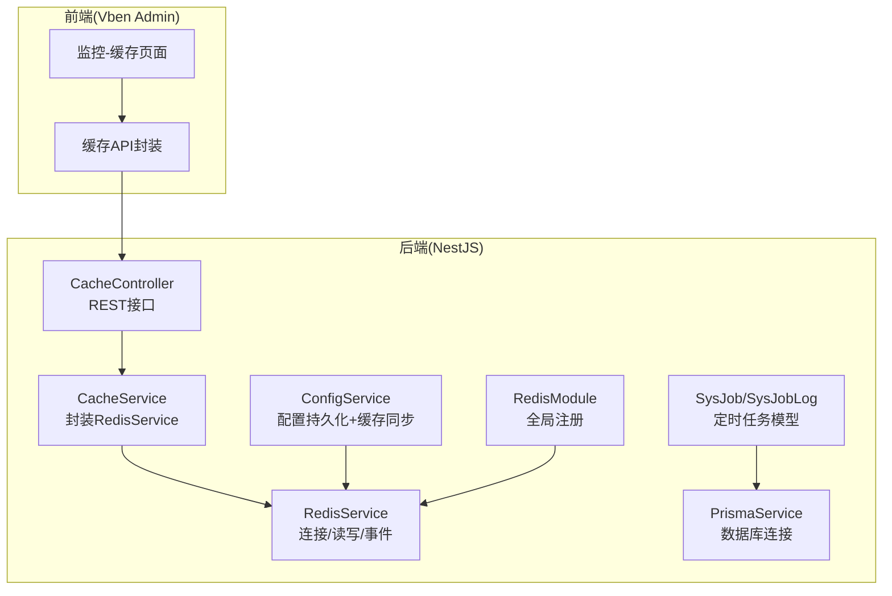
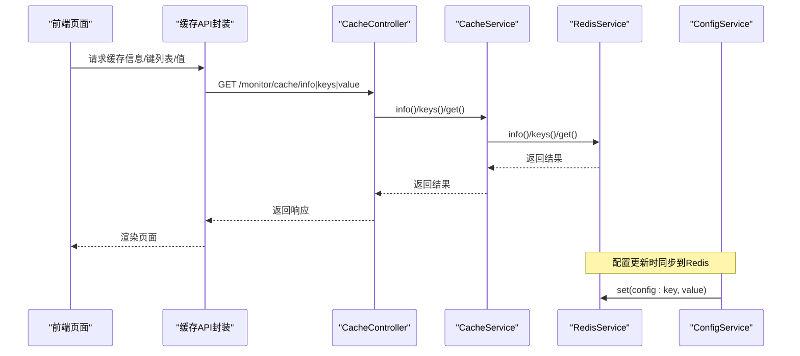
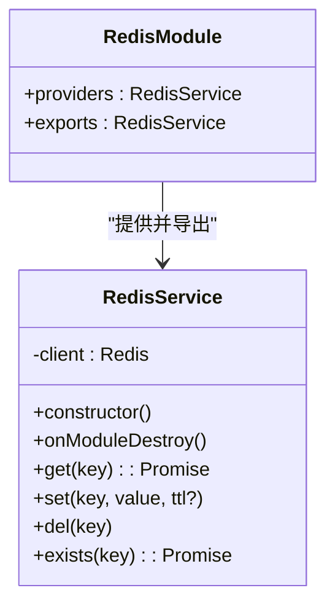
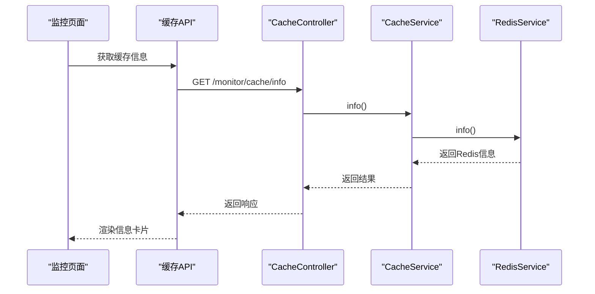
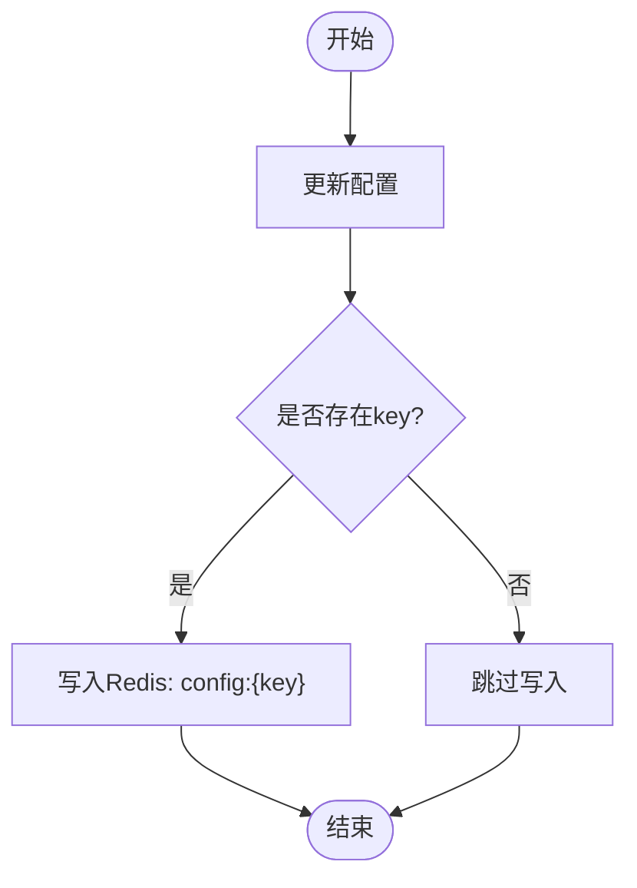
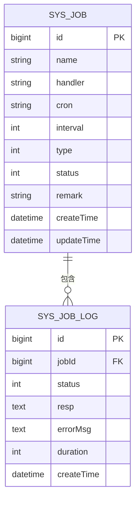
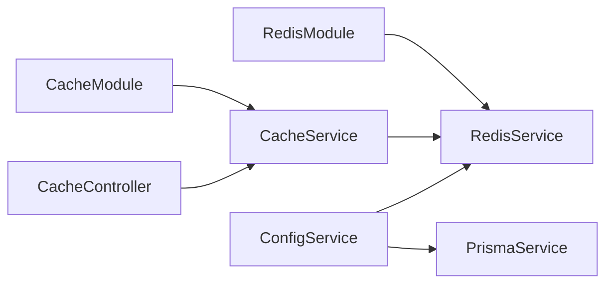

# 消息队列集成

<cite>
**本文档引用的文件**
- [apps/backend/src/cache/redis.module.ts](file://apps/backend/src/cache/redis.module.ts)
- [apps/backend/src/cache/redis.service.ts](file://apps/backend/src/cache/redis.service.ts)
- [apps/backend/src/modules/monitor/cache/cache.controller.ts](file://apps/backend/src/modules/monitor/cache/cache.controller.ts)
- [apps/backend/src/modules/monitor/cache/cache.service.ts](file://apps/backend/src/modules/monitor/cache/cache.service.ts)
- [apps/backend/src/modules/system/config/config.service.ts](file://apps/backend/src/modules/system/config/config.service.ts)
- [apps/backend/src/modules/system/config/config.controller.ts](file://apps/backend/src/modules/system/config/config.controller.ts)
- [apps/backend/src/config/env.config.ts](file://apps/backend/src/config/env.config.ts)
- [apps/backend/src/common/prisma.service.ts](file://apps/backend/src/common/prisma.service.ts)
- [apps/backend/prisma/schema.prisma](file://apps/backend/prisma/schema.prisma)
- [apps/vben-admin/apps/web-antd/src/views/monitor/cache/index.vue](file://apps/vben-admin/apps/web-antd/src/views/monitor/cache/index.vue)
- [apps/vben-admin/apps/web-antd/src/api/monitor/cache.ts](file://apps/vben-admin/apps/web-antd/src/api/monitor/cache.ts)
</cite>

## 目录
1. [简介](#简介)
2. [项目结构](#项目结构)
3. [核心组件](#核心组件)
4. [架构概览](#架构概览)
5. [详细组件分析](#详细组件分析)
6. [依赖关系分析](#依赖关系分析)
7. [性能考虑](#性能考虑)
8. [故障排查指南](#故障排查指南)
9. [结论](#结论)
10. [附录](#附录)

## 简介
本指南围绕消息队列集成展开，结合当前仓库中已实现的 Redis 缓存能力与定时任务模型，系统性地阐述如何在 NestJS 后端与 Vben 前端之间构建可扩展的消息中间件方案。文档重点覆盖以下方面：
- 连接配置与环境变量管理
- 队列声明与消息发布订阅（基于现有 Redis 能力）
- 异步任务处理（结合定时任务模型）
- 序列化与反序列化最佳实践
- 生产者与消费者的实现路径
- 错误处理、事务支持与性能监控
- 消息路由与负载均衡策略（分片、优先级、延迟）
- 监控与运维（指标采集、故障排查、性能调优）

说明：当前仓库未包含 RabbitMQ、Redis Pub/Sub、Kafka 的直接集成实现；本文档以现有 Redis 能力为基础，提供可迁移至上述中间件的通用设计与实施建议。

## 项目结构
后端采用 NestJS 架构，前端使用 Vben Admin。消息相关能力主要体现在：
- Redis 缓存模块（全局注入、连接与基本操作）
- 监控模块（缓存信息、键查询、值获取、清理与删除）
- 系统配置模块（配置项持久化与缓存同步）
- 定时任务模型（SysJob/SysJobLog）为异步任务调度提供数据基础
- 前端监控页面与 API 接口

**图表来源**
- [apps/backend/src/cache/redis.module.ts:1-9](file://apps/backend/src/cache/redis.module.ts#L1-L9)
- [apps/backend/src/cache/redis.service.ts:1-56](file://apps/backend/src/cache/redis.service.ts#L1-L56)
- [apps/backend/src/modules/monitor/cache/cache.controller.ts:1-50](file://apps/backend/src/modules/monitor/cache/cache.controller.ts#L1-L50)
- [apps/backend/src/modules/monitor/cache/cache.service.ts:1-29](file://apps/backend/src/modules/monitor/cache/cache.service.ts#L1-L29)
- [apps/backend/src/modules/system/config/config.service.ts:1-56](file://apps/backend/src/modules/system/config/config.service.ts#L1-L56)
- [apps/backend/src/common/prisma.service.ts:1-22](file://apps/backend/src/common/prisma.service.ts#L1-L22)
- [apps/backend/prisma/schema.prisma:256-347](file://apps/backend/prisma/schema.prisma#L256-L347)
- [apps/vben-admin/apps/web-antd/src/views/monitor/cache/index.vue:1-114](file://apps/vben-admin/apps/web-antd/src/views/monitor/cache/index.vue#L1-L114)
- [apps/vben-admin/apps/web-antd/src/api/monitor/cache.ts:1-35](file://apps/vben-admin/apps/web-antd/src/api/monitor/cache.ts#L1-L35)

**章节来源**
- [apps/backend/src/cache/redis.module.ts:1-9](file://apps/backend/src/cache/redis.module.ts#L1-L9)
- [apps/backend/src/cache/redis.service.ts:1-56](file://apps/backend/src/cache/redis.service.ts#L1-L56)
- [apps/backend/src/modules/monitor/cache/cache.controller.ts:1-50](file://apps/backend/src/modules/monitor/cache/cache.controller.ts#L1-L50)
- [apps/backend/src/modules/monitor/cache/cache.service.ts:1-29](file://apps/backend/src/modules/monitor/cache/cache.service.ts#L1-L29)
- [apps/backend/src/modules/system/config/config.service.ts:1-56](file://apps/backend/src/modules/system/config/config.service.ts#L1-L56)
- [apps/backend/src/common/prisma.service.ts:1-22](file://apps/backend/src/common/prisma.service.ts#L1-L22)
- [apps/backend/prisma/schema.prisma:256-347](file://apps/backend/prisma/schema.prisma#L256-L347)
- [apps/vben-admin/apps/web-antd/src/views/monitor/cache/index.vue:1-114](file://apps/vben-admin/apps/web-antd/src/views/monitor/cache/index.vue#L1-L114)
- [apps/vben-admin/apps/web-antd/src/api/monitor/cache.ts:1-35](file://apps/vben-admin/apps/web-antd/src/api/monitor/cache.ts#L1-L35)

## 核心组件
- Redis 模块与服务
  - 全局注册 Redis 模块，提供连接池与事件监听
  - 提供 get/set/del/exists 等基础操作，并对 JSON 进行自动序列化/反序列化
- 缓存监控控制器与服务
  - 对外暴露 Redis 信息、键查询、值获取、清空与删除等接口
  - 前端通过 API 封装调用后端接口
- 配置服务
  - 将系统配置写入数据库，并同步到 Redis 缓存，便于运行时读取
- 定时任务模型
  - SysJob/SysJobLog 支持基于 cron/interval 的任务定义与执行日志记录
- 数据库服务
  - PrismaService 统一数据库连接生命周期管理

**章节来源**
- [apps/backend/src/cache/redis.module.ts:1-9](file://apps/backend/src/cache/redis.module.ts#L1-L9)
- [apps/backend/src/cache/redis.service.ts:1-56](file://apps/backend/src/cache/redis.service.ts#L1-L56)
- [apps/backend/src/modules/monitor/cache/cache.controller.ts:1-50](file://apps/backend/src/modules/monitor/cache/cache.controller.ts#L1-L50)
- [apps/backend/src/modules/monitor/cache/cache.service.ts:1-29](file://apps/backend/src/modules/monitor/cache/cache.service.ts#L1-L29)
- [apps/backend/src/modules/system/config/config.service.ts:1-56](file://apps/backend/src/modules/system/config/config.service.ts#L1-L56)
- [apps/backend/src/common/prisma.service.ts:1-22](file://apps/backend/src/common/prisma.service.ts#L1-L22)
- [apps/backend/prisma/schema.prisma:256-347](file://apps/backend/prisma/schema.prisma#L256-L347)

## 架构概览
下图展示从前端到后端再到 Redis 的典型调用链路，以及配置刷新流程：

**图表来源**
- [apps/backend/src/modules/monitor/cache/cache.controller.ts:1-50](file://apps/backend/src/modules/monitor/cache/cache.controller.ts#L1-L50)
- [apps/backend/src/modules/monitor/cache/cache.service.ts:1-29](file://apps/backend/src/modules/monitor/cache/cache.service.ts#L1-L29)
- [apps/backend/src/cache/redis.service.ts:1-56](file://apps/backend/src/cache/redis.service.ts#L1-L56)
- [apps/backend/src/modules/system/config/config.service.ts:1-56](file://apps/backend/src/modules/system/config/config.service.ts#L1-L56)

## 详细组件分析

### Redis 连接与服务
- 连接配置
  - 通过环境变量 REDIS_HOST/REDIS_PORT/REDIS_PASSWORD/REDIS_DB 初始化连接
  - 在模块构造函数中建立连接并监听 connect/error 事件
- 基础操作
  - get：尝试 JSON 反序列化，失败则返回原始字符串
  - set：自动序列化对象为 JSON，支持 TTL
  - del/exist：键删除与存在性检查
- 生命周期
  - 模块销毁时主动 quit，确保连接释放

**图表来源**
- [apps/backend/src/cache/redis.module.ts:1-9](file://apps/backend/src/cache/redis.module.ts#L1-L9)
- [apps/backend/src/cache/redis.service.ts:1-56](file://apps/backend/src/cache/redis.service.ts#L1-L56)

**章节来源**
- [apps/backend/src/cache/redis.module.ts:1-9](file://apps/backend/src/cache/redis.module.ts#L1-L9)
- [apps/backend/src/cache/redis.service.ts:1-56](file://apps/backend/src/cache/redis.service.ts#L1-L56)

### 缓存监控控制器与服务
- 控制器
  - 提供 /monitor/cache/info、/monitor/cache/keys、/monitor/cache/value、/monitor/cache/clear、/monitor/cache/delete 等接口
  - 使用 JWT 与权限守卫保护
- 服务
  - 封装 RedisService，提供 info/keys/get/clear/delete 方法
- 前端
  - 页面加载时拉取缓存信息与键列表
  - 支持查看键值、删除单个键、一键清空

**图表来源**
- [apps/backend/src/modules/monitor/cache/cache.controller.ts:1-50](file://apps/backend/src/modules/monitor/cache/cache.controller.ts#L1-L50)
- [apps/backend/src/modules/monitor/cache/cache.service.ts:1-29](file://apps/backend/src/modules/monitor/cache/cache.service.ts#L1-L29)
- [apps/backend/src/cache/redis.service.ts:1-56](file://apps/backend/src/cache/redis.service.ts#L1-L56)
- [apps/vben-admin/apps/web-antd/src/views/monitor/cache/index.vue:1-114](file://apps/vben-admin/apps/web-antd/src/views/monitor/cache/index.vue#L1-L114)
- [apps/vben-admin/apps/web-antd/src/api/monitor/cache.ts:1-35](file://apps/vben-admin/apps/web-antd/src/api/monitor/cache.ts#L1-L35)

**章节来源**
- [apps/backend/src/modules/monitor/cache/cache.controller.ts:1-50](file://apps/backend/src/modules/monitor/cache/cache.controller.ts#L1-L50)
- [apps/backend/src/modules/monitor/cache/cache.service.ts:1-29](file://apps/backend/src/modules/monitor/cache/cache.service.ts#L1-L29)
- [apps/vben-admin/apps/web-antd/src/views/monitor/cache/index.vue:1-114](file://apps/vben-admin/apps/web-antd/src/views/monitor/cache/index.vue#L1-L114)
- [apps/vben-admin/apps/web-antd/src/api/monitor/cache.ts:1-35](file://apps/vben-admin/apps/web-antd/src/api/monitor/cache.ts#L1-L35)

### 配置服务与缓存同步
- 更新配置时，若存在 key，则同步写入 Redis，键前缀为 config:{key}
- 刷新配置时，遍历状态为启用的配置项，批量写入 Redis
- 该机制为“配置即缓存”的运行时策略提供支撑

**图表来源**
- [apps/backend/src/modules/system/config/config.service.ts:1-56](file://apps/backend/src/modules/system/config/config.service.ts#L1-L56)

**章节来源**
- [apps/backend/src/modules/system/config/config.service.ts:1-56](file://apps/backend/src/modules/system/config/config.service.ts#L1-L56)

### 定时任务模型与异步处理
- SysJob：任务元数据（名称、处理器、cron/interval、类型、状态、备注）
- SysJobLog：任务执行日志（关联任务ID、状态、响应、错误、耗时、时间）
- 该模型为异步任务调度与追踪提供了数据基础，可作为消息队列任务的存储层

**图表来源**
- [apps/backend/prisma/schema.prisma:256-347](file://apps/backend/prisma/schema.prisma#L256-L347)

**章节来源**
- [apps/backend/prisma/schema.prisma:256-347](file://apps/backend/prisma/schema.prisma#L256-L347)

## 依赖关系分析
- 模块耦合
  - CacheModule 依赖 RedisModule（通过注入 RedisService）
  - ConfigService 同时依赖 PrismaService 与 RedisService
  - CacheController 依赖 CacheService
- 外部依赖
  - Redis 客户端（ioredis）
  - Prisma（数据库 ORM）
- 潜在循环依赖
  - 当前结构清晰，未发现循环依赖

**图表来源**
- [apps/backend/src/cache/redis.module.ts:1-9](file://apps/backend/src/cache/redis.module.ts#L1-L9)
- [apps/backend/src/cache/redis.service.ts:1-56](file://apps/backend/src/cache/redis.service.ts#L1-L56)
- [apps/backend/src/modules/monitor/cache/cache.module.ts:1-10](file://apps/backend/src/modules/monitor/cache/cache.module.ts#L1-L10)
- [apps/backend/src/modules/monitor/cache/cache.service.ts:1-29](file://apps/backend/src/modules/monitor/cache/cache.service.ts#L1-L29)
- [apps/backend/src/modules/system/config/config.service.ts:1-56](file://apps/backend/src/modules/system/config/config.service.ts#L1-L56)
- [apps/backend/src/common/prisma.service.ts:1-22](file://apps/backend/src/common/prisma.service.ts#L1-L22)

**章节来源**
- [apps/backend/src/cache/redis.module.ts:1-9](file://apps/backend/src/cache/redis.module.ts#L1-L9)
- [apps/backend/src/cache/redis.service.ts:1-56](file://apps/backend/src/cache/redis.service.ts#L1-L56)
- [apps/backend/src/modules/monitor/cache/cache.module.ts:1-10](file://apps/backend/src/modules/monitor/cache/cache.module.ts#L1-L10)
- [apps/backend/src/modules/monitor/cache/cache.service.ts:1-29](file://apps/backend/src/modules/monitor/cache/cache.service.ts#L1-L29)
- [apps/backend/src/modules/system/config/config.service.ts:1-56](file://apps/backend/src/modules/system/config/config.service.ts#L1-L56)
- [apps/backend/src/common/prisma.service.ts:1-22](file://apps/backend/src/common/prisma.service.ts#L1-L22)

## 性能考虑
- 连接池与复用
  - Redis 客户端默认连接池，建议在高并发场景下评估连接数上限与超时设置
- 序列化开销
  - 自动 JSON 序列化/反序列化带来 CPU 开销，建议对大对象进行压缩或选择更高效的序列化格式
- TTL 与内存
  - 合理设置键 TTL，避免内存膨胀；定期清理过期键
- 批量操作
  - 对于高频写入场景，优先使用管道或批量命令减少网络往返
- 监控指标
  - 关注连接数、命中率、内存使用、命令耗时等关键指标

[本节为通用指导，无需特定文件来源]

## 故障排查指南
- 连接问题
  - 检查 REDIS_HOST/REDIS_PORT/REDIS_PASSWORD/REDIS_DB 环境变量是否正确
  - 查看控制台输出的 connect/error 事件日志
- 响应异常
  - get 操作返回 null 或解析失败时，确认键是否存在且值为合法 JSON
- 权限与鉴权
  - 缓存接口受 JWT 与权限守卫保护，需确保 Token 有效且具备 monitor:cache:list 权限
- 数据一致性
  - 配置更新后需验证 Redis 中对应键是否同步成功

**章节来源**
- [apps/backend/src/cache/redis.service.ts:1-56](file://apps/backend/src/cache/redis.service.ts#L1-L56)
- [apps/backend/src/modules/monitor/cache/cache.controller.ts:1-50](file://apps/backend/src/modules/monitor/cache/cache.controller.ts#L1-L50)
- [apps/backend/src/modules/system/config/config.service.ts:1-56](file://apps/backend/src/modules/system/config/config.service.ts#L1-L56)

## 结论
当前仓库以 Redis 为核心实现了缓存能力与监控接口，并通过定时任务模型为异步任务处理提供了数据基础。基于这些组件，可以平滑扩展到 RabbitMQ、Redis Pub/Sub、Kafka 等消息中间件：
- 连接配置：统一通过环境变量与配置模块管理
- 队列声明与消息发布订阅：抽象出 Producer/Consumer 接口，适配不同中间件
- 异步任务：沿用 SysJob/SysJobLog 模型，将任务处理器与消息队列解耦
- 序列化：优先 JSON，必要时引入 Protocol Buffers 或 Avro
- 监控：统一采集指标并接入现有前端监控页面

[本节为总结，无需特定文件来源]

## 附录

### 环境变量与配置
- Redis 相关
  - REDIS_HOST、REDIS_PORT、REDIS_PASSWORD、REDIS_DB
- 应用与数据库
  - APP_PORT、APP_ENV、DATABASE_URL 等

**章节来源**
- [apps/backend/src/config/env.config.ts:1-47](file://apps/backend/src/config/env.config.ts#L1-L47)

### 前端监控页面与 API
- 页面组件负责发起请求并渲染结果
- API 封装了对后端接口的调用

**章节来源**
- [apps/vben-admin/apps/web-antd/src/views/monitor/cache/index.vue:1-114](file://apps/vben-admin/apps/web-antd/src/views/monitor/cache/index.vue#L1-L114)
- [apps/vben-admin/apps/web-antd/src/api/monitor/cache.ts:1-35](file://apps/vben-admin/apps/web-antd/src/api/monitor/cache.ts#L1-L35)