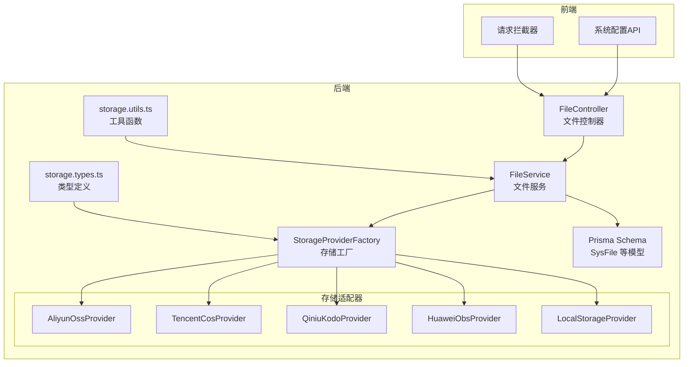
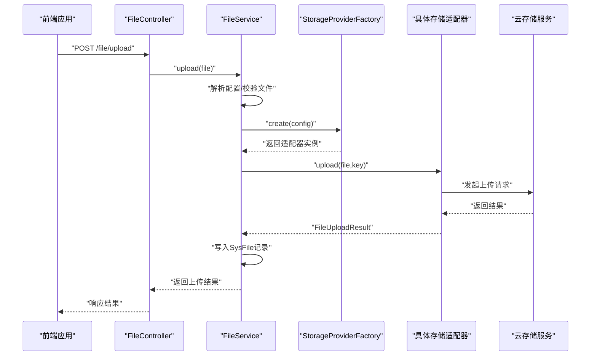
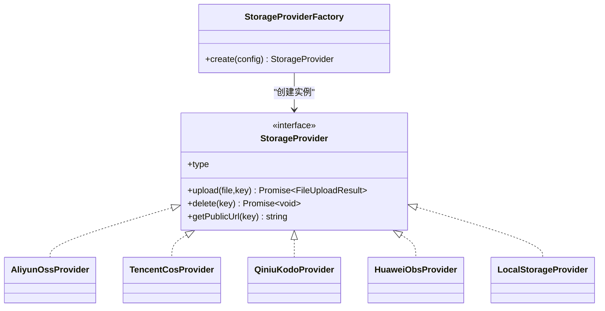
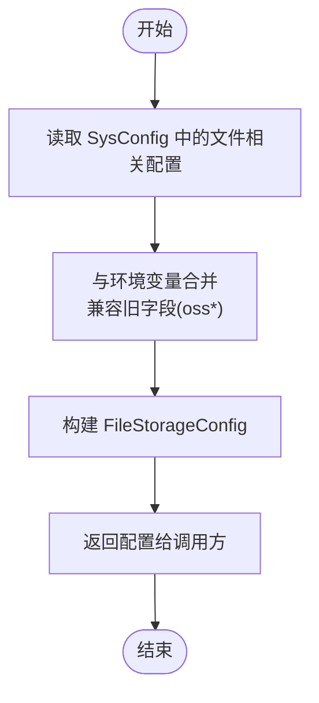
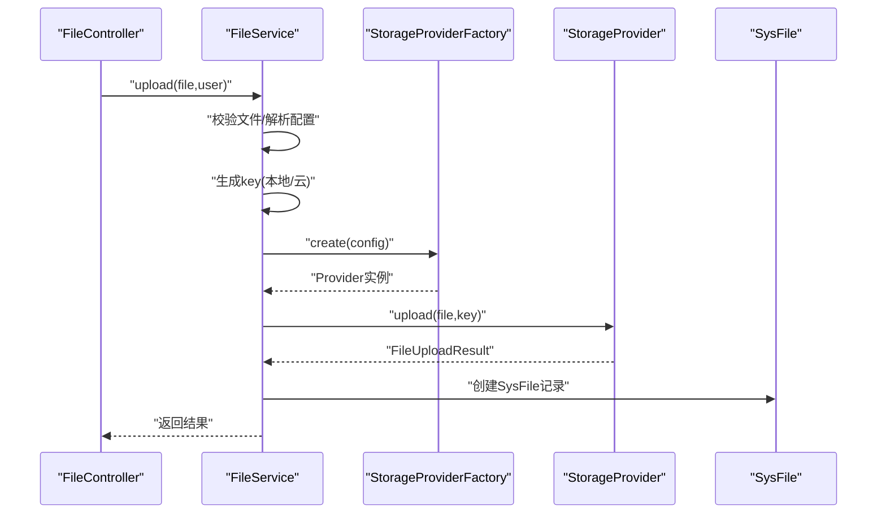
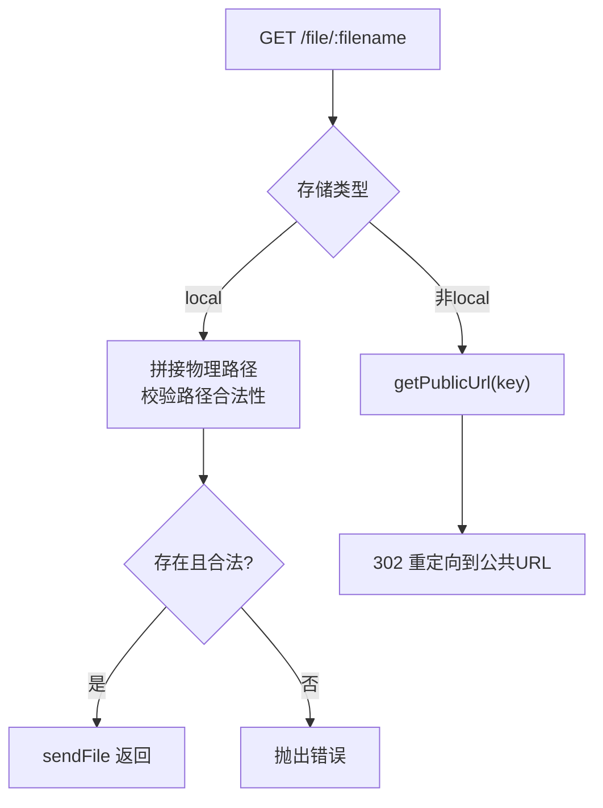
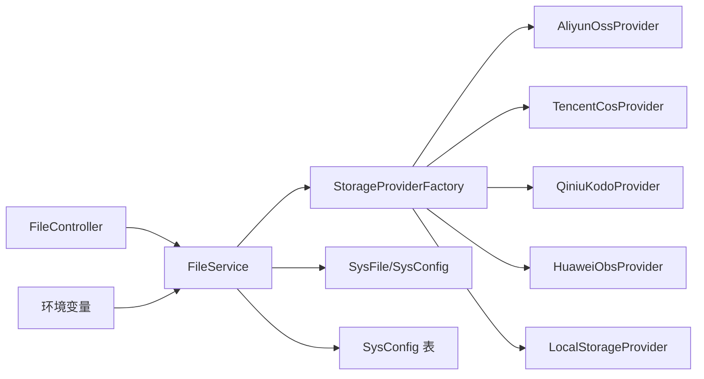

# 第三方API集成

<cite>
**本文引用的文件**
- [apps/backend/src/modules/file/storage/storage-provider.factory.ts](file://apps/backend/src/modules/file/storage/storage-provider.factory.ts)
- [apps/backend/src/modules/file/storage/storage.types.ts](file://apps/backend/src/modules/file/storage/storage.types.ts)
- [apps/backend/src/modules/file/storage/storage.utils.ts](file://apps/backend/src/modules/file/storage/storage.utils.ts)
- [apps/backend/src/modules/file/file.service.ts](file://apps/backend/src/modules/file/file.service.ts)
- [apps/backend/src/modules/file/file.controller.ts](file://apps/backend/src/modules/file/file.controller.ts)
- [apps/backend/src/modules/file/storage/aliyun-oss.provider.ts](file://apps/backend/src/modules/file/storage/aliyun-oss.provider.ts)
- [apps/backend/src/modules/file/storage/tencent-cos.provider.ts](file://apps/backend/src/modules/file/storage/tencent-cos.provider.ts)
- [apps/backend/src/modules/file/storage/qiniu-kodo.provider.ts](file://apps/backend/src/modules/file/storage/qiniu-kodo.provider.ts)
- [apps/backend/src/modules/file/storage/huawei-obs.provider.ts](file://apps/backend/src/modules/file/storage/huawei-obs.provider.ts)
- [apps/backend/src/modules/file/storage/local.provider.ts](file://apps/backend/src/modules/file/storage/local.provider.ts)
- [apps/backend/prisma/schema.prisma](file://apps/backend/prisma/schema.prisma)
- [apps/backend/src/config/env.config.ts](file://apps/backend/src/config/env.config.ts)
- [apps/backend/src/common/oper-log.interceptor.ts](file://apps/backend/src/common/oper-log.interceptor.ts)
- [apps/backend/src/modules/monitor/server/server.controller.ts](file://apps/backend/src/modules/monitor/server/server.controller.ts)
- [apps/backend/src/cache/redis.service.ts](file://apps/backend/src/cache/redis.service.ts)
- [apps/vben-admin/apps/web-antd/src/api/system/config.ts](file://apps/vben-admin/apps/web-antd/src/api/system/config.ts)
- [apps/vben-admin/packages/effects/request/src/request-client/preset-interceptors.ts](file://apps/vben-admin/packages/effects/request/src/request-client/preset-interceptors.ts)
</cite>

## 目录
1. [简介](#简介)
2. [项目结构](#项目结构)
3. [核心组件](#核心组件)
4. [架构总览](#架构总览)
5. [详细组件分析](#详细组件分析)
6. [依赖关系分析](#依赖关系分析)
7. [性能考量](#性能考量)
8. [故障排查指南](#故障排查指南)
9. [结论](#结论)
10. [附录](#附录)

## 简介
本指南围绕“第三方API集成”主题，系统梳理后端对多家云存储服务（阿里云OSS、腾讯云COS、华为云OBS、七牛云Kodo）的统一抽象与实现，涵盖配置管理、认证与签名、上传下载策略、错误处理与超时重试、限流与配额、监控与运维等方面。文档以仓库现有代码为依据，提供可操作的实现路径与最佳实践建议。

## 项目结构
后端采用 NestJS 架构，文件模块位于 apps/backend/src/modules/file 下，包含统一的存储抽象、工厂类、各云厂商适配器以及通用工具函数；前端通过 vben-admin 提供配置与上传界面。

图表来源
- [apps/backend/src/modules/file/file.controller.ts:1-100](file://apps/backend/src/modules/file/file.controller.ts#L1-100)
- [apps/backend/src/modules/file/file.service.ts:1-310](file://apps/backend/src/modules/file/file.service.ts#L1-310)
- [apps/backend/src/modules/file/storage/storage-provider.factory.ts:1-25](file://apps/backend/src/modules/file/storage/storage-provider.factory.ts#L1-25)
- [apps/backend/src/modules/file/storage/storage.types.ts:1-43](file://apps/backend/src/modules/file/storage/storage.types.ts#L1-43)
- [apps/backend/src/modules/file/storage/storage.utils.ts:1-62](file://apps/backend/src/modules/file/storage/storage.utils.ts#L1-62)
- [apps/backend/prisma/schema.prisma:182-207](file://apps/backend/prisma/schema.prisma#L182-L207)
- [apps/vben-admin/apps/web-antd/src/api/system/config.ts:1-46](file://apps/vben-admin/apps/web-antd/src/api/system/config.ts#L1-46)
- [apps/vben-admin/packages/effects/request/src/request-client/preset-interceptors.ts:133-165](file://apps/vben-admin/packages/effects/request/src/request-client/preset-interceptors.ts#L133-L165)

章节来源
- [apps/backend/src/modules/file/file.controller.ts:1-100](file://apps/backend/src/modules/file/file.controller.ts#L1-100)
- [apps/backend/src/modules/file/file.service.ts:1-310](file://apps/backend/src/modules/file/file.service.ts#L1-310)
- [apps/backend/src/modules/file/storage/storage-provider.factory.ts:1-25](file://apps/backend/src/modules/file/storage/storage-provider.factory.ts#L1-25)
- [apps/backend/src/modules/file/storage/storage.types.ts:1-43](file://apps/backend/src/modules/file/storage/storage.types.ts#L1-43)
- [apps/backend/src/modules/file/storage/storage.utils.ts:1-62](file://apps/backend/src/modules/file/storage/storage.utils.ts#L1-62)
- [apps/backend/prisma/schema.prisma:182-207](file://apps/backend/prisma/schema.prisma#L182-L207)
- [apps/vben-admin/apps/web-antd/src/api/system/config.ts:1-46](file://apps/vben-admin/apps/web-antd/src/api/system/config.ts#L1-46)
- [apps/vben-admin/packages/effects/request/src/request-client/preset-interceptors.ts:133-165](file://apps/vben-admin/packages/effects/request/src/request-client/preset-interceptors.ts#L133-L165)

## 核心组件
- 统一接口与类型：通过 StorageProvider 接口与 FileStorageConfig 定义，屏蔽不同云厂商差异。
- 存储工厂：根据配置动态选择具体适配器（本地/阿里云OSS/腾讯云COS/华为云OBS/七牛云Kodo）。
- 服务层：负责配置解析、文件校验、上传执行、元数据入库、预览/下载路由。
- 控制器层：提供配置读取/更新、文件列表查询、删除、上传、预览等接口。
- 工具函数：文件名生成、对象键拼装、URL构建、配置校验与兼容性处理。
- 数据模型：SysFile 记录文件元信息，SysConfig 存储运行时配置。

章节来源
- [apps/backend/src/modules/file/storage/storage.types.ts:1-43](file://apps/backend/src/modules/file/storage/storage.types.ts#L1-43)
- [apps/backend/src/modules/file/storage/storage-provider.factory.ts:1-25](file://apps/backend/src/modules/file/storage/storage-provider.factory.ts#L1-25)
- [apps/backend/src/modules/file/file.service.ts:1-310](file://apps/backend/src/modules/file/file.service.ts#L1-310)
- [apps/backend/src/modules/file/file.controller.ts:1-100](file://apps/backend/src/modules/file/file.controller.ts#L1-100)
- [apps/backend/src/modules/file/storage/storage.utils.ts:1-62](file://apps/backend/src/modules/file/storage/storage.utils.ts#L1-62)
- [apps/backend/prisma/schema.prisma:182-207](file://apps/backend/prisma/schema.prisma#L182-L207)

## 架构总览
下图展示从客户端到后端控制器、服务层、存储适配器及云存储的调用链路与数据流向。

图表来源
- [apps/backend/src/modules/file/file.controller.ts:77-98](file://apps/backend/src/modules/file/file.controller.ts#L77-98)
- [apps/backend/src/modules/file/file.service.ts:150-209](file://apps/backend/src/modules/file/file.service.ts#L150-L209)
- [apps/backend/src/modules/file/storage/storage-provider.factory.ts:8-23](file://apps/backend/src/modules/file/storage/storage-provider.factory.ts#L8-L23)
- [apps/backend/src/modules/file/storage/aliyun-oss.provider.ts:13-34](file://apps/backend/src/modules/file/storage/aliyun-oss.provider.ts#L13-L34)
- [apps/backend/src/modules/file/storage/tencent-cos.provider.ts:14-43](file://apps/backend/src/modules/file/storage/tencent-cos.provider.ts#L14-L43)
- [apps/backend/src/modules/file/storage/qiniu-kodo.provider.ts:14-37](file://apps/backend/src/modules/file/storage/qiniu-kodo.provider.ts#L14-L37)
- [apps/backend/src/modules/file/storage/huawei-obs.provider.ts:18-55](file://apps/backend/src/modules/file/storage/huawei-obs.provider.ts#L18-L55)

## 详细组件分析

### 统一接口与工厂
- 接口职责：统一 upload/delete/getPublicUrl，确保多云切换无侵入。
- 工厂策略：根据配置 storage 字段选择适配器，支持本地、阿里云OSS、腾讯云COS、华为云OBS、七牛云Kodo。
- 类型安全：通过枚举与联合类型约束 provider 名称，避免非法值。

图表来源
- [apps/backend/src/modules/file/storage/storage.types.ts:33-38](file://apps/backend/src/modules/file/storage/storage.types.ts#L33-L38)
- [apps/backend/src/modules/file/storage/storage-provider.factory.ts:8-23](file://apps/backend/src/modules/file/storage/storage-provider.factory.ts#L8-L23)
- [apps/backend/src/modules/file/storage/aliyun-oss.provider.ts:6-11](file://apps/backend/src/modules/file/storage/aliyun-oss.provider.ts#L6-L11)
- [apps/backend/src/modules/file/storage/tencent-cos.provider.ts:7-12](file://apps/backend/src/modules/file/storage/tencent-cos.provider.ts#L7-L12)
- [apps/backend/src/modules/file/storage/qiniu-kodo.provider.ts:7-12](file://apps/backend/src/modules/file/storage/qiniu-kodo.provider.ts#L7-L12)
- [apps/backend/src/modules/file/storage/huawei-obs.provider.ts:8-16](file://apps/backend/src/modules/file/storage/huawei-obs.provider.ts#L8-L16)
- [apps/backend/src/modules/file/storage/local.provider.ts:6-9](file://apps/backend/src/modules/file/storage/local.provider.ts#L6-L9)

章节来源
- [apps/backend/src/modules/file/storage/storage.types.ts:33-38](file://apps/backend/src/modules/file/storage/storage.types.ts#L33-L38)
- [apps/backend/src/modules/file/storage/storage-provider.factory.ts:8-23](file://apps/backend/src/modules/file/storage/storage-provider.factory.ts#L8-L23)

### 配置解析与持久化
- 运行时配置：FileService.resolveConfig 从 SysConfig 表与环境变量中合并配置，支持向后兼容字段（如 oss 前缀）。
- 更新配置：updateConfig 将新配置写回 SysConfig，并返回当前有效配置（敏感字段不回显）。
- 环境变量：env.config.ts 提供默认值，便于开发与部署。

图表来源
- [apps/backend/src/modules/file/file.service.ts:211-257](file://apps/backend/src/modules/file/file.service.ts#L211-L257)
- [apps/backend/src/config/env.config.ts:12-22](file://apps/backend/src/config/env.config.ts#L12-L22)

章节来源
- [apps/backend/src/modules/file/file.service.ts:64-98](file://apps/backend/src/modules/file/file.service.ts#L64-L98)
- [apps/backend/src/modules/file/file.service.ts:211-257](file://apps/backend/src/modules/file/file.service.ts#L211-L257)
- [apps/backend/src/config/env.config.ts:12-22](file://apps/backend/src/config/env.config.ts#L12-L22)

### 上传流程与策略
- 文件校验：upload/uploadImage 校验大小与扩展名（仅图片），防止异常文件进入。
- 键生成：本地使用随机命名；云存储使用带日期路径的前缀化对象键，便于归档与清理。
- 上传执行：调用适配器 upload，返回统一结果（包含 url、key、size、storage）。
- 元数据入库：将文件原始名、存储类型、URL、大小等写入 SysFile。

图表来源
- [apps/backend/src/modules/file/file.controller.ts:77-98](file://apps/backend/src/modules/file/file.controller.ts#L77-98)
- [apps/backend/src/modules/file/file.service.ts:150-209](file://apps/backend/src/modules/file/file.service.ts#L150-L209)
- [apps/backend/src/modules/file/storage/storage.utils.ts:5-20](file://apps/backend/src/modules/file/storage/storage.utils.ts#L5-L20)

章节来源
- [apps/backend/src/modules/file/file.service.ts:150-209](file://apps/backend/src/modules/file/file.service.ts#L150-L209)
- [apps/backend/src/modules/file/storage/storage.utils.ts:5-20](file://apps/backend/src/modules/file/storage/storage.utils.ts#L5-L20)

### 下载与预览
- 本地存储：直接读取 uploadDir 并进行路径合法性校验，防止目录穿越。
- 云存储：若非本地，直接重定向到对象的公共URL，实现零拷贝直链。

图表来源
- [apps/backend/src/modules/file/file.controller.ts:93-98](file://apps/backend/src/modules/file/file.controller.ts#L93-98)
- [apps/backend/src/modules/file/file.service.ts:168-185](file://apps/backend/src/modules/file/file.service.ts#L168-L185)
- [apps/backend/src/modules/file/storage/local.provider.ts:32-44](file://apps/backend/src/modules/file/storage/local.provider.ts#L32-L44)

章节来源
- [apps/backend/src/modules/file/file.controller.ts:93-98](file://apps/backend/src/modules/file/file.controller.ts#L93-98)
- [apps/backend/src/modules/file/file.service.ts:168-185](file://apps/backend/src/modules/file/file.service.ts#L168-L185)
- [apps/backend/src/modules/file/storage/local.provider.ts:32-44](file://apps/backend/src/modules/file/storage/local.provider.ts#L32-L44)

### 各云存储适配器实现要点
- 阿里云OSS
  - 使用 SDK 初始化客户端，按配置设置 region/bucket/accessKey/endpoint/secure。
  - 上传时设置 Content-Type，返回公共URL。
  - 删除调用 delete 接口。
- 腾讯云COS
  - 使用 SecretId/SecretKey 创建客户端。
  - 上传/删除使用 Promise 包装回调式接口。
  - 若未配置 publicUrl，则按 Bucket.Endpoint 规则拼接。
- 七牛云Kodo
  - 服务端签发上传Token，客户端使用 Token 上传。
  - 按区域映射 Zone，删除使用 BucketManager。
- 华为云OBS
  - 必须提供 endpoint，否则拒绝初始化。
  - 上传/删除通过回调校验 CommonMsg.Status，失败抛错。
  - URL优先使用 publicUrl，否则基于 endpoint 与桶名拼接。

章节来源
- [apps/backend/src/modules/file/storage/aliyun-oss.provider.ts:13-50](file://apps/backend/src/modules/file/storage/aliyun-oss.provider.ts#L13-L50)
- [apps/backend/src/modules/file/storage/tencent-cos.provider.ts:14-73](file://apps/backend/src/modules/file/storage/tencent-cos.provider.ts#L14-L73)
- [apps/backend/src/modules/file/storage/qiniu-kodo.provider.ts:14-67](file://apps/backend/src/modules/file/storage/qiniu-kodo.provider.ts#L14-L67)
- [apps/backend/src/modules/file/storage/huawei-obs.provider.ts:18-92](file://apps/backend/src/modules/file/storage/huawei-obs.provider.ts#L18-L92)

### 认证机制与密钥管理
- 密钥来源：FileService.resolveConfig 同时从 SysConfig 与环境变量读取，支持多云字段别名。
- 配置校验：assertCloudConfig 在构造适配器时校验 region/bucket/accessKeyId/accessKeySecret 是否齐全。
- 安全注意：返回配置时对敏感字段清空，避免泄露；前端仅在更新时允许提交密钥。

章节来源
- [apps/backend/src/modules/file/file.service.ts:211-257](file://apps/backend/src/modules/file/file.service.ts#L211-L257)
- [apps/backend/src/modules/file/storage/storage.utils.ts:42-46](file://apps/backend/src/modules/file/storage/storage.utils.ts#L42-L46)
- [apps/backend/src/modules/file/storage/aliyun-oss.provider.ts:9-11](file://apps/backend/src/modules/file/storage/aliyun-oss.provider.ts#L9-L11)
- [apps/backend/src/modules/file/storage/tencent-cos.provider.ts:10-12](file://apps/backend/src/modules/file/storage/tencent-cos.provider.ts#L10-L12)
- [apps/backend/src/modules/file/storage/qiniu-kodo.provider.ts:10-12](file://apps/backend/src/modules/file/storage/qiniu-kodo.provider.ts#L10-L12)
- [apps/backend/src/modules/file/storage/huawei-obs.provider.ts:11-16](file://apps/backend/src/modules/file/storage/huawei-obs.provider.ts#L11-L16)

### 断点续传、分片上传与进度监控
- 当前实现：未见断点续传或分片上传的专用逻辑。
- 建议方案：
  - 分片上传：按块大小切分文件，逐片上传并记录进度，最后合并。
  - 断点续传：记录已成功分片索引，失败时从断点恢复。
  - 进度监控：在上传过程中回调上报百分比，前端实时渲染。
- 注意事项：大文件上传需考虑内存占用与超时控制，必要时引入流式传输。

[本节为通用实现建议，不直接对应特定源码，故不附“章节来源”]

### 错误处理与超时重试
- 适配器内部：各云SDK的Promise包装用于捕获错误；OBS在回调中检查状态码并抛错。
- 服务层：删除文件时对远程对象不存在的情况进行容错，保证元数据删除仍生效。
- 前端拦截：统一HTTP状态码映射为用户可读提示，便于快速定位问题。

章节来源
- [apps/backend/src/modules/file/storage/huawei-obs.provider.ts:34-42](file://apps/backend/src/modules/file/storage/huawei-obs.provider.ts#L34-L42)
- [apps/backend/src/modules/file/file.service.ts:137-141](file://apps/backend/src/modules/file/file.service.ts#L137-L141)
- [apps/vben-admin/packages/effects/request/src/request-client/preset-interceptors.ts:133-165](file://apps/vben-admin/packages/effects/request/src/request-client/preset-interceptors.ts#L133-L165)

### API限流与配额管理
- 请求频率控制：可在网关或中间件层引入限流策略（如令牌桶/滑动窗口），结合用户维度或IP维度。
- 配额监控：通过 SysConfig 动态调整最大文件大小、并发数等阈值；结合 Redis 记录指标。
- 降级策略：当云存储不可用时，可临时切换到本地存储或返回降级提示。

[本节为通用运维建议，不直接对应特定源码，故不附“章节来源”]

### 监控与运维
- 操作日志：OperLog 拦截器自动记录请求方法、URL、参数、耗时、错误等，便于审计与排障。
- 服务器信息：提供 CPU/内存/磁盘/主机名等基础信息接口，辅助容量规划。
- 缓存监控：Redis 服务提供在线用户集合、键空间信息等，可用于会话与缓存治理。
- 成本分析：结合云厂商提供的用量报表与对象键前缀，统计各业务线/目录的成本分布。

章节来源
- [apps/backend/src/common/oper-log.interceptor.ts:33-79](file://apps/backend/src/common/oper-log.interceptor.ts#L33-L79)
- [apps/backend/src/modules/monitor/server/server.controller.ts:14-41](file://apps/backend/src/modules/monitor/server/server.controller.ts#L14-L41)
- [apps/backend/src/cache/redis.service.ts:53-99](file://apps/backend/src/cache/redis.service.ts#L53-L99)

## 依赖关系分析
- 控制器依赖服务；服务依赖工厂与工具；工厂依赖各适配器；适配器依赖对应云SDK。
- 配置来源：SysConfig 与环境变量双通道，确保运行时可变与部署灵活性。
- 数据模型：SysFile 记录上传元数据，SysConfig 存储配置项。

图表来源
- [apps/backend/src/modules/file/file.controller.ts:35-98](file://apps/backend/src/modules/file/file.controller.ts#L35-L98)
- [apps/backend/src/modules/file/file.service.ts:1-310](file://apps/backend/src/modules/file/file.service.ts#L1-L310)
- [apps/backend/src/modules/file/storage/storage-provider.factory.ts:1-25](file://apps/backend/src/modules/file/storage/storage-provider.factory.ts#L1-25)
- [apps/backend/prisma/schema.prisma:152-207](file://apps/backend/prisma/schema.prisma#L152-L207)
- [apps/backend/src/config/env.config.ts:12-22](file://apps/backend/src/config/env.config.ts#L12-L22)

章节来源
- [apps/backend/src/modules/file/file.controller.ts:35-98](file://apps/backend/src/modules/file/file.controller.ts#L35-L98)
- [apps/backend/src/modules/file/file.service.ts:1-310](file://apps/backend/src/modules/file/file.service.ts#L1-L310)
- [apps/backend/src/modules/file/storage/storage-provider.factory.ts:1-25](file://apps/backend/src/modules/file/storage/storage-provider.factory.ts#L1-25)
- [apps/backend/prisma/schema.prisma:152-207](file://apps/backend/prisma/schema.prisma#L152-L207)
- [apps/backend/src/config/env.config.ts:12-22](file://apps/backend/src/config/env.config.ts#L12-L22)

## 性能考量
- 上传路径优化：优先使用云存储直链，减少应用服务器带宽与CPU消耗。
- 内存占用：当前实现将文件读入内存，适合中小文件；大文件建议改为流式或分片。
- 并发控制：限制单用户/单IP并发上传数量，避免资源争用。
- CDN加速：通过 publicUrl 或云厂商CDN提升静态资源访问速度。

[本节为通用性能建议，不直接对应特定源码，故不附“章节来源”]

## 故障排查指南
- 无法上传/删除
  - 检查配置是否完整（region/bucket/accessKeyId/accessKeySecret/publicUrl/endpoint）。
  - 查看适配器回调中的错误信息与状态码。
- 下载失败
  - 本地：确认路径合法性与文件存在；检查 uploadDir 权限。
  - 云存储：确认对象键正确、权限策略允许访问。
- 操作日志
  - 通过 OperLog 接口查看请求详情与错误信息，定位问题根因。

章节来源
- [apps/backend/src/modules/file/storage/storage.utils.ts:42-46](file://apps/backend/src/modules/file/storage/storage.utils.ts#L42-L46)
- [apps/backend/src/modules/file/storage/huawei-obs.provider.ts:34-42](file://apps/backend/src/modules/file/storage/huawei-obs.provider.ts#L34-L42)
- [apps/backend/src/common/oper-log.interceptor.ts:33-79](file://apps/backend/src/common/oper-log.interceptor.ts#L33-L79)

## 结论
该代码库提供了对多家云存储的统一抽象与工厂化封装，具备良好的可扩展性与可维护性。建议在现有基础上补充断点续传、分片上传与进度监控能力，并完善限流与配额管理、成本分析与故障自愈策略，以满足生产环境的高可用与高性能需求。

## 附录
- 前端配置与上传
  - 系统配置API：用于读取/更新文件存储相关配置。
  - 请求拦截器：统一处理HTTP状态码与错误提示。

章节来源
- [apps/vben-admin/apps/web-antd/src/api/system/config.ts:19-45](file://apps/vben-admin/apps/web-antd/src/api/system/config.ts#L19-L45)
- [apps/vben-admin/packages/effects/request/src/request-client/preset-interceptors.ts:133-165](file://apps/vben-admin/packages/effects/request/src/request-client/preset-interceptors.ts#L133-L165)