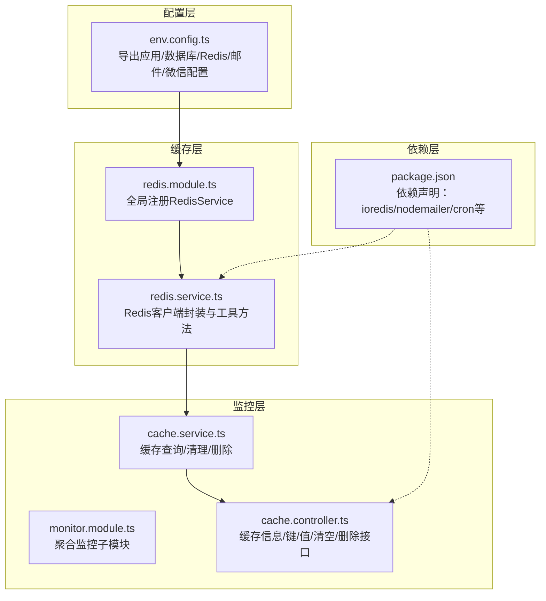
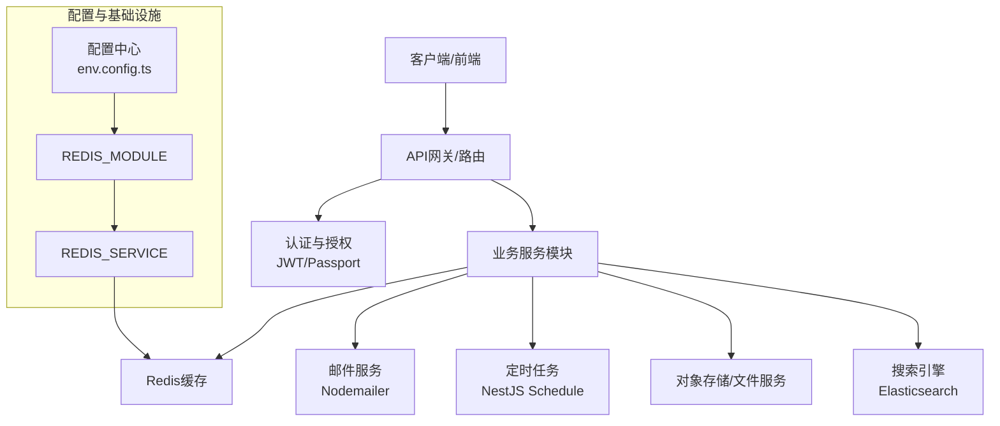
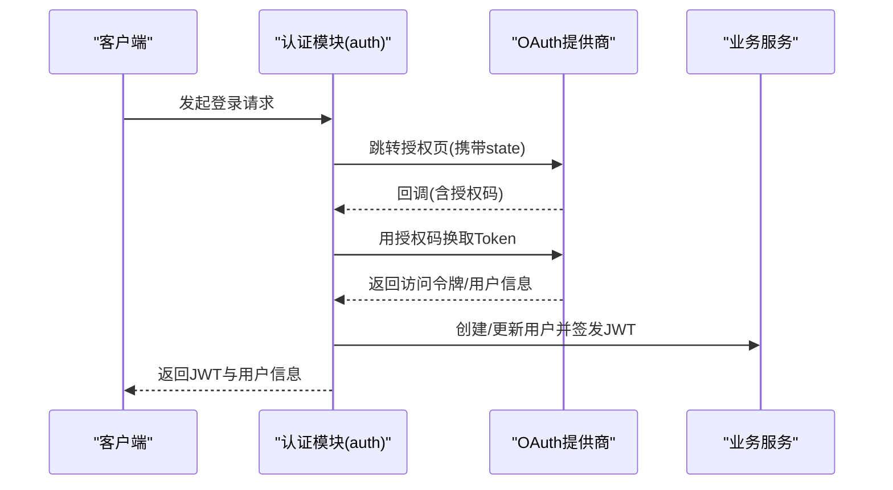
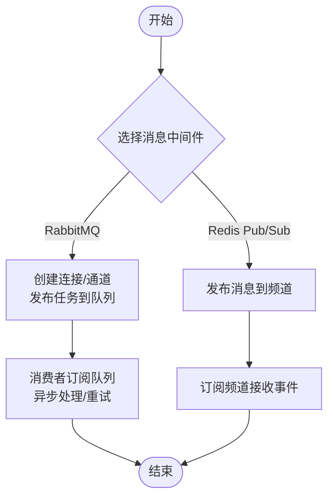
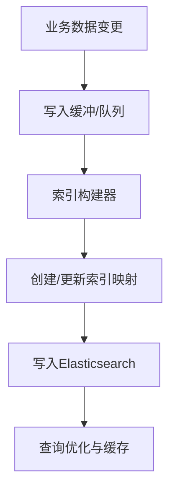
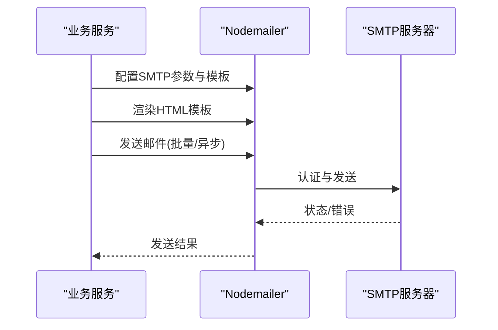
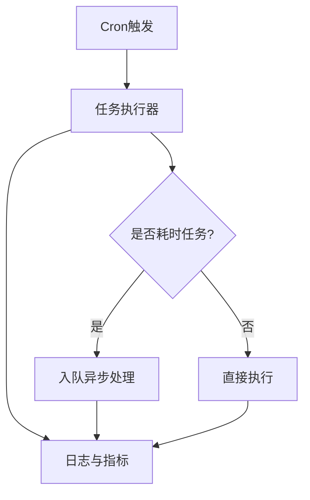
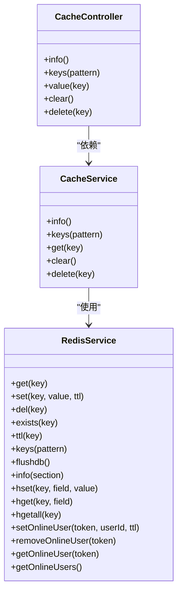
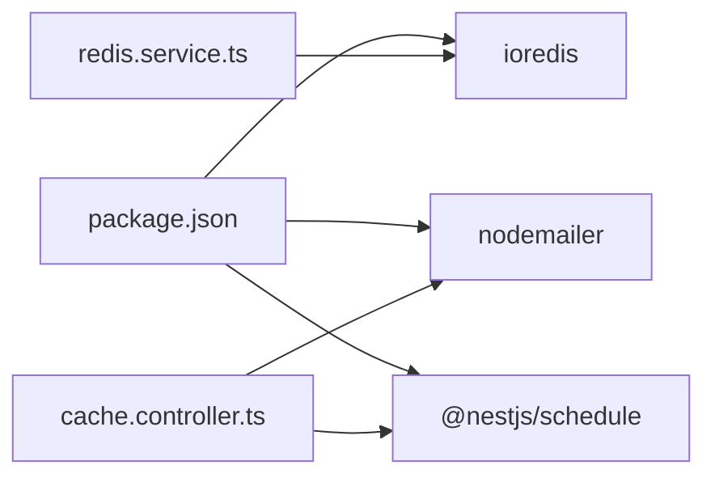

# 第三方服务集成

<cite>
**本文引用的文件**
- [apps/backend/src/config/env.config.ts](file://apps/backend/src/config/env.config.ts)
- [apps/backend/src/cache/redis.module.ts](file://apps/backend/src/cache/redis.module.ts)
- [apps/backend/src/cache/redis.service.ts](file://apps/backend/src/cache/redis.service.ts)
- [apps/backend/src/modules/monitor/cache/cache.service.ts](file://apps/backend/src/modules/monitor/cache/cache.service.ts)
- [apps/backend/src/modules/monitor/cache/cache.controller.ts](file://apps/backend/src/modules/monitor/cache/cache.controller.ts)
- [apps/backend/src/modules/monitor/monitor.module.ts](file://apps/backend/src/modules/monitor/monitor.module.ts)
- [apps/backend/package.json](file://apps/backend/package.json)
</cite>

## 目录
1. [简介](#简介)
2. [项目结构](#项目结构)
3. [核心组件](#核心组件)
4. [架构总览](#架构总览)
5. [详细组件分析](#详细组件分析)
6. [依赖关系分析](#依赖关系分析)
7. [性能考虑](#性能考虑)
8. [故障排查指南](#故障排查指南)
9. [结论](#结论)
10. [附录](#附录)

## 简介
本指南聚焦于后端应用中已实现与可扩展的第三方服务集成，涵盖以下主题：
- OAuth认证集成：基于现有JWT与Passport体系，提供OAuth客户端接入与用户信息获取的实施路径
- 消息队列集成：结合项目对任务调度的依赖，给出RabbitMQ与Redis Pub/Sub的对接建议
- 搜索引擎集成：基于文件存储模块，提供Elasticsearch索引与搜索的对接思路
- 邮件服务集成：基于Nodemailer与现有配置体系，提供SMTP配置、模板渲染与批量发送方案
- 定时任务集成：基于NestJS Schedule，提供Cron表达式、任务调度与执行监控
- 缓存服务集成：基于Redis模块，提供集群配置、缓存策略与性能优化实践

## 项目结构
后端采用NestJS架构，第三方服务集成主要通过环境变量配置与模块化服务实现。关键位置如下：
- 配置层：集中于配置模块，读取环境变量并导出各服务配置对象
- 缓存层：Redis模块与服务封装，提供键值与集合操作、在线用户管理等能力
- 监控层：缓存监控控制器与服务，暴露Redis信息查询与清理接口
- 依赖层：package.json声明了Redis、Nodemailer、Cron等第三方依赖

**图表来源**
- [apps/backend/src/config/env.config.ts:1-47](file://apps/backend/src/config/env.config.ts#L1-L47)
- [apps/backend/src/cache/redis.module.ts:1-9](file://apps/backend/src/cache/redis.module.ts#L1-L9)
- [apps/backend/src/cache/redis.service.ts:1-128](file://apps/backend/src/cache/redis.service.ts#L1-L128)
- [apps/backend/src/modules/monitor/cache/cache.service.ts:1-29](file://apps/backend/src/modules/monitor/cache/cache.service.ts#L1-L29)
- [apps/backend/src/modules/monitor/cache/cache.controller.ts:1-50](file://apps/backend/src/modules/monitor/cache/cache.controller.ts#L1-L50)
- [apps/backend/src/modules/monitor/monitor.module.ts:1-11](file://apps/backend/src/modules/monitor/monitor.module.ts#L1-L11)
- [apps/backend/package.json:16-41](file://apps/backend/package.json#L16-L41)

**章节来源**
- [apps/backend/src/config/env.config.ts:1-47](file://apps/backend/src/config/env.config.ts#L1-L47)
- [apps/backend/src/cache/redis.module.ts:1-9](file://apps/backend/src/cache/redis.module.ts#L1-L9)
- [apps/backend/src/cache/redis.service.ts:1-128](file://apps/backend/src/cache/redis.service.ts#L1-L128)
- [apps/backend/src/modules/monitor/cache/cache.service.ts:1-29](file://apps/backend/src/modules/monitor/cache/cache.service.ts#L1-L29)
- [apps/backend/src/modules/monitor/cache/cache.controller.ts:1-50](file://apps/backend/src/modules/monitor/cache/cache.controller.ts#L1-L50)
- [apps/backend/src/modules/monitor/monitor.module.ts:1-11](file://apps/backend/src/modules/monitor/monitor.module.ts#L1-L11)
- [apps/backend/package.json:16-41](file://apps/backend/package.json#L16-L41)

## 核心组件
- 配置中心（env.config.ts）
  - 提供应用、数据库、Redis、邮件、微信等配置的统一读取与导出
  - 建议在新服务接入时，遵循该模式新增配置段落，并在模块中注入使用
- Redis模块与服务
  - 全局注册RedisService，提供连接建立、错误监听、基础KV与Hash操作、TTL与键扫描、在线用户管理等
  - 为缓存、会话、限流、在线状态等场景提供基础设施
- 缓存监控服务与控制器
  - 通过CacheService封装RedisService，提供info、keys、get、clear、delete等能力
  - CacheController暴露REST接口，配合鉴权与权限守卫，便于运维与调试

**章节来源**
- [apps/backend/src/config/env.config.ts:28-41](file://apps/backend/src/config/env.config.ts#L28-L41)
- [apps/backend/src/cache/redis.module.ts:1-9](file://apps/backend/src/cache/redis.module.ts#L1-L9)
- [apps/backend/src/cache/redis.service.ts:1-128](file://apps/backend/src/cache/redis.service.ts#L1-L128)
- [apps/backend/src/modules/monitor/cache/cache.service.ts:1-29](file://apps/backend/src/modules/monitor/cache/cache.service.ts#L1-L29)
- [apps/backend/src/modules/monitor/cache/cache.controller.ts:1-50](file://apps/backend/src/modules/monitor/cache/cache.controller.ts#L1-L50)

## 架构总览
下图展示了第三方服务集成在系统中的位置与交互关系：

**图表来源**
- [apps/backend/src/config/env.config.ts:1-47](file://apps/backend/src/config/env.config.ts#L1-L47)
- [apps/backend/src/cache/redis.module.ts:1-9](file://apps/backend/src/cache/redis.module.ts#L1-L9)
- [apps/backend/src/cache/redis.service.ts:1-128](file://apps/backend/src/cache/redis.service.ts#L1-L128)
- [apps/backend/package.json:23-34](file://apps/backend/package.json#L23-L34)

## 详细组件分析

### OAuth认证集成
- 现状与能力
  - 已具备JWT与Passport集成，可作为OAuth服务的认证基座
  - 可在auth模块中扩展OAuth策略（如GitHub、Google等），通过Strategy类完成授权码交换与用户信息拉取
- 实施步骤
  1) 在配置中心新增OAuth提供商参数（clientId、clientSecret、回调地址等）
  2) 在auth模块中新增对应Strategy，完成授权码换取Token与用户信息获取
  3) 将用户信息映射为内部用户模型，签发JWT并返回给前端
  4) 使用JwtAuthGuard保护受控接口
- 关键点
  - 回调安全：严格校验state与同源域名
  - 用户信息标准化：统一字段映射与去重逻辑
  - Token刷新与失效处理：结合Redis存储与过期策略

**图表来源**
- [apps/backend/src/auth/auth.module.ts](file://apps/backend/src/auth/auth.module.ts)
- [apps/backend/src/auth/auth.service.ts](file://apps/backend/src/auth/auth.service.ts)
- [apps/backend/src/auth/jwt.strategy.ts](file://apps/backend/src/auth/jwt.strategy.ts)
- [apps/backend/src/auth/guards.ts](file://apps/backend/src/auth/guards.ts)

**章节来源**
- [apps/backend/src/auth/auth.module.ts](file://apps/backend/src/auth/auth.module.ts)
- [apps/backend/src/auth/auth.service.ts](file://apps/backend/src/auth/auth.service.ts)
- [apps/backend/src/auth/jwt.strategy.ts](file://apps/backend/src/auth/jwt.strategy.ts)
- [apps/backend/src/auth/guards.ts](file://apps/backend/src/auth/guards.ts)

### 消息队列集成（RabbitMQ/Redis Pub/Sub）
- 现状与能力
  - 项目未直接引入RabbitMQ或Redis Pub/Sub客户端
  - 可基于现有Redis模块与Schedule模块进行扩展
- 推荐方案
  1) RabbitMQ
     - 引入amqp库，创建连接工厂与通道
     - Producer：将任务序列化后发布到队列
     - Consumer：订阅队列并异步处理，失败重试与死信队列
  2) Redis Pub/Sub
     - 利用RedisService的订阅/发布能力，适合轻量事件通知
     - 注意：Pub/Sub无持久化，需结合其他手段保证可靠性
- 关键点
  - 幂等性：消费者需实现幂等处理
  - 监控：记录投递/消费统计与异常告警

**图表来源**
- [apps/backend/src/cache/redis.service.ts:1-128](file://apps/backend/src/cache/redis.service.ts#L1-L128)
- [apps/backend/package.json:33-34](file://apps/backend/package.json#L33-L34)

**章节来源**
- [apps/backend/src/cache/redis.service.ts:1-128](file://apps/backend/src/cache/redis.service.ts#L1-L128)
- [apps/backend/package.json:33-34](file://apps/backend/package.json#L33-L34)

### 搜索引擎集成（Elasticsearch）
- 现状与能力
  - 项目包含多种对象存储提供商适配器，可作为数据源参考
  - 未直接集成Elasticsearch
- 推荐方案
  1) 数据同步
     - 增量/全量同步：基于数据库变更或定时任务生成索引
     - 写入缓冲：使用消息队列削峰填谷
  2) 索引管理
     - 动态映射与别名切换，支持滚动索引
     - 分片与副本策略：根据数据规模与查询负载调整
  3) 搜索优化
     - 查询DSL优化、高亮与聚合
     - 结果缓存与冷热分层
- 关键点
  - 写入一致性：ES写入与主库事务协调
  - 性能调优：分词器、映射、查询缓存与硬件资源

**图表来源**
- [apps/backend/src/modules/file/storage/storage-provider.factory.ts](file://apps/backend/src/modules/file/storage/storage-provider.factory.ts)
- [apps/backend/src/modules/file/storage/storage.types.ts](file://apps/backend/src/modules/file/storage/storage.types.ts)

**章节来源**
- [apps/backend/src/modules/file/storage/storage-provider.factory.ts](file://apps/backend/src/modules/file/storage/storage-provider.factory.ts)
- [apps/backend/src/modules/file/storage/storage.types.ts](file://apps/backend/src/modules/file/storage/storage.types.ts)

### 邮件服务集成（SMTP/Nodemailer）
- 现状与能力
  - 已在依赖中声明Nodemailer，配置中心提供邮件SMTP参数
  - 可直接在服务中注入配置并使用Nodemailer发送邮件
- 实施要点
  1) SMTP配置
     - 从env.config.ts读取host/port/user/pass/from
     - 支持TLS/STARTTLS与认证方式
  2) 模板渲染
     - 使用模板引擎（如EJS/Pug）渲染HTML
     - 支持多语言与动态内容
  3) 批量发送
     - 使用队列异步发送，避免阻塞请求
     - 失败重试与失败列表记录
- 关键点
  - 发送限额与频率控制：结合Redis限流
  - 安全：敏感信息加密存储与传输

**图表来源**
- [apps/backend/src/config/env.config.ts:35-41](file://apps/backend/src/config/env.config.ts#L35-L41)
- [apps/backend/package.json](file://apps/backend/package.json#L34)

**章节来源**
- [apps/backend/src/config/env.config.ts:35-41](file://apps/backend/src/config/env.config.ts#L35-L41)
- [apps/backend/package.json](file://apps/backend/package.json#L34)

### 定时任务集成（Cron/Schedule）
- 现状与能力
  - 依赖中声明NestJS Schedule，可用于Cron任务调度
- 实施要点
  1) Cron表达式
     - 使用@Cron装饰器定义周期任务
     - 合理拆分高频与低频任务
  2) 任务调度
     - 任务类中实现具体逻辑，必要时注入服务
     - 对耗时任务使用队列异步化
  3) 执行监控
     - 记录任务开始/结束时间与异常
     - 集成告警与日志审计
- 关键点
  - 时区与夏令时：统一使用UTC并转换
  - 幂等与锁：分布式锁防止重复执行

**图表来源**
- [apps/backend/package.json](file://apps/backend/package.json#L23)

**章节来源**
- [apps/backend/package.json](file://apps/backend/package.json#L23)

### 缓存服务集成（Redis）
- 现状与能力
  - Redis模块已全局注册，提供连接、KV、Hash、集合、在线用户管理等方法
  - 监控模块提供info/keys/get/clear/delete等接口
- 实施要点
  1) 集群配置
     - 使用哨兵/Cluster模式提升可用性
     - 连接池与超时设置
  2) 缓存策略
     - LRU/LFU淘汰策略，合理设置TTL
     - 多级缓存：本地缓存+Redis
  3) 性能优化
     - 命中率监控与热点键识别
     - 批量命令与Pipeline
- 关键点
  - 键命名规范：避免冲突与便于清理
  - 容灾：备份与恢复演练

**图表来源**
- [apps/backend/src/cache/redis.service.ts:1-128](file://apps/backend/src/cache/redis.service.ts#L1-L128)
- [apps/backend/src/modules/monitor/cache/cache.service.ts:1-29](file://apps/backend/src/modules/monitor/cache/cache.service.ts#L1-L29)
- [apps/backend/src/modules/monitor/cache/cache.controller.ts:1-50](file://apps/backend/src/modules/monitor/cache/cache.controller.ts#L1-L50)

**章节来源**
- [apps/backend/src/cache/redis.module.ts:1-9](file://apps/backend/src/cache/redis.module.ts#L1-L9)
- [apps/backend/src/cache/redis.service.ts:1-128](file://apps/backend/src/cache/redis.service.ts#L1-L128)
- [apps/backend/src/modules/monitor/cache/cache.service.ts:1-29](file://apps/backend/src/modules/monitor/cache/cache.service.ts#L1-L29)
- [apps/backend/src/modules/monitor/cache/cache.controller.ts:1-50](file://apps/backend/src/modules/monitor/cache/cache.controller.ts#L1-L50)
- [apps/backend/src/modules/monitor/monitor.module.ts:1-11](file://apps/backend/src/modules/monitor/monitor.module.ts#L1-L11)

## 依赖关系分析
- 组件耦合
  - RedisService为底层基础设施，被CacheService与监控模块广泛使用
  - CacheController通过权限守卫与鉴权保护缓存操作
- 外部依赖
  - ioredis：Redis客户端
  - nodemailer：邮件发送
  - @nestjs/schedule：定时任务
  - 其他：对象存储SDK用于文件上传

**图表来源**
- [apps/backend/package.json:16-41](file://apps/backend/package.json#L16-L41)
- [apps/backend/src/cache/redis.service.ts:1-128](file://apps/backend/src/cache/redis.service.ts#L1-L128)
- [apps/backend/src/modules/monitor/cache/cache.controller.ts:1-50](file://apps/backend/src/modules/monitor/cache/cache.controller.ts#L1-L50)

**章节来源**
- [apps/backend/package.json:16-41](file://apps/backend/package.json#L16-L41)

## 性能考虑
- Redis
  - 合理设置TTL与淘汰策略；监控内存与命中率
  - 使用Pipeline与批量命令降低RTT
- 邮件
  - 异步发送与限流；模板预编译减少CPU开销
- 定时任务
  - 任务拆分与并发度控制；异常重试与熔断
- 搜索
  - 分片与副本平衡查询与写入；查询缓存与冷热分离

## 故障排查指南
- Redis连接问题
  - 检查host/port/password/db配置是否正确
  - 观察连接事件与错误日志，确认网络连通性
- 缓存监控
  - 使用缓存控制器的info/keys/value接口快速定位问题
  - 清理与删除接口用于临时恢复
- 邮件发送失败
  - 校验SMTP参数与认证信息
  - 查看发送日志与失败队列
- 定时任务异常
  - 检查Cron表达式与时区设置
  - 记录任务执行日志与告警

**章节来源**
- [apps/backend/src/cache/redis.service.ts:16-23](file://apps/backend/src/cache/redis.service.ts#L16-L23)
- [apps/backend/src/modules/monitor/cache/cache.controller.ts:13-48](file://apps/backend/src/modules/monitor/cache/cache.controller.ts#L13-L48)

## 结论
本项目已具备完善的配置中心与Redis基础设施，为OAuth、消息队列、搜索引擎、邮件与定时任务等第三方服务集成提供了良好基础。建议按本文路径扩展相应模块，并在生产环境中完善监控、限流与容灾策略。

## 附录
- 环境变量建议
  - Redis：REDIS_HOST/REDIS_PORT/REDIS_PASSWORD/REDIS_DB
  - 邮件：MAIL_HOST/MAIL_PORT/MAIL_USER/MAIL_PASS/MAIL_FROM
  - OAuth：WECHAT_APPID/WECHAT_SECRET（可按需扩展其他提供商）
- 最佳实践
  - 所有外部配置集中于配置中心，模块内仅消费
  - 任务与IO密集型操作尽量异步化
  - 为关键路径增加可观测性与告警