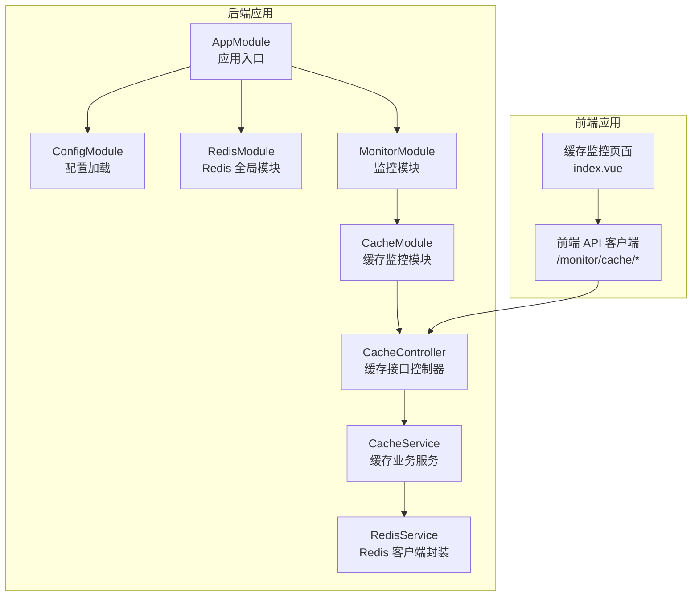
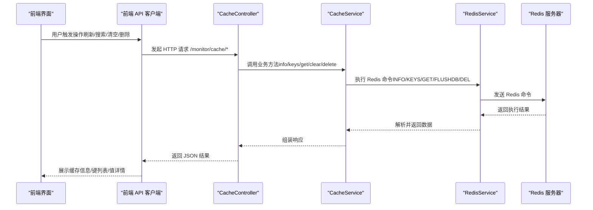
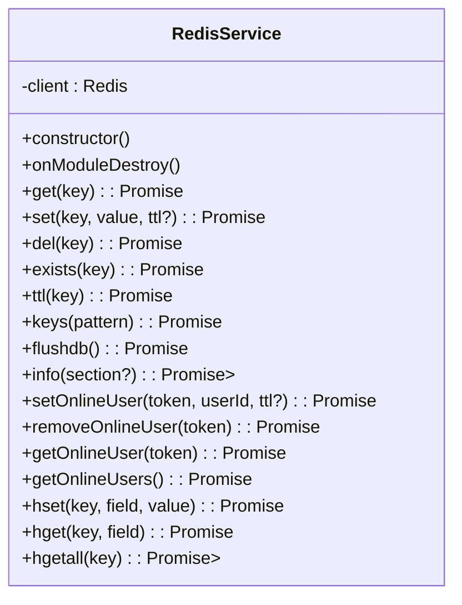
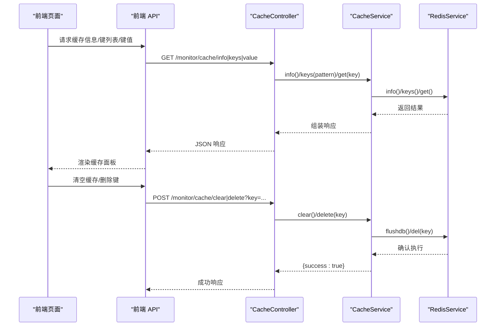
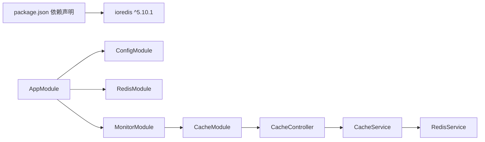

# 缓存服务集成

<cite>
**本文档引用的文件**
- [apps/backend/src/cache/redis.module.ts](file://apps/backend/src/cache/redis.module.ts)
- [apps/backend/src/cache/redis.service.ts](file://apps/backend/src/cache/redis.service.ts)
- [apps/backend/src/modules/monitor/cache/cache.module.ts](file://apps/backend/src/modules/monitor/cache/cache.module.ts)
- [apps/backend/src/modules/monitor/cache/cache.controller.ts](file://apps/backend/src/modules/monitor/cache/cache.controller.ts)
- [apps/backend/src/modules/monitor/cache/cache.service.ts](file://apps/backend/src/modules/monitor/cache/cache.service.ts)
- [apps/backend/src/config/env.config.ts](file://apps/backend/src/config/env.config.ts)
- [apps/backend/src/app.module.ts](file://apps/backend/src/app.module.ts)
- [apps/backend/src/modules/system/config/config.service.ts](file://apps/backend/src/modules/system/config/config.service.ts)
- [apps/backend/src/auth/auth.service.ts](file://apps/backend/src/auth/auth.service.ts)
- [apps/backend/package.json](file://apps/backend/package.json)
- [apps/vben-admin/apps/web-antd/src/api/monitor/cache.ts](file://apps/vben-admin/apps/web-antd/src/api/monitor/cache.ts)
- [apps/fronted/src/views/monitor/cache/index.vue](file://apps/fronted/src/views/monitor/cache/index.vue)
</cite>

## 目录
1. [简介](#简介)
2. [项目结构](#项目结构)
3. [核心组件](#核心组件)
4. [架构概览](#架构概览)
5. [详细组件分析](#详细组件分析)
6. [依赖关系分析](#依赖关系分析)
7. [性能考虑](#性能考虑)
8. [故障排查指南](#故障排查指南)
9. [结论](#结论)
10. [附录](#附录)

## 简介
本文件面向缓存服务集成的专业技术文档，围绕项目中基于 Redis 的缓存实现进行系统性梳理与深化。内容涵盖：
- Redis 集群配置与部署（主从复制、哨兵模式、集群分片策略）
- 缓存策略设计与实现（LRU 淘汰、TTL 设置、缓存穿透防护）
- 分布式缓存一致性保障（缓存更新策略、失效同步、数据一致性检查）
- 完整缓存 API 实现示例（键值操作、集合操作、哈希操作）
- 性能优化技术（连接池配置、序列化优化、内存管理）
- 监控与运维（性能指标采集、故障诊断、容量规划）

注：当前仓库实现为单实例 Redis 连接，未包含 Redis 集群/哨兵/分片的原生配置。本文在“Redis 集群配置与部署”部分提供通用架构建议与最佳实践，便于后续扩展到生产级集群部署。

## 项目结构
后端采用 NestJS 架构，缓存模块以全局模块形式注入，监控模块提供缓存信息查询与清理能力；前端通过 API 接口展示缓存状态并支持清空与删除操作。

图表来源
- [apps/backend/src/app.module.ts:18-39](file://apps/backend/src/app.module.ts#L18-L39)
- [apps/backend/src/cache/redis.module.ts:4-9](file://apps/backend/src/cache/redis.module.ts#L4-L9)
- [apps/backend/src/modules/monitor/cache/cache.module.ts:5-10](file://apps/backend/src/modules/monitor/cache/cache.module.ts#L5-L10)
- [apps/backend/src/modules/monitor/cache/cache.controller.ts:8-49](file://apps/backend/src/modules/monitor/cache/cache.controller.ts#L8-L49)
- [apps/backend/src/modules/monitor/cache/cache.service.ts:5-29](file://apps/backend/src/modules/monitor/cache/cache.service.ts#L5-L29)
- [apps/backend/src/cache/redis.service.ts:5-128](file://apps/backend/src/cache/redis.service.ts#L5-L128)

章节来源
- [apps/backend/src/app.module.ts:18-39](file://apps/backend/src/app.module.ts#L18-L39)
- [apps/backend/src/cache/redis.module.ts:4-9](file://apps/backend/src/cache/redis.module.ts#L4-L9)
- [apps/backend/src/modules/monitor/cache/cache.module.ts:5-10](file://apps/backend/src/modules/monitor/cache/cache.module.ts#L5-L10)
- [apps/backend/src/modules/monitor/cache/cache.controller.ts:8-49](file://apps/backend/src/modules/monitor/cache/cache.controller.ts#L8-L49)
- [apps/backend/src/modules/monitor/cache/cache.service.ts:5-29](file://apps/backend/src/modules/monitor/cache/cache.service.ts#L5-L29)
- [apps/backend/src/cache/redis.service.ts:5-128](file://apps/backend/src/cache/redis.service.ts#L5-L128)

## 核心组件
- RedisModule：全局注册 RedisService，向整个应用提供统一的 Redis 客户端访问入口。
- RedisService：对 ioredis 客户端进行封装，提供键值、集合、哈希等常用操作，并内置在线用户管理辅助方法。
- CacheModule/CacheController/CacheService：监控模块的缓存接口，提供缓存信息查询、键列表检索、键值读取、清空数据库、按键删除等能力。
- 配置模块：通过环境变量加载 Redis 连接参数，支持主机、端口、密码、数据库索引等配置项。

章节来源
- [apps/backend/src/cache/redis.module.ts:4-9](file://apps/backend/src/cache/redis.module.ts#L4-L9)
- [apps/backend/src/cache/redis.service.ts:5-128](file://apps/backend/src/cache/redis.service.ts#L5-L128)
- [apps/backend/src/modules/monitor/cache/cache.controller.ts:8-49](file://apps/backend/src/modules/monitor/cache/cache.controller.ts#L8-L49)
- [apps/backend/src/modules/monitor/cache/cache.service.ts:5-29](file://apps/backend/src/modules/monitor/cache/cache.service.ts#L5-L29)
- [apps/backend/src/config/env.config.ts:28-33](file://apps/backend/src/config/env.config.ts#L28-L33)

## 架构概览
下图展示了缓存服务在系统中的位置与交互流程，包括请求链路、数据流向与错误处理要点。

图表来源
- [apps/backend/src/modules/monitor/cache/cache.controller.ts:13-48](file://apps/backend/src/modules/monitor/cache/cache.controller.ts#L13-L48)
- [apps/backend/src/modules/monitor/cache/cache.service.ts:8-28](file://apps/backend/src/modules/monitor/cache/cache.service.ts#L8-L28)
- [apps/backend/src/cache/redis.service.ts:70-80](file://apps/backend/src/cache/redis.service.ts#L70-L80)
- [apps/vben-admin/apps/web-antd/src/api/monitor/cache.ts:16-34](file://apps/vben-admin/apps/web-antd/src/api/monitor/cache.ts#L16-L34)

## 详细组件分析

### RedisService 组件分析
RedisService 封装了 ioredis 客户端，提供以下能力：
- 基础键值操作：get/set/del/exists/ttl/keys/flushdb
- 信息查询：info（解析 Redis INFO 输出）
- 在线用户管理：基于集合维护在线令牌与用户映射
- 哈希操作：hset/hget/hgetall（自动 JSON 序列化/反序列化）

图表来源
- [apps/backend/src/cache/redis.service.ts:5-128](file://apps/backend/src/cache/redis.service.ts#L5-L128)

章节来源
- [apps/backend/src/cache/redis.service.ts:29-128](file://apps/backend/src/cache/redis.service.ts#L29-L128)

### 缓存监控模块分析
缓存监控模块提供统一的缓存管理接口，供前端调用与权限控制。

图表来源
- [apps/backend/src/modules/monitor/cache/cache.controller.ts:13-48](file://apps/backend/src/modules/monitor/cache/cache.controller.ts#L13-L48)
- [apps/backend/src/modules/monitor/cache/cache.service.ts:8-28](file://apps/backend/src/modules/monitor/cache/cache.service.ts#L8-L28)
- [apps/vben-admin/apps/web-antd/src/api/monitor/cache.ts:16-34](file://apps/vben-admin/apps/web-antd/src/api/monitor/cache.ts#L16-L34)

章节来源
- [apps/backend/src/modules/monitor/cache/cache.controller.ts:13-48](file://apps/backend/src/modules/monitor/cache/cache.controller.ts#L13-L48)
- [apps/backend/src/modules/monitor/cache/cache.service.ts:8-28](file://apps/backend/src/modules/monitor/cache/cache.service.ts#L8-L28)
- [apps/vben-admin/apps/web-antd/src/api/monitor/cache.ts:16-34](file://apps/vben-admin/apps/web-antd/src/api/monitor/cache.ts#L16-L34)

### 缓存使用场景示例
- 系统配置缓存：系统配置变更时写入 Redis，键前缀为 config:*，便于集中管理与快速读取。
- 登录验证码缓存：生成验证码时写入 Redis 并设置过期时间，校验通过后删除键，避免重复使用。

章节来源
- [apps/backend/src/modules/system/config/config.service.ts:40-53](file://apps/backend/src/modules/system/config/config.service.ts#L40-L53)
- [apps/backend/src/auth/auth.service.ts:116](file://apps/backend/src/auth/auth.service.ts#L116)
- [apps/backend/src/auth/auth.service.ts:125](file://apps/backend/src/auth/auth.service.ts#L125)

## 依赖关系分析
- Redis 客户端：ioredis 版本 5.10.1，提供高性能异步客户端与命令集支持。
- 应用模块：AppModule 导入 ConfigModule、RedisModule、MonitorModule 等，形成清晰的模块边界。
- 监控模块：CacheModule 导出 CacheService，供其他模块复用。

图表来源
- [apps/backend/package.json:33](file://apps/backend/package.json#L33)
- [apps/backend/src/app.module.ts:18-39](file://apps/backend/src/app.module.ts#L18-L39)
- [apps/backend/src/modules/monitor/cache/cache.module.ts:5-10](file://apps/backend/src/modules/monitor/cache/cache.module.ts#L5-L10)

章节来源
- [apps/backend/package.json:33](file://apps/backend/package.json#L33)
- [apps/backend/src/app.module.ts:18-39](file://apps/backend/src/app.module.ts#L18-L39)

## 性能考虑
- 连接池与并发：ioredis 默认具备连接池与队列机制，建议结合应用并发量评估最大连接数与超时配置。
- 序列化优化：RedisService 对非字符串类型进行 JSON 序列化，建议在高频写入场景中优先使用字符串或二进制格式，减少序列化开销。
- 内存管理：合理设置 TTL，避免无界增长；定期清理过期键；利用 Redis INFO 中的内存指标进行容量预警。
- 命令选择：批量操作可使用流水线（pipeline）降低 RTT；对于热点键可考虑使用 EX/PX/XEX 等原子设置 TTL 的命令。
- 网络与部署：将 Redis 与应用部署在同一可用区，缩短网络延迟；生产环境建议使用集群/哨兵方案提升可用性。

## 故障排查指南
- 连接失败：检查 REDIS_HOST/REDIS_PORT/REDIS_PASSWORD/REDIS_DB 环境变量是否正确；查看 RedisService 的连接事件日志。
- 命令异常：通过 CacheController 的 info/keys/value 接口验证 Redis 可用性；确认权限与网络连通性。
- 数据不一致：核对 TTL 设置与业务删除逻辑；检查是否存在并发写入导致的竞态条件。
- 前端无响应：确认前端 API 客户端路径与权限校验（JwtAuthGuard/PermissionGuard）；检查路由与拦截器配置。

章节来源
- [apps/backend/src/cache/redis.service.ts:16-22](file://apps/backend/src/cache/redis.service.ts#L16-L22)
- [apps/backend/src/modules/monitor/cache/cache.controller.ts:13-48](file://apps/backend/src/modules/monitor/cache/cache.controller.ts#L13-L48)
- [apps/vben-admin/apps/web-antd/src/api/monitor/cache.ts:16-34](file://apps/vben-admin/apps/web-antd/src/api/monitor/cache.ts#L16-L34)

## 结论
当前项目已实现基础的 Redis 缓存能力与监控接口，满足日常开发与运维需求。若需支撑高并发与高可用场景，建议引入 Redis 集群/哨兵/分片架构，并配套完善缓存策略（TTL、淘汰、穿透防护）、一致性保障与性能优化方案。同时，持续监控关键指标并制定容量规划，确保系统稳定运行。

## 附录

### Redis 集群配置与部署（架构建议）
- 主从复制：一主多从，提升读扩展与容灾能力；建议开启持久化与主从同步参数调优。
- 哨兵模式：部署多个哨兵节点，实现自动故障转移与主节点监控。
- 集群分片策略：根据键空间分布选择合适的哈希槽分配；避免热点键集中在同一节点。
- 客户端连接：在应用侧实现连接池与重试机制；对跨节点操作使用流水线优化。

### 缓存策略设计与实现
- LRU 淘汰：通过 maxmemory 策略（如 volatile-lru/allkeys-lru）结合内存阈值限制。
- TTL 设置：针对不同业务设置合理的过期时间；对临时数据（验证码）采用短 TTL。
- 缓存穿透防护：对空值也设置短 TTL；对非法键进行过滤与限流。

### 分布式缓存一致性
- 缓存更新策略：先更新数据库，再更新/删除缓存（Cache-Aside）；或采用写扩散至缓存。
- 失效同步：使用发布订阅或消息队列通知各节点失效对应键。
- 数据一致性检查：定期比对缓存与数据库关键字段；对差异进行修复与告警。

### 缓存 API 实现示例（方法清单）
- 键值操作：get、set（含 TTL）、del、exists、ttl、keys、flushdb
- 集合操作：sadd、srem、smembers（用于在线用户集合管理）
- 哈希操作：hset、hget、hgetall（用于复杂对象存储与读取）
- 信息查询：info（解析 Redis INFO 输出）

章节来源
- [apps/backend/src/cache/redis.service.ts:29-128](file://apps/backend/src/cache/redis.service.ts#L29-L128)
- [apps/backend/src/modules/monitor/cache/cache.service.ts:8-28](file://apps/backend/src/modules/monitor/cache/cache.service.ts#L8-L28)

### 监控与运维
- 性能指标：used_memory、connected_clients、instantaneous_ops_per_sec、keyspace_hits/keyspace_misses 等。
- 故障诊断：通过 info 接口定位慢查询、内存峰值、客户端连接数异常。
- 容量规划：基于 used_memory_human、maxmemory 与业务增长趋势制定扩容计划。

章节来源
- [apps/backend/src/cache/redis.service.ts:70-80](file://apps/backend/src/cache/redis.service.ts#L70-L80)
- [apps/vben-admin/apps/web-antd/src/api/monitor/cache.ts:3-14](file://apps/vben-admin/apps/web-antd/src/api/monitor/cache.ts#L3-L14)
- [apps/fronted/src/views/monitor/cache/index.vue:17-32](file://apps/fronted/src/views/monitor/cache/index.vue#L17-L32)