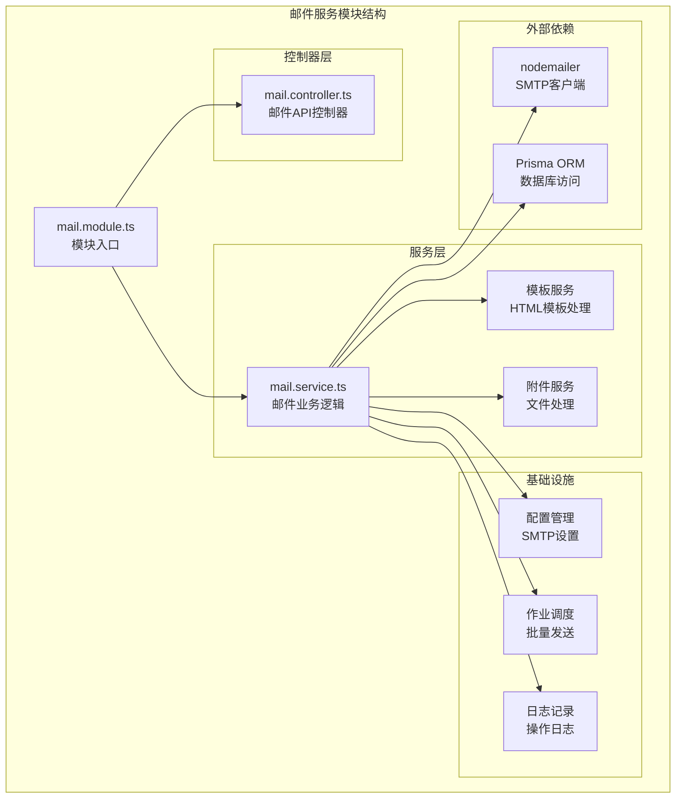
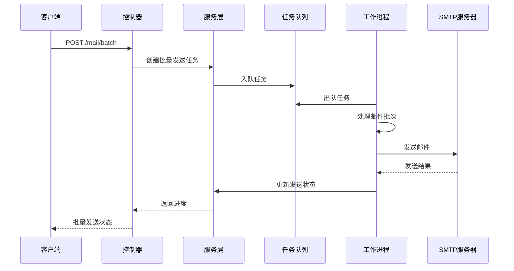
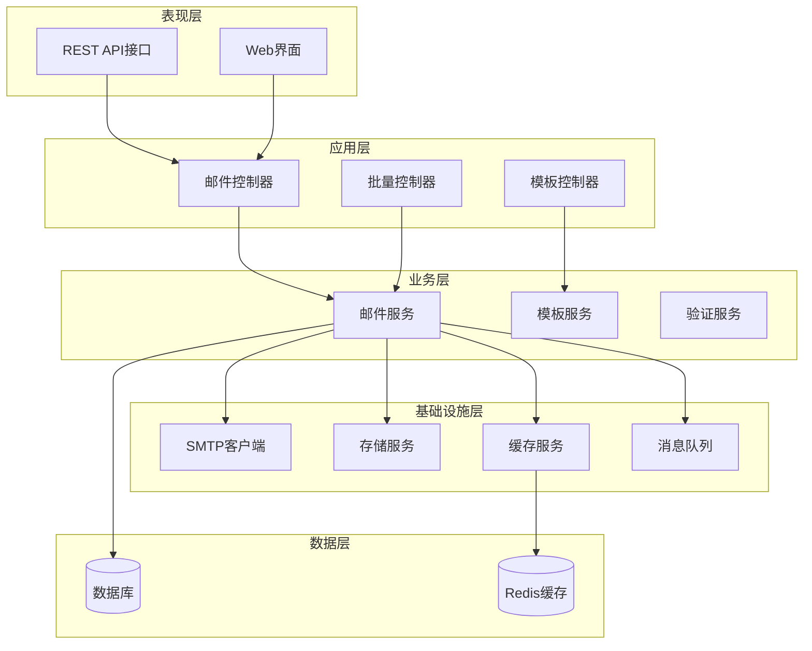
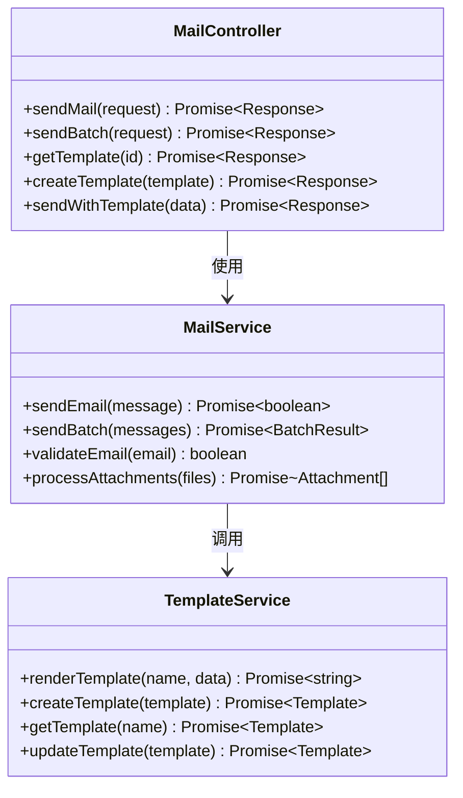
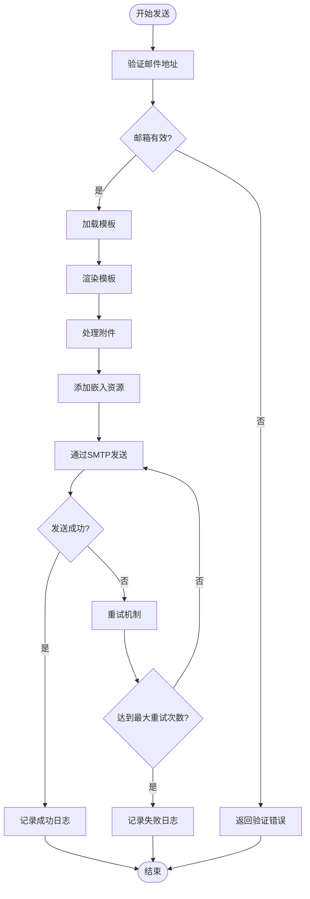
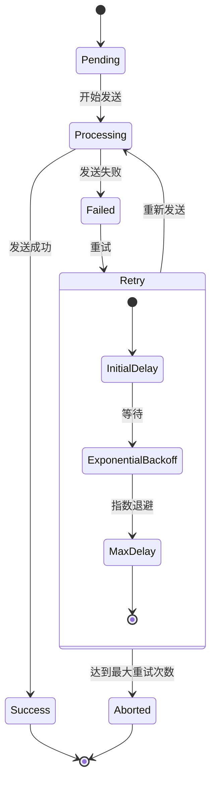
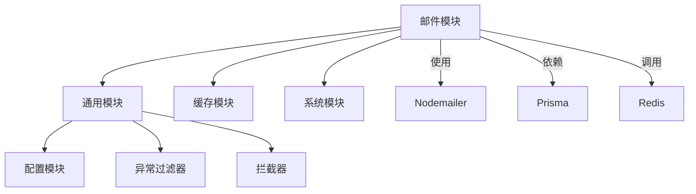
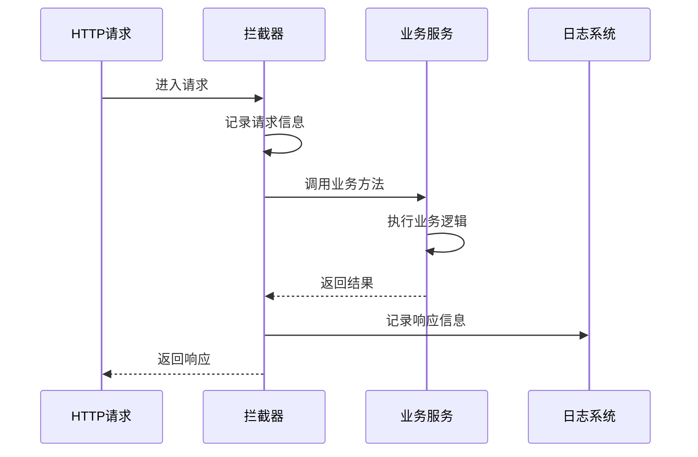

# 邮件服务集成

<cite>
**本文档引用的文件**
- [env.config.ts](file://apps/backend/src/config/env.config.ts)
- [package.json](file://apps/backend/package.json)
- [mail.module.ts](file://apps/backend/src/modules/mail/mail.module.ts)
- [mail.service.ts](file://apps/backend/src/modules/mail/mail.service.ts)
- [mail.controller.ts](file://apps/backend/src/modules/mail/mail.controller.ts)
- [mail.job.ts](file://apps/backend/src/modules/job/mail.job.ts)
- [oper-log.interceptor.ts](file://apps/backend/src/common/oper-log.interceptor.ts)
- [exception.filter.ts](file://apps/backend/src/common/exception.filter.ts)
- [ApiResponse](file://apps/backend/src/common/api-response.ts)
</cite>

## 目录
1. [简介](#简介)
2. [项目结构](#项目结构)
3. [核心组件](#核心组件)
4. [架构概览](#架构概览)
5. [详细组件分析](#详细组件分析)
6. [依赖关系分析](#依赖关系分析)
7. [性能考虑](#性能考虑)
8. [故障排除指南](#故障排除指南)
9. [结论](#结论)

## 简介

本指南详细介绍了基于 NestJS 的邮件服务集成方案，涵盖 SMTP 协议配置、邮件模板系统、批量发送优化、API 实现以及安全配置等关键方面。该系统基于 nodemailer 库构建，提供了完整的邮件发送能力，包括 HTML 模板渲染、附件处理、嵌入资源和邮件跟踪功能。

## 项目结构

邮件服务模块采用 NestJS 标准架构组织，包含控制器、服务层、作业调度和配置管理等组件：



**图表来源**
- [mail.module.ts](file://apps/backend/src/modules/mail/mail.module.ts)
- [mail.controller.ts](file://apps/backend/src/modules/mail/mail.controller.ts)
- [mail.service.ts](file://apps/backend/src/modules/mail/mail.service.ts)

**章节来源**
- [mail.module.ts](file://apps/backend/src/modules/mail/mail.module.ts)
- [mail.controller.ts](file://apps/backend/src/modules/mail/mail.controller.ts)
- [mail.service.ts](file://apps/backend/src/modules/mail/mail.service.ts)

## 核心组件

### SMTP 配置系统

系统通过集中式配置管理 SMTP 连接参数，支持多种环境变量配置：

| 配置项 | 环境变量 | 默认值 | 描述 |
|--------|----------|--------|------|
| 主机地址 | MAIL_HOST | 空字符串 | SMTP 服务器地址 |
| 端口号 | MAIL_PORT | 587 | SMTP 服务器端口 |
| 用户名 | MAIL_USER | 空字符串 | 认证用户名 |
| 密码 | MAIL_PASS | 空字符串 | 认证密码 |
| 发送者邮箱 | MAIL_FROM | 空字符串 | 默认发件人地址 |

### 邮件模板引擎

系统集成了灵活的模板渲染机制，支持：

- **HTML 模板渲染**：基于模板引擎的动态内容生成
- **变量替换**：支持占位符替换和数据绑定
- **多语言支持**：国际化模板适配
- **嵌入资源**：内联 CSS、图片和附件处理

### 批量发送架构

采用作业驱动的批量发送模式：



**图表来源**
- [mail.controller.ts](file://apps/backend/src/modules/mail/mail.controller.ts)
- [mail.service.ts](file://apps/backend/src/modules/mail/mail.service.ts)
- [mail.job.ts](file://apps/backend/src/modules/job/mail.job.ts)

**章节来源**
- [env.config.ts](file://apps/backend/src/config/env.config.ts)
- [mail.service.ts](file://apps/backend/src/modules/mail/mail.service.ts)

## 架构概览

邮件服务采用分层架构设计，确保关注点分离和可维护性：



**图表来源**
- [mail.controller.ts](file://apps/backend/src/modules/mail/mail.controller.ts)
- [mail.service.ts](file://apps/backend/src/modules/mail/mail.service.ts)
- [mail.module.ts](file://apps/backend/src/modules/mail/mail.module.ts)

## 详细组件分析

### 邮件控制器 (MailController)

负责处理所有邮件相关的 HTTP 请求，提供完整的 CRUD 操作：



**图表来源**
- [mail.controller.ts](file://apps/backend/src/modules/mail/mail.controller.ts)
- [mail.service.ts](file://apps/backend/src/modules/mail/mail.service.ts)

### 邮件服务实现 (MailService)

核心业务逻辑的实现，包含以下关键功能：

#### SMTP 连接管理
- 自动连接建立和断开
- 连接池管理和复用
- TLS 加密配置
- 身份验证机制

#### 邮件发送流程


**图表来源**
- [mail.service.ts](file://apps/backend/src/modules/mail/mail.service.ts)

#### 附件处理机制
- 支持多种文件格式
- 文件大小限制和验证
- MIME 类型自动检测
- 嵌入式附件（CID）

**章节来源**
- [mail.controller.ts](file://apps/backend/src/modules/mail/mail.controller.ts)
- [mail.service.ts](file://apps/backend/src/modules/mail/mail.service.ts)

### 模板系统 (TemplateService)

提供完整的邮件模板管理功能：

#### 模板渲染引擎
- 支持 Mustache、Handlebars 等模板语法
- 变量替换和条件渲染
- 循环和数组处理
- 国际化支持

#### 模板存储和版本管理
- 数据库存储模板内容
- 版本控制和回滚
- 缓存优化
- 动态模板加载

**章节来源**
- [mail.service.ts](file://apps/backend/src/modules/mail/mail.service.ts)

### 批量发送优化 (BatchJob)

实现高效的批量邮件发送策略：

#### 并发控制
- 动态并发数调整
- 内存使用监控
- CPU 负载平衡
- 资源限制保护

#### 速率限制
- SMTP 服务器限制遵守
- IP 地址轮换
- 时间间隔控制
- 错误率监控

#### 失败重试机制


**图表来源**
- [mail.job.ts](file://apps/backend/src/modules/job/mail.job.ts)

**章节来源**
- [mail.job.ts](file://apps/backend/src/modules/job/mail.job.ts)

## 依赖关系分析

### 外部依赖管理

系统依赖的关键包及其用途：

```mermaid
graph LR
subgraph "核心依赖"
NestJS[@nestjs/*] --> NestFramework[NestJS框架]
Nodemailer[nodemailer] --> SMTPClient[SMTP客户端]
Prisma[prisma] --> ORM[对象关系映射]
end
subgraph "工具类库"
ClassValidator[class-validator] --> Validation[数据验证]
ClassTransformer[class-transformer] --> Serialization[数据序列化]
BCrypt[bcryptjs] --> Encryption[密码加密]
end
subgraph "云存储"
AliOSS[ali-oss] --> AlibabaCloud[阿里云存储]
Qiniu[qiniu] --> QiniuCloud[七牛云存储]
COS[cos-nodejs-sdk-v5] --> TencentCloud[Tencent云存储]
OBS[esdk-obs-nodejs] --> HuaweiCloud[华为云存储]
end
```

**图表来源**
- [package.json](file://apps/backend/package.json)

### 内部模块依赖



**图表来源**
- [mail.module.ts](file://apps/backend/src/modules/mail/mail.module.ts)
- [env.config.ts](file://apps/backend/src/config/env.config.ts)

**章节来源**
- [package.json](file://apps/backend/package.json)
- [mail.module.ts](file://apps/backend/src/modules/mail/mail.module.ts)

## 性能考虑

### 发送性能优化

#### 连接池管理
- 最大连接数限制：避免资源耗尽
- 连接超时设置：防止长时间占用
- 连接复用策略：减少握手开销

#### 内存优化
- 流式处理大附件
- 分块发送策略
- 及时释放内存资源

#### 网络优化
- TCP_NODELAY 启用
- Keep-Alive 连接
- DNS 缓存

### 批量发送性能

#### 调度策略
- 优先级队列管理
- 任务分片处理
- 负载均衡分配

#### 监控指标
- 发送成功率统计
- 延迟时间测量
- 错误类型分类

## 故障排除指南

### 常见问题诊断

#### SMTP 连接问题
1. **验证配置参数**
   - 检查主机地址和端口
   - 确认认证凭据
   - 验证 TLS 设置

2. **网络连通性测试**
   - telnet 测试端口
   - DNS 解析验证
   - 防火墙规则检查

#### 邮件发送失败
1. **收件人验证**
   - 邮箱格式检查
   - 域名存在性验证
   - 邮箱可用性测试

2. **内容过滤检查**
   - SPAM 检测
   - 内容长度限制
   - 附件格式验证

#### 性能问题排查
1. **资源监控**
   - CPU 使用率
   - 内存占用
   - 磁盘空间

2. **网络性能**
   - 延迟测量
   - 带宽利用率
   - 连接数统计

### 日志记录和监控

#### 操作日志拦截器


**图表来源**
- [oper-log.interceptor.ts](file://apps/backend/src/common/oper-log.interceptor.ts)

#### 异常处理机制
- 统一异常格式
- 错误码定义
- 日志级别区分
- 安全信息脱敏

**章节来源**
- [oper-log.interceptor.ts](file://apps/backend/src/common/oper-log.interceptor.ts)
- [exception.filter.ts](file://apps/backend/src/common/exception.filter.ts)

## 结论

本邮件服务集成方案提供了完整的邮件发送解决方案，具备以下优势：

1. **架构清晰**：采用分层设计，职责明确
2. **扩展性强**：支持多种存储和模板引擎
3. **性能优异**：优化的并发控制和资源管理
4. **安全可靠**：完善的错误处理和监控机制
5. **易于维护**：标准化的代码结构和配置管理

建议在生产环境中进一步完善：
- 添加更详细的监控指标
- 实现智能重试策略
- 增强安全防护措施
- 优化模板渲染性能