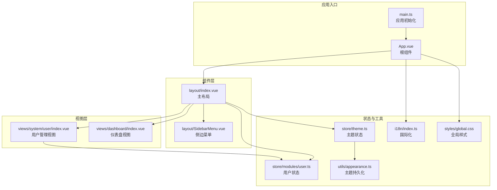
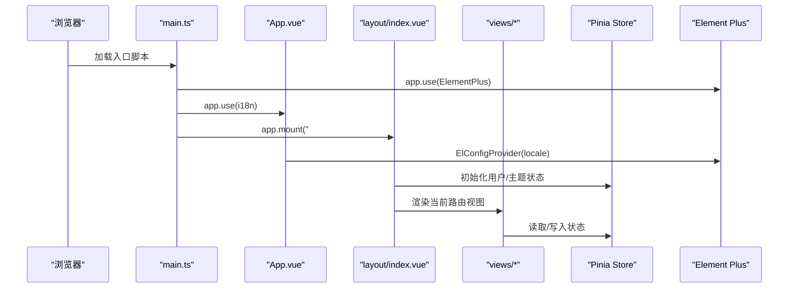
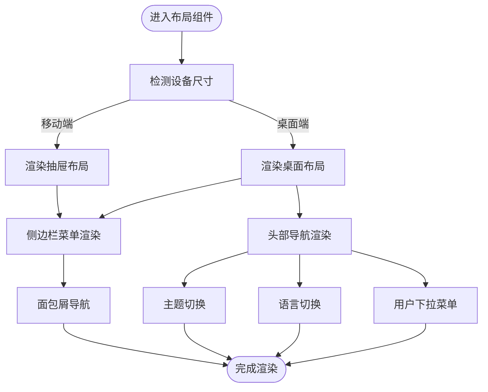
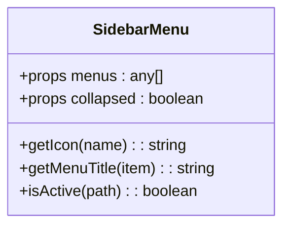
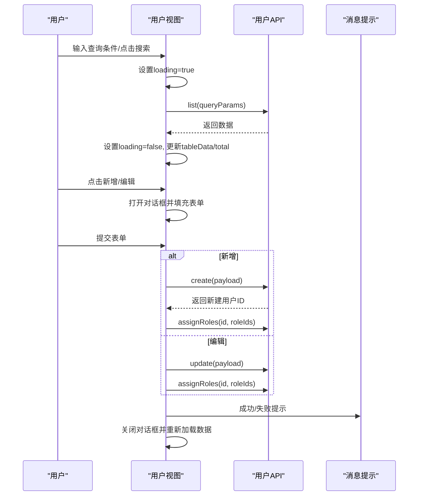
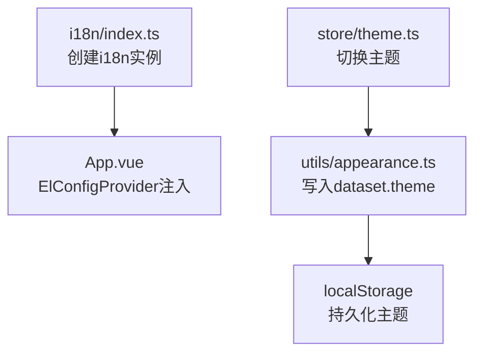
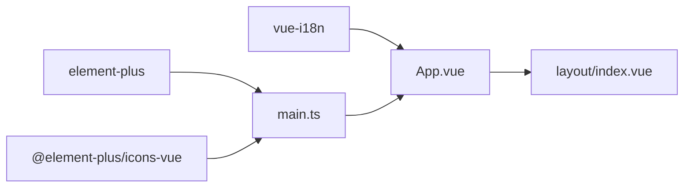

# 自定义组件开发

<cite>
**本文档引用的文件**
- [apps/fronted/src/components/layout/index.vue](file://apps/fronted/src/components/layout/index.vue)
- [apps/fronted/src/components/layout/SidebarMenu.vue](file://apps/fronted/src/components/layout/SidebarMenu.vue)
- [apps/fronted/src/App.vue](file://apps/fronted/src/App.vue)
- [apps/fronted/src/main.ts](file://apps/fronted/src/main.ts)
- [apps/fronted/src/views/system/user/index.vue](file://apps/fronted/src/views/system/user/index.vue)
- [apps/fronted/src/views/dashboard/index.vue](file://apps/fronted/src/views/dashboard/index.vue)
- [apps/fronted/src/store/modules/user.ts](file://apps/fronted/src/store/modules/user.ts)
- [apps/fronted/src/store/theme.ts](file://apps/fronted/src/store/theme.ts)
- [apps/fronted/src/utils/appearance.ts](file://apps/fronted/src/utils/appearance.ts)
- [apps/fronted/src/i18n/index.ts](file://apps/fronted/src/i18n/index.ts)
- [apps/fronted/src/styles/global.css](file://apps/fronted/src/styles/global.css)
- [apps/fronted/package.json](file://apps/fronted/package.json)
</cite>

## 目录
1. [简介](#简介)
2. [项目结构](#项目结构)
3. [核心组件](#核心组件)
4. [架构总览](#架构总览)
5. [详细组件分析](#详细组件分析)
6. [依赖分析](#依赖分析)
7. [性能考虑](#性能考虑)
8. [故障排查指南](#故障排查指南)
9. [结论](#结论)
10. [附录](#附录)

## 简介
本指南面向希望在 Vue 3 生态中进行自定义组件开发的工程师，结合仓库中的实际组件与布局实现，系统讲解组件设计原则、Props 定义、事件处理、插槽使用、UI 组件库（Element Plus）的二次封装与样式定制、通用布局组件（侧边栏、头部导航、面包屑）、复杂表单控件与交互逻辑、表格组件的数据展示与分页、以及组件测试策略与完整开发流程。

## 项目结构
前端工程位于 apps/fronted，采用 Vue 3 + TypeScript + Vite 构建，配合 Pinia 状态管理、Element Plus UI 库、daisyUI/tailwindcss 样式体系、vue-i18n 国际化与主题切换能力。核心组件集中在 components 目录，页面视图集中在 views 目录，全局样式与主题工具位于 styles 与 utils 目录。

**图表来源**
- [apps/fronted/src/main.ts:1-27](file://apps/fronted/src/main.ts#L1-L27)
- [apps/fronted/src/App.vue:1-16](file://apps/fronted/src/App.vue#L1-L16)
- [apps/fronted/src/components/layout/index.vue:1-234](file://apps/fronted/src/components/layout/index.vue#L1-L234)
- [apps/fronted/src/components/layout/SidebarMenu.vue:1-131](file://apps/fronted/src/components/layout/SidebarMenu.vue#L1-L131)
- [apps/fronted/src/views/system/user/index.vue:1-309](file://apps/fronted/src/views/system/user/index.vue#L1-L309)
- [apps/fronted/src/views/dashboard/index.vue:1-189](file://apps/fronted/src/views/dashboard/index.vue#L1-L189)
- [apps/fronted/src/store/modules/user.ts:1-75](file://apps/fronted/src/store/modules/user.ts#L1-L75)
- [apps/fronted/src/store/theme.ts:1-24](file://apps/fronted/src/store/theme.ts#L1-L24)
- [apps/fronted/src/utils/appearance.ts:1-13](file://apps/fronted/src/utils/appearance.ts#L1-L13)
- [apps/fronted/src/i18n/index.ts:1-703](file://apps/fronted/src/i18n/index.ts#L1-L703)
- [apps/fronted/src/styles/global.css:1-297](file://apps/fronted/src/styles/global.css#L1-L297)

**章节来源**
- [apps/fronted/src/main.ts:1-27](file://apps/fronted/src/main.ts#L1-L27)
- [apps/fronted/src/App.vue:1-16](file://apps/fronted/src/App.vue#L1-L16)
- [apps/fronted/src/styles/global.css:1-297](file://apps/fronted/src/styles/global.css#L1-L297)

## 核心组件
- 布局组件：提供移动端抽屉与桌面端侧边栏、头部导航、面包屑导航的统一布局容器。
- 菜单组件：支持多级菜单、图标映射、标题国际化、激活态高亮。
- 视图组件：用户管理列表（含查询、分页、弹窗表单）、仪表盘统计卡片。
- 状态管理：用户信息、菜单、权限与主题切换。
- 国际化与主题：Element Plus 语言包注入、daisyUI 主题切换、本地存储持久化。

**章节来源**
- [apps/fronted/src/components/layout/index.vue:1-234](file://apps/fronted/src/components/layout/index.vue#L1-L234)
- [apps/fronted/src/components/layout/SidebarMenu.vue:1-131](file://apps/fronted/src/components/layout/SidebarMenu.vue#L1-L131)
- [apps/fronted/src/views/system/user/index.vue:1-309](file://apps/fronted/src/views/system/user/index.vue#L1-L309)
- [apps/fronted/src/views/dashboard/index.vue:1-189](file://apps/fronted/src/views/dashboard/index.vue#L1-L189)
- [apps/fronted/src/store/modules/user.ts:1-75](file://apps/fronted/src/store/modules/user.ts#L1-L75)
- [apps/fronted/src/store/theme.ts:1-24](file://apps/fronted/src/store/theme.ts#L1-L24)
- [apps/fronted/src/utils/appearance.ts:1-13](file://apps/fronted/src/utils/appearance.ts#L1-L13)
- [apps/fronted/src/i18n/index.ts:1-703](file://apps/fronted/src/i18n/index.ts#L1-L703)

## 架构总览
应用启动时注册 Element Plus、图标组件、i18n、Pinia 与主题初始化；根组件通过 ElConfigProvider 注入 Element Plus 的语言环境；布局组件负责响应式布局与用户交互，视图组件承载业务数据与表单交互。

**图表来源**
- [apps/fronted/src/main.ts:1-27](file://apps/fronted/src/main.ts#L1-L27)
- [apps/fronted/src/App.vue:1-16](file://apps/fronted/src/App.vue#L1-L16)
- [apps/fronted/src/components/layout/index.vue:1-234](file://apps/fronted/src/components/layout/index.vue#L1-L234)

**章节来源**
- [apps/fronted/src/main.ts:1-27](file://apps/fronted/src/main.ts#L1-L27)
- [apps/fronted/src/App.vue:1-16](file://apps/fronted/src/App.vue#L1-L16)

## 详细组件分析

### 布局组件（主布局）
职责与特性
- 移动端抽屉布局与桌面端侧边栏双模式，支持折叠/展开。
- 头部导航包含主题切换、语言切换、用户下拉菜单。
- 面包屑导航根据路由元信息动态生成标题。
- 与用户状态联动，支持登出与用户信息展示。

Props 设计
- menus：菜单数组，用于渲染侧边栏菜单。
- collapsed（可选）：侧边栏是否折叠，用于菜单紧凑显示。

事件与交互
- 折叠按钮切换 isCollapsed。
- 主题切换调用主题 store 的 toggleTheme。
- 语言切换通过 i18n 工具 setLocale 更新语言。
- 登录/退出通过用户 store 与路由跳转。

插槽使用
- 未使用具名/作用域插槽，通过组合式 API 与模板指令实现功能。

**图表来源**
- [apps/fronted/src/components/layout/index.vue:1-234](file://apps/fronted/src/components/layout/index.vue#L1-L234)

**章节来源**
- [apps/fronted/src/components/layout/index.vue:1-234](file://apps/fronted/src/components/layout/index.vue#L1-L234)

### 侧边栏菜单组件
职责与特性
- 支持带子菜单的详情折叠与无子菜单的直接链接。
- 图标映射与菜单标题国际化。
- 激活态高亮基于当前路由路径。

Props 设计
- menus：菜单数组。
- collapsed（可选）：控制菜单紧凑显示。

**图表来源**
- [apps/fronted/src/components/layout/SidebarMenu.vue:1-131](file://apps/fronted/src/components/layout/SidebarMenu.vue#L1-L131)

**章节来源**
- [apps/fronted/src/components/layout/SidebarMenu.vue:1-131](file://apps/fronted/src/components/layout/SidebarMenu.vue#L1-L131)

### 用户管理视图（复杂表单与表格）
职责与特性
- 查询区：用户名、昵称、状态筛选，支持回车触发查询与重置。
- 表格区：用户列表、状态开关、批量操作（编辑、重置密码、删除）。
- 分页区：页码与每页条数切换。
- 弹窗表单：新增/编辑用户，包含部门树选择、岗位/角色多选、状态单选。

数据流与交互
- 查询参数 queryParams 双向绑定，加载数据时设置 loading。
- 表单对话框通过 showModal/close 控制显示与隐藏。
- 提交时区分新增与编辑，分别调用不同接口并提示消息。

**图表来源**
- [apps/fronted/src/views/system/user/index.vue:1-309](file://apps/fronted/src/views/system/user/index.vue#L1-L309)

**章节来源**
- [apps/fronted/src/views/system/user/index.vue:1-309](file://apps/fronted/src/views/system/user/index.vue#L1-L309)

### 仪表盘视图（统计卡片）
职责与特性
- 统计网格：用户数、角色数、在线用户、公告数。
- 服务器信息卡：系统、CPU、内存、运行时间。
- 最近登录日志：用户、IP、状态、时间。

数据流
- onMounted 并发加载多个 API 数据，失败时输出错误日志。

**章节来源**
- [apps/fronted/src/views/dashboard/index.vue:1-189](file://apps/fronted/src/views/dashboard/index.vue#L1-L189)

### 主题与国际化集成
- Element Plus 语言包按当前 i18n 语言动态注入。
- 主题切换通过 dataset.theme 写入文档根元素，并持久化到 localStorage。
- 国际化键值集中管理，支持中英双语与本地存储记忆。

**图表来源**
- [apps/fronted/src/App.vue:1-16](file://apps/fronted/src/App.vue#L1-L16)
- [apps/fronted/src/store/theme.ts:1-24](file://apps/fronted/src/store/theme.ts#L1-L24)
- [apps/fronted/src/utils/appearance.ts:1-13](file://apps/fronted/src/utils/appearance.ts#L1-L13)
- [apps/fronted/src/i18n/index.ts:1-703](file://apps/fronted/src/i18n/index.ts#L1-L703)

**章节来源**
- [apps/fronted/src/App.vue:1-16](file://apps/fronted/src/App.vue#L1-L16)
- [apps/fronted/src/store/theme.ts:1-24](file://apps/fronted/src/store/theme.ts#L1-L24)
- [apps/fronted/src/utils/appearance.ts:1-13](file://apps/fronted/src/utils/appearance.ts#L1-L13)
- [apps/fronted/src/i18n/index.ts:1-703](file://apps/fronted/src/i18n/index.ts#L1-L703)

## 依赖分析
- 运行时依赖：Vue 3、Element Plus、daisyUI、tailwindcss、vue-i18n、pinia、vue-router。
- Element Plus 在 main.ts 中全局注册图标组件并挂载到应用实例。
- Element Plus 语言包在 App.vue 中通过 ElConfigProvider 动态注入。

**图表来源**
- [apps/fronted/src/main.ts:1-27](file://apps/fronted/src/main.ts#L1-L27)
- [apps/fronted/src/App.vue:1-16](file://apps/fronted/src/App.vue#L1-L16)
- [apps/fronted/package.json:1-34](file://apps/fronted/package.json#L1-L34)

**章节来源**
- [apps/fronted/package.json:1-34](file://apps/fronted/package.json#L1-L34)

## 性能考虑
- 列表渲染：对大表格使用虚拟滚动或分页，避免一次性渲染过多节点。
- 并发请求：视图内使用 Promise.all 合理并发加载数据，减少等待时间。
- 样式体积：tailwindcss 与 daisyUI 按需引入，避免全局污染。
- 主题切换：通过 dataset 与 CSS 变量驱动，避免重排重绘。
- 图标与资源：Element Plus 图标按需注册，避免打包冗余。

## 故障排查指南
- 国际化语言不生效
  - 检查 App.vue 中 ElConfigProvider 是否正确注入 locale。
  - 确认 i18n 实例已安装且本地存储的 locale 值有效。
- 主题切换无效
  - 检查 dataset.theme 是否写入文档根元素，localStorage 是否保存。
- Element Plus 组件样式异常
  - 确认全局样式已引入，tailwindcss 插件已启用。
- 菜单不显示或激活态不正确
  - 检查用户 store 中 menus 数据结构与路由 path 是否匹配。
- 表单提交失败
  - 查看控制台错误与消息提示，确认接口返回与表单校验结果。

**章节来源**
- [apps/fronted/src/App.vue:1-16](file://apps/fronted/src/App.vue#L1-L16)
- [apps/fronted/src/utils/appearance.ts:1-13](file://apps/fronted/src/utils/appearance.ts#L1-L13)
- [apps/fronted/src/styles/global.css:1-297](file://apps/fronted/src/styles/global.css#L1-L297)
- [apps/fronted/src/store/modules/user.ts:1-75](file://apps/fronted/src/store/modules/user.ts#L1-L75)
- [apps/fronted/src/views/system/user/index.vue:1-309](file://apps/fronted/src/views/system/user/index.vue#L1-L309)

## 结论
本项目以布局组件为核心，结合 Element Plus 与 daisyUI 实现了响应式、可定制的后台管理界面；通过 Pinia 管理用户与主题状态，借助 vue-i18n 提供国际化能力。复杂视图（用户管理、仪表盘）展示了表单、表格、分页与交互的最佳实践。建议在后续开发中进一步完善单元测试与端到端测试，确保组件在多场景下的稳定性与一致性。

## 附录

### 组件开发最佳实践清单
- Props 设计
  - 明确必填/可选属性，提供合理默认值。
  - 使用类型约束（如 any[]）与文档注释。
- 事件处理
  - 使用 emits 明确对外暴露的事件，避免隐式通信。
- 插槽使用
  - 对可扩展区域提供具名/作用域插槽，保持组件高内聚低耦合。
- 样式与主题
  - 优先使用 CSS 变量与 daisyUI 类名，避免内联样式的硬编码。
- 国际化
  - 所有文案统一从 i18n 获取，避免模板中直接出现硬编码文本。
- 错误处理
  - 对异步请求添加 try/catch 与降级提示，保证用户体验。

### 测试策略建议
- 单元测试
  - 使用 Vitest 对组件逻辑函数（如 parsePostIds）进行断言。
  - 对组合式函数（composables）进行独立测试。
- 集成测试
  - 使用 @testing-library/vue 渲染组件树，模拟 Pinia 与路由环境。
- 端到端测试
  - 使用 Playwright/Cypress 记录用户操作流程（登录、菜单导航、表格分页、表单提交）。

### 开发流程示例（从设计到实现）
- 设计阶段：确定 Props、事件、插槽与交互行为。
- 实现阶段：编写组件模板与逻辑，接入 Element Plus 组件与 daisyUI 样式。
- 集成阶段：在布局组件中复用，接入路由与状态管理。
- 测试阶段：补充单元/集成测试，覆盖关键分支与边界条件。
- 文档与发布：完善组件文档与变更日志，按需发布内部组件库。