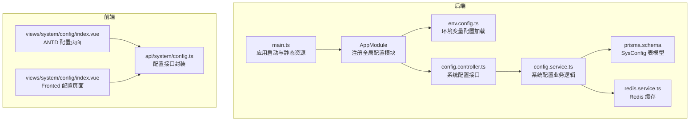
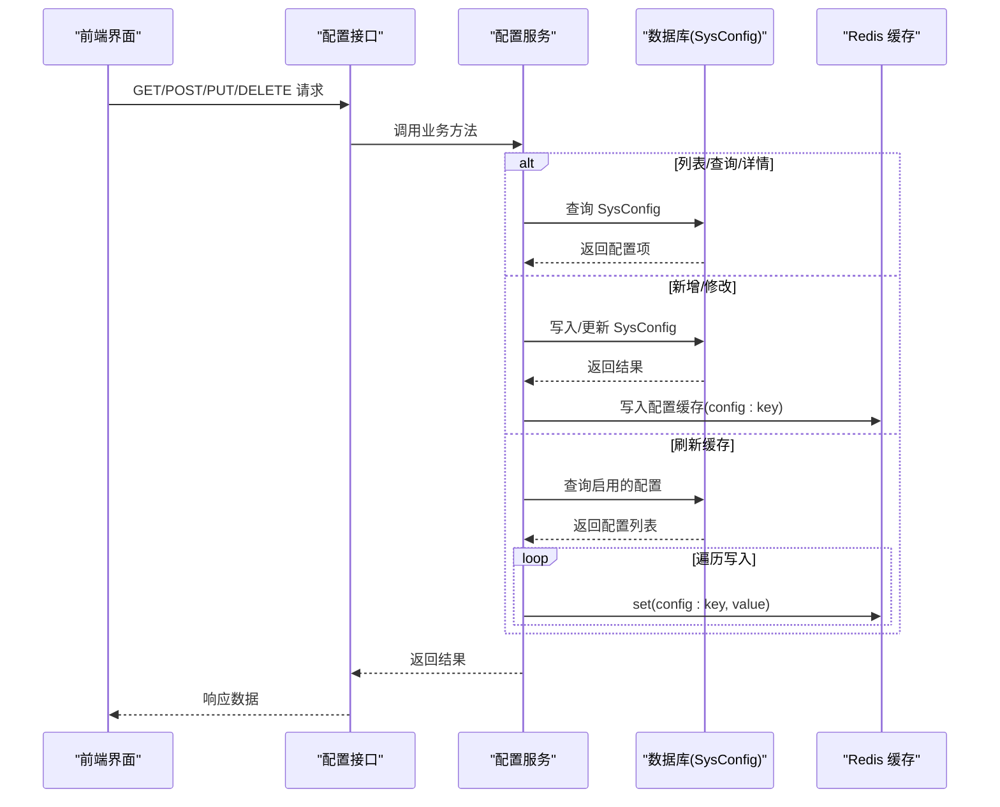
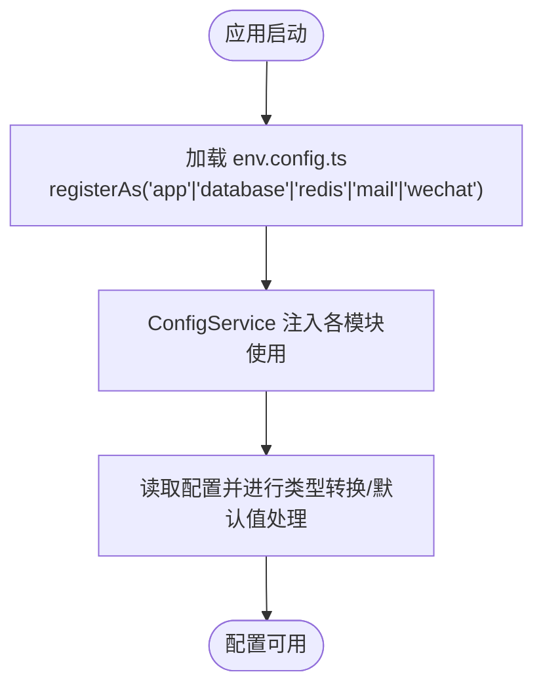
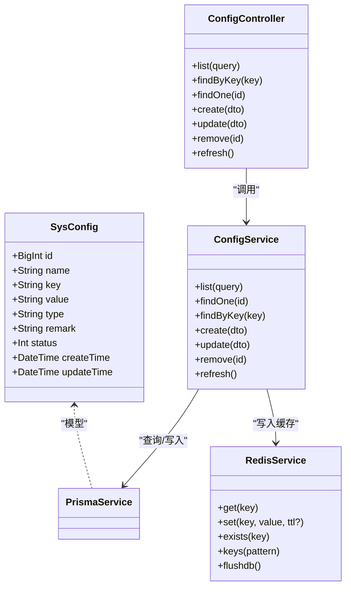
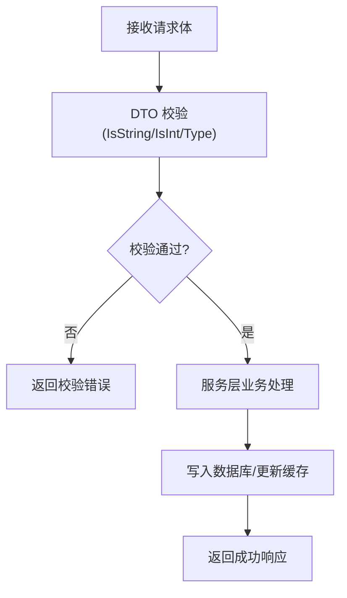
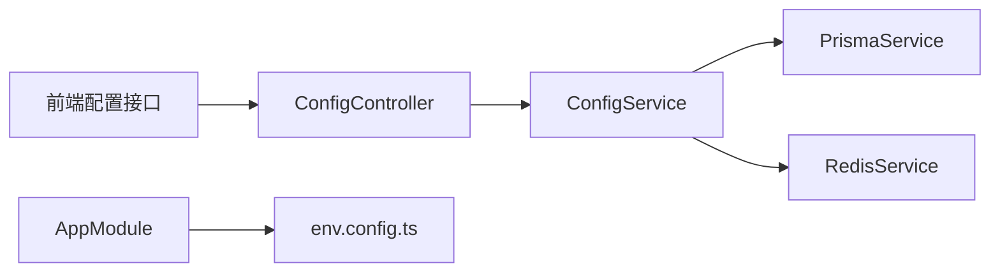

# 配置扩展

<cite>
**本文引用的文件**
- [apps/backend/src/config/env.config.ts](file://apps/backend/src/config/env.config.ts)
- [apps/backend/src/app.module.ts](file://apps/backend/src/app.module.ts)
- [apps/backend/src/main.ts](file://apps/backend/src/main.ts)
- [apps/backend/src/modules/system/config/config.controller.ts](file://apps/backend/src/modules/system/config/config.controller.ts)
- [apps/backend/src/modules/system/config/config.service.ts](file://apps/backend/src/modules/system/config/config.service.ts)
- [apps/backend/src/modules/system/config/dto/config.dto.ts](file://apps/backend/src/modules/system/config/dto/config.dto.ts)
- [apps/backend/src/cache/redis.service.ts](file://apps/backend/src/cache/redis.service.ts)
- [apps/backend/src/common/prisma.service.ts](file://apps/backend/src/common/prisma.service.ts)
- [apps/backend/prisma/schema.prisma](file://apps/backend/prisma/schema.prisma)
- [apps/vben-admin/apps/web-antd/src/api/system/config.ts](file://apps/vben-admin/apps/web-antd/src/api/system/config.ts)
- [apps/vben-admin/apps/web-antd/src/views/system/config/index.vue](file://apps/vben-admin/apps/web-antd/src/views/system/config/index.vue)
- [apps/fronted/src/views/system/config/index.vue](file://apps/fronted/src/views/system/config/index.vue)
- [scripts/init-db.sh](file://scripts/init-db.sh)
- [scripts/seed.sql](file://scripts/seed.sql)
</cite>

## 目录
1. [简介](#简介)
2. [项目结构](#项目结构)
3. [核心组件](#核心组件)
4. [架构总览](#架构总览)
5. [详细组件分析](#详细组件分析)
6. [依赖关系分析](#依赖关系分析)
7. [性能考量](#性能考量)
8. [故障排查指南](#故障排查指南)
9. [结论](#结论)
10. [附录](#附录)

## 简介
本指南围绕“配置扩展”主题，系统讲解如何在现有系统中构建一套完善的配置管理体系，涵盖环境变量配置、数据库持久化配置、动态配置与缓存、配置验证与约束、分组与权限控制、安全与加密、迁移与版本管理，以及从设计到实现部署的完整流程。本文以仓库中的现有配置模块为基础，结合前端界面与数据库模型，给出可落地的实施建议。

## 项目结构
配置扩展涉及后端 NestJS 的配置模块、系统配置控制器与服务、Redis 缓存、Prisma 数据访问层，以及前端 Vben Admin 的配置管理界面。整体结构如下：

图表来源
- [apps/backend/src/app.module.ts:18-38](file://apps/backend/src/app.module.ts#L18-L38)
- [apps/backend/src/config/env.config.ts:1-47](file://apps/backend/src/config/env.config.ts#L1-L47)
- [apps/backend/src/modules/system/config/config.controller.ts:1-63](file://apps/backend/src/modules/system/config/config.controller.ts#L1-L63)
- [apps/backend/src/modules/system/config/config.service.ts:1-56](file://apps/backend/src/modules/system/config/config.service.ts#L1-L56)
- [apps/backend/prisma/schema.prisma:152-165](file://apps/backend/prisma/schema.prisma#L152-L165)
- [apps/backend/src/cache/redis.service.ts:1-128](file://apps/backend/src/cache/redis.service.ts#L1-L128)
- [apps/backend/src/main.ts:8-48](file://apps/backend/src/main.ts#L8-L48)
- [apps/vben-admin/apps/web-antd/src/api/system/config.ts:1-46](file://apps/vben-admin/apps/web-antd/src/api/system/config.ts#L1-L46)
- [apps/vben-admin/apps/web-antd/src/views/system/config/index.vue:1-123](file://apps/vben-admin/apps/web-antd/src/views/system/config/index.vue#L1-L123)
- [apps/fronted/src/views/system/config/index.vue:1-136](file://apps/fronted/src/views/system/config/index.vue#L1-L136)

章节来源
- [apps/backend/src/app.module.ts:18-38](file://apps/backend/src/app.module.ts#L18-L38)
- [apps/backend/src/main.ts:8-48](file://apps/backend/src/main.ts#L8-L48)

## 核心组件
- 环境变量配置加载：通过全局配置模块加载多类配置（应用、数据库、Redis、邮件、微信等），并提供默认值与类型转换。
- 系统配置管理：提供配置的增删改查、按 key 查询、刷新缓存等能力，并将生效配置写入 Redis。
- Redis 缓存：统一的 Redis 客户端封装，支持字符串、哈希、集合等常用操作，用于配置热更新与运行时读取。
- 数据持久化：基于 Prisma 的 SysConfig 表模型，保存配置项的键、值、类型、状态与备注。
- 前端配置界面：提供配置列表、搜索、新增、编辑、删除、刷新缓存等功能。

章节来源
- [apps/backend/src/config/env.config.ts:1-47](file://apps/backend/src/config/env.config.ts#L1-L47)
- [apps/backend/src/modules/system/config/config.controller.ts:1-63](file://apps/backend/src/modules/system/config/config.controller.ts#L1-L63)
- [apps/backend/src/modules/system/config/config.service.ts:1-56](file://apps/backend/src/modules/system/config/config.service.ts#L1-L56)
- [apps/backend/src/cache/redis.service.ts:1-128](file://apps/backend/src/cache/redis.service.ts#L1-L128)
- [apps/backend/prisma/schema.prisma:152-165](file://apps/backend/prisma/schema.prisma#L152-L165)
- [apps/vben-admin/apps/web-antd/src/api/system/config.ts:1-46](file://apps/vben-admin/apps/web-antd/src/api/system/config.ts#L1-L46)
- [apps/vben-admin/apps/web-antd/src/views/system/config/index.vue:1-123](file://apps/vben-admin/apps/web-antd/src/views/system/config/index.vue#L1-L123)
- [apps/fronted/src/views/system/config/index.vue:1-136](file://apps/fronted/src/views/system/config/index.vue#L1-L136)

## 架构总览
配置扩展的整体交互流程如下：

图表来源
- [apps/backend/src/modules/system/config/config.controller.ts:14-61](file://apps/backend/src/modules/system/config/config.controller.ts#L14-L61)
- [apps/backend/src/modules/system/config/config.service.ts:10-55](file://apps/backend/src/modules/system/config/config.service.ts#L10-L55)
- [apps/backend/prisma/schema.prisma:152-165](file://apps/backend/prisma/schema.prisma#L152-L165)
- [apps/backend/src/cache/redis.service.ts:29-47](file://apps/backend/src/cache/redis.service.ts#L29-L47)

## 详细组件分析

### 环境变量配置管理
- 配置加载位置：全局配置模块在启动时加载 env.config.ts 中定义的多个命名空间配置（如 app、database、redis、mail、wechat）。
- 默认值与类型安全：对数值型字段进行解析并提供默认值；字符串型字段提供默认值，确保在未设置环境变量时系统仍可正常运行。
- 可扩展性：新增配置只需在 env.config.ts 中添加新的 registerAs 条目，并在需要的地方注入 ConfigService 获取对应配置。

图表来源
- [apps/backend/src/app.module.ts:20-23](file://apps/backend/src/app.module.ts#L20-L23)
- [apps/backend/src/config/env.config.ts:3-46](file://apps/backend/src/config/env.config.ts#L3-L46)

章节来源
- [apps/backend/src/app.module.ts:20-23](file://apps/backend/src/app.module.ts#L20-L23)
- [apps/backend/src/config/env.config.ts:1-47](file://apps/backend/src/config/env.config.ts#L1-L47)

### 动态配置系统（数据库存储、热更新、缓存）
- 数据模型：SysConfig 表包含键、值、类型、状态、备注等字段，支持按 key 唯一索引。
- 控制器接口：提供列表、按 key 查询、按 id 查询、创建、更新、删除、刷新缓存等接口。
- 服务逻辑：更新配置后写入 Redis 缓存；刷新缓存接口会扫描启用的配置项并批量写入 Redis。
- 缓存读取：RedisService 提供 get/set 等方法，支持 JSON 序列化与 TTL 设置。

图表来源
- [apps/backend/prisma/schema.prisma:152-165](file://apps/backend/prisma/schema.prisma#L152-L165)
- [apps/backend/src/modules/system/config/config.controller.ts:11-62](file://apps/backend/src/modules/system/config/config.controller.ts#L11-L62)
- [apps/backend/src/modules/system/config/config.service.ts:7-55](file://apps/backend/src/modules/system/config/config.service.ts#L7-L55)
- [apps/backend/src/cache/redis.service.ts:5-127](file://apps/backend/src/cache/redis.service.ts#L5-L127)
- [apps/backend/src/common/prisma.service.ts:5-21](file://apps/backend/src/common/prisma.service.ts#L5-L21)

章节来源
- [apps/backend/src/modules/system/config/config.controller.ts:1-63](file://apps/backend/src/modules/system/config/config.controller.ts#L1-L63)
- [apps/backend/src/modules/system/config/config.service.ts:1-56](file://apps/backend/src/modules/system/config/config.service.ts#L1-L56)
- [apps/backend/src/cache/redis.service.ts:1-128](file://apps/backend/src/cache/redis.service.ts#L1-L128)
- [apps/backend/src/common/prisma.service.ts:1-22](file://apps/backend/src/common/prisma.service.ts#L1-L22)
- [apps/backend/prisma/schema.prisma:152-165](file://apps/backend/prisma/schema.prisma#L152-L165)

### 配置验证与约束
- DTO 校验：CreateConfigDto/UpdateConfigDto/QueryConfigDto 使用装饰器进行字段类型与必填校验，保证请求体符合预期。
- 业务约束：服务层对不存在的配置抛出异常；更新时若 key 存在则写入 Redis 缓存，确保一致性。
- 类型字段：配置项支持 string/number/boolean 等类型，便于前端渲染与运行时解析。

图表来源
- [apps/backend/src/modules/system/config/dto/config.dto.ts:5-27](file://apps/backend/src/modules/system/config/dto/config.dto.ts#L5-L27)
- [apps/backend/src/modules/system/config/config.service.ts:31-42](file://apps/backend/src/modules/system/config/config.service.ts#L31-L42)

章节来源
- [apps/backend/src/modules/system/config/dto/config.dto.ts:1-28](file://apps/backend/src/modules/system/config/dto/config.dto.ts#L1-L28)
- [apps/backend/src/modules/system/config/config.service.ts:1-56](file://apps/backend/src/modules/system/config/config.service.ts#L1-L56)

### 配置分组管理（按模块/环境/权限）
- 模块分组：配置项可按业务模块进行 key 命名分组（如 sys_*、file_*），便于前端按模块展示与管理。
- 环境区分：通过不同环境变量区分开发/测试/生产配置；环境变量配置加载器提供默认值，确保跨环境一致性。
- 权限控制：配置管理接口使用 JWT 与权限守卫，仅授权用户可执行相关操作。

章节来源
- [apps/backend/src/modules/system/config/config.controller.ts:10-11](file://apps/backend/src/modules/system/config/config.controller.ts#L10-L11)
- [apps/backend/src/config/env.config.ts:3-46](file://apps/backend/src/config/env.config.ts#L3-L46)

### 配置加密与安全
- 敏感信息保护：当前仓库未提供敏感配置的加密存储与解密读取逻辑。建议在数据库层对敏感字段（如 AccessKey、Secret）采用对称加密存储，并在运行时解密使用。
- 配置文件权限：建议将包含敏感信息的配置文件设置为最小权限（仅运行用户可读），并在 CI/CD 中通过密钥管理服务注入环境变量。
- 传输加密：后端已启用 CORS 与 Swagger 文档，建议在生产环境强制使用 HTTPS 并配置安全头。

章节来源
- [apps/backend/src/main.ts:11-12](file://apps/backend/src/main.ts#L11-L12)
- [apps/backend/src/main.ts:27-35](file://apps/backend/src/main.ts#L27-L35)

### 配置迁移与版本管理
- 数据库迁移：使用 Prisma 进行数据库结构变更与迁移，配合初始化脚本完成数据库初始化与种子数据导入。
- 种子数据：初始化脚本与 seed.sql 提供默认配置项（如系统名称、文件上传大小、对象存储配置等），确保新环境快速可用。
- 版本与回滚：建议在配置变更时增加版本号字段与变更记录，配合回滚策略（如基于备份的恢复）保障稳定性。

章节来源
- [scripts/init-db.sh:53-79](file://scripts/init-db.sh#L53-L79)
- [scripts/seed.sql:137-166](file://scripts/seed.sql#L137-L166)
- [apps/backend/prisma/schema.prisma:5-8](file://apps/backend/prisma/schema.prisma#L5-L8)

### 完整配置扩展示例（设计到部署）
- 设计阶段
  - 明确配置分组规范（如 sys_*、file_*、wechat_*），统一 key 命名。
  - 定义配置类型（string/number/boolean/json）与默认值。
  - 设计权限矩阵（如 system:config:list/add/update/delete/refresh）。
- 开发阶段
  - 在 env.config.ts 中添加环境变量配置项与默认值。
  - 在 Prisma schema 中完善 SysConfig 表结构（如新增版本号、变更记录等）。
  - 实现配置控制器与服务，支持 CRUD 与缓存刷新。
  - 在前端配置页面实现列表、搜索、新增、编辑、删除、刷新缓存。
- 测试阶段
  - 单元测试覆盖 DTO 校验与服务逻辑。
  - 集成测试覆盖接口与缓存一致性。
- 部署阶段
  - 使用初始化脚本与种子数据完成数据库初始化。
  - 在 CI/CD 中注入环境变量，确保敏感信息不落盘明文。
  - 验证 HTTPS、CORS、Swagger 文档等安全与可观测性配置。

章节来源
- [apps/backend/src/config/env.config.ts:1-47](file://apps/backend/src/config/env.config.ts#L1-L47)
- [apps/backend/prisma/schema.prisma:152-165](file://apps/backend/prisma/schema.prisma#L152-L165)
- [apps/backend/src/modules/system/config/config.controller.ts:1-63](file://apps/backend/src/modules/system/config/config.controller.ts#L1-L63)
- [apps/backend/src/modules/system/config/config.service.ts:1-56](file://apps/backend/src/modules/system/config/config.service.ts#L1-L56)
- [apps/vben-admin/apps/web-antd/src/views/system/config/index.vue:1-123](file://apps/vben-admin/apps/web-antd/src/views/system/config/index.vue#L1-L123)
- [apps/fronted/src/views/system/config/index.vue:1-136](file://apps/fronted/src/views/system/config/index.vue#L1-L136)
- [scripts/init-db.sh:1-85](file://scripts/init-db.sh#L1-L85)
- [scripts/seed.sql:1-186](file://scripts/seed.sql#L1-L186)

## 依赖关系分析
- 组件耦合
  - ConfigController 依赖 ConfigService；ConfigService 依赖 PrismaService 与 RedisService。
  - AppModule 全局加载 ConfigModule，并注入 env.config.ts。
- 外部依赖
  - Redis 用于配置缓存；MySQL 通过 Prisma 访问；前端通过 API 封装调用后端接口。
- 循环依赖
  - 当前结构无循环依赖，模块职责清晰。

图表来源
- [apps/backend/src/app.module.ts:20-23](file://apps/backend/src/app.module.ts#L20-L23)
- [apps/backend/src/modules/system/config/config.controller.ts:11-12](file://apps/backend/src/modules/system/config/config.controller.ts#L11-L12)
- [apps/backend/src/modules/system/config/config.service.ts:8-8](file://apps/backend/src/modules/system/config/config.service.ts#L8-L8)
- [apps/backend/src/cache/redis.service.ts:5-5](file://apps/backend/src/cache/redis.service.ts#L5-L5)
- [apps/backend/src/common/prisma.service.ts:5-5](file://apps/backend/src/common/prisma.service.ts#L5-L5)

章节来源
- [apps/backend/src/app.module.ts:18-38](file://apps/backend/src/app.module.ts#L18-L38)
- [apps/backend/src/modules/system/config/config.controller.ts:1-63](file://apps/backend/src/modules/system/config/config.controller.ts#L1-L63)
- [apps/backend/src/modules/system/config/config.service.ts:1-56](file://apps/backend/src/modules/system/config/config.service.ts#L1-L56)

## 性能考量
- 缓存命中率：通过 Redis 缓存高频配置项，减少数据库压力；刷新缓存时批量写入，避免逐条写入带来的抖动。
- 查询优化：SysConfig 表对 key 建有唯一索引，查询效率高；建议在高频查询场景下增加复合索引。
- 序列化成本：RedisService 对非字符串值进行 JSON 序列化，注意大对象的序列化与反序列化开销。
- 并发控制：更新配置时先写数据库再写缓存，避免脏读；可考虑引入分布式锁或幂等设计。

## 故障排查指南
- 配置未生效
  - 检查环境变量是否正确设置，确认 env.config.ts 中的默认值是否覆盖。
  - 确认 Redis 是否连接成功，检查连接日志与错误事件。
- 接口报错
  - 查看 DTO 校验错误，修正请求体字段类型与必填项。
  - 检查数据库连接与 Prisma 日志，确认 SysConfig 表存在且字段正确。
- 缓存不一致
  - 使用刷新缓存接口重新加载启用的配置项。
  - 检查 Redis 键命名规则（config:key）是否一致。

章节来源
- [apps/backend/src/config/env.config.ts:1-47](file://apps/backend/src/config/env.config.ts#L1-L47)
- [apps/backend/src/cache/redis.service.ts:16-22](file://apps/backend/src/cache/redis.service.ts#L16-L22)
- [apps/backend/src/modules/system/config/dto/config.dto.ts:1-28](file://apps/backend/src/modules/system/config/dto/config.dto.ts#L1-L28)
- [apps/backend/src/common/prisma.service.ts:14-21](file://apps/backend/src/common/prisma.service.ts#L14-L21)

## 结论
本指南基于现有代码实现了从环境变量配置到数据库持久化、Redis 缓存、接口与前端界面的完整闭环。通过明确的分组、权限与验证机制，以及可扩展的环境变量加载与初始化脚本，能够支撑配置的动态管理与安全运维。建议后续在敏感配置加密、版本与回滚策略、缓存一致性与性能优化方面进一步完善。

## 附录
- 关键实现路径
  - 环境变量配置加载：[apps/backend/src/config/env.config.ts:1-47](file://apps/backend/src/config/env.config.ts#L1-L47)
  - 全局配置模块注册：[apps/backend/src/app.module.ts:20-23](file://apps/backend/src/app.module.ts#L20-L23)
  - 应用启动与静态资源：[apps/backend/src/main.ts:37-40](file://apps/backend/src/main.ts#L37-L40)
  - 系统配置接口：[apps/backend/src/modules/system/config/config.controller.ts:1-63](file://apps/backend/src/modules/system/config/config.controller.ts#L1-L63)
  - 系统配置服务：[apps/backend/src/modules/system/config/config.service.ts:1-56](file://apps/backend/src/modules/system/config/config.service.ts#L1-L56)
  - 配置 DTO 校验：[apps/backend/src/modules/system/config/dto/config.dto.ts:1-28](file://apps/backend/src/modules/system/config/dto/config.dto.ts#L1-L28)
  - Redis 缓存封装：[apps/backend/src/cache/redis.service.ts:1-128](file://apps/backend/src/cache/redis.service.ts#L1-L128)
  - 数据模型（SysConfig）：[apps/backend/prisma/schema.prisma:152-165](file://apps/backend/prisma/schema.prisma#L152-L165)
  - 前端配置接口封装：[apps/vben-admin/apps/web-antd/src/api/system/config.ts:1-46](file://apps/vben-admin/apps/web-antd/src/api/system/config.ts#L1-L46)
  - 前端配置页面（ANTD）：[apps/vben-admin/apps/web-antd/src/views/system/config/index.vue:1-123](file://apps/vben-admin/apps/web-antd/src/views/system/config/index.vue#L1-L123)
  - 前端配置页面（Fronted）：[apps/fronted/src/views/system/config/index.vue:1-136](file://apps/fronted/src/views/system/config/index.vue#L1-L136)
  - 初始化脚本：[scripts/init-db.sh:1-85](file://scripts/init-db.sh#L1-L85)
  - 种子数据（含默认配置项）：[scripts/seed.sql:137-166](file://scripts/seed.sql#L137-L166)