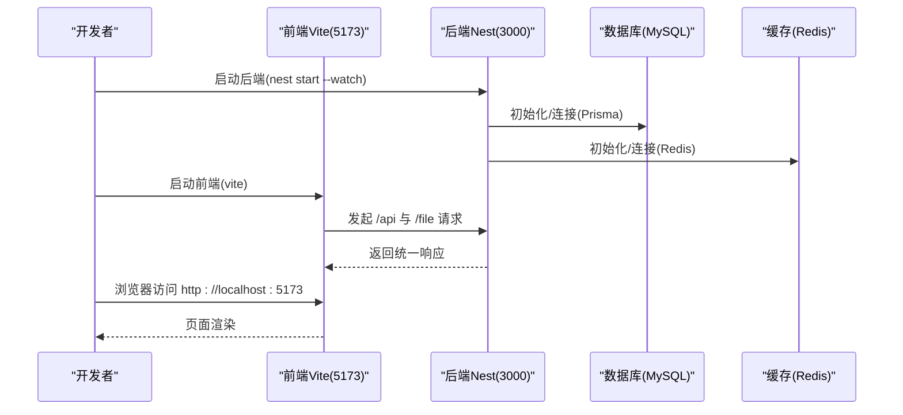
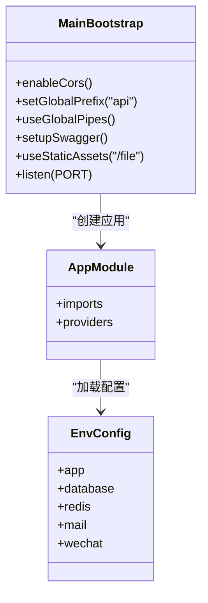
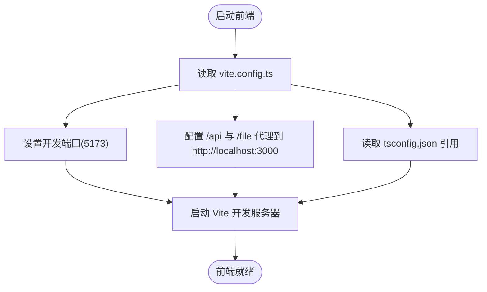
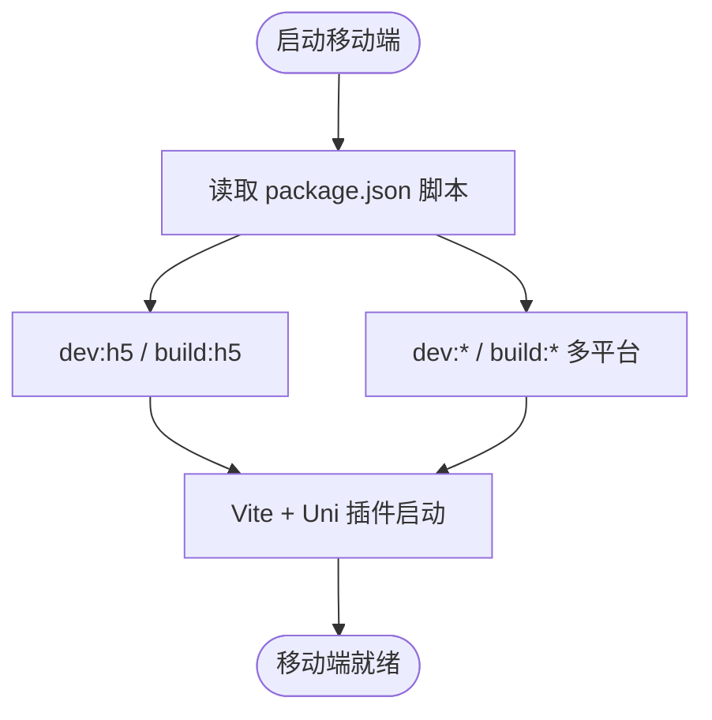

# 启动问题排查

<cite>
**本文引用的文件**
- [apps/backend/package.json](file://apps/backend/package.json)
- [apps/backend/src/main.ts](file://apps/backend/src/main.ts)
- [apps/backend/src/config/env.config.ts](file://apps/backend/src/config/env.config.ts)
- [apps/backend/src/app.module.ts](file://apps/backend/src/app.module.ts)
- [apps/backend/src/common/exception.filter.ts](file://apps/backend/src/common/exception.filter.ts)
- [apps/backend/src/common/transform.interceptor.ts](file://apps/backend/src/common/transform.interceptor.ts)
- [apps/backend/src/common/oper-log.interceptor.ts](file://apps/backend/src/common/oper-log.interceptor.ts)
- [apps/backend/nest-cli.json](file://apps/backend/nest-cli.json)
- [apps/backend/tsconfig.json](file://apps/backend/tsconfig.json)
- [apps/fronted/package.json](file://apps/fronted/package.json)
- [apps/fronted/vite.config.ts](file://apps/fronted/vite.config.ts)
- [apps/fronted/tsconfig.json](file://apps/fronted/tsconfig.json)
- [apps/app/package.json](file://apps/app/package.json)
- [apps/app/vite.config.ts](file://apps/app/vite.config.ts)
- [apps/app/tsconfig.json](file://apps/app/tsconfig.json)
- [scripts/init-db.sh](file://scripts/init-db.sh)
- [README.md](file://README.md)
</cite>

## 目录
1. [简介](#简介)
2. [项目结构](#项目结构)
3. [核心组件](#核心组件)
4. [架构总览](#架构总览)
5. [详细组件分析](#详细组件分析)
6. [依赖关系分析](#依赖关系分析)
7. [性能考虑](#性能考虑)
8. [故障排查指南](#故障排查指南)
9. [结论](#结论)
10. [附录](#附录)

## 简介
本指南聚焦于本仓库中三类应用的启动问题排查：后端 NestJS 应用、前端 Vite 应用、移动端 UniApp 应用。内容覆盖端口占用、环境变量缺失、依赖安装错误、代理与跨域、数据库与缓存连接、日志与异常拦截、以及启动前的环境检查清单与预防性措施。目标是帮助开发者快速定位并解决启动阶段的常见问题。

## 项目结构
本仓库采用多应用目录组织，包含后端 API、Web 管理后台、移动端应用与脚本工具。关键启动相关配置集中在各应用的 package.json、vite.config.ts、tsconfig.* 与后端的 main.ts、env.config.ts、app.module.ts 等文件中。

```mermaid
graph TB
subgraph "后端(NestJS)"
BE_PKG["apps/backend/package.json"]
BE_MAIN["apps/backend/src/main.ts"]
BE_ENV["apps/backend/src/config/env.config.ts"]
BE_APP["apps/backend/src/app.module.ts"]
end
subgraph "前端(Vite)"
FE_PKG["apps/fronted/package.json"]
FE_VITE["apps/fronted/vite.config.ts"]
FE_TSC["apps/fronted/tsconfig.json"]
end
subgraph "移动端(UniApp)"
MOB_PKG["apps/app/package.json"]
MOB_VITE["apps/app/vite.config.ts"]
MOB_TSC["apps/app/tsconfig.json"]
end
BE_PKG --> BE_MAIN
BE_MAIN --> BE_APP
BE_APP --> BE_ENV
FE_PKG --> FE_VITE
FE_VITE --> FE_TSC
MOB_PKG --> MOB_VITE
MOB_VITE --> MOB_TSC
```



**图示来源**
- [apps/backend/package.json:1-50](file://apps/backend/package.json#L1-L50)
- [apps/backend/src/main.ts:1-48](file://apps/backend/src/main.ts#L1-L48)
- [apps/backend/src/config/env.config.ts:1-47](file://apps/backend/src/config/env.config.ts#L1-L47)
- [apps/backend/src/app.module.ts:1-59](file://apps/backend/src/app.module.ts#L1-L59)
- [apps/fronted/package.json:1-34](file://apps/fronted/package.json#L1-L34)
- [apps/fronted/vite.config.ts:1-28](file://apps/fronted/vite.config.ts#L1-L28)
- [apps/fronted/tsconfig.json:1-8](file://apps/fronted/tsconfig.json#L1-L8)
- [apps/app/package.json:1-72](file://apps/app/package.json#L1-L72)
- [apps/app/vite.config.ts:1-8](file://apps/app/vite.config.ts#L1-L8)
- [apps/app/tsconfig.json:1-14](file://apps/app/tsconfig.json#L1-L14)

**章节来源**
- [README.md:26-69](file://README.md#L26-L69)

## 核心组件
- 后端启动入口与监听
  - 启动入口负责创建应用实例、启用 CORS、设置全局前缀、注册全局验证管道、Swagger 文档、静态资源服务，并监听端口。
  - 关键点：端口取自环境变量或默认值；静态资源前缀为 /file；Swagger 文档路径为 doc.html 与 api-docs。
- 环境变量配置
  - 通过 ConfigModule 加载 app、database、redis、mail、wechat 等配置，支持默认值与类型转换。
- 全局拦截与异常过滤
  - 统一响应包装、异常捕获与日志输出、操作日志写入数据库（不影响主流程）。
- 前端开发服务器
  - Vite 默认端口与代理规则，将 /api 与 /file 转发至后端 3000 端口。
- 移动端开发脚本
  - 提供多平台开发与构建脚本，H5 开发与小程序开发命令。

**章节来源**
- [apps/backend/src/main.ts:8-46](file://apps/backend/src/main.ts#L8-L46)
- [apps/backend/src/config/env.config.ts:3-47](file://apps/backend/src/config/env.config.ts#L3-L47)
- [apps/backend/src/app.module.ts:18-59](file://apps/backend/src/app.module.ts#L18-L59)
- [apps/backend/src/common/transform.interceptor.ts:11-29](file://apps/backend/src/common/transform.interceptor.ts#L11-L29)
- [apps/backend/src/common/exception.filter.ts:12-37](file://apps/backend/src/common/exception.filter.ts#L12-L37)
- [apps/backend/src/common/oper-log.interceptor.ts:11-111](file://apps/backend/src/common/oper-log.interceptor.ts#L11-L111)
- [apps/fronted/vite.config.ts:14-26](file://apps/fronted/vite.config.ts#L14-L26)
- [apps/app/package.json:4-37](file://apps/app/package.json#L4-L37)

## 架构总览
后端、前端与移动端的启动交互如下：



**图示来源**
- [apps/backend/src/main.ts:42-46](file://apps/backend/src/main.ts#L42-L46)
- [apps/fronted/vite.config.ts:14-26](file://apps/fronted/vite.config.ts#L14-L26)
- [apps/backend/src/config/env.config.ts:24-46](file://apps/backend/src/config/env.config.ts#L24-L46)

## 详细组件分析

### 后端启动组件分析
- 启动入口与监听
  - 设置全局前缀、CORS、静态资源、Swagger 文档、端口监听。
- 环境变量加载
  - app、database、redis、mail、wechat 等配置项与默认值。
- 全局能力
  - 全局验证管道、限流、定时任务、拦截器与异常过滤器注册。



**图示来源**
- [apps/backend/src/app.module.ts:18-59](file://apps/backend/src/app.module.ts#L18-L59)
- [apps/backend/src/config/env.config.ts:3-47](file://apps/backend/src/config/env.config.ts#L3-L47)
- [apps/backend/src/main.ts:8-46](file://apps/backend/src/main.ts#L8-L46)

**章节来源**
- [apps/backend/src/main.ts:8-46](file://apps/backend/src/main.ts#L8-L46)
- [apps/backend/src/config/env.config.ts:3-47](file://apps/backend/src/config/env.config.ts#L3-L47)
- [apps/backend/src/app.module.ts:18-59](file://apps/backend/src/app.module.ts#L18-L59)

### 前端启动组件分析
- 开发服务器与代理
  - 默认端口、别名、插件、代理规则将 /api 与 /file 转发至后端 3000 端口。
- TypeScript 配置
  - 引用 app 与 node 两套 tsconfig。



**图示来源**
- [apps/fronted/vite.config.ts:7-27](file://apps/fronted/vite.config.ts#L7-L27)
- [apps/fronted/tsconfig.json:1-8](file://apps/fronted/tsconfig.json#L1-L8)

**章节来源**
- [apps/fronted/vite.config.ts:7-27](file://apps/fronted/vite.config.ts#L7-L27)
- [apps/fronted/tsconfig.json:1-8](file://apps/fronted/tsconfig.json#L1-L8)

### 移动端启动组件分析
- 开发脚本
  - 提供 H5 与多小程序平台的开发与构建脚本。
- Vite 插件
  - 使用 @dcloudio/vite-plugin-uni。



**图示来源**
- [apps/app/package.json:4-37](file://apps/app/package.json#L4-L37)
- [apps/app/vite.config.ts:5-7](file://apps/app/vite.config.ts#L5-L7)

**章节来源**
- [apps/app/package.json:4-37](file://apps/app/package.json#L4-L37)
- [apps/app/vite.config.ts:5-7](file://apps/app/vite.config.ts#L5-L7)

## 依赖关系分析
- 后端
  - 通过 ConfigModule 加载 env.config.ts；main.ts 注册全局拦截器与异常过滤器；Swagger 与静态资源在 main.ts 中配置。
- 前端
  - vite.config.ts 定义代理与端口；tsconfig.json 引用 app 与 node 配置。
- 移动端
  - package.json 定义多平台脚本；vite.config.ts 使用 uni 插件。

```mermaid
graph LR
BE_MAIN["backend/main.ts"] --> BE_APPMOD["backend/app.module.ts"]
BE_APPMOD --> BE_ENVCFG["backend/config/env.config.ts"]
FE_VITE["fronted/vite.config.ts"] --> FE_ALIAS["@"] 解析
FE_VITE --> FE_PROXY["/api & /file 代理"]
MOB_PKG["app/package.json"] --> MOB_SCRIPTS["开发/构建脚本"]
MOB_VITE["app/vite.config.ts"] --> UNI_PLUGIN["@dcloudio/vite-plugin-uni"]
```

**图示来源**
- [apps/backend/src/main.ts:8-46](file://apps/backend/src/main.ts#L8-L46)
- [apps/backend/src/app.module.ts:18-59](file://apps/backend/src/app.module.ts#L18-L59)
- [apps/backend/src/config/env.config.ts:3-47](file://apps/backend/src/config/env.config.ts#L3-L47)
- [apps/fronted/vite.config.ts:9-26](file://apps/fronted/vite.config.ts#L9-L26)
- [apps/app/package.json:4-37](file://apps/app/package.json#L4-L37)
- [apps/app/vite.config.ts:5-7](file://apps/app/vite.config.ts#L5-L7)

**章节来源**
- [apps/backend/src/main.ts:8-46](file://apps/backend/src/main.ts#L8-L46)
- [apps/backend/src/app.module.ts:18-59](file://apps/backend/src/app.module.ts#L18-L59)
- [apps/fronted/vite.config.ts:9-26](file://apps/fronted/vite.config.ts#L9-L26)
- [apps/app/package.json:4-37](file://apps/app/package.json#L4-L37)

## 性能考虑
- 启动阶段避免不必要的模块加载与重编译，优先使用 watch 模式进行开发。
- 前端代理仅用于开发环境，生产环境应通过 Nginx 或反向代理统一处理。
- 后端静态资源服务仅在开发环境启用，生产环境建议由网关或 CDN 提供。

[本节为通用指导，不直接分析具体文件]

## 故障排查指南

### 后端 NestJS 启动失败排查
- 端口占用
  - 现象：启动时报端口被占用或无法监听。
  - 排查：确认 APP_PORT 是否被占用；若未设置，确认默认端口 3000 是否被占用。
  - 解决：修改 APP_PORT 或释放占用端口。
  - 参考：
    - [apps/backend/src/main.ts:42-46](file://apps/backend/src/main.ts#L42-L46)
    - [apps/backend/src/config/env.config.ts:4](file://apps/backend/src/config/env.config.ts#L4)
- 环境变量缺失
  - 现象：数据库连接失败、Redis 连接失败、JWT 密钥为空、文件存储配置不正确。
  - 排查：核对 DATABASE_URL、REDIS_*、JWT_SECRET、FILE_STORAGE 等是否配置。
  - 解决：在 .env 中补齐缺失项或在 CI 环境注入。
  - 参考：
    - [apps/backend/src/config/env.config.ts:24-46](file://apps/backend/src/config/env.config.ts#L24-L46)
    - [README.md:135-167](file://README.md#L135-L167)
- 依赖安装错误
  - 现象：启动时报缺少模块或类型错误。
  - 排查：确认 node_modules 是否完整安装；检查 Nest CLI 与 TypeScript 版本兼容性。
  - 解决：清理 node_modules 并重新安装；确保 Node.js 版本满足要求。
  - 参考：
    - [apps/backend/package.json:16-48](file://apps/backend/package.json#L16-L48)
    - [apps/backend/tsconfig.json:1-20](file://apps/backend/tsconfig.json#L1-L20)
- Swagger 与静态资源
  - 现象：Swagger 文档不可访问或静态文件 404。
  - 排查：确认 Swagger 路径与静态资源前缀配置；确认 uploads 目录存在且可读。
  - 解决：修正 Swagger 路径或静态资源前缀；创建 uploads 目录。
  - 参考：
    - [apps/backend/src/main.ts:26-40](file://apps/backend/src/main.ts#L26-L40)
- 全局异常与日志
  - 现象：启动即报错或请求异常未被捕获。
  - 排查：查看异常过滤器与操作日志拦截器是否正确注册；检查 Prisma 与数据库连接。
  - 解决：修复异常过滤器与拦截器；确保数据库与缓存可达。
  - 参考：
    - [apps/backend/src/app.module.ts:39-56](file://apps/backend/src/app.module.ts#L39-L56)
    - [apps/backend/src/common/exception.filter.ts:12-37](file://apps/backend/src/common/exception.filter.ts#L12-L37)
    - [apps/backend/src/common/oper-log.interceptor.ts:11-111](file://apps/backend/src/common/oper-log.interceptor.ts#L11-L111)

### 前端 Vite 启动异常排查
- 端口冲突
  - 现象：启动时报端口 5173 被占用。
  - 排查：确认端口是否被占用。
  - 解决：修改 vite.config.ts 中的 server.port 或释放端口。
  - 参考：
    - [apps/fronted/vite.config.ts:14-15](file://apps/fronted/vite.config.ts#L14-L15)
- 依赖解析失败
  - 现象：启动时报模块找不到或类型错误。
  - 排查：确认 node_modules 安装完整；检查 tsconfig 引用与插件版本。
  - 解决：重新安装依赖；升级/降级插件以匹配 Vite/TS 版本。
  - 参考：
    - [apps/fronted/package.json:11-32](file://apps/fronted/package.json#L11-L32)
    - [apps/fronted/tsconfig.json:1-8](file://apps/fronted/tsconfig.json#L1-L8)
- 配置文件错误
  - 现象：代理无效或别名解析失败。
  - 排查：确认 vite.config.ts 中的 proxy 与 alias 配置；确认路径拼写。
  - 解决：修正代理 target 与路径别名。
  - 参考：
    - [apps/fronted/vite.config.ts:9-26](file://apps/fronted/vite.config.ts#L9-L26)

### 移动端 UniApp 启动异常排查
- 编译错误
  - 现象：H5 或小程序开发时编译失败。
  - 排查：确认 @dcloudio/vite-plugin-uni 与 Vite 版本兼容；检查 tsconfig 与类型声明。
  - 解决：调整插件与 Vite 版本；补齐类型声明。
  - 参考：
    - [apps/app/vite.config.ts:5-7](file://apps/app/vite.config.ts#L5-L7)
    - [apps/app/tsconfig.json:1-14](file://apps/app/tsconfig.json#L1-L14)
- 模拟器兼容性问题
  - 现象：H5 在某些浏览器表现异常。
  - 排查：确认 polyfill 与浏览器兼容性；检查运行时配置。
  - 解决：引入必要 polyfill；调整构建目标。
  - 参考：
    - [apps/app/package.json:59-70](file://apps/app/package.json#L59-L70)

### 启动日志查看与分析
- 后端日志
  - 启动日志包含端口与文档地址打印；异常过滤器会记录未处理错误与堆栈。
  - 关键线索：端口绑定、Swagger 路由、静态资源前缀、数据库/缓存连接。
  - 参考：
    - [apps/backend/src/main.ts:42-46](file://apps/backend/src/main.ts#L42-L46)
    - [apps/backend/src/common/exception.filter.ts:30-33](file://apps/backend/src/common/exception.filter.ts#L30-L33)
- 前端日志
  - Vite 启动日志显示端口与代理信息；浏览器控制台可查看代理转发与网络错误。
  - 关键线索：代理是否生效、静态资源是否可访问、跨域错误。
  - 参考：
    - [apps/fronted/vite.config.ts:14-26](file://apps/fronted/vite.config.ts#L14-L26)
- 移动端日志
  - H5 开发时查看浏览器控制台；小程序开发时查看 IDE 控制台。
  - 关键线索：编译错误、运行时异常、平台 API 不可用。
  - 参考：
    - [apps/app/package.json:4-37](file://apps/app/package.json#L4-L37)

### 启动前环境检查清单
- 后端
  - Node.js 版本满足要求；MySQL 与 Redis 可达；.env 配置完整；Prisma 客户端生成；uploads 目录存在。
  - 参考：
    - [README.md:121-127](file://README.md#L121-L127)
    - [README.md:135-167](file://README.md#L135-L167)
    - [scripts/init-db.sh:23-31](file://scripts/init-db.sh#L23-L31)
- 前端
  - Node.js 版本满足要求；依赖安装完成；端口未被占用；代理配置正确。
  - 参考：
    - [apps/fronted/package.json:11-32](file://apps/fronted/package.json#L11-L32)
    - [apps/fronted/vite.config.ts:14-26](file://apps/fronted/vite.config.ts#L14-L26)
- 移动端
  - Node.js 版本满足要求；依赖安装完成；H5 或对应小程序开发者工具可用。
  - 参考：
    - [apps/app/package.json:4-37](file://apps/app/package.json#L4-L37)

## 结论
通过明确三类应用的启动配置与关键组件，结合端口、环境变量、依赖与代理等常见问题的排查步骤，可以高效定位并解决启动阶段的问题。建议在启动前完成环境检查清单，并在开发过程中充分利用日志与异常拦截器提供的线索进行快速定位。

## 附录
- 常用命令参考
  - 后端：安装依赖、开发启动、构建、Prisma 生成与迁移。
  - 前端：开发、构建、预览。
  - 移动端：H5 与多平台开发/构建。
  - 参考：
    - [README.md:383-412](file://README.md#L383-L412)