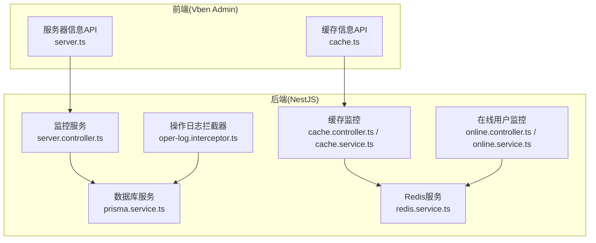
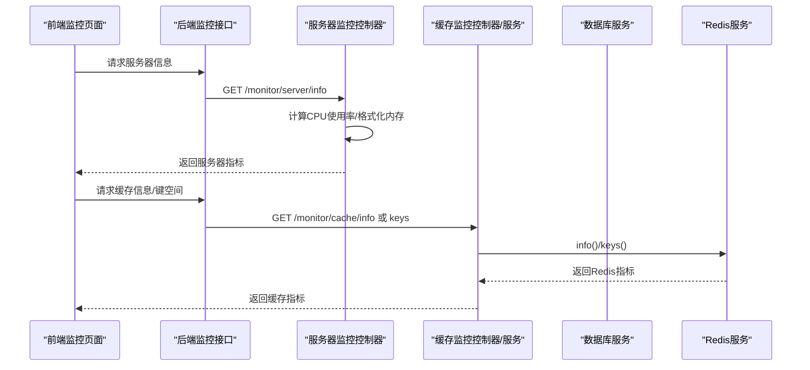
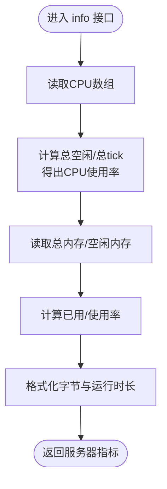
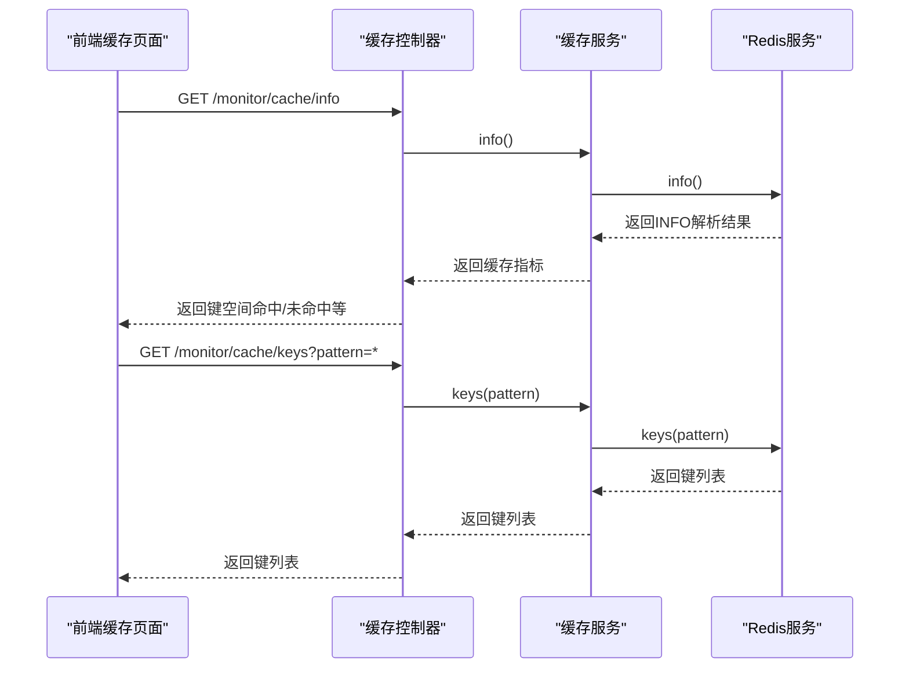
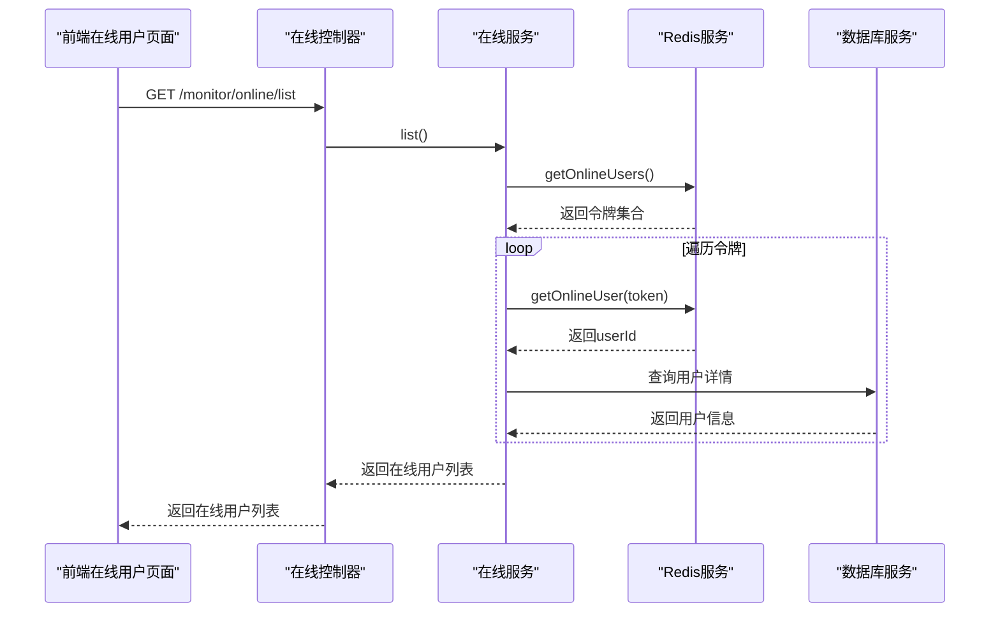
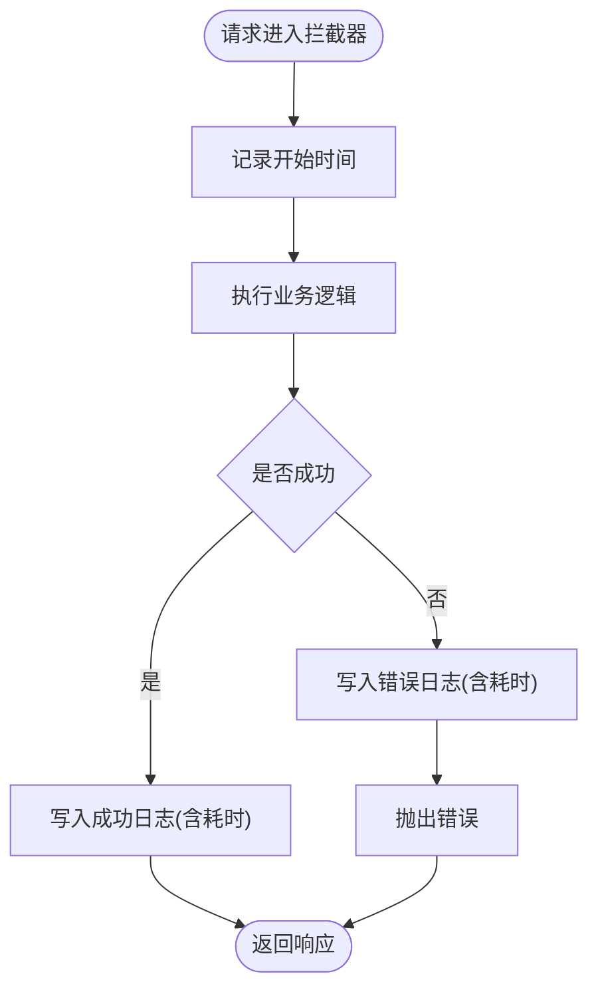
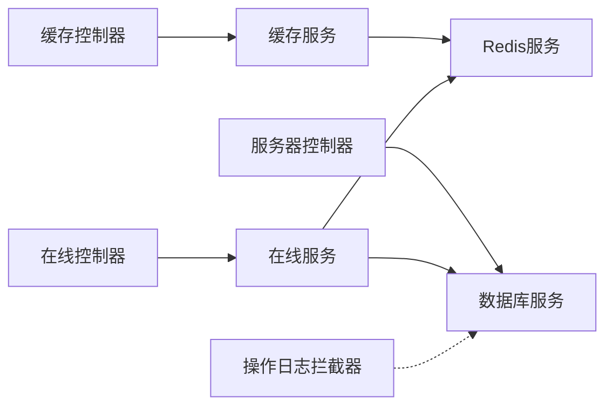

# 性能问题诊断

<cite>
**本文档引用的文件**
- [apps/backend/src/cache/redis.service.ts](file://apps/backend/src/cache/redis.service.ts)
- [apps/backend/src/common/prisma.service.ts](file://apps/backend/src/common/prisma.service.ts)
- [apps/backend/src/modules/monitor/server/server.controller.ts](file://apps/backend/src/modules/monitor/server/server.controller.ts)
- [apps/backend/src/modules/monitor/cache/cache.controller.ts](file://apps/backend/src/modules/monitor/cache/cache.controller.ts)
- [apps/backend/src/modules/monitor/cache/cache.service.ts](file://apps/backend/src/modules/monitor/cache/cache.service.ts)
- [apps/backend/src/modules/monitor/online/online.controller.ts](file://apps/backend/src/modules/monitor/online/online.controller.ts)
- [apps/backend/src/modules/monitor/online/online.service.ts](file://apps/backend/src/modules/monitor/online/online.service.ts)
- [apps/backend/src/modules/monitor/oper-log/oper-log.service.ts](file://apps/backend/src/modules/monitor/oper-log/oper-log.service.ts)
- [apps/backend/src/common/oper-log.interceptor.ts](file://apps/backend/src/common/oper-log.interceptor.ts)
- [apps/vben-admin/apps/web-antd/src/api/monitor/server.ts](file://apps/vben-admin/apps/web-antd/src/api/monitor/server.ts)
- [apps/vben-admin/apps/web-antd/src/api/monitor/cache.ts](file://apps/vben-admin/apps/web-antd/src/api/monitor/cache.ts)
- [apps/backend/src/modules/system/user/user.service.ts](file://apps/backend/src/modules/system/user/user.service.ts)
</cite>

## 目录
1. [简介](#简介)
2. [项目结构](#项目结构)
3. [核心组件](#核心组件)
4. [架构总览](#架构总览)
5. [详细组件分析](#详细组件分析)
6. [依赖关系分析](#依赖关系分析)
7. [性能考量](#性能考量)
8. [故障排除指南](#故障排除指南)
9. [结论](#结论)
10. [附录](#附录)

## 简介
本指南面向在生产环境中遇到性能问题的工程师与运维人员，围绕CPU占用过高、内存泄漏、数据库查询性能、Redis缓存性能以及前端性能等维度，提供系统性的诊断方法与实操步骤。结合本仓库中的后端监控模块与前端监控接口，可快速定位瓶颈并制定优化策略。

## 项目结构
该项目采用多应用分层组织：后端基于 NestJS 提供监控与业务能力；前端提供可视化监控界面。监控相关能力主要集中在后端的 monitor 模块与前端的监控页面之间通过 API 进行联动。

图表来源
- [apps/backend/src/modules/monitor/server/server.controller.ts:1-70](file://apps/backend/src/modules/monitor/server/server.controller.ts#L1-L70)
- [apps/backend/src/modules/monitor/cache/cache.controller.ts:1-50](file://apps/backend/src/modules/monitor/cache/cache.controller.ts#L1-L50)
- [apps/backend/src/modules/monitor/cache/cache.service.ts:1-29](file://apps/backend/src/modules/monitor/cache/cache.service.ts#L1-L29)
- [apps/backend/src/modules/monitor/online/online.controller.ts:1-28](file://apps/backend/src/modules/monitor/online/online.controller.ts#L1-L28)
- [apps/backend/src/modules/monitor/online/online.service.ts:1-31](file://apps/backend/src/modules/monitor/online/online.service.ts#L1-L31)
- [apps/backend/src/common/oper-log.interceptor.ts:1-111](file://apps/backend/src/common/oper-log.interceptor.ts#L1-L111)
- [apps/backend/src/common/prisma.service.ts:1-22](file://apps/backend/src/common/prisma.service.ts#L1-L22)
- [apps/backend/src/cache/redis.service.ts:1-128](file://apps/backend/src/cache/redis.service.ts#L1-L128)
- [apps/vben-admin/apps/web-antd/src/api/monitor/server.ts:1-33](file://apps/vben-admin/apps/web-antd/src/api/monitor/server.ts#L1-L33)
- [apps/vben-admin/apps/web-antd/src/api/monitor/cache.ts:1-35](file://apps/vben-admin/apps/web-antd/src/api/monitor/cache.ts#L1-L35)

章节来源
- [apps/backend/src/modules/monitor/server/server.controller.ts:1-70](file://apps/backend/src/modules/monitor/server/server.controller.ts#L1-L70)
- [apps/backend/src/modules/monitor/cache/cache.controller.ts:1-50](file://apps/backend/src/modules/monitor/cache/cache.controller.ts#L1-L50)
- [apps/backend/src/modules/monitor/cache/cache.service.ts:1-29](file://apps/backend/src/modules/monitor/cache/cache.service.ts#L1-L29)
- [apps/backend/src/modules/monitor/online/online.controller.ts:1-28](file://apps/backend/src/modules/monitor/online/online.controller.ts#L1-L28)
- [apps/backend/src/modules/monitor/online/online.service.ts:1-31](file://apps/backend/src/modules/monitor/online/online.service.ts#L1-L31)
- [apps/backend/src/common/oper-log.interceptor.ts:1-111](file://apps/backend/src/common/oper-log.interceptor.ts#L1-L111)
- [apps/backend/src/common/prisma.service.ts:1-22](file://apps/backend/src/common/prisma.service.ts#L1-L22)
- [apps/backend/src/cache/redis.service.ts:1-128](file://apps/backend/src/cache/redis.service.ts#L1-L128)
- [apps/vben-admin/apps/web-antd/src/api/monitor/server.ts:1-33](file://apps/vben-admin/apps/web-antd/src/api/monitor/server.ts#L1-L33)
- [apps/vben-admin/apps/web-antd/src/api/monitor/cache.ts:1-35](file://apps/vben-admin/apps/web-antd/src/api/monitor/cache.ts#L1-L35)

## 核心组件
- 服务器监控控制器：采集 CPU 使用率、内存使用、磁盘使用、主机信息等，用于定位 CPU 占用过高的硬件与系统层面原因。
- 缓存监控控制器与服务：提供 Redis 基础信息、键空间命中/未命中统计、键列表、值读取、清空与删除等能力，用于诊断缓存命中率与内存占用。
- 在线用户监控：基于 Redis 集合维护在线用户令牌集合，结合数据库查询用户信息，辅助定位并发与会话相关性能问题。
- 操作日志拦截器：统一记录请求耗时、状态、参数与错误信息，便于定位慢请求与异常路径。
- 数据库服务：Prisma 客户端封装，支持连接生命周期管理与日志级别控制，为数据库性能分析提供基础。
- Redis 服务：对 ioredis 的封装，提供连接、错误处理、info 解析、在线用户管理等方法，支撑缓存与会话功能。

章节来源
- [apps/backend/src/modules/monitor/server/server.controller.ts:1-70](file://apps/backend/src/modules/monitor/server/server.controller.ts#L1-L70)
- [apps/backend/src/modules/monitor/cache/cache.controller.ts:1-50](file://apps/backend/src/modules/monitor/cache/cache.controller.ts#L1-L50)
- [apps/backend/src/modules/monitor/cache/cache.service.ts:1-29](file://apps/backend/src/modules/monitor/cache/cache.service.ts#L1-L29)
- [apps/backend/src/modules/monitor/online/online.controller.ts:1-28](file://apps/backend/src/modules/monitor/online/online.controller.ts#L1-L28)
- [apps/backend/src/modules/monitor/online/online.service.ts:1-31](file://apps/backend/src/modules/monitor/online/online.service.ts#L1-L31)
- [apps/backend/src/common/oper-log.interceptor.ts:1-111](file://apps/backend/src/common/oper-log.interceptor.ts#L1-L111)
- [apps/backend/src/common/prisma.service.ts:1-22](file://apps/backend/src/common/prisma.service.ts#L1-L22)
- [apps/backend/src/cache/redis.service.ts:1-128](file://apps/backend/src/cache/redis.service.ts#L1-L128)

## 架构总览
后端通过控制器暴露监控接口，前端通过 API 调用获取监控数据。监控数据来源包括 Node.js 内置 os 模块（服务器信息）、Redis INFO 命令解析（缓存信息）以及数据库日志与操作日志表（业务性能）。

图表来源
- [apps/backend/src/modules/monitor/server/server.controller.ts:14-41](file://apps/backend/src/modules/monitor/server/server.controller.ts#L14-L41)
- [apps/backend/src/modules/monitor/cache/cache.controller.ts:13-32](file://apps/backend/src/modules/monitor/cache/cache.controller.ts#L13-L32)
- [apps/backend/src/modules/monitor/cache/cache.service.ts:8-18](file://apps/backend/src/modules/monitor/cache/cache.service.ts#L8-L18)
- [apps/backend/src/cache/redis.service.ts:70-80](file://apps/backend/src/cache/redis.service.ts#L70-L80)
- [apps/vben-admin/apps/web-antd/src/api/monitor/server.ts:30-32](file://apps/vben-admin/apps/web-antd/src/api/monitor/server.ts#L30-L32)
- [apps/vben-admin/apps/web-antd/src/api/monitor/cache.ts:16-22](file://apps/vben-admin/apps/web-antd/src/api/monitor/cache.ts#L16-L22)

## 详细组件分析

### 服务器监控组件
- 功能要点
  - 采集 CPU 核数、模型、使用率（基于各核 times 统计）
  - 采集内存总量、已用、空闲与使用率
  - 采集系统运行时长与主机名
  - 将字节转换为人类可读单位（B/KB/MB/GB）
- 诊断用途
  - 快速判断是否为 CPU 密集型任务或内存压力导致的 GC 抖动
  - 结合业务峰值时段，定位是否存在异常的 CPU 占用

图表来源
- [apps/backend/src/modules/monitor/server/server.controller.ts:18-54](file://apps/backend/src/modules/monitor/server/server.controller.ts#L18-L54)

章节来源
- [apps/backend/src/modules/monitor/server/server.controller.ts:1-70](file://apps/backend/src/modules/monitor/server/server.controller.ts#L1-L70)

### 缓存监控组件
- 功能要点
  - 获取 Redis INFO 指标（版本、模式、内存、客户端连接、命令处理、键空间命中/未命中、运行时长等）
  - 列出键、按键读取值、清空数据库、按键删除
  - 在线用户管理：基于集合维护在线令牌与映射值
- 诊断用途
  - 键空间命中/未命中比用于评估缓存命中率
  - 内存使用量与客户端连接数用于评估缓存容量与连接池配置
  - 清理与删除接口可用于验证缓存策略有效性

图表来源
- [apps/backend/src/modules/monitor/cache/cache.controller.ts:13-32](file://apps/backend/src/modules/monitor/cache/cache.controller.ts#L13-L32)
- [apps/backend/src/modules/monitor/cache/cache.service.ts:8-18](file://apps/backend/src/modules/monitor/cache/cache.service.ts#L8-L18)
- [apps/backend/src/cache/redis.service.ts:70-80](file://apps/backend/src/cache/redis.service.ts#L70-L80)
- [apps/vben-admin/apps/web-antd/src/api/monitor/cache.ts:16-22](file://apps/vben-admin/apps/web-antd/src/api/monitor/cache.ts#L16-L22)

章节来源
- [apps/backend/src/modules/monitor/cache/cache.controller.ts:1-50](file://apps/backend/src/modules/monitor/cache/cache.controller.ts#L1-L50)
- [apps/backend/src/modules/monitor/cache/cache.service.ts:1-29](file://apps/backend/src/modules/monitor/cache/cache.service.ts#L1-L29)
- [apps/backend/src/cache/redis.service.ts:1-128](file://apps/backend/src/cache/redis.service.ts#L1-L128)
- [apps/vben-admin/apps/web-antd/src/api/monitor/cache.ts:1-35](file://apps/vben-admin/apps/web-antd/src/api/monitor/cache.ts#L1-L35)

### 在线用户监控组件
- 功能要点
  - 从 Redis 获取在线用户令牌集合
  - 对每个令牌从映射值中读取用户ID，并查询数据库获取用户详情
  - 支持强制下线（移除令牌与集合项）
- 诊断用途
  - 并发登录与会话数量异常时，检查 Redis 集合大小与 TTL 设置
  - 异常下线或会话失效问题，结合操作日志与数据库查询进行交叉验证

图表来源
- [apps/backend/src/modules/monitor/online/online.controller.ts:13-18](file://apps/backend/src/modules/monitor/online/online.controller.ts#L13-L18)
- [apps/backend/src/modules/monitor/online/online.service.ts:9-25](file://apps/backend/src/modules/monitor/online/online.service.ts#L9-L25)
- [apps/backend/src/cache/redis.service.ts:83-99](file://apps/backend/src/cache/redis.service.ts#L83-L99)
- [apps/backend/src/common/prisma.service.ts:1-22](file://apps/backend/src/common/prisma.service.ts#L1-L22)

章节来源
- [apps/backend/src/modules/monitor/online/online.controller.ts:1-28](file://apps/backend/src/modules/monitor/online/online.controller.ts#L1-L28)
- [apps/backend/src/modules/monitor/online/online.service.ts:1-31](file://apps/backend/src/modules/monitor/online/online.service.ts#L1-L31)
- [apps/backend/src/cache/redis.service.ts:1-128](file://apps/backend/src/cache/redis.service.ts#L1-L128)
- [apps/backend/src/common/prisma.service.ts:1-22](file://apps/backend/src/common/prisma.service.ts#L1-L22)

### 操作日志拦截器与服务
- 功能要点
  - 拦截器记录请求耗时、状态、请求URL、参数、响应结果、错误信息、IP 等
  - 自动过滤敏感字段（密码、Token、Authorization、验证码等）
  - 仅对特定请求类型与路径生效，避免日志风暴
  - 操作日志服务提供分页查询、单条查询与清理功能
- 诊断用途
  - 定位慢请求与异常请求的调用链
  - 结合数据库慢查询日志与 Redis 命中情况，综合分析性能瓶颈

图表来源
- [apps/backend/src/common/oper-log.interceptor.ts:15-28](file://apps/backend/src/common/oper-log.interceptor.ts#L15-L28)
- [apps/backend/src/modules/monitor/oper-log/oper-log.service.ts:8-23](file://apps/backend/src/modules/monitor/oper-log/oper-log.service.ts#L8-L23)

章节来源
- [apps/backend/src/common/oper-log.interceptor.ts:1-111](file://apps/backend/src/common/oper-log.interceptor.ts#L1-L111)
- [apps/backend/src/modules/monitor/oper-log/oper-log.service.ts:1-33](file://apps/backend/src/modules/monitor/oper-log/oper-log.service.ts#L1-L33)

### 数据库与业务服务
- 功能要点
  - PrismaService 提供连接生命周期管理与日志级别控制
  - 用户服务包含分页查询、创建、更新、删除、重置密码、状态变更、角色分配等
- 诊断用途
  - 分页查询与并发写入场景下的数据库压力评估
  - 结合操作日志耗时与数据库慢查询日志，定位热点 SQL

章节来源
- [apps/backend/src/common/prisma.service.ts:1-22](file://apps/backend/src/common/prisma.service.ts#L1-L22)
- [apps/backend/src/modules/system/user/user.service.ts:1-144](file://apps/backend/src/modules/system/user/user.service.ts#L1-L144)

## 依赖关系分析
- 控制器依赖服务，服务依赖基础设施（Redis/数据库）
- 拦截器横切所有请求，不直接依赖业务控制器
- 前端通过 API 层访问后端监控能力

图表来源
- [apps/backend/src/modules/monitor/server/server.controller.ts:1-70](file://apps/backend/src/modules/monitor/server/server.controller.ts#L1-L70)
- [apps/backend/src/modules/monitor/cache/cache.controller.ts:1-50](file://apps/backend/src/modules/monitor/cache/cache.controller.ts#L1-L50)
- [apps/backend/src/modules/monitor/cache/cache.service.ts:1-29](file://apps/backend/src/modules/monitor/cache/cache.service.ts#L1-L29)
- [apps/backend/src/modules/monitor/online/online.controller.ts:1-28](file://apps/backend/src/modules/monitor/online/online.controller.ts#L1-L28)
- [apps/backend/src/modules/monitor/online/online.service.ts:1-31](file://apps/backend/src/modules/monitor/online/online.service.ts#L1-L31)
- [apps/backend/src/common/oper-log.interceptor.ts:1-111](file://apps/backend/src/common/oper-log.interceptor.ts#L1-L111)
- [apps/backend/src/common/prisma.service.ts:1-22](file://apps/backend/src/common/prisma.service.ts#L1-L22)
- [apps/backend/src/cache/redis.service.ts:1-128](file://apps/backend/src/cache/redis.service.ts#L1-L128)

## 性能考量
- CPU 占用过高
  - 使用服务器监控接口查看 CPU 使用率与负载
  - 结合操作日志拦截器定位耗时较长的请求路径
  - 评估是否为加密（如 bcrypt）或复杂计算导致的 CPU 压力
- 内存泄漏
  - 关注 Redis 内存使用与键空间命中率变化
  - 使用缓存清空与删除接口验证缓存策略是否有效
  - 结合数据库连接池与 Prisma 日志级别，避免不必要的对象保留
- 数据库查询性能
  - 使用操作日志拦截器识别慢查询
  - 结合 Prisma 日志级别与数据库慢查询日志进行关联分析
  - 对高频查询建立合适的索引，减少全表扫描
- Redis 缓存性能
  - 关注 keyspaceHits/keyspaceMisses 比例，优化键设计与TTL
  - 监控连接数与内存使用，调整连接池与淘汰策略
- 前端性能
  - 使用前端监控接口获取服务器指标，结合浏览器开发者工具分析页面加载时间、资源体积与渲染耗时
  - 评估静态资源压缩与缓存策略的效果

[本节为通用指导，无需列出具体文件来源]

## 故障排除指南
- CPU 占用过高
  - 步骤：通过服务器监控接口确认 CPU 使用率；使用操作日志拦截器定位耗时请求；检查加密强度与批量处理逻辑
  - 参考实现：服务器控制器、操作日志拦截器
- 内存泄漏
  - 步骤：观察 Redis 内存持续增长；核对键空间命中率下降；清理缓存验证
  - 参考实现：缓存控制器/服务、Redis 服务
- 数据库查询性能
  - 步骤：结合操作日志耗时与数据库慢查询日志；优化索引与查询语句；分页与排序字段建立索引
  - 参考实现：Prisma 服务、用户服务
- Redis 缓存性能
  - 步骤：分析 keyspaceHits/keyspaceMisses；检查连接池配置与内存上限；优化键命名与TTL
  - 参考实现：缓存控制器/服务、Redis 服务
- 前端性能
  - 步骤：通过前端监控接口获取服务器指标；使用浏览器工具分析资源加载与渲染
  - 参考实现：前端监控 API

章节来源
- [apps/backend/src/modules/monitor/server/server.controller.ts:1-70](file://apps/backend/src/modules/monitor/server/server.controller.ts#L1-L70)
- [apps/backend/src/common/oper-log.interceptor.ts:1-111](file://apps/backend/src/common/oper-log.interceptor.ts#L1-L111)
- [apps/backend/src/modules/monitor/cache/cache.controller.ts:1-50](file://apps/backend/src/modules/monitor/cache/cache.controller.ts#L1-L50)
- [apps/backend/src/modules/monitor/cache/cache.service.ts:1-29](file://apps/backend/src/modules/monitor/cache/cache.service.ts#L1-L29)
- [apps/backend/src/cache/redis.service.ts:1-128](file://apps/backend/src/cache/redis.service.ts#L1-L128)
- [apps/backend/src/common/prisma.service.ts:1-22](file://apps/backend/src/common/prisma.service.ts#L1-L22)
- [apps/backend/src/modules/system/user/user.service.ts:1-144](file://apps/backend/src/modules/system/user/user.service.ts#L1-L144)
- [apps/vben-admin/apps/web-antd/src/api/monitor/server.ts:1-33](file://apps/vben-admin/apps/web-antd/src/api/monitor/server.ts#L1-L33)
- [apps/vben-admin/apps/web-antd/src/api/monitor/cache.ts:1-35](file://apps/vben-admin/apps/web-antd/src/api/monitor/cache.ts#L1-L35)

## 结论
本指南基于仓库现有监控能力，提供了从系统层到应用层的性能诊断路径。建议在生产环境启用操作日志拦截器与数据库慢查询日志，配合 Redis 与服务器监控指标，形成闭环的性能观测体系。针对发现的热点路径，结合索引优化、缓存策略与前端资源治理，持续迭代优化。

[本节为总结性内容，无需列出具体文件来源]

## 附录
- 性能基准测试与压力测试建议
  - 基准测试：固定场景下测量关键路径吞吐与延迟，作为优化前后的基线
  - 压力测试：逐步提升并发与数据规模，观察CPU、内存、数据库连接与Redis命中率的变化拐点
  - 回归测试：每次优化后回归验证，确保改进稳定且无副作用

[本节为通用指导，无需列出具体文件来源]