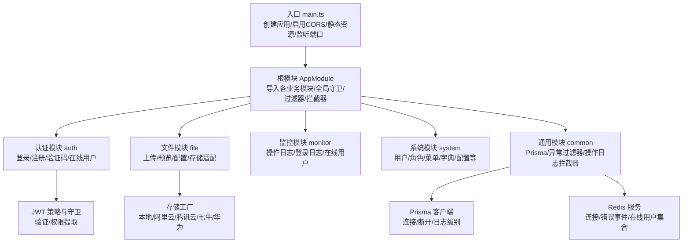
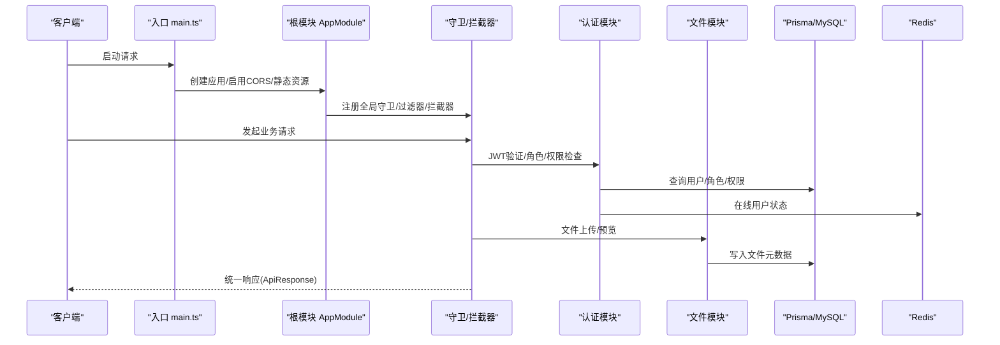
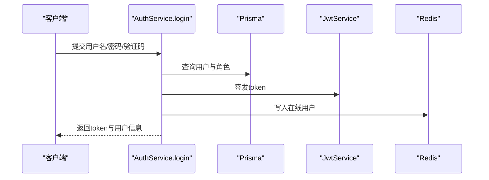
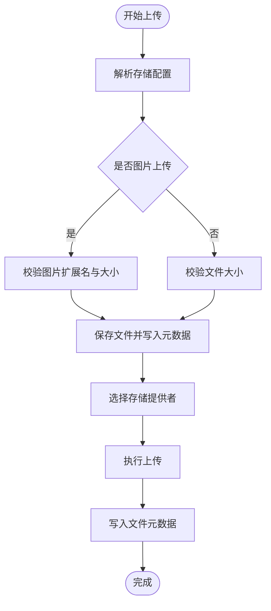
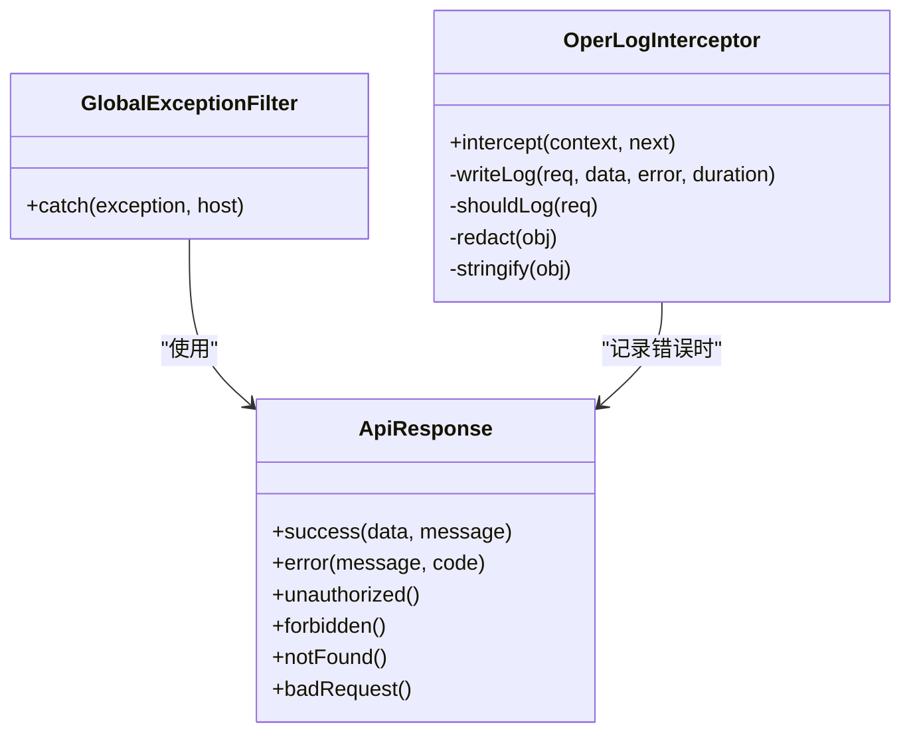
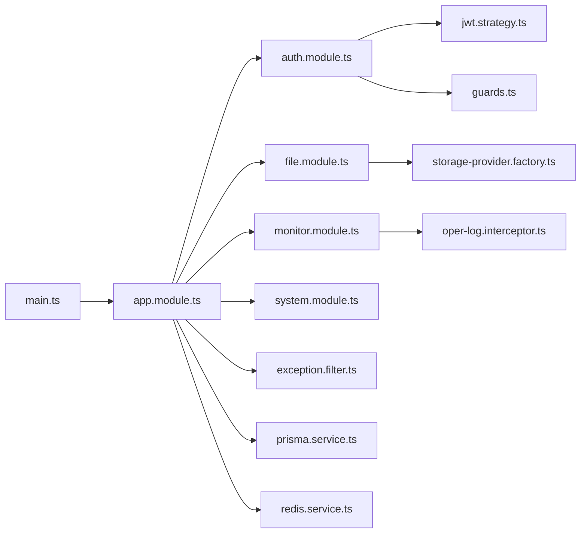

# 故障排查

<cite>
**本文引用的文件**
- [apps/backend/src/main.ts](file://apps/backend/src/main.ts)
- [apps/backend/src/app.module.ts](file://apps/backend/src/app.module.ts)
- [apps/backend/src/config/env.config.ts](file://apps/backend/src/config/env.config.ts)
- [apps/backend/src/common/prisma.service.ts](file://apps/backend/src/common/prisma.service.ts)
- [apps/backend/src/cache/redis.service.ts](file://apps/backend/src/cache/redis.service.ts)
- [apps/backend/src/auth/auth.service.ts](file://apps/backend/src/auth/auth.service.ts)
- [apps/backend/src/auth/jwt.strategy.ts](file://apps/backend/src/auth/jwt.strategy.ts)
- [apps/backend/src/auth/guards.ts](file://apps/backend/src/auth/guards.ts)
- [apps/backend/src/common/exception.filter.ts](file://apps/backend/src/common/exception.filter.ts)
- [apps/backend/src/common/oper-log.interceptor.ts](file://apps/backend/src/common/oper-log.interceptor.ts)
- [apps/backend/src/common/api-response.ts](file://apps/backend/src/common/api-response.ts)
- [apps/backend/src/modules/file/file.service.ts](file://apps/backend/src/modules/file/file.service.ts)
- [apps/backend/src/modules/file/storage/storage-provider.factory.ts](file://apps/backend/src/modules/file/storage/storage-provider.factory.ts)
- [apps/backend/prisma/schema.prisma](file://apps/backend/prisma/schema.prisma)
</cite>

## 目录
1. [简介](#简介)
2. [项目结构](#项目结构)
3. [核心组件](#核心组件)
4. [架构总览](#架构总览)
5. [详细组件分析](#详细组件分析)
6. [依赖关系分析](#依赖关系分析)
7. [性能问题诊断](#性能问题诊断)
8. [日志与监控](#日志与监控)
9. [调试工具使用](#调试工具使用)
10. [网络问题排查](#网络问题排查)
11. [环境问题识别与修复](#环境问题识别与修复)
12. [应急响应与恢复策略](#应急响应与恢复策略)
13. [结论](#结论)

## 简介
本指南面向运维与开发人员，围绕启动失败、数据库连接问题、JWT认证错误、文件上传失败等常见问题，提供可操作的诊断步骤与解决方案；同时覆盖日志分析方法、调试工具使用、性能问题定位、网络问题排查、环境问题识别与修复，以及监控告警与应急响应流程，帮助在生产环境中快速恢复服务。

## 项目结构
后端采用 NestJS 架构，模块化清晰：认证、系统管理、监控、文件存储、定时任务等模块按功能划分；全局拦截器与异常过滤器统一处理请求链路与错误输出；数据库通过 Prisma 访问 MySQL；缓存使用 Redis；静态资源通过 Express 提供文件下载。

图表来源
- [apps/backend/src/main.ts:1-48](file://apps/backend/src/main.ts#L1-L48)
- [apps/backend/src/app.module.ts:18-59](file://apps/backend/src/app.module.ts#L18-L59)
- [apps/backend/src/auth/jwt.strategy.ts:1-78](file://apps/backend/src/auth/jwt.strategy.ts#L1-L78)
- [apps/backend/src/modules/file/storage/storage-provider.factory.ts:1-25](file://apps/backend/src/modules/file/storage/storage-provider.factory.ts#L1-L25)
- [apps/backend/src/common/prisma.service.ts:1-22](file://apps/backend/src/common/prisma.service.ts#L1-L22)
- [apps/backend/src/cache/redis.service.ts:1-128](file://apps/backend/src/cache/redis.service.ts#L1-L128)

章节来源
- [apps/backend/src/main.ts:1-48](file://apps/backend/src/main.ts#L1-L48)
- [apps/backend/src/app.module.ts:18-59](file://apps/backend/src/app.module.ts#L18-L59)

## 核心组件
- 应用入口与全局配置：设置 CORS、全局前缀、全局校验管道、Swagger 文档、静态资源（上传文件）、监听端口。
- 全局模块与守卫：全局异常过滤器、响应拦截器、操作日志拦截器、限流守卫。
- 数据库与缓存：Prisma 连接 MySQL；Redis 连接与在线用户管理。
- 认证与授权：JWT 策略与守卫、角色/权限守卫、验证码与登录日志。
- 文件存储：多云/本地存储抽象与工厂模式，支持上传、预览、删除与配置持久化。

章节来源
- [apps/backend/src/main.ts:11-46](file://apps/backend/src/main.ts#L11-L46)
- [apps/backend/src/app.module.ts:18-59](file://apps/backend/src/app.module.ts#L18-L59)
- [apps/backend/src/common/prisma.service.ts:8-21](file://apps/backend/src/common/prisma.service.ts#L8-L21)
- [apps/backend/src/cache/redis.service.ts:8-27](file://apps/backend/src/cache/redis.service.ts#L8-L27)
- [apps/backend/src/auth/jwt.strategy.ts:13-43](file://apps/backend/src/auth/jwt.strategy.ts#L13-L43)
- [apps/backend/src/modules/file/storage/storage-provider.factory.ts:8-24](file://apps/backend/src/modules/file/storage/storage-provider.factory.ts#L8-L24)

## 架构总览
后端服务启动后，请求经由全局守卫与拦截器进入业务模块；认证模块负责用户鉴权与权限提取；文件模块根据配置选择存储后端；监控模块记录操作日志；异常过滤器统一返回标准响应体。

图表来源
- [apps/backend/src/main.ts:8-46](file://apps/backend/src/main.ts#L8-L46)
- [apps/backend/src/app.module.ts:39-56](file://apps/backend/src/app.module.ts#L39-L56)
- [apps/backend/src/auth/jwt.strategy.ts:20-43](file://apps/backend/src/auth/jwt.strategy.ts#L20-L43)
- [apps/backend/src/modules/file/file.service.ts:150-209](file://apps/backend/src/modules/file/file.service.ts#L150-L209)
- [apps/backend/src/common/prisma.service.ts:14-21](file://apps/backend/src/common/prisma.service.ts#L14-L21)
- [apps/backend/src/cache/redis.service.ts:83-99](file://apps/backend/src/cache/redis.service.ts#L83-L99)

## 详细组件分析

### 启动失败排查
- 端口占用或未设置：检查端口环境变量与监听逻辑。
- CORS 未启用导致跨域失败：确认已启用 CORS。
- 静态资源路径不正确：确认 uploads 目录存在且路径拼接正确。
- 全局前缀与路由不匹配：核对全局前缀与前端调用路径一致。
- 全局校验管道报错：检查 DTO 参数与白名单/转换配置。

建议步骤
- 查看启动日志输出的端口与文档地址。
- 使用 curl 或 Postman 访问健康端点与文档端点。
- 临时关闭拦截器/守卫复现问题以定位具体模块。

章节来源
- [apps/backend/src/main.ts:11-46](file://apps/backend/src/main.ts#L11-L46)
- [apps/backend/src/app.module.ts:39-56](file://apps/backend/src/app.module.ts#L39-L56)

### 数据库连接问题
- 连接字符串：确认 DATABASE_URL 环境变量正确。
- Prisma 日志级别：当前为 error/warn，便于发现连接/执行异常。
- 连接生命周期：onModuleInit/onModuleDestroy 中显式 connect/disconnect。
- 表结构与索引：参考 schema.prisma 的索引设计，避免慢查询。

建议步骤
- 手动连接数据库验证连通性与权限。
- 开启数据库慢查询日志，定位慢 SQL。
- 检查连接池配置与并发量。

章节来源
- [apps/backend/src/common/prisma.service.ts:8-21](file://apps/backend/src/common/prisma.service.ts#L8-L21)
- [apps/backend/prisma/schema.prisma:13-38](file://apps/backend/prisma/schema.prisma#L13-L38)

### JWT 认证错误
- 密钥与过期时间：从环境配置读取，需确保一致。
- 策略验证：校验用户状态、是否删除、权限提取。
- 登录日志：失败与成功均写入登录日志，便于审计。
- 在线用户：登录后写入 Redis，在线集合维护。

常见症状与定位
- 401 未授权：检查 Authorization 头、密钥、用户状态。
- 权限不足：检查用户角色与菜单权限映射。
- 会话失效：检查过期时间与 Redis TTL。

图表来源
- [apps/backend/src/auth/auth.service.ts:29-89](file://apps/backend/src/auth/auth.service.ts#L29-L89)
- [apps/backend/src/auth/jwt.strategy.ts:20-43](file://apps/backend/src/auth/jwt.strategy.ts#L20-L43)
- [apps/backend/src/cache/redis.service.ts:83-99](file://apps/backend/src/cache/redis.service.ts#L83-L99)

章节来源
- [apps/backend/src/auth/auth.service.ts:29-89](file://apps/backend/src/auth/auth.service.ts#L29-L89)
- [apps/backend/src/auth/jwt.strategy.ts:13-43](file://apps/backend/src/auth/jwt.strategy.ts#L13-L43)
- [apps/backend/src/cache/redis.service.ts:83-99](file://apps/backend/src/cache/redis.service.ts#L83-L99)

### 文件上传失败
- 上传大小限制：区分图片与普通文件的最大值。
- 存储后端：本地/云存储配置，键名与前缀。
- 预览与直链：本地需安全路径校验，云存储重定向到公共 URL。
- 删除与回滚：远程对象缺失时仍应保留元数据删除标记。

排查要点
- 检查配置项与环境变量优先级。
- 本地上传目录权限与磁盘空间。
- 云存储 AK/SK/Endpoint/Bucket/Prefix 是否正确。
- 上传缓冲区与内存限制。

图表来源
- [apps/backend/src/modules/file/file.service.ts:150-209](file://apps/backend/src/modules/file/file.service.ts#L150-L209)
- [apps/backend/src/modules/file/storage/storage-provider.factory.ts:8-24](file://apps/backend/src/modules/file/storage/storage-provider.factory.ts#L8-L24)

章节来源
- [apps/backend/src/modules/file/file.service.ts:150-209](file://apps/backend/src/modules/file/file.service.ts#L150-L209)

### 异常与统一响应
- 全局异常过滤器：捕获未处理异常，输出标准 ApiResponse 错误体。
- 操作日志拦截器：记录请求/响应、错误、耗时、IP 等，敏感字段脱敏。
- API 响应体：统一 code/data/message 结构，便于前端一致处理。

图表来源
- [apps/backend/src/common/exception.filter.ts:12-37](file://apps/backend/src/common/exception.filter.ts#L12-L37)
- [apps/backend/src/common/oper-log.interceptor.ts:12-111](file://apps/backend/src/common/oper-log.interceptor.ts#L12-L111)
- [apps/backend/src/common/api-response.ts:1-35](file://apps/backend/src/common/api-response.ts#L1-L35)

章节来源
- [apps/backend/src/common/exception.filter.ts:12-37](file://apps/backend/src/common/exception.filter.ts#L12-L37)
- [apps/backend/src/common/oper-log.interceptor.ts:12-111](file://apps/backend/src/common/oper-log.interceptor.ts#L12-L111)
- [apps/backend/src/common/api-response.ts:1-35](file://apps/backend/src/common/api-response.ts#L1-L35)

## 依赖关系分析
- 入口依赖根模块，根模块聚合业务模块与全局中间件。
- 认证模块依赖 Prisma 与 Redis，提供用户与在线状态能力。
- 文件模块依赖存储工厂与 Prisma，实现多后端抽象与元数据持久化。
- 监控模块依赖 Prisma 记录日志，异常过滤器与拦截器贯穿所有请求。

图表来源
- [apps/backend/src/main.ts:1-48](file://apps/backend/src/main.ts#L1-L48)
- [apps/backend/src/app.module.ts:18-59](file://apps/backend/src/app.module.ts#L18-L59)
- [apps/backend/src/auth/jwt.strategy.ts:1-78](file://apps/backend/src/auth/jwt.strategy.ts#L1-L78)
- [apps/backend/src/auth/guards.ts:1-51](file://apps/backend/src/auth/guards.ts#L1-L51)
- [apps/backend/src/modules/file/storage/storage-provider.factory.ts:1-25](file://apps/backend/src/modules/file/storage/storage-provider.factory.ts#L1-L25)
- [apps/backend/src/common/oper-log.interceptor.ts:1-111](file://apps/backend/src/common/oper-log.interceptor.ts#L1-L111)
- [apps/backend/src/common/exception.filter.ts:1-37](file://apps/backend/src/common/exception.filter.ts#L1-L37)
- [apps/backend/src/common/prisma.service.ts:1-22](file://apps/backend/src/common/prisma.service.ts#L1-L22)
- [apps/backend/src/cache/redis.service.ts:1-128](file://apps/backend/src/cache/redis.service.ts#L1-L128)

## 性能问题诊断
- CPU 占用过高
  - 排查点：高频认证/权限计算、大对象 JSON 序列化、循环/递归构建菜单树。
  - 建议：引入性能探针，定位热点函数；优化权限提取与菜单树构建。
- 内存泄漏
  - 排查点：长连接/定时任务、未释放的事件监听、拦截器中闭包持有上下文。
  - 建议：使用内存快照对比，检查 Redis 连接生命周期与 Prisma 客户端。
- 数据库查询缓慢
  - 排查点：缺少索引、复杂 JOIN、未分页/排序不当。
  - 建议：开启慢查询日志，结合 schema.prisma 索引设计优化 SQL。
- 缓存命中率低
  - 排查点：TTL 设置不合理、键命名不规范、频繁 flush。
  - 建议：统计 info 输出，调整 TTL 与键空间规划。

章节来源
- [apps/backend/src/auth/auth.service.ts:147-187](file://apps/backend/src/auth/auth.service.ts#L147-L187)
- [apps/backend/src/common/prisma.service.ts:8-21](file://apps/backend/src/common/prisma.service.ts#L8-L21)
- [apps/backend/src/cache/redis.service.ts:70-80](file://apps/backend/src/cache/redis.service.ts#L70-L80)

## 日志与监控
- 后端错误日志
  - 全局异常过滤器：记录未处理异常堆栈与状态码。
  - Prisma 日志：仅记录 error/warn，便于聚焦问题。
  - Redis 连接事件：连接成功/错误事件输出，辅助定位连接问题。
- 前端控制台日志
  - 浏览器 Network 面板：观察请求/响应、状态码、耗时。
  - Console 面板：关注 JS 报错与警告。
- 数据库慢查询日志
  - 开启慢查询分析，结合 schema.prisma 索引设计进行优化。
- 操作日志与审计
  - 操作日志拦截器：记录请求参数（敏感字段脱敏）、响应结果、错误信息、耗时、IP。
  - 登录日志：记录登录状态与消息，便于追踪异常登录。

章节来源
- [apps/backend/src/common/exception.filter.ts:16-36](file://apps/backend/src/common/exception.filter.ts#L16-L36)
- [apps/backend/src/common/prisma.service.ts:10-11](file://apps/backend/src/common/prisma.service.ts#L10-L11)
- [apps/backend/src/cache/redis.service.ts:16-22](file://apps/backend/src/cache/redis.service.ts#L16-L22)
- [apps/backend/src/common/oper-log.interceptor.ts:30-61](file://apps/backend/src/common/oper-log.interceptor.ts#L30-L61)

## 调试工具使用
- 浏览器开发者工具
  - Network：查看 API 请求/响应、CORS、跨域头。
  - Console：定位前端脚本报错与警告。
- Node.js 调试器
  - 使用 --inspect 启动，配合 VS Code/Chrome DevTools 断点调试。
- 数据库客户端
  - 使用 MySQL 客户端连接验证连通性与权限，执行 EXPLAIN 分析慢查询。
- Redis 客户端
  - 使用 redis-cli 检查连接、info 输出、键空间与 TTL。

章节来源
- [apps/backend/src/main.ts:42-46](file://apps/backend/src/main.ts#L42-L46)
- [apps/backend/src/common/prisma.service.ts:14-21](file://apps/backend/src/common/prisma.service.ts#L14-L21)
- [apps/backend/src/cache/redis.service.ts:70-80](file://apps/backend/src/cache/redis.service.ts#L70-L80)

## 网络问题排查
- API 调用失败
  - 检查全局前缀与路由是否匹配；确认 Swagger 文档可用。
  - 关注 CORS 配置与跨域头。
- 跨域问题
  - 确认已启用 CORS；检查 Origin/Headers/Methods。
- 代理配置错误
  - 反向代理需透传 Authorization 头与 Cookie；确保静态资源路径正确。

章节来源
- [apps/backend/src/main.ts:11-15](file://apps/backend/src/main.ts#L11-L15)
- [apps/backend/src/main.ts:37-40](file://apps/backend/src/main.ts#L37-L40)

## 环境问题识别与修复
- 环境变量配置错误
  - 关键变量：APP_PORT、JWT_SECRET、JWT_EXPIRES_IN、DATABASE_URL、REDIS_*、FILE_*、OSS_*。
  - 优先级：配置文件默认值 < 环境变量。
- 依赖版本冲突
  - 使用包管理器锁定版本；清理缓存后重新安装。
- 权限问题
  - 本地上传目录需具备写权限；数据库账户需具备相应权限。

章节来源
- [apps/backend/src/config/env.config.ts:3-47](file://apps/backend/src/config/env.config.ts#L3-L47)
- [apps/backend/src/modules/file/file.service.ts:244-257](file://apps/backend/src/modules/file/file.service.ts#L244-L257)

## 应急响应与恢复策略
- 快速降级
  - 临时关闭非关键模块（如定时任务），释放资源。
  - 降低日志级别至 warn，减少 IO 压力。
- 限流与熔断
  - 利用全局限流守卫保护下游依赖。
- 回滚与修复
  - 回滚最近一次变更；修复配置后重启。
- 监控告警
  - 基于操作日志与系统指标设置阈值告警（错误率、P95/P99 延迟、连接数）。

章节来源
- [apps/backend/src/app.module.ts:24-29](file://apps/backend/src/app.module.ts#L24-L29)
- [apps/backend/src/common/oper-log.interceptor.ts:15-28](file://apps/backend/src/common/oper-log.interceptor.ts#L15-L28)

## 结论
通过明确的启动流程、统一的异常与日志体系、完善的认证与文件存储抽象，本项目具备良好的可观测性与可维护性。按照本指南的诊断步骤与工具使用方法，可快速定位并解决启动、认证、数据库、文件上传、性能与网络等常见问题，并建立持续的监控与应急响应机制。