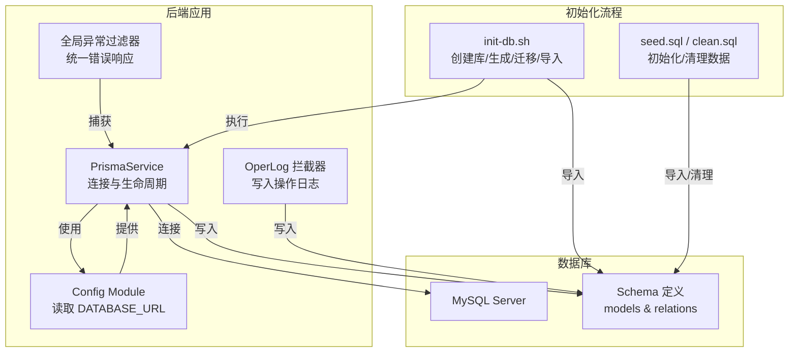
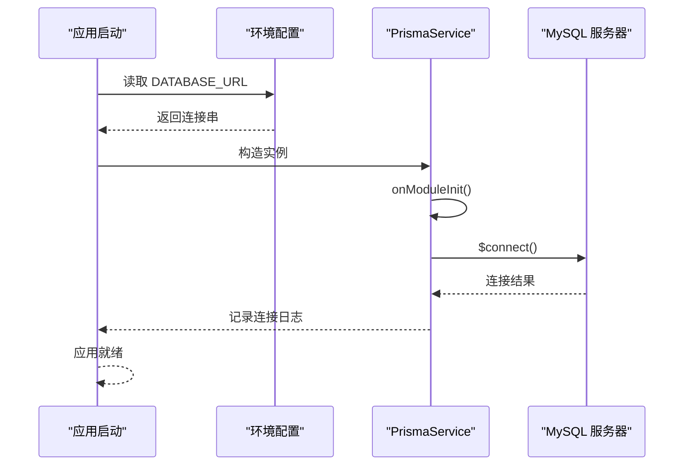
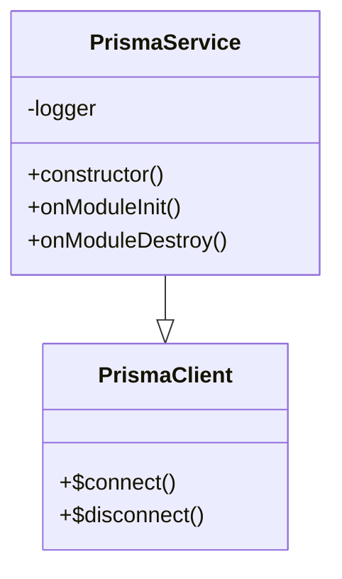
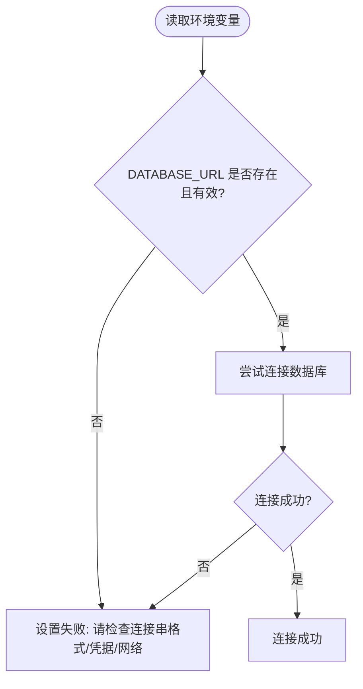
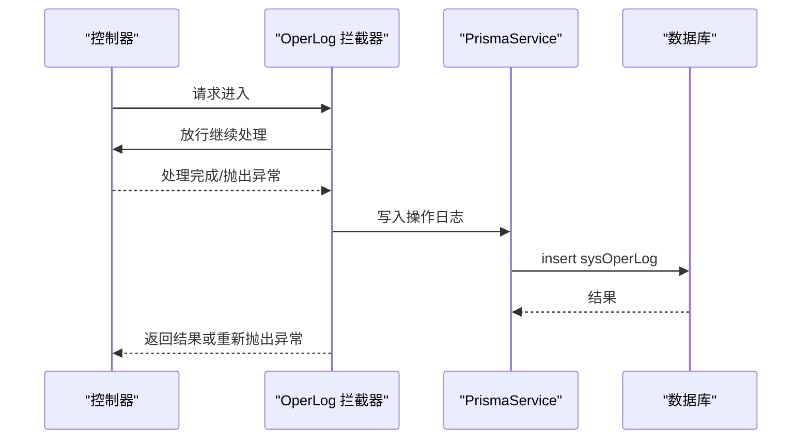
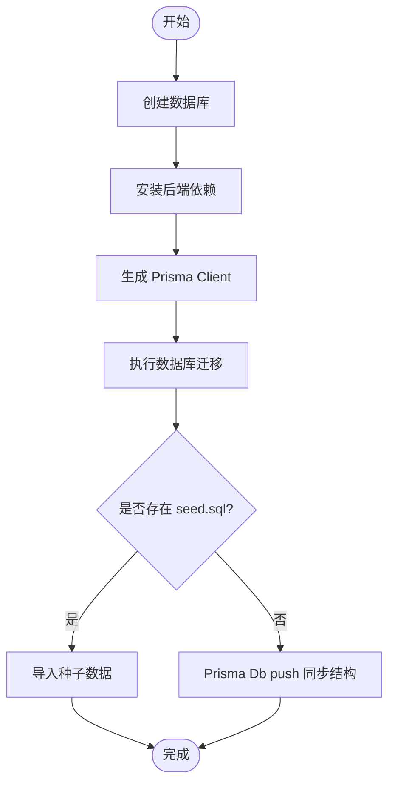
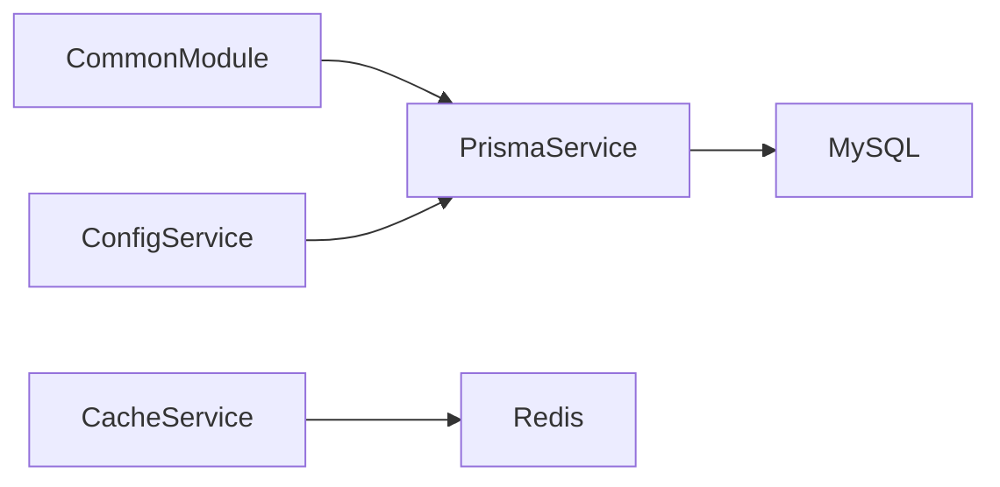

# 数据库连接问题

<cite>
**本文引用的文件**
- [schema.prisma](file://apps/backend/prisma/schema.prisma)
- [prisma.service.ts](file://apps/backend/src/common/prisma.service.ts)
- [env.config.ts](file://apps/backend/src/config/env.config.ts)
- [config.service.ts](file://apps/backend/src/modules/system/config/config.service.ts)
- [common.module.ts](file://apps/backend/src/common/common.module.ts)
- [oper-log.interceptor.ts](file://apps/backend/src/common/oper-log.interceptor.ts)
- [exception.filter.ts](file://apps/backend/src/common/exception.filter.ts)
- [init-db.sh](file://scripts/init-db.sh)
- [clean.sql](file://scripts/clean.sql)
- [seed.sql](file://scripts/seed.sql)
- [cache.service.ts](file://apps/backend/src/modules/monitor/cache/cache.service.ts)
- [server.service.ts](file://apps/backend/src/modules/monitor/server/server.service.ts)
</cite>

## 目录
1. [简介](#简介)
2. [项目结构](#项目结构)
3. [核心组件](#核心组件)
4. [架构总览](#架构总览)
5. [详细组件分析](#详细组件分析)
6. [依赖分析](#依赖分析)
7. [性能考虑](#性能考虑)
8. [故障排查指南](#故障排查指南)
9. [结论](#结论)
10. [附录](#附录)

## 简介
本指南聚焦于数据库连接问题的专业排查，覆盖 MySQL 连接失败的常见原因（连接字符串配置错误、网络连通性、权限不足、服务未启动等）与 Prisma ORM 的连接问题（迁移失败、连接池配置、事务超时），并提供数据库性能诊断技巧（慢查询分析、连接数限制、死锁检测）、备份与恢复常见问题、以及监控指标解读与预警机制建议。文档以仓库中实际代码为依据，结合初始化脚本与日志拦截器，帮助快速定位与解决问题。

## 项目结构
本项目采用 NestJS 后端 + Prisma ORM + MySQL 的典型架构：
- 数据库模型定义位于 Prisma Schema 中，声明了 MySQL 数据源与各业务模型。
- PrismaService 继承 PrismaClient，在应用启动时自动连接数据库，并在销毁时断开。
- 环境变量通过 Config Module 注入，其中包含 DATABASE_URL。
- 日志拦截器将操作日志写入数据库，便于追踪连接与业务异常。
- 初始化脚本负责数据库创建、Prisma Client 生成、迁移与种子数据导入。

**图示来源**
- [prisma.service.ts:1-22](file://apps/backend/src/common/prisma.service.ts#L1-L22)
- [env.config.ts:24-26](file://apps/backend/src/config/env.config.ts#L24-L26)
- [oper-log.interceptor.ts:30-61](file://apps/backend/src/common/oper-log.interceptor.ts#L30-L61)
- [init-db.sh:24-79](file://scripts/init-db.sh#L24-L79)
- [seed.sql:1-186](file://scripts/seed.sql#L1-L186)
- [clean.sql:1-86](file://scripts/clean.sql#L1-L86)

**章节来源**
- [prisma.service.ts:1-22](file://apps/backend/src/common/prisma.service.ts#L1-L22)
- [env.config.ts:24-26](file://apps/backend/src/config/env.config.ts#L24-L26)
- [init-db.sh:1-85](file://scripts/init-db.sh#L1-L85)

## 核心组件
- PrismaService：负责数据库连接生命周期（连接/断开），并在连接成功时输出日志。
- Config Module：从环境变量读取 DATABASE_URL 并暴露给应用。
- OperLog 拦截器：在请求结束后将操作日志写入数据库，便于排查连接与业务异常。
- 全局异常过滤器：统一捕获异常并返回标准化响应，有助于定位连接与业务错误。
- 初始化脚本：自动化创建数据库、生成 Prisma Client、执行迁移与导入种子数据。

**章节来源**
- [prisma.service.ts:1-22](file://apps/backend/src/common/prisma.service.ts#L1-L22)
- [env.config.ts:24-26](file://apps/backend/src/config/env.config.ts#L24-L26)
- [oper-log.interceptor.ts:1-111](file://apps/backend/src/common/oper-log.interceptor.ts#L1-L111)
- [exception.filter.ts:1-37](file://apps/backend/src/common/exception.filter.ts#L1-L37)
- [init-db.sh:1-85](file://scripts/init-db.sh#L1-L85)

## 架构总览
下图展示数据库连接在应用启动与运行期的关键交互：

**图示来源**
- [prisma.service.ts:14-17](file://apps/backend/src/common/prisma.service.ts#L14-L17)
- [env.config.ts:24-26](file://apps/backend/src/config/env.config.ts#L24-L26)

## 详细组件分析

### PrismaService 连接与生命周期
- 在构造函数中配置日志级别为 error/warn，便于捕获连接与执行异常。
- onModuleInit 自动调用 $connect()，并在连接成功后输出“Database connected”日志。
- onModuleDestroy 调用 $disconnect()，确保优雅关闭。

**图示来源**
- [prisma.service.ts:1-22](file://apps/backend/src/common/prisma.service.ts#L1-L22)

**章节来源**
- [prisma.service.ts:1-22](file://apps/backend/src/common/prisma.service.ts#L1-L22)

### 环境变量与数据库连接串
- 数据库连接串通过 Config Module 的 databaseConfig 暴露，来源于环境变量 DATABASE_URL。
- 若该变量缺失或格式不正确，将导致连接失败。

**图示来源**
- [env.config.ts:24-26](file://apps/backend/src/config/env.config.ts#L24-L26)

**章节来源**
- [env.config.ts:24-26](file://apps/backend/src/config/env.config.ts#L24-L26)

### 操作日志写入与异常捕获
- OperLog 拦截器在请求完成后将操作日志写入 sysOperLog 表，若写入失败会静默忽略，保证业务不受影响。
- 全局异常过滤器统一捕获异常并返回标准化响应，便于定位连接与业务错误。

**图示来源**
- [oper-log.interceptor.ts:15-61](file://apps/backend/src/common/oper-log.interceptor.ts#L15-L61)
- [exception.filter.ts:16-36](file://apps/backend/src/common/exception.filter.ts#L16-L36)

**章节来源**
- [oper-log.interceptor.ts:1-111](file://apps/backend/src/common/oper-log.interceptor.ts#L1-L111)
- [exception.filter.ts:1-37](file://apps/backend/src/common/exception.filter.ts#L1-L37)

### 初始化脚本与迁移流程
- init-db.sh 负责创建数据库、安装依赖、生成 Prisma Client、执行迁移、导入种子数据。
- 若迁移失败，脚本会尝试带参数重试；若仍失败则退出并提示检查连接与权限。

**图示来源**
- [init-db.sh:24-79](file://scripts/init-db.sh#L24-L79)
- [seed.sql:1-186](file://scripts/seed.sql#L1-L186)
- [clean.sql:1-86](file://scripts/clean.sql#L1-L86)

**章节来源**
- [init-db.sh:1-85](file://scripts/init-db.sh#L1-L85)
- [seed.sql:1-186](file://scripts/seed.sql#L1-L186)
- [clean.sql:1-86](file://scripts/clean.sql#L1-L86)

## 依赖分析
- PrismaService 由全局模块导出，供其他模块注入使用（如配置模块）。
- 配置模块通过 PrismaService 访问数据库，实现配置项的增删改查与缓存同步。
- 监控模块中的缓存服务依赖 RedisService，与数据库形成互补的监控能力。

**图示来源**
- [common.module.ts:1-9](file://apps/backend/src/common/common.module.ts#L1-L9)
- [config.service.ts:1-56](file://apps/backend/src/modules/system/config/config.service.ts#L1-L56)
- [cache.service.ts:1-29](file://apps/backend/src/modules/monitor/cache/cache.service.ts#L1-L29)

**章节来源**
- [common.module.ts:1-9](file://apps/backend/src/common/common.module.ts#L1-L9)
- [config.service.ts:1-56](file://apps/backend/src/modules/system/config/config.service.ts#L1-L56)
- [cache.service.ts:1-29](file://apps/backend/src/modules/monitor/cache/cache.service.ts#L1-L29)

## 性能考虑
- 慢查询分析：利用操作日志拦截器记录的 duration 字段，筛选耗时长的接口与方法，结合数据库慢查询日志定位热点 SQL。
- 连接数限制：监控数据库最大连接数与当前活跃连接数，避免连接池耗尽；可通过调整连接池参数与应用并发策略缓解。
- 死锁检测：关注操作日志中的错误信息与数据库死锁告警，优化事务粒度与锁顺序，减少并发冲突。
- 缓存与数据库协同：通过缓存服务定期刷新配置到 Redis，降低数据库压力；同时注意缓存失效策略与一致性。

[本节为通用性能指导，无需特定文件引用]

## 故障排查指南

### 一、MySQL 连接失败排查清单
- 检查连接串格式与字段完整性（主机、端口、数据库名、用户名、密码、字符集等）。
- 确认网络可达性：从应用服务器 ping/ telnet 到数据库服务器端口。
- 校验权限：确认用户具备目标数据库与表的访问权限，必要时授予 GRANT 权限。
- 服务状态：确认 MySQL 服务已启动，监听端口正常。
- TLS/SSL：若启用加密连接，检查证书与客户端配置匹配。
- 连接池与超时：检查应用侧连接池大小、空闲超时、连接超时等参数，避免频繁重建连接。

**章节来源**
- [env.config.ts:24-26](file://apps/backend/src/config/env.config.ts#L24-L26)
- [prisma.service.ts:14-17](file://apps/backend/src/common/prisma.service.ts#L14-L17)

### 二、Prisma 连接问题排查
- 连接字符串注入：确认 DATABASE_URL 已正确注入到运行环境，且未被覆盖或拼接错误。
- 迁移失败：
  - 查看 init-db.sh 的迁移步骤与回退逻辑，优先执行带参数的迁移命令。
  - 若迁移失败，检查数据库权限与网络连通性，确认可写入系统表。
- 连接池配置：Prisma 默认连接池行为受底层驱动影响，如遇高并发场景，需评估连接池上限与超时设置。
- 事务超时：对长事务进行拆分，缩短事务时间；在拦截器中记录耗时，定位超时点。

**章节来源**
- [init-db.sh:53-67](file://scripts/init-db.sh#L53-L67)
- [prisma.service.ts:1-22](file://apps/backend/src/common/prisma.service.ts#L1-L22)

### 三、数据库性能问题诊断
- 慢查询定位：结合操作日志 duration 字段与数据库慢查询日志，识别慢 SQL 与热点接口。
- 连接数瓶颈：观察数据库最大连接数与当前活跃连接，必要时扩容或优化应用连接池。
- 死锁检测：关注数据库死锁告警与操作日志中的异常，优化事务顺序与粒度。
- 索引与统计：检查索引缺失与统计信息过期，定期更新以提升查询效率。

**章节来源**
- [oper-log.interceptor.ts:15-28](file://apps/backend/src/common/oper-log.interceptor.ts#L15-L28)

### 四、备份与恢复常见问题
- 备份策略：定期全量备份 + 增量/归档日志，确保可恢复到指定时间点。
- 恢复验证：在隔离环境执行恢复演练，验证数据一致性与业务可用性。
- 初始化脚本配合：使用 clean.sql 清理旧数据，seed.sql 导入标准数据，确保恢复后系统可正常启动。

**章节来源**
- [init-db.sh:69-79](file://scripts/init-db.sh#L69-L79)
- [clean.sql:1-86](file://scripts/clean.sql#L1-L86)
- [seed.sql:1-186](file://scripts/seed.sql#L1-L186)

### 五、监控指标与预警机制
- 连接层指标：连接数、连接失败率、平均连接时间、排队等待时间。
- 查询层指标：慢查询比例、QPS、P95/P99 延迟、错误率。
- 事务层指标：事务提交/回滚次数、平均持续时间、死锁次数。
- 应用层指标：操作日志写入延迟、异常率、业务接口耗时分布。
- 预警建议：基于阈值触发告警（如连接失败率突增、慢查询占比超阈、事务超时频繁），并联动自动扩缩容或熔断降级。

**章节来源**
- [oper-log.interceptor.ts:15-28](file://apps/backend/src/common/oper-log.interceptor.ts#L15-L28)
- [cache.service.ts:1-29](file://apps/backend/src/modules/monitor/cache/cache.service.ts#L1-L29)
- [server.service.ts:1-4](file://apps/backend/src/modules/monitor/server/server.service.ts#L1-L4)

## 结论
本指南基于仓库中的 Prisma 配置、连接服务、拦截器与初始化脚本，提供了从连接串校验、迁移流程、性能诊断到备份恢复与监控预警的完整排查路径。建议在生产环境中结合日志拦截器与数据库慢查询日志，持续优化连接池与事务设计，完善监控与告警体系，以保障系统的稳定性与可维护性。

## 附录

### A. 关键文件速览
- Prisma 数据源与模型：[schema.prisma:5-8](file://apps/backend/prisma/schema.prisma#L5-L8)
- Prisma 连接服务：[prisma.service.ts:1-22](file://apps/backend/src/common/prisma.service.ts#L1-L22)
- 环境变量配置：[env.config.ts:24-26](file://apps/backend/src/config/env.config.ts#L24-L26)
- 配置模块使用数据库：[config.service.ts:1-56](file://apps/backend/src/modules/system/config/config.service.ts#L1-L56)
- 操作日志拦截器：[oper-log.interceptor.ts:1-111](file://apps/backend/src/common/oper-log.interceptor.ts#L1-L111)
- 全局异常过滤器：[exception.filter.ts:1-37](file://apps/backend/src/common/exception.filter.ts#L1-L37)
- 初始化脚本：[init-db.sh:1-85](file://scripts/init-db.sh#L1-L85)
- 种子数据脚本：[seed.sql:1-186](file://scripts/seed.sql#L1-L186)
- 清理数据脚本：[clean.sql:1-86](file://scripts/clean.sql#L1-L86)
- 缓存监控服务：[cache.service.ts:1-29](file://apps/backend/src/modules/monitor/cache/cache.service.ts#L1-L29)
- 服务器监控服务：[server.service.ts:1-4](file://apps/backend/src/modules/monitor/server/server.service.ts#L1-L4)