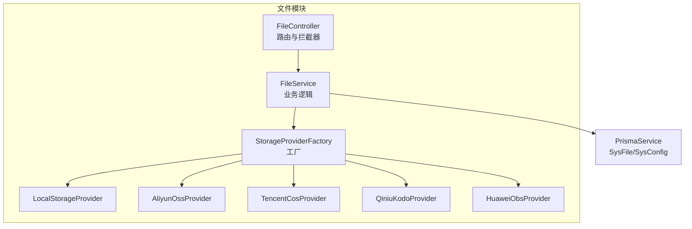
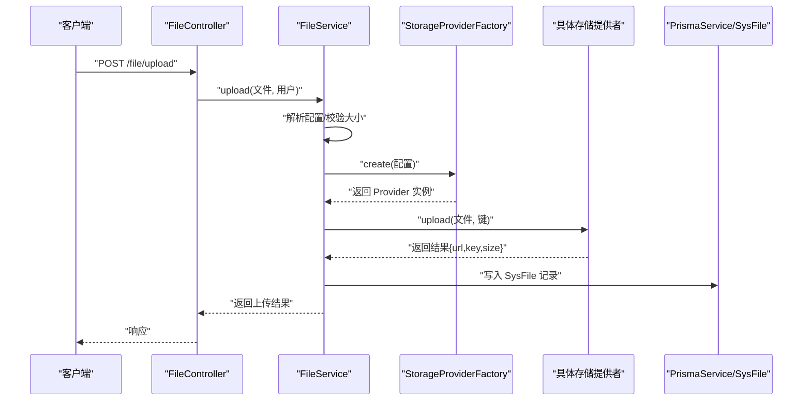
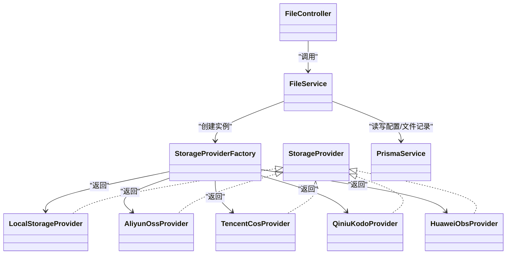
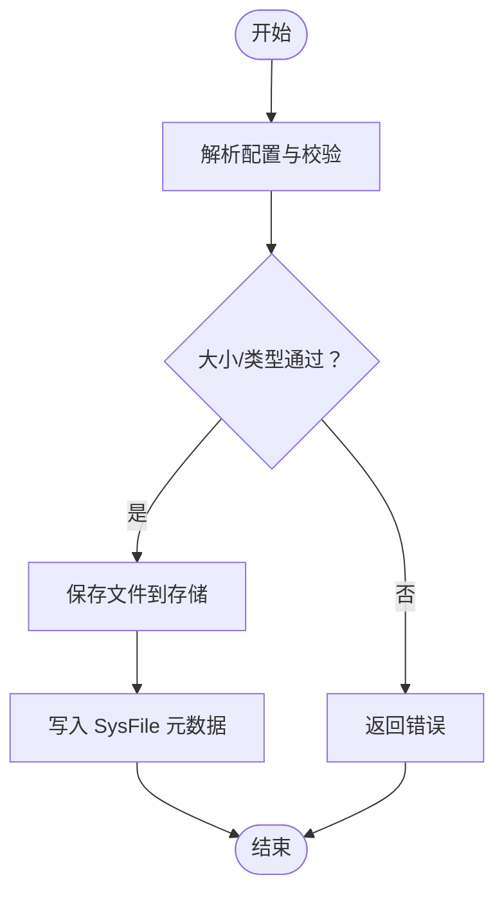
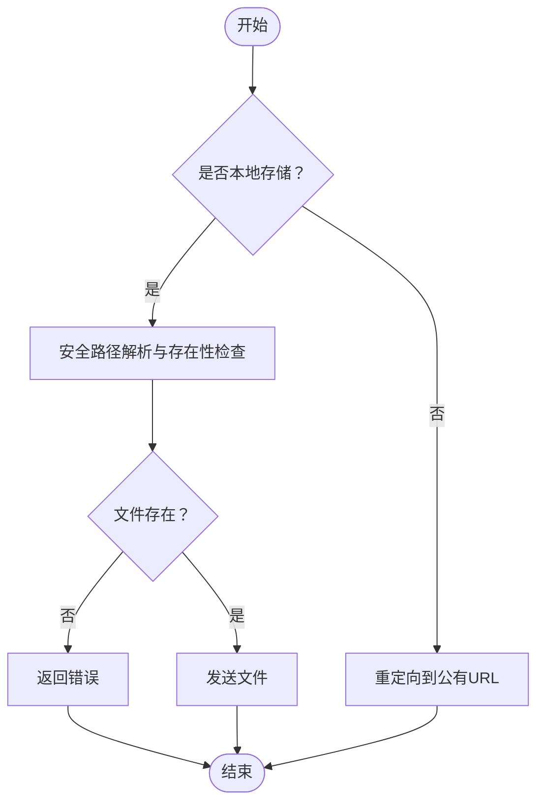

# 文件上传问题

<cite>
**本文引用的文件**
- [apps/backend/src/modules/file/file.controller.ts](file://apps/backend/src/modules/file/file.controller.ts)
- [apps/backend/src/modules/file/file.service.ts](file://apps/backend/src/modules/file/file.service.ts)
- [apps/backend/src/modules/file/file.module.ts](file://apps/backend/src/modules/file/file.module.ts)
- [apps/backend/src/modules/file/storage/storage-provider.factory.ts](file://apps/backend/src/modules/file/storage/storage-provider.factory.ts)
- [apps/backend/src/modules/file/storage/storage.types.ts](file://apps/backend/src/modules/file/storage/storage.types.ts)
- [apps/backend/src/modules/file/storage/storage.utils.ts](file://apps/backend/src/modules/file/storage/storage.utils.ts)
- [apps/backend/src/modules/file/storage/local.provider.ts](file://apps/backend/src/modules/file/storage/local.provider.ts)
- [apps/backend/src/modules/file/storage/aliyun-oss.provider.ts](file://apps/backend/src/modules/file/storage/aliyun-oss.provider.ts)
- [apps/backend/src/modules/file/storage/tencent-cos.provider.ts](file://apps/backend/src/modules/file/storage/tencent-cos.provider.ts)
- [apps/backend/src/modules/file/storage/qiniu-kodo.provider.ts](file://apps/backend/src/modules/file/storage/qiniu-kodo.provider.ts)
- [apps/backend/src/modules/file/storage/huawei-obs.provider.ts](file://apps/backend/src/modules/file/storage/huawei-obs.provider.ts)
- [apps/backend/src/common/prisma.service.ts](file://apps/backend/src/common/prisma.service.ts)
- [apps/backend/prisma/schema.prisma](file://apps/backend/prisma/schema.prisma)
</cite>

## 目录
1. [简介](#简介)
2. [项目结构](#项目结构)
3. [核心组件](#核心组件)
4. [架构总览](#架构总览)
5. [详细组件分析](#详细组件分析)
6. [依赖关系分析](#依赖关系分析)
7. [性能与容量管理](#性能与容量管理)
8. [故障排查指南](#故障排查指南)
9. [结论](#结论)
10. [附录](#附录)

## 简介
本指南聚焦于后端文件上传子系统在本项目中的实现与问题排查，覆盖以下关键主题：
- 上传失败的常见原因：大小限制、类型校验、存储空间与权限、路径安全等
- 多存储提供商（本地、阿里云OSS、腾讯云COS、七牛Kodo、华为OBS）的配置与排错
- 文件访问与URL生成问题的定位
- 进度监控与断点续传的调试思路
- 大文件、并发上传、压缩等高级场景的故障排除
- 存储性能优化与容量管理策略

## 项目结构
文件上传相关代码集中在后端应用的 file 模块中，采用“控制器-服务-存储提供者工厂-具体存储提供者”的分层设计；配置通过数据库 SysConfig 动态加载，支持多云厂商与本地存储切换。

图表来源
- [apps/backend/src/modules/file/file.controller.ts:1-100](file://apps/backend/src/modules/file/file.controller.ts#L1-100)
- [apps/backend/src/modules/file/file.service.ts:1-310](file://apps/backend/src/modules/file/file.service.ts#L1-310)
- [apps/backend/src/modules/file/storage/storage-provider.factory.ts:1-25](file://apps/backend/src/modules/file/storage/storage-provider.factory.ts#L1-25)
- [apps/backend/src/common/prisma.service.ts:1-22](file://apps/backend/src/common/prisma.service.ts#L1-22)

章节来源
- [apps/backend/src/modules/file/file.controller.ts:1-100](file://apps/backend/src/modules/file/file.controller.ts#L1-100)
- [apps/backend/src/modules/file/file.service.ts:1-310](file://apps/backend/src/modules/file/file.service.ts#L1-310)
- [apps/backend/src/modules/file/file.module.ts:1-10](file://apps/backend/src/modules/file/file.module.ts#L1-10)

## 核心组件
- 控制器：定义上传接口、列表查询、删除、预览下载等；使用内存上传拦截器与大小限制。
- 服务：解析动态配置、执行上传与预览、持久化元数据到 SysFile。
- 存储工厂：根据配置选择具体存储提供者。
- 存储提供者：封装本地与各云厂商SDK的上传、删除、URL生成。
- 数据模型：SysFile 记录文件元信息；SysConfig 存储文件配置键值。

章节来源
- [apps/backend/src/modules/file/file.controller.ts:25-30](file://apps/backend/src/modules/file/file.controller.ts#L25-30)
- [apps/backend/src/modules/file/file.service.ts:150-209](file://apps/backend/src/modules/file/file.service.ts#L150-209)
- [apps/backend/src/modules/file/storage/storage.types.ts:1-43](file://apps/backend/src/modules/file/storage/storage.types.ts#L1-43)
- [apps/backend/prisma/schema.prisma:182-207](file://apps/backend/prisma/schema.prisma#L182-207)

## 架构总览
文件上传从请求进入控制器，经服务层进行校验与配置解析，再委托存储工厂选择对应提供者完成上传，最后写入数据库记录。

图表来源
- [apps/backend/src/modules/file/file.controller.ts:77-83](file://apps/backend/src/modules/file/file.controller.ts#L77-83)
- [apps/backend/src/modules/file/file.service.ts:150-209](file://apps/backend/src/modules/file/file.service.ts#L150-209)
- [apps/backend/src/modules/file/storage/storage-provider.factory.ts:8-24](file://apps/backend/src/modules/file/storage/storage-provider.factory.ts#L8-24)

## 详细组件分析

### 控制器与上传拦截器
- 使用内存存储的上传拦截器，限制单文件大小来自环境变量或默认值。
- 提供通用上传与图片上传两个入口，分别走不同的校验路径。
- 预览下载接口支持本地直读与云厂商公有URL跳转。

章节来源
- [apps/backend/src/modules/file/file.controller.ts:25-30](file://apps/backend/src/modules/file/file.controller.ts#L25-30)
- [apps/backend/src/modules/file/file.controller.ts:77-98](file://apps/backend/src/modules/file/file.controller.ts#L77-98)

### 服务层：配置解析、校验与持久化
- 动态配置来源：SysConfig 中的文件存储键集合，兼容旧版 OSS 前缀字段。
- 上传校验：通用上传按最大文件大小限制；图片上传额外校验扩展名与最大图片大小。
- 预览下载：非本地存储直接重定向到公有URL；本地存储进行路径规范化与存在性检查。
- 元数据持久化：写入原始名、存储键、URL、存储类型、MIME、扩展名、大小、上传人等。

章节来源
- [apps/backend/src/modules/file/file.service.ts:45-98](file://apps/backend/src/modules/file/file.service.ts#L45-98)
- [apps/backend/src/modules/file/file.service.ts:150-166](file://apps/backend/src/modules/file/file.service.ts#L150-166)
- [apps/backend/src/modules/file/file.service.ts:168-185](file://apps/backend/src/modules/file/file.service.ts#L168-185)
- [apps/backend/src/modules/file/file.service.ts:187-209](file://apps/backend/src/modules/file/file.service.ts#L187-209)
- [apps/backend/src/modules/file/file.service.ts:211-257](file://apps/backend/src/modules/file/file.service.ts#L211-257)

### 存储提供者工厂与类型
- 工厂根据配置 storage 字段选择本地或云厂商提供者。
- 统一接口：upload、delete、getPublicUrl。
- 类型定义：FileStorageProvider、FileStorageConfig、FileUploadResult、StorageProvider。

章节来源
- [apps/backend/src/modules/file/storage/storage-provider.factory.ts:8-24](file://apps/backend/src/modules/file/storage/storage-provider.factory.ts#L8-24)
- [apps/backend/src/modules/file/storage/storage.types.ts:3-43](file://apps/backend/src/modules/file/storage/storage.types.ts#L3-43)

### 本地存储提供者
- 上传：确保上传目录存在，写入二进制缓冲区，返回公有URL。
- 删除：基于安全路径解析，避免越权删除。
- URL：/file/{filename}。

章节来源
- [apps/backend/src/modules/file/storage/local.provider.ts:11-37](file://apps/backend/src/modules/file/storage/local.provider.ts#L11-37)

### 阿里云 OSS 提供者
- 上传：使用 region、bucket、AK、endpoint、secure 等配置调用 SDK。
- URL：优先使用配置的 publicUrl，否则回退到SDK返回URL。
- 删除：同上传初始化客户端后执行删除。

章节来源
- [apps/backend/src/modules/file/storage/aliyun-oss.provider.ts:13-34](file://apps/backend/src/modules/file/storage/aliyun-oss.provider.ts#L13-34)
- [apps/backend/src/modules/file/storage/aliyun-oss.provider.ts:36-49](file://apps/backend/src/modules/file/storage/aliyun-oss.provider.ts#L36-49)

### 腾讯云 COS 提供者
- 上传：使用 SecretId/SecretKey 初始化客户端，Promise 包装 putObject。
- URL：若配置 publicUrl 则拼接；否则按 Bucket.Region.cos.mch.cloud.tencent.com/{key} 生成。
- 删除：Promise 包装 deleteObject。

章节来源
- [apps/backend/src/modules/file/storage/tencent-cos.provider.ts:14-43](file://apps/backend/src/modules/file/storage/tencent-cos.provider.ts#L14-43)
- [apps/backend/src/modules/file/storage/tencent-cos.provider.ts:45-51](file://apps/backend/src/modules/file/storage/tencent-cos.provider.ts#L45-51)
- [apps/backend/src/modules/file/storage/tencent-cos.provider.ts:53-72](file://apps/backend/src/modules/file/storage/tencent-cos.provider.ts#L53-72)

### 七牛 Kodo 提供者
- 上传：生成上传Token，Promise 包装表单上传。
- URL：优先 publicUrl，否则使用SDK返回URL。
- 删除：使用 BucketManager 执行删除。

章节来源
- [apps/backend/src/modules/file/storage/qiniu-kodo.provider.ts:14-37](file://apps/backend/src/modules/file/storage/qiniu-kodo.provider.ts#L14-37)
- [apps/backend/src/modules/file/storage/qiniu-kodo.provider.ts:39-55](file://apps/backend/src/modules/file/storage/qiniu-kodo.provider.ts#L39-55)

### 华为 OBS 提供者
- 上传：使用 ObsClient 初始化，Promise 包装 putObject，对状态码做显式判断。
- URL：优先 publicUrl；否则以 endpoint 拼接 {bucket}/{key}。
- 删除：Promise 包装 deleteObject，对状态码做显式判断。

章节来源
- [apps/backend/src/modules/file/storage/huawei-obs.provider.ts:18-55](file://apps/backend/src/modules/file/storage/huawei-obs.provider.ts#L18-55)
- [apps/backend/src/modules/file/storage/huawei-obs.provider.ts:57-62](file://apps/backend/src/modules/file/storage/huawei-obs.provider.ts#L57-62)
- [apps/backend/src/modules/file/storage/huawei-obs.provider.ts:64-91](file://apps/backend/src/modules/file/storage/huawei-obs.provider.ts#L64-91)

### 工具与配置
- 名称与键生成：本地存储随机命名；云存储按日期分片前缀+随机名。
- 原始名归一化：处理可能的编码异常。
- URL 构建：支持自定义 publicUrl 或回退到SDK/平台默认。
- 存储类型归一化：兼容“oss”别名映射为“aliyun-oss”。

章节来源
- [apps/backend/src/modules/file/storage/storage.utils.ts:5-20](file://apps/backend/src/modules/file/storage/storage.utils.ts#L5-20)
- [apps/backend/src/modules/file/storage/storage.utils.ts:22-33](file://apps/backend/src/modules/file/storage/storage.utils.ts#L22-33)
- [apps/backend/src/modules/file/storage/storage.utils.ts:35-46](file://apps/backend/src/modules/file/storage/storage.utils.ts#L35-46)
- [apps/backend/src/modules/file/storage/storage.utils.ts:48-61](file://apps/backend/src/modules/file/storage/storage.utils.ts#L48-61)

## 依赖关系分析
- 控制器依赖服务；服务依赖工厂与存储类型定义；工厂依赖各提供者实现。
- 服务依赖 PrismaService 读写 SysConfig 与 SysFile。
- 各云厂商提供者依赖对应SDK。

图表来源
- [apps/backend/src/modules/file/file.controller.ts:1-100](file://apps/backend/src/modules/file/file.controller.ts#L1-100)
- [apps/backend/src/modules/file/file.service.ts:1-310](file://apps/backend/src/modules/file/file.service.ts#L1-310)
- [apps/backend/src/modules/file/storage/storage-provider.factory.ts:1-25](file://apps/backend/src/modules/file/storage/storage-provider.factory.ts#L1-25)
- [apps/backend/src/modules/file/storage/storage.types.ts:33-38](file://apps/backend/src/modules/file/storage/storage.types.ts#L33-38)
- [apps/backend/src/common/prisma.service.ts:1-22](file://apps/backend/src/common/prisma.service.ts#L1-22)

## 性能与容量管理
- 上传缓冲：当前使用内存存储，适合小文件；大文件可能导致内存压力与超时。
- 并发上传：建议前端限流与后端队列化处理，避免同时大量写入。
- 云存储优势：推荐在生产使用云存储，具备更好的扩展性与CDN加速能力。
- 配置优化：
  - 合理设置最大文件/图片大小，避免误配导致拒绝服务。
  - 云存储启用HTTPS与合适的endpoint，减少跨域与证书问题。
  - 使用对象前缀按日期分片，便于后续清理与统计。
- 容量管理：定期清理过期文件、监控存储用量、设置生命周期规则（云存储）。

[本节为通用指导，不涉及特定文件分析]

## 故障排查指南

### 一、上传失败的常见原因与定位
- 文件大小超限
  - 现象：服务端抛出大小限制异常。
  - 排查：确认 SysConfig 中的最大文件/图片大小配置，以及环境变量是否覆盖。
  - 参考
    - [apps/backend/src/modules/file/file.service.ts:150-166](file://apps/backend/src/modules/file/file.service.ts#L150-166)
    - [apps/backend/src/modules/file/file.controller.ts:25-30](file://apps/backend/src/modules/file/file.controller.ts#L25-30)
- 文件类型校验失败（仅图片）
  - 现象：图片上传被拒绝。
  - 排查：确认扩展名白名单与原始名归一化逻辑。
  - 参考
    - [apps/backend/src/modules/file/file.service.ts:157-166](file://apps/backend/src/modules/file/file.service.ts#L157-166)
    - [apps/backend/src/modules/file/storage/storage.utils.ts:22-33](file://apps/backend/src/modules/file/storage/storage.utils.ts#L22-33)
- 存储空间不足/权限错误（本地）
  - 现象：写入失败或无法删除。
  - 排查：确认上传目录存在且可写；路径解析是否越权。
  - 参考
    - [apps/backend/src/modules/file/storage/local.provider.ts:11-26](file://apps/backend/src/modules/file/storage/local.provider.ts#L11-26)
    - [apps/backend/src/modules/file/storage/local.provider.ts:32-44](file://apps/backend/src/modules/file/storage/local.provider.ts#L32-44)
- 预览下载路径安全
  - 现象：路径非法或文件不存在。
  - 排查：确认本地路径解析与存在性检查。
  - 参考
    - [apps/backend/src/modules/file/file.service.ts:168-185](file://apps/backend/src/modules/file/file.service.ts#L168-185)
    - [apps/backend/src/modules/file/storage/local.provider.ts:39-44](file://apps/backend/src/modules/file/storage/local.provider.ts#L39-44)

章节来源
- [apps/backend/src/modules/file/file.service.ts:150-166](file://apps/backend/src/modules/file/file.service.ts#L150-166)
- [apps/backend/src/modules/file/file.controller.ts:25-30](file://apps/backend/src/modules/file/file.controller.ts#L25-30)
- [apps/backend/src/modules/file/storage/local.provider.ts:11-26](file://apps/backend/src/modules/file/storage/local.provider.ts#L11-26)
- [apps/backend/src/modules/file/storage/local.provider.ts:32-44](file://apps/backend/src/modules/file/storage/local.provider.ts#L32-44)
- [apps/backend/src/modules/file/file.service.ts:168-185](file://apps/backend/src/modules/file/file.service.ts#L168-185)

### 二、多存储提供商配置排错
- 通用配置项
  - storage、uploadDir、maxImageSize、maxFileSize、region、bucket、accessKeyId、accessKeySecret、endpoint、prefix、publicUrl、secure
  - 参考
    - [apps/backend/src/modules/file/file.service.ts:64-98](file://apps/backend/src/modules/file/file.service.ts#L64-98)
    - [apps/backend/src/modules/file/file.service.ts:211-257](file://apps/backend/src/modules/file/file.service.ts#L211-257)
- 阿里云 OSS
  - 必填：region、bucket、accessKeyId、accessKeySecret；可选 endpoint、secure。
  - 排错：SDK连接失败、鉴权错误、Bucket权限。
  - 参考
    - [apps/backend/src/modules/file/storage/aliyun-oss.provider.ts:13-34](file://apps/backend/src/modules/file/storage/aliyun-oss.provider.ts#L13-34)
    - [apps/backend/src/modules/file/storage/aliyun-oss.provider.ts:36-49](file://apps/backend/src/modules/file/storage/aliyun-oss.provider.ts#L36-49)
- 腾讯云 COS
  - 必填：SecretId、SecretKey、region、bucket；可选 secure。
  - 排错：签名错误、Region不匹配、Bucket权限。
  - 参考
    - [apps/backend/src/modules/file/storage/tencent-cos.provider.ts:14-43](file://apps/backend/src/modules/file/storage/tencent-cos.provider.ts#L14-43)
    - [apps/backend/src/modules/file/storage/tencent-cos.provider.ts:45-51](file://apps/backend/src/modules/file/storage/tencent-cos.provider.ts#L45-51)
- 七牛 Kodo
  - 必填：accessKeyId、accessKeySecret、bucket、region；可选 publicUrl。
  - 排错：上传Token生成失败、Zone区域错误。
  - 参考
    - [apps/backend/src/modules/file/storage/qiniu-kodo.provider.ts:14-37](file://apps/backend/src/modules/file/storage/qiniu-kodo.provider.ts#L14-37)
- 华为 OBS
  - 必填：endpoint、accessKeyId、accessKeySecret、bucket、region；可选 publicUrl、secure。
  - 排错：endpoint格式、状态码判断、权限。
  - 参考
    - [apps/backend/src/modules/file/storage/huawei-obs.provider.ts:11-16](file://apps/backend/src/modules/file/storage/huawei-obs.provider.ts#L11-16)
    - [apps/backend/src/modules/file/storage/huawei-obs.provider.ts:18-55](file://apps/backend/src/modules/file/storage/huawei-obs.provider.ts#L18-55)

章节来源
- [apps/backend/src/modules/file/file.service.ts:64-98](file://apps/backend/src/modules/file/file.service.ts#L64-98)
- [apps/backend/src/modules/file/file.service.ts:211-257](file://apps/backend/src/modules/file/file.service.ts#L211-257)
- [apps/backend/src/modules/file/storage/aliyun-oss.provider.ts:13-34](file://apps/backend/src/modules/file/storage/aliyun-oss.provider.ts#L13-34)
- [apps/backend/src/modules/file/storage/tencent-cos.provider.ts:14-43](file://apps/backend/src/modules/file/storage/tencent-cos.provider.ts#L14-43)
- [apps/backend/src/modules/file/storage/qiniu-kodo.provider.ts:14-37](file://apps/backend/src/modules/file/storage/qiniu-kodo.provider.ts#L14-37)
- [apps/backend/src/modules/file/storage/huawei-obs.provider.ts:11-16](file://apps/backend/src/modules/file/storage/huawei-obs.provider.ts#L11-16)

### 三、文件访问与URL生成问题
- 本地存储：URL为 /file/{filename}，需确保静态资源路由正确。
- 云存储：优先使用 publicUrl；若未配置则回退到平台默认URL。
- 预览接口：非本地存储直接302跳转至公有URL，本地存储进行路径合法性检查。
- 排错要点：确认 SysConfig 的 publicUrl 是否正确；secure 与协议一致性；云厂商返回URL可用性。

章节来源
- [apps/backend/src/modules/file/storage/local.provider.ts:28-30](file://apps/backend/src/modules/file/storage/local.provider.ts#L28-30)
- [apps/backend/src/modules/file/storage/aliyun-oss.provider.ts:36-37](file://apps/backend/src/modules/file/storage/aliyun-oss.provider.ts#L36-37)
- [apps/backend/src/modules/file/storage/tencent-cos.provider.ts:45-51](file://apps/backend/src/modules/file/storage/tencent-cos.provider.ts#L45-51)
- [apps/backend/src/modules/file/storage/qiniu-kodo.provider.ts:39-41](file://apps/backend/src/modules/file/storage/qiniu-kodo.provider.ts#L39-41)
- [apps/backend/src/modules/file/storage/huawei-obs.provider.ts:57-62](file://apps/backend/src/modules/file/storage/huawei-obs.provider.ts#L57-62)
- [apps/backend/src/modules/file/file.service.ts:168-185](file://apps/backend/src/modules/file/file.service.ts#L168-185)

### 四、进度监控与断点续传
- 当前实现：使用内存上传拦截器，未内置进度回调与断点续传机制。
- 调试建议：
  - 前端：在上传组件中监听XHR的progress事件，结合后端日志定位慢点。
  - 后端：开启更详细的日志级别，观察上传耗时与数据库写入时延。
  - 方案演进：引入分片上传（云SDK支持的分片/断点续传）、服务端队列与令牌桶限速、CDN回源优化。

[本节为通用指导，不涉及特定文件分析]

### 五、大文件、并发上传与压缩
- 大文件
  - 现状：内存上传易OOM。
  - 建议：改用云存储直传（服务端生成签名/Token），或改为磁盘临时文件+流式上传。
- 并发上传
  - 建议：前端限流、后端队列化、云存储并发上限控制。
- 文件压缩
  - 建议：在上传前由前端压缩（如图片），或服务端按需转存为目标格式。

[本节为通用指导，不涉及特定文件分析]

### 六、数据库与配置要点
- SysFile：记录文件元信息，用于列表、删除、审计。
- SysConfig：集中管理文件存储配置，支持运行时更新。
- 排错：确认 SysConfig 中键值存在且状态有效；注意旧版 OSS 前缀字段的兼容。

章节来源
- [apps/backend/prisma/schema.prisma:182-207](file://apps/backend/prisma/schema.prisma#L182-207)
- [apps/backend/src/modules/file/file.service.ts:45-98](file://apps/backend/src/modules/file/file.service.ts#L45-98)
- [apps/backend/src/modules/file/file.service.ts:211-257](file://apps/backend/src/modules/file/file.service.ts#L211-257)

## 结论
本项目文件上传模块通过统一的存储抽象与动态配置，实现了对本地与多家云存储的无缝支持。排查时应优先关注配置完整性、大小与类型校验、路径安全与URL生成，以及在大文件与高并发场景下的性能瓶颈。建议逐步引入云直传、分片与队列化策略，持续优化存储成本与用户体验。

[本节为总结，不涉及特定文件分析]

## 附录

### A. 关键流程图：上传与预览

图表来源
- [apps/backend/src/modules/file/file.service.ts:150-209](file://apps/backend/src/modules/file/file.service.ts#L150-209)

### B. 关键流程图：预览下载

图表来源
- [apps/backend/src/modules/file/file.service.ts:168-185](file://apps/backend/src/modules/file/file.service.ts#L168-185)