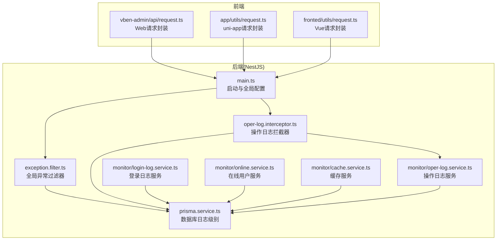
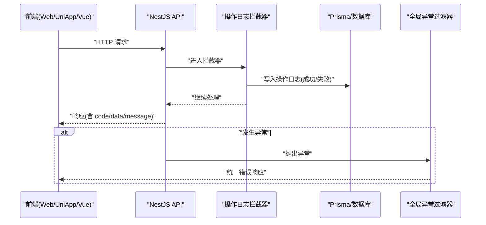
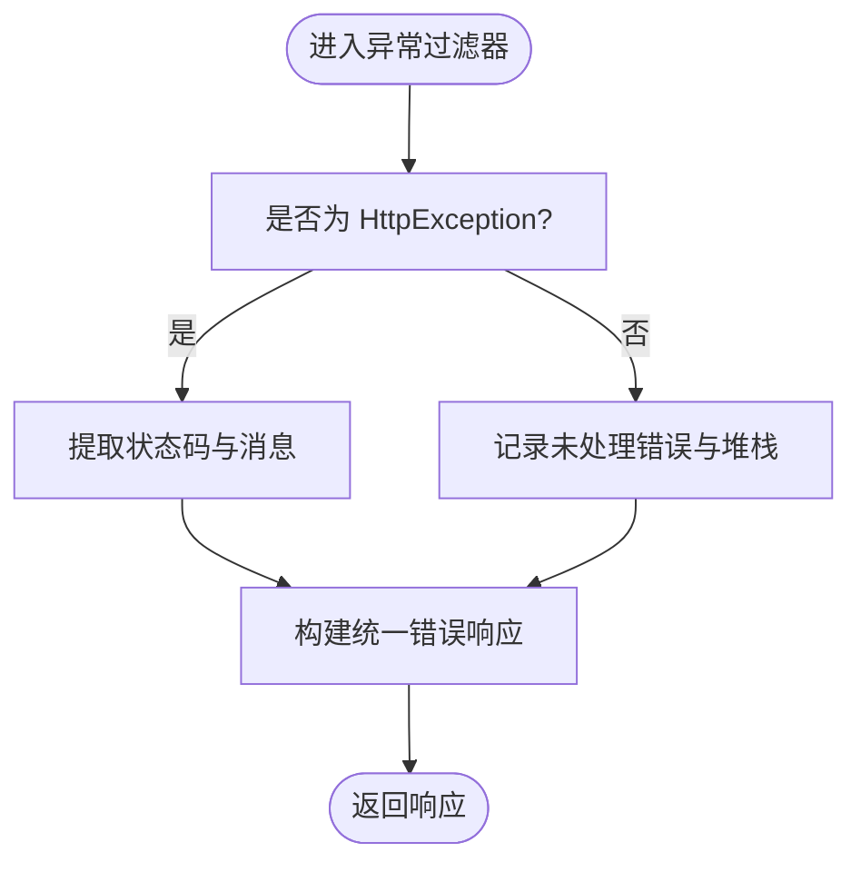
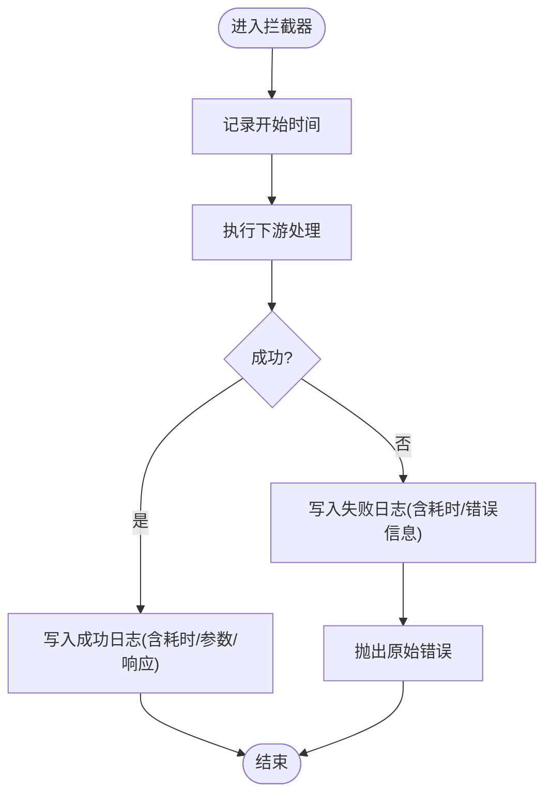
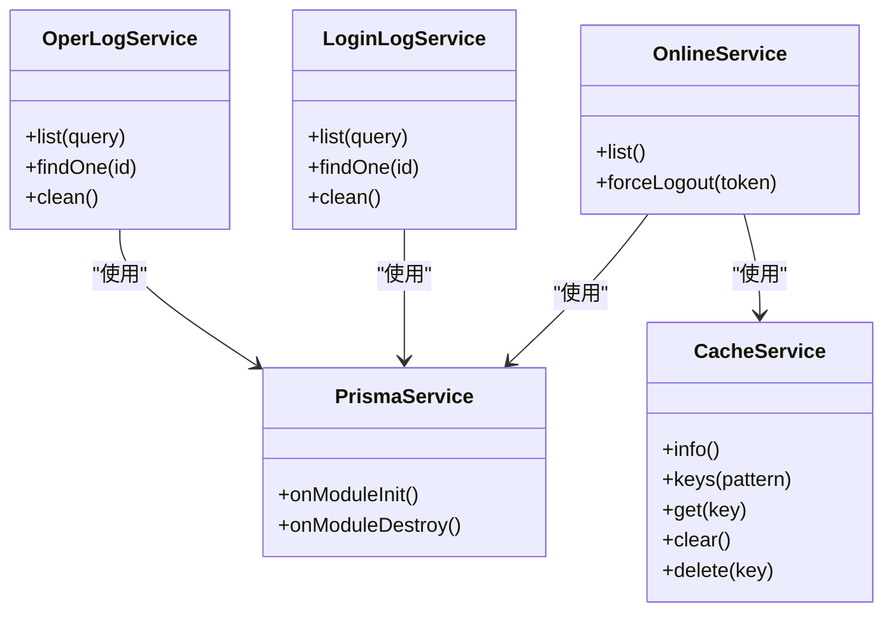
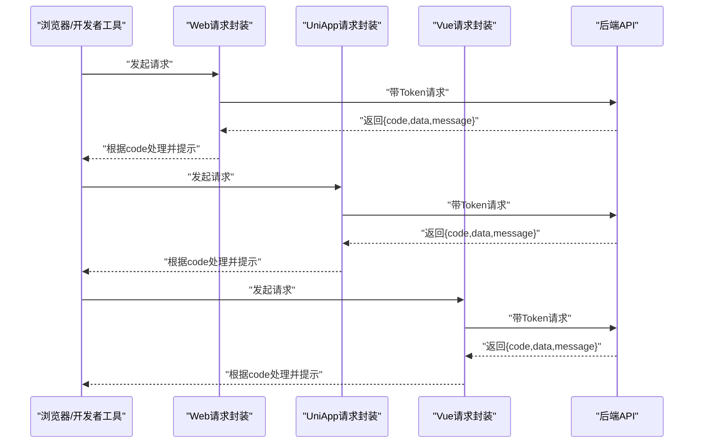
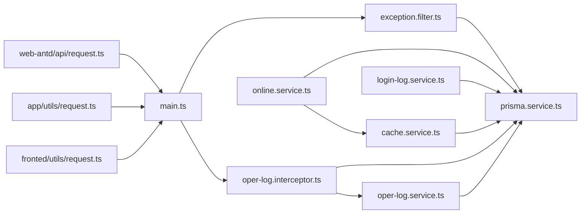

# 日志分析方法

<cite>
**本文引用的文件**
- [apps/backend/src/common/exception.filter.ts](file://apps/backend/src/common/exception.filter.ts)
- [apps/backend/src/common/oper-log.interceptor.ts](file://apps/backend/src/common/oper-log.interceptor.ts)
- [apps/backend/src/common/prisma.service.ts](file://apps/backend/src/common/prisma.service.ts)
- [apps/backend/src/modules/monitor/oper-log/oper-log.service.ts](file://apps/backend/src/modules/monitor/oper-log/oper-log.service.ts)
- [apps/backend/src/modules/monitor/login-log/login-log.service.ts](file://apps/backend/src/modules/monitor/login-log/login-log.service.ts)
- [apps/backend/src/modules/monitor/online/online.service.ts](file://apps/backend/src/modules/monitor/online/online.service.ts)
- [apps/backend/src/modules/monitor/cache/cache.service.ts](file://apps/backend/src/modules/monitor/cache/cache.service.ts)
- [apps/backend/src/main.ts](file://apps/backend/src/main.ts)
- [apps/backend/src/config/env.config.ts](file://apps/backend/src/config/env.config.ts)
- [apps/fronted/src/utils/request.ts](file://apps/fronted/src/utils/request.ts)
- [apps/vben-admin/apps/web-antd/src/api/request.ts](file://apps/vben-admin/apps/web-antd/src/api/request.ts)
- [apps/app/src/utils/request.ts](file://apps/app/src/utils/request.ts)
</cite>

## 目录
1. [简介](#简介)
2. [项目结构](#项目结构)
3. [核心组件](#核心组件)
4. [架构总览](#架构总览)
5. [详细组件分析](#详细组件分析)
6. [依赖关系分析](#依赖关系分析)
7. [性能考量](#性能考量)
8. [故障排查指南](#故障排查指南)
9. [结论](#结论)
10. [附录](#附录)

## 简介
本指南围绕后端 NestJS 应用与多端前端的日志采集、分类、分析与可视化进行系统讲解，结合项目现有实现，给出可操作的查看与分析技巧，并扩展到日志聚合与告警、结构化与轮转归档、以及在故障排查中的实战应用。

## 项目结构
后端采用 NestJS，前端包含三套应用：
- Web 前端（Vue + Vben Admin）
- 移动端（uni-app）
- 另一套 Vue 前端（fronted）

后端通过全局异常过滤器、操作日志拦截器、数据库连接日志、以及监控模块（登录日志、操作日志、在线用户、缓存）形成完整的日志体系；前端通过统一请求封装对后端返回进行标准化处理，并在失败时弹窗提示，便于问题定位。

图表来源
- [apps/backend/src/main.ts:1-48](file://apps/backend/src/main.ts#L1-L48)
- [apps/backend/src/common/exception.filter.ts:1-37](file://apps/backend/src/common/exception.filter.ts#L1-L37)
- [apps/backend/src/common/oper-log.interceptor.ts:1-111](file://apps/backend/src/common/oper-log.interceptor.ts#L1-L111)
- [apps/backend/src/common/prisma.service.ts:1-22](file://apps/backend/src/common/prisma.service.ts#L1-L22)
- [apps/backend/src/modules/monitor/oper-log/oper-log.service.ts:1-33](file://apps/backend/src/modules/monitor/oper-log/oper-log.service.ts#L1-L33)
- [apps/backend/src/modules/monitor/login-log/login-log.service.ts:1-31](file://apps/backend/src/modules/monitor/login-log/login-log.service.ts#L1-L31)
- [apps/backend/src/modules/monitor/online/online.service.ts:1-31](file://apps/backend/src/modules/monitor/online/online.service.ts#L1-L31)
- [apps/backend/src/modules/monitor/cache/cache.service.ts:1-29](file://apps/backend/src/modules/monitor/cache/cache.service.ts#L1-L29)
- [apps/vben-admin/apps/web-antd/src/api/request.ts:1-139](file://apps/vben-admin/apps/web-antd/src/api/request.ts#L1-L139)
- [apps/app/src/utils/request.ts:1-57](file://apps/app/src/utils/request.ts#L1-L57)
- [apps/fronted/src/utils/request.ts:1-51](file://apps/fronted/src/utils/request.ts#L1-L51)

章节来源
- [apps/backend/src/main.ts:1-48](file://apps/backend/src/main.ts#L1-L48)

## 核心组件
- 全局异常过滤器：捕获未处理异常，记录错误堆栈，统一返回错误响应。
- 操作日志拦截器：记录请求/响应、参数脱敏、耗时、状态、IP、用户信息等，写入数据库。
- 数据库日志级别：Prisma 客户端以 error/warn 级别输出数据库相关日志。
- 监控模块：
  - 登录日志服务：查询登录行为、清理数据。
  - 操作日志服务：分页查询、详情、清空。
  - 在线用户服务：基于 Redis 获取在线用户列表与强制下线。
  - 缓存服务：Redis 信息、键匹配、读取、清空、删除。
- 前端请求封装：统一封装请求头、鉴权、错误提示与401处理。

章节来源
- [apps/backend/src/common/exception.filter.ts:1-37](file://apps/backend/src/common/exception.filter.ts#L1-L37)
- [apps/backend/src/common/oper-log.interceptor.ts:1-111](file://apps/backend/src/common/oper-log.interceptor.ts#L1-L111)
- [apps/backend/src/common/prisma.service.ts:1-22](file://apps/backend/src/common/prisma.service.ts#L1-L22)
- [apps/backend/src/modules/monitor/login-log/login-log.service.ts:1-31](file://apps/backend/src/modules/monitor/login-log/login-log.service.ts#L1-L31)
- [apps/backend/src/modules/monitor/oper-log/oper-log.service.ts:1-33](file://apps/backend/src/modules/monitor/oper-log/oper-log.service.ts#L1-L33)
- [apps/backend/src/modules/monitor/online/online.service.ts:1-31](file://apps/backend/src/modules/monitor/online/online.service.ts#L1-L31)
- [apps/backend/src/modules/monitor/cache/cache.service.ts:1-29](file://apps/backend/src/modules/monitor/cache/cache.service.ts#L1-L29)
- [apps/vben-admin/apps/web-antd/src/api/request.ts:1-139](file://apps/vben-admin/apps/web-antd/src/api/request.ts#L1-L139)
- [apps/app/src/utils/request.ts:1-57](file://apps/app/src/utils/request.ts#L1-L57)
- [apps/fronted/src/utils/request.ts:1-51](file://apps/fronted/src/utils/request.ts#L1-L51)

## 架构总览
后端启动时设置全局前缀、验证管道、Swagger 文档与静态资源；异常过滤器与操作日志拦截器贯穿所有请求；数据库日志由 Prisma 控制；监控模块提供查询与管理能力；前端通过统一请求客户端与后端交互。

图表来源
- [apps/backend/src/common/oper-log.interceptor.ts:15-28](file://apps/backend/src/common/oper-log.interceptor.ts#L15-L28)
- [apps/backend/src/common/exception.filter.ts:16-36](file://apps/backend/src/common/exception.filter.ts#L16-L36)
- [apps/backend/src/common/prisma.service.ts:8-12](file://apps/backend/src/common/prisma.service.ts#L8-L12)
- [apps/vben-admin/apps/web-antd/src/api/request.ts:67-99](file://apps/vben-admin/apps/web-antd/src/api/request.ts#L67-L99)
- [apps/app/src/utils/request.ts:10-45](file://apps/app/src/utils/request.ts#L10-L45)
- [apps/fronted/src/utils/request.ts:14-48](file://apps/fronted/src/utils/request.ts#L14-L48)

## 详细组件分析

### 全局异常过滤器
- 职责：捕获未处理异常，记录错误堆栈，按 HTTP 状态码返回统一错误响应。
- 关键点：区分 HttpException 与 Error；对未捕获错误记录 error 日志并返回统一结构。

图表来源
- [apps/backend/src/common/exception.filter.ts:16-36](file://apps/backend/src/common/exception.filter.ts#L16-L36)

章节来源
- [apps/backend/src/common/exception.filter.ts:1-37](file://apps/backend/src/common/exception.filter.ts#L1-L37)

### 操作日志拦截器
- 职责：在请求完成后记录请求/响应、参数脱敏、耗时、状态、IP、用户信息等。
- 关键点：仅对非 GET 且有用户上下文的请求记录；对敏感字段进行脱敏；限制请求体/响应体字符串长度；异常时记录错误信息；写库失败不中断业务。

图表来源
- [apps/backend/src/common/oper-log.interceptor.ts:15-28](file://apps/backend/src/common/oper-log.interceptor.ts#L15-L28)

章节来源
- [apps/backend/src/common/oper-log.interceptor.ts:1-111](file://apps/backend/src/common/oper-log.interceptor.ts#L1-L111)

### 数据库日志级别
- 职责：通过 Prisma 客户端配置 log: ['error','warn']，输出数据库错误与警告日志。
- 影响：有助于发现慢查询、连接异常、SQL 错误等问题。

章节来源
- [apps/backend/src/common/prisma.service.ts:8-12](file://apps/backend/src/common/prisma.service.ts#L8-L12)

### 监控模块（登录日志/操作日志/在线用户/缓存）
- 登录日志服务：支持按用户名、状态筛选，分页查询与清理。
- 操作日志服务：支持按用户名、模块筛选，分页查询与清理。
- 在线用户服务：从 Redis 读取在线令牌，回查用户信息，支持强制下线。
- 缓存服务：提供 Redis 信息、键匹配、读取、清空、删除等能力。

图表来源
- [apps/backend/src/modules/monitor/oper-log/oper-log.service.ts:1-33](file://apps/backend/src/modules/monitor/oper-log/oper-log.service.ts#L1-L33)
- [apps/backend/src/modules/monitor/login-log/login-log.service.ts:1-31](file://apps/backend/src/modules/monitor/login-log/login-log.service.ts#L1-L31)
- [apps/backend/src/modules/monitor/online/online.service.ts:1-31](file://apps/backend/src/modules/monitor/online/online.service.ts#L1-L31)
- [apps/backend/src/modules/monitor/cache/cache.service.ts:1-29](file://apps/backend/src/modules/monitor/cache/cache.service.ts#L1-L29)
- [apps/backend/src/common/prisma.service.ts:1-22](file://apps/backend/src/common/prisma.service.ts#L1-L22)

章节来源
- [apps/backend/src/modules/monitor/oper-log/oper-log.service.ts:1-33](file://apps/backend/src/modules/monitor/oper-log/oper-log.service.ts#L1-L33)
- [apps/backend/src/modules/monitor/login-log/login-log.service.ts:1-31](file://apps/backend/src/modules/monitor/login-log/login-log.service.ts#L1-L31)
- [apps/backend/src/modules/monitor/online/online.service.ts:1-31](file://apps/backend/src/modules/monitor/online/online.service.ts#L1-L31)
- [apps/backend/src/modules/monitor/cache/cache.service.ts:1-29](file://apps/backend/src/modules/monitor/cache/cache.service.ts#L1-L29)

### 前端日志收集与分析
- Web(Vben Admin)：统一请求客户端封装，处理响应格式、401重认证、错误提示；便于在控制台观察网络请求与错误信息。
- 移动端(UniApp)：封装请求，处理 401 跳转登录，Toast 提示；可在开发者工具中查看网络与控制台日志。
- Vue 前端：统一封装请求，处理 401 清理本地 token 并跳转登录，错误提示；适合在浏览器控制台与 Vue DevTools 中定位问题。

图表来源
- [apps/vben-admin/apps/web-antd/src/api/request.ts:56-99](file://apps/vben-admin/apps/web-antd/src/api/request.ts#L56-L99)
- [apps/app/src/utils/request.ts:10-45](file://apps/app/src/utils/request.ts#L10-L45)
- [apps/fronted/src/utils/request.ts:14-48](file://apps/fronted/src/utils/request.ts#L14-L48)

章节来源
- [apps/vben-admin/apps/web-antd/src/api/request.ts:1-139](file://apps/vben-admin/apps/web-antd/src/api/request.ts#L1-L139)
- [apps/app/src/utils/request.ts:1-57](file://apps/app/src/utils/request.ts#L1-L57)
- [apps/fronted/src/utils/request.ts:1-51](file://apps/fronted/src/utils/request.ts#L1-L51)

## 依赖关系分析
- 后端启动流程依赖全局配置与中间件；异常过滤器与操作日志拦截器作为横切关注点贯穿所有路由。
- 操作日志拦截器依赖 PrismaService 写库；监控模块依赖 PrismaService 查询与管理。
- 在线用户服务依赖 RedisService 与 PrismaService；缓存服务依赖 RedisService。
- 前端请求封装依赖后端 API 的统一响应格式，确保错误与 401 场景一致化处理。

图表来源
- [apps/backend/src/main.ts:1-48](file://apps/backend/src/main.ts#L1-L48)
- [apps/backend/src/common/exception.filter.ts:1-37](file://apps/backend/src/common/exception.filter.ts#L1-L37)
- [apps/backend/src/common/oper-log.interceptor.ts:1-111](file://apps/backend/src/common/oper-log.interceptor.ts#L1-L111)
- [apps/backend/src/common/prisma.service.ts:1-22](file://apps/backend/src/common/prisma.service.ts#L1-L22)
- [apps/backend/src/modules/monitor/oper-log/oper-log.service.ts:1-33](file://apps/backend/src/modules/monitor/oper-log/oper-log.service.ts#L1-L33)
- [apps/backend/src/modules/monitor/login-log/login-log.service.ts:1-31](file://apps/backend/src/modules/monitor/login-log/login-log.service.ts#L1-L31)
- [apps/backend/src/modules/monitor/online/online.service.ts:1-31](file://apps/backend/src/modules/monitor/online/online.service.ts#L1-L31)
- [apps/backend/src/modules/monitor/cache/cache.service.ts:1-29](file://apps/backend/src/modules/monitor/cache/cache.service.ts#L1-L29)
- [apps/vben-admin/apps/web-antd/src/api/request.ts:1-139](file://apps/vben-admin/apps/web-antd/src/api/request.ts#L1-L139)
- [apps/app/src/utils/request.ts:1-57](file://apps/app/src/utils/request.ts#L1-L57)
- [apps/fronted/src/utils/request.ts:1-51](file://apps/fronted/src/utils/request.ts#L1-L51)

## 性能考量
- 操作日志拦截器对每次非 GET 请求写库，建议：
  - 对高频接口进行白名单/黑名单控制，避免记录无关接口。
  - 参数脱敏与字符串截断可降低存储与传输开销。
  - 将日志写入异步队列或批量入库，减少对主请求路径的影响。
- Prisma 日志级别仅保留 error/warn，避免过多冗余日志影响性能。
- 在线用户与缓存操作依赖 Redis，注意键空间与过期策略，防止内存膨胀。

## 故障排查指南
- 错误日志
  - 使用全局异常过滤器统一捕获未处理异常，结合错误堆栈定位问题。
  - 结合数据库日志级别，排查 SQL 错误与连接异常。
- 访问日志
  - 通过操作日志拦截器记录的 method、reqUrl、reqParam、respResult、duration、status、errorMsg、ip、username 等字段，快速定位异常请求与用户行为。
  - 使用操作日志服务按用户名/模块筛选，结合在线用户服务确认用户会话状态。
- 业务日志
  - 登录日志服务用于追踪登录成功/失败与用户行为；必要时清理历史数据以便复盘。
  - 缓存服务用于检查键空间与数据一致性，必要时清空/删除特定键进行隔离排查。
- 前端问题
  - Web/UniApp/Vue 前端均对 401 进行统一处理，若出现频繁 401，优先检查 Token 生命周期与刷新策略。
  - 在浏览器控制台与 Vue DevTools 中观察请求与状态变化，结合后端操作日志交叉验证。

章节来源
- [apps/backend/src/common/exception.filter.ts:30-33](file://apps/backend/src/common/exception.filter.ts#L30-L33)
- [apps/backend/src/common/oper-log.interceptor.ts:30-61](file://apps/backend/src/common/oper-log.interceptor.ts#L30-L61)
- [apps/backend/src/common/prisma.service.ts:10-11](file://apps/backend/src/common/prisma.service.ts#L10-L11)
- [apps/backend/src/modules/monitor/oper-log/oper-log.service.ts:8-23](file://apps/backend/src/modules/monitor/oper-log/oper-log.service.ts#L8-L23)
- [apps/backend/src/modules/monitor/login-log/login-log.service.ts:8-21](file://apps/backend/src/modules/monitor/login-log/login-log.service.ts#L8-L21)
- [apps/backend/src/modules/monitor/online/online.service.ts:9-25](file://apps/backend/src/modules/monitor/online/online.service.ts#L9-L25)
- [apps/backend/src/modules/monitor/cache/cache.service.ts:20-23](file://apps/backend/src/modules/monitor/cache/cache.service.ts#L20-L23)
- [apps/vben-admin/apps/web-antd/src/api/request.ts:102-120](file://apps/vben-admin/apps/web-antd/src/api/request.ts#L102-L120)
- [apps/app/src/utils/request.ts:31-35](file://apps/app/src/utils/request.ts#L31-L35)
- [apps/fronted/src/utils/request.ts:31-35](file://apps/fronted/src/utils/request.ts#L31-L35)

## 结论
本项目已具备完善的日志基础设施：全局异常过滤器、操作日志拦截器、数据库日志级别、监控模块与前端统一请求封装。在此基础上，建议进一步引入结构化日志、日志聚合与告警、轮转与归档策略，以提升可观测性与运维效率。

## 附录

### 日志分类与解读要点
- 错误日志
  - 来源：全局异常过滤器、数据库日志级别。
  - 关注：错误类型、堆栈、状态码、用户标识、时间戳。
- 访问日志
  - 来源：操作日志拦截器。
  - 关注：method、url、耗时、状态、IP、用户、请求参数脱敏、响应结果截断。
- 业务日志
  - 来源：登录日志服务、操作日志服务、在线用户服务、缓存服务。
  - 关注：登录状态、操作模块、用户行为、在线会话、缓存命中与失效。

### 日志聚合与分析工具使用
- ELK Stack
  - 收集：后端应用日志输出至 stdout/stderr，容器编排时映射到宿主机或集中式日志目录。
  - 解析：Logstash/Beats 将日志解析为结构化字段；Kibana 可视化。
  - 建议：对 NestJS 输出进行统一格式化，便于字段提取。
- Sentry
  - 集成：在前端请求封装中捕获错误并上报；后端异常过滤器可配合 sentry-nest 或自定义 SDK 上报。
  - 建议：区分环境与级别，启用堆栈采样与上下文信息。
- LogRocket
  - 集成：在 Web 前端集成 SDK，录制会话与错误，便于回放用户行为。
  - 建议：仅在生产环境启用，注意隐私与性能。

### 结构化日志最佳实践
- 统一字段：timestamp、level、service、traceId、spanId、method、url、userId、ip、duration、status、errorMsg、reqParam、respResult。
- 格式：JSON 结构化输出，避免纯文本日志难以解析。
- 脱敏：对敏感字段（密码、token、授权、验证码）进行脱敏处理。
- 限长：对大字段进行截断，避免日志过大影响性能与存储。

### 日志轮转与归档策略
- 轮转：按大小或时间轮转，保留 N 天/周/月的日志副本。
- 归档：超过保留期的日志压缩归档，定期清理过期归档。
- 存储：热数据本地磁盘，冷数据对象存储或专用日志存储服务。

### 日志监控与告警
- 指标：错误率、P95/P99 响应时间、数据库连接数、Redis 命中率。
- 告警：阈值触发、趋势异常、突发增长；区分严重/警告级别。
- 工具：Prometheus/Grafana/Alertmanager 或云厂商监控平台。