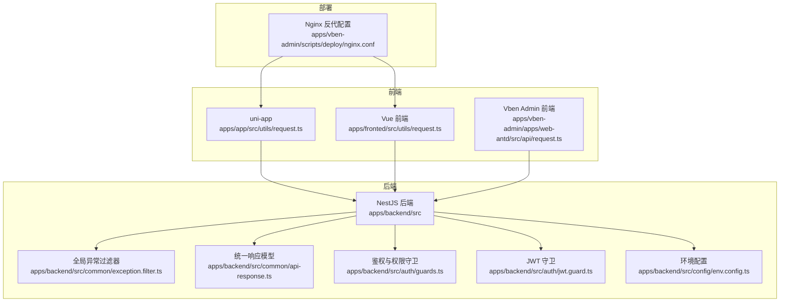
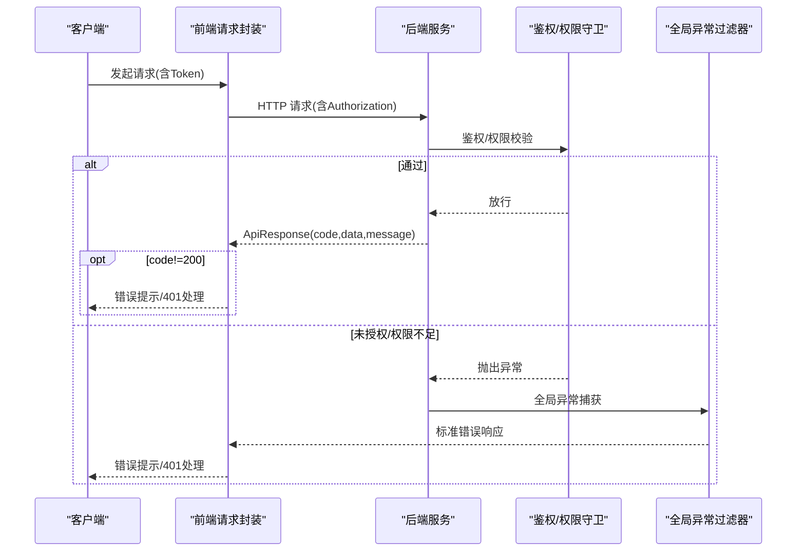
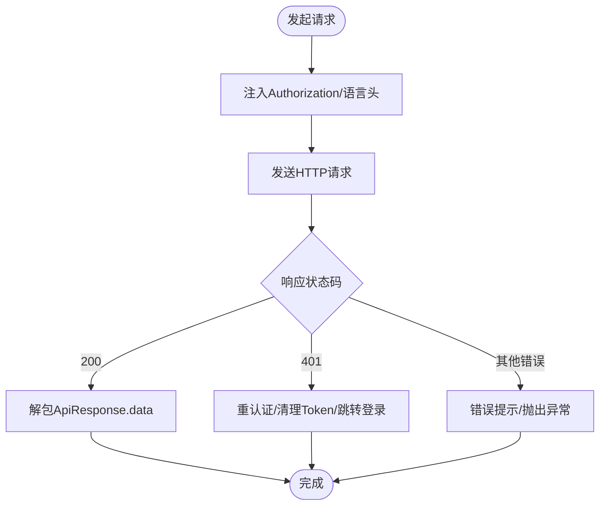
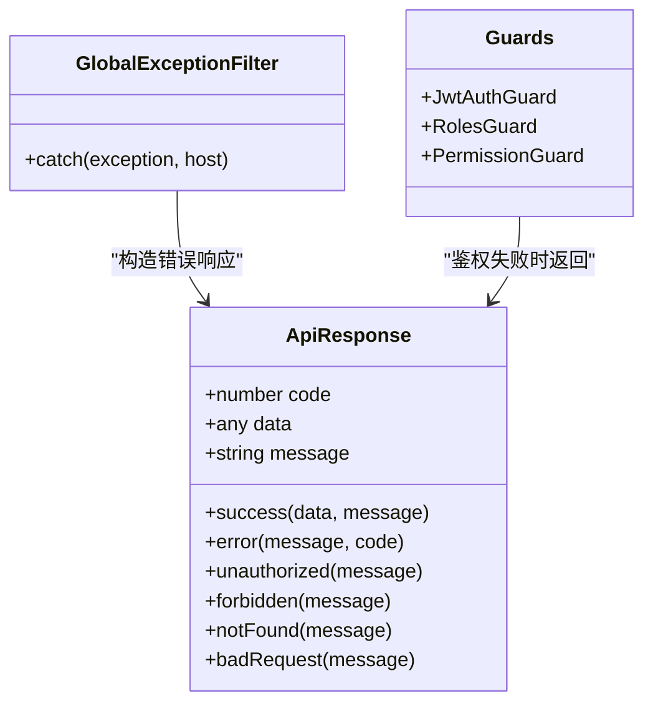
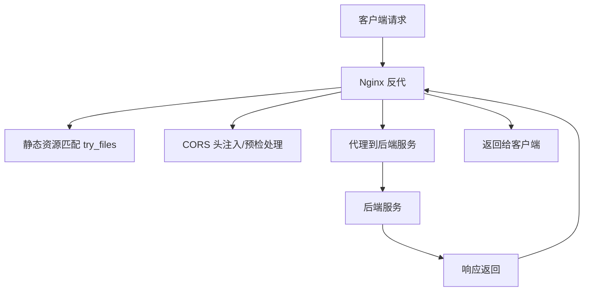
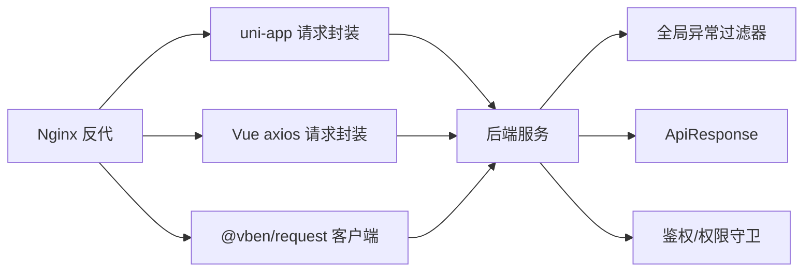

# 网络问题排查

<cite>
**本文引用的文件**
- [apps/app/src/utils/request.ts](file://apps/app/src/utils/request.ts)
- [apps/fronted/src/utils/request.ts](file://apps/fronted/src/utils/request.ts)
- [apps/vben-admin/apps/web-antd/src/api/request.ts](file://apps/vben-admin/apps/web-antd/src/api/request.ts)
- [apps/backend/src/common/exception.filter.ts](file://apps/backend/src/common/exception.filter.ts)
- [apps/backend/src/common/api-response.ts](file://apps/backend/src/common/api-response.ts)
- [apps/backend/src/config/env.config.ts](file://apps/backend/src/config/env.config.ts)
- [apps/backend/src/auth/guards.ts](file://apps/backend/src/auth/guards.ts)
- [apps/backend/src/auth/jwt.guard.ts](file://apps/backend/src/auth/jwt.guard.ts)
- [apps/vben-admin/scripts/deploy/nginx.conf](file://apps/vben-admin/scripts/deploy/nginx.conf)
</cite>

## 目录
1. 引言
2. 项目结构
3. 核心组件
4. 架构总览
5. 详细组件分析
6. 依赖关系分析
7. 性能考量
8. 故障排查指南
9. 结论
10. 附录

## 引言
本指南面向后端与前端工程师，聚焦于网络问题的系统化排查方法，覆盖以下主题：
- API 调用失败的诊断：网络连接超时、DNS 解析问题、SSL 证书错误等
- 跨域问题排查：CORS 配置、预检请求处理、代理配置
- Nginx 反向代理配置错误诊断：负载均衡、缓存策略、健康检查
- WebSocket/Server-Sent Events 连接问题：连接状态监控、消息传输异常、心跳机制
- CDN 与静态资源访问问题
- 网络安全问题：防火墙、IP 白名单、DDoS 防护

本指南结合仓库中的请求封装、异常过滤、统一响应、鉴权守卫与 Nginx 示例配置，提供可操作的定位步骤与修复建议。

## 项目结构
本项目采用多应用架构：
- 前端应用：uni-app 应用、Vue 前端、Vben Admin 前端
- 后端应用：NestJS 应用
- 部署脚本：包含 Nginx 示例配置

图表来源
- [apps/app/src/utils/request.ts:1-57](file://apps/app/src/utils/request.ts#L1-L57)
- [apps/fronted/src/utils/request.ts:1-51](file://apps/fronted/src/utils/request.ts#L1-L51)
- [apps/vben-admin/apps/web-antd/src/api/request.ts:1-139](file://apps/vben-admin/apps/web-antd/src/api/request.ts#L1-L139)
- [apps/backend/src/common/exception.filter.ts:1-37](file://apps/backend/src/common/exception.filter.ts#L1-L37)
- [apps/backend/src/common/api-response.ts:1-35](file://apps/backend/src/common/api-response.ts#L1-L35)
- [apps/backend/src/auth/guards.ts:1-51](file://apps/backend/src/auth/guards.ts#L1-L51)
- [apps/backend/src/auth/jwt.guard.ts:1-5](file://apps/backend/src/auth/jwt.guard.ts#L1-L5)
- [apps/backend/src/config/env.config.ts:1-47](file://apps/backend/src/config/env.config.ts#L1-L47)
- [apps/vben-admin/scripts/deploy/nginx.conf:1-76](file://apps/vben-admin/scripts/deploy/nginx.conf#L1-L76)

章节来源
- [apps/app/src/utils/request.ts:1-57](file://apps/app/src/utils/request.ts#L1-L57)
- [apps/fronted/src/utils/request.ts:1-51](file://apps/fronted/src/utils/request.ts#L1-L51)
- [apps/vben-admin/apps/web-antd/src/api/request.ts:1-139](file://apps/vben-admin/apps/web-antd/src/api/request.ts#L1-L139)
- [apps/backend/src/common/exception.filter.ts:1-37](file://apps/backend/src/common/exception.filter.ts#L1-L37)
- [apps/backend/src/common/api-response.ts:1-35](file://apps/backend/src/common/api-response.ts#L1-L35)
- [apps/backend/src/auth/guards.ts:1-51](file://apps/backend/src/auth/guards.ts#L1-L51)
- [apps/backend/src/auth/jwt.guard.ts:1-5](file://apps/backend/src/auth/jwt.guard.ts#L1-L5)
- [apps/backend/src/config/env.config.ts:1-47](file://apps/backend/src/config/env.config.ts#L1-L47)
- [apps/vben-admin/scripts/deploy/nginx.conf:1-76](file://apps/vben-admin/scripts/deploy/nginx.conf#L1-L76)

## 核心组件
- 前端请求封装
  - uni-app 封装：本地存储 Token 注入、统一错误提示、401 自动登出
  - Vue 前端封装：基于 axios 的请求实例、超时、拦截器、统一错误提示
  - Vben Admin 封装：基于 @vben/request 的请求客户端、统一响应解包、401 重认证、通用错误提示
- 后端统一响应与异常
  - ApiResponse 统一响应模型
  - 全局异常过滤器捕获未处理异常并返回标准错误
- 鉴权与权限
  - JWT 守卫、角色/权限守卫，配合 RequirePermission 使用
- Nginx 反代
  - 示例配置包含基础静态托管、CORS 头、预检处理

章节来源
- [apps/app/src/utils/request.ts:1-57](file://apps/app/src/utils/request.ts#L1-L57)
- [apps/fronted/src/utils/request.ts:1-51](file://apps/fronted/src/utils/request.ts#L1-L51)
- [apps/vben-admin/apps/web-antd/src/api/request.ts:1-139](file://apps/vben-admin/apps/web-antd/src/api/request.ts#L1-L139)
- [apps/backend/src/common/api-response.ts:1-35](file://apps/backend/src/common/api-response.ts#L1-L35)
- [apps/backend/src/common/exception.filter.ts:1-37](file://apps/backend/src/common/exception.filter.ts#L1-L37)
- [apps/backend/src/auth/guards.ts:1-51](file://apps/backend/src/auth/guards.ts#L1-L51)
- [apps/backend/src/auth/jwt.guard.ts:1-5](file://apps/backend/src/auth/jwt.guard.ts#L1-L5)
- [apps/vben-admin/scripts/deploy/nginx.conf:1-76](file://apps/vben-admin/scripts/deploy/nginx.conf#L1-L76)

## 架构总览
下图展示从前端到后端的关键网络交互与错误处理路径。

图表来源
- [apps/app/src/utils/request.ts:10-45](file://apps/app/src/utils/request.ts#L10-L45)
- [apps/fronted/src/utils/request.ts:7-48](file://apps/fronted/src/utils/request.ts#L7-L48)
- [apps/vben-admin/apps/web-antd/src/api/request.ts:55-120](file://apps/vben-admin/apps/web-antd/src/api/request.ts#L55-L120)
- [apps/backend/src/common/api-response.ts:1-35](file://apps/backend/src/common/api-response.ts#L1-L35)
- [apps/backend/src/common/exception.filter.ts:16-36](file://apps/backend/src/common/exception.filter.ts#L16-L36)
- [apps/backend/src/auth/guards.ts:19-51](file://apps/backend/src/auth/guards.ts#L19-L51)

## 详细组件分析

### 前端请求封装与错误处理
- uni-app 封装
  - 功能要点：自动注入 Authorization、统一 toast 提示、401 清理 token 并跳转登录
  - 关键路径：[apps/app/src/utils/request.ts:10-45](file://apps/app/src/utils/request.ts#L10-L45)
- Vue 前端封装（axios）
  - 功能要点：baseURL、timeout、请求/响应拦截器、401 登录页跳转
  - 关键路径：[apps/fronted/src/utils/request.ts:7-48](file://apps/fronted/src/utils/request.ts#L7-L48)
- Vben Admin 封装（@vben/request）
  - 功能要点：统一响应解包、401 重认证、通用错误提示、支持 blob
  - 关键路径：[apps/vben-admin/apps/web-antd/src/api/request.ts:25-120](file://apps/vben-admin/apps/web-antd/src/api/request.ts#L25-L120)

图表来源
- [apps/vben-admin/apps/web-antd/src/api/request.ts:55-120](file://apps/vben-admin/apps/web-antd/src/api/request.ts#L55-L120)
- [apps/fronted/src/utils/request.ts:14-48](file://apps/fronted/src/utils/request.ts#L14-L48)
- [apps/app/src/utils/request.ts:10-45](file://apps/app/src/utils/request.ts#L10-L45)

章节来源
- [apps/app/src/utils/request.ts:1-57](file://apps/app/src/utils/request.ts#L1-L57)
- [apps/fronted/src/utils/request.ts:1-51](file://apps/fronted/src/utils/request.ts#L1-L51)
- [apps/vben-admin/apps/web-antd/src/api/request.ts:1-139](file://apps/vben-admin/apps/web-antd/src/api/request.ts#L1-L139)

### 后端统一响应与异常处理
- ApiResponse 统一响应模型，便于前端解包与错误识别
- 全局异常过滤器捕获未处理异常，输出标准错误响应
- 鉴权与权限守卫用于前置拦截未授权或权限不足的请求

图表来源
- [apps/backend/src/common/api-response.ts:1-35](file://apps/backend/src/common/api-response.ts#L1-L35)
- [apps/backend/src/common/exception.filter.ts:12-36](file://apps/backend/src/common/exception.filter.ts#L12-L36)
- [apps/backend/src/auth/guards.ts:19-51](file://apps/backend/src/auth/guards.ts#L19-L51)
- [apps/backend/src/auth/jwt.guard.ts:1-5](file://apps/backend/src/auth/jwt.guard.ts#L1-L5)

章节来源
- [apps/backend/src/common/api-response.ts:1-35](file://apps/backend/src/common/api-response.ts#L1-L35)
- [apps/backend/src/common/exception.filter.ts:1-37](file://apps/backend/src/common/exception.filter.ts#L1-L37)
- [apps/backend/src/auth/guards.ts:1-51](file://apps/backend/src/auth/guards.ts#L1-L51)
- [apps/backend/src/auth/jwt.guard.ts:1-5](file://apps/backend/src/auth/jwt.guard.ts#L1-L5)

### Nginx 反向代理配置
- 示例配置启用静态托管、CORS 头、预检请求处理
- 建议在生产中细化 CORS 策略、开启 gzip、健康检查与限流

图表来源
- [apps/vben-admin/scripts/deploy/nginx.conf:49-74](file://apps/vben-admin/scripts/deploy/nginx.conf#L49-L74)

章节来源
- [apps/vben-admin/scripts/deploy/nginx.conf:1-76](file://apps/vben-admin/scripts/deploy/nginx.conf#L1-L76)

## 依赖关系分析
- 前端到后端
  - 前端通过统一请求封装发送 HTTP 请求，后端通过 ApiResponse 返回标准结构
  - 鉴权守卫在进入控制器前进行拦截，避免无效请求进入业务层
- 异常链路
  - 未处理异常由全局异常过滤器接管，确保前后端一致的错误语义
- Nginx 与前端
  - Nginx 提供静态托管与 CORS，前端无需额外跨域配置即可访问

图表来源
- [apps/app/src/utils/request.ts:10-45](file://apps/app/src/utils/request.ts#L10-L45)
- [apps/fronted/src/utils/request.ts:7-48](file://apps/fronted/src/utils/request.ts#L7-L48)
- [apps/vben-admin/apps/web-antd/src/api/request.ts:25-120](file://apps/vben-admin/apps/web-antd/src/api/request.ts#L25-L120)
- [apps/backend/src/common/exception.filter.ts:16-36](file://apps/backend/src/common/exception.filter.ts#L16-L36)
- [apps/backend/src/common/api-response.ts:1-35](file://apps/backend/src/common/api-response.ts#L1-L35)
- [apps/backend/src/auth/guards.ts:19-51](file://apps/backend/src/auth/guards.ts#L19-L51)
- [apps/vben-admin/scripts/deploy/nginx.conf:49-74](file://apps/vben-admin/scripts/deploy/nginx.conf#L49-L74)

章节来源
- [apps/app/src/utils/request.ts:1-57](file://apps/app/src/utils/request.ts#L1-L57)
- [apps/fronted/src/utils/request.ts:1-51](file://apps/fronted/src/utils/request.ts#L1-L51)
- [apps/vben-admin/apps/web-antd/src/api/request.ts:1-139](file://apps/vben-admin/apps/web-antd/src/api/request.ts#L1-L139)
- [apps/backend/src/common/exception.filter.ts:1-37](file://apps/backend/src/common/exception.filter.ts#L1-L37)
- [apps/backend/src/common/api-response.ts:1-35](file://apps/backend/src/common/api-response.ts#L1-L35)
- [apps/backend/src/auth/guards.ts:1-51](file://apps/backend/src/auth/guards.ts#L1-L51)
- [apps/backend/src/auth/jwt.guard.ts:1-5](file://apps/backend/src/auth/jwt.guard.ts#L1-L5)
- [apps/vben-admin/scripts/deploy/nginx.conf:1-76](file://apps/vben-admin/scripts/deploy/nginx.conf#L1-L76)

## 性能考量
- 超时与重试
  - 前端已设置超时时间，建议根据接口特性调整；对幂等请求可引入指数退避重试
- 缓存策略
  - Nginx 默认未启用 gzip，生产建议开启静态资源压缩与缓存头
- 连接与并发
  - Nginx worker_connections 数值需结合并发量评估；后端连接池与数据库连接数应匹配
- 日志与可观测性
  - 后端异常过滤器记录未处理异常堆栈，建议接入集中式日志与告警

## 故障排查指南

### API 调用失败
- 症状
  - 前端显示“网络错误”或“请求失败”，后端无日志
- 排查步骤
  - 检查前端 baseURL 与后端监听端口是否一致
  - 查看浏览器开发者工具 Network 面板：状态码、响应体、请求头
  - 确认鉴权头 Authorization 是否正确注入
  - 观察后端日志：是否存在全局异常过滤器记录的未处理异常
- 依据
  - 前端请求封装与拦截器：[apps/fronted/src/utils/request.ts:7-48](file://apps/fronted/src/utils/request.ts#L7-L48)、[apps/vben-admin/apps/web-antd/src/api/request.ts:55-120](file://apps/vben-admin/apps/web-antd/src/api/request.ts#L55-L120)
  - 全局异常过滤器：[apps/backend/src/common/exception.filter.ts:16-36](file://apps/backend/src/common/exception.filter.ts#L16-L36)

章节来源
- [apps/fronted/src/utils/request.ts:1-51](file://apps/fronted/src/utils/request.ts#L1-L51)
- [apps/vben-admin/apps/web-antd/src/api/request.ts:1-139](file://apps/vben-admin/apps/web-antd/src/api/request.ts#L1-L139)
- [apps/backend/src/common/exception.filter.ts:1-37](file://apps/backend/src/common/exception.filter.ts#L1-L37)

### 网络连接超时
- 症状
  - 前端超时错误，后端未收到请求
- 排查步骤
  - 检查 Nginx 反代是否转发到正确后端端口
  - 使用 curl 或浏览器 Network 面板确认 DNS 解析与 TCP 握手
  - 在后端增加请求日志，确认是否到达服务
- 依据
  - 前端超时配置：[apps/fronted/src/utils/request.ts:9-11](file://apps/fronted/src/utils/request.ts#L9-L11)
  - Nginx 反代示例：[apps/vben-admin/scripts/deploy/nginx.conf:49-74](file://apps/vben-admin/scripts/deploy/nginx.conf#L49-L74)

章节来源
- [apps/fronted/src/utils/request.ts:1-51](file://apps/fronted/src/utils/request.ts#L1-L51)
- [apps/vben-admin/scripts/deploy/nginx.conf:1-76](file://apps/vben-admin/scripts/deploy/nginx.conf#L1-L76)

### DNS 解析问题
- 症状
  - “无法访问”或“域名不可达”
- 排查步骤
  - 使用 nslookup/dig 检查域名解析
  - 在 Nginx 中使用 IP 直访验证是否为 DNS 问题
  - 检查 hosts 文件与容器内解析配置
- 依据
  - 前端 baseURL 来源：[apps/fronted/src/utils/request.ts:5-5](file://apps/fronted/src/utils/request.ts#L5-L5)

章节来源
- [apps/fronted/src/utils/request.ts:1-51](file://apps/fronted/src/utils/request.ts#L1-L51)

### SSL 证书错误
- 症状
  - 浏览器报错证书不信任或不匹配
- 排查步骤
  - 确认证书链完整性与域名匹配
  - Nginx 正确加载证书与密钥
  - 生产环境使用受信 CA，开发环境仅自签证书
- 依据
  - Nginx 示例未启用 HTTPS，生产需按规范配置

章节来源
- [apps/vben-admin/scripts/deploy/nginx.conf:1-76](file://apps/vben-admin/scripts/deploy/nginx.conf#L1-L76)

### 跨域问题（CORS）
- 症状
  - 预检请求失败、跨域头缺失、403
- 排查步骤
  - 检查 Nginx 是否添加 Access-Control-Allow-* 头
  - 确认预检响应返回 204 且缓存时间合理
  - 前端请求头是否包含凭据（如 Cookie），需相应调整 Allow-Origin
- 依据
  - Nginx CORS 配置：[apps/vben-admin/scripts/deploy/nginx.conf:57-66](file://apps/vben-admin/scripts/deploy/nginx.conf#L57-L66)

章节来源
- [apps/vben-admin/scripts/deploy/nginx.conf:1-76](file://apps/vben-admin/scripts/deploy/nginx.conf#L1-L76)

### Nginx 反向代理配置错误
- 症状
  - 静态资源 404、CORS 失败、代理不通
- 排查步骤
  - try_files 顺序与 root 路径是否正确
  - CORS 头是否对所有路由生效
  - 代理到后端的 upstream 地址与端口
  - 开启 gzip 与缓存头优化性能
- 依据
  - Nginx server/location 配置：[apps/vben-admin/scripts/deploy/nginx.conf:49-74](file://apps/vben-admin/scripts/deploy/nginx.conf#L49-L74)

章节来源
- [apps/vben-admin/scripts/deploy/nginx.conf:1-76](file://apps/vben-admin/scripts/deploy/nginx.conf#L1-L76)

### WebSocket/Server-Sent Events 连接问题
- 症状
  - 连接建立失败、消息传输中断、心跳超时
- 排查步骤
  - 确认 Nginx 是否支持升级协议（WebSocket 需要 upgrade 支持）
  - 检查后端路由与握手逻辑
  - 前端连接状态监控与重连策略
  - 对于 SSE，确认响应流读取与 onMessage 回调
- 依据
  - SSE 实现参考：[apps/vben-admin/packages/effects/request/src/request-client/modules/sse.ts:33-112](file://apps/vben-admin/packages/effects/request/src/request-client/modules/sse.ts#L33-L112)

章节来源
- [apps/vben-admin/packages/effects/request/src/request-client/modules/sse.ts:1-134](file://apps/vben-admin/packages/effects/request/src/request-client/modules/sse.ts#L1-L134)

### CDN 与静态资源访问问题
- 症状
  - 资源加载缓慢或 404
- 排查步骤
  - 校验 CDN 域名与回源路径
  - 检查缓存头与压缩策略
  - 使用浏览器 Network 面板确认缓存命中
- 依据
  - Nginx 类型与静态托管：[apps/vben-admin/scripts/deploy/nginx.conf:21-25](file://apps/vben-admin/scripts/deploy/nginx.conf#L21-L25)

章节来源
- [apps/vben-admin/scripts/deploy/nginx.conf:1-76](file://apps/vben-admin/scripts/deploy/nginx.conf#L1-L76)

### 网络安全问题
- 防火墙与 IP 白名单
  - 限制后端服务器入站访问，仅允许网关/Nginx
  - 在 Nginx 层做 IP 白名单与速率限制
- DDoS 防护
  - 启用 Nginx 限速与连接数限制
  - 使用 WAF/CDN 层抗 DDoS
- 依据
  - Nginx 示例：连接数与 gzip 配置位于同一 http 块中，便于统一治理

章节来源
- [apps/vben-admin/scripts/deploy/nginx.conf:12-47](file://apps/vben-admin/scripts/deploy/nginx.conf#L12-L47)

## 结论
本指南从请求封装、统一响应、异常过滤、鉴权守卫与 Nginx 反代五个维度构建了网络问题排查的闭环。建议在生产环境中：
- 明确 CORS 策略与预检处理
- 启用 gzip 与合理的缓存头
- 加强鉴权与权限控制
- 配置完善的日志与告警
- 使用 WAF/CDN 做 DDoS 防护与访问控制

## 附录
- 前端请求封装路径
  - uni-app：[apps/app/src/utils/request.ts:1-57](file://apps/app/src/utils/request.ts#L1-L57)
  - Vue axios：[apps/fronted/src/utils/request.ts:1-51](file://apps/fronted/src/utils/request.ts#L1-L51)
  - Vben Admin：[apps/vben-admin/apps/web-antd/src/api/request.ts:1-139](file://apps/vben-admin/apps/web-antd/src/api/request.ts#L1-L139)
- 后端统一响应与异常
  - ApiResponse：[apps/backend/src/common/api-response.ts:1-35](file://apps/backend/src/common/api-response.ts#L1-L35)
  - 全局异常过滤器：[apps/backend/src/common/exception.filter.ts:1-37](file://apps/backend/src/common/exception.filter.ts#L1-L37)
  - 鉴权与权限守卫：[apps/backend/src/auth/guards.ts:1-51](file://apps/backend/src/auth/guards.ts#L1-L51)、[apps/backend/src/auth/jwt.guard.ts:1-5](file://apps/backend/src/auth/jwt.guard.ts#L1-L5)
- Nginx 反代配置
  - [apps/vben-admin/scripts/deploy/nginx.conf:1-76](file://apps/vben-admin/scripts/deploy/nginx.conf#L1-L76)