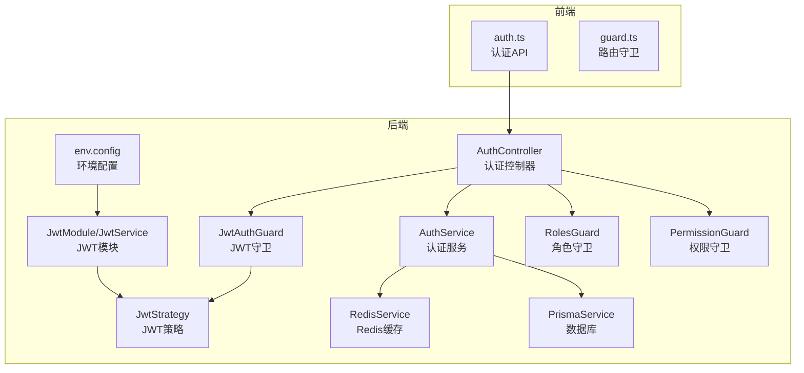
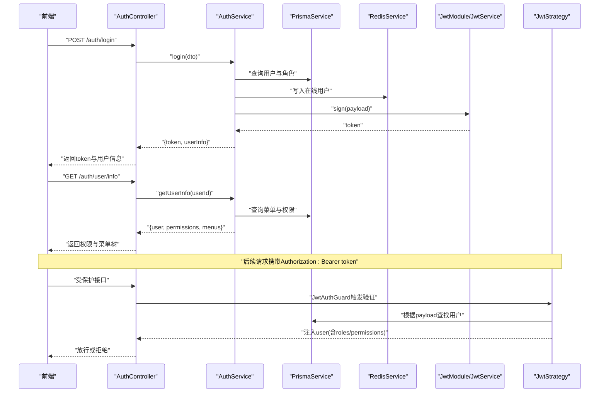
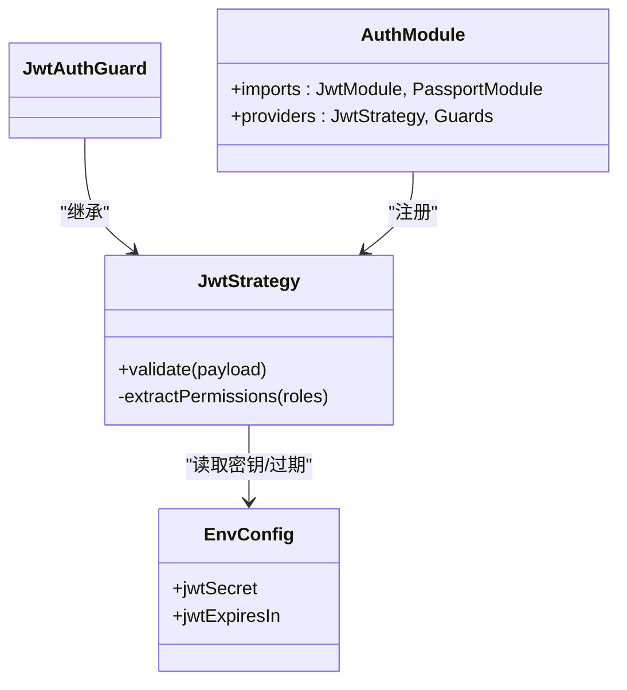
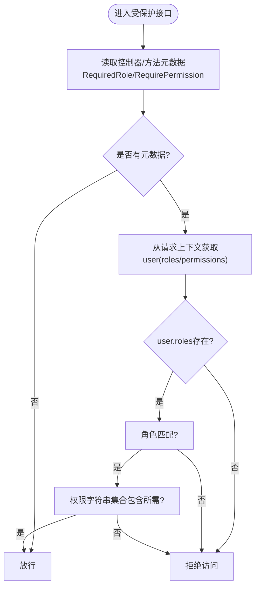
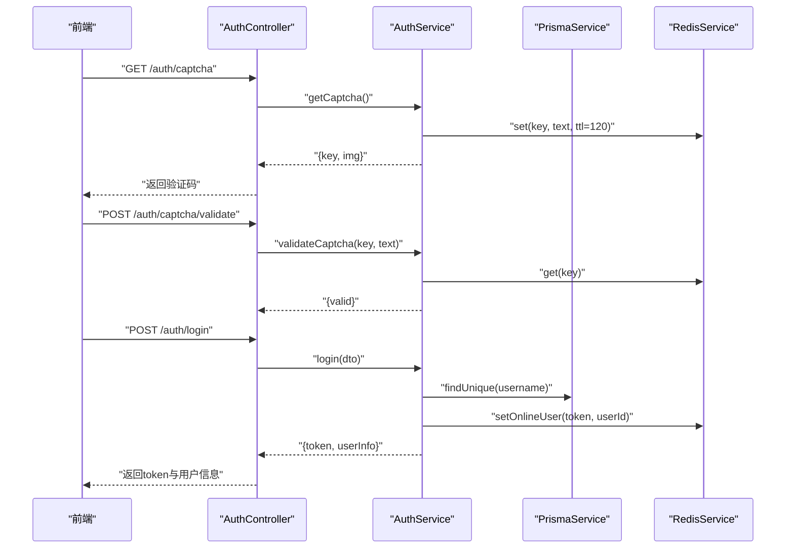
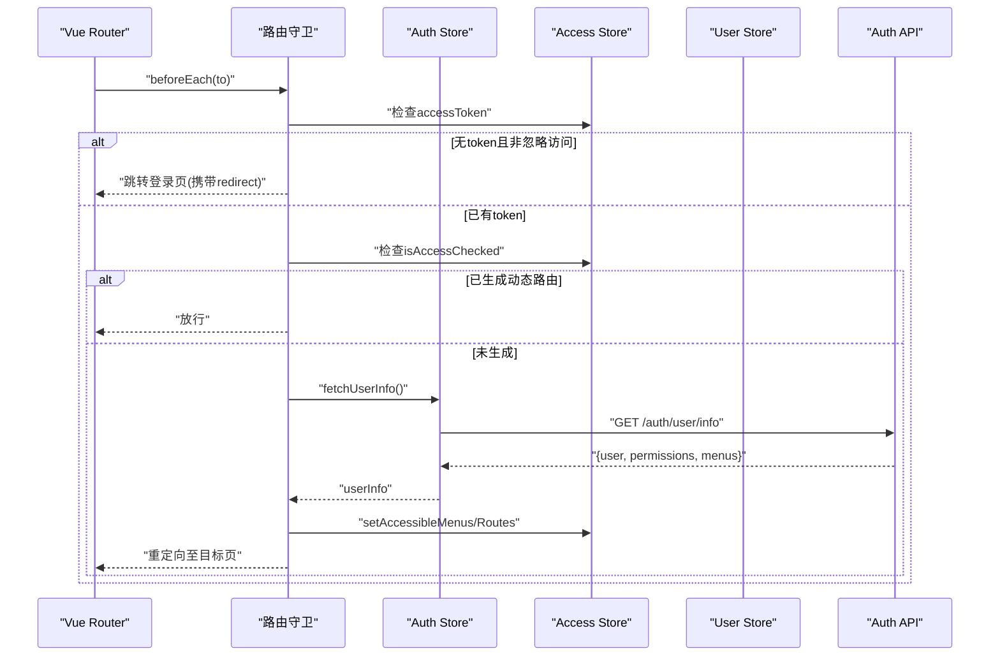
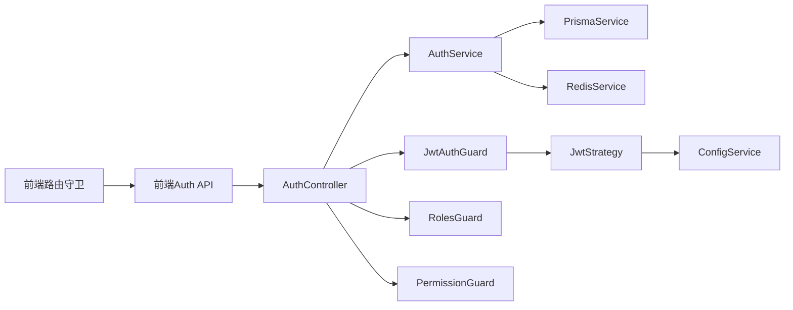

# 认证授权问题

<cite>
**本文引用的文件**
- [apps/backend/src/auth/auth.controller.ts](file://apps/backend/src/auth/auth.controller.ts)
- [apps/backend/src/auth/auth.service.ts](file://apps/backend/src/auth/auth.service.ts)
- [apps/backend/src/auth/guards.ts](file://apps/backend/src/auth/guards.ts)
- [apps/backend/src/auth/jwt.guard.ts](file://apps/backend/src/auth/jwt.guard.ts)
- [apps/backend/src/auth/jwt.strategy.ts](file://apps/backend/src/auth/jwt.strategy.ts)
- [apps/backend/src/auth/auth.module.ts](file://apps/backend/src/auth/auth.module.ts)
- [apps/backend/src/config/env.config.ts](file://apps/backend/src/config/env.config.ts)
- [apps/backend/src/cache/redis.service.ts](file://apps/backend/src/cache/redis.service.ts)
- [apps/backend/src/common/prisma.service.ts](file://apps/backend/src/common/prisma.service.ts)
- [apps/backend/src/modules/system/user/user.controller.ts](file://apps/backend/src/modules/system/user/user.controller.ts)
- [apps/backend/src/modules/system/menu/menu.controller.ts](file://apps/backend/src/modules/system/menu/menu.controller.ts)
- [apps/backend/src/modules/system/role/role.controller.ts](file://apps/backend/src/modules/system/role/role.controller.ts)
- [apps/vben-admin/apps/web-antd/src/api/core/auth.ts](file://apps/vben-admin/apps/web-antd/src/api/core/auth.ts)
- [apps/vben-admin/apps/web-antd/src/router/guard.ts](file://apps/vben-admin/apps/web-antd/src/router/guard.ts)
</cite>

## 目录
1. [引言](#引言)
2. [项目结构](#项目结构)
3. [核心组件](#核心组件)
4. [架构总览](#架构总览)
5. [详细组件分析](#详细组件分析)
6. [依赖关系分析](#依赖关系分析)
7. [性能考量](#性能考量)
8. [故障排查指南](#故障排查指南)
9. [结论](#结论)
10. [附录](#附录)

## 引言
本指南聚焦于认证与授权问题的系统化排查，覆盖以下关键场景：
- JWT 令牌生成与验证失败：密钥配置错误、过期时间不当、签名算法不匹配等
- 权限验证失败：角色权限配置错误、菜单权限缺失、按钮级权限控制失效
- 用户登录失败：密码错误、账户禁用、验证码校验失败、并发登录冲突
- 认证中间件调试与日志分析
- 安全相关问题：CSRF 防护、XSS 防范建议

目标是帮助开发者快速定位并修复问题，同时为非技术读者提供可操作的排障步骤。

## 项目结构
后端采用 NestJS 架构，认证模块位于 apps/backend/src/auth，前端使用 Vben Admin 的路由守卫与 API 层进行鉴权控制。数据库通过 Prisma 访问，缓存使用 Redis。

图表来源
- [apps/backend/src/auth/auth.controller.ts:1-87](file://apps/backend/src/auth/auth.controller.ts#L1-L87)
- [apps/backend/src/auth/auth.service.ts:1-294](file://apps/backend/src/auth/auth.service.ts#L1-L294)
- [apps/backend/src/auth/jwt.strategy.ts:1-78](file://apps/backend/src/auth/jwt.strategy.ts#L1-L78)
- [apps/backend/src/auth/auth.module.ts:1-29](file://apps/backend/src/auth/auth.module.ts#L1-L29)
- [apps/backend/src/cache/redis.service.ts:1-128](file://apps/backend/src/cache/redis.service.ts#L1-L128)
- [apps/backend/src/common/prisma.service.ts:1-22](file://apps/backend/src/common/prisma.service.ts#L1-L22)
- [apps/backend/src/config/env.config.ts:1-47](file://apps/backend/src/config/env.config.ts#L1-L47)
- [apps/vben-admin/apps/web-antd/src/api/core/auth.ts:1-122](file://apps/vben-admin/apps/web-antd/src/api/core/auth.ts#L1-L122)
- [apps/vben-admin/apps/web-antd/src/router/guard.ts:1-134](file://apps/vben-admin/apps/web-antd/src/router/guard.ts#L1-L134)

章节来源
- [apps/backend/src/auth/auth.controller.ts:1-87](file://apps/backend/src/auth/auth.controller.ts#L1-L87)
- [apps/backend/src/auth/auth.module.ts:1-29](file://apps/backend/src/auth/auth.module.ts#L1-L29)
- [apps/backend/src/config/env.config.ts:1-47](file://apps/backend/src/config/env.config.ts#L1-L47)
- [apps/backend/src/cache/redis.service.ts:1-128](file://apps/backend/src/cache/redis.service.ts#L1-L128)
- [apps/backend/src/common/prisma.service.ts:1-22](file://apps/backend/src/common/prisma.service.ts#L1-L22)
- [apps/vben-admin/apps/web-antd/src/api/core/auth.ts:1-122](file://apps/vben-admin/apps/web-antd/src/api/core/auth.ts#L1-L122)
- [apps/vben-admin/apps/web-antd/src/router/guard.ts:1-134](file://apps/vben-admin/apps/web-antd/src/router/guard.ts#L1-L134)

## 核心组件
- 认证控制器：提供登录、注册、验证码、登出、用户信息、在线用户、个人资料与密码修改等接口
- 认证服务：实现登录校验（验证码、密码）、JWT 签发、在线用户管理、菜单与权限聚合
- JWT 模块与策略：从请求头提取 JWT，校验签名与过期，加载用户角色与权限
- 守卫：公共接口标记、角色守卫、权限守卫
- 缓存：Redis 在线用户集合与键值存储
- 数据库：Prisma 连接与查询
- 前端 API 与路由守卫：统一调用后端认证接口，基于用户权限生成可访问菜单与路由

章节来源
- [apps/backend/src/auth/auth.controller.ts:1-87](file://apps/backend/src/auth/auth.controller.ts#L1-L87)
- [apps/backend/src/auth/auth.service.ts:1-294](file://apps/backend/src/auth/auth.service.ts#L1-L294)
- [apps/backend/src/auth/jwt.strategy.ts:1-78](file://apps/backend/src/auth/jwt.strategy.ts#L1-L78)
- [apps/backend/src/auth/guards.ts:1-51](file://apps/backend/src/auth/guards.ts#L1-L51)
- [apps/backend/src/cache/redis.service.ts:1-128](file://apps/backend/src/cache/redis.service.ts#L1-L128)
- [apps/backend/src/common/prisma.service.ts:1-22](file://apps/backend/src/common/prisma.service.ts#L1-L22)
- [apps/vben-admin/apps/web-antd/src/api/core/auth.ts:1-122](file://apps/vben-admin/apps/web-antd/src/api/core/auth.ts#L1-L122)
- [apps/vben-admin/apps/web-antd/src/router/guard.ts:1-134](file://apps/vben-admin/apps/web-antd/src/router/guard.ts#L1-L134)

## 架构总览
下图展示登录与权限验证的关键流程，包括 JWT 生成、签发、携带与验证、权限聚合与前端路由生成。

图表来源
- [apps/backend/src/auth/auth.controller.ts:1-87](file://apps/backend/src/auth/auth.controller.ts#L1-L87)
- [apps/backend/src/auth/auth.service.ts:1-294](file://apps/backend/src/auth/auth.service.ts#L1-L294)
- [apps/backend/src/auth/jwt.strategy.ts:1-78](file://apps/backend/src/auth/jwt.strategy.ts#L1-L78)
- [apps/backend/src/cache/redis.service.ts:1-128](file://apps/backend/src/cache/redis.service.ts#L1-L128)
- [apps/backend/src/common/prisma.service.ts:1-22](file://apps/backend/src/common/prisma.service.ts#L1-L22)

## 详细组件分析

### 组件A：JWT 生成与验证
- 密钥与过期时间来源于环境配置，未设置时使用默认值
- 登录成功后签发 JWT 并写入在线用户集合
- 请求头携带 Authorization: Bearer token，策略负责校验签名与过期
- 超时或密钥不一致会导致验证失败

图表来源
- [apps/backend/src/auth/jwt.strategy.ts:1-78](file://apps/backend/src/auth/jwt.strategy.ts#L1-L78)
- [apps/backend/src/auth/jwt.guard.ts:1-5](file://apps/backend/src/auth/jwt.guard.ts#L1-L5)
- [apps/backend/src/auth/auth.module.ts:1-29](file://apps/backend/src/auth/auth.module.ts#L1-L29)
- [apps/backend/src/config/env.config.ts:1-47](file://apps/backend/src/config/env.config.ts#L1-L47)

章节来源
- [apps/backend/src/auth/jwt.strategy.ts:1-78](file://apps/backend/src/auth/jwt.strategy.ts#L1-L78)
- [apps/backend/src/auth/auth.module.ts:1-29](file://apps/backend/src/auth/auth.module.ts#L1-L29)
- [apps/backend/src/config/env.config.ts:1-47](file://apps/backend/src/config/env.config.ts#L1-L47)

### 组件B：权限验证与菜单生成
- 角色守卫与权限守卫通过反射读取元数据，判断用户角色与权限集合
- 菜单树构建与按钮级权限来源于用户角色关联的菜单权限字符串
- 超级管理员拥有全部权限，普通用户仅能访问其角色授权的菜单

图表来源
- [apps/backend/src/auth/guards.ts:1-51](file://apps/backend/src/auth/guards.ts#L1-L51)
- [apps/backend/src/auth/auth.service.ts:135-187](file://apps/backend/src/auth/auth.service.ts#L135-L187)

章节来源
- [apps/backend/src/auth/guards.ts:1-51](file://apps/backend/src/auth/guards.ts#L1-L51)
- [apps/backend/src/auth/auth.service.ts:135-187](file://apps/backend/src/auth/auth.service.ts#L135-L187)

### 组件C：登录流程与验证码
- 登录前需先获取验证码并校验，验证码存入 Redis 并设置过期
- 登录时校验用户名、状态、密码，成功后签发 JWT 并记录登录日志

图表来源
- [apps/backend/src/auth/auth.controller.ts:1-87](file://apps/backend/src/auth/auth.controller.ts#L1-L87)
- [apps/backend/src/auth/auth.service.ts:1-294](file://apps/backend/src/auth/auth.service.ts#L1-L294)
- [apps/backend/src/cache/redis.service.ts:1-128](file://apps/backend/src/cache/redis.service.ts#L1-L128)
- [apps/backend/src/common/prisma.service.ts:1-22](file://apps/backend/src/common/prisma.service.ts#L1-L22)

章节来源
- [apps/backend/src/auth/auth.controller.ts:1-87](file://apps/backend/src/auth/auth.controller.ts#L1-L87)
- [apps/backend/src/auth/auth.service.ts:1-294](file://apps/backend/src/auth/auth.service.ts#L1-L294)
- [apps/backend/src/cache/redis.service.ts:1-128](file://apps/backend/src/cache/redis.service.ts#L1-L128)
- [apps/backend/src/common/prisma.service.ts:1-22](file://apps/backend/src/common/prisma.service.ts#L1-L22)

### 组件D：前端路由守卫与权限消费
- 路由守卫在进入受控页面前检查访问令牌与已生成的访问权限
- 若无令牌且目标页面需要权限，自动跳转登录页并携带重定向地址
- 成功获取用户信息后，基于角色生成可访问菜单与路由

图表来源
- [apps/vben-admin/apps/web-antd/src/router/guard.ts:1-134](file://apps/vben-admin/apps/web-antd/src/router/guard.ts#L1-L134)
- [apps/vben-admin/apps/web-antd/src/api/core/auth.ts:1-122](file://apps/vben-admin/apps/web-antd/src/api/core/auth.ts#L1-L122)

章节来源
- [apps/vben-admin/apps/web-antd/src/router/guard.ts:1-134](file://apps/vben-admin/apps/web-antd/src/router/guard.ts#L1-L134)
- [apps/vben-admin/apps/web-antd/src/api/core/auth.ts:1-122](file://apps/vben-admin/apps/web-antd/src/api/core/auth.ts#L1-L122)

## 依赖关系分析
- 认证模块依赖 JwtModule 提供的签名与过期配置；JwtStrategy 依赖 Prisma 与 ConfigService
- AuthService 依赖 Prisma、JwtService、ConfigService、RedisService
- 控制器通过守卫串联 JwtAuthGuard、角色守卫与权限守卫
- 前端通过统一 API 层与后端交互，路由守卫消费后端返回的权限与菜单

图表来源
- [apps/backend/src/auth/auth.controller.ts:1-87](file://apps/backend/src/auth/auth.controller.ts#L1-L87)
- [apps/backend/src/auth/auth.service.ts:1-294](file://apps/backend/src/auth/auth.service.ts#L1-L294)
- [apps/backend/src/auth/jwt.strategy.ts:1-78](file://apps/backend/src/auth/jwt.strategy.ts#L1-L78)
- [apps/backend/src/auth/auth.module.ts:1-29](file://apps/backend/src/auth/auth.module.ts#L1-L29)
- [apps/backend/src/config/env.config.ts:1-47](file://apps/backend/src/config/env.config.ts#L1-L47)
- [apps/backend/src/cache/redis.service.ts:1-128](file://apps/backend/src/cache/redis.service.ts#L1-L128)
- [apps/backend/src/common/prisma.service.ts:1-22](file://apps/backend/src/common/prisma.service.ts#L1-L22)
- [apps/vben-admin/apps/web-antd/src/api/core/auth.ts:1-122](file://apps/vben-admin/apps/web-antd/src/api/core/auth.ts#L1-L122)
- [apps/vben-admin/apps/web-antd/src/router/guard.ts:1-134](file://apps/vben-admin/apps/web-antd/src/router/guard.ts#L1-L134)

章节来源
- [apps/backend/src/auth/auth.module.ts:1-29](file://apps/backend/src/auth/auth.module.ts#L1-L29)
- [apps/backend/src/config/env.config.ts:1-47](file://apps/backend/src/config/env.config.ts#L1-L47)
- [apps/backend/src/cache/redis.service.ts:1-128](file://apps/backend/src/cache/redis.service.ts#L1-L128)
- [apps/backend/src/common/prisma.service.ts:1-22](file://apps/backend/src/common/prisma.service.ts#L1-L22)
- [apps/vben-admin/apps/web-antd/src/api/core/auth.ts:1-122](file://apps/vben-admin/apps/web-antd/src/api/core/auth.ts#L1-L122)
- [apps/vben-admin/apps/web-antd/src/router/guard.ts:1-134](file://apps/vben-admin/apps/web-antd/src/router/guard.ts#L1-L134)

## 性能考量
- JWT 过期时间应结合业务场景平衡安全性与用户体验，避免频繁刷新导致的性能损耗
- Redis 在线用户集合与键值缓存需合理设置 TTL，防止内存膨胀
- 菜单树构建与权限聚合在用户角色较多时可能产生额外查询，建议对热点数据做缓存
- 前端路由守卫仅在首次进入受控页面时生成动态路由，后续复用以减少请求

## 故障排查指南

### 一、JWT 令牌生成与验证失败
常见原因与排查步骤：
- 密钥配置错误
  - 确认环境变量 JWT_SECRET 是否正确设置，且与 JwtModule 注册时使用的密钥一致
  - 若未设置，系统会使用默认密钥，可能导致前后端密钥不一致
  - 参考路径：[apps/backend/src/config/env.config.ts](file://apps/backend/src/config/env.config.ts#L6)、[apps/backend/src/auth/auth.module.ts](file://apps/backend/src/auth/auth.module.ts#L17)
- 过期时间设置不当
  - 检查 JWT_EXPIRES_IN 是否符合预期；过短会导致频繁刷新，过长增加泄露风险
  - 参考路径：[apps/backend/src/config/env.config.ts](file://apps/backend/src/config/env.config.ts#L7)、[apps/backend/src/auth/auth.module.ts](file://apps/backend/src/auth/auth.module.ts#L19)
- 签名算法不匹配
  - 确保使用 passport-jwt 默认算法（HS256）且密钥一致
  - 参考路径：[apps/backend/src/auth/jwt.strategy.ts](file://apps/backend/src/auth/jwt.strategy.ts#L16)
- 令牌被篡改或过期
  - 查看登录响应中的 token 是否有效；若无效，重新登录并检查服务器时间同步
  - 参考路径：[apps/backend/src/auth/auth.controller.ts:17-18](file://apps/backend/src/auth/auth.controller.ts#L17-L18)、[apps/backend/src/auth/auth.service.ts:62-63](file://apps/backend/src/auth/auth.service.ts#L62-L63)

修复建议：
- 使用强随机密钥替换默认密钥
- 合理设置过期时间，结合刷新令牌策略
- 统一前后端签名算法与密钥

### 二、权限验证失败
常见原因与排查步骤：
- 角色权限配置错误
  - 检查用户角色是否正确分配；超级管理员拥有全部权限，普通用户仅能访问授权菜单
  - 参考路径：[apps/backend/src/auth/jwt.strategy.ts:46-52](file://apps/backend/src/auth/jwt.strategy.ts#L46-L52)
- 菜单权限缺失
  - 确认菜单的权限字符串 perms 是否填写；按钮级权限依赖菜单权限
  - 参考路径：[apps/backend/src/auth/auth.service.ts](file://apps/backend/src/auth/auth.service.ts#L184)
- 按钮级权限控制失效
  - 检查控制器方法是否添加 RequirePermission 元数据；前端是否正确消费权限集合
  - 参考路径：[apps/backend/src/modules/system/user/user.controller.ts](file://apps/backend/src/modules/system/user/user.controller.ts#L27)、[apps/vben-admin/apps/web-antd/src/router/guard.ts:99-104](file://apps/vben-admin/apps/web-antd/src/router/guard.ts#L99-L104)

修复建议：
- 在后台管理系统中为角色分配正确的菜单与权限
- 前端路由守卫确保在获取用户信息后生成动态路由与菜单树

### 三、用户登录失败
常见场景与排查步骤：
- 密码错误
  - 登录失败会记录登录日志；确认密码加密方式与 bcrypt 对比逻辑
  - 参考路径：[apps/backend/src/auth/auth.service.ts:48-59](file://apps/backend/src/auth/auth.service.ts#L48-L59)
- 账户禁用
  - 用户状态非启用时拒绝登录；检查用户状态字段
  - 参考路径：[apps/backend/src/auth/auth.service.ts:44-46](file://apps/backend/src/auth/auth.service.ts#L44-L46)
- 验证码错误或过期
  - 验证码存入 Redis 并设置过期；校验失败会抛出异常
  - 参考路径：[apps/backend/src/auth/auth.service.ts:121-128](file://apps/backend/src/auth/auth.service.ts#L121-L128)、[apps/backend/src/cache/redis.service.ts:116-118](file://apps/backend/src/cache/redis.service.ts#L116-L118)
- 多设备登录冲突
  - 登录成功后写入在线用户集合；若存在冲突，可考虑引入单点登录策略或强制踢出旧会话
  - 参考路径：[apps/backend/src/auth/auth.service.ts](file://apps/backend/src/auth/auth.service.ts#L64)、[apps/backend/src/cache/redis.service.ts:83-91](file://apps/backend/src/cache/redis.service.ts#L83-L91)

修复建议：
- 严格校验验证码有效期与大小写
- 对异常登录行为增加风控策略（如限制尝试次数）

### 四、认证中间件调试与日志分析
- 后端日志
  - Redis 连接状态与错误事件；数据库连接与日志级别
  - 参考路径：[apps/backend/src/cache/redis.service.ts:16-22](file://apps/backend/src/cache/redis.service.ts#L16-L22)、[apps/backend/src/common/prisma.service.ts:10-11](file://apps/backend/src/common/prisma.service.ts#L10-L11)
- 前端日志
  - 路由守卫打印访问令牌与用户信息；网络层捕获 401/403 错误
  - 参考路径：[apps/vben-admin/apps/web-antd/src/router/guard.ts:48-86](file://apps/vben-admin/apps/web-antd/src/router/guard.ts#L48-L86)、[apps/vben-admin/apps/web-antd/src/api/core/auth.ts:68-70](file://apps/vben-admin/apps/web-antd/src/api/core/auth.ts#L68-L70)

### 五、安全相关问题
- CSRF 攻击防护
  - 建议：对状态变更类请求（PUT/POST/DELETE）启用 SameSite Cookie、CSRF Token 校验、CORS 白名单
  - 说明：当前代码未见专门的 CSRF 中间件，建议在网关或中间件层补充
- XSS 攻击防范
  - 建议：输入输出过滤、内容安全策略（CSP）、富文本编辑器白名单
  - 说明：前端模板与渲染需遵循最小暴露原则，避免内联脚本

## 结论
本指南围绕 JWT 生成验证、权限体系、登录流程与前端路由守卫，提供了系统化的排查思路与修复建议。建议优先检查密钥与过期配置一致性，完善角色与菜单权限映射，并加强验证码与登录日志的监控。对于安全问题，应在网关与前端层面补齐 CSRF 与 XSS 防护措施。

## 附录
- 关键接口与职责
  - 登录：[apps/backend/src/auth/auth.controller.ts:14-19](file://apps/backend/src/auth/auth.controller.ts#L14-L19)
  - 用户信息：[apps/backend/src/auth/auth.controller.ts:54-58](file://apps/backend/src/auth/auth.controller.ts#L54-L58)
  - 权限守卫：[apps/backend/src/auth/guards.ts:37-50](file://apps/backend/src/auth/guards.ts#L37-L50)
  - 菜单权限：[apps/backend/src/auth/auth.service.ts](file://apps/backend/src/auth/auth.service.ts#L184)
  - 前端路由守卫：[apps/vben-admin/apps/web-antd/src/router/guard.ts:47-119](file://apps/vben-admin/apps/web-antd/src/router/guard.ts#L47-L119)