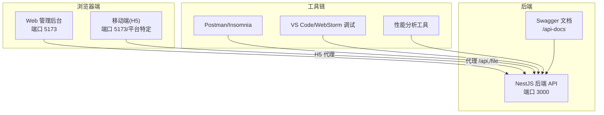
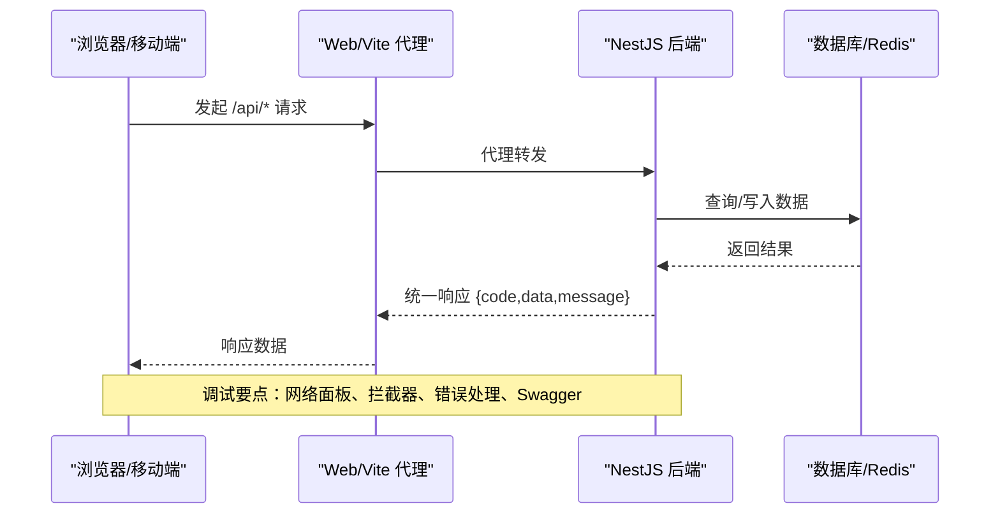
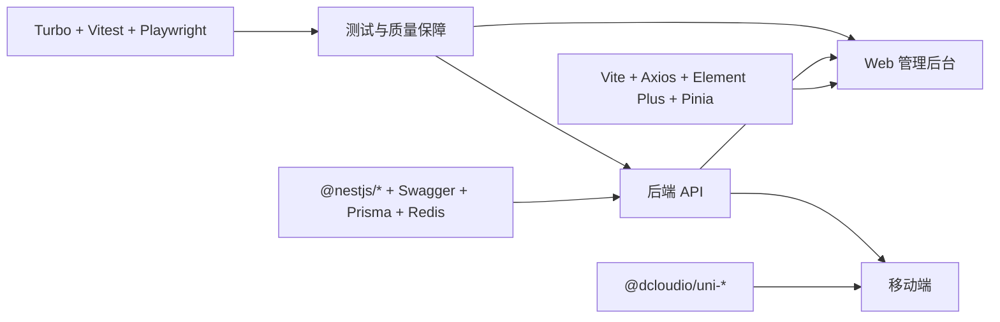
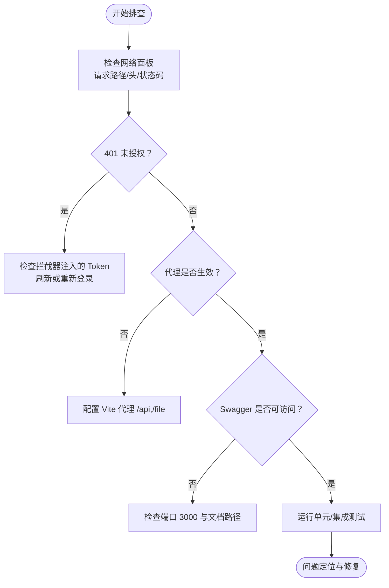

# 调试工具使用

<cite>
**本文引用的文件**
- [README.md](file://README.md)
- [apps/backend/package.json](file://apps/backend/package.json)
- [apps/app/package.json](file://apps/app/package.json)
- [apps/vben-admin/package.json](file://apps/vben-admin/package.json)
- [apps/fronted/src/utils/request.ts](file://apps/fronted/src/utils/request.ts)
- [apps/vben-admin/packages/effects/request/src/request-client/request-client.test.ts](file://apps/vben-admin/packages/effects/request/src/request-client/request-client.test.ts)
- [apps/vben-admin/internal/tsconfig/node.json](file://apps/vben-admin/internal/tsconfig/node.json)
- [apps/vben-admin/.browserslistrc](file://apps/vben-admin/.browserslistrc)
- [apps/backend/package-lock.json](file://apps/backend/package-lock.json)
- [apps/app/package-lock.json](file://apps/app/package-lock.json)
- [docs/development.md](file://docs/development.md)
</cite>

## 目录
1. [简介](#简介)
2. [项目结构](#项目结构)
3. [核心组件](#核心组件)
4. [架构总览](#架构总览)
5. [详细组件分析](#详细组件分析)
6. [依赖分析](#依赖分析)
7. [性能考虑](#性能考虑)
8. [故障排查指南](#故障排查指南)
9. [结论](#结论)
10. [附录](#附录)

## 简介
本指南面向使用 Nest-Admin-Pro 项目的开发者，系统讲解各类调试工具在本项目中的实战用法，覆盖浏览器开发者工具（网络面板、控制台、源码调试、性能分析）、Node.js 应用调试（断点调试、异步函数调试、内存分析、性能剖析）、API 测试工具（Postman/Insomnia 的环境变量、集合执行与自动化）、IDE 调试配置（VS Code/WebStorm）、移动端调试（真机/模拟器/小程序）以及远程与生产环境调试技巧。文档结合项目实际的后端、前端与移动端工程，给出可操作的步骤与最佳实践。

## 项目结构
本项目采用多应用组织方式，包含后端 NestJS API、Web 管理后台（Vue 3 + Vite）、移动端（UniApp）以及大型前端工程（vben-admin monorepo）。各应用的调试入口与端口如下：
- 后端 API：默认端口 3000，提供 Swagger 文档与统一响应格式
- Web 管理后台：默认端口 5173，配置了对后端 /api 与 /file 的代理
- 移动端：H5 开发与多小程序平台开发命令
- vben-admin monorepo：多包工程，包含测试与构建脚本

**章节来源**
- [README.md: 119-220:119-220](file://README.md#L119-L220)
- [README.md: 83](file://README.md#L83)
- [apps/backend/package.json: 6-11:6-11](file://apps/backend/package.json#L6-L11)
- [apps/app/package.json: 4-37:4-37](file://apps/app/package.json#L4-L37)
- [apps/vben-admin/package.json: 27-52:27-52](file://apps/vben-admin/package.json#L27-L52)

## 核心组件
- 后端 API（NestJS）：提供统一响应格式、全局异常过滤、参数校验、限流、Swagger 文档等，便于调试与联调
- Web 管理后台（Vue 3 + Vite）：通过代理将 /api 与 /file 转发至后端，便于本地联调
- 移动端（UniApp）：提供 H5 与多小程序平台的开发命令，便于跨端调试
- vben-admin monorepo：包含测试脚本与工具链，适合进行端到端测试与性能分析

**章节来源**
- [README.md: 73-118:73-118](file://README.md#L73-L118)
- [apps/backend/package.json: 16-42:16-42](file://apps/backend/package.json#L16-L42)
- [apps/fronted/src/utils/request.ts: 1-50:1-50](file://apps/fronted/src/utils/request.ts#L1-L50)

## 架构总览
下图展示了浏览器端、移动端与后端之间的请求流向，以及调试关注点（代理、拦截器、错误处理、文档）：

**图表来源**
- [apps/fronted/src/utils/request.ts: 14-48:14-48](file://apps/fronted/src/utils/request.ts#L14-L48)
- [README.md: 183-187:183-187](file://README.md#L183-L187)

**章节来源**
- [apps/fronted/src/utils/request.ts: 1-50:1-50](file://apps/fronted/src/utils/request.ts#L1-L50)
- [README.md: 183-187:183-187](file://README.md#L183-L187)

## 详细组件分析

### 浏览器开发者工具调试
- 网络面板
  - 关注 /api 与 /file 请求的路径、请求头 Authorization、响应体结构与状态码
  - 利用“复制请求”功能导出到 Postman/Insomnia，便于离线复现
- 控制台
  - 查看请求拦截器注入的 Bearer Token、错误提示与堆栈
  - 使用 console 与断点定位问题
- 源码调试
  - 在 Vite 开发服务器下启用 Source Map，映射到源文件
  - 设置条件断点与日志断点，观察状态变化
- 性能分析
  - 使用 Performance 面板录制交互，分析首屏与关键路径耗时
  - 结合 Network 面板查看资源加载与瓶颈

**章节来源**
- [apps/fronted/src/utils/request.ts: 14-48:14-48](file://apps/fronted/src/utils/request.ts#L14-L48)
- [apps/backend/package-lock.json: 5177-5188:5177-5188](file://apps/backend/package-lock.json#L5177-L5188)
- [apps/app/package-lock.json: 12384-12403:12384-12403](file://apps/app/package-lock.json#L12384-L12403)

### Node.js 应用调试（后端 NestJS）
- 断点调试
  - 使用 VS Code/WebStorm 的 Node 调试器附加到 NestJS 进程
  - 在控制器、服务、拦截器与守卫中设置断点
- 异步函数调试
  - 关注中间件、拦截器与管道中的 Promise/async/await
  - 使用日志与断点配合，定位异常抛出位置
- 内存分析
  - 使用 Node 内置诊断工具或外部工具采集 Heap 快照
  - 关注长连接、缓存与定时任务导致的内存增长
- 性能剖析
  - 使用 CPU Profiler 识别热点函数
  - 结合日志与指标（如 Redis、数据库）定位慢点

**章节来源**
- [apps/backend/package.json: 6-11:6-11](file://apps/backend/package.json#L6-L11)
- [apps/backend/package.json: 16-42:16-42](file://apps/backend/package.json#L16-L42)

### API 测试工具（Postman/Insomnia）
- 环境变量管理
  - 定义 baseUrl、token、tenant 等变量，实现多环境切换
- 测试集合执行
  - 将登录接口作为前置脚本，自动注入 Authorization
  - 使用 Tests 脚本断言响应 code 与关键字段
- 自动化测试
  - 结合 CI/CD，使用 newman 或 Insomnia CLI 执行集合
  - 将 Swagger 文档导出为 OpenAPI/Swagger，自动生成测试用例

**章节来源**
- [apps/fronted/src/utils/request.ts: 14-48:14-48](file://apps/fronted/src/utils/request.ts#L14-L48)
- [README.md: 294-311:294-311](file://README.md#L294-L311)

### IDE 调试配置（VS Code/WebStorm）
- VS Code
  - 使用 launch.json 配置 Node 调试，附加到 NestJS 进程
  - 启用 Source Map 与断点策略，结合 TypeScript 插件
- WebStorm
  - 使用内置 Node 调试器，配置运行/调试配置
  - 针对 Vite 项目启用“在浏览器中打开”与“源码映射”

**章节来源**
- [apps/backend/package.json: 6-11:6-11](file://apps/backend/package.json#L6-L11)
- [apps/backend/package-lock.json: 5177-5188:5177-5188](file://apps/backend/package-lock.json#L5177-L5188)

### 移动端调试（真机/模拟器/小程序）
- H5 调试
  - 使用浏览器开发者工具，结合代理与断点
- 真机/模拟器
  - 打开调试模式，查看控制台日志与网络请求
  - 使用断点与条件断点定位逻辑问题
- 小程序
  - 使用对应 IDE 的调试器（微信开发者工具等）
  - 关注跨平台差异与平台限制

**章节来源**
- [apps/app/package.json: 4-37:4-37](file://apps/app/package.json#L4-L37)
- [README.md: 102-118:102-118](file://README.md#L102-L118)

### 远程与生产环境调试
- 日志与可观测性
  - 后端统一响应与异常过滤便于快速定位
  - 前端拦截器与消息提示帮助发现业务错误
- 代理与跨域
  - 本地开发使用 Vite 代理，避免跨域问题
- 生产环境注意事项
  - 严格区分环境变量，避免敏感信息泄露
  - 使用只读日志与采样探针，降低对性能的影响

**章节来源**
- [apps/fronted/src/utils/request.ts: 14-48:14-48](file://apps/fronted/src/utils/request.ts#L14-L48)
- [README.md: 83](file://README.md#L83)

## 依赖分析
- 后端依赖
  - NestJS 核心、Swagger、Throttler、Prisma、ioredis 等，调试时重点关注异常过滤、拦截器与缓存
- 前端依赖
  - Vite、Axios、Element Plus、Pinia 等，调试时关注拦截器、状态管理与组件生命周期
- vben-admin 依赖
  - Turbo、Vitest、Playwright 等，适合进行端到端测试与性能分析

**图表来源**
- [apps/backend/package.json: 16-42:16-42](file://apps/backend/package.json#L16-L42)
- [apps/fronted/src/utils/request.ts: 1-50:1-50](file://apps/fronted/src/utils/request.ts#L1-L50)
- [apps/app/package.json: 39-70:39-70](file://apps/app/package.json#L39-L70)
- [apps/vben-admin/package.json: 27-96:27-96](file://apps/vben-admin/package.json#L27-L96)

**章节来源**
- [apps/backend/package.json: 16-42:16-42](file://apps/backend/package.json#L16-L42)
- [apps/fronted/src/utils/request.ts: 1-50:1-50](file://apps/fronted/src/utils/request.ts#L1-L50)
- [apps/app/package.json: 39-70:39-70](file://apps/app/package.json#L39-L70)
- [apps/vben-admin/package.json: 27-96:27-96](file://apps/vben-admin/package.json#L27-L96)

## 性能考虑
- 前端性能
  - 使用 Vite 的 Source Map 与懒加载，减少首屏体积
  - 通过 Performance 面板识别长任务与重渲染
- 后端性能
  - 使用 Throttler 限制请求频率，避免过载
  - 结合 Redis 缓存热点数据，降低数据库压力
- 测试与分析
  - 使用 Vitest 与 Playwright 进行自动化测试与回归
  - 通过 Swagger 文档与 API 测试工具验证接口稳定性

**章节来源**
- [apps/vben-admin/packages/effects/request/src/request-client/request-client.test.ts: 1-42:1-42](file://apps/vben-admin/packages/effects/request/src/request-client/request-client.test.ts#L1-L42)
- [apps/vben-admin/package.json: 27-52:27-52](file://apps/vben-admin/package.json#L27-L52)
- [apps/backend/package.json: 23-26:23-26](file://apps/backend/package.json#L23-L26)

## 故障排查指南
- 常见问题定位
  - 401 未授权：检查 Authorization 头是否正确注入，Token 是否过期
  - 跨域与代理：确认 Vite 代理配置是否覆盖 /api 与 /file
  - 环境变量：核对 .env 与 Swagger 认证配置
- 单元测试与端到端测试
  - 使用 pnpm test 与测试脚本验证核心流程
  - 通过 Mock Adapter 模拟网络请求，隔离外部依赖

**图表来源**
- [apps/fronted/src/utils/request.ts: 14-48:14-48](file://apps/fronted/src/utils/request.ts#L14-L48)
- [README.md: 183-187:183-187](file://README.md#L183-L187)
- [docs/development.md: 230-242:230-242](file://docs/development.md#L230-L242)

**章节来源**
- [apps/fronted/src/utils/request.ts: 14-48:14-48](file://apps/fronted/src/utils/request.ts#L14-L48)
- [README.md: 183-187:183-187](file://README.md#L183-L187)
- [docs/development.md: 230-242:230-242](file://docs/development.md#L230-L242)

## 结论
本指南围绕 Nest-Admin-Pro 的多端架构，提供了从浏览器到后端、从前端到移动端的全链路调试方法。建议在日常开发中：
- 建立完善的环境变量与测试集合
- 使用拦截器与统一响应格式提升可观测性
- 结合代理与 Source Map 提升调试效率
- 通过测试与性能分析持续优化系统稳定性与性能

## 附录
- 开发与测试常用命令参考
  - 后端：开发、构建、生成 Prisma 客户端、数据库推送
  - Web：开发、构建、预览
  - 移动端：H5 与多小程序平台开发/构建
- 浏览器与 Node 调试要点
  - 启用 Source Map、设置断点、利用日志与性能面板
- API 测试与自动化
  - 环境变量、集合执行、Tests 断言与 CI 集成

**章节来源**
- [README.md: 383-412:383-412](file://README.md#L383-L412)
- [apps/backend/package.json: 6-11:6-11](file://apps/backend/package.json#L6-L11)
- [apps/app/package.json: 4-37:4-37](file://apps/app/package.json#L4-L37)
- [apps/vben-admin/package.json: 27-52:27-52](file://apps/vben-admin/package.json#L27-L52)