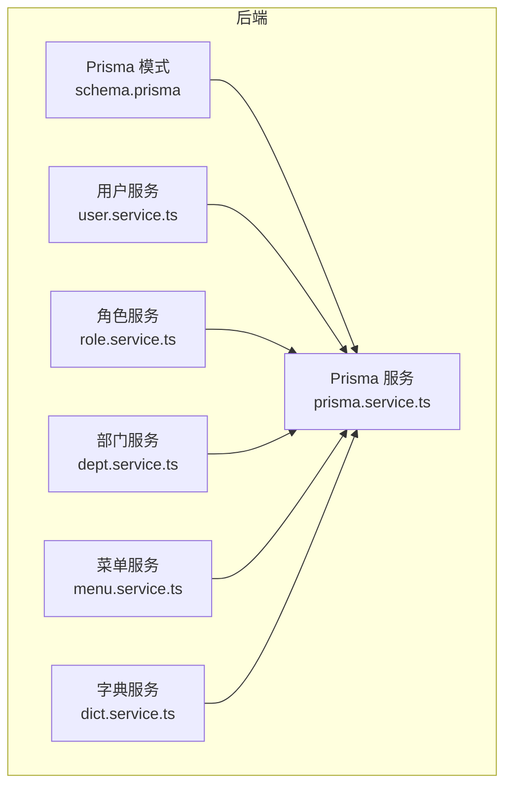
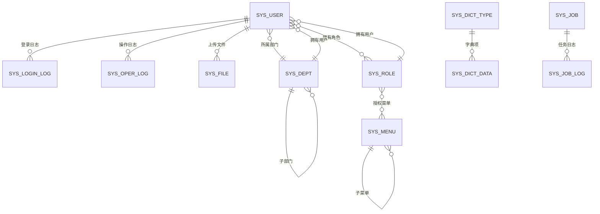
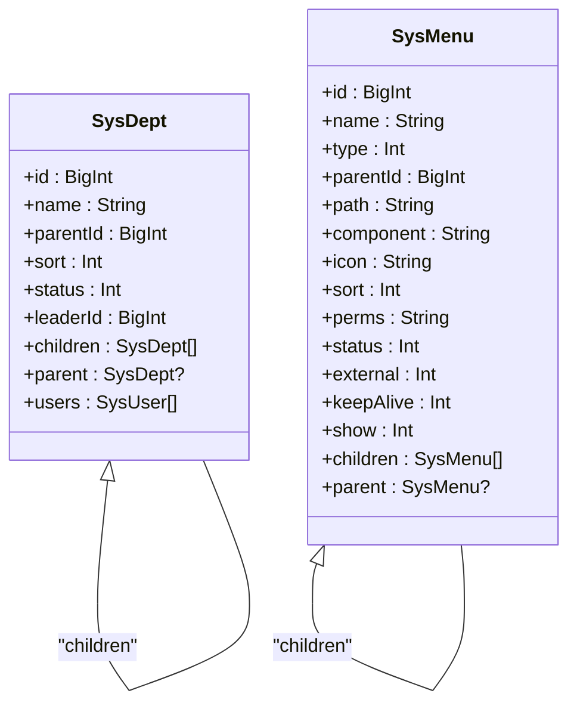
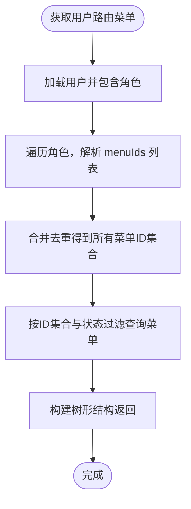
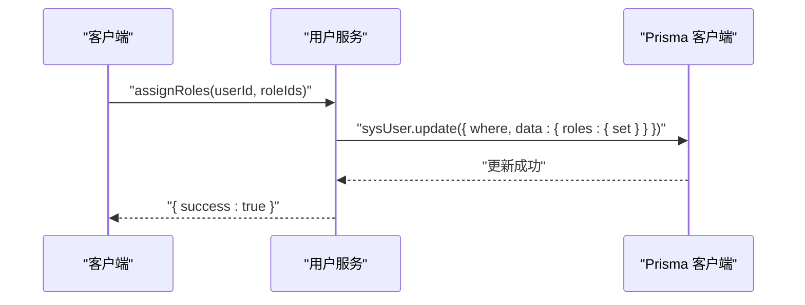
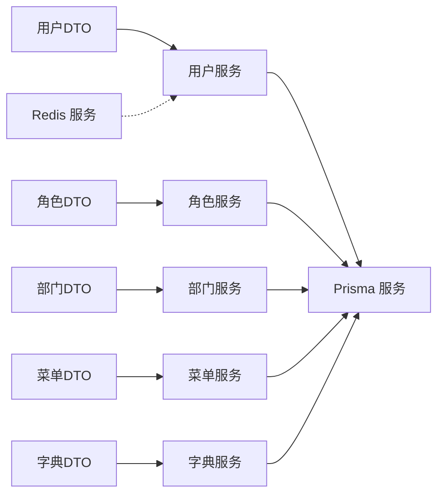

# 实体关系映射

<cite>
**本文引用的文件**
- [schema.prisma](file://apps/backend/prisma/schema.prisma)
- [prisma.service.ts](file://apps/backend/src/common/prisma.service.ts)
- [user.service.ts](file://apps/backend/src/modules/system/user/user.service.ts)
- [role.service.ts](file://apps/backend/src/modules/system/role/role.service.ts)
- [dept.service.ts](file://apps/backend/src/modules/system/dept/dept.service.ts)
- [menu.service.ts](file://apps/backend/src/modules/system/menu/menu.service.ts)
- [dict.service.ts](file://apps/backend/src/modules/system/dict/dict.service.ts)
- [user.dto.ts](file://apps/backend/src/modules/system/user/dto/user.dto.ts)
- [role.dto.ts](file://apps/backend/src/modules/system/role/dto/role.dto.ts)
- [menu.dto.ts](file://apps/backend/src/modules/system/menu/dto/menu.dto.ts)
- [dept.dto.ts](file://apps/backend/src/modules/system/dept/dto/dept.dto.ts)
- [dict.dto.ts](file://apps/backend/src/modules/system/dict/dto/dict.dto.ts)
- [redis.service.ts](file://apps/backend/src/cache/redis.service.ts)
- [user.ts](file://apps/vben-admin/apps/web-antd/src/api/system/user.ts)
</cite>

## 目录
1. [简介](#简介)
2. [项目结构](#项目结构)
3. [核心组件](#核心组件)
4. [架构总览](#架构总览)
5. [详细组件分析](#详细组件分析)
6. [依赖分析](#依赖分析)
7. [性能考虑](#性能考虑)
8. [故障排查指南](#故障排查指南)
9. [结论](#结论)
10. [附录](#附录)

## 简介
本文件系统性梳理后端 Prisma 数据模型之间的实体关系，重点覆盖以下方面：
- 15个数据模型的关联关系设计与职责边界
- 树形结构关系：部门 SysDept 的父子关系、菜单 SysMenu 的层级关系
- 一对多关系：用户-部门、角色-菜单、字典类型-字典数据、用户-角色
- 多对多关系：用户-角色（通过中间态字段实现）
- Prisma relation 字段的定义语法与最佳实践：@relation 装饰器、外键字段映射、索引与排序
- 关系查询方法与 Prisma Client 使用建议
- ER 图与关系图示，帮助快速理解复杂关联

## 项目结构
后端采用 NestJS + Prisma 架构，数据库模式集中在 schema.prisma 中统一定义；各业务模块的服务层负责封装关系查询与业务逻辑。

图表来源
- [schema.prisma](file://apps/backend/prisma/schema.prisma)
- [prisma.service.ts](file://apps/backend/src/common/prisma.service.ts)
- [user.service.ts](file://apps/backend/src/modules/system/user/user.service.ts)
- [role.service.ts](file://apps/backend/src/modules/system/role/role.service.ts)
- [dept.service.ts](file://apps/backend/src/modules/system/dept/dept.service.ts)
- [menu.service.ts](file://apps/backend/src/modules/system/menu/menu.service.ts)
- [dict.service.ts](file://apps/backend/src/modules/system/dict/dict.service.ts)

章节来源
- [schema.prisma](file://apps/backend/prisma/schema.prisma)
- [prisma.service.ts](file://apps/backend/src/common/prisma.service.ts)

## 核心组件
本项目共涉及 15 个数据模型，涵盖系统核心、日志监控、定时任务、代码生成与租户管理等模块。下表给出关键模型与职责概览：

- 系统核心模块
  - SysUser：用户，包含基础信息、状态、部门外键、岗位集合、角色集合、登录/操作日志、文件上传者等
  - SysRole：角色，包含角色编码、状态、数据范围、菜单权限集合、部门权限集合
  - SysDept：部门，树形结构，含 parentId、children、users
  - SysPost：岗位，用于用户绑定多个岗位
  - SysMenu：菜单，树形结构，含 parentId、children、权限标识 perms
  - SysDictType：字典类型，一对多到字典数据
  - SysDictData：字典数据，多对一到字典类型
  - SysConfig：系统配置参数
  - SysNotice：通知公告
  - SysFile：文件记录，可选关联上传人

- 日志监控模块
  - SysLoginLog：登录日志，可选关联用户
  - SysOperLog：操作日志，可选关联用户

- 定时任务模块
  - SysJob：任务，一对多到任务日志
  - SysJobLog：任务日志，多对一到任务

- 代码生成模块
  - GenTable：表元信息，一对多到字段
  - GenTableField：字段，多对一到表

- 租户模块
  - SysTenant：租户

章节来源
- [schema.prisma](file://apps/backend/prisma/schema.prisma)

## 架构总览
下图展示 15 个模型之间的实体关系，标注了主外键、索引与典型查询路径。

图表来源
- [schema.prisma](file://apps/backend/prisma/schema.prisma)

## 详细组件分析

### 树形结构关系：部门与菜单
- 部门 SysDept
  - 通过 parentId 与自身建立自引用关系，使用 @relation 指定关系名，形成父子链路
  - 支持排序字段 sort 与状态过滤，服务层提供构建树形结构的方法
- 菜单 SysMenu
  - 同样通过 parentId 与自身建立自引用关系，支持排序与权限过滤
  - 提供按用户聚合菜单权限并构建路由树的能力

图表来源
- [schema.prisma](file://apps/backend/prisma/schema.prisma)

章节来源
- [schema.prisma](file://apps/backend/prisma/schema.prisma)
- [dept.service.ts](file://apps/backend/src/modules/system/dept/dept.service.ts)
- [menu.service.ts](file://apps/backend/src/modules/system/menu/menu.service.ts)

### 一对多关系详解
- 用户-部门：SysUser.deptId → SysDept.id；查询时 include 部门信息
- 角色-菜单：SysRole.menuIds 为字符串数组（逗号分隔），服务层进行序列化/反序列化；查询时按用户角色聚合菜单 ID 并过滤有效菜单
- 字典类型-字典数据：SysDictType.id → SysDictData.dictTypeId；查询时按类型包含其字典项并排序
- 用户-角色：通过 SysUser.roles 与 SysRole.users 建立一对多；实际赋权通过 set 操作更新

图表来源
- [menu.service.ts](file://apps/backend/src/modules/system/menu/menu.service.ts)
- [user.service.ts](file://apps/backend/src/modules/system/user/user.service.ts)
- [role.service.ts](file://apps/backend/src/modules/system/role/role.service.ts)

章节来源
- [user.service.ts](file://apps/backend/src/modules/system/user/user.service.ts)
- [role.service.ts](file://apps/backend/src/modules/system/role/role.service.ts)
- [menu.service.ts](file://apps/backend/src/modules/system/menu/menu.service.ts)
- [dict.service.ts](file://apps/backend/src/modules/system/dict/dict.service.ts)

### 多对多关系处理
- 用户-角色：通过 SysUser.roles 与 SysRole.users 建立多对多；实际赋权使用 set 操作将角色 ID 集合一次性替换
- 该实现避免了额外的中间表，简化了关系维护，但需注意 set 操作会完全替换现有关系

图表来源
- [user.service.ts](file://apps/backend/src/modules/system/user/user.service.ts)

章节来源
- [user.service.ts](file://apps/backend/src/modules/system/user/user.service.ts)

### Prisma relation 字段定义语法与最佳实践
- @relation 装饰器
  - 用于显式声明关系字段与外键映射，如 SysDept.parent 与 SysDept.children 的双向关系命名
  - 对于自引用关系，必须指定关系名，避免歧义
- 外键字段映射
  - 使用 fields 与 references 明确外键列与被引用列，如 SysUser.deptId → SysDept.id
  - 对于自引用关系，fields 与 references 可省略默认匹配，但建议显式声明增强可读性
- 索引与排序
  - 在 parentId、sort、status 等常用查询字段上建立索引，提升树形构建与筛选性能
  - 排序字段用于保证树形输出顺序稳定
- 级联删除策略
  - 当前模式未显式声明级联删除；删除父节点或菜单时需先检查是否存在子节点，服务层已做保护性校验
  - 如需自动级联删除，可在 @relation 上添加 onDelete 选项（例如 onDelete: Cascade）

章节来源
- [schema.prisma](file://apps/backend/prisma/schema.prisma)
- [dept.service.ts](file://apps/backend/src/modules/system/dept/dept.service.ts)
- [menu.service.ts](file://apps/backend/src/modules/system/menu/menu.service.ts)

### 关系查询方法与最佳实践
- include 关系加载
  - 在列表与详情查询中，使用 include 同步加载关联实体，减少 N+1 查询
  - 示例：用户列表 include 部门与角色
- where 条件与 in 查询
  - 聚合角色菜单 ID 后，使用 in 查询过滤菜单，确保只返回有效且启用的菜单
- JSON 字段处理
  - 角色的 menuIds 与 deptIds 为字符串数组，服务层进行 JSON 解析与序列化
- 树形构建
  - 服务层提供递归构建树形结构的方法，先过滤根节点，再递归挂载子节点
- 性能优化建议
  - 为树形字段（parentId、sort）与高频过滤字段（status、perms、code）建立索引
  - 分页查询时结合 orderBy 与 take/skip，避免全量加载
  - 对于大列表，优先使用 select 精简返回字段，隐藏敏感信息（如密码）

章节来源
- [user.service.ts](file://apps/backend/src/modules/system/user/user.service.ts)
- [menu.service.ts](file://apps/backend/src/modules/system/menu/menu.service.ts)
- [role.service.ts](file://apps/backend/src/modules/system/role/role.service.ts)
- [dept.service.ts](file://apps/backend/src/modules/system/dept/dept.service.ts)
- [dict.service.ts](file://apps/backend/src/modules/system/dict/dict.service.ts)

## 依赖分析
- 模块耦合
  - 服务层依赖 PrismaService 进行数据访问，保持业务与数据层解耦
  - DTO 层负责输入校验与参数传递，与服务层松耦合
- 外部依赖
  - RedisService 用于在线用户等缓存场景，与数据模型无直接关系
- 循环依赖
  - 未发现模块间循环依赖；Prisma 模式集中定义，避免跨模块重复定义

图表来源
- [user.dto.ts](file://apps/backend/src/modules/system/user/dto/user.dto.ts)
- [role.dto.ts](file://apps/backend/src/modules/system/role/dto/role.dto.ts)
- [dept.dto.ts](file://apps/backend/src/modules/system/dept/dto/dept.dto.ts)
- [menu.dto.ts](file://apps/backend/src/modules/system/menu/dto/menu.dto.ts)
- [dict.dto.ts](file://apps/backend/src/modules/system/dict/dto/dict.dto.ts)
- [user.service.ts](file://apps/backend/src/modules/system/user/user.service.ts)
- [role.service.ts](file://apps/backend/src/modules/system/role/role.service.ts)
- [dept.service.ts](file://apps/backend/src/modules/system/dept/dept.service.ts)
- [menu.service.ts](file://apps/backend/src/modules/system/menu/menu.service.ts)
- [dict.service.ts](file://apps/backend/src/modules/system/dict/dict.service.ts)
- [redis.service.ts](file://apps/backend/src/cache/redis.service.ts)
- [prisma.service.ts](file://apps/backend/src/common/prisma.service.ts)

章节来源
- [user.dto.ts](file://apps/backend/src/modules/system/user/dto/user.dto.ts)
- [role.dto.ts](file://apps/backend/src/modules/system/role/dto/role.dto.ts)
- [dept.dto.ts](file://apps/backend/src/modules/system/dept/dto/dept.dto.ts)
- [menu.dto.ts](file://apps/backend/src/modules/system/menu/dto/menu.dto.ts)
- [dict.dto.ts](file://apps/backend/src/modules/system/dict/dto/dict.dto.ts)
- [user.service.ts](file://apps/backend/src/modules/system/user/user.service.ts)
- [role.service.ts](file://apps/backend/src/modules/system/role/role.service.ts)
- [dept.service.ts](file://apps/backend/src/modules/system/dept/dept.service.ts)
- [menu.service.ts](file://apps/backend/src/modules/system/menu/menu.service.ts)
- [dict.service.ts](file://apps/backend/src/modules/system/dict/dict.service.ts)
- [redis.service.ts](file://apps/backend/src/cache/redis.service.ts)
- [prisma.service.ts](file://apps/backend/src/common/prisma.service.ts)

## 性能考虑
- 索引策略
  - 在 parentId、sort、status、code、perms、key、storage、objectKey、uploaderId、isDelete 等字段建立索引，提升树形构建与条件查询性能
- 查询优化
  - 使用 include 时仅加载必要关系，避免过度关联
  - 列表查询结合分页与排序，避免一次性加载大量数据
- 缓存
  - 对热点菜单树与用户权限集合可引入 Redis 缓存，降低数据库压力
- 写入一致性
  - 多对多赋权使用 set 操作，确保原子性；如需更细粒度控制，可拆分为 add/remove

## 故障排查指南
- 删除失败（存在子节点）
  - 部门与菜单删除前需检查是否存在子节点，否则抛出错误；请先删除子节点或调整层级后再试
- 权限菜单为空
  - 确认用户角色的 menuIds 是否正确写入，服务层会解析字符串数组并过滤无效 ID
- 密码重置
  - 重置接口会生成默认密码并加密存储，注意及时提醒用户修改
- 在线用户状态异常
  - Redis 在线用户相关方法可用于核对 token 与用户映射，排查并发问题

章节来源
- [dept.service.ts](file://apps/backend/src/modules/system/dept/dept.service.ts)
- [menu.service.ts](file://apps/backend/src/modules/system/menu/menu.service.ts)
- [user.service.ts](file://apps/backend/src/modules/system/user/user.service.ts)
- [redis.service.ts](file://apps/backend/src/cache/redis.service.ts)

## 结论
本项目通过清晰的 Prisma 模式定义与服务层封装，实现了稳定的实体关系与高效的树形结构查询。建议在后续演进中：
- 明确级联删除策略并在 @relation 中显式声明
- 对热点数据引入缓存，优化菜单树与权限聚合查询
- 将角色-菜单的 menuIds 改为中间表以支持更灵活的权限模型（可选）

## 附录
- 前端调用示例
  - 用户列表、详情、创建、更新、删除、重置密码、变更状态、分配角色等接口由前端 API 定义，后端服务层提供对应实现

章节来源
- [user.ts](file://apps/vben-admin/apps/web-antd/src/api/system/user.ts)