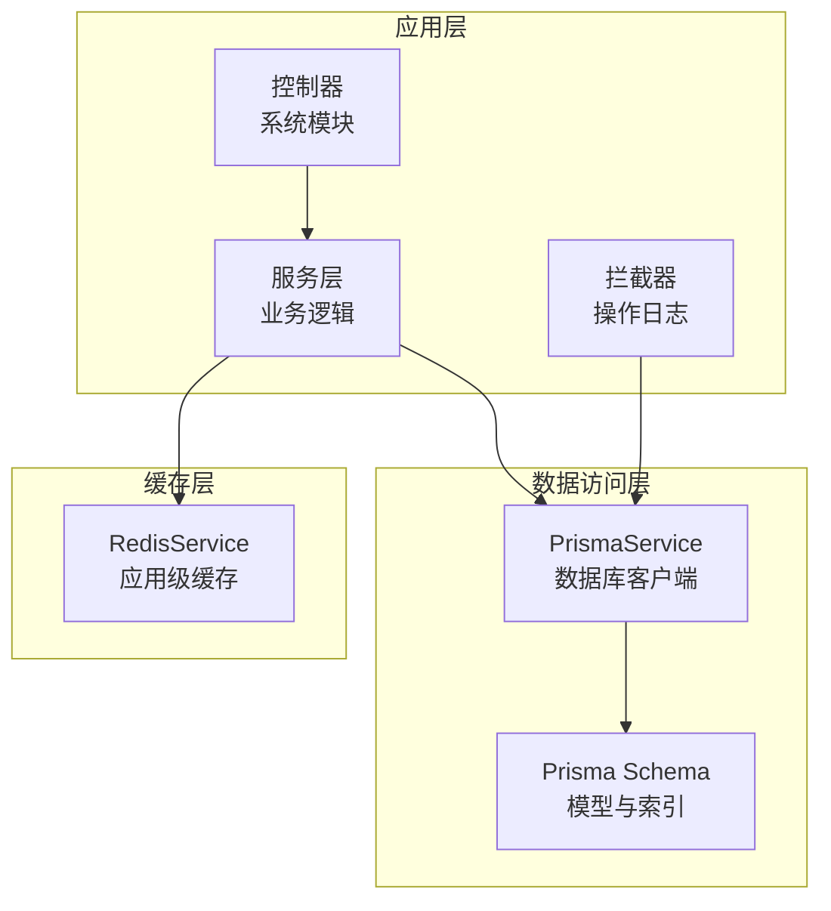
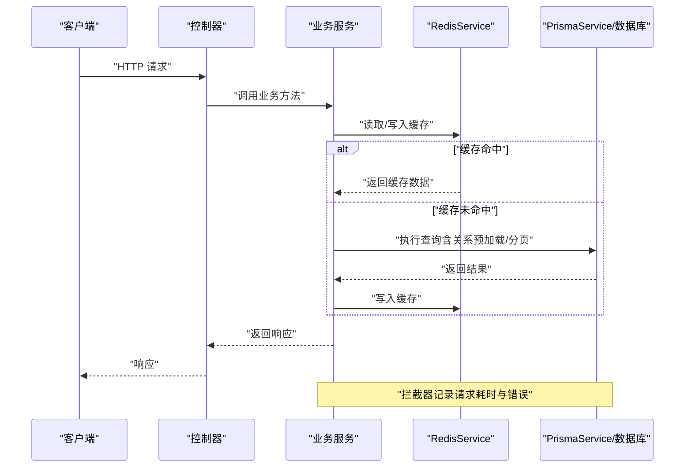
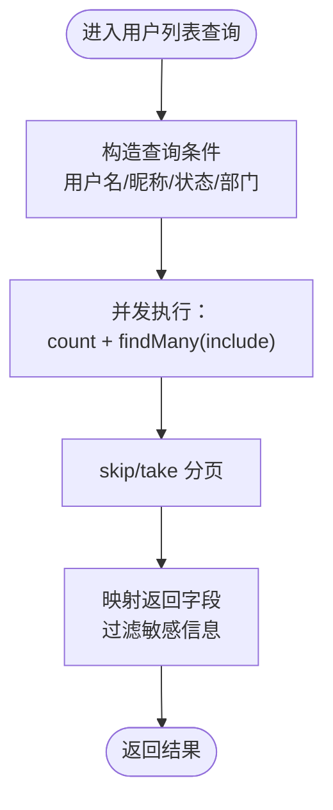
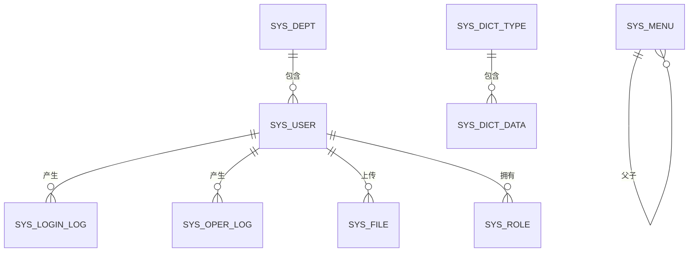
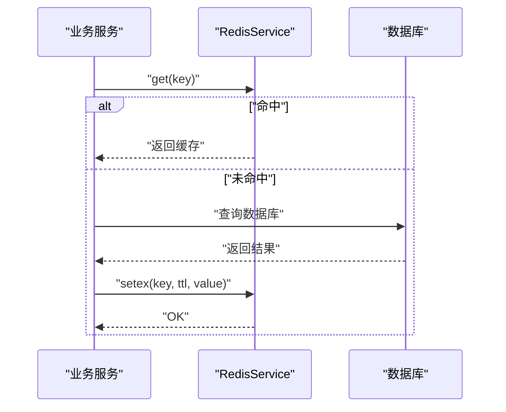
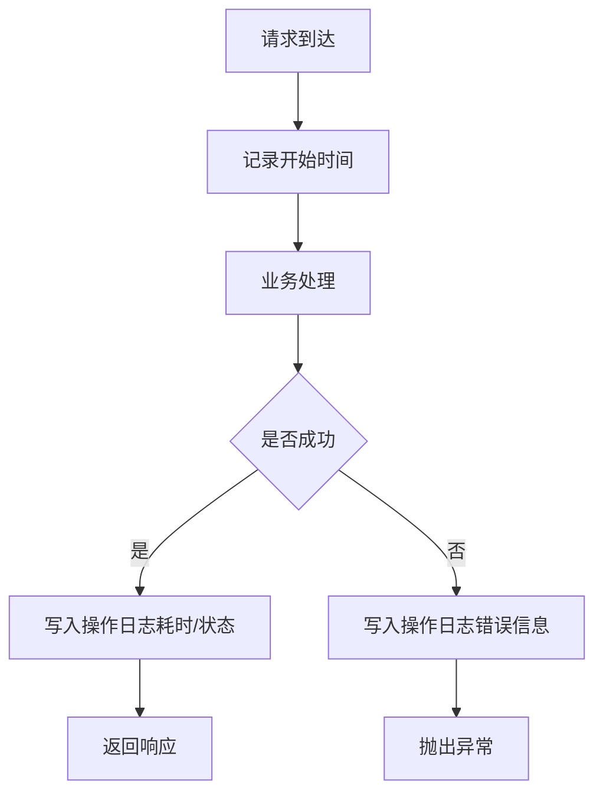
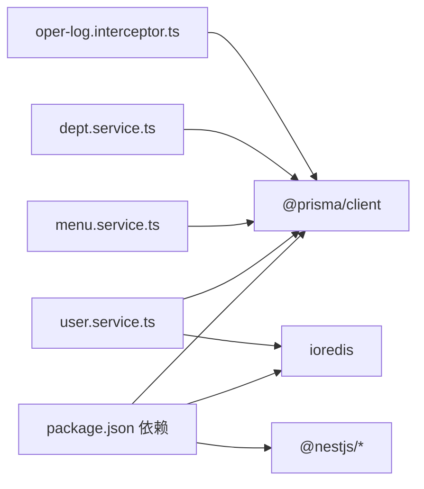

# 数据库性能优化

<cite>
**本文引用的文件**
- [schema.prisma](file://apps/backend/prisma/schema.prisma)
- [prisma.service.ts](file://apps/backend/src/common/prisma.service.ts)
- [redis.service.ts](file://apps/backend/src/cache/redis.service.ts)
- [user.service.ts](file://apps/backend/src/modules/system/user/user.service.ts)
- [menu.service.ts](file://apps/backend/src/modules/system/menu/menu.service.ts)
- [dept.service.ts](file://apps/backend/src/modules/system/dept/dept.service.ts)
- [oper-log.interceptor.ts](file://apps/backend/src/common/oper-log.interceptor.ts)
- [oper-log.service.ts](file://apps/backend/src/modules/monitor/oper-log/oper-log.service.ts)
- [package.json](file://apps/backend/package.json)
</cite>

## 目录
1. [简介](#简介)
2. [项目结构](#项目结构)
3. [核心组件](#核心组件)
4. [架构总览](#架构总览)
5. [详细组件分析](#详细组件分析)
6. [依赖分析](#依赖分析)
7. [性能考量与优化建议](#性能考量与优化建议)
8. [故障排查指南](#故障排查指南)
9. [结论](#结论)
10. [附录](#附录)

## 简介
本文件面向数据库性能优化，结合项目实际使用场景，系统梳理查询优化、索引设计、查询计划分析、慢查询治理、Prisma 查询优化（关系预加载、批量查询、分页）、连接池与事务优化、并发控制、缓存策略（查询结果缓存、热点数据）以及监控与调优工具的使用方法。文档以“可操作”为原则，既提供原理性指导，也给出与代码实现相对应的落地路径。

## 项目结构
后端采用 NestJS + Prisma 的架构，数据库通过 Prisma Client 访问，Redis 提供应用级缓存；监控方面通过拦截器记录操作日志，便于定位慢查询与异常请求。

图示来源
- [prisma.service.ts:1-22](file://apps/backend/src/common/prisma.service.ts#L1-L22)
- [schema.prisma:1-347](file://apps/backend/prisma/schema.prisma#L1-L347)
- [redis.service.ts:1-128](file://apps/backend/src/cache/redis.service.ts#L1-L128)

章节来源
- [prisma.service.ts:1-22](file://apps/backend/src/common/prisma.service.ts#L1-L22)
- [schema.prisma:1-347](file://apps/backend/prisma/schema.prisma#L1-L347)
- [redis.service.ts:1-128](file://apps/backend/src/cache/redis.service.ts#L1-L128)

## 核心组件
- PrismaService：统一的数据库客户端，负责连接生命周期管理与日志级别配置。
- RedisService：应用级缓存封装，支持键值、哈希、集合等常用操作及在线用户管理。
- 系统模块服务：如用户、菜单、部门等，承担查询、分页、关系预加载等典型数据库操作。
- 操作日志拦截器：自动记录请求耗时、参数、响应状态与错误信息，辅助慢查询定位与回归分析。

章节来源
- [prisma.service.ts:1-22](file://apps/backend/src/common/prisma.service.ts#L1-L22)
- [redis.service.ts:1-128](file://apps/backend/src/cache/redis.service.ts#L1-L128)
- [user.service.ts:1-144](file://apps/backend/src/modules/system/user/user.service.ts#L1-L144)
- [menu.service.ts:1-95](file://apps/backend/src/modules/system/menu/menu.service.ts#L1-L95)
- [dept.service.ts:1-73](file://apps/backend/src/modules/system/dept/dept.service.ts#L1-L73)
- [oper-log.interceptor.ts:1-111](file://apps/backend/src/common/oper-log.interceptor.ts#L1-L111)

## 架构总览
下图展示从请求到数据库与缓存的关键交互路径，以及日志采集对性能分析的价值。

图示来源
- [user.service.ts:18-46](file://apps/backend/src/modules/system/user/user.service.ts#L18-L46)
- [redis.service.ts:29-68](file://apps/backend/src/cache/redis.service.ts#L29-L68)
- [prisma.service.ts:1-22](file://apps/backend/src/common/prisma.service.ts#L1-L22)
- [oper-log.interceptor.ts:15-28](file://apps/backend/src/common/oper-log.interceptor.ts#L15-L28)

## 详细组件分析

### Prisma 查询优化：关系预加载、批量查询、分页
- 关系预加载：用户列表接口在查询用户时包含部门与角色关系，避免 N+1 查询，提升整体吞吐。
- 批量查询：菜单构建树时先一次性拉取全部菜单，再在内存中组装树结构，减少多次往返。
- 分页查询：统一使用 skip/take 实现分页，避免一次性加载大量数据；同时配合 count 并发统计总数，保证分页一致性。

图示来源
- [user.service.ts:18-46](file://apps/backend/src/modules/system/user/user.service.ts#L18-L46)

章节来源
- [user.service.ts:18-46](file://apps/backend/src/modules/system/user/user.service.ts#L18-L46)
- [menu.service.ts:9-17](file://apps/backend/src/modules/system/menu/menu.service.ts#L9-L17)

### 索引设计与查询计划分析
- 当前索引覆盖常见查询维度：用户按用户名、部门；菜单按父节点、排序、权限；字典按类型、排序、值；配置按键；文件按存储、对象键、上传者、时间、删除标记；登录/操作日志按用户名、IP、创建时间等。
- 建议：针对高频过滤与排序列建立复合索引；定期通过 EXPLAIN/ANALYZE 对慢查询进行计划分析，识别回表与全表扫描；对大表进行分区或归档历史数据。

图示来源
- [schema.prisma:13-38](file://apps/backend/prisma/schema.prisma#L13-L38)
- [schema.prisma:92-116](file://apps/backend/prisma/schema.prisma#L92-L116)
- [schema.prisma:118-150](file://apps/backend/prisma/schema.prisma#L118-L150)
- [schema.prisma:152-165](file://apps/backend/prisma/schema.prisma#L152-L165)
- [schema.prisma:182-207](file://apps/backend/prisma/schema.prisma#L182-L207)
- [schema.prisma:211-229](file://apps/backend/prisma/schema.prisma#L211-L229)
- [schema.prisma:231-254](file://apps/backend/prisma/schema.prisma#L231-L254)

章节来源
- [schema.prisma:13-38](file://apps/backend/prisma/schema.prisma#L13-L38)
- [schema.prisma:92-116](file://apps/backend/prisma/schema.prisma#L92-L116)
- [schema.prisma:118-150](file://apps/backend/prisma/schema.prisma#L118-L150)
- [schema.prisma:152-165](file://apps/backend/prisma/schema.prisma#L152-L165)
- [schema.prisma:182-207](file://apps/backend/prisma/schema.prisma#L182-L207)
- [schema.prisma:211-229](file://apps/backend/prisma/schema.prisma#L211-L229)
- [schema.prisma:231-254](file://apps/backend/prisma/schema.prisma#L231-L254)

### 缓存策略：查询结果缓存与热点数据优化
- 应用级缓存：RedisService 提供通用 KV、Hash、集合操作，支持 TTL 控制与在线用户管理。
- 策略建议：
  - 读多写少的数据（如配置项、字典类型/数据、菜单树）设置合理 TTL，降低数据库压力。
  - 对热点接口（如用户详情、角色菜单）增加缓存层，命中后直接返回，未命中再回源数据库并写入缓存。
  - 使用 Hash 存储结构化对象，减少序列化开销；对集合类数据（在线用户）使用集合操作原子性维护。

图示来源
- [redis.service.ts:29-68](file://apps/backend/src/cache/redis.service.ts#L29-L68)
- [redis.service.ts:82-99](file://apps/backend/src/cache/redis.service.ts#L82-L99)

章节来源
- [redis.service.ts:1-128](file://apps/backend/src/cache/redis.service.ts#L1-L128)

### 连接池与事务优化、并发控制
- Prisma 默认连接池：通过 PrismaService 初始化时的日志级别与连接管理，确保连接生命周期可控。
- 事务优化：对需要强一致性的批量更新（如用户角色分配）使用事务包裹，失败回滚，避免部分更新。
- 并发控制：结合限流中间件与数据库锁（如行级锁）防止超卖与竞态；对高并发写入场景考虑削峰填谷与异步化。

章节来源
- [prisma.service.ts:1-22](file://apps/backend/src/common/prisma.service.ts#L1-L22)
- [user.service.ts:135-143](file://apps/backend/src/modules/system/user/user.service.ts#L135-L143)

### 慢查询优化与监控
- 操作日志拦截器：自动记录请求耗时、URL、参数、响应状态与错误，便于定位慢接口与异常。
- 建议：对超过阈值的请求进行采样记录；结合数据库慢查询日志与 EXPLAIN 分析，持续优化索引与 SQL。

图示来源
- [oper-log.interceptor.ts:15-28](file://apps/backend/src/common/oper-log.interceptor.ts#L15-L28)
- [oper-log.interceptor.ts:30-61](file://apps/backend/src/common/oper-log.interceptor.ts#L30-L61)

章节来源
- [oper-log.interceptor.ts:1-111](file://apps/backend/src/common/oper-log.interceptor.ts#L1-L111)
- [oper-log.service.ts:1-33](file://apps/backend/src/modules/monitor/oper-log/oper-log.service.ts#L1-L33)

## 依赖分析
- 外部依赖：Prisma 客户端、ioredis、@nestjs/schedule、@nestjs/throttler 等。
- 内部耦合：服务层依赖 PrismaService 与 RedisService；拦截器依赖 PrismaService 写入日志。

图示来源
- [package.json:16-41](file://apps/backend/package.json#L16-L41)
- [user.service.ts:1-16](file://apps/backend/src/modules/system/user/user.service.ts#L1-L16)
- [menu.service.ts:1-7](file://apps/backend/src/modules/system/menu/menu.service.ts#L1-L7)
- [dept.service.ts:1-7](file://apps/backend/src/modules/system/dept/dept.service.ts#L1-L7)
- [oper-log.interceptor.ts:1-13](file://apps/backend/src/common/oper-log.interceptor.ts#L1-L13)

章节来源
- [package.json:16-41](file://apps/backend/package.json#L16-L41)

## 性能考量与优化建议

- 查询优化
  - 利用现有索引：用户名、部门、菜单父节点、字典键值、配置键、文件对象键等，确保 WHERE/ORDER BY/JOIN 走索引。
  - 避免 SELECT *：仅选择必要字段，减少网络与反序列化开销。
  - 合理使用 include：关系预加载一次拉取，避免 N+1；对深度关系谨慎 include，必要时拆分为多次查询或缓存。

- 分页与批量
  - 使用 skip/take 分页，避免一次性加载大结果集；对高频分页接口增加缓存。
  - 批量写入：合并小事务，减少往返；对批量导入场景使用数据库原生命令或批量 API。

- 索引与查询计划
  - 对高频过滤列（如 status、type、parentId、deptId）建立复合索引。
  - 使用 EXPLAIN/ANALYZE 分析慢查询，关注回表、全表扫描、临时表与排序。

- 缓存策略
  - L1：Redis 单机或集群，KV/Hash 结构，TTL 策略。
  - L2：热点数据双写缓存，未命中再回源数据库；对写多读少场景采用延迟双删或延时队列。
  - 清理策略：基于过期淘汰与主动清理，避免脏数据。

- 连接池与事务
  - 连接池：根据 QPS 与并发峰值调整最大连接数与空闲回收策略；开启连接健康检查。
  - 事务：对强一致场景使用事务；短事务优先，避免长事务锁竞争。

- 并发控制
  - 接口限流：结合 IP/用户维度限流，防止突发流量压垮数据库。
  - 锁策略：对关键写操作使用悲观锁或乐观锁，避免超卖与竞态。

- 监控与调优
  - 指标：QPS、P95/P99 延迟、错误率、连接池使用率、缓存命中率。
  - 工具：数据库慢查询日志、EXPLAIN、APM（如 Prometheus + Grafana）、拦截器日志聚合。

## 故障排查指南
- 常见问题
  - N+1 查询：检查 include 使用，必要时拆分查询或缓存关联数据。
  - 全表扫描：确认 WHERE 条件是否命中索引，必要时添加复合索引。
  - 慢查询：结合拦截器日志与数据库慢查询日志定位；使用 EXPLAIN 分析执行计划。
  - 缓存穿透：对空结果设置短 TTL 或布隆过滤；对热点数据预热。
  - 缓存雪崩：为缓存设置随机 TTL；使用互斥锁避免并发重建。

- 快速定位步骤
  1) 查看拦截器日志：确认请求耗时与错误信息。
  2) 抽样慢查询：对超过阈值的接口进行 EXPLAIN 分析。
  3) 校验索引：确认过滤/排序列是否走索引。
  4) 检查缓存：核对缓存命中率与 TTL 设置。
  5) 评估连接池：观察连接池饱和与等待时间。

章节来源
- [oper-log.interceptor.ts:30-61](file://apps/backend/src/common/oper-log.interceptor.ts#L30-L61)
- [oper-log.service.ts:8-23](file://apps/backend/src/modules/monitor/oper-log/oper-log.service.ts#L8-L23)

## 结论
本项目在查询优化、关系预加载、分页与缓存方面已有良好基础。建议进一步完善索引体系、引入更细粒度的缓存与限流策略、强化慢查询治理与监控告警，从而在高并发场景下保持稳定与高性能。

## 附录
- 相关实现参考路径
  - 用户列表与分页：[user.service.ts:18-46](file://apps/backend/src/modules/system/user/user.service.ts#L18-L46)
  - 菜单树构建与查询：[menu.service.ts:9-17](file://apps/backend/src/modules/system/menu/menu.service.ts#L9-L17)
  - 部门树构建与查询：[dept.service.ts:9-19](file://apps/backend/src/modules/system/dept/dept.service.ts#L9-L19)
  - 操作日志拦截与落库：[oper-log.interceptor.ts:30-61](file://apps/backend/src/common/oper-log.interceptor.ts#L30-L61)
  - 操作日志列表与清理：[oper-log.service.ts:8-23](file://apps/backend/src/modules/monitor/oper-log/oper-log.service.ts#L8-L23)
  - 数据库连接与日志：[prisma.service.ts:1-22](file://apps/backend/src/common/prisma.service.ts#L1-L22)
  - Redis 缓存封装与在线用户：[redis.service.ts:1-128](file://apps/backend/src/cache/redis.service.ts#L1-L128)
  - 数据模型与索引定义：[schema.prisma:1-347](file://apps/backend/prisma/schema.prisma#L1-L347)