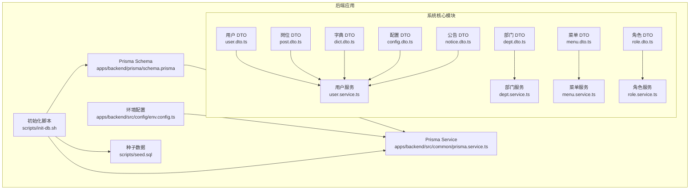
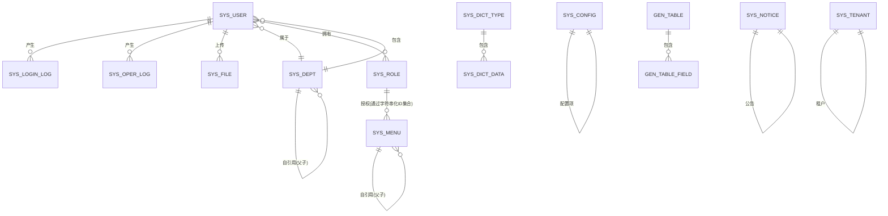
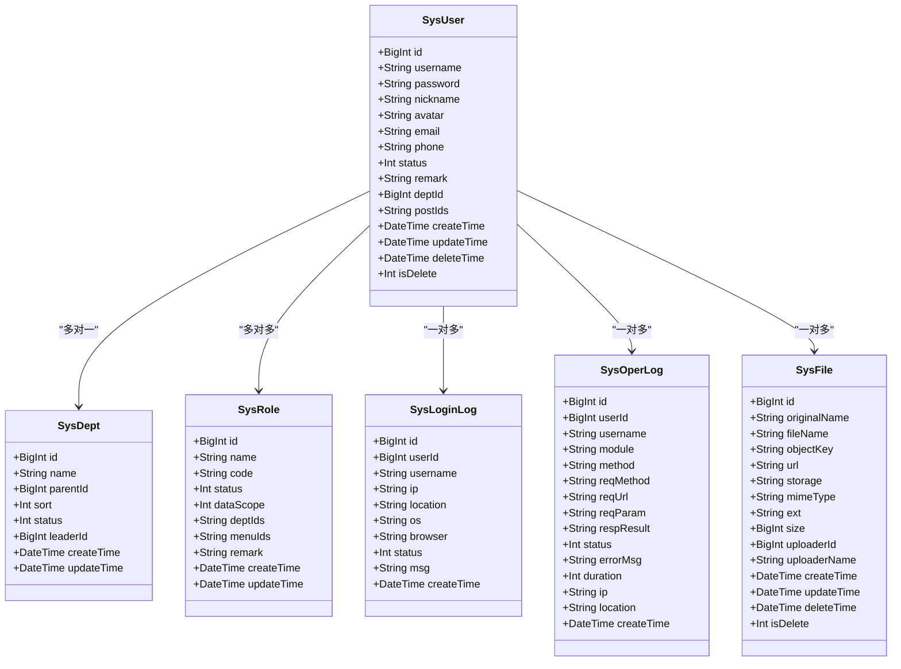
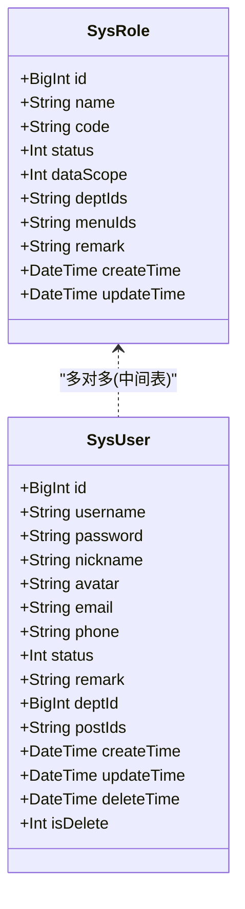
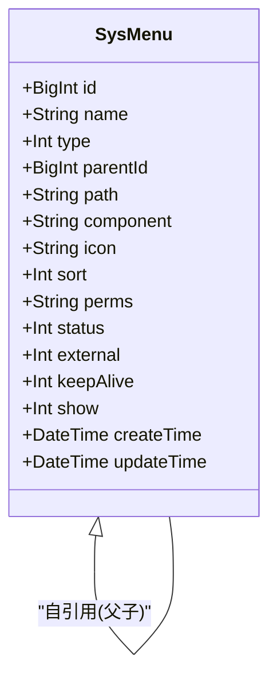
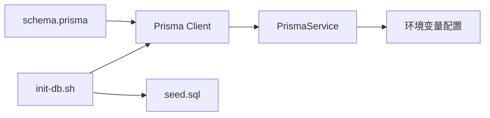

# 数据库设计

<cite>
**本文档引用的文件**
- [schema.prisma](file://apps/backend/prisma/schema.prisma)
- [prisma.service.ts](file://apps/backend/src/common/prisma.service.ts)
- [env.config.ts](file://apps/backend/src/config/env.config.ts)
- [init-db.sh](file://scripts/init-db.sh)
- [seed.sql](file://scripts/seed.sql)
- [user.dto.ts](file://apps/backend/src/modules/system/user/dto/user.dto.ts)
- [dept.dto.ts](file://apps/backend/src/modules/system/dept/dto/dept.dto.ts)
- [menu.dto.ts](file://apps/backend/src/modules/system/menu/dto/menu.dto.ts)
- [role.dto.ts](file://apps/backend/src/modules/system/role/dto/role.dto.ts)
- [post.dto.ts](file://apps/backend/src/modules/system/post/dto/post.dto.ts)
- [dict.dto.ts](file://apps/backend/src/modules/system/dict/dto/dict.dto.ts)
- [config.dto.ts](file://apps/backend/src/modules/system/config/dto/config.dto.ts)
- [notice.dto.ts](file://apps/backend/src/modules/system/notice/dto/notice.dto.ts)
- [user.service.ts](file://apps/backend/src/modules/system/user/user.service.ts)
- [dept.service.ts](file://apps/backend/src/modules/system/dept/dept.service.ts)
- [menu.service.ts](file://apps/backend/src/modules/system/menu/menu.service.ts)
- [role.service.ts](file://apps/backend/src/modules/system/role/role.service.ts)
</cite>

## 目录
1. [简介](#简介)
2. [项目结构](#项目结构)
3. [核心组件](#核心组件)
4. [架构总览](#架构总览)
5. [详细组件分析](#详细组件分析)
6. [依赖分析](#依赖分析)
7. [性能考虑](#性能考虑)
8. [故障排查指南](#故障排查指南)
9. [结论](#结论)
10. [附录](#附录)

## 简介
本文件基于 Prisma ORM 提供的 schema.prisma，系统化梳理并说明数据库的完整数据模型与关系设计。内容覆盖系统核心（8个）、日志监控（2个）、定时任务（2个）、代码生成（2个）、租户（1个）等模块，共计15个核心数据模型。文档重点阐述：
- 实体间关联关系：自引用树结构（部门、菜单）、一对多关系（用户-部门、角色-菜单）、多对多关系（用户-角色）的建模与实现
- 索引设计策略、约束定义与数据完整性保障
- 数据迁移方案与版本管理策略
- 种子数据结构与初始化流程
- Prisma Client 的生成与使用方法
- 数据库性能优化建议与查询最佳实践

## 项目结构
数据库相关的核心文件集中在后端应用的 Prisma 目录与各模块的服务层中：
- 数据模型定义：apps/backend/prisma/schema.prisma
- Prisma 客户端与连接配置：apps/backend/src/common/prisma.service.ts
- 环境变量配置（数据库连接）：apps/backend/src/config/env.config.ts
- 初始化脚本与种子数据：scripts/init-db.sh、scripts/seed.sql
- DTO 定义与业务层调用：各模块的 dto.ts 与 service.ts



图表来源
- [schema.prisma](file://apps/backend/prisma/schema.prisma)
- [prisma.service.ts](file://apps/backend/src/common/prisma.service.ts)
- [env.config.ts](file://apps/backend/src/config/env.config.ts)
- [init-db.sh](file://scripts/init-db.sh)
- [seed.sql](file://scripts/seed.sql)
- [user.dto.ts](file://apps/backend/src/modules/system/user/dto/user.dto.ts)
- [dept.dto.ts](file://apps/backend/src/modules/system/dept/dto/dept.dto.ts)
- [menu.dto.ts](file://apps/backend/src/modules/system/menu/dto/menu.dto.ts)
- [role.dto.ts](file://apps/backend/src/modules/system/role/dto/role.dto.ts)
- [post.dto.ts](file://apps/backend/src/modules/system/post/dto/post.dto.ts)
- [dict.dto.ts](file://apps/backend/src/modules/system/dict/dto/dict.dto.ts)
- [config.dto.ts](file://apps/backend/src/modules/system/config/dto/config.dto.ts)
- [notice.dto.ts](file://apps/backend/src/modules/system/notice/dto/notice.dto.ts)
- [user.service.ts](file://apps/backend/src/modules/system/user/user.service.ts)
- [dept.service.ts](file://apps/backend/src/modules/system/dept/dept.service.ts)
- [menu.service.ts](file://apps/backend/src/modules/system/menu/menu.service.ts)
- [role.service.ts](file://apps/backend/src/modules/system/role/role.service.ts)

章节来源
- [schema.prisma](file://apps/backend/prisma/schema.prisma)
- [prisma.service.ts](file://apps/backend/src/common/prisma.service.ts)
- [env.config.ts](file://apps/backend/src/config/env.config.ts)
- [init-db.sh](file://scripts/init-db.sh)
- [seed.sql](file://scripts/seed.sql)

## 核心组件
本节按模块划分，逐一说明15个核心数据模型的字段、索引、约束与典型用途，并标注其在 Prisma 中的定义位置。

- 系统核心（8个）
  - 用户 SysUser：用户名唯一、密码加密存储、软删除标记、多岗位字符串化存储、与部门/角色/日志/文件关联
  - 角色 SysRole：角色编码唯一、数据范围与菜单/部门授权字符串化存储
  - 部门 SysDept：自引用树结构（父子关系）、排序与状态
  - 岗位 SysPost：岗位编码唯一、排序与状态
  - 菜单 SysMenu：自引用树结构（父子关系）、类型/权限/显示控制
  - 字典类型 SysDictType：字典分组，与字典项一对多
  - 字典数据 SysDictData：字典项，与类型多对一
  - 系统配置 SysConfig：参数键唯一、类型与值可变
  - 通知公告 SysNotice：标题/内容/类型/状态/发布时间

- 日志监控（2个）
  - 登录日志 SysLoginLog：用户登录行为记录，IP/浏览器/地理位置/状态消息
  - 操作日志 SysOperLog：请求/响应/耗时/错误信息等操作审计

- 定时任务（2个）
  - 任务 SysJob：任务名/处理器/调度表达式/间隔/类型/状态
  - 任务日志 SysJobLog：任务执行结果/错误/耗时

- 代码生成（2个）
  - 表定义 GenTable：表名/注释/模块/业务/实体/作者/前缀
  - 字段定义 GenTableField：列名/注释/类型/TS类型/主键/必填/列表/表单/查询方式/排序/字典

- 系统租户（1个）
  - 租户 SysTenant：名称/编码唯一/状态/过期时间/最大用户数

章节来源
- [schema.prisma](file://apps/backend/prisma/schema.prisma)

## 架构总览
下图展示数据库模型的整体关系，突出自引用树结构、一对多与多对多关系，以及模块间的职责边界。



图表来源
- [schema.prisma](file://apps/backend/prisma/schema.prisma)

## 详细组件分析

### 系统核心模块

#### 用户模型（SysUser）
- 关键字段：用户名唯一、密码、昵称、头像、邮箱/手机、状态、备注、部门ID、岗位ID字符串、软删除标记与时间戳
- 关系：与部门为多对一；与角色为多对多；与登录/操作日志、文件为一对多
- 索引：用户名、部门ID
- 复杂度：查询通常按用户名/部门过滤，索引覆盖常见筛选条件



图表来源
- [schema.prisma](file://apps/backend/prisma/schema.prisma)

章节来源
- [schema.prisma](file://apps/backend/prisma/schema.prisma)
- [user.service.ts](file://apps/backend/src/modules/system/user/user.service.ts)

#### 角色模型（SysRole）
- 关键字段：名称、编码唯一、状态、数据范围、菜单ID字符串、部门ID字符串、备注
- 关系：与用户为多对多（通过中间表）
- 索引：编码
- 复杂度：权限分配通过字符串化ID集合，查询时需解析并过滤



图表来源
- [schema.prisma](file://apps/backend/prisma/schema.prisma)

章节来源
- [schema.prisma](file://apps/backend/prisma/schema.prisma)
- [role.service.ts](file://apps/backend/src/modules/system/role/role.service.ts)

#### 部门模型（SysDept）
- 关键字段：名称、父ID、排序、状态、负责人ID
- 关系：自引用树结构（父子），与用户一对多
- 索引：父ID、排序
- 复杂度：树构建通过递归过滤父ID实现

```mermaid
classDiagram
class SysDept {
+BigInt id
+String name
+BigInt parentId
+Int sort
+Int status
+BigInt leaderId
+DateTime createTime
+DateTime updateTime
}
SysDept <|-- SysDept : "自引用(父子)"
SysDept ||--o{ SysUser : "包含"
```

图表来源
- [schema.prisma](file://apps/backend/prisma/schema.prisma)

章节来源
- [schema.prisma](file://apps/backend/prisma/schema.prisma)
- [dept.service.ts](file://apps/backend/src/modules/system/dept/dept.service.ts)

#### 菜单模型（SysMenu）
- 关键字段：名称、类型、父ID、路径、组件、图标、排序、权限标识、状态、外部链接、keepAlive、显示控制
- 关系：自引用树结构（父子）
- 索引：父ID、排序、权限标识
- 复杂度：路由构建通过聚合角色授权的菜单ID集合，再按树结构组装



图表来源
- [schema.prisma](file://apps/backend/prisma/schema.prisma)

章节来源
- [schema.prisma](file://apps/backend/prisma/schema.prisma)
- [menu.service.ts](file://apps/backend/src/modules/system/menu/menu.service.ts)

#### 岗位模型（SysPost）
- 关键字段：名称、编码唯一、排序、状态、备注
- 索引：编码、排序
- 复杂度：岗位与用户通过字符串化ID集合关联

章节来源
- [schema.prisma](file://apps/backend/prisma/schema.prisma)

#### 字典类型与数据（SysDictType, SysDictData）
- 关键字段：类型/数据均含名称/编码/状态/排序/备注；数据与类型多对一
- 索引：类型编码、数据排序、数据值
- 复杂度：用于统一管理枚举与下拉选项

章节来源
- [schema.prisma](file://apps/backend/prisma/schema.prisma)

#### 系统配置（SysConfig）
- 关键字段：名称、键唯一、值、类型、状态、备注
- 索引：键
- 复杂度：键值对配置，支持多种类型

章节来源
- [schema.prisma](file://apps/backend/prisma/schema.prisma)

#### 通知公告（SysNotice）
- 关键字段：标题、内容、类型、状态、发布时间
- 索引：类型、状态
- 复杂度：面向前台展示的公告信息

章节来源
- [schema.prisma](file://apps/backend/prisma/schema.prisma)

### 日志监控模块

#### 登录日志（SysLoginLog）
- 关键字段：用户ID/名称、IP、位置、操作系统/浏览器、状态、消息、时间
- 索引：用户名、IP、时间
- 复杂度：审计与风控常用维度

章节来源
- [schema.prisma](file://apps/backend/prisma/schema.prisma)

#### 操作日志（SysOperLog）
- 关键字段：用户ID/名称、模块/方法、请求方法/URL、请求参数/响应结果、状态、错误信息、耗时、IP/位置、时间
- 索引：用户ID、模块、时间
- 复杂度：全链路审计与问题定位

章节来源
- [schema.prisma](file://apps/backend/prisma/schema.prisma)

### 定时任务模块

#### 任务（SysJob）
- 关键字段：名称、处理器、Cron/间隔、类型、状态、备注
- 关系：与任务日志一对多
- 索引：处理器、状态
- 复杂度：异步任务调度与执行追踪

章节来源
- [schema.prisma](file://apps/backend/prisma/schema.prisma)

#### 任务日志（SysJobLog）
- 关键字段：任务ID、状态、响应/错误、耗时、时间
- 索引：任务ID、时间
- 复杂度：任务执行历史与异常监控

章节来源
- [schema.prisma](file://apps/backend/prisma/schema.prisma)

### 代码生成模块

#### 表定义（GenTable）
- 关键字段：表名/注释、模块/业务/实体/作者、表前缀
- 关系：与字段定义一对多
- 索引：表名
- 复杂度：代码生成的元数据入口

章节来源
- [schema.prisma](file://apps/backend/prisma/schema.prisma)

#### 字段定义（GenTableField）
- 关键字段：列名/注释、类型/TS类型、主键/必填/列表/表单/查询方式、排序、字典
- 索引：表ID、排序
- 复杂度：生成前端/后端代码的字段级元数据

章节来源
- [schema.prisma](file://apps/backend/prisma/schema.prisma)

### 系统租户模块

#### 租户（SysTenant）
- 关键字段：名称、编码唯一、状态、过期时间、最大用户数、备注
- 复杂度：多租户隔离的基础实体

章节来源
- [schema.prisma](file://apps/backend/prisma/schema.prisma)

## 依赖分析
- 模块耦合
  - 用户与部门：多对一，低耦合
  - 用户与角色：多对多，通过中间表解耦
  - 菜单与角色：通过字符串化ID集合授权，降低额外表成本但查询需解析
  - 部门/菜单：自引用树，通过父ID与排序组织层次
- 外部依赖
  - Prisma Client：由 schema.prisma 生成，运行时通过 PrismaService 管理连接生命周期
  - 环境变量：数据库连接 URL 由环境变量提供
  - 初始化脚本：负责数据库创建、迁移、种子数据导入



图表来源
- [schema.prisma](file://apps/backend/prisma/schema.prisma)
- [prisma.service.ts](file://apps/backend/src/common/prisma.service.ts)
- [env.config.ts](file://apps/backend/src/config/env.config.ts)
- [init-db.sh](file://scripts/init-db.sh)
- [seed.sql](file://scripts/seed.sql)

章节来源
- [prisma.service.ts](file://apps/backend/src/common/prisma.service.ts)
- [env.config.ts](file://apps/backend/src/config/env.config.ts)
- [init-db.sh](file://scripts/init-db.sh)
- [seed.sql](file://scripts/seed.sql)

## 性能考虑
- 索引策略
  - 唯一键：用户名、角色编码、字典编码、配置键、租户编码
  - 常用过滤字段：部门ID、父ID、排序、权限标识、状态、类型、创建时间、存储介质/对象键、是否删除
- 查询优化
  - 分页查询：结合索引与 LIMIT/OFFSET，避免全表扫描
  - 树结构查询：优先按排序与父ID过滤，减少递归层级
  - 权限过滤：角色授权采用字符串化ID集合，查询时使用 IN 子句并配合索引
- 写入优化
  - 批量插入：种子数据采用批量 INSERT，减少往返
  - 软删除：isDelete 标记与 deleteTime 字段，避免物理删除带来的索引碎片
- 缓存与降载
  - 登录/操作日志高频写入，建议结合缓存与异步落库
  - 菜单/字典/配置等静态数据可缓存热点键

## 故障排查指南
- 连接问题
  - 确认环境变量 DATABASE_URL 正确，PrismaService 在 onModuleInit 时自动连接
- 迁移失败
  - 使用初始化脚本执行 npx prisma migrate dev，若失败可尝试 --skip-generate
- 种子数据导入
  - 若存在外键约束，按 seed.sql 中的顺序先删子表再删父表；也可使用 db push 作为替代
- 权限与菜单
  - 角色授权通过字符串化ID集合，确认 JSON 解析无误后再进行 IN 查询
- 树结构异常
  - 部门/菜单删除前检查是否存在子节点，避免破坏树结构

章节来源
- [prisma.service.ts](file://apps/backend/src/common/prisma.service.ts)
- [env.config.ts](file://apps/backend/src/config/env.config.ts)
- [init-db.sh](file://scripts/init-db.sh)
- [seed.sql](file://scripts/seed.sql)
- [dept.service.ts](file://apps/backend/src/modules/system/dept/dept.service.ts)
- [menu.service.ts](file://apps/backend/src/modules/system/menu/menu.service.ts)
- [role.service.ts](file://apps/backend/src/modules/system/role/role.service.ts)

## 结论
该数据库设计围绕 Prisma ORM 的 schema.prisma 展开，采用清晰的模块划分与合理的索引策略，兼顾了树形结构的高效查询与多对多关系的灵活授权。通过初始化脚本与种子数据，可快速完成本地开发环境搭建。建议在生产环境中进一步完善索引覆盖、引入缓存与异步处理，并持续演进数据迁移与版本管理流程。

## 附录

### 数据模型与关系一览
- 系统核心
  - SysUser ↔ SysDept（多对一）
  - SysUser ↔ SysRole（多对多）
  - SysDept 自引用（父子）
  - SysMenu 自引用（父子）
  - SysDictType ↔ SysDictData（一对多）
- 日志监控
  - SysUser → SysLoginLog、SysOperLog（一对多）
- 定时任务
  - SysJob → SysJobLog（一对多）
- 代码生成
  - GenTable → GenTableField（一对多）
- 租户
  - SysTenant（独立实体）

章节来源
- [schema.prisma](file://apps/backend/prisma/schema.prisma)

### Prisma Client 生成与使用
- 生成客户端
  - 初始化脚本会执行 npx prisma generate
- 连接管理
  - 通过 PrismaService 继承 PrismaClient，在 onModuleInit/onModuleDestroy 生命周期内管理连接
- 环境变量
  - 数据库 URL 从环境变量读取，确保在部署时正确注入

章节来源
- [init-db.sh](file://scripts/init-db.sh)
- [prisma.service.ts](file://apps/backend/src/common/prisma.service.ts)
- [env.config.ts](file://apps/backend/src/config/env.config.ts)

### 数据迁移与版本管理
- 开发阶段
  - 使用 npx prisma migrate dev 创建迁移并应用
- 生产阶段
  - 建议使用受控的迁移策略，保留迁移历史并在回滚时有明确步骤
- 替代方案
  - 若迁移失败，可使用 npx prisma db push 快速同步结构（不推荐长期使用）

章节来源
- [init-db.sh](file://scripts/init-db.sh)

### 种子数据结构与初始化流程
- 初始化顺序
  - 先清空子表，再清空父表，避免外键冲突
  - 按部门→岗位→角色→用户→用户角色关联→菜单→字典→配置→公告→租户的顺序插入
- 默认账号
  - 用户名：admin，密码：admin123（已加密存储）

章节来源
- [seed.sql](file://scripts/seed.sql)