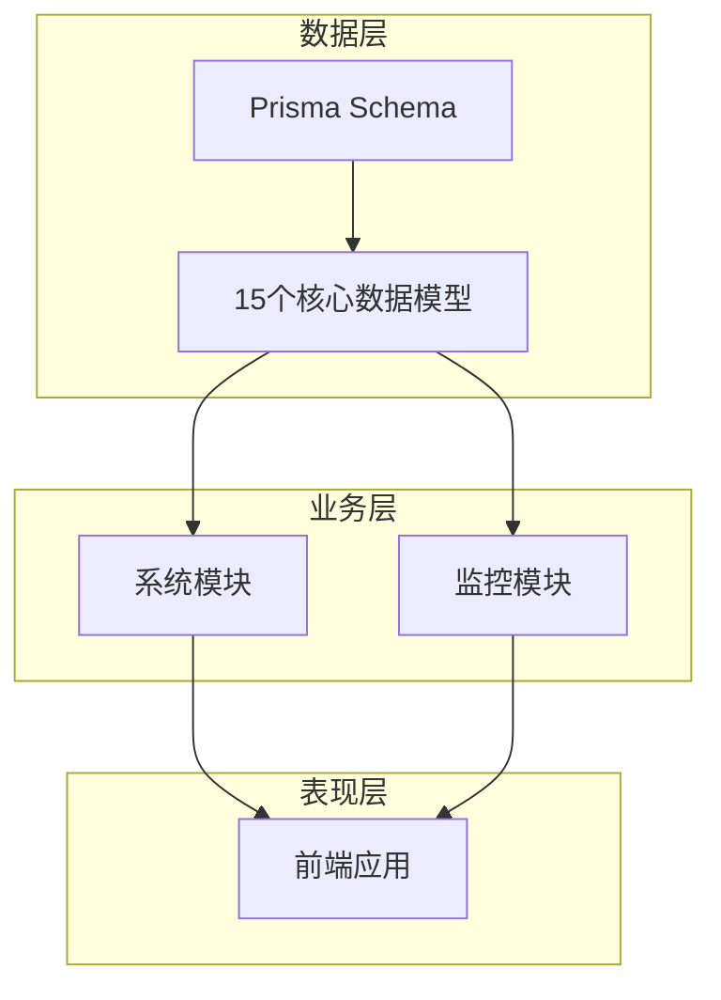
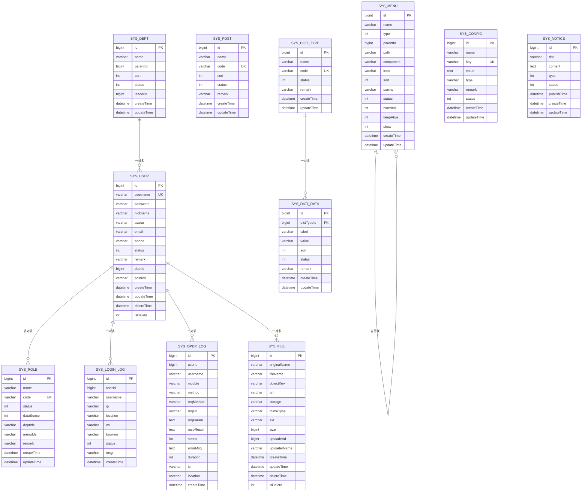
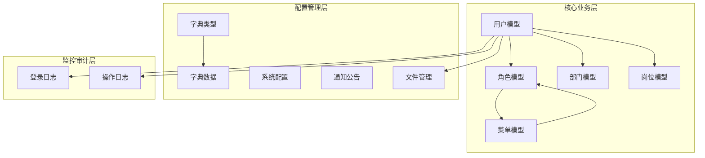

# 数据模型设计

<cite>
**本文档引用的文件**
- [schema.prisma](file://apps/backend/prisma/schema.prisma)
- [user.dto.ts](file://apps/backend/src/modules/system/user/dto/user.dto.ts)
- [role.dto.ts](file://apps/backend/src/modules/system/role/dto/role.dto.ts)
- [dept.dto.ts](file://apps/backend/src/modules/system/dept/dto/dept.dto.ts)
- [post.dto.ts](file://apps/backend/src/modules/system/post/dto/post.dto.ts)
- [menu.dto.ts](file://apps/backend/src/modules/system/menu/dto/menu.dto.ts)
- [config.dto.ts](file://apps/backend/src/modules/system/config/dto/config.dto.ts)
- [dict.dto.ts](file://apps/backend/src/modules/system/dict/dto/dict.dto.ts)
- [notice.dto.ts](file://apps/backend/src/modules/system/notice/dto/notice.dto.ts)
- [login-log.controller.ts](file://apps/backend/src/modules/monitor/login-log/login-log.controller.ts)
- [oper-log.controller.ts](file://apps/backend/src/modules/monitor/oper-log/oper-log.controller.ts)
</cite>

## 目录
1. [简介](#简介)
2. [项目结构](#项目结构)
3. [核心组件](#核心组件)
4. [架构概览](#架构概览)
5. [详细组件分析](#详细组件分析)
6. [依赖分析](#依赖分析)
7. [性能考虑](#性能考虑)
8. [故障排除指南](#故障排除指南)
9. [结论](#结论)

## 简介

本文件基于 Prisma Schema 定义，为 Nest-Admin-Pro 项目的 15 个核心数据模型提供详细的结构设计文档。这些模型涵盖系统核心模块（用户、角色、部门、岗位、菜单、字典类型、字典数据、系统配置、通知公告、文件）和日志监控模块（登录日志、操作日志）。文档将详细说明每个模型的字段定义、数据类型、约束条件和默认值设置，并解释 Prisma 模型注解的使用方式，如 @id、@default、@unique、@relation 等装饰器的作用。

## 项目结构

系统采用分层架构，数据模型通过 Prisma Schema 定义，业务逻辑在 NestJS 模块中实现。核心数据模型位于 apps/backend/prisma/schema.prisma 文件中，对应的 DTO 文件位于 apps/backend/src/modules/system 和 apps/backend/src/modules/monitor 目录下。

**图表来源**
- [schema.prisma:1-347](file://apps/backend/prisma/schema.prisma#L1-L347)

**章节来源**
- [schema.prisma:1-347](file://apps/backend/prisma/schema.prisma#L1-L347)

## 核心组件

本节概述 15 个核心数据模型的整体设计原则和通用约束：

### 设计原则
- **统一的数据类型映射**：所有字符串类型均使用 @db.VarChar(n) 指定长度限制
- **标准化的默认值**：状态字段统一使用 1 表示启用，0 表示禁用
- **时间戳管理**：统一使用 createTime、updateTime、deleteTime 进行生命周期管理
- **软删除机制**：通过 isDelete 字段实现软删除功能
- **索引优化**：为常用查询字段建立索引以提升查询性能

### 通用字段规范
- **标识字段**：BigInt 类型，使用 @id 和 @default(autoincrement()) 自动生成主键
- **状态字段**：Int 类型，默认值为 1（启用），0 表示禁用
- **排序字段**：Int 类型，默认值为 0
- **备注字段**：String? 类型，支持空值
- **创建时间**：DateTime 类型，默认值为 now()
- **更新时间**：DateTime 类型，使用 @updatedAt 自动更新

**章节来源**
- [schema.prisma:13-38](file://apps/backend/prisma/schema.prisma#L13-L38)
- [schema.prisma:41-56](file://apps/backend/prisma/schema.prisma#L41-L56)
- [schema.prisma:58-75](file://apps/backend/prisma/schema.prisma#L58-L75)

## 架构概览

系统采用模块化设计，各数据模型之间通过外键关系建立关联。核心模块采用树形结构设计，支持层级关系的高效查询和管理。

**图表来源**
- [schema.prisma:13-38](file://apps/backend/prisma/schema.prisma#L13-L38)
- [schema.prisma:41-56](file://apps/backend/prisma/schema.prisma#L41-L56)
- [schema.prisma:58-75](file://apps/backend/prisma/schema.prisma#L58-L75)
- [schema.prisma:77-90](file://apps/backend/prisma/schema.prisma#L77-L90)
- [schema.prisma:92-116](file://apps/backend/prisma/schema.prisma#L92-L116)
- [schema.prisma:118-131](file://apps/backend/prisma/schema.prisma#L118-L131)
- [schema.prisma:133-150](file://apps/backend/prisma/schema.prisma#L133-L150)
- [schema.prisma:152-165](file://apps/backend/prisma/schema.prisma#L152-L165)
- [schema.prisma:167-180](file://apps/backend/prisma/schema.prisma#L167-L180)
- [schema.prisma:182-207](file://apps/backend/prisma/schema.prisma#L182-L207)
- [schema.prisma:211-229](file://apps/backend/prisma/schema.prisma#L211-L229)
- [schema.prisma:231-254](file://apps/backend/prisma/schema.prisma#L231-L254)

## 详细组件分析

### 用户模型 (SysUser)

用户模型是系统的核心实体，负责存储用户基本信息和权限关联。

#### 字段定义与约束
- **id**: BigInt 主键，自动递增
- **username**: 唯一用户名，长度 50
- **password**: 密码字段，长度 200
- **nickname**: 昵称，长度 50
- **avatar**: 头像地址，长度 255，默认空字符串
- **email**: 邮箱，长度 100
- **phone**: 电话号码，长度 20
- **status**: 用户状态，默认 1（启用）
- **remark**: 备注，长度 500
- **deptId**: 所属部门外键
- **postIds**: 岗位ID列表，长度 200，默认空字符串
- **createTime/updateTime**: 创建和更新时间
- **deleteTime/isDelete**: 软删除支持

#### 关系设计
- 与 SysRole 通过中间表建立多对多关系
- 与 SysDept 建立一对一关系（外键 deptId）
- 与 SysLoginLog、SysOperLog 建立一对多关系
- 与 SysFile 建立一对多关系（上传文件）

#### 索引策略
- 在 username 上建立唯一索引
- 在 deptId 上建立普通索引

**章节来源**
- [schema.prisma:13-38](file://apps/backend/prisma/schema.prisma#L13-L38)

### 角色模型 (SysRole)

角色模型用于权限控制，支持数据范围和菜单权限配置。

#### 字段定义与约束
- **id**: BigInt 主键
- **name**: 角色名称，长度 50
- **code**: 角色编码，唯一标识，长度 50
- **status**: 角色状态，默认 1
- **dataScope**: 数据范围，默认 1
- **deptIds/menuIds**: 授权的部门和菜单ID列表
- **remark**: 备注，长度 500
- **createTime/updateTime**: 时间戳

#### 关系设计
- 与 SysUser 建立多对多关系（通过 SysUser.roles）

#### 索引策略
- 在 code 上建立唯一索引

**章节来源**
- [schema.prisma:41-56](file://apps/backend/prisma/schema.prisma#L41-L56)

### 部门模型 (SysDept)

部门模型采用树形结构设计，支持无限层级的组织架构管理。

#### 字段定义与约束
- **id**: BigInt 主键
- **name**: 部门名称，长度 50
- **parentId**: 父部门ID，默认 0（根节点）
- **sort**: 排序字段，默认 0
- **status**: 部门状态，默认 1
- **leaderId**: 部门负责人ID
- **createTime/updateTime**: 时间戳

#### 关系设计
- 自关联：children 和 parent 字段建立父子关系
- 与 SysUser 建立一对多关系

#### 索引策略
- 在 parentId 上建立普通索引
- 在 sort 上建立普通索引

**章节来源**
- [schema.prisma:58-75](file://apps/backend/prisma/schema.prisma#L58-L75)

### 岗位模型 (SysPost)

岗位模型用于职位管理，支持岗位排序和状态控制。

#### 字段定义与约束
- **id**: BigInt 主键
- **name**: 岗位名称，长度 50
- **code**: 岗位编码，唯一标识，长度 50
- **sort**: 排序，默认 0
- **status**: 状态，默认 1
- **remark**: 备注，长度 500
- **createTime/updateTime**: 时间戳

#### 索引策略
- 在 code 上建立唯一索引
- 在 sort 上建立普通索引

**章节来源**
- [schema.prisma:77-90](file://apps/backend/prisma/schema.prisma#L77-L90)

### 菜单模型 (SysMenu)

菜单模型支持完整的前端路由和权限控制体系。

#### 字段定义与约束
- **id**: BigInt 主键
- **name**: 菜单名称，长度 50
- **type**: 菜单类型，默认 1
- **parentId**: 父菜单ID，默认 0
- **path**: 路由路径，长度 255
- **component**: 组件路径，长度 255
- **icon**: 图标，长度 100
- **sort**: 排序，默认 0
- **perms**: 权限标识，长度 100
- **status**: 状态，默认 1
- **external**: 外链标识，默认 0
- **keepAlive**: 缓存标识，默认 0
- **show**: 显示标识，默认 1
- **createTime/updateTime**: 时间戳

#### 关系设计
- 自关联：children 和 parent 建立层级关系
- 与 SysRole 通过权限关联

#### 索引策略
- 在 parentId 上建立普通索引
- 在 sort 上建立普通索引
- 在 perms 上建立普通索引

**章节来源**
- [schema.prisma:92-116](file://apps/backend/prisma/schema.prisma#L92-L116)

### 字典类型模型 (SysDictType)

字典类型模型用于分类管理字典数据。

#### 字段定义与约束
- **id**: BigInt 主键
- **name**: 字典名称，长度 50
- **code**: 字典编码，唯一标识，长度 50
- **status**: 状态，默认 1
- **remark**: 备注，长度 500
- **createTime/updateTime**: 时间戳

#### 关系设计
- 与 SysDictData 建立一对多关系

#### 索引策略
- 在 code 上建立唯一索引

**章节来源**
- [schema.prisma:118-131](file://apps/backend/prisma/schema.prisma#L118-L131)

### 字典数据模型 (SysDictData)

字典数据模型存储具体的字典项信息。

#### 字段定义与约束
- **id**: BigInt 主键
- **dictTypeId**: 字典类型外键
- **label**: 显示标签，长度 100
- **value**: 存储值，长度 100
- **sort**: 排序，默认 0
- **status**: 状态，默认 1
- **remark**: 备注，长度 500
- **createTime/updateTime**: 时间戳

#### 关系设计
- 与 SysDictType 建立多对一关系

#### 索引策略
- 在 dictTypeId 上建立普通索引
- 在 sort 上建立普通索引
- 在 value 上建立普通索引

**章节来源**
- [schema.prisma:133-150](file://apps/backend/prisma/schema.prisma#L133-L150)

### 系统配置模型 (SysConfig)

系统配置模型用于动态配置管理。

#### 字段定义与约束
- **id**: BigInt 主键
- **name**: 配置名称，长度 100
- **key**: 配置键，唯一标识，长度 100
- **value**: 配置值，文本类型
- **type**: 配置类型，默认 "string"
- **remark**: 备注，长度 500
- **status**: 状态，默认 1
- **createTime/updateTime**: 时间戳

#### 索引策略
- 在 key 上建立唯一索引

**章节来源**
- [schema.prisma:152-165](file://apps/backend/prisma/schema.prisma#L152-L165)

### 通知公告模型 (SysNotice)

通知公告模型用于系统消息发布。

#### 字段定义与约束
- **id**: BigInt 主键
- **title**: 公告标题，长度 200
- **content**: 公告内容，文本类型
- **type**: 公告类型，默认 1
- **status**: 状态，默认 1
- **publishTime**: 发布时间
- **createTime/updateTime**: 时间戳

#### 索引策略
- 在 type 上建立普通索引
- 在 status 上建立普通索引

**章节来源**
- [schema.prisma:167-180](file://apps/backend/prisma/schema.prisma#L167-L180)

### 文件模型 (SysFile)

文件模型用于统一管理上传的文件资源。

#### 字段定义与约束
- **id**: BigInt 主键
- **originalName**: 原始文件名，长度 255
- **fileName**: 存储文件名，长度 255
- **objectKey**: 对象存储键，长度 500
- **url**: 文件访问URL，长度 1000
- **storage**: 存储类型，长度 50
- **mimeType**: MIME类型，长度 100
- **ext**: 文件扩展名，长度 20
- **size**: 文件大小，默认 0
- **uploaderId/uploaderName**: 上传者信息
- **createTime/updateTime**: 时间戳
- **deleteTime/isDelete**: 软删除支持

#### 关系设计
- 与 SysUser 建立多对一关系（上传者）

#### 索引策略
- 在 storage 上建立普通索引
- 在 objectKey 上建立普通索引
- 在 uploaderId 上建立普通索引
- 在 createTime 上建立普通索引
- 在 isDelete 上建立普通索引

**章节来源**
- [schema.prisma:182-207](file://apps/backend/prisma/schema.prisma#L182-L207)

### 登录日志模型 (SysLoginLog)

登录日志模型记录用户的登录行为。

#### 字段定义与约束
- **id**: BigInt 主键
- **userId**: 用户ID
- **username**: 用户名，长度 50
- **ip**: 登录IP，长度 50
- **location**: 登录地点，长度 255
- **os**: 操作系统，长度 100
- **browser**: 浏览器，长度 100
- **status**: 登录状态，默认 1
- **msg**: 状态消息，长度 255
- **createTime**: 登录时间

#### 关系设计
- 与 SysUser 建立多对一关系

#### 索引策略
- 在 username 上建立普通索引
- 在 ip 上建立普通索引
- 在 createTime 上建立普通索引

**章节来源**
- [schema.prisma:211-229](file://apps/backend/prisma/schema.prisma#L211-L229)

### 操作日志模型 (SysOperLog)

操作日志模型记录用户的操作行为。

#### 字段定义与约束
- **id**: BigInt 主键
- **userId**: 用户ID
- **username**: 用户名，长度 50
- **module**: 模块名称，长度 100
- **method**: 方法名称，长度 100
- **reqMethod**: 请求方法，长度 10
- **reqUrl**: 请求URL，长度 255
- **reqParam**: 请求参数，文本类型
- **respResult**: 响应结果，文本类型
- **status**: 操作状态，默认 1
- **errorMsg**: 错误信息，文本类型
- **duration**: 操作时长
- **ip**: 操作IP，长度 50
- **location**: 操作地点，长度 255
- **createTime**: 操作时间

#### 关系设计
- 与 SysUser 建立多对一关系

#### 索引策略
- 在 userId 上建立普通索引
- 在 module 上建立普通索引
- 在 createTime 上建立普通索引

**章节来源**
- [schema.prisma:231-254](file://apps/backend/prisma/schema.prisma#L231-L254)

## 依赖分析

系统数据模型之间的依赖关系体现了清晰的业务逻辑分层：

**图表来源**
- [schema.prisma:13-38](file://apps/backend/prisma/schema.prisma#L13-L38)
- [schema.prisma:41-56](file://apps/backend/prisma/schema.prisma#L41-L56)
- [schema.prisma:58-75](file://apps/backend/prisma/schema.prisma#L58-L75)
- [schema.prisma:77-90](file://apps/backend/prisma/schema.prisma#L77-L90)
- [schema.prisma:92-116](file://apps/backend/prisma/schema.prisma#L92-L116)
- [schema.prisma:118-150](file://apps/backend/prisma/schema.prisma#L118-L150)
- [schema.prisma:152-180](file://apps/backend/prisma/schema.prisma#L152-L180)
- [schema.prisma:182-207](file://apps/backend/prisma/schema.prisma#L182-L207)
- [schema.prisma:211-254](file://apps/backend/prisma/schema.prisma#L211-L254)

### 关系耦合度分析

- **低耦合设计**: 大多数模型保持独立性，通过外键建立明确的关系
- **树形结构**: 部门和菜单采用自关联设计，减少查询复杂度
- **软删除**: 统一的软删除机制避免了级联删除的风险
- **索引优化**: 针对高频查询字段建立索引，提升查询性能

**章节来源**
- [schema.prisma:92-116](file://apps/backend/prisma/schema.prisma#L92-L116)
- [schema.prisma:58-75](file://apps/backend/prisma/schema.prisma#L58-L75)

## 性能考虑

### 查询优化策略

1. **索引设计**
   - 在高频查询字段上建立适当索引
   - 避免过度索引导致写入性能下降
   - 考虑复合索引的使用场景

2. **查询模式优化**
   - 使用关系查询替代多次单独查询
   - 合理使用预加载（include）避免 N+1 查询问题
   - 对大数据量表进行分页查询

3. **缓存策略**
   - 对静态配置和字典数据建立缓存
   - 利用 Redis 缓存热点数据
   - 实现缓存失效和更新机制

### 存储优化

1. **数据类型选择**
   - 使用合适的数据类型避免存储浪费
   - 对固定长度字符串使用 VARCHAR 并指定长度
   - 文本内容使用 TEXT 类型

2. **索引维护**
   - 定期分析和优化索引
   - 监控索引使用情况
   - 删除冗余索引

## 故障排除指南

### 常见问题及解决方案

#### 数据重复问题
- **症状**: 唯一约束冲突
- **原因**: 重复的用户名、角色编码、字典编码等
- **解决**: 检查输入数据的唯一性，或修改为允许重复的业务逻辑

#### 关系完整性问题
- **症状**: 外键约束错误
- **原因**: 删除父记录时未处理子记录
- **解决**: 使用软删除或级联处理策略

#### 查询性能问题
- **症状**: 查询响应缓慢
- **原因**: 缺少必要的索引
- **解决**: 分析查询计划，添加适当的索引

#### 数据一致性问题
- **症状**: 时间戳不正确
- **原因**: 时区设置或服务器时间不同步
- **解决**: 统一时区设置，使用数据库内置时间函数

**章节来源**
- [login-log.controller.ts:13-28](file://apps/backend/src/modules/monitor/login-log/login-log.controller.ts#L13-L28)
- [oper-log.controller.ts:13-18](file://apps/backend/src/modules/monitor/oper-log/oper-log.controller.ts#L13-L18)

## 结论

本数据模型设计文档详细阐述了 Nest-Admin-Pro 项目中 15 个核心数据模型的结构设计。通过统一的约束规范、合理的索引策略和清晰的关系设计，系统实现了良好的可扩展性和维护性。

### 设计亮点

1. **标准化的数据类型映射**：确保数据存储的一致性和完整性
2. **完善的索引策略**：平衡查询性能和存储开销
3. **灵活的关系设计**：支持复杂的业务场景和未来扩展
4. **统一的生命周期管理**：通过时间戳和软删除实现数据追踪

### 最佳实践建议

1. **遵循命名规范**：使用统一的前缀和后缀约定
2. **合理使用索引**：根据实际查询需求建立索引
3. **数据验证**：在应用层和数据库层双重验证数据完整性
4. **性能监控**：定期监控查询性能和索引使用情况
5. **备份策略**：建立完善的数据备份和恢复机制